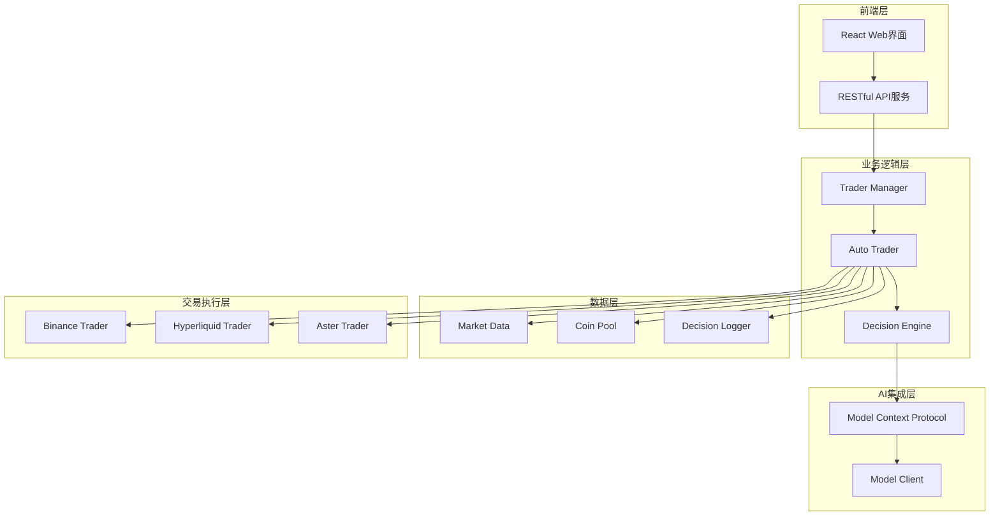
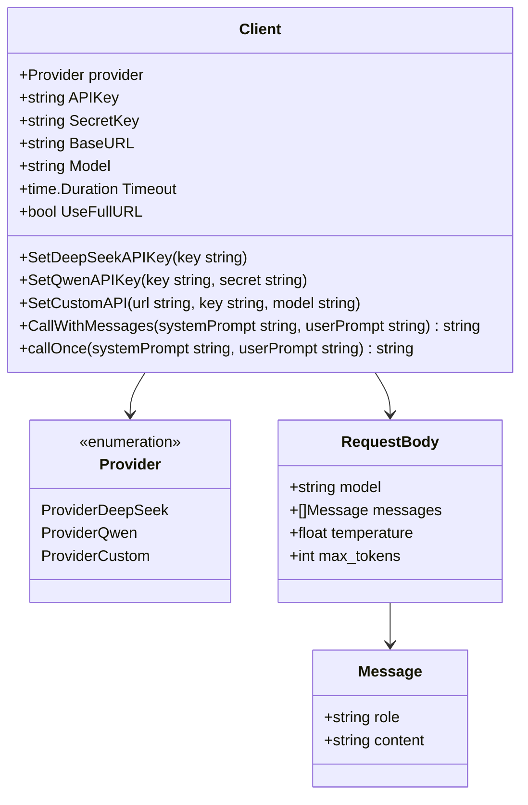
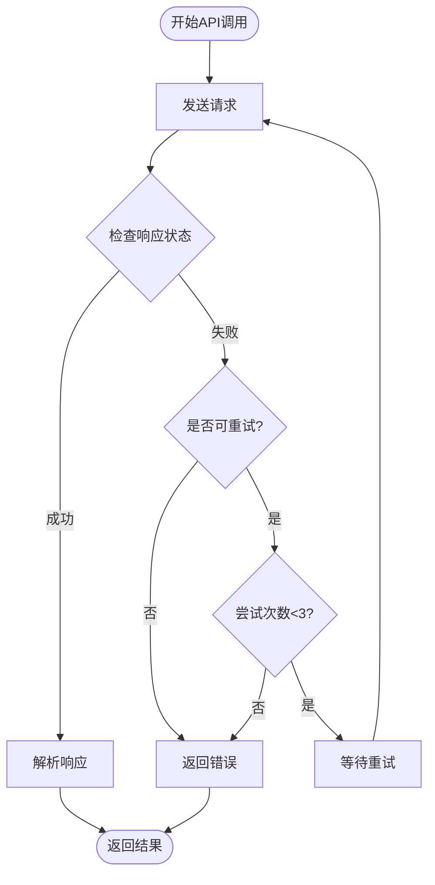
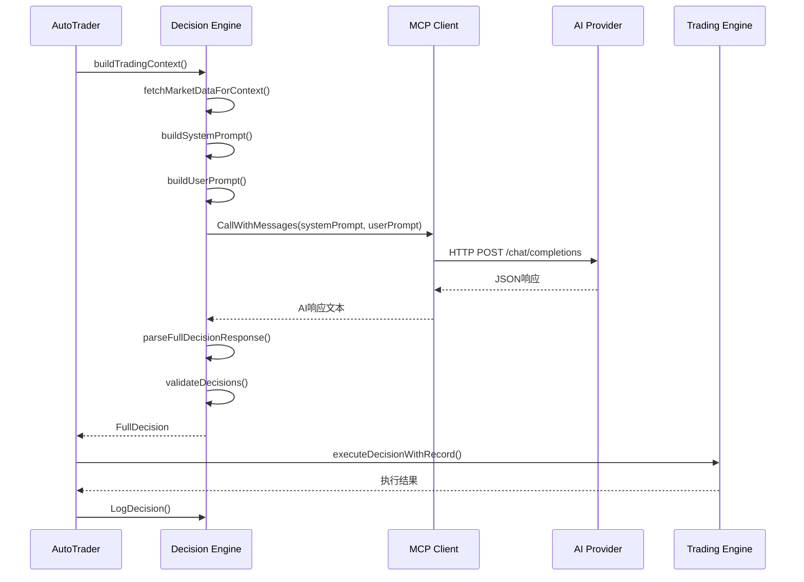

# AI模型集成权威指南

<cite>
**本文档引用的文件**
- [mcp/client.go](file://mcp/client.go)
- [CUSTOM_API.md](file://CUSTOM_API.md)
- [decision/engine.go](file://decision/engine.go)
- [config/config.go](file://config/config.go)
- [trader/auto_trader.go](file://trader/auto_trader.go)
- [trader/interface.go](file://trader/interface.go)
- [market/data.go](file://market/data.go)
- [README.md](file://README.md)
</cite>

## 目录
1. [简介](#简介)
2. [项目架构概览](#项目架构概览)
3. [AI模型提供商集成](#ai模型提供商集成)
4. [Model Context Protocol实现](#model-context-protocol实现)
5. [自定义API集成指南](#自定义api集成指南)
6. [AI决策流程详解](#ai决策流程详解)
7. [成本估算与性能特点](#成本估算与性能特点)
8. [最佳实践与优化建议](#最佳实践与优化建议)
9. [故障排除指南](#故障排除指南)
10. [总结](#总结)

## 简介

NOFX是一个基于人工智能的加密货币交易操作系统，采用统一的架构设计，支持多种AI模型提供商的无缝集成。本指南将详细介绍如何集成DeepSeek、Qwen两大主流AI模型，以及如何集成自定义的大语言模型API，为开发者提供完整的AI模型集成解决方案。

## 项目架构概览

NOFX采用模块化的微服务架构，核心组件围绕AI决策引擎构建：



**图表来源**
- [trader/auto_trader.go](file://trader/auto_trader.go#L1-L50)
- [manager/trader_manager.go](file://manager/trader_manager.go#L1-L30)

**章节来源**
- [README.md](file://README.md#L1-L100)
- [trader/auto_trader.go](file://trader/auto_trader.go#L1-L100)

## AI模型提供商集成

### DeepSeek集成

DeepSeek是目前最经济高效的AI模型选择，特别适合高频交易场景：

#### 集成步骤

1. **获取API密钥**
   - 访问：[https://platform.deepseek.com](https://platform.deepseek.com)
   - 注册并完成验证
   - 充值账户（推荐$20-50用于测试）
   - 创建API密钥（以`sk-`开头）

2. **配置集成**
```go
// 在AutoTrader配置中设置
mcpClient.SetDeepSeekAPIKey("sk-your-deepseek-key")
```

#### 性能特点
- **响应速度**：平均响应时间<2秒
- **成本效益**：每百万tokens约$0.14
- **适用场景**：高频交易、实时决策
- **优势**：全球可用，无需VPN

### Qwen（阿里云通义千问）集成

Qwen提供强大的中文理解和处理能力，适合需要深度语义分析的场景：

#### 集成步骤

1. **获取API密钥**
   - 访问：[https://dashscope.aliyuncs.com](https://dashscope.aliyuncs.com)
   - 使用阿里云账号注册
   - 开通DashScope服务
   - 创建API密钥

2. **配置集成**
```go
// 在AutoTrader配置中设置
mcpClient.SetQwenAPIKey("sk-your-qwen-key", "")
```

#### 性能特点
- **语言优势**：优秀的中文处理能力
- **模型选择**：支持qwen-turbo、qwen-plus、qwen-max
- **响应质量**：适合复杂推理任务
- **注意事项**：可能需要中国手机号注册

**章节来源**
- [mcp/client.go](file://mcp/client.go#L40-L80)
- [config/config.go](file://config/config.go#L150-L200)

## Model Context Protocol实现

### 核心架构设计

MCP（Model Context Protocol）是NOFX的核心通信协议，负责封装和管理AI API调用：



**图表来源**
- [mcp/client.go](file://mcp/client.go#L15-L50)

### API调用封装机制

#### 请求构建流程

1. **消息格式标准化**
   ```go
   // 构建messages数组
   messages := []map[string]string{}
   
   // 添加system message（如果存在）
   if systemPrompt != "" {
       messages = append(messages, map[string]string{
           "role":    "system",
           "content": systemPrompt,
       })
   }
   
   // 添加user message
   messages = append(messages, map[string]string{
       "role":    "user",
       "content": userPrompt,
   })
   ```

2. **请求体构建**
   ```go
   requestBody := map[string]interface{}{
       "model":       cfg.Model,
       "messages":    messages,
       "temperature": 0.5,  // 降低温度提高JSON稳定性
       "max_tokens":  2000, // 限制响应长度
   }
   ```

3. **认证机制**
   ```go
   // 根据Provider设置不同的认证头
   switch cfg.Provider {
   case ProviderDeepSeek:
       req.Header.Set("Authorization", fmt.Sprintf("Bearer %s", cfg.APIKey))
   case ProviderQwen:
       req.Header.Set("Authorization", fmt.Sprintf("Bearer %s", cfg.APIKey))
   default:
       req.Header.Set("Authorization", fmt.Sprintf("Bearer %s", cfg.APIKey))
   }
   ```

### 错误处理与重试机制

#### 重试策略设计



**图表来源**
- [mcp/client.go](file://mcp/client.go#L80-L130)

#### 可重试错误类型

系统自动识别以下类型的错误并进行重试：
- 网络超时
- 连接重置
- 主机不可达
- 临时故障

**章节来源**
- [mcp/client.go](file://mcp/client.go#L130-L247)

## 自定义API集成指南

### 接口规范要求

自定义API必须遵循OpenAI兼容格式：

#### 必需特性
1. **HTTP方法**：支持`POST`请求
2. **端点路径**：`/chat/completions`（或使用特殊URL格式）
3. **认证方式**：`Authorization: Bearer {api_key}`
4. **响应格式**：标准OpenAI JSON格式

#### URL配置格式

```json
{
  "custom_api_url": "https://api.example.com/v1",
  "custom_api_key": "your-api-key",
  "custom_model_name": "gpt-4o"
}
```

#### 特殊用法：完整自定义路径

对于需要使用完整路径的API，可在URL末尾添加`#`：

```json
{
  "custom_api_url": "https://api.example.com/v2/ai/chat/completions#",
  "custom_api_key": "your-api-key",
  "custom_model_name": "custom-model"
}
```

### 支持的部署方案

#### 1. OpenAI官方API
```json
{
  "ai_model": "custom",
  "custom_api_url": "https://api.openai.com/v1",
  "custom_api_key": "sk-proj-xxxxx",
  "custom_model_name": "gpt-4o"
}
```

#### 2. OpenRouter多模型访问
```json
{
  "ai_model": "custom",
  "custom_api_url": "https://openrouter.ai/api/v1",
  "custom_api_key": "sk-or-xxxxx",
  "custom_model_name": "anthropic/claude-3.5-sonnet"
}
```

#### 3. 本地部署模型
```json
{
  "ai_model": "custom",
  "custom_api_url": "http://localhost:11434/v1",
  "custom_api_key": "ollama",
  "custom_model_name": "llama3.1:70b"
}
```

#### 4. Azure OpenAI
```json
{
  "ai_model": "custom",
  "custom_api_url": "https://your-resource.openai.azure.com/openai/deployments/your-deployment",
  "custom_api_key": "your-azure-api-key",
  "custom_model_name": "gpt-4"
}
```

### 配置验证与故障排除

#### 常见配置错误

| 错误信息 | 原因 | 解决方案 |
|---------|------|----------|
| `使用自定义API时必须配置custom_api_url` | 缺少必要字段 | 确保配置了`custom_api_url`、`custom_api_key`和`custom_model_name` |
| URL格式错误 | 包含`/chat/completions` | 移除自动添加的路径，保持Base URL格式 |
| API密钥无效 | 密钥格式或权限问题 | 验证密钥有效性，检查API权限设置 |
| 模型名称错误 | 模型不存在或拼写错误 | 确认模型名称与API提供商一致 |

**章节来源**
- [CUSTOM_API.md](file://CUSTOM_API.md#L1-L206)
- [config/config.go](file://config/config.go#L100-L150)

## AI决策流程详解

### 决策引擎架构

AI决策流程采用Chain of Thought（思维链）推理模式，结合历史数据分析和实时市场信息：



**图表来源**
- [decision/engine.go](file://decision/engine.go#L90-L140)
- [trader/auto_trader.go](file://trader/auto_trader.go#L200-L300)

### 上下文构建机制

#### 市场数据获取

系统自动获取多维度市场数据：

1. **账户信息**：总权益、可用余额、持仓数量
2. **持仓分析**：实时价格、盈亏百分比、持仓时长
3. **候选币种**：AI500评分、OI Top排名、技术指标
4. **历史表现**：夏普比率、胜率统计、风险调整收益

#### 数据预处理

```go
// 构建决策上下文
ctx := &decision.Context{
    CurrentTime:     time.Now().Format("2006-01-02 15:04:05"),
    RuntimeMinutes:  int(time.Since(at.startTime).Minutes()),
    CallCount:       at.callCount,
    BTCETHLeverage:  at.config.BTCETHLeverage,
    AltcoinLeverage: at.config.AltcoinLeverage,
    Account: decision.AccountInfo{
        TotalEquity:      totalEquity,
        AvailableBalance: availableBalance,
        TotalPnL:         totalPnL,
        TotalPnLPct:      totalPnLPct,
        MarginUsed:       totalMarginUsed,
        MarginUsedPct:    marginUsedPct,
        PositionCount:    len(positionInfos),
    },
    Positions:      positionInfos,
    CandidateCoins: candidateCoins,
    Performance:    performance,
}
```

### 提示词工程

#### System Prompt设计原则

1. **明确目标**：最大化夏普比率
2. **硬约束**：风险回报比≥1:3，最多3个持仓
3. **行为指导**：高质量交易，耐心持有
4. **输出格式**：思维链分析+JSON决策数组

#### User Prompt动态构建

系统根据实时市场数据动态构建用户提示：

```go
// 动态市场数据展示
sb.WriteString(fmt.Sprintf("**BTC**: %.2f (1h: %+.2f%%, 4h: %+.2f%%) | MACD: %.4f | RSI: %.2f\n\n",
    btcData.CurrentPrice, btcData.PriceChange1h, btcData.PriceChange4h,
    btcData.CurrentMACD, btcData.CurrentRSI7))

// 账户状态展示
sb.WriteString(fmt.Sprintf("**账户**: 净值%.2f | 余额%.2f (%.1f%%) | 盈亏%+.2f%% | 保证金%.1f%% | 持仓%d个\n\n",
    ctx.Account.TotalEquity, ctx.Account.AvailableBalance,
    (ctx.Account.AvailableBalance/ctx.Account.TotalEquity)*100,
    ctx.Account.TotalPnLPct, ctx.Account.MarginUsedPct, ctx.Account.PositionCount))
```

### 决策验证与执行

#### 决策验证规则

1. **动作有效性**：支持open_long、open_short、close_long、close_short、hold、wait
2. **参数完整性**：开仓操作必须提供完整参数
3. **风险控制**：止损止盈合理，风险回报比≥3:1
4. **仓位限制**：单币种仓位不超过账户净值的1.5-10倍

#### 执行优先级

```go
// 决策排序：确保先平仓后开仓
sortedDecisions := sortDecisionsByPriority(decision.Decisions)

log.Println("🔄 执行顺序（已优化）: 先平仓→后开仓")
for i, d := range sortedDecisions {
    log.Printf("  [%d] %s %s", i+1, d.Symbol, d.Action)
}
```

**章节来源**
- [decision/engine.go](file://decision/engine.go#L140-L200)
- [decision/engine.go](file://decision/engine.go#L400-L500)

## 成本估算与性能特点

### DeepSeek成本分析

#### 价格结构
- **单价**：约$0.14/百万tokens
- **平均token消耗**：约1500-2000 tokens/请求
- **每日成本**：约$0.21-$0.28（按3分钟间隔计算）

#### 性能特点
- **响应时间**：<2秒（95%分位）
- **并发支持**：支持多实例部署
- **稳定性**：全球CDN加速，可用性>99.9%

### Qwen成本分析

#### 价格结构
- **基础模型**：约$0.015/百万tokens
- **高级模型**：约$0.03/百万tokens
- **中文优化**：更适合中文语境分析

#### 性能特点
- **语言优势**：中文理解准确率>95%
- **推理能力**：适合复杂策略制定
- **地区限制**：可能需要特定网络环境

### 自定义API成本估算

#### 本地部署成本
- **硬件成本**：GPU服务器投资
- **运维成本**：电力和冷却费用
- **维护成本**：模型更新和优化

#### 云端API成本
- **按量计费**：根据实际使用量收费
- **预留实例**：长期使用可享受折扣
- **流量费用**：网络传输成本

### 性能基准测试

| 模型类型 | 响应时间 | 成本效率 | 适用场景 |
|---------|----------|----------|----------|
| DeepSeek | 1.2-2.0s | 高 | 高频交易 |
| Qwen | 1.5-2.5s | 中 | 中频交易 |
| GPT-4 | 2.0-3.5s | 低 | 策略研究 |
| 本地部署 | 3.0-8.0s | 中 | 隐私敏感 |

**章节来源**
- [README.md](file://README.md#L373-L411)

## 最佳实践与优化建议

### 提示词优化策略

#### 1. 明确指令结构
```markdown
# 核心目标
最大化夏普比率（Sharpe Ratio）

# 硬约束
1. 风险回报比 ≥ 1:3
2. 最多持仓3个币种
3. 单币仓位 ≤ 账户净值×1.5（山寨币）或10（BTC/ETH）

# 决策流程
1. 分析夏普比率
2. 评估持仓趋势
3. 寻找新机会
4. 输出JSON决策
```

#### 2. 数据驱动提示
- **市场状态**：明确当前市场趋势
- **持仓分析**：提供详细的持仓信息
- **技术指标**：包含关键的技术指标序列
- **历史表现**：展示AI的历史决策效果

#### 3. 格式化输出要求
```markdown
# 输出格式
1. 思维链分析（纯文本）
2. JSON决策数组（结构化数据）

```json
[
  {
    "symbol": "BTCUSDT",
    "action": "open_short",
    "leverage": 5,
    "position_size_usd": 500,
    "stop_loss": 97000,
    "take_profit": 91000,
    "confidence": 85,
    "risk_usd": 300,
    "reasoning": "下跌趋势+MACD死叉"
  }
]
```
```

### 错误处理最佳实践

#### 1. 重试策略优化
```go
// 指数退避重试
waitTime := time.Duration(attempt) * 2 * time.Second
fmt.Printf("⏳ 等待%v后重试...\n", waitTime)
time.Sleep(waitTime)
```

#### 2. 错误分类处理
```go
// 可重试错误类型
retryableErrors := []string{
    "EOF", "timeout", "connection reset", 
    "connection refused", "temporary failure", "no such host"
}
```

#### 3. 降级策略
- **模型切换**：主模型失败时自动切换备用模型
- **缓存机制**：缓存历史决策以应对API中断
- **本地推理**：在必要时使用本地模型

### 性能优化建议

#### 1. 网络优化
- **连接池**：复用HTTP连接减少握手开销
- **超时设置**：合理设置请求超时时间
- **压缩传输**：启用gzip压缩减少传输量

#### 2. 缓存策略
```go
// 市场数据缓存
cache := NewMarketDataCache()
data, exists := cache.Get(symbol)
if !exists {
    data = fetchDataFromAPI(symbol)
    cache.Set(symbol, data)
}
```

#### 3. 并发控制
- **请求限流**：避免超出API配额
- **资源隔离**：不同模型使用独立的客户端
- **健康检查**：定期检测API可用性

### 监控与日志

#### 1. 关键指标监控
- **响应时间**：平均响应时间和P95延迟
- **成功率**：API调用成功率
- **成本跟踪**：每日/每月API使用成本
- **错误分布**：各类错误的发生频率

#### 2. 日志记录规范
```go
// 结构化日志
log.WithFields(log.Fields{
    "provider": "deepseek",
    "request_id": requestId,
    "duration_ms": durationMs,
    "status": statusCode,
    "error": errorMessage,
}).Info("AI API call completed")
```

**章节来源**
- [mcp/client.go](file://mcp/client.go#L100-L150)
- [decision/engine.go](file://decision/engine.go#L500-L600)

## 故障排除指南

### 常见问题诊断

#### 1. API密钥问题

**症状**：`API返回错误 (status 401): Unauthorized`

**排查步骤**：
1. 验证API密钥格式（以`sk-`开头）
2. 检查密钥是否过期
3. 确认密钥权限设置
4. 测试密钥有效性

**解决方案**：
```go
// 密钥验证函数
func validateAPIKey(key string) error {
    if !strings.HasPrefix(key, "sk-") {
        return fmt.Errorf("API密钥格式错误，必须以'sk-'开头")
    }
    // 发送测试请求验证密钥
    return testAPIKey(key)
}
```

#### 2. 网络连接问题

**症状**：`发送请求失败: dial tcp: connection refused`

**排查步骤**：
1. 检查网络连通性
2. 验证防火墙设置
3. 确认DNS解析正常
4. 测试代理配置

**解决方案**：
```go
// 连接测试
func testConnection(url string) error {
    client := &http.Client{Timeout: 10 * time.Second}
    resp, err := client.Head(url)
    if err != nil {
        return fmt.Errorf("连接测试失败: %w", err)
    }
    defer resp.Body.Close()
    return nil
}
```

#### 3. 响应解析错误

**症状**：`解析响应失败: invalid character '...' looking for beginning of value`

**排查步骤**：
1. 检查响应内容格式
2. 验证JSON结构
3. 处理特殊字符编码
4. 检查响应截断

**解决方案**：
```go
// JSON修复函数
func fixJSONFormatting(jsonStr string) string {
    // 替换中文引号为英文引号
    jsonStr = strings.ReplaceAll(jsonStr, "\u201c", "\"")
    jsonStr = strings.ReplaceAll(jsonStr, "\u201d", "\"")
    // 移除可能导致解析错误的特殊字符
    jsonStr = regexp.MustCompile(`[^\x20-\x7E]`).ReplaceAllString(jsonStr, "")
    return jsonStr
}
```

### 性能问题诊断

#### 1. 响应时间过长

**诊断指标**：
- 平均响应时间 > 5秒
- P95延迟 > 10秒
- 超时请求比例 > 5%

**优化措施**：
```go
// 超时优化
client := &http.Client{
    Timeout: 120 * time.Second, // 增加到120秒
    Transport: &http.Transport{
        MaxIdleConns:        100,
        IdleConnTimeout:     90 * time.Second,
        DisableCompression:  false,
    },
}
```

#### 2. 成本过高

**诊断指标**：
- 每日API调用次数异常
- 单次请求token消耗过高
- 频繁重试导致成本增加

**优化措施**：
- 实施请求去重
- 优化提示词长度
- 调整重试策略

### 配置问题解决

#### 1. 多AI对比配置

```json
{
  "traders": [
    {
      "id": "deepseek_trader",
      "ai_model": "deepseek",
      "deepseek_key": "sk-xxxxx",
      "initial_balance": 1000,
      "scan_interval_minutes": 3
    },
    {
      "id": "gpt4_trader",
      "ai_model": "custom",
      "custom_api_url": "https://api.openai.com/v1",
      "custom_api_key": "sk-xxxxx",
      "custom_model_name": "gpt-4o",
      "initial_balance": 1000,
      "scan_interval_minutes": 3
    }
  ]
}
```

#### 2. 交换配置

```json
{
  "exchange": "binance",
  "binance_api_key": "your_api_key",
  "binance_secret_key": "your_secret_key"
}
```

**章节来源**
- [mcp/client.go](file://mcp/client.go#L220-L247)
- [CUSTOM_API.md](file://CUSTOM_API.md#L160-L206)

## 总结

NOFX的AI模型集成体系提供了完整的解决方案，支持DeepSeek、Qwen和自定义API的无缝集成。通过Model Context Protocol的标准化接口，系统实现了高度的可扩展性和灵活性。

### 核心优势

1. **多模型支持**：统一接口支持多种AI提供商
2. **高可用性**：完善的错误处理和重试机制
3. **成本优化**：灵活的成本控制和性能调优
4. **易于集成**：标准化的API接口和配置方式

### 发展方向

随着AI技术的不断发展，NOFX将继续扩展支持更多的AI模型，优化决策算法，并提供更丰富的功能特性。开发者可以通过本指南快速集成各种AI模型，构建强大的自动化交易系统。

### 最佳实践总结

1. **选择合适的模型**：根据交易频率和成本预算选择
2. **优化提示词**：精心设计的提示词能显著提升决策质量
3. **实施监控**：建立完善的监控和日志系统
4. **持续优化**：根据实际效果不断调整和优化

通过遵循本指南的最佳实践，开发者可以充分发挥AI模型的潜力，构建稳定高效的自动化交易系统。