# DeepSeek模型集成详细指南

<cite>
**本文档引用的文件**
- [mcp/client.go](file://mcp/client.go)
- [decision/engine.go](file://decision/engine.go)
- [trader/auto_trader.go](file://trader/auto_trader.go)
- [config/config.go](file://config/config.go)
- [CUSTOM_API.md](file://CUSTOM_API.md)
- [README.md](file://README.md)
</cite>

## 目录
1. [简介](#简介)
2. [DeepSeek API配置](#deepseek-api配置)
3. [客户端初始化](#客户端初始化)
4. [系统架构概览](#系统架构概览)
5. [深度集成分析](#深度集成分析)
6. [错误处理机制](#错误处理机制)
7. [性能优化策略](#性能优化策略)
8. [最佳实践指南](#最佳实践指南)
9. [故障排除](#故障排除)
10. [总结](#总结)

## 简介

DeepSeek是全球领先的AI模型提供商，以其卓越的交易决策能力和极具竞争力的成本优势而闻名。在NOFX系统中，DeepSeek模型被广泛应用于加密货币市场的自动化交易决策，为用户提供高质量的AI交易建议。

### DeepSeek的核心优势

- **成本效益**：相比GPT-4等其他AI模型，DeepSeek的价格仅为1/10，显著降低交易成本
- **响应速度**：快速的API响应时间，确保及时的交易决策
- **交易质量**：专为金融交易场景优化，提供高质量的决策建议
- **全球可用**：无需VPN即可在全球范围内使用

## DeepSeek API配置

### 默认配置参数

DeepSeek客户端采用经过优化的默认配置，确保最佳的交易决策效果：

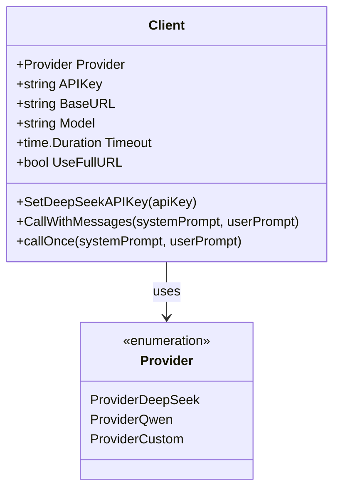

**图表来源**
- [mcp/client.go](file://mcp/client.go#L15-L25)

#### 核心配置参数

| 参数 | 默认值 | 说明 |
|------|--------|------|
| BaseURL | `https://api.deepseek.com/v1` | DeepSeek官方API端点 |
| Model | `deepseek-chat` | DeepSeek聊天模型 |
| Timeout | `120s` | 请求超时时间（增加到120秒以适应复杂分析） |
| Temperature | `0.5` | 控制输出随机性，降低温度提高JSON格式稳定性 |
| MaxTokens | `2000` | 最大令牌数限制 |

**章节来源**
- [mcp/client.go](file://mcp/client.go#L26-L35)

### API密钥设置方法

DeepSeek API密钥的设置通过`SetDeepSeekAPIKey`方法实现：

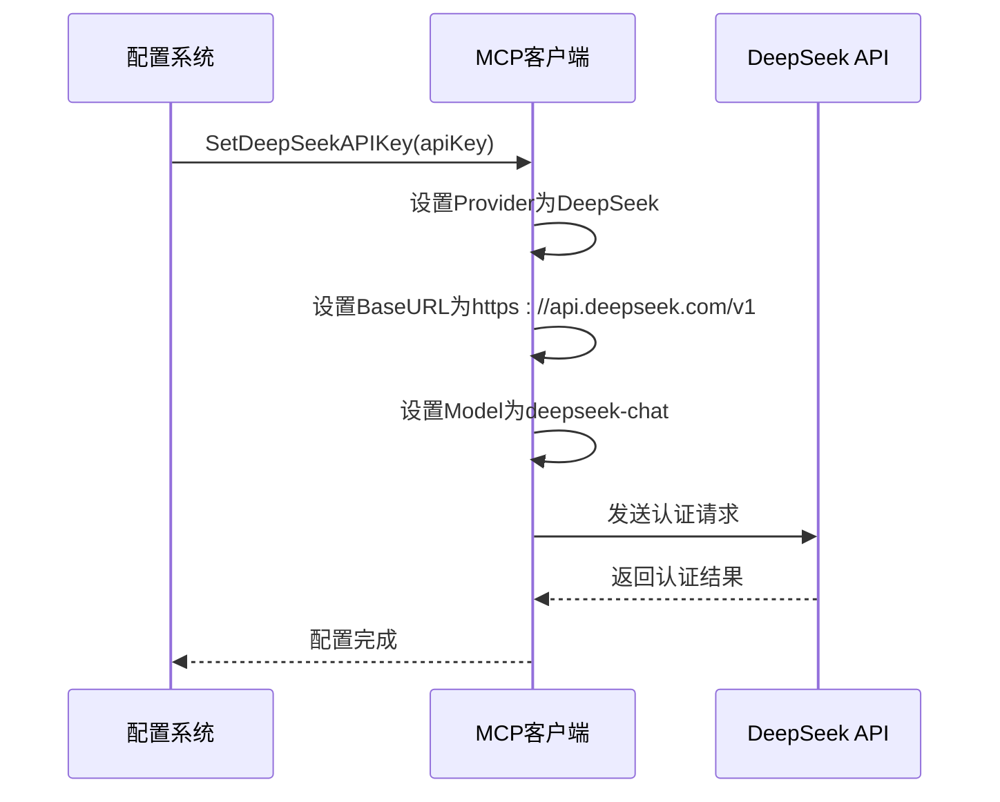

**图表来源**
- [mcp/client.go](file://mcp/client.go#L42-L47)

**章节来源**
- [mcp/client.go](file://mcp/client.go#L42-L47)

## 客户端初始化

### 自动交易器中的DeepSeek集成

在自动交易器中，DeepSeek的初始化遵循标准化流程：

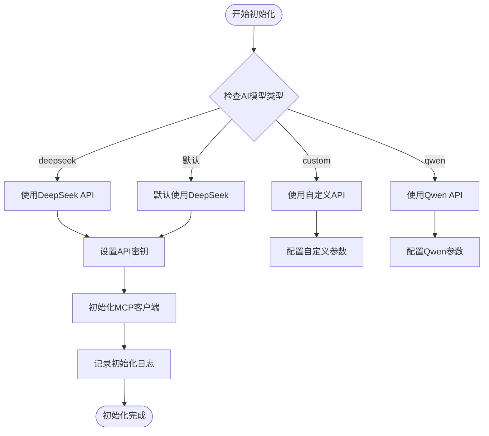

**图表来源**
- [trader/auto_trader.go](file://trader/auto_trader.go#L87-L133)

#### 初始化代码示例

系统会自动检测并初始化DeepSeek客户端：

**章节来源**
- [trader/auto_trader.go](file://trader/auto_trader.go#L108-L115)

### 配置文件设置

在`config.json`中配置DeepSeek API密钥：

```json
{
  "traders": [
    {
      "id": "deepseek_trader",
      "name": "DeepSeek AI Trader",
      "ai_model": "deepseek",
      "binance_api_key": "YOUR_BINANCE_API_KEY",
      "binance_secret_key": "YOUR_BINANCE_SECRET_KEY",
      "deepseek_key": "sk-xxxxxxxxxxxxx",
      "initial_balance": 1000.0,
      "scan_interval_minutes": 3
    }
  ]
}
```

**章节来源**
- [config/config.go](file://config/config.go#L1-L40)

## 系统架构概览

### DeepSeek在NOFX架构中的位置

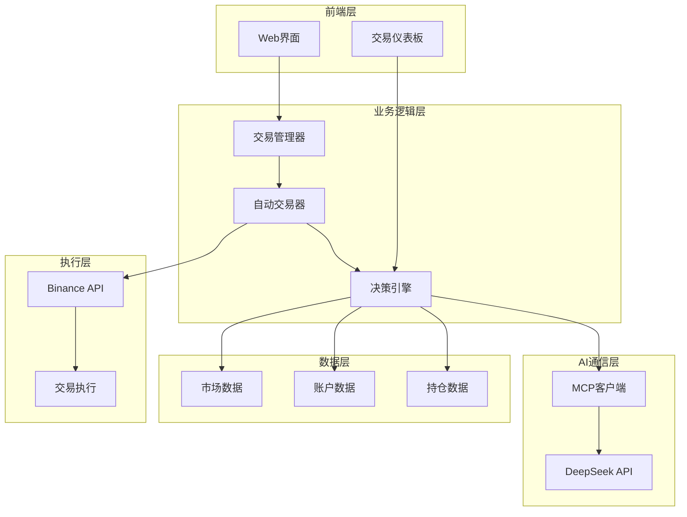

**图表来源**
- [decision/engine.go](file://decision/engine.go#L1-L50)
- [mcp/client.go](file://mcp/client.go#L1-L25)

### 交易决策流程

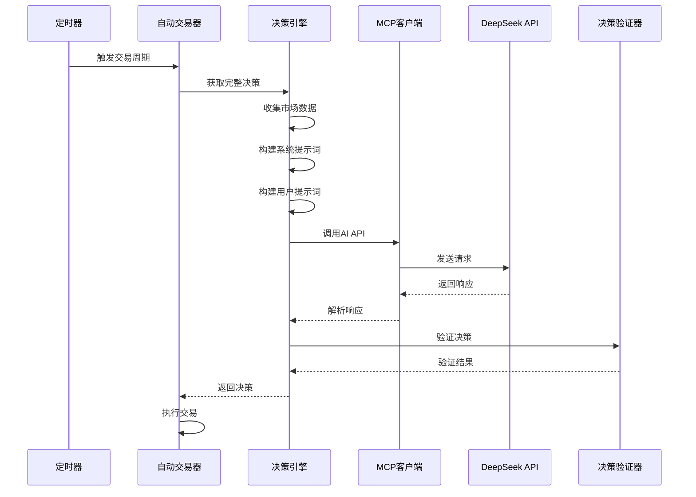

**图表来源**
- [decision/engine.go](file://decision/engine.go#L100-L150)
- [mcp/client.go](file://mcp/client.go#L68-L113)

**章节来源**
- [decision/engine.go](file://decision/engine.go#L100-L150)

## 深度集成分析

### 系统提示词构建

DeepSeek的系统提示词经过精心设计，包含完整的交易指导原则：

#### 核心交易原则

DeepSeek遵循严格的交易原则，确保高质量的决策输出：

| 原则类别 | 具体要求 | 说明 |
|----------|----------|------|
| 夏普比率优化 | 最大化夏普比率 | 高质量交易（高胜率、大盈亏比）→ 提升夏普 |
| 风险控制 | 风险回报比≥1:3 | 冒1%风险，赚3%+收益 |
| 持仓限制 | 最多3个币种 | 质量>数量 |
| 仓位管理 | 山寨币0.8-1.5U，BTC/ETH 5-10U | 基于账户净值 |
| 保证金控制 | 总使用率≤90% | AI可控分配 |

#### 交易频率认知

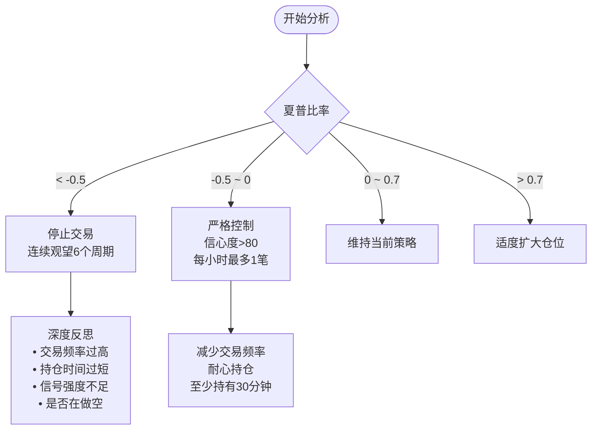

**图表来源**
- [decision/engine.go](file://decision/engine.go#L200-L250)

**章节来源**
- [decision/engine.go](file://decision/engine.go#L200-L250)

### 用户提示词构建

用户提示词包含实时的市场数据和账户信息：

#### 市场数据格式

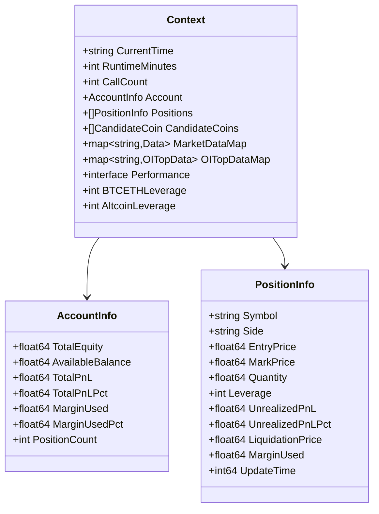

**图表来源**
- [decision/engine.go](file://decision/engine.go#L25-L60)

**章节来源**
- [decision/engine.go](file://decision/engine.go#L25-L60)

### JSON响应解析

DeepSeek返回的响应包含思维链分析和JSON决策数组：

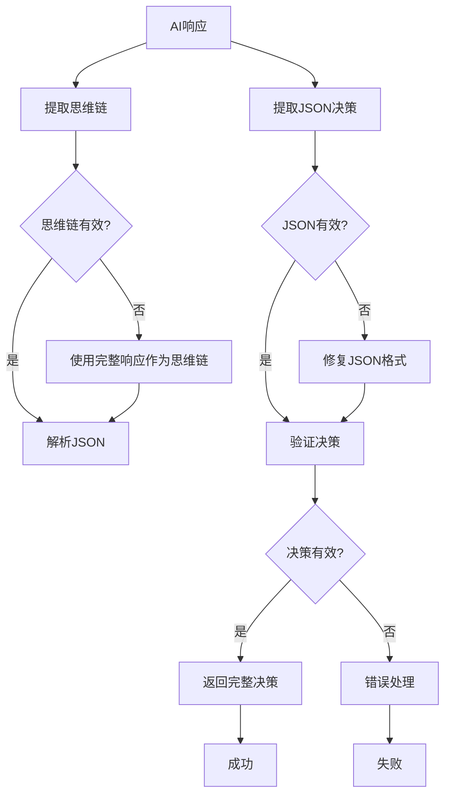

**图表来源**
- [decision/engine.go](file://decision/engine.go#L412-L489)

**章节来源**
- [decision/engine.go](file://decision/engine.go#L412-L489)

## 错误处理机制

### 网络超时和重试策略

DeepSeek客户端实现了完善的错误处理和重试机制：

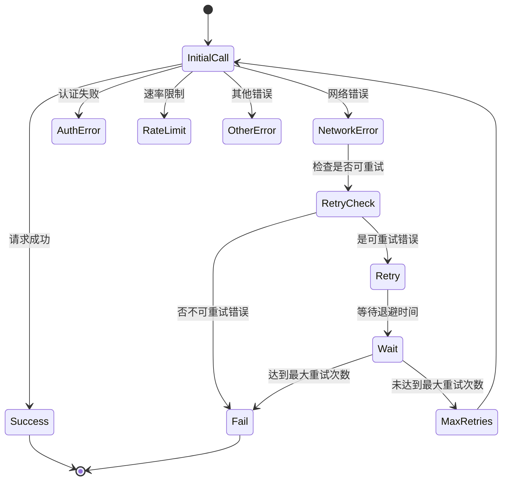

**图表来源**
- [mcp/client.go](file://mcp/client.go#L68-L113)

#### 可重试错误类型

系统识别以下类型的错误并实施相应的重试策略：

| 错误类型 | 描述 | 重试策略 |
|----------|------|----------|
| 网络超时 | 请求超时 | 指数退避，最多3次重试 |
| 连接重置 | 网络连接中断 | 指数退避，最多3次重试 |
| 连接拒绝 | 服务器拒绝连接 | 指数退避，最多3次重试 |
| 临时失败 | 临时性网络问题 | 指数退避，最多3次重试 |
| 主机不存在 | DNS解析失败 | 指数退避，最多3次重试 |

#### 重试算法实现

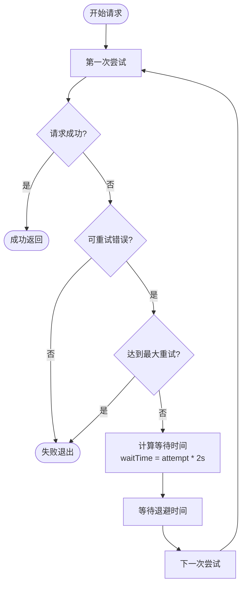

**图表来源**
- [mcp/client.go](file://mcp/client.go#L109-L130)

**章节来源**
- [mcp/client.go](file://mcp/client.go#L109-L130)

### 认证失败处理

当遇到认证失败时，系统会立即停止重试并报告错误：

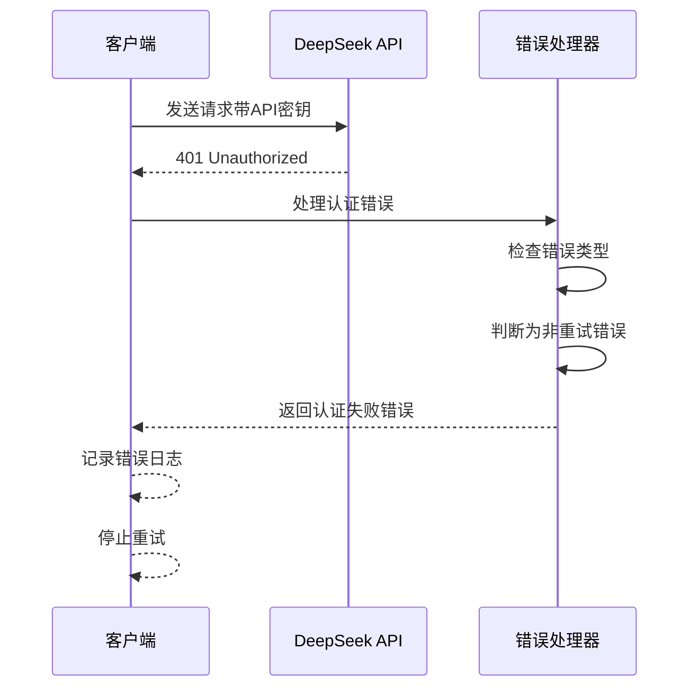

**图表来源**
- [mcp/client.go](file://mcp/client.go#L109-L115)

**章节来源**
- [mcp/client.go](file://mcp/client.go#L109-L115)

## 性能优化策略

### 温度参数优化

为了确保JSON格式的稳定性，DeepSeek客户端使用较低的温度参数：

| 参数 | 值 | 作用 |
|------|----|----- |
| Temperature | 0.5 | 降低随机性，提高JSON格式一致性 |
| MaxTokens | 2000 | 允许足够长度的思维链分析 |
| Timeout | 120s | 适应复杂的市场数据分析需求 |

### 响应格式优化

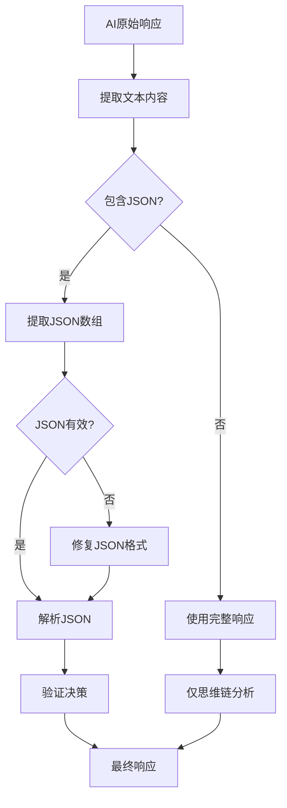

**图表来源**
- [decision/engine.go](file://decision/engine.go#L412-L458)

**章节来源**
- [decision/engine.go](file://decision/engine.go#L412-L458)

### 缓存和优化策略

虽然DeepSeek本身不提供内置缓存，但系统层面实现了多项优化：

- **并发数据获取**：同时获取多个币种的市场数据
- **智能过滤**：跳过流动性不足的低质量币种
- **指数退避**：智能的重试等待时间计算

## 最佳实践指南

### API密钥管理

1. **安全存储**：将API密钥存储在环境变量中，避免硬编码
2. **定期轮换**：定期更换API密钥以确保安全性
3. **权限控制**：为API密钥设置适当的权限范围

### 提示词优化

#### 系统提示词优化

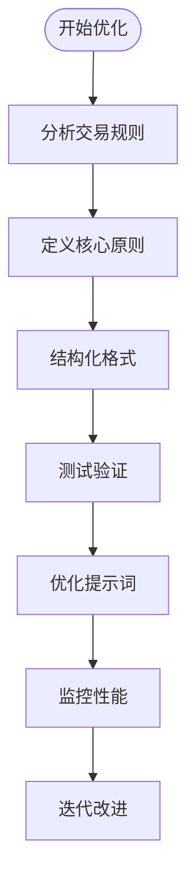

#### 用户提示词优化

- **数据完整性**：确保包含所有必要的市场数据
- **实时性**：使用最新的市场数据和账户信息
- **格式规范**：保持一致的数据格式和命名约定

### 成本控制策略

1. **合理设置超时**：平衡响应时间和成本
2. **智能重试**：避免不必要的重试操作
3. **监控使用量**：定期检查API使用情况

**章节来源**
- [mcp/client.go](file://mcp/client.go#L130-L150)

## 故障排除

### 常见问题及解决方案

#### 1. API密钥错误

**症状**：`AI API密钥未设置，请先调用 SetDeepSeekAPIKey()`

**解决方案**：
- 检查配置文件中的`deepseek_key`字段
- 确认API密钥格式正确（以`sk-`开头）
- 验证密钥是否有效且未过期

#### 2. 网络连接问题

**症状**：`发送请求失败: dial tcp: lookup api.deepseek.com`

**解决方案**：
- 检查网络连接状态
- 确认DNS解析正常
- 考虑使用代理或VPN

#### 3. 认证失败

**症状**：`API返回错误 (status 401): {"error": "invalid_api_key"}`

**解决方案**：
- 重新生成有效的API密钥
- 检查密钥格式和有效期
- 确认账户余额充足

#### 4. 响应解析错误

**症状**：`JSON解析失败: unexpected end of JSON input`

**解决方案**：
- 检查AI响应格式
- 验证JSON格式完整性
- 考虑调整提示词以获得更稳定的输出

### 调试技巧

1. **启用详细日志**：观察API调用过程中的详细信息
2. **检查网络状态**：确认网络连接稳定
3. **验证数据格式**：确保输入数据符合预期格式
4. **监控资源使用**：检查内存和CPU使用情况

**章节来源**
- [mcp/client.go](file://mcp/client.go#L203-L245)

## 总结

DeepSeek模型在NOFX系统中的集成体现了现代AI交易系统的最佳实践。通过精心设计的架构、完善的错误处理机制和优化的性能策略，DeepSeek为用户提供了一个高效、可靠且经济的AI交易决策解决方案。

### 关键优势总结

1. **成本效益**：相比其他AI模型，DeepSeek提供了极具竞争力的价格
2. **性能稳定**：完善的重试机制和错误处理确保服务稳定性
3. **功能完整**：支持复杂的交易决策和风险管理
4. **易于集成**：标准化的API接口简化了集成过程

### 未来发展方向

随着AI技术的不断发展，DeepSeek集成将在以下几个方面持续优化：

- **模型升级**：持续跟进DeepSeek的新版本模型
- **性能优化**：进一步提升响应速度和准确性
- **功能扩展**：支持更多交易策略和市场类型
- **用户体验**：改善监控界面和调试工具

通过深入理解和正确使用DeepSeek模型集成，用户可以充分发挥AI在交易决策中的优势，实现更加智能和高效的自动化交易。