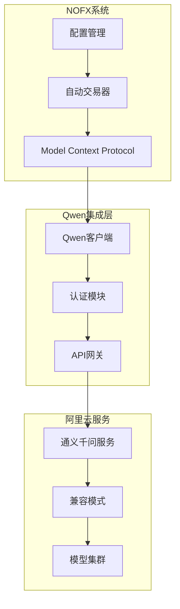
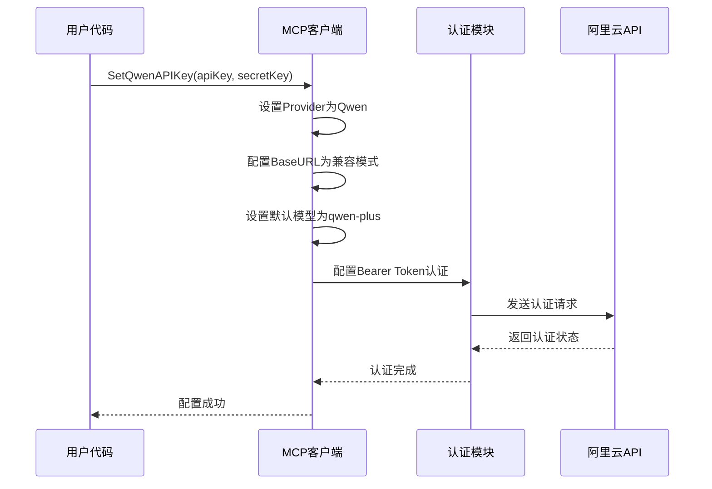
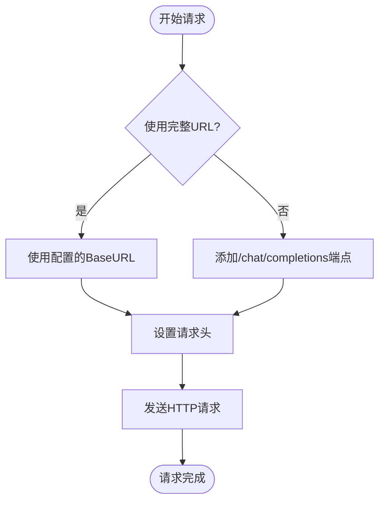
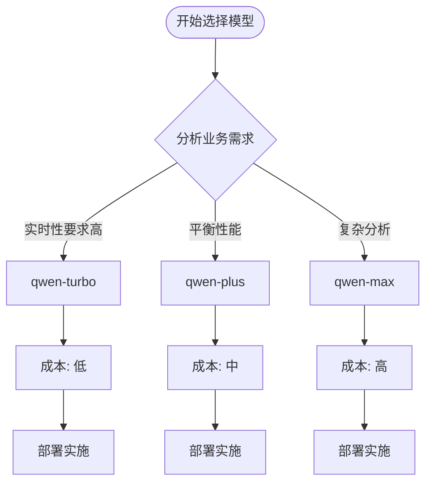
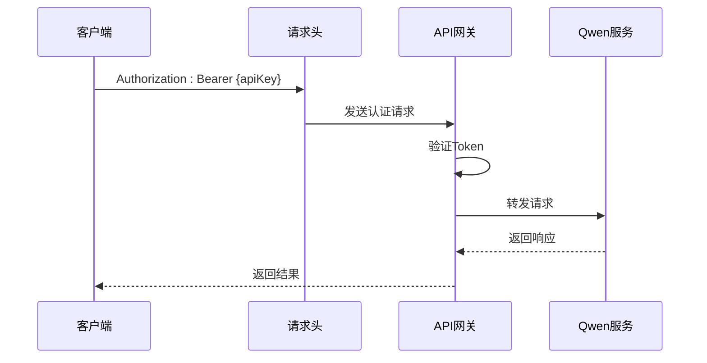
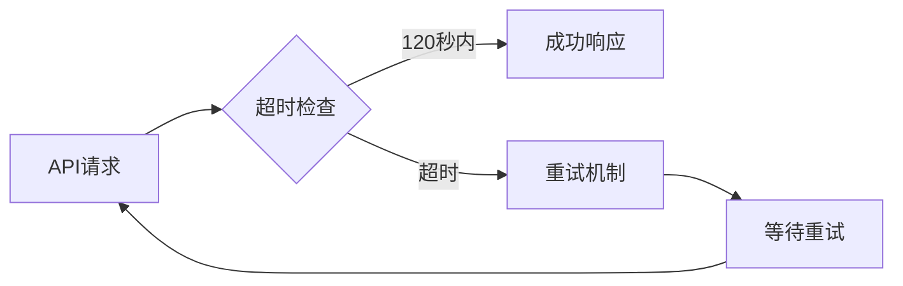
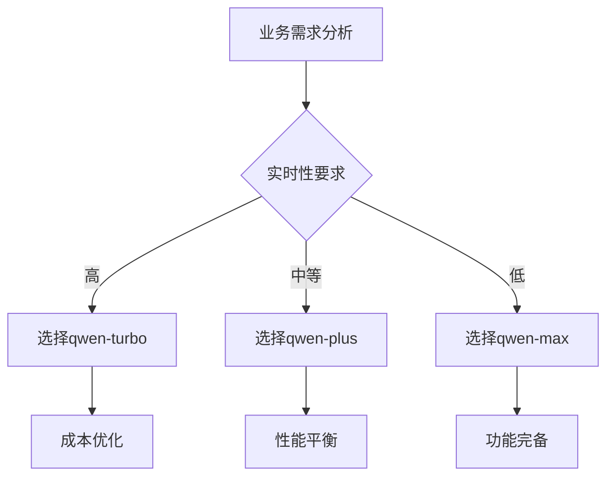

# Qwen模型集成

<cite>
**本文档引用的文件**
- [mcp/client.go](file://mcp/client.go)
- [config/config.go](file://config/config.go)
- [trader/auto_trader.go](file://trader/auto_trader.go)
- [CUSTOM_API.md](file://CUSTOM_API.md)
- [config.json.example](file://config.json.example)
- [README.md](file://README.md)
</cite>

## 目录
1. [简介](#简介)
2. [Qwen模型概述](#qwen模型概述)
3. [API配置详解](#api配置详解)
4. [BaseURL架构](#baseurl架构)
5. [模型类型与选择](#模型类型与选择)
6. [认证机制](#认证机制)
7. [配置示例](#配置示例)
8. [性能优化策略](#性能优化策略)
9. [故障排除](#故障排除)
10. [最佳实践](#最佳实践)

## 简介

Qwen模型是阿里巴巴集团旗下的通义千问系列大语言模型，专为中文场景设计，在金融分析、市场预测等领域表现出色。NOFX系统通过`mcp/client.go`中的`SetQwenAPIKey`方法实现了对Qwen模型的深度集成，为用户提供强大的AI交易决策能力。

## Qwen模型概述

### 核心特性

Qwen模型具有以下核心优势：
- **中文市场优化**：针对中文市场数据进行专门训练
- **金融领域专精**：内置金融知识图谱和市场分析能力
- **实时数据处理**：能够快速处理高频市场数据
- **多模态支持**：支持文本、图表等多种数据形式

### 技术架构



**图表来源**
- [mcp/client.go](file://mcp/client.go#L1-L247)
- [trader/auto_trader.go](file://trader/auto_trader.go#L1-L100)

## API配置详解

### SetQwenAPIKey方法

`SetQwenAPIKey`方法是Qwen模型集成的核心入口，负责配置API密钥和相关参数：



**图表来源**
- [mcp/client.go](file://mcp/client.go#L51-L57)

### 方法参数说明

| 参数 | 类型 | 必需 | 说明 |
|------|------|------|------|
| apiKey | string | 是 | 阿里云Qwen API密钥 |
| secretKey | string | 否 | 阿里云SecretKey（可选） |

**节来源**
- [mcp/client.go](file://mcp/client.go#L51-L57)

## BaseURL架构

### 兼容模式URL

Qwen模型采用阿里云的兼容模式，BaseURL为：
```
https://dashscope.aliyuncs.com/compatible-mode/v1
```

这种设计提供了以下优势：
- **标准化接口**：遵循OpenAI兼容协议
- **无缝迁移**：可轻松切换到其他兼容服务
- **统一认证**：使用Bearer Token认证方式

### URL构建逻辑



**图表来源**
- [mcp/client.go](file://mcp/client.go#L160-L170)

**节来源**
- [mcp/client.go](file://mcp/client.go#L55-L56)

## 模型类型与选择

### 支持的模型规格

Qwen模型提供多种规格以满足不同业务需求：

| 模型名称 | 性能特点 | 适用场景 | 成本效益 |
|----------|----------|----------|----------|
| qwen-turbo | 快速响应 | 实时交易决策 | 经济实惠 |
| qwen-plus | 平衡性能 | 一般交易分析 | 性价比高 |
| qwen-max | 强大能力 | 复杂策略分析 | 高性能 |

### 模型选择策略



**图表来源**
- [mcp/client.go](file://mcp/client.go#L57)

**节来源**
- [mcp/client.go](file://mcp/client.go#L57)

## 认证机制

### Bearer Token认证

Qwen采用Bearer Token认证方式，确保API调用的安全性：



**图表来源**
- [mcp/client.go](file://mcp/client.go#L180-L185)

### 认证配置

认证配置在`callOnce`方法中实现：
- **Provider判断**：区分不同AI提供商
- **Token格式**：`Bearer {apiKey}`
- **头部设置**：自动添加到HTTP请求头

**节来源**
- [mcp/client.go](file://mcp/client.go#L180-L185)

## 配置示例

### 基础配置示例

以下是使用Qwen模型的基础配置：

```json
{
  "traders": [
    {
      "id": "qwen_trader",
      "name": "Qwen AI交易员",
      "enabled": true,
      "ai_model": "qwen",
      "exchange": "binance",
      "binance_api_key": "YOUR_BINANCE_API_KEY",
      "binance_secret_key": "YOUR_BINANCE_SECRET_KEY",
      "qwen_key": "sk-your-qwen-api-key",
      "initial_balance": 1000.0,
      "scan_interval_minutes": 3
    }
  ],
  "leverage": {
    "btc_eth_leverage": 5,
    "altcoin_leverage": 5
  },
  "use_default_coins": true,
  "api_server_port": 8080
}
```

### 多模型对比配置

支持同时运行多个AI模型进行对比：

```json
{
  "traders": [
    {
      "id": "qwen_trader",
      "name": "Qwen交易员",
      "ai_model": "qwen",
      "qwen_key": "sk-your-qwen-key"
    },
    {
      "id": "deepseek_trader", 
      "name": "DeepSeek交易员",
      "ai_model": "deepseek",
      "deepseek_key": "sk-your-deepseek-key"
    }
  ]
}
```

**节来源**
- [config.json.example](file://config.json.example#L15-L25)
- [config/config.go](file://config/config.go#L15-L16)

## 性能优化策略

### 超时配置

Qwen集成采用120秒的超时设置，适应复杂的市场分析需求：



**图表来源**
- [mcp/client.go](file://mcp/client.go#L32-L33)

### 重试机制

系统实现了智能重试机制：
- **最大重试次数**：3次
- **重试间隔**：指数退避（2秒、4秒、6秒）
- **重试条件**：仅在网络错误时重试

**节来源**
- [mcp/client.go](file://mcp/client.go#L70-L95)

## 故障排除

### 常见问题及解决方案

| 问题描述 | 可能原因 | 解决方案 |
|----------|----------|----------|
| API密钥无效 | 密钥格式错误 | 检查密钥格式和有效期 |
| 认证失败 | 网络连接问题 | 检查网络连接和防火墙设置 |
| 响应超时 | 网络延迟过高 | 调整超时设置或优化网络 |
| 模型不可用 | 服务维护 | 查看阿里云服务状态 |

### 调试技巧

1. **启用详细日志**：观察API调用过程
2. **检查网络连接**：确保能够访问阿里云服务
3. **验证密钥格式**：确认API密钥正确无误
4. **测试基础功能**：先进行简单的API调用测试

**节来源**
- [mcp/client.go](file://mcp/client.go#L190-L205)

## 最佳实践

### 业务需求匹配

根据具体业务需求选择合适的模型规格：



### 成本控制策略

1. **模型选择**：根据需求选择合适规格
2. **调用频率**：合理设置扫描间隔
3. **并发控制**：避免不必要的API调用
4. **缓存机制**：利用系统缓存减少重复调用

### 安全考虑

1. **密钥管理**：妥善保管API密钥
2. **网络安全**：使用HTTPS加密通信
3. **访问控制**：限制API访问权限
4. **监控审计**：定期检查API使用情况

通过以上配置和优化策略，Qwen模型能够在NOFX系统中发挥出色的AI交易决策能力，为用户提供稳定、高效的智能交易解决方案。