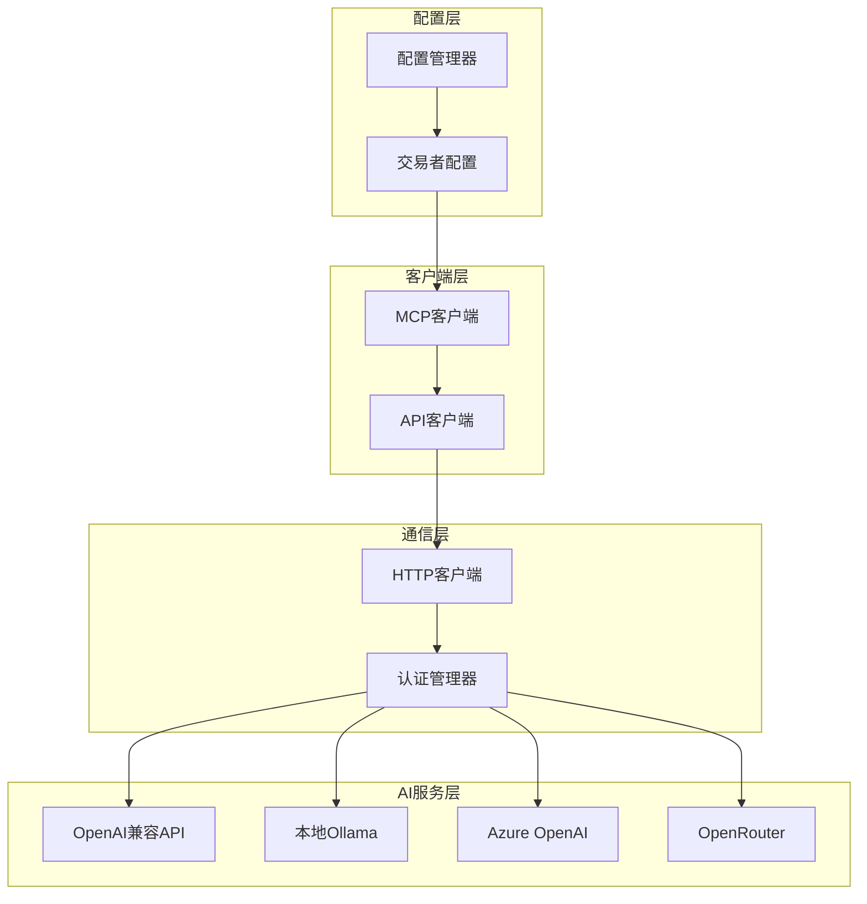
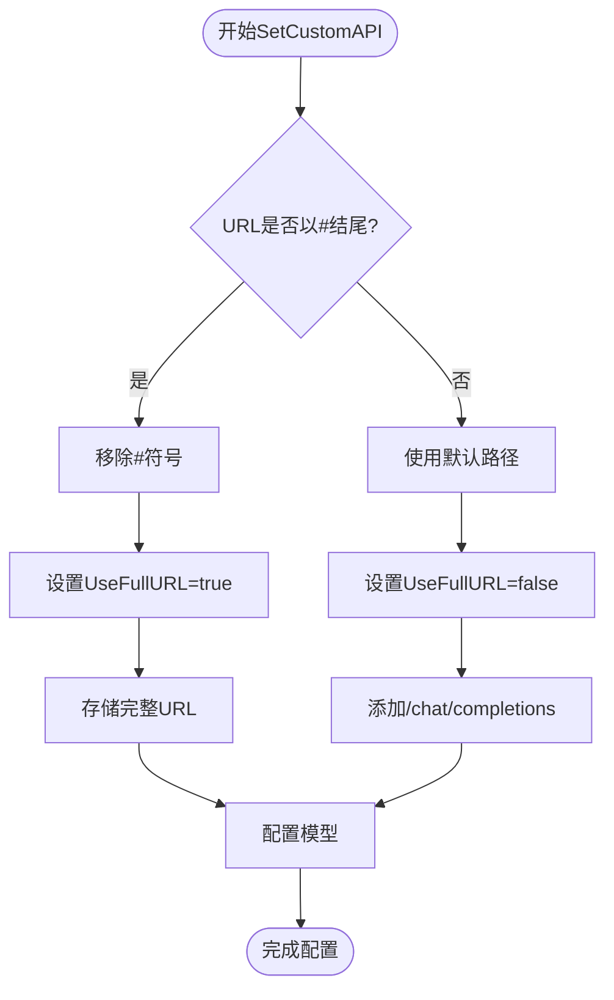
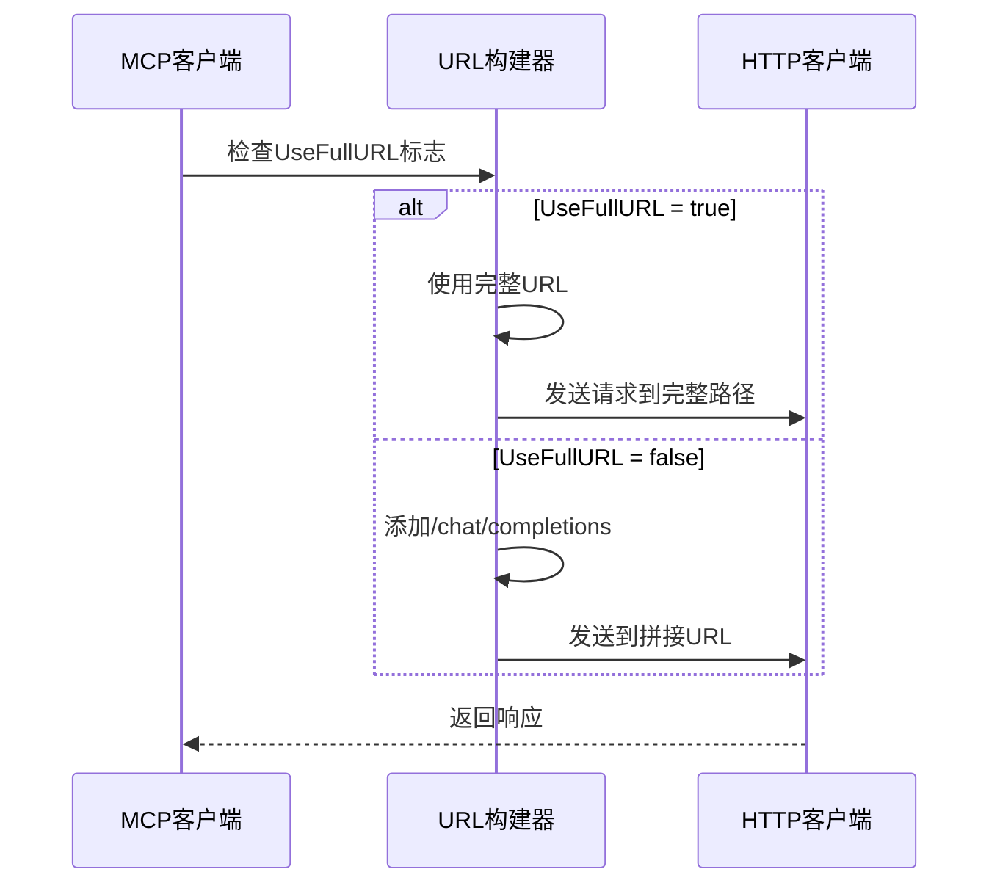
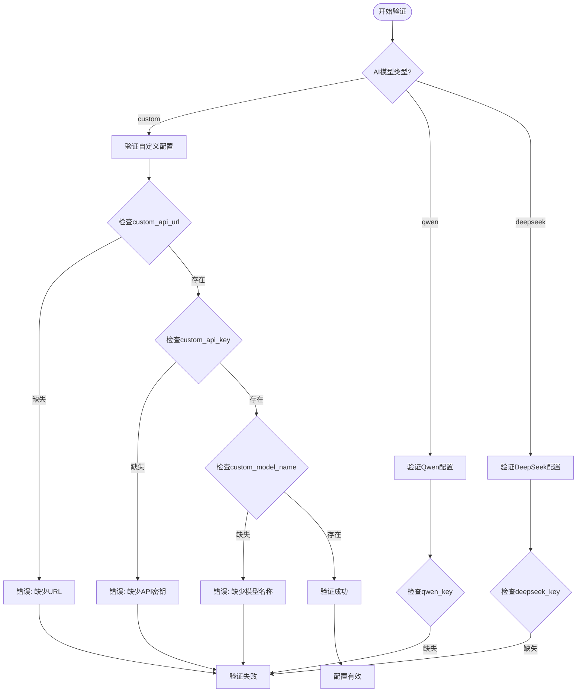
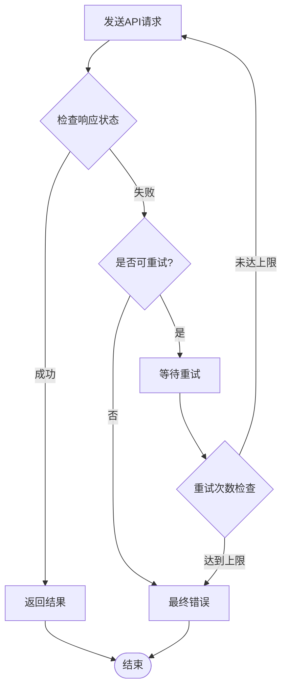
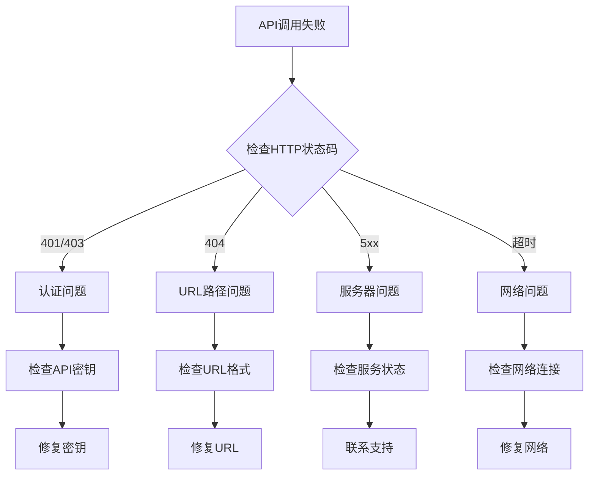

# 自定义AI API集成技术文档

<cite>
**本文档引用的文件**
- [mcp/client.go](file://mcp/client.go)
- [CUSTOM_API.md](file://CUSTOM_API.md)
- [config/config.go](file://config/config.go)
- [manager/trader_manager.go](file://manager/trader_manager.go)
- [decision/engine.go](file://decision/engine.go)
- [nginx/nginx.conf](file://nginx/nginx.conf)
- [README.md](file://README.md)
</cite>

## 目录
1. [简介](#简介)
2. [核心架构概述](#核心架构概述)
3. [SetCustomAPI方法详解](#setcustomapi方法详解)
4. [UseFullURL标志位机制](#usefullurl标志位机制)
5. [配置验证与错误处理](#配置验证与错误处理)
6. [兼容性要求](#兼容性要求)
7. [配置示例](#配置示例)
8. [故障排除指南](#故障排除指南)
9. [高级集成场景](#高级集成场景)
10. [最佳实践](#最佳实践)

## 简介

NOFX系统提供了强大的自定义AI API集成功能，允许用户无缝集成任何OpenAI格式兼容的API服务。通过`mcp/client.go`中的`SetCustomAPI`方法，系统支持多种AI提供商，包括OpenAI官方API、OpenRouter、本地Ollama部署以及Azure OpenAI等。

这种灵活性使得用户可以根据自己的需求和预算选择最适合的AI服务，无论是云端付费API还是本地部署的开源模型。

## 核心架构概述

NOFX的AI集成架构采用模块化设计，主要组件包括：



**图表来源**
- [mcp/client.go](file://mcp/client.go#L1-L50)
- [config/config.go](file://config/config.go#L1-L50)

**章节来源**
- [mcp/client.go](file://mcp/client.go#L1-L247)
- [config/config.go](file://config/config.go#L1-L202)

## SetCustomAPI方法详解

`SetCustomAPI`方法是实现自定义AI API集成的核心函数，它负责配置客户端以连接到指定的API服务。

### 方法签名与参数

```go
func (cfg *Client) SetCustomAPI(apiURL, apiKey, modelName string)
```

- **apiURL**: API的基础URL，系统会自动添加`/chat/completions`路径
- **apiKey**: API认证密钥，用于Bearer认证
- **modelName**: 要使用的模型名称

### 实现逻辑

该方法的核心逻辑包括以下步骤：

1. **提供商标识设置**: 将`Provider`设置为`ProviderCustom`
2. **API密钥配置**: 存储提供的API密钥
3. **URL处理逻辑**: 检查URL是否以`#`结尾
4. **模型名称设置**: 配置要使用的模型
5. **超时配置**: 设置默认超时时间为120秒

### URL处理机制



**图表来源**
- [mcp/client.go](file://mcp/client.go#L58-L75)

**章节来源**
- [mcp/client.go](file://mcp/client.go#L58-L75)

## UseFullURL标志位机制

`UseFullURL`标志位是NOFX自定义API集成的关键特性，它控制URL的构建方式。

### 标志位作用机制

当URL以`#`结尾时，系统会：
- 移除`#`字符
- 设置`UseFullURL = true`
- 直接使用配置的完整URL作为请求目标

当URL不以`#`结尾时，系统会：
- 设置`UseFullURL = false`
- 自动在基础URL后添加`/chat/completions`路径

### 使用场景

#### 标准用法（推荐）
```json
{
  "custom_api_url": "https://api.openai.com/v1"
}
```
**效果**: 请求发送到`https://api.openai.com/v1/chat/completions`

#### 特殊用法（完整路径）
```json
{
  "custom_api_url": "https://api.example.com/v2/ai/chat/completions#"
}
```
**效果**: 请求直接发送到`https://api.example.com/v2/ai/chat/completions`

### 内部实现



**图表来源**
- [mcp/client.go](file://mcp/client.go#L156-L170)

**章节来源**
- [mcp/client.go](file://mcp/client.go#L156-L170)

## 配置验证与错误处理

NOFX系统实现了严格的配置验证机制，确保自定义API配置的正确性。

### 配置验证流程



**图表来源**
- [config/config.go](file://config/config.go#L150-L175)

### 错误类型与处理

| 错误类型 | 描述 | 解决方案 |
|---------|------|----------|
| 缺少URL | `使用自定义API时必须配置custom_api_url` | 在配置中添加`custom_api_url`字段 |
| 缺少API密钥 | `使用自定义API时必须配置custom_api_key` | 提供有效的API密钥 |
| 缺少模型名称 | `使用自定义API时必须配置custom_model_name` | 指定正确的模型名称 |
| URL格式错误 | 包含`/chat/completions`路径 | 移除路径部分，系统自动添加 |
| 认证失败 | HTTP 401/403错误 | 检查API密钥有效性 |

### 重试机制

系统实现了智能重试机制来处理临时性错误：



**图表来源**
- [mcp/client.go](file://mcp/client.go#L80-L120)

**章节来源**
- [config/config.go](file://config/config.go#L150-L175)
- [mcp/client.go](file://mcp/client.go#L80-L120)

## 兼容性要求

为了确保自定义API能够正常工作，必须满足以下兼容性要求：

### 协议要求

1. **HTTP方法**: 必须支持`POST`请求
2. **内容类型**: 必须接受`application/json`内容类型
3. **认证方式**: 必须支持`Authorization: Bearer {api_key}`头部
4. **响应格式**: 必须返回标准的OpenAI Chat Completions格式

### 请求格式要求

系统发送的标准请求格式如下：

```json
{
  "model": "gpt-4o",
  "messages": [
    {
      "role": "system",
      "content": "系统提示词"
    },
    {
      "role": "user", 
      "content": "用户提示词"
    }
  ],
  "temperature": 0.5,
  "max_tokens": 2000
}
```

### 响应格式要求

API必须返回符合OpenAI标准的响应：

```json
{
  "id": "chatcmpl-123",
  "object": "chat.completion",
  "created": 1677652288,
  "model": "gpt-4o",
  "choices": [
    {
      "index": 0,
      "message": {
        "role": "assistant",
        "content": "AI助手的回答内容"
      },
      "finish_reason": "stop"
    }
  ],
  "usage": {
    "prompt_tokens": 9,
    "completion_tokens": 12,
    "total_tokens": 21
  }
}
```

### 支持的认证方式

| 认证方式 | 描述 | 示例 |
|---------|------|------|
| Bearer Token | 标准Bearer认证 | `Authorization: Bearer sk-xxx` |
| API Key Header | 自定义API密钥头部 | `X-API-Key: sk-xxx` |
| Basic Auth | HTTP基本认证 | `Authorization: Basic base64(username:password)` |

**章节来源**
- [CUSTOM_API.md](file://CUSTOM_API.md#L109-L126)
- [mcp/client.go](file://mcp/client.go#L170-L190)

## 配置示例

以下是各种常见场景的配置示例：

### OpenAI官方API

```json
{
  "id": "openai_trader",
  "name": "OpenAI Trader",
  "ai_model": "custom",
  "exchange": "binance",
  "binance_api_key": "your_binance_key",
  "binance_secret_key": "your_binance_secret",
  "custom_api_url": "https://api.openai.com/v1",
  "custom_api_key": "sk-your-openai-api-key",
  "custom_model_name": "gpt-4o",
  "initial_balance": 1000,
  "scan_interval_minutes": 3
}
```

### OpenRouter集成

```json
{
  "id": "openrouter_trader", 
  "name": "OpenRouter Trader",
  "ai_model": "custom",
  "exchange": "binance",
  "binance_api_key": "your_binance_key",
  "binance_secret_key": "your_binance_secret",
  "custom_api_url": "https://openrouter.ai/api/v1",
  "custom_api_key": "sk-or-xxxxx",
  "custom_model_name": "anthropic/claude-3.5-sonnet",
  "initial_balance": 1000,
  "scan_interval_minutes": 3
}
```

### 本地Ollama部署

```json
{
  "id": "ollama_trader",
  "name": "Local Ollama Trader",
  "ai_model": "custom",
  "exchange": "binance",
  "binance_api_key": "your_binance_key",
  "binance_secret_key": "your_binance_secret",
  "custom_api_url": "http://localhost:11434/v1",
  "custom_api_key": "ollama",
  "custom_model_name": "llama3.1:70b",
  "initial_balance": 1000,
  "scan_interval_minutes": 3
}
```

### Azure OpenAI

```json
{
  "id": "azure_trader",
  "name": "Azure OpenAI Trader",
  "ai_model": "custom",
  "exchange": "binance",
  "binance_api_key": "your_binance_key",
  "binance_secret_key": "your_binance_secret",
  "custom_api_url": "https://your-resource.openai.azure.com/openai/deployments/your-deployment",
  "custom_api_key": "your-azure-api-key",
  "custom_model_name": "gpt-4",
  "initial_balance": 1000,
  "scan_interval_minutes": 3
}
```

### 完整自定义路径

```json
{
  "id": "custom_endpoint_trader",
  "name": "Custom Endpoint Trader",
  "ai_model": "custom",
  "exchange": "binance",
  "binance_api_key": "your_binance_key",
  "binance_secret_key": "your_binance_secret",
  "custom_api_url": "https://api.custom.com/v2/ai/chat/completions#",
  "custom_api_key": "your-custom-api-key",
  "custom_model_name": "custom-model-name",
  "initial_balance": 1000,
  "scan_interval_minutes": 3
}
```

### 多AI对比交易

```json
{
  "traders": [
    {
      "id": "deepseek_trader",
      "name": "DeepSeek Trader",
      "ai_model": "deepseek",
      "exchange": "binance",
      "binance_api_key": "your_binance_key",
      "binance_secret_key": "your_binance_secret",
      "deepseek_key": "sk-deepseek-key",
      "initial_balance": 1000,
      "scan_interval_minutes": 3
    },
    {
      "id": "openai_trader",
      "name": "OpenAI Trader", 
      "ai_model": "custom",
      "exchange": "binance",
      "binance_api_key": "your_binance_key",
      "binance_secret_key": "your_binance_secret",
      "custom_api_url": "https://api.openai.com/v1",
      "custom_api_key": "sk-openai-key",
      "custom_model_name": "gpt-4o",
      "initial_balance": 1000,
      "scan_interval_minutes": 3
    }
  ]
}
```

**章节来源**
- [CUSTOM_API.md](file://CUSTOM_API.md#L20-L107)

## 故障排除指南

### 常见问题诊断

#### 1. 配置验证失败

**症状**: 系统启动时报错"使用自定义API时必须配置custom_api_url"

**诊断步骤**:
1. 检查配置文件中是否包含`custom_api_url`字段
2. 确认字段名拼写正确
3. 验证URL格式是否正确

**解决方案**:
```json
{
  "custom_api_url": "https://api.openai.com/v1"  // 确保不包含/chat/completions
}
```

#### 2. API调用失败

**症状**: HTTP状态码错误或连接超时

**诊断流程**:



**图表来源**
- [mcp/client.go](file://mcp/client.go#L200-L210)

#### 3. 响应解析错误

**症状**: "解析响应失败"或"API返回空响应"

**可能原因**:
- API返回非JSON格式响应
- 响应格式不符合OpenAI标准
- 网络传输过程中数据损坏

**解决方案**:
1. 使用curl或Postman测试API端点
2. 验证响应格式是否符合OpenAI标准
3. 检查网络连接稳定性

### 日志分析

系统提供了详细的日志输出来帮助诊断问题：

```go
// 成功重试日志
fmt.Printf("⚠️  AI API调用失败，正在重试 (%d/%d)...\n", attempt, maxRetries)
fmt.Printf("✓ AI API重试成功\n")

// 超时等待日志  
fmt.Printf("⏳ 等待%v后重试...\n", waitTime)
```

### HTTP状态码参考

| 状态码 | 含义 | 解决方案 |
|--------|------|----------|
| 200 | 成功 | 无需处理 |
| 400 | 请求错误 | 检查请求格式 |
| 401 | 认证失败 | 验证API密钥 |
| 403 | 权限不足 | 检查API权限 |
| 404 | 端点不存在 | 检查URL路径 |
| 429 | 请求过多 | 降低请求频率 |
| 500 | 服务器错误 | 稍后重试 |
| 502/503/504 | 网关错误 | 检查服务可用性 |

**章节来源**
- [mcp/client.go](file://mcp/client.go#L200-L210)
- [CUSTOM_API.md](file://CUSTOM_API.md#L170-L205)

## 高级集成场景

### 多租户部署

对于企业级部署，可以配置多个独立的AI服务实例：

```json
{
  "traders": [
    {
      "id": "production_trader",
      "name": "Production Trader",
      "ai_model": "custom",
      "custom_api_url": "https://api.production.com/v1",
      "custom_api_key": "prod-api-key",
      "custom_model_name": "gpt-4o"
    },
    {
      "id": "staging_trader", 
      "name": "Staging Trader",
      "ai_model": "custom",
      "custom_api_url": "https://api.staging.com/v1",
      "custom_api_key": "staging-api-key",
      "custom_model_name": "gpt-4-turbo"
    }
  ]
}
```

### 负载均衡与高可用

```json
{
  "traders": [
    {
      "id": "primary_trader",
      "name": "Primary Trader",
      "ai_model": "custom",
      "custom_api_url": "https://api.primary.com/v1#",
      "custom_api_key": "primary-key",
      "custom_model_name": "gpt-4o"
    },
    {
      "id": "backup_trader",
      "name": "Backup Trader",
      "ai_model": "custom", 
      "custom_api_url": "https://api.backup.com/v1#",
      "custom_api_key": "backup-key",
      "custom_model_name": "gpt-4o"
    }
  ]
}
```

### 模型版本管理

```json
{
  "traders": [
    {
      "id": "stable_trader",
      "name": "Stable Model Trader",
      "ai_model": "custom",
      "custom_api_url": "https://api.com/v1",
      "custom_api_key": "stable-key",
      "custom_model_name": "gpt-4o-2024-08-06"
    },
    {
      "id": "experimental_trader",
      "name": "Experimental Model Trader",
      "ai_model": "custom",
      "custom_api_url": "https://api.com/v1",
      "custom_api_key": "experimental-key", 
      "custom_model_name": "gpt-4o-latest"
    }
  ]
}
```

### 安全考虑

#### API密钥管理

```json
{
  "traders": [
    {
      "id": "secure_trader",
      "name": "Secure Trader",
      "ai_model": "custom",
      "custom_api_url": "https://api.secure.com/v1",
      "custom_api_key": "${ENV_VAR_API_KEY}",  // 从环境变量读取
      "custom_model_name": "gpt-4o"
    }
  ]
}
```

#### 网络安全配置

```nginx
# Nginx配置示例
location /api/ {
    proxy_pass https://backend-api/;
    proxy_set_header Authorization "Bearer ${API_KEY}";
    proxy_connect_timeout 300s;
    proxy_send_timeout 300s;
    proxy_read_timeout 300s;
}
```

**章节来源**
- [nginx/nginx.conf](file://nginx/nginx.conf#L40-L52)

## 最佳实践

### 性能优化

1. **合理设置超时时间**: 根据模型响应时间调整超时设置
2. **连接池管理**: 复用HTTP连接减少建立开销
3. **请求频率控制**: 避免触发API速率限制

### 安全建议

1. **密钥轮换**: 定期更换API密钥
2. **访问控制**: 限制API密钥的使用范围
3. **监控审计**: 记录API调用日志

### 监控与维护

1. **健康检查**: 定期验证API服务可用性
2. **性能监控**: 监控响应时间和成功率
3. **容量规划**: 根据使用量选择合适的API服务

### 开发调试

1. **本地测试**: 使用本地API进行开发测试
2. **模拟响应**: 在测试环境中模拟API响应
3. **错误处理**: 实现完善的错误处理机制

### 扩展性考虑

1. **插件架构**: 设计可扩展的API客户端架构
2. **配置热更新**: 支持运行时修改API配置
3. **多语言支持**: 考虑支持多种编程语言的SDK

通过遵循这些最佳实践，可以确保自定义AI API集成的稳定性、安全性和可维护性，为用户提供可靠的AI交易服务。