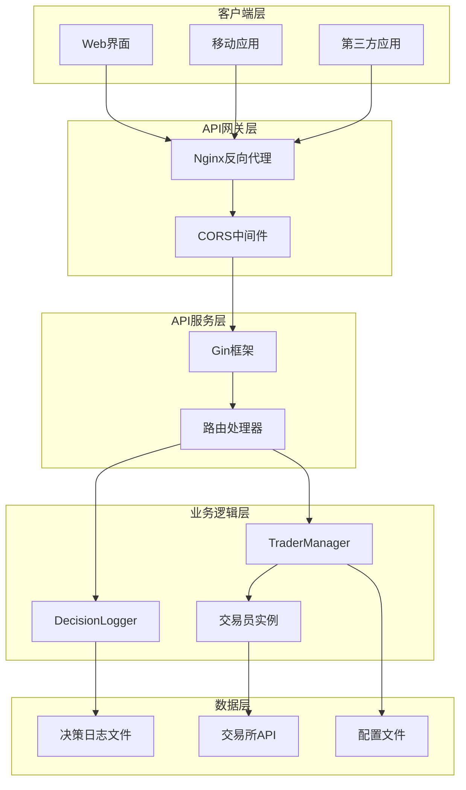

# API参考

<cite>
**本文档中引用的文件**
- [api/server.go](file://api/server.go)
- [main.go](file://main.go)
- [manager/trader_manager.go](file://manager/trader_manager.go)
- [trader/interface.go](file://trader/interface.go)
- [logger/decision_logger.go](file://logger/decision_logger.go)
- [config/config.go](file://config/config.go)
- [web/src/types/index.ts](file://web/src/types/index.ts)
- [web/src/types.ts](file://web/src/types.ts)
</cite>

## 目录
1. [简介](#简介)
2. [API架构概览](#api架构概览)
3. [认证机制](#认证机制)
4. [速率限制策略](#速率限制策略)
5. [API端点详细说明](#api端点详细说明)
6. [响应格式规范](#响应格式规范)
7. [错误处理](#错误处理)
8. [集成示例](#集成示例)
9. [最佳实践](#最佳实践)

## 简介

NoFx是一个基于AI的加密货币交易竞赛系统，提供了完整的RESTful API接口用于访问交易数据、系统状态和性能指标。API采用Go语言开发，基于Gin框架构建，支持实时数据查询和历史数据分析。

### 主要功能特性
- **竞赛数据管理**：提供所有参赛交易员的综合数据对比
- **实时状态监控**：获取单个交易员的实时系统状态
- **账户信息查询**：详细的账户余额、盈亏和持仓信息
- **决策日志分析**：完整的AI决策过程记录和历史表现分析
- **性能统计**：基于历史数据的交易表现统计和风险评估

## API架构概览



**图表来源**
- [api/server.go](file://api/server.go#L15-L45)
- [main.go](file://main.go#L100-L120)

**章节来源**
- [api/server.go](file://api/server.go#L1-L50)
- [main.go](file://main.go#L1-L140)

## 认证机制

NoFx API目前采用无认证机制设计，所有API端点均可通过HTTP请求直接访问。这种设计适用于以下场景：

### 访问控制特点
- **开放访问**：无需API密钥或令牌认证
- **CORS支持**：支持跨域请求，便于前端应用集成
- **内部网络**：建议部署在受信任的内部网络环境中

### 安全考虑
虽然API本身不进行身份验证，但建议采取以下安全措施：
- **网络隔离**：将API服务器部署在专用网络中
- **防火墙规则**：限制访问源IP地址
- **HTTPS部署**：生产环境建议启用SSL/TLS加密
- **访问日志**：记录所有API请求以便审计

**章节来源**
- [api/server.go](file://api/server.go#L30-L50)

## 速率限制策略

由于NoFx API采用无认证设计，系统层面不实施严格的速率限制。然而，系统内置了以下保护机制：

### 内置保护措施
- **请求超时**：所有API请求设置120秒超时时间
- **并发控制**：使用Gin框架的并发安全机制
- **资源监控**：监控内存和CPU使用情况
- **优雅降级**：在高负载情况下优先保证关键功能

### 建议的客户端限制
为了维护系统稳定性，建议客户端实现以下限制：
- **请求频率**：建议不超过每秒1次请求
- **批量操作**：避免同时发起大量并发请求
- **缓存策略**：合理使用本地缓存减少不必要的API调用
- **重试机制**：实现指数退避重试策略

## API端点详细说明

### 健康检查端点

#### GET /health
检查API服务器的运行状态。

**请求参数**：无

**请求头**：
```
Accept: application/json
```

**响应格式**：
```json
{
  "status": "ok",
  "time": "2024-01-15T10:30:00Z"
}
```

**HTTP状态码**：
- `200 OK` - 服务器正常运行
- `500 Internal Server Error` - 服务器内部错误

**curl示例**：
```bash
curl -X GET "http://localhost:8080/health" \
  -H "Accept: application/json"
```

**章节来源**
- [api/server.go](file://api/server.go#L75-L85)

### 竞赛数据端点

#### GET /api/competition
获取所有参赛交易员的综合对比数据。

**请求参数**：无

**请求头**：
```
Accept: application/json
```

**响应格式**：
```json
{
  "traders": [
    {
      "trader_id": "qwen_ai",
      "trader_name": "通义千问",
      "ai_model": "qwen",
      "total_equity": 1500.50,
      "total_pnl": 500.50,
      "total_pnl_pct": 50.05,
      "position_count": 3,
      "margin_used_pct": 25.5,
      "call_count": 1200,
      "is_running": true
    },
    {
      "trader_id": "deepseek_ai",
      "trader_name": "深智",
      "ai_model": "deepseek",
      "total_equity": 1200.25,
      "total_pnl": 200.25,
      "total_pnl_pct": 20.02,
      "position_count": 2,
      "margin_used_pct": 15.2,
      "call_count": 1100,
      "is_running": true
    }
  ],
  "count": 2
}
```

**HTTP状态码**：
- `200 OK` - 成功获取竞赛数据
- `500 Internal Server Error` - 获取数据失败

**curl示例**：
```bash
curl -X GET "http://localhost:8080/api/competition" \
  -H "Accept: application/json"
```

**章节来源**
- [api/server.go](file://api/server.go#L95-L115)
- [manager/trader_manager.go](file://manager/trader_manager.go#L140-L172)

#### GET /api/traders
获取所有可用交易员的列表。

**请求参数**：无

**请求头**：
```
Accept: application/json
```

**响应格式**：
```json
[
  {
    "trader_id": "qwen_ai",
    "trader_name": "通义千问",
    "ai_model": "qwen"
  },
  {
    "trader_id": "deepseek_ai",
    "trader_name": "深智",
    "ai_model": "deepseek"
  }
]
```

**HTTP状态码**：
- `200 OK` - 成功获取交易员列表
- `500 Internal Server Error` - 获取列表失败

**curl示例**：
```bash
curl -X GET "http://localhost:8080/api/traders" \
  -H "Accept: application/json"
```

**章节来源**
- [api/server.go](file://api/server.go#L117-L130)

### 单个交易员数据端点

#### GET /api/status
获取指定交易员的系统状态信息。

**请求参数**：
- `trader_id` (可选)：交易员ID，如果不提供则返回第一个可用交易员

**请求头**：
```
Accept: application/json
```

**响应格式**：
```json
{
  "is_running": true,
  "start_time": "2024-01-15T09:00:00Z",
  "runtime_minutes": 150,
  "call_count": 1200,
  "initial_balance": 1000.0,
  "scan_interval": "3m",
  "stop_until": "",
  "last_reset_time": "2024-01-15T09:00:00Z",
  "ai_provider": "qwen"
}
```

**HTTP状态码**：
- `200 OK` - 成功获取状态信息
- `400 Bad Request` - 请求参数错误
- `404 Not Found` - 交易员不存在
- `500 Internal Server Error` - 获取状态失败

**curl示例**：
```bash
# 获取特定交易员的状态
curl -X GET "http://localhost:8080/api/status?trader_id=qwen_ai" \
  -H "Accept: application/json"

# 获取默认交易员的状态
curl -X GET "http://localhost:8080/api/status" \
  -H "Accept: application/json"
```

**章节来源**
- [api/server.go](file://api/server.go#L132-L155)

#### GET /api/account
获取指定交易员的账户信息。

**请求参数**：
- `trader_id` (可选)：交易员ID

**请求头**：
```
Accept: application/json
```

**响应格式**：
```json
{
  "total_equity": 1500.50,
  "wallet_balance": 1000.0,
  "unrealized_profit": 500.50,
  "available_balance": 1200.0,
  "total_pnl": 500.50,
  "total_pnl_pct": 50.05,
  "total_unrealized_pnl": 500.50,
  "initial_balance": 1000.0,
  "daily_pnl": 50.0,
  "position_count": 3,
  "margin_used": 300.0,
  "margin_used_pct": 25.5
}
```

**HTTP状态码**：
- `200 OK` - 成功获取账户信息
- `400 Bad Request` - 请求参数错误
- `404 Not Found` - 交易员不存在
- `500 Internal Server Error` - 获取账户信息失败

**curl示例**：
```bash
curl -X GET "http://localhost:8080/api/account?trader_id=qwen_ai" \
  -H "Accept: application/json"
```

**章节来源**
- [api/server.go](file://api/server.go#L157-L185)

#### GET /api/positions
获取指定交易员的持仓列表。

**请求参数**：
- `trader_id` (可选)：交易员ID

**请求头**：
```
Accept: application/json
```

**响应格式**：
```json
[
  {
    "symbol": "BTCUSDT",
    "side": "long",
    "entry_price": 42000.0,
    "mark_price": 42500.0,
    "quantity": 0.1,
    "leverage": 20,
    "unrealized_pnl": 500.0,
    "unrealized_pnl_pct": 1.19,
    "liquidation_price": 28000.0,
    "margin_used": 210.0
  },
  {
    "symbol": "ETHUSDT",
    "side": "short",
    "entry_price": 3000.0,
    "mark_price": 2980.0,
    "quantity": 0.5,
    "leverage": 15,
    "unrealized_pnl": 10.0,
    "unrealized_pnl_pct": 0.07,
    "liquidation_price": 4500.0,
    "margin_used": 100.0
  }
]
```

**HTTP状态码**：
- `200 OK` - 成功获取持仓列表
- `400 Bad Request` - 请求参数错误
- `404 Not Found` - 交易员不存在
- `500 Internal Server Error` - 获取持仓列表失败

**curl示例**：
```bash
curl -X GET "http://localhost:8080/api/positions?trader_id=qwen_ai" \
  -H "Accept: application/json"
```

**章节来源**
- [api/server.go](file://api/server.go#L187-L205)

#### GET /api/decisions
获取指定交易员的完整决策日志列表。

**请求参数**：
- `trader_id` (可选)：交易员ID

**请求头**：
```
Accept: application/json
```

**响应格式**：
```json
[
  {
    "timestamp": "2024-01-15T10:00:00Z",
    "cycle_number": 1200,
    "input_prompt": "当前市场状况分析...",
    "cot_trace": "AI思考过程：...",
    "decision_json": "[{\"action\":\"open_long\",\"symbol\":\"BTCUSDT\",\"quantity\":0.1,\"leverage\":20}]",
    "account_state": {
      "total_balance": 1500.50,
      "available_balance": 1200.0,
      "total_unrealized_profit": 500.50,
      "position_count": 3,
      "margin_used_pct": 25.5
    },
    "positions": [...],
    "candidate_coins": ["BTCUSDT", "ETHUSDT"],
    "decisions": [
      {
        "action": "open_long",
        "symbol": "BTCUSDT",
        "quantity": 0.1,
        "leverage": 20,
        "price": 42000.0,
        "order_id": 123456,
        "timestamp": "2024-01-15T10:00:00Z",
        "success": true,
        "error": ""
      }
    ],
    "execution_log": ["执行开仓指令..."],
    "success": true,
    "error_message": ""
  }
]
```

**HTTP状态码**：
- `200 OK` - 成功获取决策日志
- `400 Bad Request` - 请求参数错误
- `404 Not Found` - 交易员不存在
- `500 Internal Server Error` - 获取决策日志失败

**curl示例**：
```bash
curl -X GET "http://localhost:8080/api/decisions?trader_id=qwen_ai" \
  -H "Accept: application/json"
```

**章节来源**
- [api/server.go](file://api/server.go#L207-L230)
- [logger/decision_logger.go](file://logger/decision_logger.go#L1-L50)

#### GET /api/decisions/latest
获取指定交易员的最新5条决策日志。

**请求参数**：
- `trader_id` (可选)：交易员ID

**请求头**：
```
Accept: application/json
```

**响应格式**：
```json
[
  {
    "timestamp": "2024-01-15T10:30:00Z",
    "cycle_number": 1205,
    "input_prompt": "最新市场分析...",
    "cot_trace": "AI思考过程：...",
    "decision_json": "[{\"action\":\"hold\",\"symbol\":\"BTCUSDT\"}]",
    "account_state": {...},
    "positions": [...],
    "candidate_coins": ["BTCUSDT", "ETHUSDT"],
    "decisions": [],
    "execution_log": ["保持观望..."],
    "success": true,
    "error_message": ""
  }
]
```

**HTTP状态码**：
- `200 OK` - 成功获取最新决策
- `400 Bad Request` - 请求参数错误
- `404 Not Found` - 交易员不存在
- `500 Internal Server Error` - 获取决策日志失败

**curl示例**：
```bash
curl -X GET "http://localhost:8080/api/decisions/latest?trader_id=qwen_ai" \
  -H "Accept: application/json"
```

**章节来源**
- [api/server.go](file://api/server.go#L232-L255)

#### GET /api/statistics
获取指定交易员的交易统计信息。

**请求参数**：
- `trader_id` (可选)：交易员ID

**请求头**：
```
Accept: application/json
```

**响应格式**：
```json
{
  "total_cycles": 1200,
  "successful_cycles": 900,
  "failed_cycles": 300,
  "total_open_positions": 150,
  "total_close_positions": 120
}
```

**HTTP状态码**：
- `200 OK` - 成功获取统计信息
- `400 Bad Request` - 请求参数错误
- `404 Not Found` - 交易员不存在
- `500 Internal Server Error` - 获取统计信息失败

**curl示例**：
```bash
curl -X GET "http://localhost:8080/api/statistics?trader_id=qwen_ai" \
  -H "Accept: application/json"
```

**章节来源**
- [api/server.go](file://api/server.go#L257-L275)

#### GET /api/equity-history
获取指定交易员的收益率历史数据。

**请求参数**：
- `trader_id` (可选)：交易员ID

**请求头**：
```
Accept: application/json
```

**响应格式**：
```json
[
  {
    "timestamp": "2024-01-15 10:00:00",
    "total_equity": 1500.50,
    "available_balance": 1200.0,
    "total_pnl": 500.50,
    "total_pnl_pct": 50.05,
    "position_count": 3,
    "margin_used_pct": 25.5,
    "cycle_number": 1200
  }
]
```

**HTTP状态码**：
- `200 OK` - 成功获取历史数据
- `400 Bad Request` - 请求参数错误
- `404 Not Found` - 交易员不存在
- `500 Internal Server Error` - 获取历史数据失败

**curl示例**：
```bash
curl -X GET "http://localhost:8080/api/equity-history?trader_id=qwen_ai" \
  -H "Accept: application/json"
```

**章节来源**
- [api/server.go](file://api/server.go#L277-L350)

#### GET /api/performance
获取指定交易员的AI学习表现分析。

**请求参数**：
- `trader_id` (可选)：交易员ID

**请求头**：
```
Accept: application/json
```

**响应格式**：
```json
{
  "total_trades": 120,
  "winning_trades": 80,
  "losing_trades": 40,
  "win_rate": 66.67,
  "avg_win": 25.0,
  "avg_loss": -15.0,
  "profit_factor": 1.67,
  "sharpe_ratio": 1.2,
  "recent_trades": [...],
  "symbol_stats": {
    "BTCUSDT": {
      "symbol": "BTCUSDT",
      "total_trades": 50,
      "winning_trades": 35,
      "losing_trades": 15,
      "win_rate": 70.0,
      "total_pn_l": 1200.0,
      "avg_pn_l": 24.0
    }
  },
  "best_symbol": "BTCUSDT",
  "worst_symbol": "ADAUSDT"
}
```

**HTTP状态码**：
- `200 OK` - 成功获取性能分析
- `400 Bad Request` - 请求参数错误
- `404 Not Found` - 交易员不存在
- `500 Internal Server Error` - 获取性能分析失败

**curl示例**：
```bash
curl -X GET "http://localhost:8080/api/performance?trader_id=qwen_ai" \
  -H "Accept: application/json"
```

**章节来源**
- [api/server.go](file://api/server.go#L352-L400)

## 响应格式规范

### JSON Schema定义

#### 系统状态响应
```typescript
interface SystemStatus {
  is_running: boolean;
  start_time: string;
  runtime_minutes: number;
  call_count: number;
  initial_balance: number;
  scan_interval: string;
  stop_until: string;
  last_reset_time: string;
  ai_provider: string;
}
```

#### 账户信息响应
```typescript
interface AccountInfo {
  total_equity: number;
  wallet_balance: number;
  unrealized_profit: number;
  available_balance: number;
  total_pnl: number;
  total_pnl_pct: number;
  total_unrealized_pnl: number;
  initial_balance: number;
  daily_pnl: number;
  position_count: number;
  margin_used: number;
  margin_used_pct: number;
}
```

#### 持仓信息响应
```typescript
interface Position {
  symbol: string;
  side: string;
  entry_price: number;
  mark_price: number;
  quantity: number;
  leverage: number;
  unrealized_pnl: number;
  unrealized_pnl_pct: number;
  liquidation_price: number;
  margin_used: number;
}
```

#### 决策记录响应
```typescript
interface DecisionRecord {
  timestamp: string;
  cycle_number: number;
  input_prompt: string;
  cot_trace: string;
  decision_json: string;
  account_state: AccountSnapshot;
  positions: PositionSnapshot[];
  candidate_coins: string[];
  decisions: DecisionAction[];
  execution_log: string[];
  success: boolean;
  error_message: string;
}
```

### 数据类型说明

| 字段类型 | 描述 | 示例值 |
|---------|------|--------|
| `string` | 文本字符串 | `"BTCUSDT"` |
| `number` | 数值类型（浮点数） | `1500.50` |
| `boolean` | 布尔值 | `true` |
| `array` | 数组类型 | `[...]` |
| `object` | 对象类型 | `{...}` |

### 时间戳格式
所有时间戳字段均采用ISO 8601格式：
- 标准格式：`YYYY-MM-DDTHH:mm:ssZ`
- 示例：`2024-01-15T10:30:00Z`

### 数值精度
- **金额**：保留2位小数
- **百分比**：保留2位小数
- **杠杆倍数**：整数
- **数量**：根据交易所精度确定

**章节来源**
- [web/src/types/index.ts](file://web/src/types/index.ts#L1-L52)
- [web/src/types.ts](file://web/src/types.ts#L1-L61)

## 错误处理

### HTTP状态码对照表

| 状态码 | 含义 | 场景描述 |
|--------|------|----------|
| `200 OK` | 请求成功 | API正常返回数据 |
| `400 Bad Request` | 请求参数错误 | 缺少必要参数或参数格式错误 |
| `404 Not Found` | 资源不存在 | 指定的交易员ID不存在 |
| `500 Internal Server Error` | 服务器内部错误 | 系统内部异常或数据处理错误 |

### 错误响应格式
```json
{
  "error": "错误描述信息"
}
```

### 常见错误及解决方案

#### 1. 交易员不存在
**错误信息**：`"trader ID 'xxx' 不存在"`
**原因**：指定的交易员ID不存在或未启用
**解决方案**：检查交易员ID是否正确，或使用`/api/traders`获取有效ID列表

#### 2. 没有可用的交易员
**错误信息**：`"没有可用的trader"`
**原因**：系统中没有启用的交易员
**解决方案**：检查配置文件中是否有启用的交易员

#### 3. 获取数据失败
**错误信息**：`"获取XXX失败: 具体错误信息"`
**原因**：可能是交易所API连接失败或数据处理异常
**解决方案**：检查网络连接和交易所API配置

#### 4. JSON解析错误
**错误信息**：`"JSON解析失败: 具体错误信息"`
**原因**：返回的数据格式不符合预期
**解决方案**：检查API版本兼容性

**章节来源**
- [api/server.go](file://api/server.go#L132-L155)
- [api/server.go](file://api/server.go#L207-L230)

## 集成示例

### JavaScript/TypeScript示例

```javascript
// 基础API客户端
class NoFxAIClient {
  constructor(baseUrl = 'http://localhost:8080') {
    this.baseUrl = baseUrl;
  }

  // 获取竞赛数据
  async getCompetition() {
    const response = await fetch(`${this.baseUrl}/api/competition`);
    return await response.json();
  }

  // 获取交易员列表
  async getTraders() {
    const response = await fetch(`${this.baseUrl}/api/traders`);
    return await response.json();
  }

  // 获取交易员状态
  async getTraderStatus(traderId) {
    const params = new URLSearchParams({ trader_id: traderId });
    const response = await fetch(`${this.baseUrl}/api/status?${params}`);
    return await response.json();
  }

  // 获取账户信息
  async getAccountInfo(traderId) {
    const params = new URLSearchParams({ trader_id: traderId });
    const response = await fetch(`${this.baseUrl}/api/account?${params}`);
    return await response.json();
  }

  // 获取持仓列表
  async getPositions(traderId) {
    const params = new URLSearchParams({ trader_id: traderId });
    const response = await fetch(`${this.baseUrl}/api/positions?${params}`);
    return await response.json();
  }

  // 获取决策日志
  async getDecisions(traderId) {
    const params = new URLSearchParams({ trader_id: traderId });
    const response = await fetch(`${this.baseUrl}/api/decisions?${params}`);
    return await response.json();
  }

  // 获取性能分析
  async getPerformance(traderId) {
    const params = new URLSearchParams({ trader_id: traderId });
    const response = await fetch(`${this.baseUrl}/api/performance?${params}`);
    return await response.json();
  }

  // 健康检查
  async healthCheck() {
    const response = await fetch(`${this.baseUrl}/health`);
    return await response.json();
  }
}

// 使用示例
async function main() {
  const client = new NoFxAIClient();

  try {
    // 检查服务状态
    const health = await client.healthCheck();
    console.log('服务状态:', health);

    // 获取所有交易员
    const traders = await client.getTraders();
    console.log('交易员列表:', traders);

    // 获取第一个交易员的详细信息
    if (traders.length > 0) {
      const traderId = traders[0].trader_id;
      
      const status = await client.getTraderStatus(traderId);
      console.log('交易员状态:', status);

      const account = await client.getAccountInfo(traderId);
      console.log('账户信息:', account);

      const positions = await client.getPositions(traderId);
      console.log('持仓列表:', positions);

      const decisions = await client.getDecisions(traderId);
      console.log('决策日志:', decisions.slice(0, 5)); // 只显示前5条
    }
  } catch (error) {
    console.error('API调用失败:', error);
  }
}

main();
```

### Python示例

```python
import requests
from typing import Dict, List, Any

class NoFxAIClient:
    def __init__(self, base_url: str = "http://localhost:8080"):
        self.base_url = base_url

    def _make_request(self, endpoint: str, params: dict = None) -> Dict[str, Any]:
        """通用请求方法"""
        url = f"{self.base_url}{endpoint}"
        response = requests.get(url, params=params, timeout=120)
        response.raise_for_status()
        return response.json()

    def health_check(self) -> Dict[str, Any]:
        """健康检查"""
        return self._make_request("/health")

    def get_competition(self) -> Dict[str, Any]:
        """获取竞赛数据"""
        return self._make_request("/api/competition")

    def get_traders(self) -> List[Dict[str, Any]]:
        """获取交易员列表"""
        return self._make_request("/api/traders")

    def get_trader_status(self, trader_id: str) -> Dict[str, Any]:
        """获取交易员状态"""
        params = {"trader_id": trader_id}
        return self._make_request("/api/status", params)

    def get_account_info(self, trader_id: str) -> Dict[str, Any]:
        """获取账户信息"""
        params = {"trader_id": trader_id}
        return self._make_request("/api/account", params)

    def get_positions(self, trader_id: str) -> List[Dict[str, Any]]:
        """获取持仓列表"""
        params = {"trader_id": trader_id}
        return self._make_request("/api/positions", params)

    def get_decisions(self, trader_id: str) -> List[Dict[str, Any]]:
        """获取决策日志"""
        params = {"trader_id": trader_id}
        return self._make_request("/api/decisions", params)

    def get_performance(self, trader_id: str) -> Dict[str, Any]:
        """获取性能分析"""
        params = {"trader_id": trader_id}
        return self._make_request("/api/performance", params)

# 使用示例
def main():
    client = NoFxAIClient()

    try:
        # 健康检查
        print("健康检查:", client.health_check())

        # 获取竞赛数据
        competition_data = client.get_competition()
        print(f"共有 {competition_data['count']} 个交易员")

        # 获取交易员列表
        traders = client.get_traders()
        print("交易员列表:", [t["trader_name"] for t in traders])

        if traders:
            trader_id = traders[0]["trader_id"]
            
            # 获取交易员详细信息
            status = client.get_trader_status(trader_id)
            print("交易员状态:", status["is_running"])

            account = client.get_account_info(trader_id)
            print(f"账户净值: ${account['total_equity']:.2f}")

            positions = client.get_positions(trader_id)
            print(f"持仓数量: {len(positions)}")

            decisions = client.get_decisions(trader_id)
            print(f"决策记录: {len(decisions)} 条")

    except requests.exceptions.RequestException as e:
        print(f"API请求失败: {e}")
    except Exception as e:
        print(f"发生错误: {e}")

if __name__ == "__main__":
    main()
```

### cURL命令集合

```bash
#!/bin/bash

BASE_URL="http://localhost:8080"

echo "=== NoFx API 测试脚本 ==="

# 1. 健康检查
echo "1. 健康检查:"
curl -s "${BASE_URL}/health" | jq .

# 2. 获取竞赛数据
echo "2. 竞赛数据:"
curl -s "${BASE_URL}/api/competition" | jq '.traders[] | {name: .trader_name, equity: .total_equity, pnl: .total_pnl_pct}'

# 3. 获取交易员列表
echo "3. 交易员列表:"
curl -s "${BASE_URL}/api/traders" | jq '.[] | {id: .trader_id, name: .trader_name, model: .ai_model}'

# 4. 获取第一个交易员的状态
TRADER_ID=$(curl -s "${BASE_URL}/api/traders" | jq -r '.[0].trader_id')
echo "4. 交易员状态 ($TRADER_ID):"
curl -s "${BASE_URL}/api/status?trader_id=${TRADER_ID}" | jq '{running: .is_running, calls: .call_count, balance: .initial_balance}'

# 5. 获取账户信息
echo "5. 账户信息 ($TRADER_ID):"
curl -s "${BASE_URL}/api/account?trader_id=${TRADER_ID}" | jq '{equity: .total_equity, pnl: .total_pnl, pnl_pct: .total_pnl_pct, positions: .position_count}'

# 6. 获取持仓列表
echo "6. 持仓列表 ($TRADER_ID):"
curl -s "${BASE_URL}/api/positions?trader_id=${TRADER_ID}" | jq '.[] | {symbol: .symbol, side: .side, qty: .quantity, pnl: .unrealized_pnl}'

# 7. 获取最新决策
echo "7. 最新决策 ($TRADER_ID):"
curl -s "${BASE_URL}/api/decisions/latest?trader_id=${TRADER_ID}" | jq '.[0] | {time: .timestamp, decisions: (.decisions | length), success: .success}'

# 8. 获取性能分析
echo "8. 性能分析 ($TRADER_ID):"
curl -s "${BASE_URL}/api/performance?trader_id=${TRADER_ID}" | jq '{trades: .total_trades, win_rate: .win_rate, profit_factor: .profit_factor}'
```

## 最佳实践

### 1. 请求优化策略

#### 合理使用缓存
```javascript
// 实现智能缓存机制
class APICache {
  constructor(ttl = 5000) { // 5秒缓存
    this.cache = new Map();
    this.ttl = ttl;
  }

  async get(key, fetchFn) {
    const cached = this.cache.get(key);
    if (cached && Date.now() - cached.timestamp < this.ttl) {
      return cached.data;
    }

    const data = await fetchFn();
    this.cache.set(key, {
      data,
      timestamp: Date.now()
    });
    return data;
  }
}

const cache = new APICache(5000);

// 使用缓存获取数据
const getStatus = async (traderId) => {
  return cache.get(`status_${traderId}`, () => 
    client.getTraderStatus(traderId)
  );
};
```

#### 批量请求优化
```javascript
// 批量获取多个交易员的数据
const getMultipleTraderData = async (traderIds) => {
  const promises = traderIds.map(async (id) => {
    return {
      trader_id: id,
      status: await client.getTraderStatus(id),
      account: await client.getAccountInfo(id),
      positions: await client.getPositions(id)
    };
  });

  return Promise.all(promises);
};
```

### 2. 错误处理最佳实践

#### 实现重试机制
```javascript
class RetryableAPI {
  constructor(maxRetries = 3, delay = 1000) {
    this.maxRetries = maxRetries;
    this.delay = delay;
  }

  async callWithRetry(apiMethod, ...args) {
    let lastError;
    
    for (let i = 0; i < this.maxRetries; i++) {
      try {
        return await apiMethod(...args);
      } catch (error) {
        lastError = error;
        
        if (i < this.maxRetries - 1) {
          await new Promise(resolve => 
            setTimeout(resolve, this.delay * Math.pow(2, i))
          );
        }
      }
    }
    
    throw lastError;
  }
}

const retryableClient = new RetryableAPI();
```

#### 分层错误处理
```javascript
// 分层错误处理示例
const fetchDataWithLayeredErrorHandling = async (traderId) => {
  try {
    // 第一层：网络请求错误
    const account = await retryableClient.callWithRetry(
      client.getAccountInfo, traderId
    );

    try {
      // 第二层：数据验证错误
      validateAccountData(account);
      
      try {
        // 第三层：业务逻辑错误
        const positions = await client.getPositions(traderId);
        return processTraderData(account, positions);
      } catch (positionsError) {
        console.warn('持仓数据获取失败，使用基础账户数据');
        return { account };
      }
    } catch (validationError) {
      throw new ValidationError('账户数据验证失败', validationError);
    }
  } catch (networkError) {
    throw new NetworkError('网络请求失败', networkError);
  }
};
```

### 3. 性能监控

#### 实现API使用统计
```javascript
class APIMonitor {
  constructor() {
    this.stats = {
      totalRequests: 0,
      successfulRequests: 0,
      failedRequests: 0,
      averageResponseTime: 0,
      errorTypes: {}
    };
  }

  async trackRequest(apiCall) {
    const startTime = performance.now();
    this.stats.totalRequests++;

    try {
      const result = await apiCall();
      this.stats.successfulRequests++;
      return result;
    } catch (error) {
      this.stats.failedRequests++;
      const errorType = error.constructor.name;
      this.stats.errorTypes[errorType] = 
        (this.stats.errorTypes[errorType] || 0) + 1;
      throw error;
    } finally {
      const endTime = performance.now();
      const responseTime = endTime - startTime;
      
      // 更新平均响应时间
      this.stats.averageResponseTime = 
        (this.stats.averageResponseTime + responseTime) / 2;
    }
  }

  getStats() {
    return { ...this.stats };
  }
}
```

### 4. 安全注意事项

#### 输入验证
```javascript
// 验证交易员ID格式
const validateTraderId = (traderId) => {
  if (!traderId || typeof traderId !== 'string') {
    throw new Error('交易员ID必须是非空字符串');
  }

  // 简单的格式验证
  if (!/^[a-zA-Z0-9_-]+$/.test(traderId)) {
    throw new Error('交易员ID格式不正确');
  }

  return true;
};

// 使用验证
const getTraderData = async (traderId) => {
  validateTraderId(traderId);
  return client.getTraderStatus(traderId);
};
```

#### 敏感数据保护
```javascript
// 敏感数据脱敏
const sanitizeResponse = (data) => {
  if (!data) return data;

  // 移除或替换敏感信息
  const sanitized = { ...data };
  
  // 移除可能包含敏感信息的字段
  delete sanitized.input_prompt;
  delete sanitized.decision_json;
  delete sanitized.execution_log;

  // 将详细持仓信息替换为汇总信息
  if (sanitized.positions) {
    sanitized.position_summary = {
      count: sanitized.positions.length,
      total_value: sanitized.positions.reduce((sum, p) => sum + p.quantity * p.entry_price, 0)
    };
    delete sanitized.positions;
  }

  return sanitized;
};
```

### 5. 开发调试技巧

#### API调用日志
```javascript
// 添加详细的API调用日志
const createLoggingClient = (baseClient) => {
  const methods = ['getCompetition', 'getTraders', 'getTraderStatus', 'getAccountInfo'];
  
  const loggingClient = {};
  
  methods.forEach(methodName => {
    loggingClient[methodName] = async (...args) => {
      console.log(`[API] 调用 ${methodName}`, args);
      
      const startTime = performance.now();
      try {
        const result = await baseClient[methodName](...args);
        const duration = performance.now() - startTime;
        
        console.log(`[API] ${methodName} 成功 (${duration.toFixed(2)}ms)`, {
          resultSize: JSON.stringify(result).length,
          timestamp: new Date().toISOString()
        });
        
        return result;
      } catch (error) {
        const duration = performance.now() - startTime;
        console.error(`[API] ${methodName} 失败 (${duration.toFixed(2)}ms)`, {
          error: error.message,
          timestamp: new Date().toISOString()
        });
        throw error;
      }
    };
  });

  return loggingClient;
};
```

这些最佳实践可以帮助开发者更有效地使用NoFx API，提高应用程序的稳定性和性能。建议在实际项目中根据具体需求选择合适的实践方案。