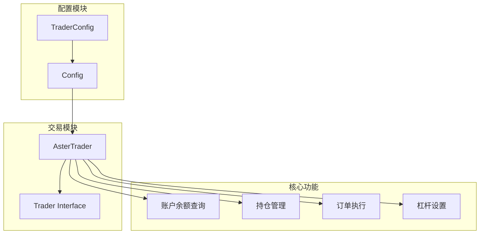
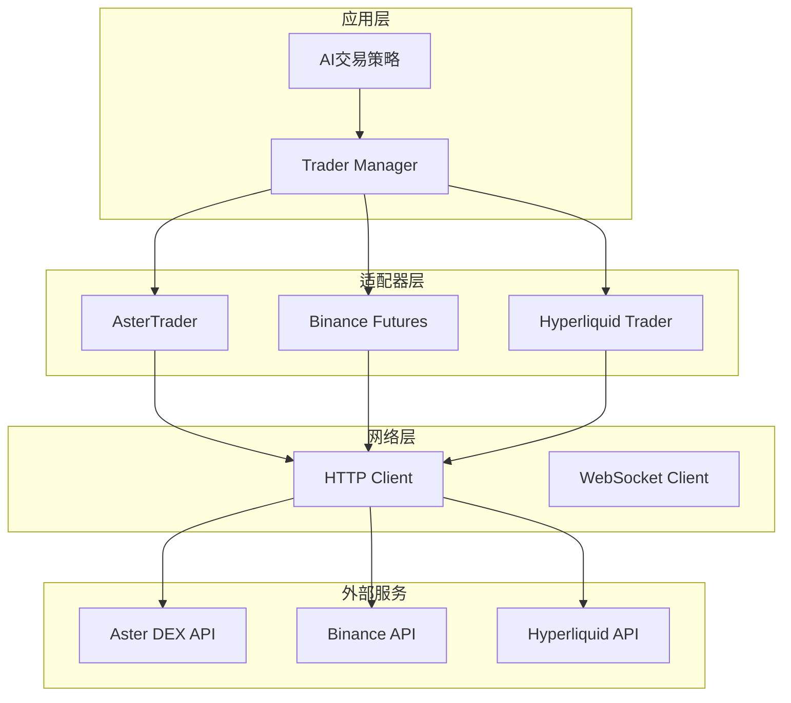
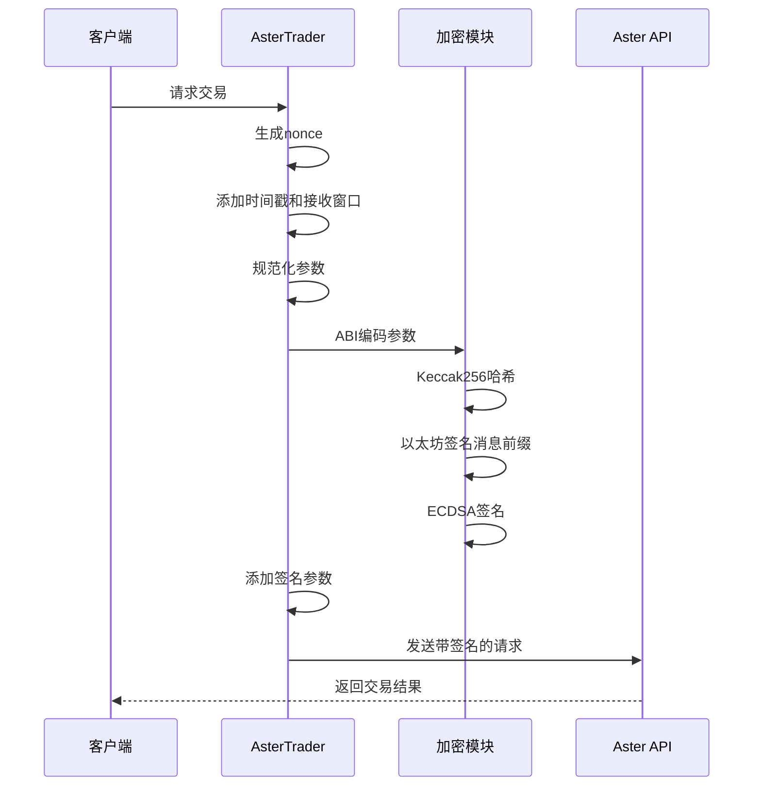
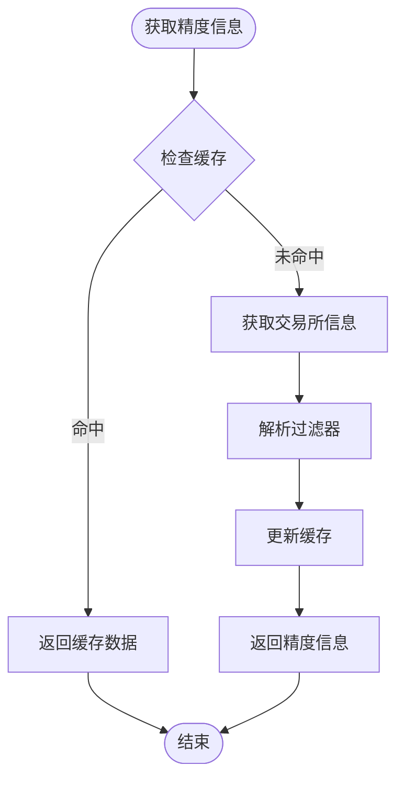
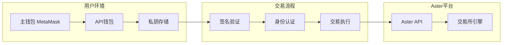
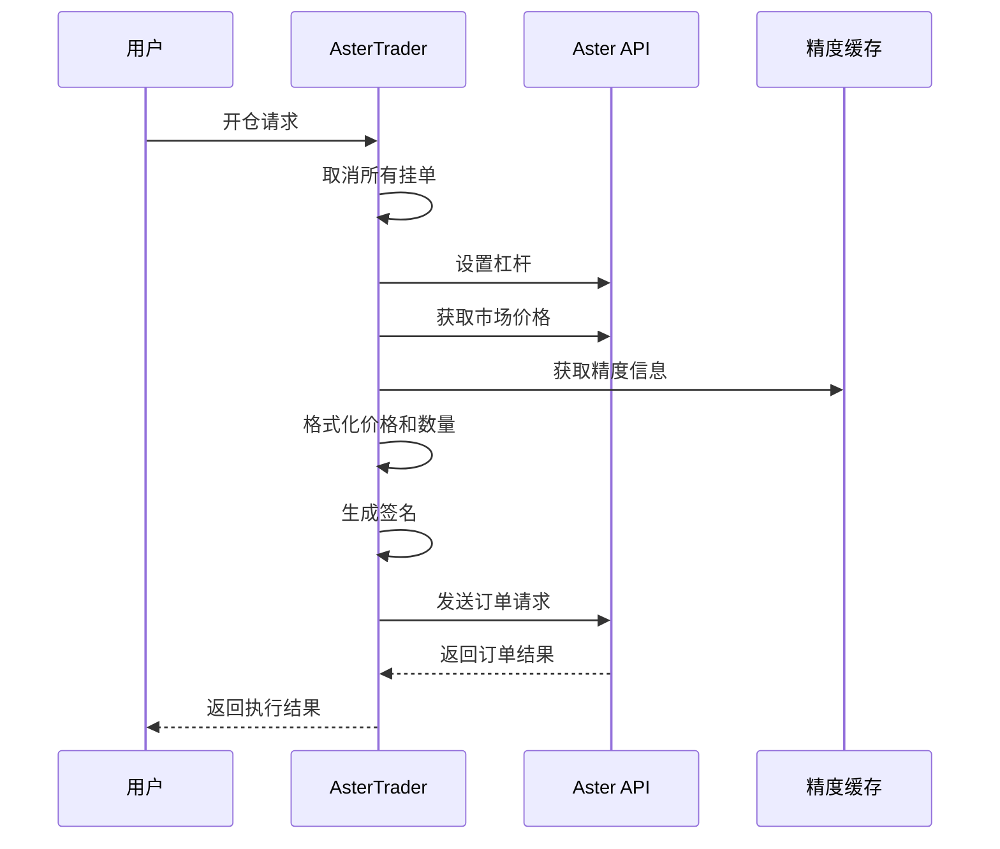
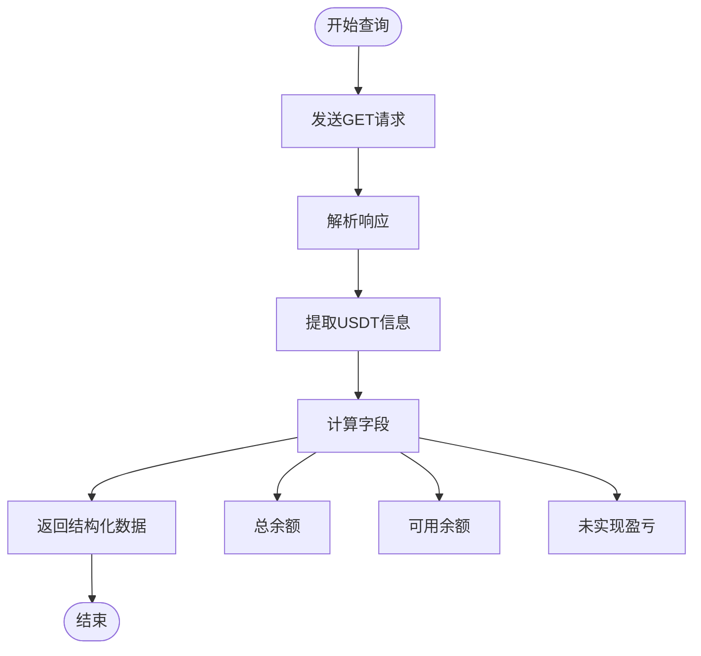

# Aster DEX 集成

<cite>
**本文档中引用的文件**
- [aster_trader.go](file://trader/aster_trader.go)
- [interface.go](file://trader/interface.go)
- [config.go](file://config/config.go)
- [INTEGRATION_BOUNTY_ASTER.md](file://INTEGRATION_BOUNTY_ASTER.md)
- [README.zh-CN.md](file://README.zh-CN.md)
</cite>

## 目录
1. [简介](#简介)
2. [项目结构](#项目结构)
3. [核心组件](#核心组件)
4. [架构概览](#架构概览)
5. [详细组件分析](#详细组件分析)
6. [API钱包安全模型](#api钱包安全模型)
7. [配置说明](#配置说明)
8. [交易流程](#交易流程)
9. [性能考虑](#性能考虑)
10. [故障排除指南](#故障排除指南)
11. [结论](#结论)

## 简介

Aster DEX 是一个基于 Web3 技术的去中心化衍生品交易平台，采用兼容 Binance API 的设计，为用户提供安全、高效的加密货币交易体验。本项目通过 Aster DEX 集成，实现了与 NOFX AI Trading System 的无缝对接，支持自动化交易策略的执行。

Aster 的核心优势包括：
- **兼容 Binance API**：最小化迁移成本，现有 Binance 用户可快速切换
- **API 钱包安全系统**：独立交易钱包提升安全性
- **更低的交易手续费**：相比传统中心化交易所更具竞争力
- **多链支持**：支持以太坊、BSC、Polygon 等 EVM 链
- **无需 KYC**：完全去中心化的交易体验

## 项目结构

Aster DEX 集成在 NOFX 项目中的组织结构如下：



**图表来源**
- [aster_trader.go](file://trader/aster_trader.go#L23-L35)
- [interface.go](file://trader/interface.go#L3-L42)

**章节来源**
- [aster_trader.go](file://trader/aster_trader.go#L1-L50)
- [config.go](file://config/config.go#L1-L50)

## 核心组件

### AsterTrader 结构体

AsterTrader 是 Aster DEX 集成的核心组件，负责与 Aster 交易所的交互：

```mermaid
classDiagram
class AsterTrader {
+context.Context ctx
+string user
+string signer
+*ecdsa.PrivateKey privateKey
+*http.Client client
+string baseURL
+map[string]SymbolPrecision symbolPrecision
+sync.RWMutex mu
+NewAsterTrader(user, signer, privateKeyHex) AsterTrader
+GetBalance() map[string]interface{}
+GetPositions() []map[string]interface{}
+OpenLong(symbol, quantity, leverage) map[string]interface{}
+OpenShort(symbol, quantity, leverage) map[string]interface{}
+CloseLong(symbol, quantity) map[string]interface{}
+CloseShort(symbol, quantity) map[string]interface{}
+SetLeverage(symbol, leverage) error
+GetMarketPrice(symbol) float64
+SetStopLoss(symbol, positionSide, quantity, stopPrice) error
+SetTakeProfit(symbol, positionSide, quantity, takeProfitPrice) error
+CancelAllOrders(symbol) error
+FormatQuantity(symbol, quantity) string
}
class SymbolPrecision {
+int PricePrecision
+int QuantityPrecision
+float64 TickSize
+float64 StepSize
}
AsterTrader --> SymbolPrecision : "缓存"
```

**图表来源**
- [aster_trader.go](file://trader/aster_trader.go#L23-L35)
- [aster_trader.go](file://trader/aster_trader.go#L37-L42)

### 关键字段说明

| 字段 | 类型 | 描述 | 安全级别 |
|------|------|------|----------|
| `user` | string | 主钱包地址 (ERC20) | 中等 - 用于身份验证 |
| `signer` | string | API钱包地址 | 高 - 独立的交易钱包 |
| `privateKey` | *ecdsa.PrivateKey | API钱包私钥 | 最高 - 需严格保管 |
| `client` | *http.Client | HTTP客户端 | 无敏感信息 |
| `baseURL` | string | API基础URL | 无敏感信息 |

**章节来源**
- [aster_trader.go](file://trader/aster_trader.go#L23-L35)

## 架构概览

Aster DEX 集成采用分层架构设计，确保代码的可维护性和扩展性：



**图表来源**
- [interface.go](file://trader/interface.go#L3-L42)
- [aster_trader.go](file://trader/aster_trader.go#L59-L75)

## 详细组件分析

### ECDSA 签名机制

Aster DEX 实现了基于 ECDSA 的签名机制，确保交易的安全性：



**图表来源**
- [aster_trader.go](file://trader/aster_trader.go#L230-L280)

### 交易对精度缓存策略

Aster DEX 实现了智能的交易对精度信息缓存机制：



**图表来源**
- [aster_trader.go](file://trader/aster_trader.go#L77-L110)

**章节来源**
- [aster_trader.go](file://trader/aster_trader.go#L77-L110)
- [aster_trader.go](file://trader/aster_trader.go#L230-L280)

### HTTP 客户端配置

Aster DEX 使用优化的 HTTP 客户端配置：

| 配置项 | 值 | 说明 |
|--------|-----|------|
| Timeout | 30秒 | 整体请求超时时间 |
| TLSHandshakeTimeout | 10秒 | TLS握手超时 |
| ResponseHeaderTimeout | 10秒 | 响应头超时 |
| IdleConnTimeout | 90秒 | 空闲连接超时 |

**章节来源**
- [aster_trader.go](file://trader/aster_trader.go#L59-L75)

## API钱包安全模型

### 安全架构设计

Aster DEX 采用了独特的 API 钱包安全模型，提供额外的安全保护层：



**图表来源**
- [aster_trader.go](file://trader/aster_trader.go#L23-L35)

### 安全最佳实践

1. **私钥隔离**：API 钱包私钥与主钱包分离
2. **一次性使用**：私钥仅在创建时显示一次
3. **权限控制**：可随时撤销 API 钱包访问权限
4. **签名验证**：所有交易都需要 ECDSA 签名

**章节来源**
- [README.zh-CN.md](file://README.zh-CN.md#L527-L579)

## 配置说明

### config.json 配置示例

以下是 Aster DEX 的完整配置示例：

```json
{
  "traders": [
    {
      "id": "aster_deepseek",
      "name": "Aster DeepSeek Trader",
      "enabled": true,
      "ai_model": "deepseek",
      "exchange": "aster",
      
      "aster_user": "0x63DD5aCC6b1aa0f563956C0e534DD30B6dcF7C4e",
      "aster_signer": "0x21cF8Ae13Bb72632562c6Fff438652Ba1a151bb0",
      "aster_private_key": "4fd0a42218f3eae43a6ce26d22544e986139a01e5b34a62db53757ffca81bae1",
      
      "deepseek_key": "sk-xxxxxxxxxxxxx",
      "initial_balance": 1000.0,
      "scan_interval_minutes": 3
    }
  ],
  "use_default_coins": true,
  "api_server_port": 8080,
  "leverage": {
    "btc_eth_leverage": 5,
    "altcoin_leverage": 5
  }
}
```

### 配置字段详解

| 字段 | 类型 | 必需 | 描述 |
|------|------|------|------|
| `exchange` | string | 是 | 设置为 "aster" |
| `aster_user` | string | 是 | 主钱包地址 |
| `aster_signer` | string | 是 | API钱包地址 |
| `aster_private_key` | string | 是 | API钱包私钥（去掉0x前缀） |

**章节来源**
- [config.go](file://config/config.go#L15-L25)
- [README.zh-CN.md](file://README.zh-CN.md#L545-L579)

## 交易流程

### 订单执行流程

Aster DEX 的订单执行遵循严格的流程控制：



**图表来源**
- [aster_trader.go](file://trader/aster_trader.go#L476-L565)
- [aster_trader.go](file://trader/aster_trader.go#L567-L624)

### 账户余额查询

Aster DEX 提供了完整的账户余额查询功能：



**图表来源**
- [aster_trader.go](file://trader/aster_trader.go#L422-L474)

**章节来源**
- [aster_trader.go](file://trader/aster_trader.go#L422-L474)
- [aster_trader.go](file://trader/aster_trader.go#L476-L565)

## 性能考虑

### 重试机制

Aster DEX 实现了智能的重试机制，提高交易成功率：

| 错误类型 | 重试次数 | 退避策略 |
|----------|----------|----------|
| 网络超时 | 3次 | 指数退避 |
| 连接重置 | 3次 | 指数退避 |
| EOF错误 | 3次 | 指数退避 |
| 其他错误 | 不重试 | 直接返回 |

### 并发控制

使用读写锁 (`sync.RWMutex`) 保护共享资源：

- **读操作**：允许多个并发读取
- **写操作**：独占访问，确保数据一致性

**章节来源**
- [aster_trader.go](file://trader/aster_trader.go#L320-L369)
- [aster_trader.go](file://trader/aster_trader.go#L77-L85)

## 故障排除指南

### 常见问题及解决方案

#### 1. 私钥解析失败
**症状**：`解析私钥失败` 错误
**原因**：私钥格式不正确或包含无效字符
**解决**：确保私钥为有效的十六进制字符串，去掉 `0x` 前缀

#### 2. 签名验证失败
**症状**：`签名失败` 或 `401 Unauthorized` 错误
**原因**：时间戳过期或参数被篡改
**解决**：检查系统时间同步，确保参数完整性

#### 3. 精度格式错误
**症状**：`价格精度` 或 `数量精度` 错误
**原因**：未正确处理交易对精度
**解决**：系统会自动缓存并处理精度信息

#### 4. 网络连接问题
**症状**：`连接超时` 或 `EOF` 错误
**原因**：网络不稳定或服务器负载过高
**解决**：检查网络连接，等待服务器恢复

**章节来源**
- [aster_trader.go](file://trader/aster_trader.go#L48-L56)
- [aster_trader.go](file://trader/aster_trader.go#L320-L369)

## 结论

Aster DEX 集成为 NOFX AI Trading System 提供了一个安全、高效且兼容性强的去中心化交易平台集成方案。通过其独特的 API 钱包安全模型和兼容 Binance API 的设计，用户可以轻松地从传统中心化交易所迁移到去中心化交易环境中。

### 主要优势

1. **安全性**：API 钱包隔离，私钥独立管理
2. **兼容性**：完全兼容 Binance API，降低迁移成本
3. **效率**：自动精度处理，简化交易逻辑
4. **成本**：更低的交易手续费
5. **灵活性**：多链支持，无需 KYC

### 未来发展方向

- WebSocket 实时数据流支持
- 更多交易功能集成
- 多交易所竞争模式
- 高级风险管理工具

通过 Aster DEX 集成，NOFX 用户可以获得更安全、更高效的交易体验，同时保持与现有系统的兼容性。