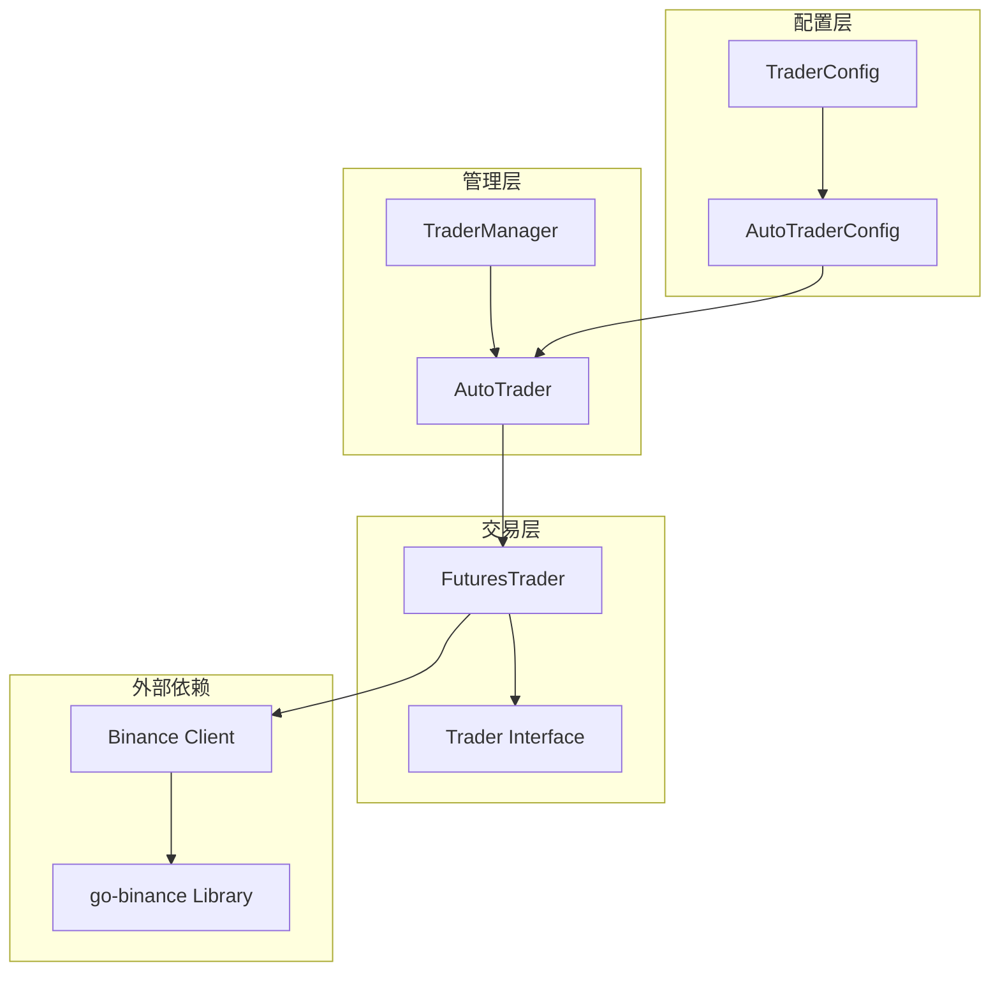
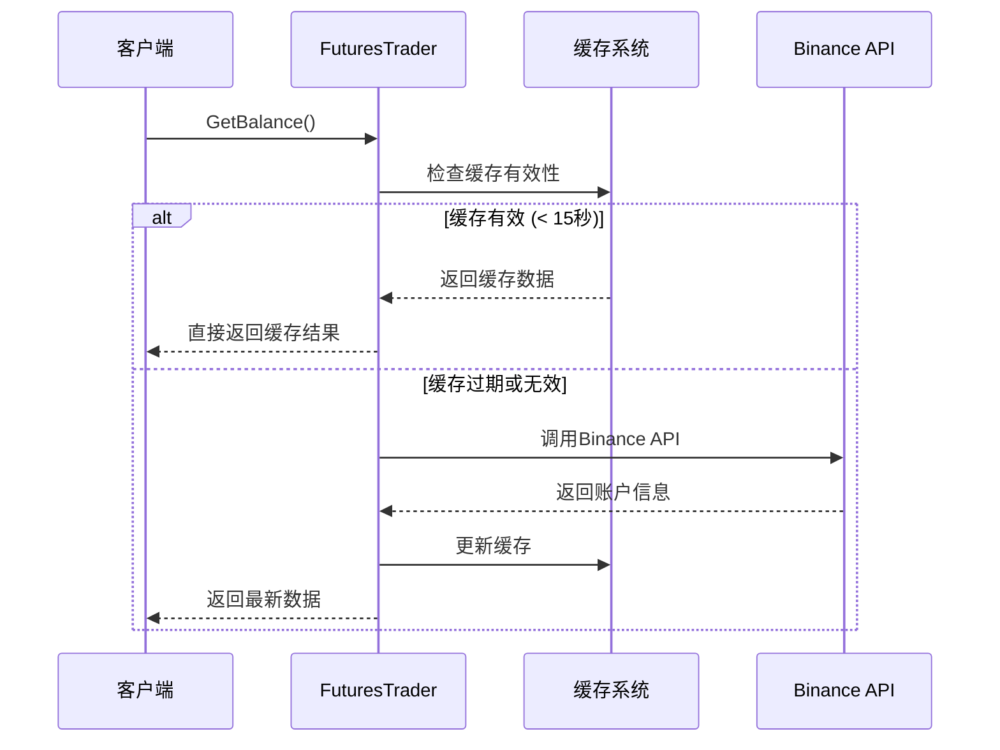
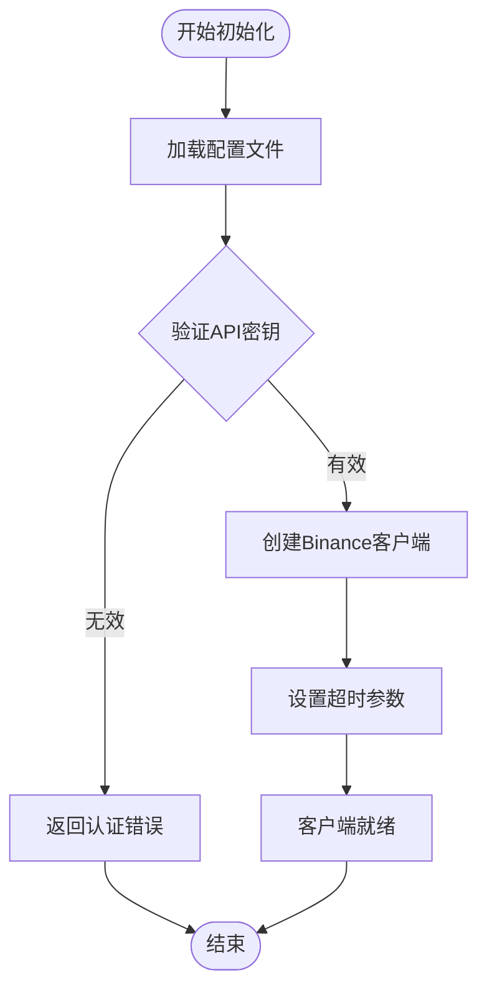
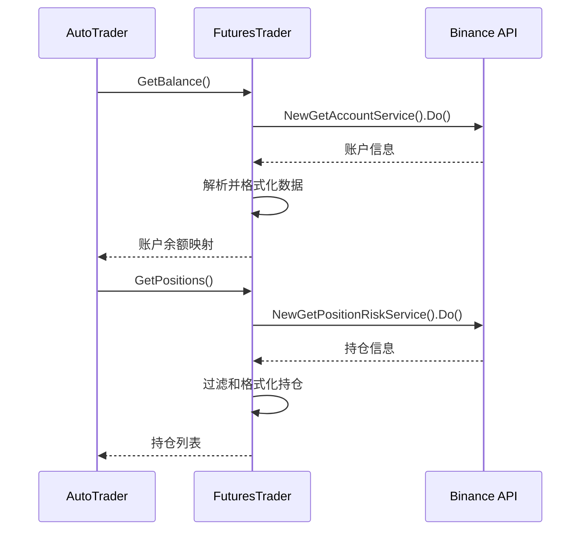
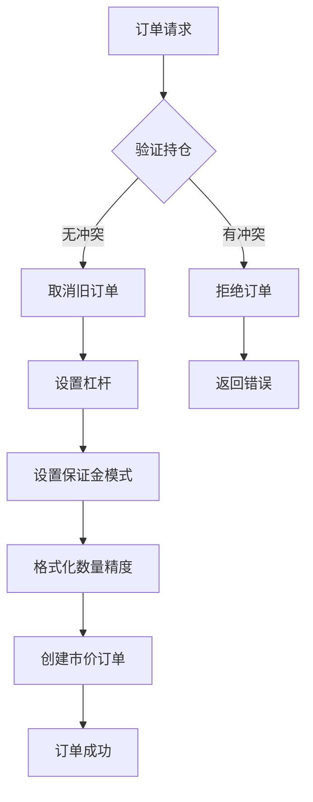
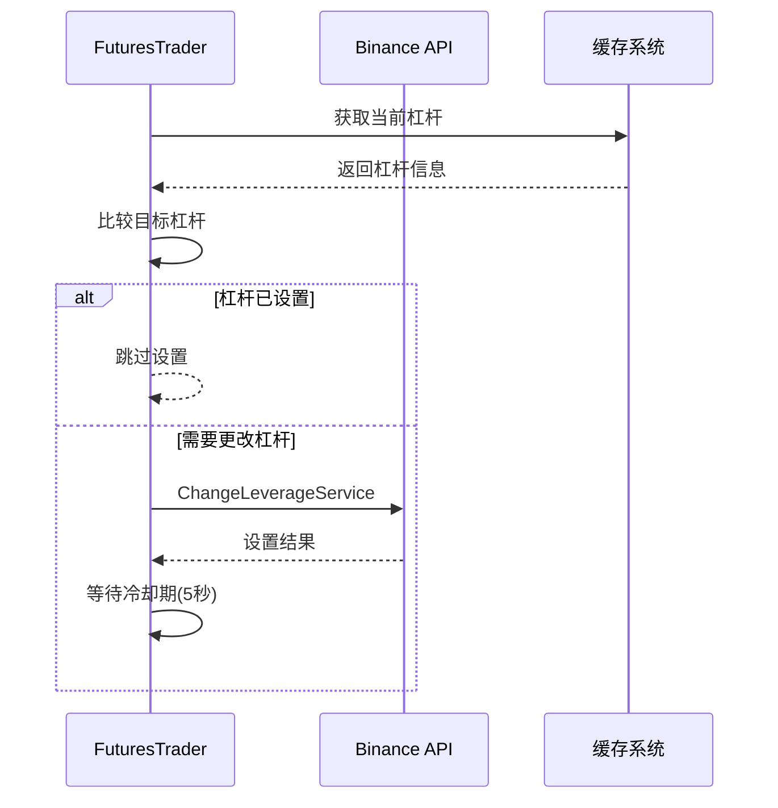
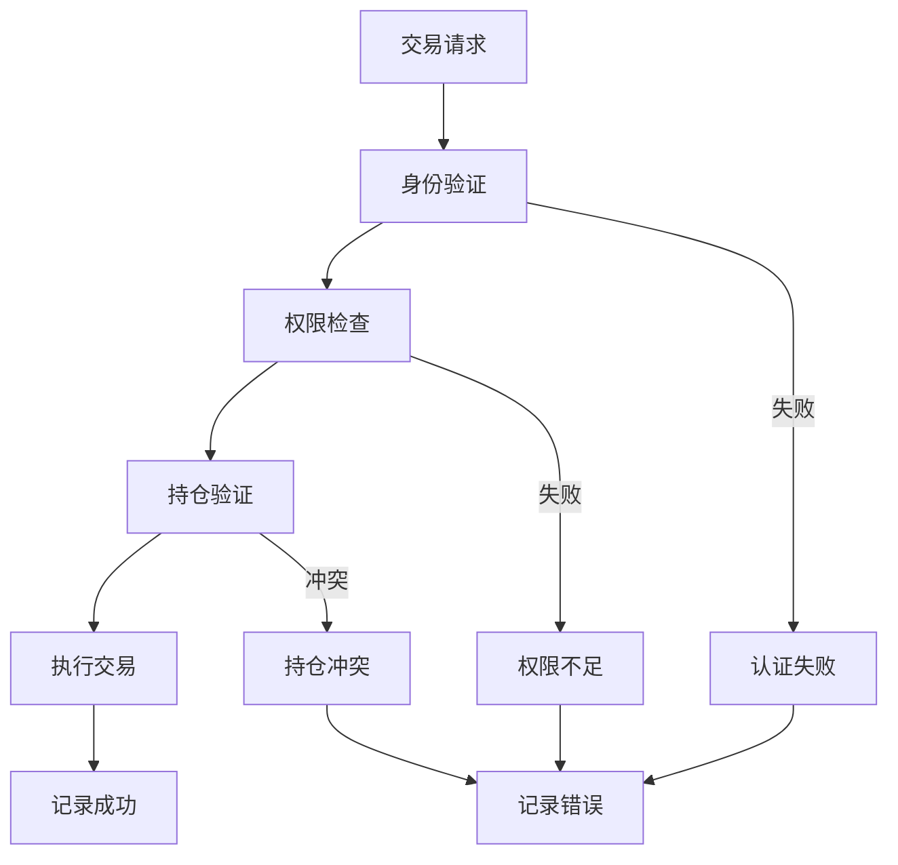
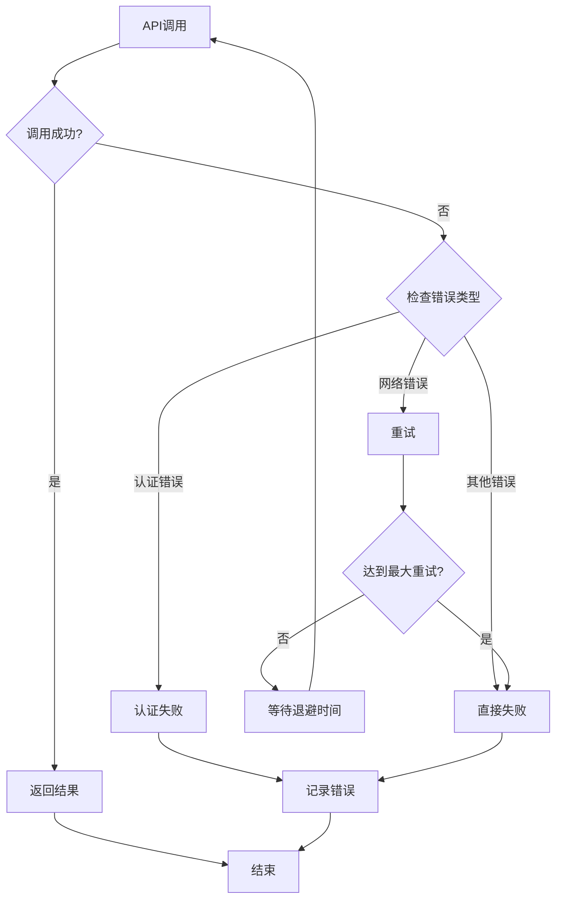
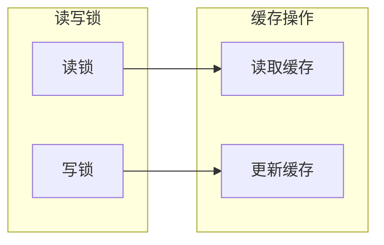

# Binance 期货集成

<cite>
**本文档引用的文件**
- [trader/binance_futures.go](file://trader/binance_futures.go)
- [trader/interface.go](file://trader/interface.go)
- [trader/auto_trader.go](file://trader/auto_trader.go)
- [manager/trader_manager.go](file://manager/trader_manager.go)
- [config/config.go](file://config/config.go)
- [README.md](file://README.md)
- [常见问题.md](file://常见问题.md)
</cite>

## 目录
1. [简介](#简介)
2. [项目结构概览](#项目结构概览)
3. [核心组件分析](#核心组件分析)
4. [API认证机制](#api认证机制)
5. [配置管理](#配置管理)
6. [交易接口实现](#交易接口实现)
7. [安全最佳实践](#安全最佳实践)
8. [错误处理与故障排除](#错误处理与故障排除)
9. [性能优化](#性能优化)
10. [总结](#总结)

## 简介

Binance期货集成是NOFX自动交易系统的核心组件之一，负责与Binance Futures交易所进行交互。该集成实现了完整的期货交易功能，包括账户管理、市场数据获取、订单执行和风险管理等功能。

### 主要特性

- **完整的期货交易支持**：支持多头、空头开仓和平仓操作
- **智能杠杆管理**：自动调整杠杆倍数并处理冷却期
- **保证金模式控制**：支持逐仓和全仓模式切换
- **止损止盈功能**：支持市价止损和止盈单设置
- **缓存机制**：优化API调用频率，减少不必要的请求
- **错误处理**：完善的错误处理和重试机制

## 项目结构概览



**图表来源**
- [trader/binance_futures.go](file://trader/binance_futures.go#L1-L50)
- [trader/interface.go](file://trader/interface.go#L1-L42)
- [trader/auto_trader.go](file://trader/auto_trader.go#L1-L100)

**章节来源**
- [trader/binance_futures.go](file://trader/binance_futures.go#L1-L615)
- [trader/interface.go](file://trader/interface.go#L1-L42)

## 核心组件分析

### FuturesTrader 结构体

FuturesTrader是Binance期货交易的核心实现类，封装了与Binance API的所有交互逻辑。

```mermaid
classDiagram
class FuturesTrader {
+client *futures.Client
+cachedBalance map[string]interface{}
+balanceCacheTime time.Time
+balanceCacheMutex sync.RWMutex
+cachedPositions []map[string]interface{}
+positionsCacheTime time.Time
+positionsCacheMutex sync.RWMutex
+cacheDuration time.Duration
+NewFuturesTrader(apiKey, secretKey) *FuturesTrader
+GetBalance() map[string]interface{}, error
+GetPositions() []map[string]interface{}, error
+SetLeverage(symbol, leverage) error
+SetMarginType(symbol, marginType) error
+OpenLong(symbol, quantity, leverage) map[string]interface{}, error
+OpenShort(symbol, quantity, leverage) map[string]interface{}, error
+CloseLong(symbol, quantity) map[string]interface{}, error
+CloseShort(symbol, quantity) map[string]interface{}, error
+SetStopLoss(symbol, positionSide, quantity, stopPrice) error
+SetTakeProfit(symbol, positionSide, quantity, takeProfitPrice) error
+GetMarketPrice(symbol) float64, error
+FormatQuantity(symbol, quantity) string, error
}
class Trader {
<<interface>>
+GetBalance() map[string]interface{}, error
+GetPositions() []map[string]interface{}, error
+OpenLong(symbol, quantity, leverage) map[string]interface{}, error
+OpenShort(symbol, quantity, leverage) map[string]interface{}, error
+CloseLong(symbol, quantity) map[string]interface{}, error
+CloseShort(symbol, quantity) map[string]interface{}, error
+SetLeverage(symbol, leverage) error
+GetMarketPrice(symbol) float64, error
+SetStopLoss(symbol, positionSide, quantity, stopPrice) error
+SetTakeProfit(symbol, positionSide, quantity, takeProfitPrice) error
+CancelAllOrders(symbol) error
+FormatQuantity(symbol, quantity) string, error
}
FuturesTrader ..|> Trader : 实现
```

**图表来源**
- [trader/binance_futures.go](file://trader/binance_futures.go#L11-L30)
- [trader/interface.go](file://trader/interface.go#L3-L41)

### 缓存机制设计

系统实现了智能缓存机制来优化API调用频率：



**图表来源**
- [trader/binance_futures.go](file://trader/binance_futures.go#L32-L130)

**章节来源**
- [trader/binance_futures.go](file://trader/binance_futures.go#L11-L30)

## API认证机制

### 密钥管理

Binance期货集成采用基于API密钥的安全认证机制：



**图表来源**
- [trader/binance_futures.go](file://trader/binance_futures.go#L33-L38)

### IP白名单安全策略

虽然代码中没有显式的IP白名单检查，但系统通过以下方式确保安全性：

1. **API密钥保护**：密钥存储在配置文件中，不暴露在代码中
2. **HTTPS通信**：所有API调用通过HTTPS加密传输
3. **权限最小化**：API密钥权限范围最小化

**章节来源**
- [trader/binance_futures.go](file://trader/binance_futures.go#L33-L38)

## 配置管理

### 配置文件结构

Binance期货集成的配置通过`config.json`文件管理，支持多种配置选项：

| 配置字段 | 类型 | 描述 | 必需 |
|---------|------|------|------|
| `id` | string | Trader唯一标识符 | 是 |
| `name` | string | 显示名称 | 是 |
| `enabled` | boolean | 是否启用 | 是 |
| `exchange` | string | 交易平台（固定为"binance"） | 是 |
| `binance_api_key` | string | Binance API密钥 | 是 |
| `binance_secret_key` | string | Binance Secret密钥 | 是 |
| `ai_model` | string | AI模型类型 | 是 |
| `initial_balance` | float | 初始资金余额 | 是 |
| `scan_interval_minutes` | integer | 扫描间隔（分钟） | 是 |
| `leverage` | object | 杠杆配置 | 是 |

### 配置示例

以下是完整的Binance配置示例：

```json
{
  "traders": [
    {
      "id": "binance_trader",
      "name": "Binance AI Trader",
      "enabled": true,
      "exchange": "binance",
      "binance_api_key": "YOUR_BINANCE_API_KEY",
      "binance_secret_key": "YOUR_BINANCE_SECRET_KEY",
      "ai_model": "deepseek",
      "deepseek_key": "sk-xxxxxxxxxxxxx",
      "initial_balance": 1000.0,
      "scan_interval_minutes": 3,
      "leverage": {
        "btc_eth_leverage": 5,
        "altcoin_leverage": 5
      }
    }
  ],
  "use_default_coins": true,
  "api_server_port": 8080
}
```

**章节来源**
- [config/config.go](file://config/config.go#L10-L42)
- [README.md](file://README.md#L500-L550)

## 交易接口实现

### 核心交易方法

#### 1. 账户管理接口



**图表来源**
- [trader/binance_futures.go](file://trader/binance_futures.go#L42-L130)
- [trader/binance_futures.go](file://trader/binance_futures.go#L132-L210)

#### 2. 订单执行接口

系统提供了完整的订单执行功能：



**图表来源**
- [trader/binance_futures.go](file://trader/binance_futures.go#L132-L210)
- [trader/binance_futures.go](file://trader/binance_futures.go#L212-L280)

#### 3. 杠杆和保证金管理

系统实现了智能的杠杆管理机制：



**图表来源**
- [trader/binance_futures.go](file://trader/binance_futures.go#L130-L180)

**章节来源**
- [trader/binance_futures.go](file://trader/binance_futures.go#L42-L210)
- [trader/binance_futures.go](file://trader/binance_futures.go#L212-L410)

## 安全最佳实践

### 密钥管理

1. **环境变量保护**：建议将API密钥存储在环境变量中，而不是硬编码在配置文件中
2. **权限最小化**：API密钥应仅具有必要的交易权限，避免使用具有全账户访问权限的密钥
3. **定期轮换**：定期更换API密钥以降低安全风险

### 网络安全

1. **HTTPS通信**：所有API调用都通过HTTPS加密传输
2. **超时设置**：合理的超时设置防止长时间阻塞
3. **错误处理**：完善的错误处理机制防止敏感信息泄露

### 权限控制

系统实现了多层权限控制：



**图表来源**
- [trader/binance_futures.go](file://trader/binance_futures.go#L212-L280)

**章节来源**
- [trader/binance_futures.go](file://trader/binance_futures.go#L130-L180)

## 错误处理与故障排除

### 常见错误及解决方案

#### 1. 杠杆设置错误 (code=-4061)

**错误信息**：`Order's position side does not match user's setting`

**原因**：币安账户设置为单向持仓模式，而系统需要双向持仓模式。

**解决方法**：
1. 登录币安合约交易平台
2. 进入偏好设置 → 持仓模式
3. 切换为双向持仓模式（Hedge Mode）
4. 确认切换前必须平掉所有持仓

#### 2. API限流错误

系统实现了智能的重试机制：



**图表来源**
- [mcp/client.go](file://mcp/client.go#L203-L245)

#### 3. 连接超时处理

系统设置了合理的超时参数：

- **连接超时**：300秒
- **发送超时**：300秒  
- **读取超时**：300秒

### 故障排除指南

#### 诊断步骤

1. **检查配置文件**：验证API密钥和账户设置
2. **网络连接测试**：确认网络连接正常
3. **API权限检查**：验证API密钥权限
4. **账户状态检查**：确认账户状态正常

#### 日志分析

系统提供了详细的日志记录：

```json
{
  "timestamp": "2024-01-01T12:00:00Z",
  "level": "INFO",
  "message": "✓ 开多仓成功: BTCUSDT 数量: 0.001",
  "order_id": 123456789,
  "symbol": "BTCUSDT"
}
```

**章节来源**
- [常见问题.md](file://常见问题.md#L1-L26)
- [mcp/client.go](file://mcp/client.go#L109-L159)

## 性能优化

### 缓存策略

系统实现了多层次的缓存机制：

1. **账户余额缓存**：15秒有效期
2. **持仓信息缓存**：15秒有效期  
3. **市场数据缓存**：实时更新

### 并发控制



**图表来源**
- [trader/binance_futures.go](file://trader/binance_futures.go#L18-L22)

### API调用优化

1. **批量操作**：支持批量取消订单
2. **智能调度**：避免频繁的API调用
3. **错误重试**：指数退避重试机制

**章节来源**
- [trader/binance_futures.go](file://trader/binance_futures.go#L18-L22)
- [trader/binance_futures.go](file://trader/binance_futures.go#L410-L420)

## 总结

Binance期货集成是NOFX自动交易系统的重要组成部分，提供了完整而安全的期货交易功能。通过模块化的架构设计、智能的缓存机制、完善的错误处理和严格的安全措施，该集成能够稳定可靠地支持高频交易需求。

### 主要优势

1. **完整的功能覆盖**：从账户管理到订单执行的全流程支持
2. **高性能设计**：智能缓存和并发控制确保高效运行
3. **安全可靠**：多重安全措施保障交易安全
4. **易于维护**：清晰的代码结构和完善的错误处理

### 最佳实践建议

1. **定期监控**：建立完善的监控和报警机制
2. **备份配置**：定期备份配置文件和重要数据
3. **版本管理**：使用版本控制系统管理代码变更
4. **安全审计**：定期进行安全审计和漏洞评估

通过遵循本文档的指导和最佳实践，可以确保Binance期货集成的稳定运行和最佳性能。