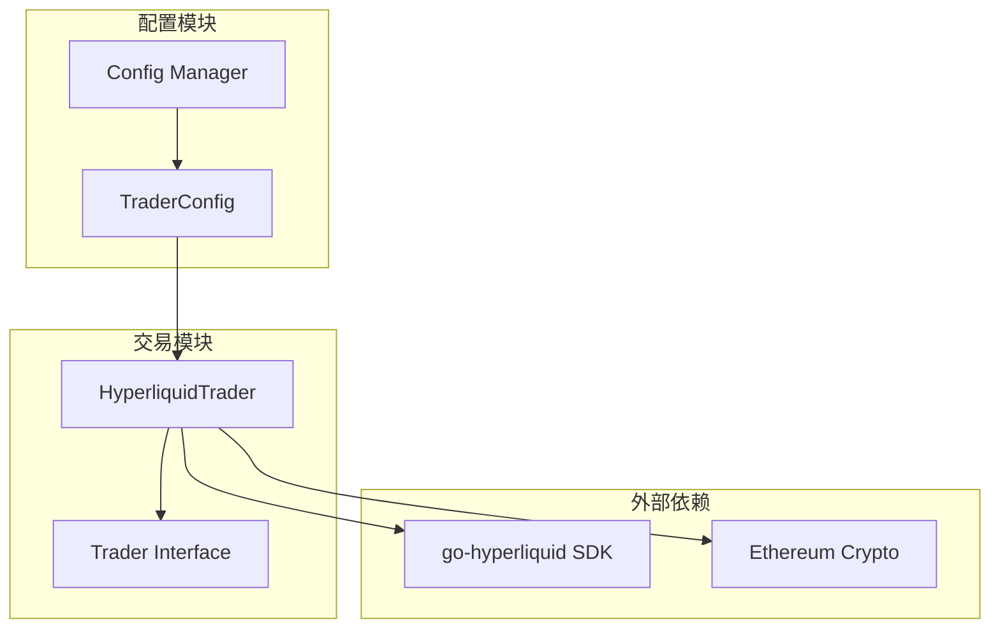
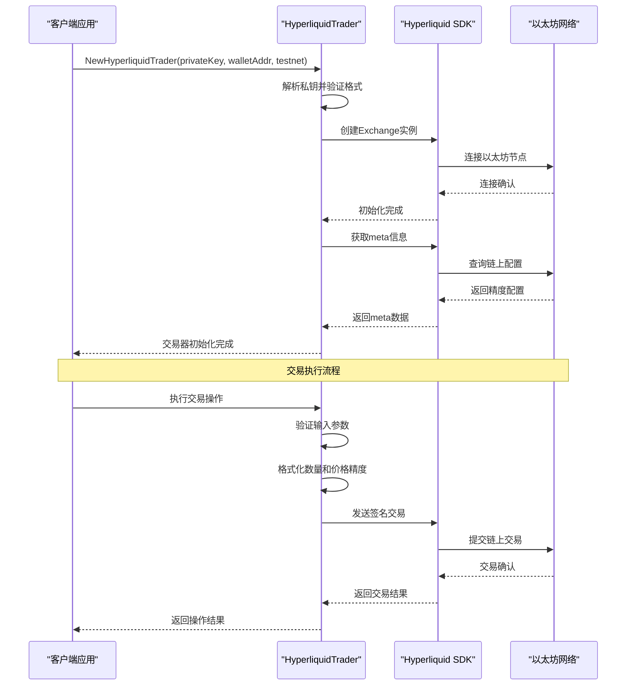
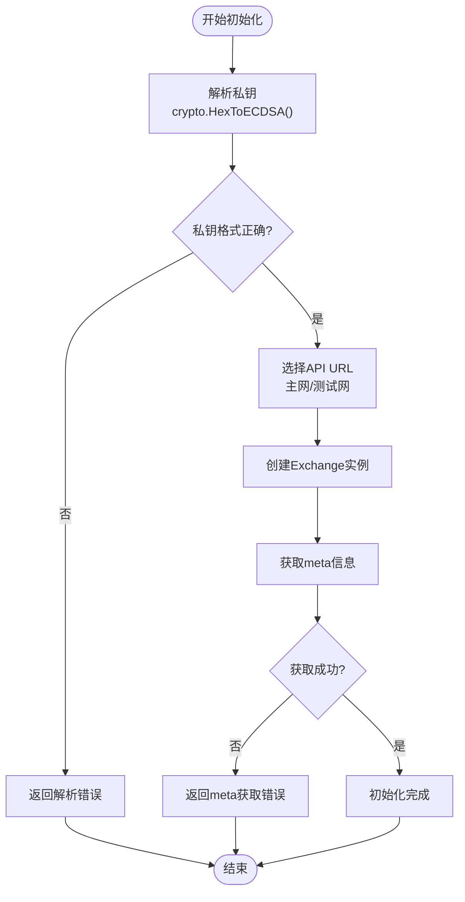
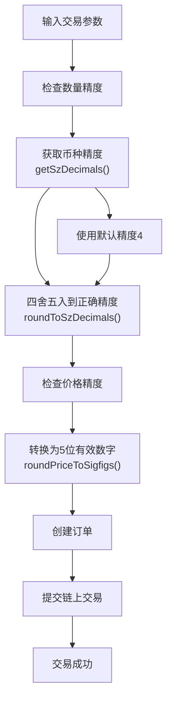
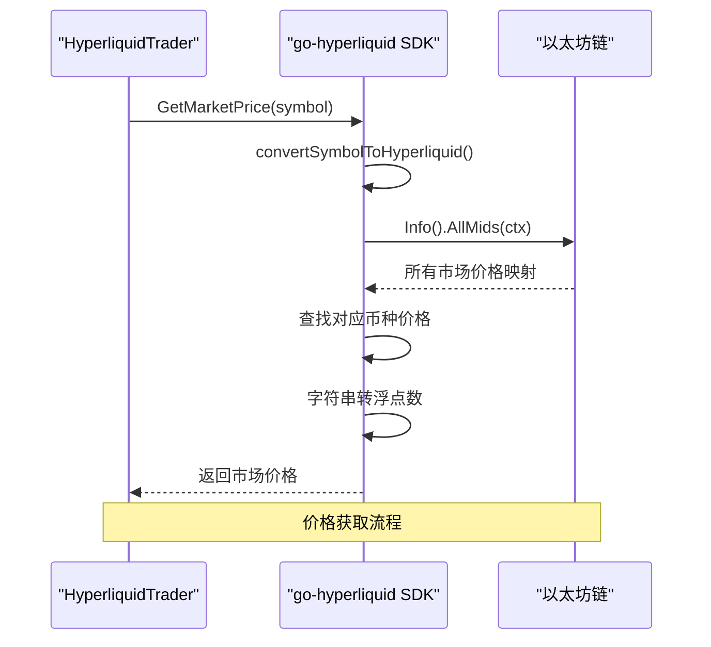
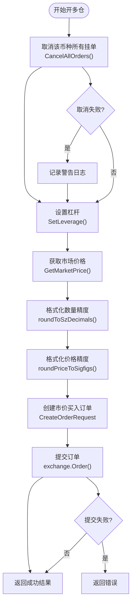
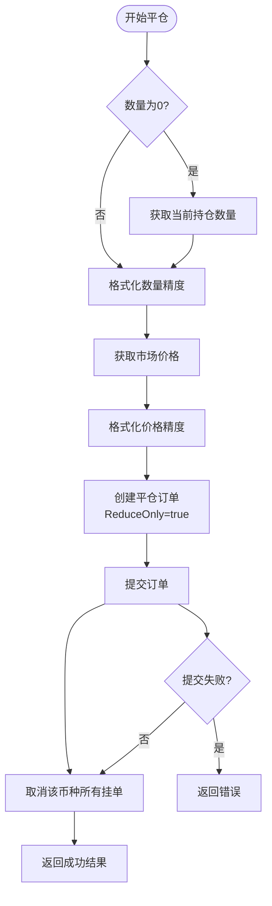
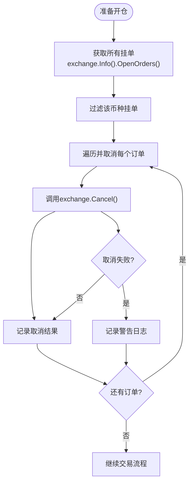
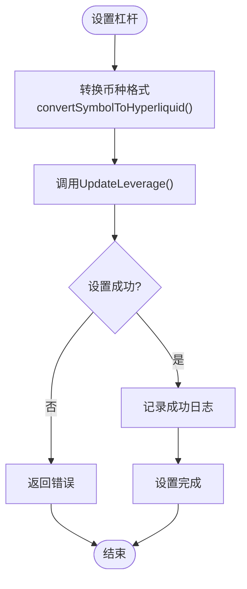
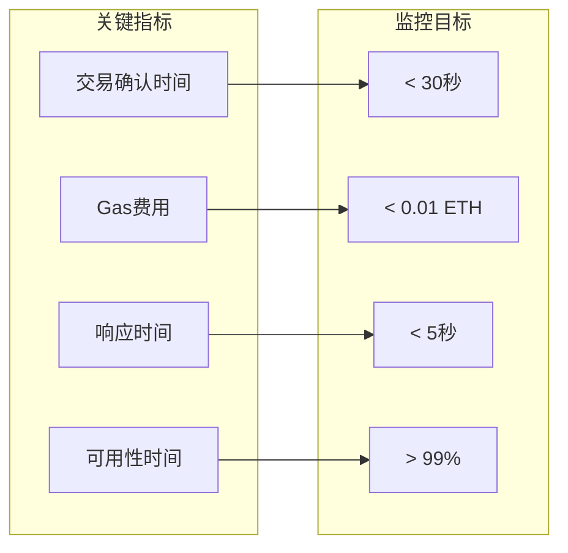

# Hyperliquid 交易所集成

<cite>
**本文档引用的文件**
- [hyperliquid_trader.go](file://trader/hyperliquid_trader.go)
- [interface.go](file://trader/interface.go)
- [config.go](file://config/config.go)
- [README.md](file://README.md)
</cite>

## 目录
1. [简介](#简介)
2. [项目结构](#项目结构)
3. [核心组件](#核心组件)
4. [架构概览](#架构概览)
5. [详细组件分析](#详细组件分析)
6. [配置指南](#配置指南)
7. [交易流程](#交易流程)
8. [风险控制机制](#风险控制机制)
9. [性能考虑](#性能考虑)
10. [故障排除指南](#故障排除指南)
11. [总结](#总结)

## 简介

Hyperliquid 是一个基于以太坊的去中心化衍生品交易平台，提供永续合约交易服务。本文档深入解析 NOFX 项目中 Hyperliquid 交易所的集成方案，重点说明 `HyperliquidTrader` 结构体的设计理念、以太坊私钥认证机制、链上交易签名流程以及与中心化交易所的差异。

## 项目结构

Hyperliquid 集成在 NOFX 项目中的组织结构如下：



**图表来源**
- [hyperliquid_trader.go](file://trader/hyperliquid_trader.go#L1-L20)
- [interface.go](file://trader/interface.go#L1-L10)

**章节来源**
- [hyperliquid_trader.go](file://trader/hyperliquid_trader.go#L1-L682)
- [interface.go](file://trader/interface.go#L1-L42)

## 核心组件

### HyperliquidTrader 结构体设计

`HyperliquidTrader` 结构体是 Hyperliquid 交易所集成的核心组件，包含以下关键字段：

```mermaid
classDiagram
class HyperliquidTrader {
+*hyperliquid.Exchange exchange
+context.Context ctx
+string walletAddr
+*hyperliquid.Meta meta
+NewHyperliquidTrader(privateKeyHex, walletAddr, testnet) *HyperliquidTrader
+GetBalance() map[string]interface{}
+GetPositions() []map[string]interface{}
+OpenLong(symbol, quantity, leverage) map[string]interface{}
+OpenShort(symbol, quantity, leverage) map[string]interface{}
+CloseLong(symbol, quantity) map[string]interface{}
+CloseShort(symbol, quantity) map[string]interface{}
+SetLeverage(symbol, leverage) error
+GetMarketPrice(symbol) float64
+SetStopLoss(symbol, positionSide, quantity, stopPrice) error
+SetTakeProfit(symbol, positionSide, quantity, takeProfitPrice) error
+CancelAllOrders(symbol) error
+FormatQuantity(symbol, quantity) string
-getSzDecimals(coin) int
-roundToSzDecimals(coin, quantity) float64
-roundPriceToSigfigs(price) float64
}
class TraderInterface {
<<interface>>
+GetBalance() map[string]interface{}
+GetPositions() []map[string]interface{}
+OpenLong(symbol, quantity, leverage) map[string]interface{}
+OpenShort(symbol, quantity, leverage) map[string]interface{}
+CloseLong(symbol, quantity) map[string]interface{}
+CloseShort(symbol, quantity) map[string]interface{}
+SetLeverage(symbol, leverage) error
+GetMarketPrice(symbol) float64
+SetStopLoss(symbol, positionSide, quantity, stopPrice) error
+SetTakeProfit(symbol, positionSide, quantity, takeProfitPrice) error
+CancelAllOrders(symbol) error
+FormatQuantity(symbol, quantity) string
}
HyperliquidTrader ..|> TraderInterface
```

**图表来源**
- [hyperliquid_trader.go](file://trader/hyperliquid_trader.go#L13-L18)
- [interface.go](file://trader/interface.go#L4-L41)

### 字段详解

1. **exchange**: Hyperliquid 客户端实例，负责与链上智能合约交互
2. **ctx**: 上下文对象，用于控制请求生命周期
3. **walletAddr**: 以太坊钱包地址，标识交易账户
4. **meta**: 缓存的元数据信息，包含各币种的精度配置

**章节来源**
- [hyperliquid_trader.go](file://trader/hyperliquid_trader.go#L13-L18)

## 架构概览

Hyperliquid 集成采用分层架构设计，确保安全性和可维护性：



**图表来源**
- [hyperliquid_trader.go](file://trader/hyperliquid_trader.go#L20-L68)
- [hyperliquid_trader.go](file://trader/hyperliquid_trader.go#L56-L70)

## 详细组件分析

### 私钥认证机制

Hyperliquid 交易器采用以太坊标准的私钥认证机制：



**图表来源**
- [hyperliquid_trader.go](file://trader/hyperliquid_trader.go#L20-L35)
- [hyperliquid_trader.go](file://trader/hyperliquid_trader.go#L56-L70)

#### 私钥安全要求

系统对私钥有严格的安全要求：
- 必须移除 `0x` 前缀
- 必须是有效的以太坊私钥格式
- 不会存储或传输原始私钥

**章节来源**
- [hyperliquid_trader.go](file://trader/hyperliquid_trader.go#L20-L35)

### 交易精度控制系统

Hyperliquid 对数量和价格都有严格的精度要求：



**图表来源**
- [hyperliquid_trader.go](file://trader/hyperliquid_trader.go#L601-L662)
- [hyperliquid_trader.go](file://trader/hyperliquid_trader.go#L625-L658)

#### 精度处理算法

系统实现了专门的精度处理算法：

1. **数量精度**: 根据币种的 `SzDecimals` 字段进行四舍五入
2. **价格精度**: 转换为5位有效数字，符合 Hyperliquid 规范

**章节来源**
- [hyperliquid_trader.go](file://trader/hyperliquid_trader.go#L625-L680)

### 实时市场数据获取

系统通过 WebSocket 和 REST API 获取实时市场数据：



**图表来源**
- [hyperliquid_trader.go](file://trader/hyperliquid_trader.go#L484-L505)

**章节来源**
- [hyperliquid_trader.go](file://trader/hyperliquid_trader.go#L484-L505)

## 配置指南

### 完整配置示例

以下是 `config.json` 中 Hyperliquid 配置的完整示例：

```json
{
  "traders": [
    {
      "id": "hyperliquid_trader",
      "name": "My Hyperliquid Trader",
      "enabled": true,
      "ai_model": "deepseek",
      "exchange": "hyperliquid",
      "hyperliquid_private_key": "your_private_key_without_0x",
      "hyperliquid_wallet_addr": "your_ethereum_address",
      "hyperliquid_testnet": false,
      "deepseek_key": "sk-xxxxxxxxxxxxx",
      "initial_balance": 1000.0,
      "scan_interval_minutes": 3
    }
  ],
  "use_default_coins": true,
  "api_server_port": 8080
}
```

### 配置字段说明

| 字段名 | 类型 | 必填 | 描述 |
|--------|------|------|------|
| `exchange` | string | 是 | 设置为 "hyperliquid" |
| `hyperliquid_private_key` | string | 是 | 以太坊私钥（去除0x前缀） |
| `hyperliquid_wallet_addr` | string | 是 | 以太坊钱包地址 |
| `hyperliquid_testnet` | boolean | 否 | 是否使用测试网，默认false |

**章节来源**
- [README.md](file://README.md#L500-L525)
- [config.go](file://config/config.go#L15-L35)

## 交易流程

### 开仓流程

以开多仓为例，展示完整的交易流程：



**图表来源**
- [hyperliquid_trader.go](file://trader/hyperliquid_trader.go#L185-L252)

### 平仓流程

平仓流程与开仓类似，但使用 IOC（立即成交或取消）订单：



**图表来源**
- [hyperliquid_trader.go](file://trader/hyperliquid_trader.go#L344-L428)
- [hyperliquid_trader.go](file://trader/hyperliquid_trader.go#L430-L482)

**章节来源**
- [hyperliquid_trader.go](file://trader/hyperliquid_trader.go#L185-L252)
- [hyperliquid_trader.go](file://trader/hyperliquid_trader.go#L344-L428)

## 风险控制机制

### 订单取消策略

系统在每次开仓前都会自动取消该币种的所有挂单，防止意外成交：



**图表来源**
- [hyperliquid_trader.go](file://trader/hyperliquid_trader.go#L484-L503)

### 杠杆设置控制

系统支持动态杠杆设置，但会验证输入的有效性：



**图表来源**
- [hyperliquid_trader.go](file://trader/hyperliquid_trader.go#L215-L225)

**章节来源**
- [hyperliquid_trader.go](file://trader/hyperliquid_trader.go#L484-L503)
- [hyperliquid_trader.go](file://trader/hyperliquid_trader.go#L215-L225)

## 性能考虑

### 与中心化交易所的差异

Hyperliquid 作为去中心化交易所，在性能方面存在显著差异：

| 特性 | 中心化交易所 | Hyperliquid |
|------|-------------|-------------|
| 交易确认时间 | 几毫秒 | 几秒到几十秒 |
| Gas费用 | 无 | 每笔交易产生 |
| 市场深度 | 实时更新 | 区块确认后更新 |
| 可用性 | 高可用服务器 | 依赖以太坊网络 |

### 优化建议

1. **批量订单管理**: 在开仓前批量取消相关订单
2. **价格精度优化**: 预先计算常用价格精度，减少重复计算
3. **网络连接优化**: 使用稳定的以太坊节点提供商
4. **错误重试机制**: 实现指数退避的重试策略

### 性能监控指标



## 故障排除指南

### 常见错误及解决方案

#### 私钥格式错误
**错误信息**: "解析私钥失败"
**原因**: 私钥包含 `0x` 前缀或格式不正确
**解决方案**: 确保私钥只包含十六进制字符，不包含 `0x` 前缀

#### 权益不足错误
**错误信息**: "账户余额不足"
**原因**: 以太坊账户余额不足以支付 gas 费用
**解决方案**: 确保钱包中有足够的 ETH 余额

#### 精度错误
**错误信息**: "数量精度不符合要求"
**原因**: 输入的数量超出币种允许的精度范围
**解决方案**: 使用 `FormatQuantity()` 方法格式化数量

#### 网络连接错误
**错误信息**: "API调用失败"
**原因**: 以太坊节点连接不稳定
**解决方案**: 检查网络连接，使用备用节点

**章节来源**
- [hyperliquid_trader.go](file://trader/hyperliquid_trader.go#L20-L35)
- [hyperliquid_trader.go](file://trader/hyperliquid_trader.go#L56-L70)

## 总结

Hyperliquid 交易所集成方案展现了去中心化金融的独特优势和挑战：

### 主要特点

1. **安全性**: 基于以太坊的去中心化架构，无需信任第三方
2. **透明性**: 所有交易都在区块链上公开可查
3. **自主权**: 用户完全掌控自己的资金和私钥
4. **抗审查**: 不受单一机构控制

### 技术优势

1. **标准化接口**: 实现了统一的交易器接口
2. **精确控制**: 严格的精度控制系统
3. **风险控制**: 自动化的订单管理和风险控制
4. **实时数据**: 高效的市场数据获取机制

### 注意事项

1. **性能延迟**: 链上交易导致的确认时间较长
2. **Gas费用**: 需要考虑交易成本
3. **私钥安全**: 严格保护私钥安全
4. **网络稳定性**: 依赖以太坊网络的可靠性

通过合理配置和优化，Hyperliquid 集成能够为用户提供安全、可靠的去中心化交易体验，同时保持与传统中心化交易所相当的功能完整性。