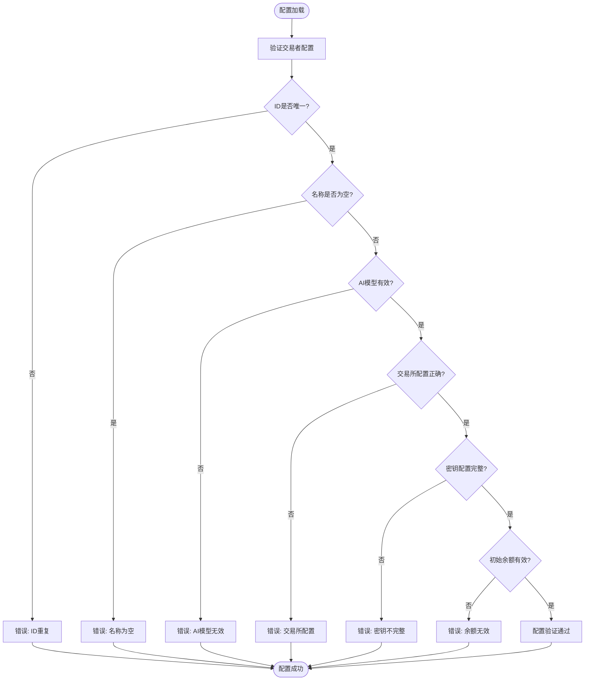

# 交易所集成指南

<cite>
**本文档引用的文件**
- [trader/binance_futures.go](file://trader/binance_futures.go)
- [trader/hyperliquid_trader.go](file://trader/hyperliquid_trader.go)
- [trader/aster_trader.go](file://trader/aster_trader.go)
- [trader/interface.go](file://trader/interface.go)
- [config/config.go](file://config/config.go)
- [manager/trader_manager.go](file://manager/trader_manager.go)
- [README.md](file://README.md)
- [INTEGRATION_BOUNTY_HYPERLIQUID.md](file://INTEGRATION_BOUNTY_HYPERLIQUID.md)
- [INTEGRATION_BOUNTY_ASTER.md](file://INTEGRATION_BOUNTY_ASTER.md)
- [CUSTOM_API.md](file://CUSTOM_API.md)
</cite>

## 目录
1. [概述](#概述)
2. [支持的交易所](#支持的交易所)
3. [Binance Futures集成](#binance-futures集成)
4. [Hyperliquid集成](#hyperliquid集成)
5. [Aster DEX集成](#aster-dex集成)
6. [配置管理](#配置管理)
7. [安全注意事项](#安全注意事项)
8. [故障排除](#故障排除)
9. [最佳实践](#最佳实践)

## 概述

NOFX系统支持三个主要的加密货币交易平台：Binance Futures、Hyperliquid和Aster DEX。每个交易所都有其独特的特点和优势，适用于不同的交易策略和风险偏好。

### 统一接口设计

所有交易所都实现了统一的交易器接口，确保代码的一致性和可维护性：

```mermaid
classDiagram
class Trader {
<<interface>>
+GetBalance() map[string]interface{}
+GetPositions() []map[string]interface{}
+OpenLong(symbol, quantity, leverage) map[string]interface{}
+OpenShort(symbol, quantity, leverage) map[string]interface{}
+CloseLong(symbol, quantity) map[string]interface{}
+CloseShort(symbol, quantity) map[string]interface{}
+SetLeverage(symbol, leverage) error
+GetMarketPrice(symbol) float64
+SetStopLoss(symbol, positionSide, quantity, stopPrice) error
+SetTakeProfit(symbol, positionSide, quantity, takeProfitPrice) error
+CancelAllOrders(symbol) error
+FormatQuantity(symbol, quantity) string
}
class FuturesTrader {
+client *futures.Client
+cachedBalance map[string]interface{}
+balanceCacheTime time.Time
+cacheDuration time.Duration
+GetBalance() map[string]interface{}
+GetPositions() []map[string]interface{}
+SetLeverage(symbol, leverage) error
+OpenLong(symbol, quantity, leverage) map[string]interface{}
+OpenShort(symbol, quantity, leverage) map[string]interface{}
+CloseLong(symbol, quantity) map[string]interface{}
+CloseShort(symbol, quantity) map[string]interface{}
}
class HyperliquidTrader {
+exchange *hyperliquid.Exchange
+ctx context.Context
+walletAddr string
+meta *hyperliquid.Meta
+GetBalance() map[string]interface{}
+GetPositions() []map[string]interface{}
+SetLeverage(symbol, leverage) error
+OpenLong(symbol, quantity, leverage) map[string]interface{}
+OpenShort(symbol, quantity, leverage) map[string]interface{}
+CloseLong(symbol, quantity) map[string]interface{}
+CloseShort(symbol, quantity) map[string]interface{}
}
class AsterTrader {
+ctx context.Context
+user string
+signer string
+privateKey *ecdsa.PrivateKey
+client *http.Client
+baseURL string
+symbolPrecision map[string]SymbolPrecision
+GetBalance() map[string]interface{}
+GetPositions() []map[string]interface{}
+SetLeverage(symbol, leverage) error
+OpenLong(symbol, quantity, leverage) map[string]interface{}
+OpenShort(symbol, quantity, leverage) map[string]interface{}
+CloseLong(symbol, quantity) map[string]interface{}
+CloseShort(symbol, quantity) map[string]interface{}
}
Trader <|-- FuturesTrader
Trader <|-- HyperliquidTrader
Trader <|-- AsterTrader
```

**图表来源**
- [trader/interface.go](file://trader/interface.go#L1-L42)
- [trader/binance_futures.go](file://trader/binance_futures.go#L15-L35)
- [trader/hyperliquid_trader.go](file://trader/hyperliquid_trader.go#L15-L25)
- [trader/aster_trader.go](file://trader/aster_trader.go#L25-L45)

## 支持的交易所

### 交易所对比表

| 特性 | Binance Futures | Hyperliquid | Aster DEX |
|------|----------------|-------------|-----------|
| **交易类型** | 合约交易 | 永续合约 | 永续合约 |
| **认证方式** | API密钥 | 以太坊私钥 | API钱包系统 |
| **费用结构** | 交易费+滑点 | 交易费+手续费 | 交易费+Gas费 |
| **结算方式** | 资金流 | 链上结算 | 链上结算 |
| **KYC要求** | 是 | 否 | 否 |
| **杠杆范围** | 1x-125x | 1x-50x | 1x-50x |
| **支持网络** | 单一 | 单一 | 多链 |
| **实时数据** | WebSocket | WebSocket | REST |
| **开发难度** | 低 | 中 | 中 |

### 适用场景

- **Binance Futures**: 适合传统量化交易者，需要稳定性和广泛的市场覆盖
- **Hyperliquid**: 适合追求去中心化和低成本的高级用户
- **Aster DEX**: 适合希望获得Binance兼容体验的DEX用户

## Binance Futures集成

### 特点与优势

Binance Futures是目前最成熟的中心化衍生品交易平台，具有以下特点：

- **成熟稳定的API**: 提供完整的REST和WebSocket API
- **广泛的市场覆盖**: 支持大量加密货币交易对
- **高流动性**: 拥有最大的市场深度和流动性
- **完善的风控体系**: 内置多种风险管理工具
- **全球监管合规**: 符合主要司法管辖区的监管要求

### 分步配置教程

#### 1. 注册Binance账户

访问[注册链接](https://www.binance.com/join?ref=TINKLEVIP)完成注册，包括：

- 基本账户注册
- KYC身份验证
- 启用期货交易账户
- 创建API密钥

#### 2. API密钥配置

在Binance账户的API管理页面创建API密钥：

- **权限设置**: 确保启用"Futures"权限
- **IP白名单**: 添加你的服务器IP地址
- **备注**: 建议为每个交易账户创建独立的API密钥

#### 3. 配置文件设置

编辑`config.json`文件：

```json
{
  "traders": [
    {
      "id": "binance_trader",
      "name": "Binance AI Trader",
      "exchange": "binance",
      "binance_api_key": "YOUR_BINANCE_API_KEY",
      "binance_secret_key": "YOUR_BINANCE_SECRET_KEY",
      "ai_model": "deepseek",
      "deepseek_key": "sk-your-deepseek-key",
      "initial_balance": 1000.0,
      "scan_interval_minutes": 3
    }
  ]
}
```

#### 4. 代码实现分析

Binance交易器的核心实现包括：

**API封装层**:
- 使用`adshao/go-binance/v2`库进行API调用
- 实现了完整的合约交易功能
- 包含缓存机制优化性能

**核心功能**:
- 账户余额和持仓查询
- 杠杆设置和保证金模式切换
- 市价单和限价单执行
- 止损止盈订单管理

**关键特性**:
- 自动精度处理（数量和价格）
- 智能杠杆切换（避免频繁操作）
- 冷却期机制防止API限制
- 异常处理和重试机制

**章节来源**
- [trader/binance_futures.go](file://trader/binance_futures.go#L1-L615)
- [config/config.go](file://config/config.go#L15-L50)

## Hyperliquid集成

### 特点与优势

Hyperliquid是一个高性能的去中心化永续合约交易平台：

- **去中心化**: 无需信任第三方，资金完全由用户控制
- **低成本**: 交易费和手续费远低于中心化交易所
- **快速执行**: 链上结算，无延迟
- **隐私保护**: 无需KYC，匿名交易
- **创新功能**: 支持触发订单和链上风险管理

### 分步配置教程

#### 1. 获取以太坊私钥

**重要提示**: 私钥安全至关重要，请使用专用钱包：

- 使用MetaMask或其他支持导出私钥的钱包
- 导出私钥后移除`0x`前缀
- 不要在公共场合显示私钥

#### 2. 钱包地址配置

获取你的以太坊钱包地址：

- 在MetaMask中查看钱包地址
- 确保地址格式正确（0x开头的42字符字符串）
- 钱包中需要有足够的ETH支付Gas费

#### 3. 测试网配置（可选）

Hyperliquid提供测试网环境用于开发：

```json
{
  "traders": [
    {
      "id": "hyperliquid_testnet",
      "name": "Hyperliquid Testnet Trader",
      "exchange": "hyperliquid",
      "hyperliquid_private_key": "your_private_key_without_0x",
      "hyperliquid_wallet_addr": "your_ethereum_address",
      "hyperliquid_testnet": true,
      "ai_model": "deepseek",
      "deepseek_key": "sk-your-deepseek-key",
      "initial_balance": 1000.0
    }
  ]
}
```

#### 4. 主网配置

生产环境配置：

```json
{
  "traders": [
    {
      "id": "hyperliquid_mainnet",
      "name": "Hyperliquid Mainnet Trader",
      "exchange": "hyperliquid",
      "hyperliquid_private_key": "your_private_key_without_0x",
      "hyperliquid_wallet_addr": "your_ethereum_address",
      "hyperliquid_testnet": false,
      "ai_model": "deepseek",
      "deepseek_key": "sk-your-deepseek-key",
      "initial_balance": 1000.0
    }
  ]
}
```

#### 5. 代码实现分析

Hyperliquid交易器的特点：

**链上交易处理**:
- 使用`go-ethereum`库进行以太坊交互
- 实现了完整的订单生命周期管理
- 包含精确的价格和数量格式化

**核心功能**:
- 自动精度处理（基于交易所元数据）
- 触发订单支持（止损止盈）
- 智能价格格式化（5位有效数字）
- 批量订单管理

**关键技术**:
- ABI编码和签名验证
- Meta信息缓存优化
- 重试机制和错误处理
- 多币种精度支持

**章节来源**
- [trader/hyperliquid_trader.go](file://trader/hyperliquid_trader.go#L1-L682)
- [config/config.go](file://config/config.go#L50-L85)

## Aster DEX集成

### 特点与优势

Aster DEX提供了Binance兼容的去中心化交易体验：

- **Binance兼容**: API与Binance完全兼容，迁移成本低
- **安全的钱包系统**: 使用API钱包分离风险
- **竞争性费用**: 交易费用低于大多数中心化交易所
- **多链支持**: 支持以太坊、币安链、Polygon等多个网络
- **无需KYC**: 全球用户均可使用

### 分步配置教程

#### 1. 注册Aster账户

访问[Aster注册页面](https://www.asterdex.com/en/referral/fdfc0e)完成注册：

- 使用推荐链接获得费用折扣
- 完成基本验证流程
- 准备好您的以太坊钱包

#### 2. 创建API钱包

访问[Aster API钱包页面](https://www.asterdex.com/en/api-wallet)：

**步骤1**: 连接主钱包
- 使用MetaMask或WalletConnect
- 确保钱包中有足够的ETH支付Gas费

**步骤2**: 创建API钱包
- 点击"创建API钱包"按钮
- 系统会生成API钱包地址和私钥

**重要提示**: API钱包信息只显示一次，请立即保存！

**API钱包信息**:
- **主钱包地址 (User)**: 用于身份验证
- **API钱包地址 (Signer)**: 用于交易签名
- **API钱包私钥**: 用于API认证（无`0x`前缀）

#### 3. 配置文件设置

```json
{
  "traders": [
    {
      "id": "aster_trader",
      "name": "Aster AI Trader",
      "exchange": "aster",
      "aster_user": "0x63DD5aCC6b1aa0f563956C0e534DD30B6dcF7C4e",
      "aster_signer": "0x21cF8Ae13Bb72632562c6Fff438652Ba1a151bb0",
      "aster_private_key": "4fd0a42218f3eae43a6ce26d22544e986139a01e5b34a62db53757ffca81bae1",
      "ai_model": "deepseek",
      "deepseek_key": "sk-your-deepseek-key",
      "initial_balance": 1000.0,
      "scan_interval_minutes": 3
    }
  ]
}
```

#### 4. 代码实现分析

Aster交易器的独特之处：

**API钱包认证**:
- 使用ECDSA签名进行身份验证
- 实现了完整的ABI编码和哈希计算
- 包含nonce机制防止重放攻击

**核心功能**:
- Binance兼容的API接口
- 自动精度处理（基于交易所配置）
- 智能请求重试机制
- 完整的错误处理和日志记录

**关键技术**:
- 以太坊签名算法
- JSON参数规范化
- HTTP请求签名
- 多重重试策略

**章节来源**
- [trader/aster_trader.go](file://trader/aster_trader.go#L1-L960)
- [config/config.go](file://config/config.go#L85-L120)

## 配置管理

### 多交易所配置架构

NOFX支持在同一配置文件中混合使用多个交易所：

```json
{
  "traders": [
    {
      "id": "binance_qwen",
      "name": "Binance Qwen Trader",
      "exchange": "binance",
      "binance_api_key": "key1",
      "binance_secret_key": "secret1",
      "ai_model": "qwen",
      "qwen_key": "sk-qwen-key"
    },
    {
      "id": "hyperliquid_deepseek",
      "name": "Hyperliquid DeepSeek Trader",
      "exchange": "hyperliquid",
      "hyperliquid_private_key": "key2",
      "hyperliquid_wallet_addr": "addr2",
      "ai_model": "deepseek",
      "deepseek_key": "sk-deepseek-key"
    },
    {
      "id": "aster_competition",
      "name": "Aster Competition Trader",
      "exchange": "aster",
      "aster_user": "user3",
      "aster_signer": "signer3",
      "aster_private_key": "key3",
      "ai_model": "deepseek",
      "deepseek_key": "sk-deepseek-key"
    }
  ]
}
```

### 配置验证机制

系统提供了完整的配置验证：



**图表来源**
- [config/config.go](file://config/config.go#L120-L202)

### 动态配置切换

通过修改`config.json`中的`exchange`字段可以动态切换交易所：

```json
{
  "traders": [
    {
      "id": "switchable_trader",
      "name": "Switchable Trader",
      "exchange": "binance",  // 切换为 "hyperliquid" 或 "aster"
      // ... 其他配置保持不变
    }
  ]
}
```

**章节来源**
- [config/config.go](file://config/config.go#L1-L202)
- [manager/trader_manager.go](file://manager/trader_manager.go#L20-L80)

## 安全注意事项

### Binance Futures安全

**API密钥保护**:
- 使用强密码保护Binance账户
- 启用双重认证（2FA）
- 定期轮换API密钥
- 严格管理IP白名单

**网络安全**:
- 使用VPN或专用网络连接
- 避免在公共网络环境下运行
- 定期更新防火墙规则

### Hyperliquid安全

**私钥管理**:
- 使用硬件钱包存储私钥
- 不要在任何地方明文保存私钥
- 定期备份私钥（安全存储）
- 避免在多个平台使用相同私钥

**Gas费用控制**:
- 确保API钱包中有足够的ETH
- 监控Gas价格，选择合适时机交易
- 使用Gas费用估算工具

### Aster DEX安全

**API钱包安全**:
- API钱包地址与主钱包分离
- 定期检查API钱包活动
- 可随时撤销API钱包权限

**私钥保护**:
- 使用专用钱包进行交易
- 避免在浏览器中保存私钥
- 定期更换API钱包

### 通用安全措施

**监控和审计**:
- 实施实时交易监控
- 定期审计交易日志
- 设置异常交易警报

**备份策略**:
- 备份配置文件
- 记录重要的交易参数
- 保存API密钥和私钥的备份

## 故障排除

### 常见问题及解决方案

#### Binance相关问题

**问题**: API密钥无效
```
错误: invalid API key
```
**解决方案**:
1. 检查API密钥拼写是否正确
2. 确认API密钥具有期货交易权限
3. 验证IP白名单设置
4. 检查API密钥是否被禁用

**问题**: 杠杆设置失败
```
错误: leverage is restricted
```
**解决方案**:
1. 检查账户是否有足够保证金
2. 确认交易对支持所需杠杆
3. 避免超过账户最大杠杆限制

#### Hyperliquid相关问题

**问题**: 私钥格式错误
```
错误: 解析私钥失败
```
**解决方案**:
1. 确保私钥不包含`0x`前缀
2. 检查私钥长度是否正确（64字符十六进制）
3. 验证私钥格式是否为有效的ECDSA私钥

**问题**: Gas费用不足
```
错误: Insufficient funds for gas
```
**解决方案**:
1. 向API钱包地址充值ETH
2. 监控Gas价格，选择合适时机
3. 调整Gas限制设置

#### Aster DEX相关问题

**问题**: API签名失败
```
错误: signature verification failed
```
**解决方案**:
1. 检查私钥格式（无`0x`前缀）
2. 确认API钱包权限设置
3. 验证时间戳和nonce参数

**问题**: 交易对不可用
```
错误: symbol not found
```
**解决方案**:
1. 检查交易对是否在支持列表中
2. 确认API钱包已激活相应交易对
3. 验证交易对精度设置

### 调试技巧

**启用详细日志**:
```go
logLevel := "DEBUG"
```

**监控API调用**:
- 使用网络抓包工具
- 监控API响应时间和错误率
- 记录交易决策过程

**性能优化**:
- 调整缓存时间间隔
- 优化并发请求数量
- 监控内存和CPU使用率

## 最佳实践

### 交易策略建议

**风险控制**:
- 设置合理的止损和止盈水平
- 控制单笔交易风险不超过账户余额的2%
- 实施分散投资策略

**资金管理**:
- 建立明确的资金分配规则
- 定期评估账户表现
- 根据市场波动调整策略

### 性能优化

**网络优化**:
- 使用专用网络连接
- 配置适当的超时时间
- 实施请求限流机制

**缓存策略**:
- 合理设置缓存时间
- 实现智能缓存失效
- 监控缓存命中率

### 监控和维护

**实时监控**:
- 设置关键指标警报
- 监控交易成功率
- 跟踪账户表现变化

**定期维护**:
- 更新API密钥和私钥
- 检查配置文件完整性
- 备份重要数据

### 多交易所策略

**资产配置**:
- 根据交易所特点分配资产
- 利用不同交易所的定价差异
- 实施套利策略

**风险分散**:
- 在多个交易所建立头寸
- 避免过度集中于单一交易所
- 实施跨交易所风险管理

通过遵循这些最佳实践，您可以最大化利用NOFX系统的多交易所能力，实现更稳健和高效的自动化交易。