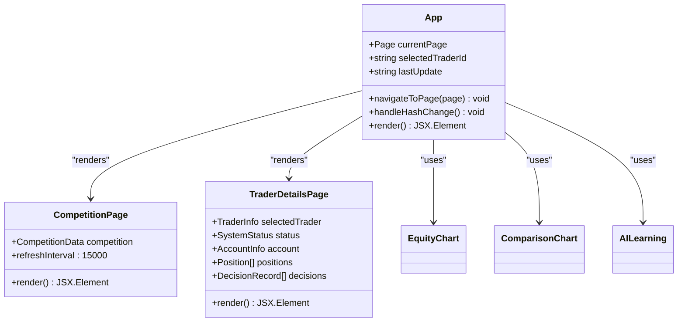
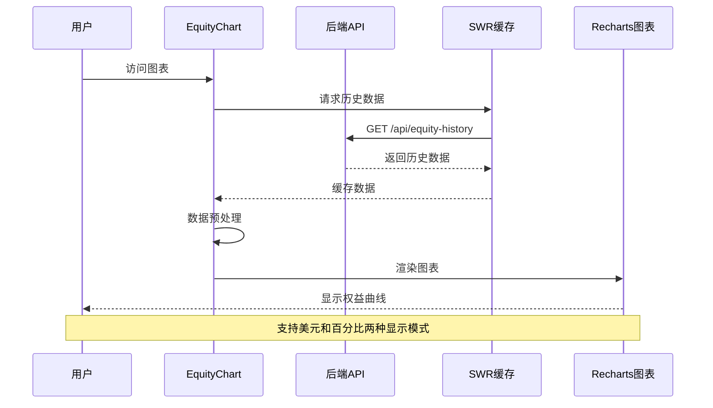
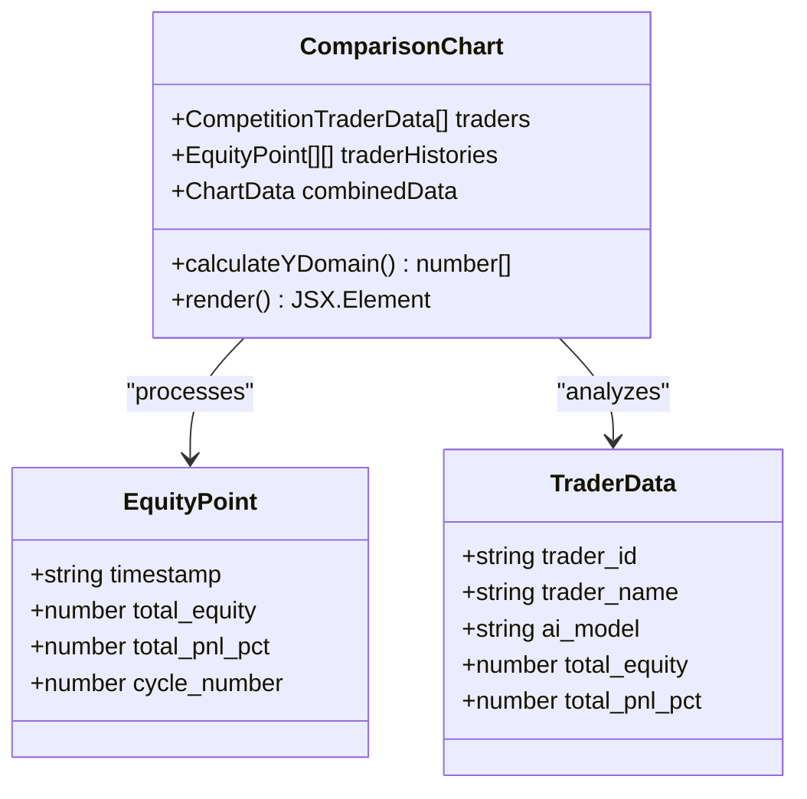
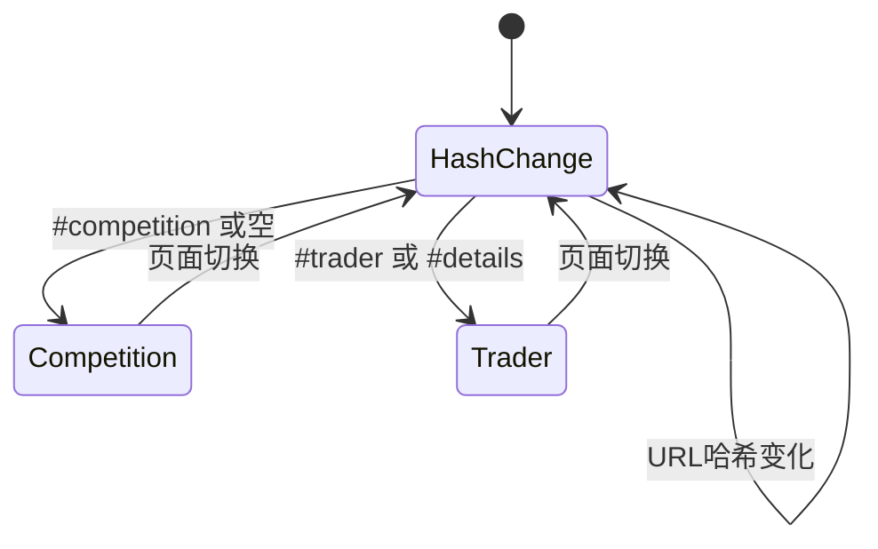
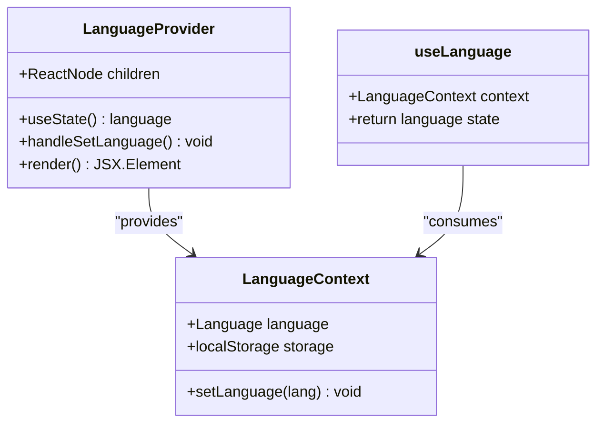
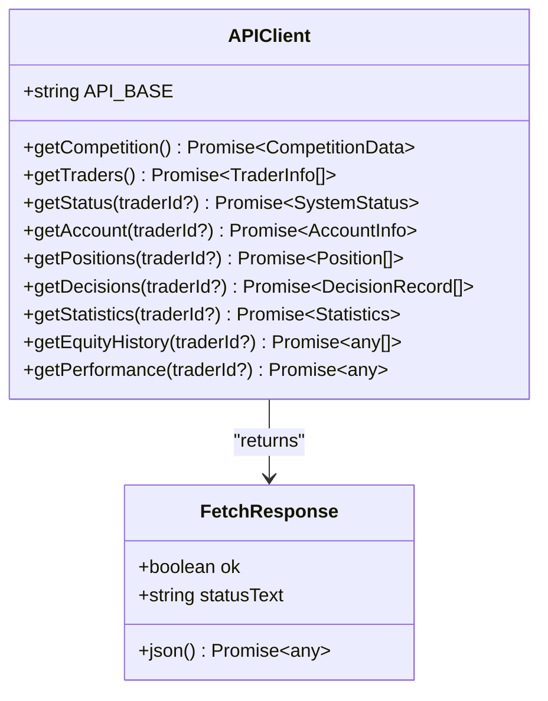
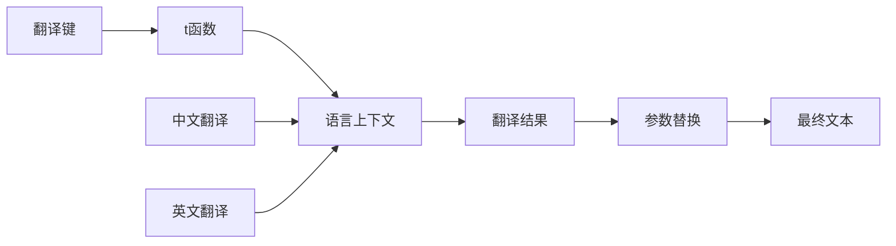
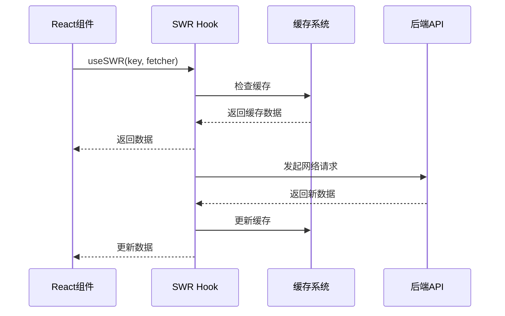

# 前端界面技术文档

<cite>
**本文档引用的文件**
- [App.tsx](file://web/src/App.tsx)
- [CompetitionPage.tsx](file://web/src/components/CompetitionPage.tsx)
- [EquityChart.tsx](file://web/src/components/EquityChart.tsx)
- [ComparisonChart.tsx](file://web/src/components/ComparisonChart.tsx)
- [AILearning.tsx](file://web/src/components/AILearning.tsx)
- [api.ts](file://web/src/lib/api.ts)
- [types/index.ts](file://web/src/types/index.ts)
- [package.json](file://web/package.json)
- [tailwind.config.js](file://web/tailwind.config.js)
- [traderColors.ts](file://web/src/utils/traderColors.ts)
- [translations.ts](file://web/src/i18n/translations.ts)
- [LanguageContext.tsx](file://web/src/contexts/LanguageContext.tsx)
- [main.tsx](file://web/src/main.tsx)
</cite>

## 目录
1. [项目概述](#项目概述)
2. [技术栈架构](#技术栈架构)
3. [核心UI组件](#核心ui组件)
4. [状态管理与路由](#状态管理与路由)
5. [API通信层](#api通信层)
6. [视觉设计系统](#视觉设计系统)
7. [国际化支持](#国际化支持)
8. [数据刷新机制](#数据刷新机制)
9. [用户交互指南](#用户交互指南)
10. [性能优化策略](#性能优化策略)

## 项目概述

NOFX前端界面是一个基于React、TypeScript和Tailwind CSS构建的实时AI交易竞赛平台。该系统采用现代化的前端架构，提供实时的多AI交易者竞争展示、个人交易者详细分析和AI学习过程追踪功能。

### 主要特性
- **实时数据展示**：基于WebSocket的实时数据更新
- **多AI竞争**：支持多个AI交易者的实时对战
- **深度分析**：提供详细的交易决策日志和AI学习过程
- **响应式设计**：适配桌面和移动设备的完美体验
- **多语言支持**：中英文双语界面
- **暗色主题**：仿Binance风格的暗色界面

## 技术栈架构

### 前端框架
- **React 18.3.1**：现代JavaScript库，提供组件化开发
- **TypeScript 5.8.3**：类型安全的JavaScript超集
- **Vite 6.0.7**：快速的前端构建工具

### 样式框架
- **Tailwind CSS 3.4.17**：实用优先的CSS框架
- **PostCSS 8.4.49**：CSS处理器
- **Autoprefixer 10.4.20**：自动添加浏览器前缀

### 状态管理
- **SWR 2.2.5**：React数据获取库，提供智能缓存和重验证
- **Zustand 5.0.2**：轻量级状态管理（已引入但未在主应用中使用）

### 图表可视化
- **Recharts 2.15.2**：基于React的图表库
- **Date-fns 4.1.0**：现代JavaScript日期工具库

### 开发工具
- **TypeScript**：类型安全的JavaScript
- **ESLint**：代码质量检查
- **Prettier**：代码格式化

**章节来源**
- [package.json](file://web/package.json#L1-L30)
- [tailwind.config.js](file://web/tailwind.config.js#L1-L12)

## 核心UI组件

### 应用主入口 (App.tsx)

应用主入口采用模块化设计，包含完整的路由管理和状态同步功能。

**图表来源**
- [App.tsx](file://web/src/App.tsx#L1-L732)
- [CompetitionPage.tsx](file://web/src/components/CompetitionPage.tsx#L1-L254)
- [AILearning.tsx](file://web/src/components/AILearning.tsx#L1-L700)

#### 页面导航系统
应用支持两种主要页面：
- **竞赛页面** (`competition`)：展示多AI交易者的实时竞争
- **交易者详情页** (`trader`)：展示单个交易者的详细信息

#### 状态同步机制
- URL哈希同步：页面状态与URL哈希保持同步
- 实时数据刷新：不同组件采用不同的刷新间隔
- 数据去重：防止短时间内重复请求

**章节来源**
- [App.tsx](file://web/src/App.tsx#L15-L50)

### 竞赛页面 (CompetitionPage.tsx)

竞赛页面展示多AI交易者的实时竞争情况，采用Binance风格的设计。

```mermaid
flowchart TD
A[获取竞赛数据] --> B{数据是否有效?}
B --> |否| C[显示加载骨架屏]
B --> |是| D[按收益率排序]
D --> E[计算领先者]
E --> F[渲染左侧图表区域]
E --> G[渲染右侧排行榜]
F --> H[ComparisonChart组件]
G --> I[Leaderboard表格]
H --> J[性能对比图表]
I --> K[交易者排名信息]
```

**图表来源**
- [CompetitionPage.tsx](file://web/src/components/CompetitionPage.tsx#L10-L50)

#### 核心功能
- **实时性能对比**：使用ComparisonChart展示多个AI的ROI对比
- **动态排行榜**：实时更新的交易者排名
- **领先者标识**：突出显示当前领先的交易者
- **头对头战斗**：当只有两个交易者时显示对比

**章节来源**
- [CompetitionPage.tsx](file://web/src/components/CompetitionPage.tsx#L50-L150)

### 权益曲线图 (EquityChart.tsx)

EquityChart组件展示单个交易者的账户净值曲线，支持多种显示模式。

**图表来源**
- [EquityChart.tsx](file://web/src/components/EquityChart.tsx#L20-L80)
- [api.ts](file://web/src/lib/api.ts#L40-L50)

#### 特色功能
- **双模式显示**：美元金额和百分比增长
- **智能缩放**：自适应Y轴范围计算
- **交互式Tooltip**：显示详细的时间点信息
- **参考线**：显示初始余额水平线

**章节来源**
- [EquityChart.tsx](file://web/src/components/EquityChart.tsx#L150-L250)

### 性能对比图 (ComparisonChart.tsx)

ComparisonChart专门用于多AI交易者的ROI对比分析。

**图表来源**
- [ComparisonChart.tsx](file://web/src/components/ComparisonChart.tsx#L10-L50)
- [traderColors.ts](file://web/src/utils/traderColors.ts#L1-L32)

#### 高级特性
- **时间戳对齐**：基于时间戳而非周期号进行数据对齐
- **颜色一致性**：使用统一的颜色映射确保视觉一致性
- **动态阈值**：智能计算Y轴范围避免数据溢出
- **多线程对比**：同时展示多个AI的性能曲线

**章节来源**
- [ComparisonChart.tsx](file://web/src/components/ComparisonChart.tsx#L100-L200)

### AI学习分析 (AILearning.tsx)

AILearning组件展示AI交易者的自我学习和优化过程。

#### 核心指标面板
- **总交易数**：累计完成的交易笔数
- **胜率**：盈利交易占比
- **平均盈亏**：盈利和亏损的平均值
- **盈亏比**：盈利除以亏损的比率
- **夏普比率**：风险调整后的收益指标

#### 交易历史追踪
- **最近交易**：展示最新的交易记录
- **币种表现**：各交易币种的统计分析
- **持仓详情**：详细的仓位信息和盈亏情况

**章节来源**
- [AILearning.tsx](file://web/src/components/AILearning.tsx#L100-L300)

## 状态管理与路由

### 路由系统

应用采用基于URL哈希的客户端路由系统，无需服务器端配置。

**图表来源**
- [App.tsx](file://web/src/App.tsx#L30-L50)

#### 路由特性
- **URL同步**：页面状态与URL哈希保持同步
- **页面持久化**：刷新页面后保持当前页面状态
- **导航控制**：提供程序化的页面切换功能

**章节来源**
- [App.tsx](file://web/src/App.tsx#L30-L45)

### 国际化状态管理

应用使用自定义的LanguageContext提供国际化支持。

**图表来源**
- [LanguageContext.tsx](file://web/src/contexts/LanguageContext.tsx#L1-L36)

#### 国际化特性
- **双语言支持**：中文和英文切换
- **本地存储**：保存用户的语言偏好
- **动态切换**：运行时切换语言而不刷新页面

**章节来源**
- [LanguageContext.tsx](file://web/src/contexts/LanguageContext.tsx#L10-L30)

## API通信层

### API封装设计

api.ts文件提供了统一的API调用接口，封装了所有后端服务的访问逻辑。

**图表来源**
- [api.ts](file://web/src/lib/api.ts#L1-L114)

#### API特性
- **统一基址**：所有API请求都基于 `/api` 前缀
- **条件参数**：支持可选的trader_id参数
- **错误处理**：统一的错误响应格式
- **缓存控制**：针对不同接口设置适当的缓存策略

**章节来源**
- [api.ts](file://web/src/lib/api.ts#L10-L50)

### 数据获取策略

应用采用SWR库进行数据获取，实现了智能的缓存和重验证机制。

#### 刷新策略
- **竞赛数据**：15秒刷新间隔
- **交易者详情**：15秒刷新间隔
- **决策日志**：30秒刷新间隔
- **统计信息**：30秒刷新间隔

#### 缓存优化
- **去重机制**：10秒内重复请求会被去重
- **焦点重验证**：禁用标签页切换时的自动重验证
- **缓存失效**：根据数据特性设置合适的缓存策略

**章节来源**
- [App.tsx](file://web/src/App.tsx#L60-L120)

## 视觉设计系统

### Binance风格暗色主题

应用采用仿Binance的暗色主题设计，提供专业的交易界面体验。

#### 色彩体系
- **主色调**：#F0B90B（金色）用于强调和重要信息
- **背景色**：#0B0E11（深蓝黑）作为主要背景
- **文字色**：#EAECEF（浅灰）用于主要文本
- **辅助色**：#848E9C（灰蓝）用于次要信息

#### 设计原则
- **简洁专业**：去除不必要的装饰元素
- **信息层级**：通过色彩和字体大小区分信息重要性
- **一致性**：全局统一的设计语言
- **响应式**：适配不同屏幕尺寸

**章节来源**
- [App.tsx](file://web/src/App.tsx#L150-L200)

### 组件样式系统

#### 卡片组件
- **binance-card**：通用卡片样式
- **stat-card**：统计信息卡片
- **rounded**：圆角边框
- **backdrop-blur**：模糊效果

#### 文本样式
- **mono**：等宽字体用于数值显示
- **font-bold**：重要标题
- **font-semibold**：次要标题
- **text-xs/sm/lg**：不同级别的文本大小

#### 交互反馈
- **hover效果**：鼠标悬停时的视觉反馈
- **transition动画**：平滑的过渡效果
- **pulse-glow**：状态指示的脉冲效果

**章节来源**
- [App.tsx](file://web/src/App.tsx#L250-L350)

### 图表设计规范

#### 颜色映射
使用traderColors.ts提供统一的颜色分配逻辑，确保不同组件间颜色的一致性。

#### 图表元素
- **网格线**：#2B3139的灰色网格
- **轴线**：#5E6673的灰色轴线
- **数据线**：渐变色线条增强视觉效果
- **交互点**：高亮显示的交互点

**章节来源**
- [traderColors.ts](file://web/src/utils/traderColors.ts#L1-L32)

## 国际化支持

### 多语言翻译系统

应用提供完整的中英文双语支持，使用集中式的翻译文件管理所有文本内容。

**图表来源**
- [translations.ts](file://web/src/i18n/translations.ts#L1-L50)

#### 翻译特性
- **参数化文本**：支持动态参数替换
- **上下文感知**：根据语言环境调整显示
- **类型安全**：TypeScript类型定义确保翻译完整性
- **懒加载**：按需加载翻译内容

**章节来源**
- [translations.ts](file://web/src/i18n/translations.ts#L200-L254)

### 文化适应性

#### 数字格式
- **千分位分隔**：根据语言环境使用适当的数字分隔符
- **货币符号**：USD格式的货币显示
- **时间格式**：本地化的时间显示

#### 文化差异
- **图标选择**：使用全球通用的交易图标
- **颜色含义**：考虑不同文化对颜色的理解
- **布局习惯**：符合国际化的布局设计

**章节来源**
- [translations.ts](file://web/src/i18n/translations.ts#L100-L200)

## 数据刷新机制

### SWR智能缓存系统

应用采用SWR库实现智能的数据刷新和缓存管理。

**图表来源**
- [App.tsx](file://web/src/App.tsx#L60-L120)

#### 刷新策略配置

| 组件 | 刷新间隔 | 去重间隔 | 重验证 |
|------|----------|----------|--------|
| 竞赛数据 | 15秒 | 10秒 | 否 |
| 交易者详情 | 15秒 | 10秒 | 否 |
| 决策日志 | 30秒 | 20秒 | 否 |
| 统计数据 | 30秒 | 20秒 | 否 |
| 权益历史 | 30秒 | 20秒 | 否 |

#### 缓存优化策略
- **智能去重**：防止短时间内重复请求
- **内存缓存**：保持在内存中的数据缓存
- **持久化**：部分数据支持本地存储
- **失效策略**：基于时间的自动缓存失效

**章节来源**
- [App.tsx](file://web/src/App.tsx#L60-L130)

### 实时数据更新

#### WebSocket集成准备
虽然当前版本使用轮询方式，但架构已为WebSocket实时更新做好准备。

#### 数据同步机制
- **乐观更新**：立即显示用户操作结果
- **冲突解决**：处理并发更新冲突
- **离线支持**：支持离线状态下的数据同步

**章节来源**
- [App.tsx](file://web/src/App.tsx#L130-L150)

## 用户交互指南

### 界面导航

#### 主要导航功能
1. **页面切换**：通过顶部导航栏在竞赛和详情页面间切换
2. **交易者选择**：在详情页面使用下拉菜单选择不同的AI交易者
3. **数据查看**：通过图表和表格查看详细数据
4. **语言切换**：右上角的语言切换按钮

#### 交互元素
- **按钮**：带有悬停效果的交互按钮
- **表格**：可滚动的详细数据表格
- **图表**：支持缩放和交互的图表组件
- **卡片**：可折叠的信息卡片

**章节来源**
- [App.tsx](file://web/src/App.tsx#L200-L300)

### 数据查看功能

#### 竞赛页面交互
- **排行榜排序**：自动按收益率排序交易者
- **颜色标识**：使用颜色区分不同交易者的数据
- **状态指示**：运行状态的视觉反馈

#### 详情页面功能
- **权益曲线**：查看账户净值随时间的变化
- **持仓管理**：查看当前持仓的详细信息
- **决策追踪**：查看AI的决策过程和执行结果
- **学习分析**：了解AI的学习进度和优化过程

**章节来源**
- [CompetitionPage.tsx](file://web/src/components/CompetitionPage.tsx#L150-L250)

### 数据刷新机制

#### 刷新行为
- **自动刷新**：后台自动更新数据，无需用户操作
- **手动刷新**：用户可以刷新特定组件的数据
- **状态指示**：显示数据更新的时间戳

#### 性能优化
- **增量更新**：只更新发生变化的数据
- **批量请求**：合并相关的API请求
- **防抖处理**：避免过于频繁的请求

**章节来源**
- [App.tsx](file://web/src/App.tsx#L110-L130)

## 性能优化策略

### 构建优化

#### Vite构建配置
- **Tree Shaking**：移除未使用的代码
- **代码分割**：按需加载组件
- **压缩优化**：生产环境的代码压缩

#### 包体积控制
- **依赖精简**：只引入必要的第三方库
- **按需导入**：使用工具库的按需导入功能
- **图片优化**：优化图标和背景图片

**章节来源**
- [package.json](file://web/package.json#L1-L30)

### 运行时优化

#### React性能优化
- **组件记忆化**：使用useMemo和useCallback避免不必要的重渲染
- **虚拟滚动**：大数据量表格使用虚拟滚动
- **懒加载**：大组件按需加载

#### 数据层优化
- **缓存策略**：智能的缓存和失效机制
- **请求合并**：合并相关的API请求
- **数据预处理**：在组件内部进行数据预处理

**章节来源**
- [EquityChart.tsx](file://web/src/components/EquityChart.tsx#L100-L150)

### 内存管理

#### 组件生命周期
- **清理机制**：及时清理事件监听器和定时器
- **状态管理**：合理管理组件状态
- **垃圾回收**：避免内存泄漏

#### 图表性能
- **数据采样**：大量数据时进行采样显示
- **渲染优化**：优化图表的渲染性能
- **资源释放**：及时释放图表资源

**章节来源**
- [ComparisonChart.tsx](file://web/src/components/ComparisonChart.tsx#L50-L100)

## 总结

NOFX前端界面是一个功能完整、设计专业的实时AI交易竞赛平台。通过采用现代化的前端技术栈，实现了高性能、易维护的用户界面。系统具备以下核心优势：

### 技术优势
- **现代化架构**：基于React 18和TypeScript的现代前端架构
- **智能缓存**：基于SWR的智能数据缓存和刷新机制
- **响应式设计**：完全响应式的界面设计
- **国际化支持**：完整的多语言支持系统

### 功能特色
- **实时数据**：基于轮询的实时数据更新
- **深度分析**：提供多层次的交易数据分析
- **可视化展示**：丰富的图表和数据可视化
- **用户体验**：流畅的交互和直观的界面设计

### 性能表现
- **快速加载**：优化的构建和加载性能
- **流畅交互**：高效的组件渲染和状态管理
- **资源优化**：合理的资源使用和内存管理

该前端界面为AI交易竞赛提供了专业、可靠的用户交互平台，支持实时的数据分析和交易决策追踪，是现代金融科技应用的优秀实践案例。