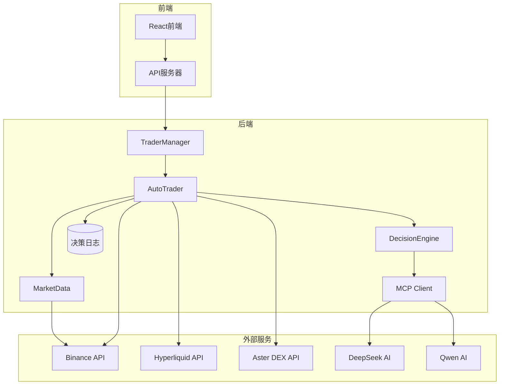
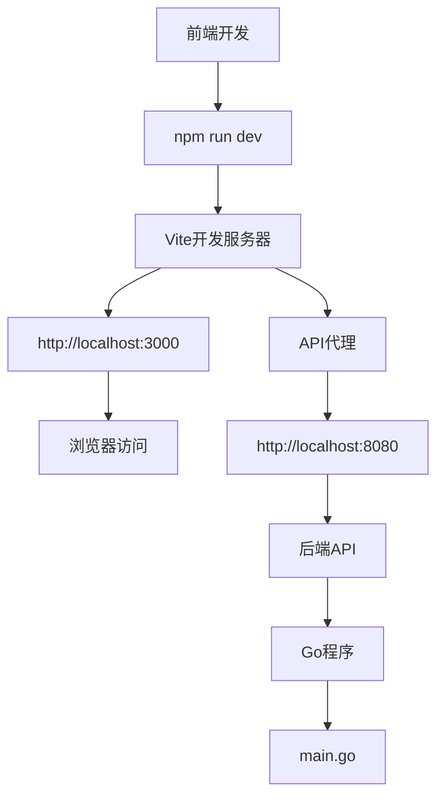

# 开发者指南

<cite>
**本文档引用的文件**  
- [main.go](file://main.go)
- [config.json](file://config.json)
- [go.mod](file://go.mod)
- [web/package.json](file://web/package.json)
- [config/config.go](file://config/config.go)
- [api/server.go](file://api/server.go)
- [trader/interface.go](file://trader/interface.go)
- [manager/trader_manager.go](file://manager/trader_manager.go)
- [trader/auto_trader.go](file://trader/auto_trader.go)
- [decision/engine.go](file://decision/engine.go)
- [market/data.go](file://market/data.go)
- [web/vite.config.ts](file://web/vite.config.ts)
- [README.md](file://README.md)
- [web/README.md](file://web/README.md)
</cite>

## 目录
1. [项目结构与模块设计](#项目结构与模块设计)
2. [开发环境设置](#开发环境设置)
3. [运行前后端](#运行前后端)
4. [依赖管理](#依赖管理)
5. [代码贡献流程](#代码贡献流程)
6. [测试](#测试)
7. [系统扩展点](#系统扩展点)

## 项目结构与模块设计

本项目采用模块化和前后端分离的架构设计，后端使用Go语言实现核心交易逻辑，前端使用React + TypeScript构建用户界面。

项目遵循清晰的模块划分原则，每个模块职责单一，便于维护和扩展。核心模块包括：
- `api/`: HTTP API服务，使用Gin框架提供RESTful接口
- `trader/`: 交易核心，包含不同交易所的实现和统一接口
- `manager/`: 多交易器管理，协调多个AI交易实例
- `decision/`: AI决策引擎，处理AI模型的输入输出
- `market/`: 市场数据获取，从Binance等交易所获取K线数据
- `mcp/`: 模型上下文协议，AI通信客户端
- `pool/`: 币种池管理，维护可交易的币种列表
- `logger/`: 决策日志系统，记录AI的决策过程
- `web/`: 前端应用，提供用户界面

系统采用前后端分离架构，后端通过REST API为前端提供数据，前端通过Vite代理访问后端API。这种设计使得前后端可以独立开发、测试和部署。



**图源**  
- [main.go](file://main.go#L1-L140)
- [api/server.go](file://api/server.go#L1-L424)
- [manager/trader_manager.go](file://manager/trader_manager.go#L1-L173)
- [trader/auto_trader.go](file://trader/auto_trader.go#L1-L200)
- [decision/engine.go](file://decision/engine.go#L1-L200)
- [market/data.go](file://market/data.go#L1-L200)

**本节来源**  
- [main.go](file://main.go#L1-L140)
- [README.md](file://README.md#L1-L1341)

## 开发环境设置

### 后端环境要求
- **Go版本**: 1.21+
- **TA-Lib库**: 用于技术指标计算

#### 安装TA-Lib
**macOS:**
```bash
brew install ta-lib
```

**Ubuntu/Debian:**
```bash
sudo apt-get install libta-lib0-dev
```

### 前端环境要求
- **Node.js版本**: 18+
- **npm**: 包管理工具

#### 前端依赖安装
```bash
cd web
npm install
```

### 项目克隆
```bash
git clone https://github.com/tinkle-community/nofx.git
cd nofx
```

**本节来源**  
- [README.md](file://README.md#L1-L1341)
- [web/README.md](file://web/README.md#L1-L101)

## 运行前后端

### 后端运行
后端使用Go语言编写，通过`main.go`作为程序入口点。

```bash
# 构建程序（首次或代码变更后）
go build -o nofx

# 运行后端
./nofx
```

或者直接运行：
```bash
go run main.go
```

### 前端运行
前端使用Vite + React + TypeScript构建，通过npm脚本运行。

```bash
# 进入前端目录
cd web

# 运行开发服务器
npm run dev
```

前端开发服务器默认运行在`http://localhost:3000`，通过Vite代理访问后端API（默认端口8080）。



**图源**  
- [main.go](file://main.go#L1-L140)
- [web/vite.config.ts](file://web/vite.config.ts#L1-L17)
- [api/server.go](file://api/server.go#L1-L424)

**本节来源**  
- [main.go](file://main.go#L1-L140)
- [web/vite.config.ts](file://web/vite.config.ts#L1-L17)
- [README.md](file://README.md#L1-L1341)

## 依赖管理

### 后端依赖管理
后端使用Go Modules进行依赖管理，相关文件为`go.mod`和`go.sum`。

```go
module nofx

go 1.25.0

require (
	github.com/adshao/go-binance/v2 v2.8.7
	github.com/ethereum/go-ethereum v1.16.5
	github.com/gin-gonic/gin v1.11.0
	github.com/sonirico/go-hyperliquid v0.17.0
)
```

安装所有依赖：
```bash
go mod download
```

### 前端依赖管理
前端使用npm进行依赖管理，相关文件为`package.json`和`package-lock.json`。

```json
{
  "name": "nofx-web",
  "version": "1.0.0",
  "type": "module",
  "scripts": {
    "dev": "vite",
    "build": "tsc && vite build",
    "preview": "vite preview"
  },
  "dependencies": {
    "react": "^18.3.1",
    "react-dom": "^18.3.1",
    "zustand": "^5.0.2",
    "swr": "^2.2.5",
    "recharts": "^2.15.2",
    "date-fns": "^4.1.0",
    "clsx": "^2.1.1"
  },
  "devDependencies": {
    "@types/react": "^18.3.17",
    "@types/react-dom": "^18.3.5",
    "@vitejs/plugin-react": "^4.3.4",
    "typescript": "^5.8.3",
    "vite": "^6.0.7",
    "tailwindcss": "^3.4.17",
    "postcss": "^8.4.49",
    "autoprefixer": "^10.4.20"
  }
}
```

安装前端依赖：
```bash
cd web
npm install
```

**本节来源**  
- [go.mod](file://go.mod#L1-L78)
- [web/package.json](file://web/package.json#L1-L30)

## 代码贡献流程

### 分支策略
本项目采用标准的Git分支策略：
- `main`分支：稳定版本，受保护
- `develop`分支：开发主分支
- 功能分支：`feature/功能名称`
- 修复分支：`fix/问题描述`
- 发布分支：`release/版本号`

### 代码风格
#### Go代码风格
- 遵循Go官方代码风格指南
- 使用`gofmt`格式化代码
- 函数和变量命名使用驼峰命名法
- 导出的标识符首字母大写

#### TypeScript代码风格
- 遵循TypeScript官方指南
- 使用Prettier格式化代码
- 使用ESLint进行代码检查
- 类型定义清晰明确

### 提交规范
提交信息应遵循以下格式：
```
<类型>: <简短描述>

<详细描述>

<关联的Issue>
```

类型包括：
- `feat`: 新功能
- `fix`: 修复bug
- `docs`: 文档更新
- `style`: 代码格式调整
- `refactor`: 代码重构
- `test`: 测试相关
- `chore`: 构建过程或辅助工具的变动

### Pull Request流程
1. Fork项目仓库
2. 创建功能分支
3. 实现功能并编写测试
4. 提交代码
5. 创建Pull Request
6. 等待代码审查
7. 根据反馈修改代码
8. 合并到主分支

**本节来源**  
- [README.md](file://README.md#L1316-L1334)
- [HOW_TO_POST_BOUNTY.md](file://HOW_TO_POST_BOUNTY.md#L1-L224)

## 测试

项目包含基本的测试框架，但具体的测试文件未在提供的上下文中显示。建议在贡献代码时遵循以下测试原则：

1. **单元测试**: 为每个核心函数编写单元测试，确保功能正确性
2. **集成测试**: 测试模块间的交互，确保系统整体工作正常
3. **端到端测试**: 模拟用户操作，测试整个应用流程

对于AI决策引擎，建议添加模拟测试，使用历史数据验证决策逻辑的正确性。

对于交易所API集成，建议使用mock服务进行测试，避免产生实际交易。

**本节来源**  
- [README.md](file://README.md#L1316-L1334)

## 系统扩展点

### 添加新的交易所实现
系统设计支持多交易所，通过统一的`Trader`接口实现交易所的可插拔性。

```go
// trader/interface.go
type Trader interface {
	GetBalance() (map[string]interface{}, error)
	GetPositions() ([]map[string]interface{}, error)
	OpenLong(symbol string, quantity float64, leverage int) (map[string]interface{}, error)
	OpenShort(symbol string, quantity float64, leverage int) (map[string]interface{}, error)
	CloseLong(symbol string, quantity float64) (map[string]interface{}, error)
	CloseShort(symbol string, quantity float64) (map[string]interface{}, error)
	SetLeverage(symbol string, leverage int) error
	GetMarketPrice(symbol string) (float64, error)
	SetStopLoss(symbol string, positionSide string, quantity, stopPrice float64) error
	SetTakeProfit(symbol string, positionSide string, quantity, takeProfitPrice float64) error
	CancelAllOrders(symbol string) error
	FormatQuantity(symbol string, quantity float64) (string, error)
}
```

要添加新的交易所，需要：
1. 在`trader/`目录下创建新的交易所实现文件
2. 实现`Trader`接口的所有方法
3. 在`auto_trader.go`的`NewAutoTrader`函数中添加对新交易所的支持
4. 更新配置文件结构以支持新交易所的认证信息

### 集成新的AI模型
系统通过MCP（Model Context Protocol）客户端支持多种AI模型。

要集成新的AI模型：
1. 在`mcp/client.go`中添加对新AI API的支持
2. 实现相应的API调用方法
3. 在配置文件中添加新AI模型的API密钥配置
4. 在`auto_trader.go`中添加对新AI模型的支持

系统已经支持DeepSeek和Qwen，同时也支持任何符合OpenAI格式的自定义API。

```mermaid
classDiagram
class Trader {
<<interface>>
+GetBalance() (map[string]interface{}, error)
+GetPositions() ([]map[string]interface{}, error)
+OpenLong(symbol, quantity, leverage)
+OpenShort(symbol, quantity, leverage)
+CloseLong(symbol, quantity)
+CloseShort(symbol, quantity)
+SetLeverage(symbol, leverage)
+GetMarketPrice(symbol)
+SetStopLoss(symbol, positionSide, quantity, stopPrice)
+SetTakeProfit(symbol, positionSide, quantity, takeProfitPrice)
+CancelAllOrders(symbol)
+FormatQuantity(symbol, quantity)
}
class BinanceFuturesTrader {
-apiKey string
-secretKey string
+GetBalance()
+GetPositions()
+OpenLong(symbol, quantity, leverage)
+OpenShort(symbol, quantity, leverage)
+CloseLong(symbol, quantity)
+CloseShort(symbol, quantity)
+SetLeverage(symbol, leverage)
+GetMarketPrice(symbol)
+SetStopLoss(symbol, positionSide, quantity, stopPrice)
+SetTakeProfit(symbol, positionSide, quantity, takeProfitPrice)
+CancelAllOrders(symbol)
+FormatQuantity(symbol, quantity)
}
class HyperliquidTrader {
-privateKey string
-walletAddr string
-testnet bool
+GetBalance()
+GetPositions()
+OpenLong(symbol, quantity, leverage)
+OpenShort(symbol, quantity, leverage)
+CloseLong(symbol, quantity)
+CloseShort(symbol, quantity)
+SetLeverage(symbol, leverage)
+GetMarketPrice(symbol)
+SetStopLoss(symbol, positionSide, quantity, stopPrice)
+SetTakeProfit(symbol, positionSide, quantity, takeProfitPrice)
+CancelAllOrders(symbol)
+FormatQuantity(symbol, quantity)
}
class AsterTrader {
-user string
-signer string
-privateKey string
+GetBalance()
+GetPositions()
+OpenLong(symbol, quantity, leverage)
+OpenShort(symbol, quantity, leverage)
+CloseLong(symbol, quantity)
+CloseShort(symbol, quantity)
+SetLeverage(symbol, leverage)
+GetMarketPrice(symbol)
+SetStopLoss(symbol, positionSide, quantity, stopPrice)
+SetTakeProfit(symbol, positionSide, quantity, takeProfitPrice)
+CancelAllOrders(symbol)
+FormatQuantity(symbol, quantity)
}
Trader <|-- BinanceFuturesTrader
Trader <|-- HyperliquidTrader
Trader <|-- AsterTrader
```

**图源**  
- [trader/interface.go](file://trader/interface.go#L1-L42)
- [trader/auto_trader.go](file://trader/auto_trader.go#L1-L200)

**本节来源**  
- [trader/interface.go](file://trader/interface.go#L1-L42)
- [trader/auto_trader.go](file://trader/auto_trader.go#L1-L200)
- [mcp/client.go](file://mcp/client.go)
- [config/config.go](file://config/config.go#L1-L202)