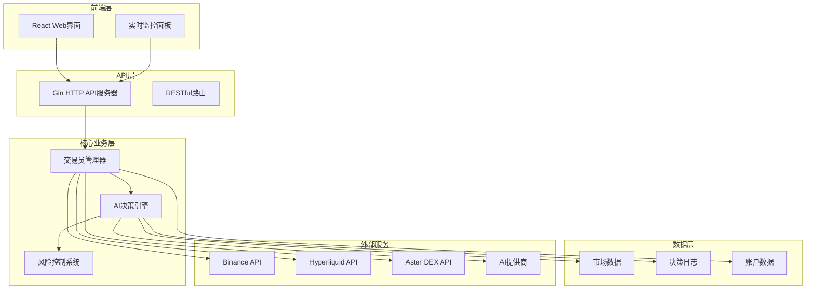

# 快速入门

<cite>
**本文档引用的文件**
- [DOCKER_DEPLOY.md](file://DOCKER_DEPLOY.md)
- [start.sh](file://start.sh)
- [docker-compose.yml](file://docker-compose.yml)
- [main.go](file://main.go)
- [go.mod](file://go.mod)
- [README.md](file://README.md)
- [config.json.example](file://config.json.example)
- [web/package.json](file://web/package.json)
- [web/README.md](file://web/README.md)
- [mcp/client.go](file://mcp/client.go)
- [CUSTOM_API.md](file://CUSTOM_API.md)
</cite>

## 目录
1. [简介](#简介)
2. [系统架构概览](#系统架构概览)
3. [部署方式选择](#部署方式选择)
4. [Docker一键部署](#docker一键部署)
5. [手动安装部署](#手动安装部署)
6. [获取AI API密钥](#获取ai-api密钥)
7. [系统配置](#系统配置)
8. [启动系统](#启动系统)
9. [访问Web界面](#访问web界面)
10. [常见问题](#常见问题)

## 简介

NOFX是一个通用的AI交易操作系统，采用统一架构设计，成功实现了加密货币市场的闭环："多智能体决策→统一风险控制→低延迟执行→实盘/纸面账户回测"。目前该系统已在加密货币市场完全运营，并正在扩展到股票、期货、期权、外汇等所有金融市场。

### 核心特性

- **多智能体自我竞争与进化**：策略自动竞争并选择最佳者，基于账户级盈亏和风险约束持续迭代
- **集成执行与风险控制**：低延迟路由、滑点/风险控制沙盒、账户级限制、一键市场切换
- **跨市场统一表示**：跨市场、跨时间周期、跨交易所的统一表示和因子库
- **实时性能比较**：实时ROI跟踪、胜率统计和一对一分析

## 系统架构概览



**架构图来源**
- [main.go](file://main.go#L1-L140)
- [docker-compose.yml](file://docker-compose.yml#L1-L50)

## 部署方式选择

NOFX提供两种主要部署方式，适合不同需求的用户：

### 方式一：Docker一键部署（推荐给新手）
- **优点**：自动处理所有依赖（Go、Node.js、TA-Lib）和环境设置
- **适用场景**：快速体验、学习研究、小资金测试
- **系统要求**：仅需Docker和Docker Compose

### 方式二：手动安装（推荐给开发者）
- **优点**：完全控制、便于修改代码、深度定制
- **适用场景**：开发调试、生产环境部署、复杂配置
- **系统要求**：Go 1.21+、Node.js 18+、TA-Lib

## Docker一键部署

### 第一步：前置要求

在开始之前，请确保你的系统已安装：

- **Docker**: 版本 20.10 或更高
- **Docker Compose**: 版本 2.0 或更高

#### 安装Docker

**macOS / Windows**:
```bash
# 下载并安装 Docker Desktop
# https://www.docker.com/products/docker-desktop/
```

**Linux (Ubuntu/Debian)**:
```bash
# 推荐方式：使用 Docker Desktop 或 Docker CE
curl -fsSL https://get.docker.com -o get-docker.sh
sudo sh get-docker.sh

# 将当前用户加入 docker 组
sudo usermod -aG docker $USER
newgrp docker
```

### 第二步：准备配置文件

```bash
# 复制配置文件模板
cp config.json.example config.json

# 编辑配置文件，填入你的 API 密钥
nano config.json  # 或使用其他编辑器
```

**必须配置的字段**：
```json
{
  "traders": [
    {
      "id": "my_trader",
      "name": "My AI Trader",
      "ai_model": "deepseek",
      "binance_api_key": "YOUR_BINANCE_API_KEY",
      "binance_secret_key": "YOUR_BINANCE_SECRET_KEY",
      "deepseek_key": "YOUR_DEEPSEEK_API_KEY",
      "initial_balance": 1000.0,
      "scan_interval_minutes": 3
    }
  ],
  "use_default_coins": true,
  "api_server_port": 8080
}
```

### 第三步：一键启动

```bash
# 构建并启动所有服务（首次运行）
docker compose up -d --build

# 后续启动（不重新构建）
docker compose up -d
```

**启动过程说明**：
- `--build`: 构建 Docker 镜像（首次运行或代码更新后使用）
- `-d`: 后台运行（detached mode）

### 四、脚本管理命令

系统提供了便捷的管理脚本 `./start.sh`，支持以下命令：

```bash
# 启动服务（可选：重新构建）
./start.sh start --build

# 查看日志
./start.sh logs

# 查看服务状态
./start.sh status

# 停止服务
./start.sh stop

# 重启服务
./start.sh restart

# 更新代码并重启
./start.sh update

# 清理所有容器和数据
./start.sh clean

# 显示帮助信息
./start.sh help
```

**章节来源**
- [DOCKER_DEPLOY.md](file://DOCKER_DEPLOY.md#L1-L473)
- [start.sh](file://start.sh#L1-L282)

## 手动安装部署

### 环境要求

- **Go 1.21+**
- **Node.js 18+**
- **TA-Lib** 库（技术指标计算）

#### 安装TA-Lib

**macOS:**
```bash
brew install ta-lib
```

**Ubuntu/Debian:**
```bash
sudo apt-get install libta-lib0-dev
```

**其他系统**: 参考 [TA-Lib官方文档](https://github.com/markcheno/go-talib)

### 克隆项目

```bash
git clone https://github.com/tinkle-community/nofx.git
cd nofx
```

### 安装依赖

**后端Go依赖:**
```bash
go mod download
```

**前端Node.js依赖:**
```bash
cd web
npm install
cd ..
```

### 构建前端

```bash
cd web
npm run build
cd ..
```

### 启动后端

```bash
# 构建程序（首次运行或代码变更后）
go build -o nofx

# 启动后端服务
./nofx
```

**章节来源**
- [go.mod](file://go.mod#L1-L78)
- [web/package.json](file://web/package.json#L1-L30)

## 获取AI API密钥

在配置系统之前，你需要获取AI API密钥。系统支持多种AI提供商：

### 选项1：DeepSeek（推荐给新手）

**为什么选择DeepSeek？**
- 💰 比GPT-4便宜（约1/10成本）
- 🚀 响应速度快
- 🎯 交易决策质量优秀
- 🌍 全球可用无需VPN

**获取步骤：**

1. **访问**: [https://platform.deepseek.com](https://platform.deepseek.com)
2. **注册**: 使用邮箱/手机号注册
3. **验证**: 完成邮箱/手机验证
4. **充值**: 向账户添加余额
   - 最低：约$5美元
   - 推荐：$20-50美元用于测试
5. **创建API密钥**：
   - 进入API Keys部分
   - 点击"创建新密钥"
   - 复制并保存密钥（以`sk-`开头）
   - ⚠️ **重要**：立即保存 - 之后无法再查看！

**价格**：每百万tokens约$0.14（非常便宜！）

### 选项2：Qwen（阿里云通义千问）

**获取步骤：**

1. **访问**: [https://dashscope.aliyuncs.com](https://dashscope.aliyuncs.com)
2. **注册**: 使用阿里云账户注册
3. **开通服务**: 激活DashScope服务
4. **创建API密钥**：
   - 进入API密钥管理
   - 创建新密钥
   - 复制并保存（以`sk-`开头）

**注意**：可能需要中国手机号注册

**章节来源**
- [mcp/client.go](file://mcp/client.go#L1-L205)
- [README.md](file://README.md#L450-L470)

## 系统配置

### 配置文件结构

系统使用 `config.json` 文件进行配置，支持两种配置模式：

#### 🌟 初学者模式：单交易员 + 默认币种（推荐！）

**步骤1**：复制并重命名配置文件模板
```bash
cp config.json.example config.json
```

**步骤2**：编辑 `config.json` 填入你的API密钥

```json
{
  "traders": [
    {
      "id": "my_trader",
      "name": "My AI Trader",
      "ai_model": "deepseek",
      "binance_api_key": "YOUR_BINANCE_API_KEY",
      "binance_secret_key": "YOUR_BINANCE_SECRET_KEY",
      "use_qwen": false,
      "deepseek_key": "sk-xxxxxxxxxxxxx",
      "qwen_key": "",
      "initial_balance": 1000.0,
      "scan_interval_minutes": 3
    }
  ],
  "leverage": {
    "btc_eth_leverage": 5,
    "altcoin_leverage": 5
  },
  "use_default_coins": true,
  "coin_pool_api_url": "",
  "oi_top_api_url": "",
  "api_server_port": 8080
}
```

**步骤3**：替换占位符为实际密钥

| 占位符 | 替换为 | 获取位置 |
|--------|--------|----------|
| `YOUR_BINANCE_API_KEY` | 你的Binance API密钥 | Binance → 账户 → API管理 |
| `YOUR_BINANCE_SECRET_KEY` | 你的Binance Secret密钥 | 同上 |
| `sk-xxxxxxxxxxxxx` | 你的DeepSeek API密钥 | [platform.deepseek.com](https://platform.deepseek.com) |

**步骤4**：调整初始余额（可选）
- `initial_balance`: 设置为你的实际Binance期货账户余额
- 用于计算盈亏百分比
- 示例：如果你有500 USDT，设置为 `"initial_balance": 500.0`

#### 🔶 使用Aster DEX交易所

**为什么选择Aster？**
- 🎯 Binance兼容API（易于迁移）
- 🔐 API钱包安全系统
- 💰 更低的交易费用
- 🌐 多链支持（ETH、BSC、Polygon）
- 🌍 无需KYC

**获取步骤：**

1. 通过[Aster推荐链接](https://www.asterdex.com/en/referral/fdfc0e)注册（获得费用折扣）
2. 访问[Aster API钱包](https://www.asterdex.com/en/api-wallet)
3. 连接你的主钱包（MetaMask、WalletConnect等）
4. 点击"创建API钱包"
5. **立即保存以下三个项目**：
   - 主钱包地址（用户）
   - API钱包地址（签名者）
   - API钱包私钥（⚠️ 仅显示一次！）

**配置示例：**
```json
{
  "traders": [
    {
      "id": "aster_deepseek",
      "name": "Aster DeepSeek Trader",
      "enabled": true,
      "ai_model": "deepseek",
      "exchange": "aster",
      "aster_user": "0x63DD5aCC6b1aa0f5632562c6Fff438652Ba1a151bb0",
      "aster_signer": "0x21cF8Ae13Bb72632562c6Fff438652Ba1a151bb0",
      "aster_private_key": "4fd0a42218f3eae43a6ce26d22544e986139a01e5b34a62db53757ffca81bae1",
      "deepseek_key": "sk-xxxxxxxxxxxxx",
      "initial_balance": 1000.0,
      "scan_interval_minutes": 3
    }
  ],
  "use_default_coins": true,
  "api_server_port": 8080,
  "leverage": {
    "btc_eth_leverage": 5,
    "altcoin_leverage": 5
  }
}
```

**章节来源**
- [config.json.example](file://config.json.example#L1-L85)
- [README.md](file://README.md#L500-L700)

## 启动系统

### Docker部署启动

```bash
# 方法1：使用便利脚本（推荐）
chmod +x start.sh
./start.sh start --build

# 方法2：直接使用docker compose
docker compose up -d --build
```

### 手动部署启动

```bash
# 1. 启动后端服务
./nofx

# 2. 启动前端开发服务器（可选）
cd web
npm run dev
```

**启动成功后的输出示例：**
```
🚀 启动自动交易系统...
📋 加载配置文件: config.json
✓ 配置加载成功，共1个trader参赛

📦 [1/1] 初始化 My AI Trader (DEEPSEEK模型)...
✓ My AI Trader 已初始化

📊 竞赛参赛者:
  • My AI Trader (DEEPSEEK) - 初始资金: 1000 USDT

🤖 AI全权决策模式:
  • AI将自主决定每笔交易的杠杆倍数
  • AI将自主决定每笔交易的仓位大小
  • AI将自主设置止损和止盈价格

⚠️  风险提示: AI自动交易有风险，建议小额资金测试！

按 Ctrl+C 停止运行
```

## 访问Web界面

系统启动完成后，可以通过以下地址访问：

- **Web界面**: http://localhost:3000
- **API文档**: http://localhost:8080/health

### Web界面功能

- **实时监控**：系统状态、账户信息、持仓列表
- **AI思维链分析**：完整的AI思考过程展示
- **决策日志**：每次交易的详细记录
- **性能图表**：账户净值走势、盈亏曲线

### 常用管理命令

```bash
# 查看系统状态
./start.sh status

# 查看实时日志
./start.sh logs

# 停止服务
./start.sh stop

# 重启服务
./start.sh restart

# 清理数据（谨慎使用）
./start.sh clean
```

## 常见问题

### Docker相关问题

**问题：容器无法启动**
```bash
# 查看详细错误信息
docker compose logs backend
docker compose logs frontend

# 检查容器状态
docker compose ps -a
```

**问题：端口被占用**
```bash
# 查找占用端口的进程
lsof -i :8080  # 后端端口
lsof -i :3000  # 前端端口

# 杀死占用端口的进程
kill -9 <PID>
```

### 配置相关问题

**问题：配置文件未找到**
```bash
# 确保 config.json 存在
ls -la config.json

# 如果不存在，复制模板
cp config.json.example config.json
```

**问题：API密钥无效**
- 检查密钥格式是否正确
- 确认密钥权限设置
- 验证账户余额是否充足

### 性能优化

**提升交易频率**：
```json
"scan_interval_minutes": 1  // 每分钟扫描一次
```

**调整杠杆配置**：
```json
"leverage": {
  "btc_eth_leverage": 10,
  "altcoin_leverage": 10
}
```

**章节来源**
- [DOCKER_DEPLOY.md](file://DOCKER_DEPLOY.md#L300-L400)
- [README.md](file://README.md#L1100-L1200)

## 结论

通过本快速入门指南，你应该能够：

1. **成功部署** NOFX AI交易系统
2. **配置AI API密钥** 并连接到交易平台
3. **理解系统架构** 和核心功能
4. **掌握基本管理命令** 进行日常运维

### 下一步建议

- **学习监控**：熟悉Web界面的各项功能
- **深入配置**：根据需求调整交易参数
- **风险控制**：始终使用小额资金进行测试
- **社区参与**：加入开发者社区获取支持

记住，AI自动交易存在风险，建议仅使用你能承受损失的资金进行测试。祝你交易愉快！