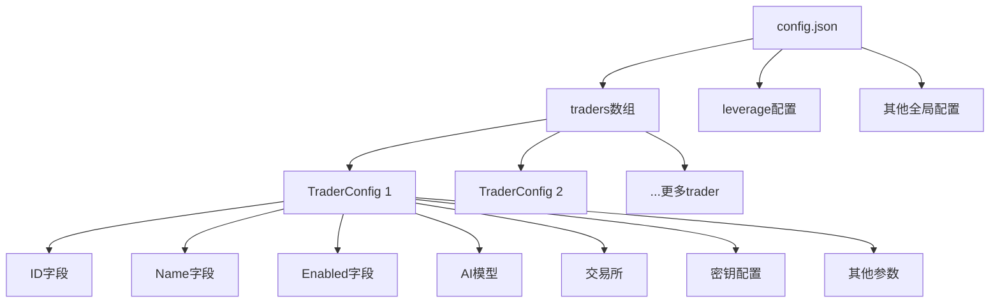
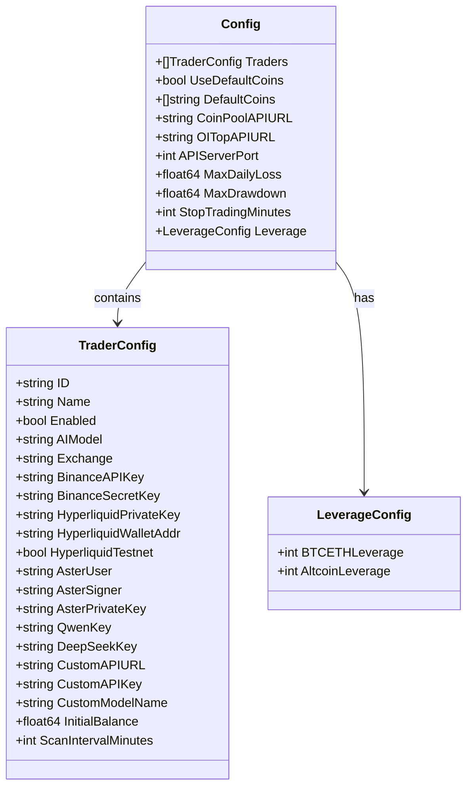
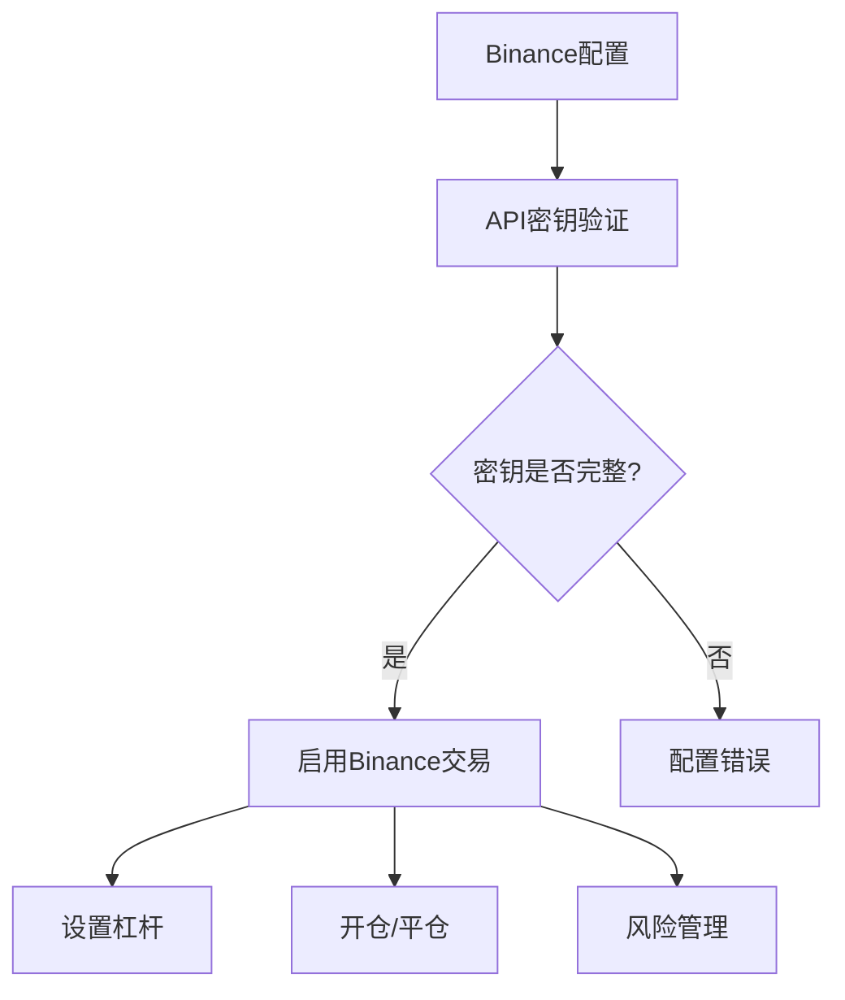
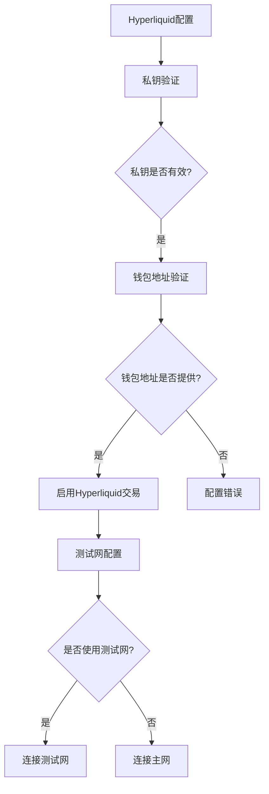
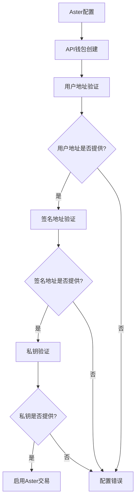
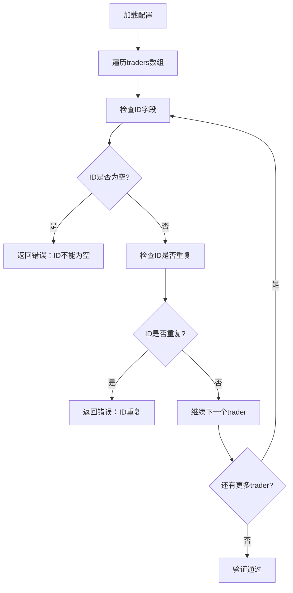
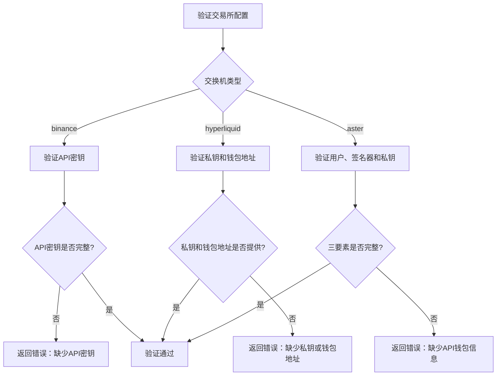
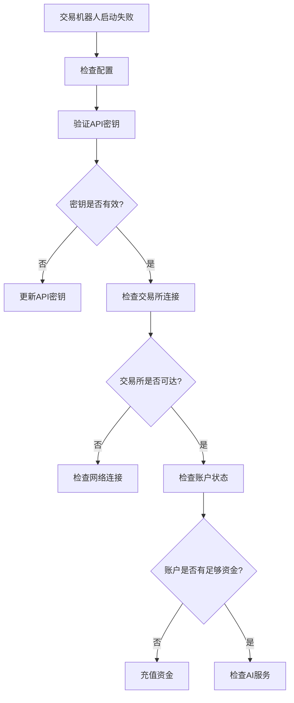

# 交易机器人配置详细指南

<cite>
**本文档引用的文件**
- [config/config.go](file://config/config.go)
- [config.json.example](file://config.json.example)
- [main.go](file://main.go)
- [trader/binance_futures.go](file://trader/binance_futures.go)
- [trader/hyperliquid_trader.go](file://trader/hyperliquid_trader.go)
- [trader/aster_trader.go](file://trader/aster_trader.go)
- [manager/trader_manager.go](file://manager/trader_manager.go)
- [README.md](file://README.md)
</cite>

## 目录
1. [简介](#简介)
2. [配置文件结构](#配置文件结构)
3. [traders数组详解](#traders数组详解)
4. [核心配置字段](#核心配置字段)
5. [AI模型配置](#ai模型配置)
6. [交易所配置](#交易所配置)
7. [配置示例](#配置示例)
8. [配置验证规则](#配置验证规则)
9. [常见配置错误](#常见配置错误)
10. [故障排除指南](#故障排除指南)

## 简介

NOFX系统通过`config.json`文件管理多个交易机器人（trader）的配置。每个交易机器人可以使用不同的AI模型，在不同的加密货币交易所上进行自动化交易。本文档详细说明了配置文件的各个字段及其作用。

## 配置文件结构

系统配置采用JSON格式，主要包含以下顶级字段：



**图表来源**
- [config/config.go](file://config/config.go#L10-L42)

**章节来源**
- [config/config.go](file://config/config.go#L44-L60)

## traders数组详解

`traders`数组是配置文件的核心部分，包含所有交易机器人的配置。每个元素是一个`TraderConfig`对象，代表一个独立的交易机器人。

### TraderConfig结构体



**图表来源**
- [config/config.go](file://config/config.go#L10-L42)
- [config/config.go](file://config/config.go#L44-L60)

**章节来源**
- [config/config.go](file://config/config.go#L10-L42)

## 核心配置字段

### ID字段
- **类型**: string
- **必需**: 是
- **作用**: 唯一标识每个交易机器人
- **要求**: 必须唯一，不能重复
- **示例**: `"hyperliquid_deepseek"`, `"binance_qwen"`

### Name字段
- **类型**: string  
- **必需**: 是
- **作用**: 显示名称，用于界面展示
- **示例**: `"Hyperliquid DeepSeek Trader"`, `"Binance Qwen Trader"`

### Enabled字段
- **类型**: bool
- **必需**: 是
- **作用**: 控制是否启用该交易机器人
- **默认值**: 无（必须明确设置）
- **示例**: `true`（启用），`false`（禁用）

### AI模型字段
- **类型**: string
- **必需**: 是
- **合法取值**: `"qwen"`, `"deepseek"`, `"custom"`
- **作用**: 指定使用的AI模型提供商

**章节来源**
- [config/config.go](file://config/config.go#L10-L42)

## AI模型配置

### Qwen模型配置

| 字段名 | 类型 | 必需 | 描述 | 示例 |
|--------|------|------|------|------|
| `ai_model` | string | 是 | AI模型类型 | `"qwen"` |
| `qwen_key` | string | 是 | Qwen API密钥 | `"sk-xxxxxxxxxxxxx"` |

**配置要求**:
- 必须设置`ai_model`为`"qwen"`
- 提供有效的Qwen API密钥
- 密钥格式：以`sk-`开头

### DeepSeek模型配置

| 字段名 | 类型 | 必需 | 描述 | 示例 |
|--------|------|------|------|------|
| `ai_model` | string | 是 | AI模型类型 | `"deepseek"` |
| `deepseek_key` | string | 是 | DeepSeek API密钥 | `"sk-xxxxxxxxxxxxx"` |

**配置要求**:
- 必须设置`ai_model`为`"deepseek"`
- 提供有效的DeepSeek API密钥
- 密钥格式：以`sk-`开头

### Custom模型配置

| 字段名 | 类型 | 必需 | 描述 | 示例 |
|--------|------|------|------|------|
| `ai_model` | string | 是 | AI模型类型 | `"custom"` |
| `custom_api_url` | string | 是 | 自定义API端点 | `"https://api.openai.com/v1"` |
| `custom_api_key` | string | 是 | 自定义API密钥 | `"sk-xxxxxxxxxxxxx"` |
| `custom_model_name` | string | 是 | 自定义模型名称 | `"gpt-4o"` |

**配置要求**:
- 必须设置`ai_model`为`"custom"`
- 提供完整的自定义API配置
- 支持任何OpenAI格式的API

**章节来源**
- [config/config.go](file://config/config.go#L10-L42)
- [config/config.go](file://config/config.go#L128-L149)

## 交易所配置

系统支持三个主要交易所，每个都有特定的配置要求。

### Binance交易所配置



**图表来源**
- [trader/binance_futures.go](file://trader/binance_futures.go#L20-L30)

| 字段名 | 类型 | 必需 | 描述 | 示例 |
|--------|------|------|------|------|
| `exchange` | string | 是 | 交易所类型 | `"binance"` |
| `binance_api_key` | string | 是 | Binance API密钥 | `"abc123..."` |
| `binance_secret_key` | string | 是 | Binance Secret密钥 | `"xyz789..."` |

**配置要求**:
- 必须设置`exchange`为`"binance"`
- API密钥必须具有期货交易权限
- 需要启用IP白名单

### Hyperliquid交易所配置



**图表来源**
- [trader/hyperliquid_trader.go](file://trader/hyperliquid_trader.go#L20-L50)

| 字段名 | 类型 | 必需 | 描述 | 示例 |
|--------|------|------|------|------|
| `exchange` | string | 是 | 交易所类型 | `"hyperliquid"` |
| `hyperliquid_private_key` | string | 是 | 以太坊私钥（无0x前缀） | `"your_key_without_0x"` |
| `hyperliquid_wallet_addr` | string | 是 | 以太坊钱包地址 | `"0xabc123..."` |
| `hyperliquid_testnet` | bool | 否 | 是否使用测试网 | `false` |

**配置要求**:
- 私钥格式：移除`0x`前缀
- 测试网模式：`hyperliquid_testnet: true`（默认false）
- 需要在Hyperliquid上充值资金

### Aster交易所配置



**图表来源**
- [trader/aster_trader.go](file://trader/aster_trader.go#L40-L60)

| 字段名 | 类型 | 必需 | 描述 | 示例 |
|--------|------|------|------|------|
| `exchange` | string | 是 | 交易所类型 | `"aster"` |
| `aster_user` | string | 是 | 主钱包地址 | `"0x63DD5aCC6b1aa0f563956C0e534DD30B6dcF7C4e"` |
| `aster_signer` | string | 是 | API钱包地址 | `"0x21cF8Ae13Bb72632562c6Fff438652Ba1a151bb0"` |
| `aster_private_key` | string | 是 | API钱包私钥 | `"your_private_key_without_0x"` |

**配置要求**:
- 通过[Aster API钱包页面](https://www.asterdex.com/en/api-wallet)创建
- 私钥格式：移除`0x`前缀
- API钱包与主钱包分离，提高安全性

**章节来源**
- [config/config.go](file://config/config.go#L128-L149)
- [trader/binance_futures.go](file://trader/binance_futures.go#L20-L30)
- [trader/hyperliquid_trader.go](file://trader/hyperliquid_trader.go#L20-L50)
- [trader/aster_trader.go](file://trader/aster_trader.go#L40-L60)

## 配置示例

### 完整配置示例

以下是来自`config.json.example`的完整配置示例：

```json
{
  "traders": [
    {
      "id": "hyperliquid_deepseek",
      "name": "Hyperliquid DeepSeek Trader",
      "enabled": true,
      "ai_model": "deepseek",
      "exchange": "hyperliquid",
      "hyperliquid_private_key": "your_ethereum_private_key_without_0x_prefix",
      "hyperliquid_wallet_addr": "your_ethereum_address",
      "hyperliquid_testnet": false,
      "deepseek_key": "your_deepseek_api_key",
      "initial_balance": 1000,
      "scan_interval_minutes": 3
    },
    {
      "id": "binance_qwen",
      "name": "Binance Qwen Trader",
      "enabled": true,
      "ai_model": "qwen",
      "exchange": "binance",
      "binance_api_key": "your_binance_api_key",
      "binance_secret_key": "your_binance_secret_key",
      "qwen_key": "your_qwen_api_key",
      "initial_balance": 1000,
      "scan_interval_minutes": 3
    },
    {
      "id": "binance_custom",
      "name": "Binance Custom API Trader",
      "enabled": false,
      "ai_model": "custom",
      "exchange": "binance",
      "binance_api_key": "your_binance_api_key",
      "binance_secret_key": "your_binance_secret_key",
      "custom_api_url": "https://api.openai.com/v1",
      "custom_api_key": "sk-your-api-key",
      "custom_model_name": "gpt-4o",
      "initial_balance": 1000,
      "scan_interval_minutes": 3
    },
    {
      "id": "aster_deepseek",
      "name": "Aster DeepSeek Trader",
      "enabled": true,
      "ai_model": "deepseek",
      "exchange": "aster",
      "aster_user": "0x63DD5aCC6b1aa0f563956C0e534DD30B6dcF7C4e",
      "aster_signer": "0x21cF8Ae13Bb72632562c6Fff438652Ba1a151bb0",
      "aster_private_key": "your_aster_api_wallet_private_key_without_0x_prefix",
      "deepseek_key": "your_deepseek_api_key",
      "initial_balance": 1000.0,
      "scan_interval_minutes": 3
    }
  ],
  "leverage": {
    "btc_eth_leverage": 5,
    "altcoin_leverage": 5
  },
  "use_default_coins": true,
  "default_coins": [
    "BTCUSDT",
    "ETHUSDT",
    "SOLUSDT",
    "BNBUSDT",
    "XRPUSDT",
    "DOGEUSDT",
    "ADAUSDT",
    "HYPEUSDT"
  ],
  "coin_pool_api_url": "",
  "oi_top_api_url": "",
  "api_server_port": 8080,
  "max_daily_loss": 10.0,
  "max_drawdown": 20.0,
  "stop_trading_minutes": 60
}
```

### 单个交易机器人配置

#### Binance + DeepSeek配置
```json
{
  "id": "my_trader",
  "name": "我的交易机器人",
  "enabled": true,
  "ai_model": "deepseek",
  "exchange": "binance",
  "binance_api_key": "YOUR_BINANCE_API_KEY",
  "binance_secret_key": "YOUR_BINANCE_SECRET_KEY",
  "deepseek_key": "sk-deepseek_key_here",
  "initial_balance": 1000.0,
  "scan_interval_minutes": 3
}
```

#### Hyperliquid + Qwen配置
```json
{
  "id": "hyperliquid_qwen",
  "name": "Hyperliquid Qwen交易",
  "enabled": true,
  "ai_model": "qwen",
  "exchange": "hyperliquid",
  "hyperliquid_private_key": "your_private_key",
  "hyperliquid_wallet_addr": "0xYourWalletAddress",
  "hyperliquid_testnet": false,
  "qwen_key": "sk-qwen_key_here",
  "initial_balance": 1000.0,
  "scan_interval_minutes": 3
}
```

#### Aster + DeepSeek配置
```json
{
  "id": "aster_deepseek",
  "name": "Aster DeepSeek交易",
  "enabled": true,
  "ai_model": "deepseek",
  "exchange": "aster",
  "aster_user": "0xMainWalletAddress",
  "aster_signer": "0xAPIWalletAddress",
  "aster_private_key": "your_api_private_key",
  "deepseek_key": "sk-deepseek_key_here",
  "initial_balance": 1000.0,
  "scan_interval_minutes": 3
}
```

**章节来源**
- [config.json.example](file://config.json.example#L1-L85)

## 配置验证规则

系统在启动时会对配置文件进行严格验证，确保配置的正确性和完整性。

### ID唯一性验证



**验证规则**:
- 每个trader的`id`字段必须唯一
- 不能包含空字符串
- 重复的ID会导致启动失败

### 必填字段检查

| 字段 | 验证规则 | 错误信息 |
|------|----------|----------|
| `id` | 不能为空字符串 | `"trader[%d]: ID不能为空"` |
| `name` | 不能为空字符串 | `"trader[%d]: Name不能为空"` |
| `ai_model` | 必须是合法值 | `"trader[%d]: ai_model必须是 'qwen', 'deepseek' 或 'custom'"` |
| `exchange` | 必须是合法值 | `"trader[%d]: exchange必须是 'binance', 'hyperliquid' 或 'aster'"` |
| `initial_balance` | 必须大于0 | `"trader[%d]: initial_balance必须大于0"` |
| `scan_interval_minutes` | 必须大于0 | 默认3分钟 |

### 交易所特定验证



**图表来源**
- [config/config.go](file://config/config.go#L128-L149)

### AI模型特定验证

| AI模型 | 必需字段 | 验证规则 |
|--------|----------|----------|
| `qwen` | `qwen_key` | 必须提供有效的Qwen API密钥 |
| `deepseek` | `deepseek_key` | 必须提供有效的DeepSeek API密钥 |
| `custom` | `custom_api_url`, `custom_api_key`, `custom_model_name` | 必须提供完整的自定义API配置 |

**章节来源**
- [config/config.go](file://config/config.go#L82-L170)

## 常见配置错误

### 密钥配置错误

#### Binance API密钥错误
**错误症状**:
- 启动时显示`invalid API key`
- 交易无法执行
- 权限不足错误

**解决方案**:
1. 检查API密钥格式是否正确
2. 确认API密钥具有期货交易权限
3. 验证IP白名单设置
4. 重新生成API密钥

#### Hyperliquid私钥错误
**错误症状**:
- 私钥解析失败
- 钱包地址验证失败
- 交易执行被拒绝

**解决方案**:
1. 移除私钥的`0x`前缀
2. 确认私钥格式正确
3. 验证钱包地址与私钥匹配
4. 确保钱包中有足够资金

#### Aster API钱包错误
**错误症状**:
- API签名失败
- 权限验证失败
- 请求被拒绝

**解决方案**:
1. 通过[Aster API钱包页面](https://www.asterdex.com/en/api-wallet)创建API钱包
2. 复制正确的用户地址、签名器地址和私钥
3. 确保私钥格式正确（无`0x`前缀）
4. 验证API钱包权限设置

### 交易所配置错误

#### exchange字段拼写错误
**错误症状**:
- `exchange必须是 'binance', 'hyperliquid' 或 'aster'`
- 交易所选择无效

**解决方案**:
```json
// 错误
"exchange": "binance_futures"

// 正确
"exchange": "binance"
```

#### 权限配置错误
**错误症状**:
- API调用被拒绝
- 权限不足
- 交易无法执行

**解决方案**:
1. 确认API密钥权限设置
2. 启用必要的交易权限
3. 配置IP白名单
4. 检查API密钥状态

### AI模型配置错误

#### AI模型类型错误
**错误症状**:
- `ai_model必须是 'qwen', 'deepseek' 或 'custom'`
- AI服务调用失败

**解决方案**:
```json
// 错误
"ai_model": "openai"

// 正确
"ai_model": "deepseek"
```

#### API密钥格式错误
**错误症状**:
- API调用失败
- 认证错误
- 无效密钥

**解决方案**:
1. 确认密钥以`sk-`开头
2. 检查密钥长度和格式
3. 验证密钥有效性
4. 重新生成API密钥

### 资金和扫描配置错误

#### initial_balance设置错误
**错误症状**:
- 盈亏计算错误
- 性能统计不准确
- 风控计算异常

**解决方案**:
```json
// 错误：设置为0或负数
"initial_balance": 0

// 正确：设置为正数
"initial_balance": 1000.0
```

#### scan_interval_minutes设置错误
**错误症状**:
- 决策频率过高
- 决策频率过低
- 系统响应延迟

**解决方案**:
```json
// 推荐范围：3-5分钟
"scan_interval_minutes": 3

// 不推荐：过于频繁或缓慢
"scan_interval_minutes": 1  // 过于频繁
"scan_interval_minutes": 10 // 过于缓慢
```

**章节来源**
- [config/config.go](file://config/config.go#L128-L170)

## 故障排除指南

### 启动时错误诊断

#### 配置文件加载失败
**错误信息**: `读取配置文件失败`
**可能原因**:
- JSON语法错误
- 文件路径错误
- 文件权限问题

**解决步骤**:
1. 验证JSON语法正确性
2. 检查文件路径和权限
3. 使用JSON验证工具检查格式

#### 配置验证失败
**错误信息**: `配置验证失败`
**常见原因**:
- ID重复
- 必填字段缺失
- 密钥格式错误

**解决步骤**:
1. 检查所有trader的ID是否唯一
2. 验证所有必需字段是否填写
3. 确认密钥格式正确

### 运行时错误诊断

#### 交易机器人启动失败
**错误信息**: `初始化trader失败`
**诊断流程**:



**诊断检查清单**:
1. ✅ API密钥格式正确
2. ✅ 交易所连接正常
3. ✅ 账户资金充足
4. ✅ AI服务可用
5. ✅ 权限配置正确

#### 交易执行错误
**常见错误类型**:
- 权限不足
- 资金不足
- 价格超出范围
- 网络连接超时

**解决策略**:
1. 检查API密钥权限
2. 验证账户余额
3. 监控网络连接
4. 调整交易参数

### 性能优化建议

#### 扫描间隔优化
- **高频交易**: 3-5分钟
- **稳健交易**: 5-10分钟
- **保守交易**: 10-15分钟

#### 杠杆配置优化
- **子账户**: ≤5x
- **主账户**: 5-20x（Altcoin），5-50x（BTC/ETH）
- **高风险**: 20-50x（仅主账户）

#### 资金管理建议
- **初始资金**: 至少1000 USDT用于测试
- **单币种限额**: BTC/ETH ≤10x，Altcoin ≤1.5x
- **每日损失限制**: 5-15%

**章节来源**
- [config/config.go](file://config/config.go#L82-L170)
- [main.go](file://main.go#L86-L98)

## 结论

NOFX系统的交易机器人配置提供了灵活而强大的配置选项。通过正确配置`traders`数组中的各个字段，用户可以在不同的AI模型和交易所之间进行自由组合，构建个性化的自动化交易系统。

关键要点：
- 确保每个trader的ID唯一
- 正确配置相应的API密钥
- 选择合适的AI模型和交易所
- 设置合理的资金和风险管理参数
- 遵循配置验证规则

通过遵循本文档的指导，用户可以成功部署和运行多个交易机器人，实现高效的自动化交易策略。