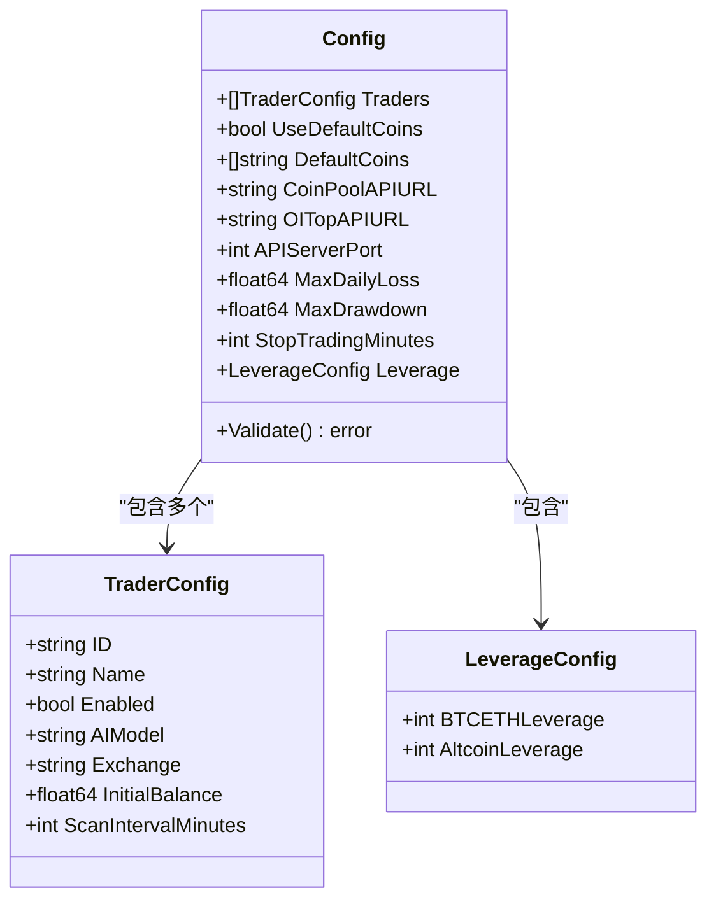
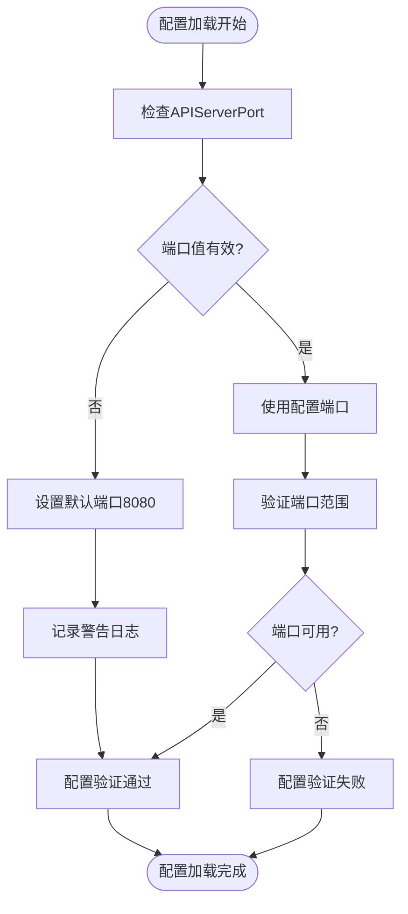
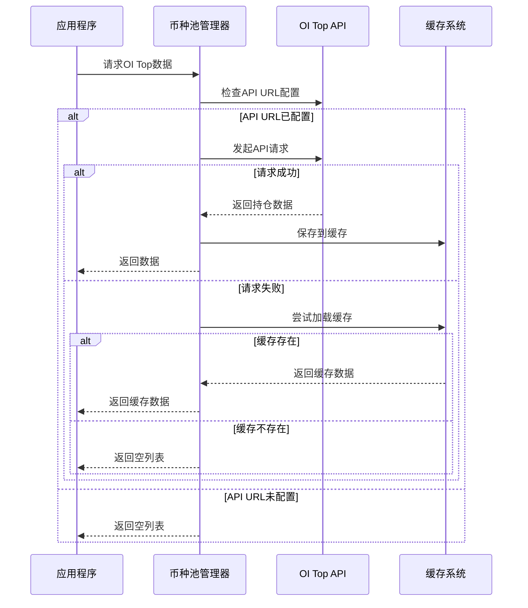
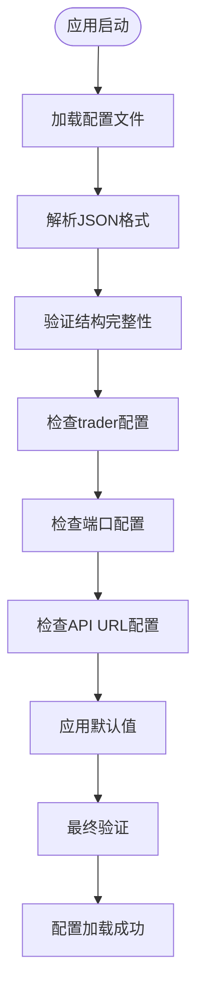

# 服务端口与高级配置

<cite>
**本文档引用的文件**
- [config.go](file://config/config.go)
- [main.go](file://main.go)
- [server.go](file://api/server.go)
- [coin_pool.go](file://pool/coin_pool.go)
- [pm2.config.js](file://pm2.config.js)
- [pm2.sh](file://pm2.sh)
- [docker-compose.yml](file://docker-compose.yml)
- [DOCKER_DEPLOY.md](file://DOCKER_DEPLOY.md)
</cite>

## 目录
1. [简介](#简介)
2. [核心配置参数](#核心配置参数)
3. [API服务器端口配置](#api服务器端口配置)
4. [持仓量排名API配置](#持仓量排名api配置)
5. [配置加载与验证机制](#配置加载与验证机制)
6. [部署环境配置](#部署环境配置)
7. [多实例部署解决方案](#多实例部署解决方案)
8. [高级配置扩展](#高级配置扩展)
9. [故障排除指南](#故障排除指南)
10. [总结](#总结)

## 简介

NoFX AI交易竞赛系统提供了灵活的服务端口配置和高级功能设置，支持多种部署环境和场景需求。本文档详细说明了关键配置参数的使用方法、配置优先级规则以及多实例部署的最佳实践。

## 核心配置参数

系统的核心配置通过`Config`结构体定义，其中包含了两个关键的高级配置参数：

### 配置结构概览



**图表来源**
- [config.go](file://config/config.go#L42-L76)

**章节来源**
- [config.go](file://config/config.go#L42-L76)

## API服务器端口配置

### `api_server_port` 参数详解

`api_server_port`是系统HTTP API服务的监听端口配置，具有以下特性：

#### 默认行为
- **默认值**: 8080
- **自动设置**: 当配置文件中未指定端口时，系统会自动将其设置为8080
- **验证机制**: 在配置验证阶段进行端口有效性检查

#### 配置方式

**JSON配置文件**:
```json
{
  "api_server_port": 8080
}
```

**环境变量配置**（Docker部署）:
```yaml
services:
  nofx:
    ports:
      - "${NOFX_BACKEND_PORT:-8080}:8080"
```

#### 端口验证逻辑



**图表来源**
- [config.go](file://config/config.go#L158-L162)

**章节来源**
- [config.go](file://config/config.go#L158-L162)
- [main.go](file://main.go#L118-L120)

## 持仓量排名API配置

### `oi_top_api_url` 参数详解

`oi_top_api_url`用于配置持仓量排名API，该功能对于动态调整交易策略至关重要。

#### 功能概述
- **数据来源**: 提供持仓量增长Top20的币种数据
- **应用场景**: 帮助AI模型识别市场热点和趋势
- **数据频率**: 支持定期刷新和缓存机制

#### 配置语法
```json
{
  "oi_top_api_url": "https://api.example.com/v1/oi-top"
}
```

#### 数据处理流程



**图表来源**
- [coin_pool.go](file://pool/coin_pool.go#L420-L460)

#### 配置最佳实践

| 配置项 | 类型 | 默认值 | 说明 |
|--------|------|--------|------|
| API_URL | string | "" | 持仓量API的完整URL |
| Timeout | duration | 30s | API请求超时时间 |
| CacheDir | string | "coin_pool_cache" | 缓存文件存储目录 |

**章节来源**
- [coin_pool.go](file://pool/coin_pool.go#L377-L418)
- [coin_pool.go](file://pool/coin_pool.go#L48-L83)

## 配置加载与验证机制

### 配置优先级规则

系统采用多层次的配置加载和验证机制：

#### 1. 配置文件加载


**图表来源**
- [config.go](file://config/config.go#L78-L157)

#### 2. 默认值应用逻辑

| 参数 | 默认值 | 应用条件 | 说明 |
|------|--------|----------|------|
| APIServerPort | 8080 | 端口<=0 | 自动设置为8080 |
| UseDefaultCoins | true | 未设置且无API URL | 启用默认币种列表 |
| BTCETHLeverage | 5 | ≤0 | 主账户安全值 |
| AltcoinLeverage | 5 | ≤0 | 子账户限制 |

#### 3. 验证规则

系统对配置进行严格验证，包括：
- Trader数量必须大于0
- Trader ID不能重复
- 必需字段不能为空
- API密钥配置完整性
- 端口范围有效性

**章节来源**
- [config.go](file://config/config.go#L78-L157)

## 部署环境配置

### Docker部署配置

#### 端口映射配置
```yaml
services:
  nofx:
    ports:
      - "${NOFX_BACKEND_PORT:-8080}:8080"
    environment:
      - TZ=${NOFX_TIMEZONE:-Asia/Shanghai}
```

#### 环境变量管理
- **NOFX_BACKEND_PORT**: 后端API端口，默认8080
- **NOFX_TIMEZONE**: 时区设置，默认Asia/Shanghai

### PM2部署配置

#### 应用配置
```javascript
{
  name: 'nofx-backend',
  script: './nofx',
  cwd: __dirname,
  instances: 1,
  autorestart: true,
  max_memory_restart: '500M'
}
```

#### 端口配置
- **前端端口**: 3000（默认）
- **后端端口**: 8080（默认）

**章节来源**
- [docker-compose.yml](file://docker-compose.yml#L8-L12)
- [pm2.config.js](file://pm2.config.js#L4-L20)

## 多实例部署解决方案

### 端口冲突预防

当在同一主机上运行多个NoFX实例时，需要解决端口冲突问题：

#### 1. 环境变量隔离
```bash
# 实例1配置
export NOFX_BACKEND_PORT=8081
export NOFX_FRONTEND_PORT=3001

# 实例2配置  
export NOFX_BACKEND_PORT=8082
export NOFX_FRONTEND_PORT=3002
```

#### 2. Docker Compose配置
```yaml
services:
  nofx-instance1:
    ports:
      - "8081:8080"
      
  nofx-instance2:
    ports:
      - "8082:8080"
```

#### 3. PM2实例管理
```bash
# 启动多个实例
pm2 start ./nofx --name="nofx-1" -- -c config1.json
pm2 start ./nofx --name="nofx-2" -- -c config2.json
```

### 负载均衡配置

#### Nginx反向代理
```nginx
upstream nofx_backend {
    server localhost:8081;
    server localhost:8082;
    server localhost:8083;
}

server {
    listen 80;
    server_name trading.example.com;
    
    location / {
        proxy_pass http://nofx_backend;
        proxy_set_header Host $host;
        proxy_set_header X-Real-IP $remote_addr;
    }
}
```

## 高级配置扩展

### 未来可扩展配置项

基于现有架构，系统预留了多个高级配置扩展点：

#### 1. 性能优化配置
```json
{
  "performance": {
    "max_concurrent_requests": 100,
    "request_timeout": 30,
    "cache_ttl": 300
  }
}
```

#### 2. 监控配置
```json
{
  "monitoring": {
    "metrics_enabled": true,
    "prometheus_endpoint": "/metrics",
    "log_level": "info"
  }
}
```

#### 3. 安全配置
```json
{
  "security": {
    "api_key_required": true,
    "allowed_origins": ["https://dashboard.example.com"],
    "rate_limit": {
      "requests_per_minute": 1000,
      "burst_size": 10
    }
  }
}
```

#### 4. 扩展API配置
```json
{
  "external_apis": {
    "market_data": "https://api.marketdata.com/v1",
    "news_feed": "https://api.news.com/v1",
    "social_sentiment": "https://api.sentiment.com/v1"
  }
}
```

### 配置热重载支持

系统设计支持配置热重载，允许在不停机的情况下更新配置参数。

## 故障排除指南

### 常见端口问题

#### 1. 端口被占用
**症状**: 启动时出现"port already in use"错误
**解决方案**:
```bash
# 检查端口占用
netstat -tulpn | grep :8080

# 杀死占用进程
kill -9 $(lsof -t -i:8080)

# 或修改配置文件
sed -i 's/"api_server_port": 8080/"api_server_port": 8081/' config.json
```

#### 2. 防火墙阻止
**症状**: 外部无法访问API服务
**解决方案**:
```bash
# Ubuntu/Debian
ufw allow 8080

# CentOS/RHEL
firewall-cmd --permanent --add-port=8080/tcp
firewall-cmd --reload
```

#### 3. Docker端口映射问题
**症状**: 容器内服务正常但外部无法访问
**解决方案**:
```bash
# 检查容器端口映射
docker ps
docker port nofx-trading

# 重新配置端口映射
docker stop nofx-trading
docker rm nofx-trading
docker compose up -d
```

### API配置问题

#### 1. OI Top API连接失败
**诊断步骤**:
```bash
# 测试API连通性
curl -I "https://api.example.com/v1/oi-top"

# 检查网络连接
ping api.example.com

# 查看日志
docker logs nofx-trading | grep oi_top
```

**解决方案**:
- 检查API URL是否正确
- 验证网络连接
- 检查API认证信息
- 调整超时设置

#### 2. 配置文件格式错误
**常见错误**:
- 缺少逗号
- 引号不匹配
- 数字格式错误

**修复方法**:
```bash
# 验证JSON格式
jq . config.json

# 修复格式错误
python -m json.tool config.json > config_fixed.json
```

**章节来源**
- [config.go](file://config/config.go#L158-L162)
- [server.go](file://api/server.go#L390-L423)

## 总结

NoFX AI交易竞赛系统的服务端口与高级配置提供了灵活而强大的定制能力：

### 关键要点
1. **端口配置**: `api_server_port`默认8080，支持环境变量覆盖
2. **API集成**: `oi_top_api_url`提供动态交易策略数据
3. **配置验证**: 完善的验证机制确保配置正确性
4. **部署灵活性**: 支持Docker、PM2等多种部署方式
5. **扩展性**: 预留多个高级配置扩展点

### 最佳实践
- 使用环境变量管理不同环境的配置
- 为多实例部署设置不同的端口
- 定期备份配置文件
- 监控配置变更的影响
- 保持配置文档的及时更新

通过合理配置这些参数，可以充分发挥NoFX系统的性能优势，满足不同规模和场景的部署需求。