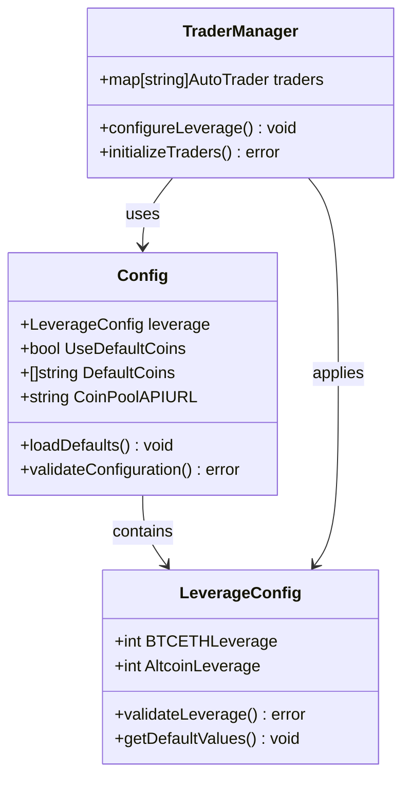
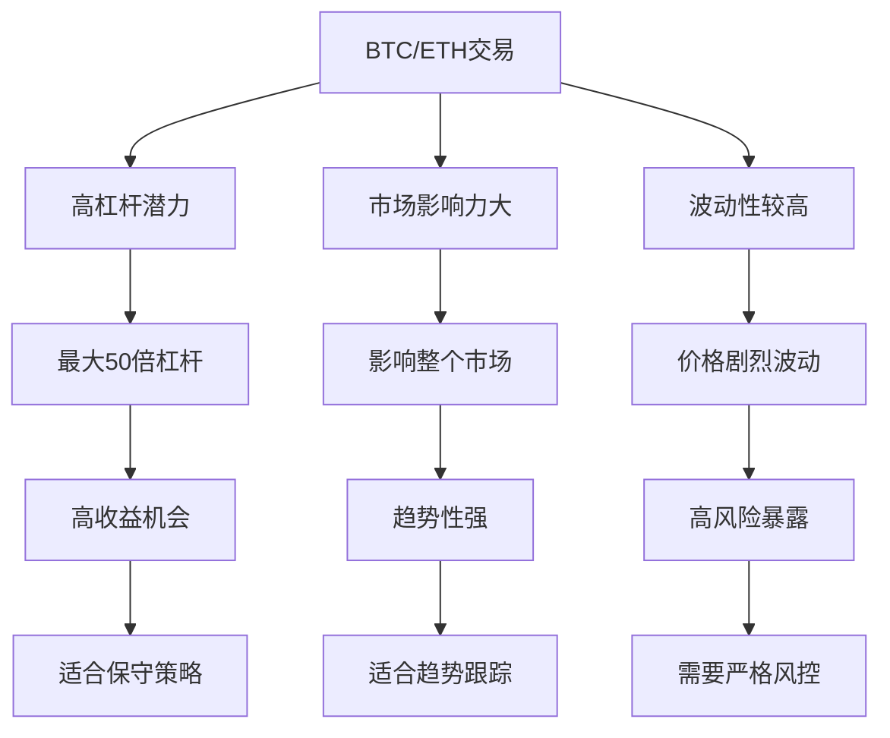
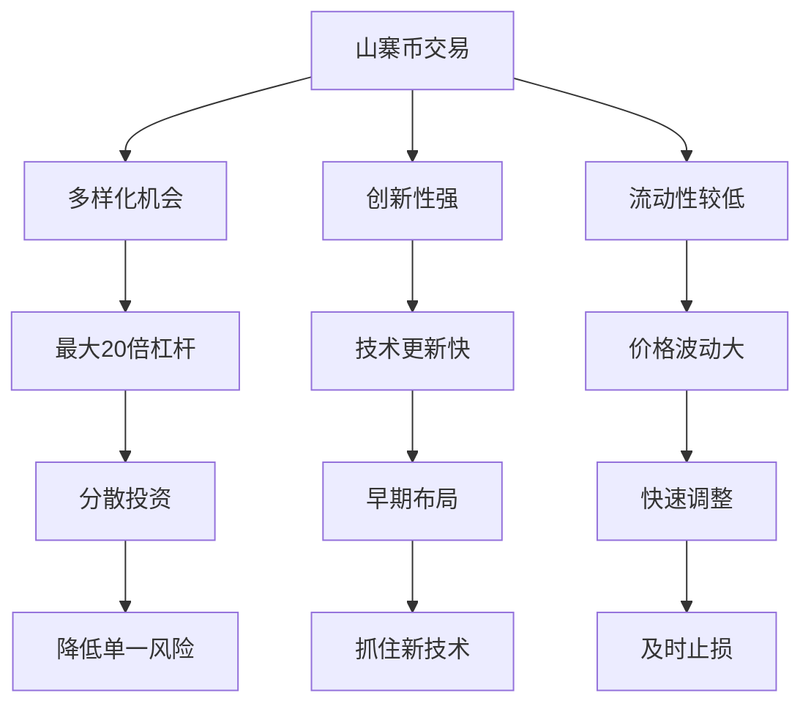
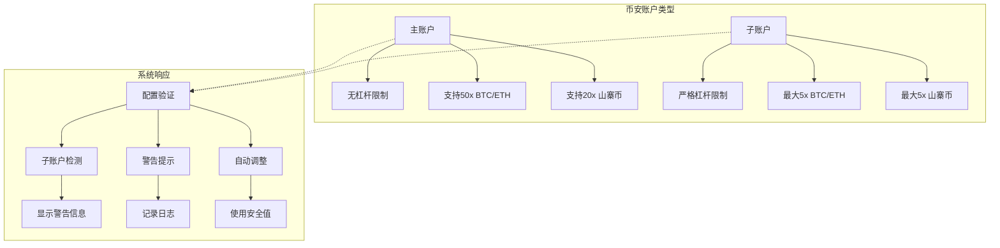
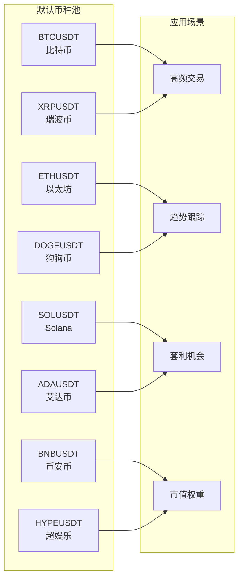
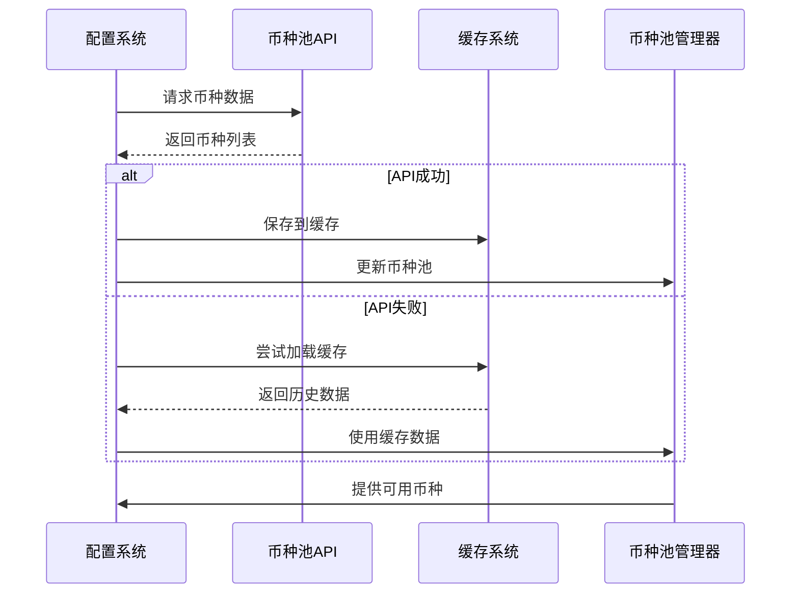
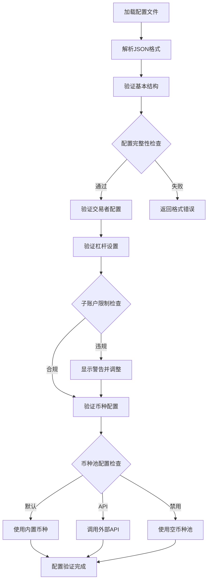
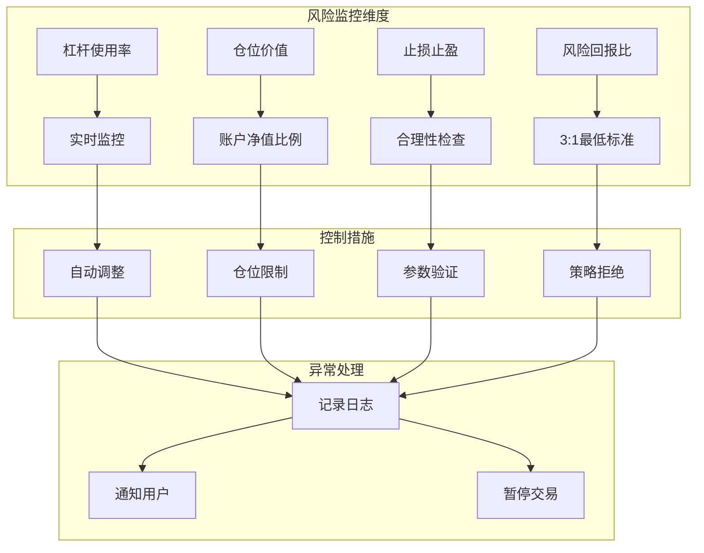
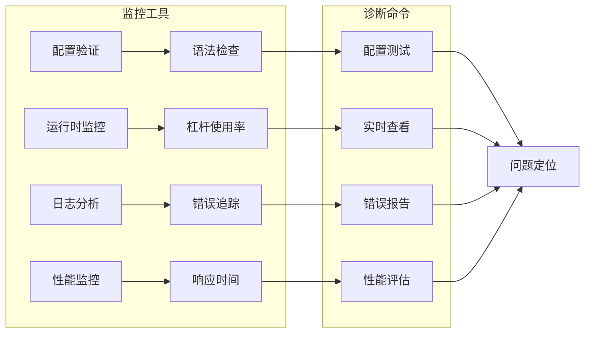

# 杠杆与交易币种配置指南

<cite>
**本文档引用的文件**
- [config/config.go](file://config/config.go)
- [config.json.example](file://config.json.example)
- [pool/coin_pool.go](file://pool/coin_pool.go)
- [trader/binance_futures.go](file://trader/binance_futures.go)
- [decision/engine.go](file://decision/engine.go)
- [manager/trader_manager.go](file://manager/trader_manager.go)
</cite>

## 目录
1. [简介](#简介)
2. [杠杆配置概述](#杠杆配置概述)
3. [BTC/ETH与山寨币杠杆差异](#btceht与山寨币杠杆差异)
4. [子账户与主账户配置](#子账户与主账户配置)
5. [币种配置系统](#币种配置系统)
6. [配置文件详解](#配置文件详解)
7. [风险控制与最佳实践](#风险控制与最佳实践)
8. [故障排除指南](#故障排除指南)
9. [总结](#总结)

## 简介

本指南详细介绍了nofx交易系统的杠杆配置和币种管理功能。通过合理的杠杆设置和币种配置，可以在保证交易安全的同时最大化收益潜力。系统提供了灵活的配置选项，支持不同类型的交易账户和策略需求。

## 杠杆配置概述

### 杠杆配置结构

系统采用分层杠杆配置架构，针对不同类型的交易币种设置不同的杠杆上限：



**图表来源**
- [config/config.go](file://config/config.go#L48-L50)
- [config/config.go](file://config/config.go#L52-L60)
- [manager/trader_manager.go](file://manager/trader_manager.go#L56-L57)

### 杠杆配置字段说明

| 字段 | 类型 | 描述 | 默认值 | 风险等级 |
|------|------|------|--------|----------|
| `btc_eth_leverage` | int | BTC和ETH的最大杠杆倍数 | 5 | 安全 |
| `altcoin_leverage` | int | 山寨币的最大杠杆倍数 | 5 | 安全 |

**章节来源**
- [config/config.go](file://config/config.go#L48-L49)

## BTC/ETH与山寨币杠杆差异

### 区别与风险含义

系统将交易币种分为两大类，每类采用不同的杠杆策略：

#### BTC/ETH杠杆配置特点



**图表来源**
- [config/config.go](file://config/config.go#L48-L49)

#### 山寨币杠杆配置特点



**图表来源**
- [config/config.go](file://config/config.go#L48-L49)

### 风险控制机制

系统实现了多层次的风险控制：

1. **仓位价值限制**：BTC/ETH单币种仓位不超过账户净值的10倍
2. **山寨币限制**：单币种仓位不超过账户净值的1.5倍  
3. **杠杆验证**：实时验证杠杆设置的有效性
4. **止损止盈检查**：确保风险回报比符合要求

**章节来源**
- [decision/engine.go](file://decision/engine.go#L558-L586)

## 子账户与主账户配置

### 币安子账户限制

币安对子账户设置了严格的杠杆限制：



**图表来源**
- [config/config.go](file://config/config.go#L184-L191)

### 配置建议矩阵

| 账户类型 | BTC/ETH杠杆 | 山寨币杠杆 | 推荐策略 | 风险级别 |
|----------|-------------|------------|----------|----------|
| **子账户** | 5 | 5 | 保守策略 | ✅ 安全（默认） |
| **主账户（保守）** | 10 | 10 | 平衡策略 | 🟡 中等 |
| **主账户（激进）** | 20 | 15 | 积极策略 | 🔴 高 |
| **主账户（极限）** | 50 | 20 | 冲击策略 | 🔴🔴 极高 |

### 错误处理机制

当配置超出子账户限制时，系统会：

1. **显示警告信息**：明确指出杠杆设置可能导致的问题
2. **记录日志**：详细记录配置详情和警告原因
3. **自动调整**：将超出限制的杠杆设置调整为安全值

**章节来源**
- [config/config.go](file://config/config.go#L184-L191)

## 币种配置系统

### 默认币种池

系统提供了预配置的主流币种列表，涵盖流动性最好的交易对：



**图表来源**
- [pool/coin_pool.go](file://pool/coin_pool.go#L15-L24)

### 动态币种池API

系统支持通过API动态获取交易币种，提供更灵活的配置选项：



**图表来源**
- [pool/coin_pool.go](file://pool/coin_pool.go#L100-L150)

### 币种配置选项

| 配置项 | 类型 | 描述 | 默认行为 |
|--------|------|------|----------|
| `use_default_coins` | bool | 是否使用默认币种列表 | true（智能默认） |
| `default_coins` | []string | 自定义默认币种列表 | 预设主流币种 |
| `coin_pool_api_url` | string | 动态币种池API地址 | 空（使用默认） |

**章节来源**
- [config/config.go](file://config/config.go#L54-L58)

## 配置文件详解

### 完整配置示例

以下是基于`config.json.example`的详细配置说明：

```json
{
  "leverage": {
    "btc_eth_leverage": 5,
    "altcoin_leverage": 5
  },
  "use_default_coins": true,
  "default_coins": [
    "BTCUSDT",
    "ETHUSDT",
    "SOLUSDT",
    "BNBUSDT",
    "XRPUSDT",
    "DOGEUSDT",
    "ADAUSDT",
    "HYPEUSDT"
  ],
  "coin_pool_api_url": "",
  "oi_top_api_url": ""
}
```

### 配置验证流程



**图表来源**
- [config/config.go](file://config/config.go#L62-L120)

### 默认值设置逻辑

系统实现了智能的默认值设置机制：

1. **杠杆默认值**：未设置时自动设置为5倍（安全值）
2. **币种池默认值**：未配置API时自动启用默认币种列表
3. **币种列表默认值**：使用预设的主流币种组合

**章节来源**
- [config/config.go](file://config/config.go#L78-L95)

## 风险控制与最佳实践

### 杠杆使用原则

#### 保守配置（推荐）

```json
{
  "leverage": {
    "btc_eth_leverage": 5,
    "altcoin_leverage": 5
  }
}
```

**适用场景**：
- 币安子账户用户
- 新手交易者
- 风险厌恶型投资者
- 长期稳定策略

#### 平衡配置

```json
{
  "leverage": {
    "btc_eth_leverage": 10,
    "altcoin_leverage": 10
  }
}
```

**适用场景**：
- 经验丰富的交易者
- 主账户用户
- 中等风险承受能力
- 短期交易策略

#### 激进配置

```json
{
  "leverage": {
    "btc_eth_leverage": 20,
    "altcoin_leverage": 15
  }
}
```

**适用场景**：
- 高级交易者
- 主账户用户
- 高风险承受能力
- 高频交易策略

### 风险监控指标

系统实现了全面的风险监控体系：



**图表来源**
- [decision/engine.go](file://decision/engine.go#L558-L586)

### 安全配置建议

1. **始终使用默认杠杆值**：除非你完全理解风险，否则不要超过5倍
2. **定期检查配置**：确保配置符合当前账户状态
3. **监控交易日志**：关注杠杆相关的警告信息
4. **备份配置文件**：防止配置丢失导致的风险

**章节来源**
- [config/config.go](file://config/config.go#L181-L191)

## 故障排除指南

### 常见问题与解决方案

#### 问题1：子账户杠杆设置失败

**症状**：交易失败，错误信息包含`Subaccounts are restricted from using leverage greater than 5x`

**原因分析**：
- 配置了超过5倍的杠杆
- 账户类型为币安子账户
- 系统未正确识别账户类型

**解决方案**：
1. 检查配置文件中的杠杆设置
2. 将`btc_eth_leverage`和`altcoin_leverage`都设置为5
3. 重新启动交易系统

#### 问题2：币种池API访问失败

**症状**：系统使用默认币种列表而非自定义币种池

**原因分析**：
- API URL配置错误
- 网络连接问题
- API响应格式不正确

**解决方案**：
1. 验证API URL的正确性
2. 检查网络连接状态
3. 查看API响应格式是否符合预期
4. 检查配置文件中的`use_default_coins`设置

#### 问题3：仓位价值超限

**症状**：交易被拒绝，提示仓位价值超过限制

**原因分析**：
- 账户净值增加导致相对仓位变大
- 杠杆设置过高
- 单币种持仓过多

**解决方案**：
1. 降低杠杆设置
2. 分散持仓到更多币种
3. 控制单币种持仓比例

### 调试工具

系统提供了多种调试和监控工具：



**章节来源**
- [config/config.go](file://config/config.go#L122-L170)

## 总结

### 关键要点回顾

1. **杠杆配置差异化**：BTC/ETH和山寨币采用不同的杠杆策略，分别对应不同的风险收益特征
2. **子账户兼容性**：系统自动检测账户类型并提供相应的安全建议
3. **智能默认值**：系统提供合理的默认配置，减少用户配置负担
4. **全面风险控制**：多层次的风险控制机制确保交易安全
5. **灵活配置选项**：支持静态和动态币种配置，满足不同需求

### 最佳实践总结

- **保守策略**：始终使用默认的5倍杠杆配置
- **账户匹配**：根据实际账户类型调整配置
- **定期检查**：定期验证配置的有效性和安全性
- **监控预警**：密切关注系统发出的警告信息
- **文档维护**：保持配置文档的及时更新

通过合理配置杠杆和币种参数，可以在保证交易安全的前提下实现更好的交易效果。建议用户根据自身的风险承受能力和交易经验，选择合适的配置方案，并持续监控和优化配置参数。