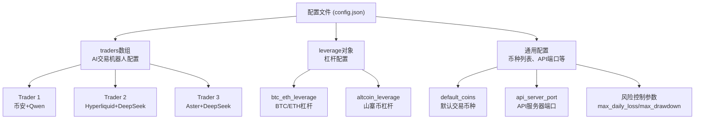
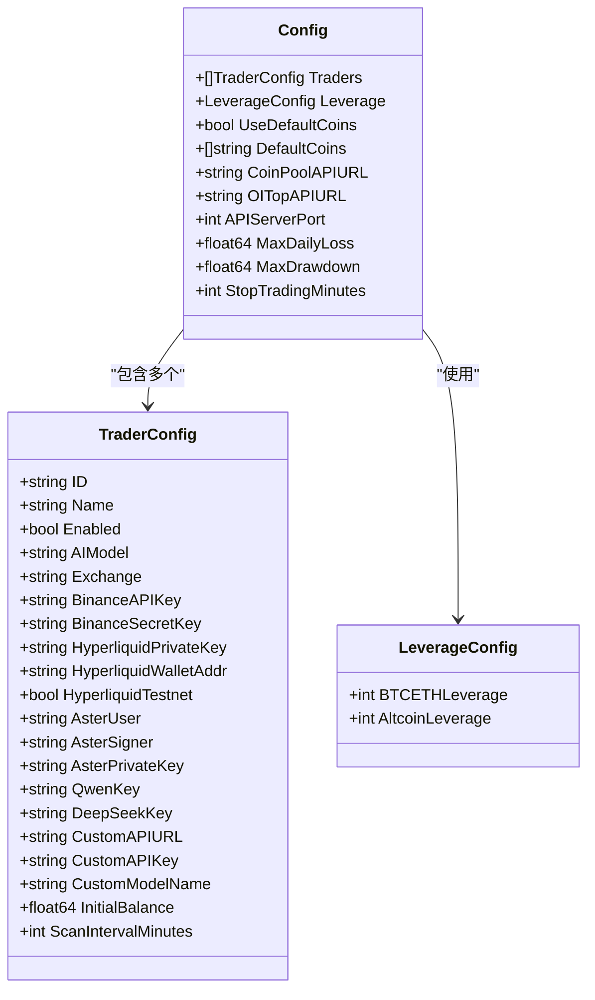
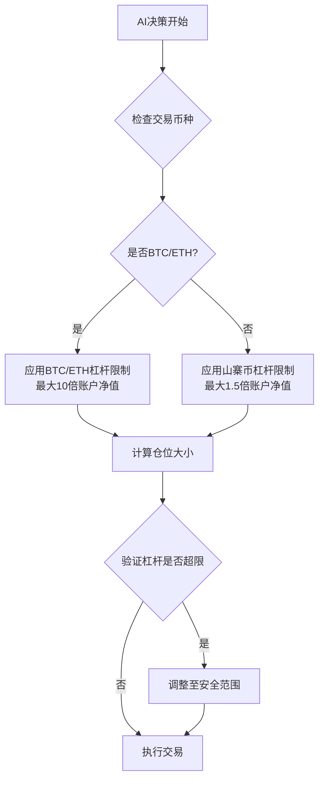
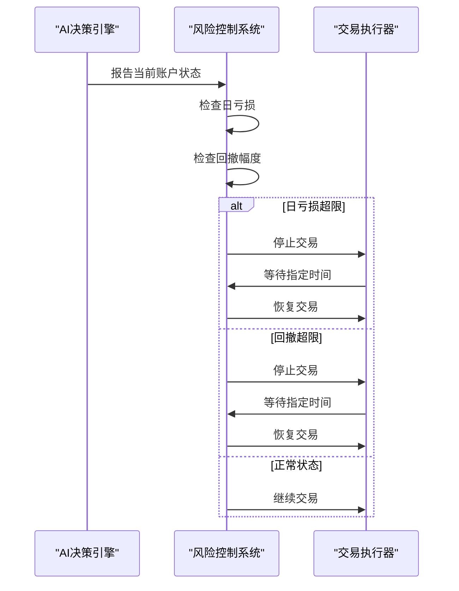

# 系统配置指南

<cite>
**本文档中引用的文件**
- [config.go](file://config/config.go)
- [config.json.example](file://config.json.example)
- [main.go](file://main.go)
- [README.zh-CN.md](file://README.zh-CN.md)
- [常见问题.md](file://常见问题.md)
</cite>

## 目录
1. [简介](#简介)
2. [配置文件结构概览](#配置文件结构概览)
3. [核心配置项详解](#核心配置项详解)
4. [traders数组配置](#traders数组配置)
5. [交易所API密钥配置](#交易所api密钥配置)
6. [AI模型API密钥配置](#ai模型api密钥配置)
7. [杠杆配置详解](#杠杆配置详解)
8. [风险控制参数](#风险控制参数)
9. [常见配置错误及解决方案](#常见配置错误及解决方案)
10. [最佳实践建议](#最佳实践建议)

## 简介

本指南基于`config.json.example`模板，详细解释了`config.json`文件的初始化与定制过程。系统通过配置文件控制多个AI交易机器人的行为，包括交易策略、风险控制、API密钥等关键参数。

## 配置文件结构概览

系统配置采用JSON格式，主要包含以下核心组件：



**图表来源**
- [config.go](file://config/config.go#L1-L50)
- [config.json.example](file://config.json.example#L1-L85)

**章节来源**
- [config.go](file://config/config.go#L1-L202)
- [config.json.example](file://config.json.example#L1-L85)

## 核心配置项详解

### 基础配置结构

系统配置的核心结构如下：

| 配置项 | 类型 | 必填 | 默认值 | 说明 |
|--------|------|------|--------|------|
| `traders` | 数组 | ✅ | - | AI交易机器人配置列表 |
| `leverage` | 对象 | ✅ | - | 杠杆配置对象 |
| `use_default_coins` | 布尔值 | ❌ | `true` | 是否使用默认币种列表 |
| `default_coins` | 字符串数组 | ❌ | 内置币种列表 | 默认交易币种 |
| `coin_pool_api_url` | 字符串 | ❌ | `""` | 自定义币种池API地址 |
| `oi_top_api_url` | 字符串 | ❌ | `""` | 持仓量API地址 |
| `api_server_port` | 整数 | ✅ | `8080` | Web仪表板端口 |
| `max_daily_loss` | 浮点数 | ✅ | `10.0` | 最大日亏损百分比 |
| `max_drawdown` | 浮点数 | ✅ | `20.0` | 最大回撤百分比 |
| `stop_trading_minutes` | 整数 | ✅ | `60` | 停止交易时间（分钟） |

### 初始资金配置

```json
{
  "initial_balance": 1000.0
}
```

- **作用**：用于盈亏计算的基础资金
- **要求**：必须大于0
- **建议**：每个账户至少500+ USDT进行测试

### 扫描间隔配置

```json
{
  "scan_interval_minutes": 3
}
```

- **作用**：AI决策执行频率
- **推荐范围**：3-5分钟（平衡性能和响应速度）
- **影响**：越短的间隔意味着更高的CPU使用率

**章节来源**
- [config.go](file://config/config.go#L10-L50)
- [config.json.example](file://config.json.example#L1-L85)

## traders数组配置

### 单个Trader配置结构

每个Trader配置包含以下核心字段：



**图表来源**
- [config.go](file://config/config.go#L10-L60)

### id字段 - 唯一标识符

```json
{
  "id": "hyperliquid_deepseek"
}
```

- **要求**：必须唯一，不能重复
- **用途**：系统内部识别和日志记录
- **命名建议**：使用描述性名称，如`"binance_qwen_main"`

### name字段 - 显示名称

```json
{
  "name": "Hyperliquid DeepSeek Trader"
}
```

- **要求**：不能为空
- **用途**：Web界面显示和日志记录
- **建议**：使用有意义的名称便于识别

### enabled字段 - 启用状态

```json
{
  "enabled": true
}
```

- **作用**：控制是否启动该交易机器人
- **默认值**：`false`（未启用）
- **使用场景**：调试或临时禁用特定交易者

### ai_model字段 - AI模型选择

支持的AI模型：
- `"qwen"` - 使用通义千问API
- `"deepseek"` - 使用DeepSeek API  
- `"custom"` - 使用自定义OpenAI兼容API

```json
{
  "ai_model": "deepseek"
}
```

**章节来源**
- [config.go](file://config/config.go#L10-L60)
- [config.json.example](file://config.json.example#L2-L40)

## 交易所API密钥配置

### 币安交易所配置

```json
{
  "exchange": "binance",
  "binance_api_key": "your_binance_api_key",
  "binance_secret_key": "your_binance_secret_key"
}
```

#### 币安API密钥获取步骤：
1. 登录币安账户
2. 进入[API管理页面](https://www.binance.com/zh-CN/my/settings/api-management)
3. 创建新API密钥
4. 设置权限：只读或交易权限
5. 复制API Key和Secret Key

#### 注意事项：
- 确保账户已启用合约交易功能
- 检查IP白名单设置
- 避免在公共环境中暴露密钥

### Hyperliquid交易所配置

```json
{
  "exchange": "hyperliquid",
  "hyperliquid_private_key": "your_ethereum_private_key_without_0x_prefix",
  "hyperliquid_wallet_addr": "your_ethereum_address",
  "hyperliquid_testnet": false
}
```

#### Hyperliquid配置要点：
- **私钥格式**：去掉`0x`前缀
- **钱包地址**：完整的以太坊地址
- **测试网**：开发阶段可设置为`true`

### Aster交易所配置

```json
{
  "exchange": "aster",
  "aster_user": "0x63DD5aCC6b1aa0f563956C0e534DD30B6dcF7C4e",
  "aster_signer": "0x21cF8Ae13Bb72632562c6Fff438652Ba1a151bb0",
  "aster_private_key": "your_aster_api_wallet_private_key_without_0x_prefix"
}
```

#### Aster API配置说明：
1. 访问[Aster Dex API网站](https://www.asterdex.com/en/api-wallet)
2. 选择专业API
3. 创建新API获取以下信息：
   - **User**：主钱包地址（登录地址）
   - **Signer**：API钱包地址（点击生成地址后生成）
   - **Private Key**：API钱包私钥

**章节来源**
- [config.go](file://config/config.go#L128-L149)
- [config.json.example](file://config.json.example#L2-L40)

## AI模型API密钥配置

### DeepSeek API配置

```json
{
  "ai_model": "deepseek",
  "deepseek_key": "your_deepseek_api_key"
}
```

#### DeepSeek API密钥获取：
1. 访问DeepSeek官网注册账号
2. 在个人中心获取API密钥
3. 确保账户有足够的余额

### Qwen API配置

```json
{
  "ai_model": "qwen",
  "qwen_key": "your_qwen_api_key"
}
```

#### Qwen API密钥获取：
1. 访问通义千问官网注册
2. 在开发者中心获取API密钥
3. 检查API配额和使用情况

### 自定义API配置

```json
{
  "ai_model": "custom",
  "custom_api_url": "https://api.openai.com/v1",
  "custom_api_key": "sk-your-api-key",
  "custom_model_name": "gpt-4o"
}
```

#### 自定义API配置要求：
- **API URL**：OpenAI兼容的API端点
- **API Key**：认证密钥
- **模型名称**：要使用的具体模型

**章节来源**
- [config.go](file://config/config.go#L128-L149)
- [config.json.example](file://config.json.example#L1-L85)

## 杠杆配置详解

### 杠杆配置结构

```json
{
  "leverage": {
    "btc_eth_leverage": 5,
    "altcoin_leverage": 5
  }
}
```

### btc_eth_leverage vs altcoin_leverage

#### BTC/ETH杠杆配置

```json
{
  "btc_eth_leverage": 5
}
```

- **BTC/ETH专用**：针对比特币和以太坊等主流加密货币
- **主账户限制**：最高50倍
- **子账户限制**：最高5倍（币安限制）
- **推荐设置**：
  - 子账户：`5`（安全）
  - 主账户保守：`10`
  - 主账户激进：`20`

#### 山寨币杠杆配置

```json
{
  "altcoin_leverage": 5
}
```

- **山寨币专用**：针对除BTC/ETH外的所有加密货币
- **主账户限制**：最高20倍
- **子账户限制**：最高5倍（币安限制）
- **推荐设置**：
  - 子账户：`5`（安全）
  - 主账户保守：`10`
  - 主账户激进：`15`

### 杠杆使用机制



**图表来源**
- [config.go](file://config/config.go#L170-L180)
- [decision/engine.go](file://decision/engine.go#L529-L586)

### 杠杆配置最佳实践

#### 子账户配置（推荐）
```json
{
  "leverage": {
    "btc_eth_leverage": 5,
    "altcoin_leverage": 5
  }
}
```

#### 主账户保守配置
```json
{
  "leverage": {
    "btc_eth_leverage": 10,
    "altcoin_leverage": 10
  }
}
```

#### 主账户激进配置
```json
{
  "leverage": {
    "btc_eth_leverage": 20,
    "altcoin_leverage": 15
  }
}
```

**章节来源**
- [config.go](file://config/config.go#L170-L180)
- [README.zh-CN.md](file://README.zh-CN.md#L678-L731)

## 风险控制参数

### max_daily_loss - 最大日亏损

```json
{
  "max_daily_loss": 10.0
}
```

#### 参数说明：
- **单位**：百分比
- **作用**：当日累计亏损达到此值时触发保护机制
- **建议设置**：
  - 新手：`5-10%`
  - 经验用户：`10-20%`
  - 高级用户：`20-30%`

### max_drawdown - 最大回撤

```json
{
  "max_drawdown": 20.0
}
```

#### 参数说明：
- **单位**：百分比
- **作用**：从峰值到最低点的跌幅达到此值时触发保护
- **建议设置**：
  - 保守策略：`15-20%`
  - 平衡策略：`20-25%`
  - 积极策略：`25-30%`

### stop_trading_minutes - 停止交易时间

```json
{
  "stop_trading_minutes": 60
}
```

#### 参数说明：
- **单位**：分钟
- **作用**：触发风险控制后的暂停交易时间
- **建议设置**：`60-120`分钟

### 风险控制工作流程



**图表来源**
- [config.go](file://config/config.go#L170-L180)

**章节来源**
- [config.go](file://config/config.go#L170-L180)
- [README.zh-CN.md](file://README.zh-CN.md#L636-L685)

## 常见配置错误及解决方案

### 1. API密钥验证错误

#### 错误信息：`invalid API key`

**可能原因**：
- API密钥格式错误
- 密钥权限不足
- IP白名单限制

**解决方案**：
1. 检查API密钥格式是否正确
2. 确认密钥具有足够的交易权限
3. 检查IP白名单设置
4. 验证密钥有效期

### 2. 杠杆配置错误

#### 错误信息：`Subaccounts are restricted from using leverage greater than 5x`

**原因**：子账户使用了超过5倍的杠杆

**解决方案**：
```json
{
  "leverage": {
    "btc_eth_leverage": 5,
    "altcoin_leverage": 5
  }
}
```

### 3. 交易所配置错误

#### 错误信息：`使用币安时必须配置binance_api_key和binance_secret_key`

**解决方案**：
```json
{
  "exchange": "binance",
  "binance_api_key": "your_valid_api_key",
  "binance_secret_key": "your_valid_secret_key"
}
```

### 4. AI模型配置错误

#### 错误信息：`使用Qwen时必须配置qwen_key`

**解决方案**：
```json
{
  "ai_model": "qwen",
  "qwen_key": "your_valid_qwen_key"
}
```

### 5. ID重复错误

#### 错误信息：`trader[0]: ID 'duplicate_id' 重复`

**解决方案**：确保每个trader的ID唯一

### 6. 初始余额错误

#### 错误信息：`trader[0]: initial_balance必须大于0`

**解决方案**：
```json
{
  "initial_balance": 1000.0
}
```

### 7. 扫描间隔错误

#### 错误信息：`trader[0]: scan_interval_minutes必须大于0`

**解决方案**：
```json
{
  "scan_interval_minutes": 3
}
```

**章节来源**
- [config.go](file://config/config.go#L140-L202)
- [常见问题.md](file://常见问题.md#L1-L25)

## 最佳实践建议

### 1. 配置文件组织

#### 推荐的配置结构
```json
{
  "traders": [...],
  "leverage": {...},
  "use_default_coins": true,
  "default_coins": [...],
  "api_server_port": 8080,
  "max_daily_loss": 10.0,
  "max_drawdown": 20.0,
  "stop_trading_minutes": 60
}
```

#### 分组原则：
- 将相似功能的trader分组
- 使用有意义的ID命名
- 合理设置风险参数

### 2. 安全配置建议

#### API密钥管理
- 使用环境变量存储敏感信息
- 定期轮换API密钥
- 设置适当的IP白名单
- 使用最小权限原则

#### 杠杆设置建议
- 子账户：始终使用5倍或更低
- 主账户保守：10-15倍
- 主账户激进：20-30倍（谨慎使用）

### 3. 测试和验证

#### 配置验证流程：
1. **语法检查**：使用JSON验证工具
2. **功能测试**：小资金测试
3. **监控观察**：持续监控表现
4. **参数优化**：根据表现调整

#### 推荐的测试顺序：
1. 单个trader测试
2. 多trader协调测试
3. 风险控制测试
4. 长期稳定性测试

### 4. 监控和维护

#### 关键监控指标：
- 账户余额变化
- 交易成功率
- 风险参数触发频率
- AI决策质量

#### 维护建议：
- 定期检查API密钥状态
- 监控市场条件变化
- 更新风险参数设置
- 保持软件版本更新

**章节来源**
- [main.go](file://main.go#L25-L140)
- [README.zh-CN.md](file://README.zh-CN.md#L630-L829)