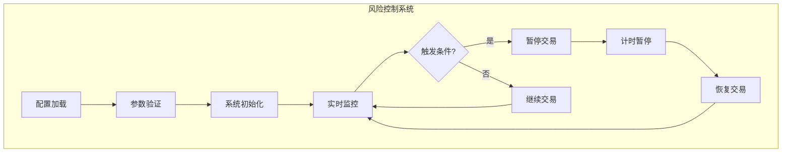
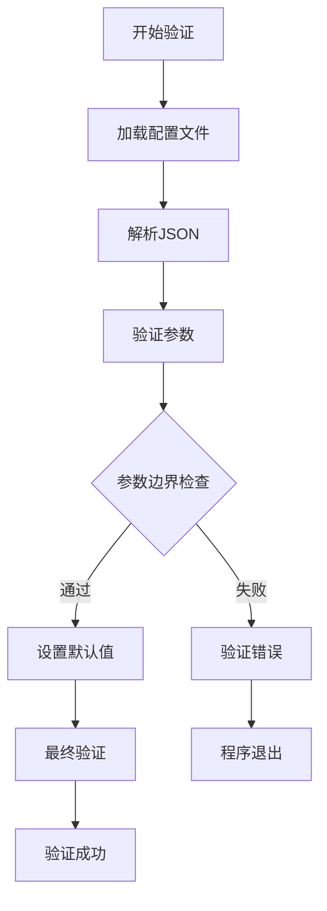
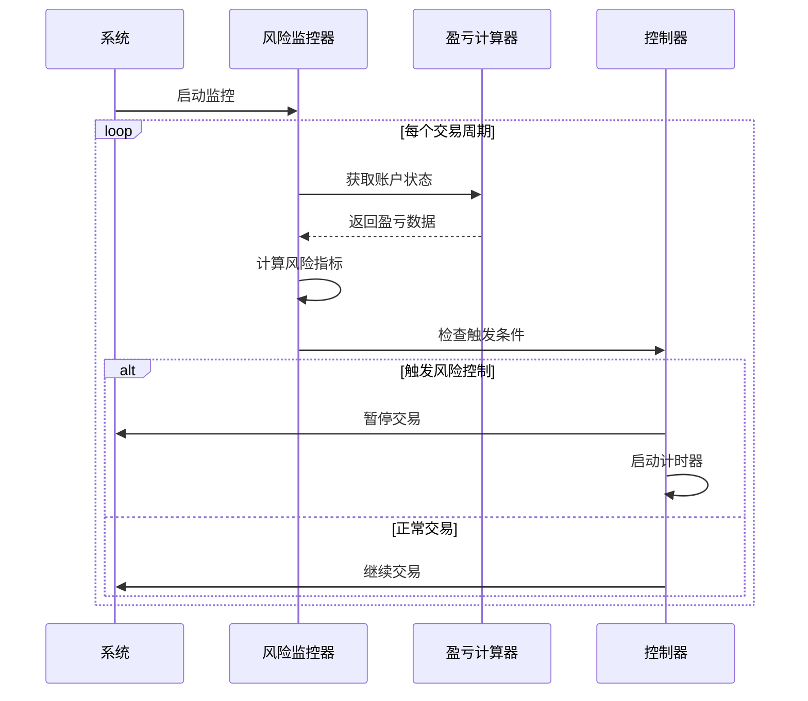

# 风险控制参数配置指南

<cite>
**本文档引用的文件**
- [config/config.go](file://config/config.go)
- [trader/auto_trader.go](file://trader/auto_trader.go)
- [manager/trader_manager.go](file://manager/trader_manager.go)
- [main.go](file://main.go)
- [decision/engine.go](file://decision/engine.go)
- [README.md](file://README.md)
</cite>

## 目录
1. [概述](#概述)
2. [核心风险控制参数](#核心风险控制参数)
3. [参数验证机制](#参数验证机制)
4. [风险控制工作流程](#风险控制工作流程)
5. [配置示例](#配置示例)
6. [参数影响分析](#参数影响分析)
7. [最佳实践建议](#最佳实践建议)
8. [故障排除](#故障排除)

## 概述

nofx系统实现了多层次的风险控制机制，通过三个核心参数`max_daily_loss`（最大日亏损）、`max_drawdown`（最大回撤）和`stop_trading_minutes`（暂停交易时长）来保护交易资金安全。这些参数在系统启动时通过配置文件加载，并在每次交易周期中实时监控和执行风险控制逻辑。



**图表来源**
- [config/config.go](file://config/config.go#L60-L65)
- [trader/auto_trader.go](file://trader/auto_trader.go#L80-L90)

## 核心风险控制参数

### max_daily_loss（最大日亏损百分比）

**参数定义：**
- 类型：`float64`
- 单位：百分比（%）
- 默认值：未设置时使用系统默认值
- 作用范围：每日累计亏损监控

**计算方式：**
系统通过跟踪每日的累计盈亏来计算`max_daily_loss`：
- 每日重置：系统会在每个自然日的凌晨重置日盈亏统计
- 累计计算：当日所有交易的盈亏累积计算
- 百分比计算：相对于初始资金的亏损百分比

**资金安全影响：**
- 当日累计亏损达到设定阈值时，系统自动暂停交易
- 防止连续亏损导致资金大幅缩水
- 为市场波动提供缓冲时间

### max_drawdown（最大回撤百分比）

**参数定义：**
- 类型：`float64`
- 单位：百分比（%）
- 默认值：未设置时使用系统默认值
- 作用范围：从峰值到谷底的最大回撤监控

**计算方式：**
系统实时监控账户净值的回撤情况：
- 峰值记录：跟踪历史最高净值
- 回撤计算：当前净值与历史峰值的差值
- 百分比计算：回撤金额相对于峰值的百分比

**资金安全影响：**
- 监控长期趋势性亏损
- 防止深度回撤导致的资金损失
- 识别潜在的市场风险周期

### stop_trading_minutes（暂停交易时长）

**参数定义：**
- 类型：`int`
- 单位：分钟
- 默认值：未设置时使用系统默认值
- 作用范围：风险触发后的暂停时长

**功能特性：**
- 风险触发后自动启动计时器
- 在指定时间内禁止新交易
- 允许系统进行风险评估和市场分析
- 支持多种暂停策略（固定时长、指数退避等）

**节源码**
- [config/config.go](file://config/config.go#L60-L65)
- [trader/auto_trader.go](file://trader/auto_trader.go#L62-L64)

## 参数验证机制

### 配置验证流程

系统在加载配置文件时会执行严格的参数验证：



**图表来源**
- [config/config.go](file://config/config.go#L75-L201)

### 边界检查规则

| 参数 | 最小值 | 最大值 | 默认值 | 验证规则 |
|------|--------|--------|--------|----------|
| `max_daily_loss` | > 0 | 无限制 | 系统默认 | 必须为正数，通常建议5-20% |
| `max_drawdown` | > 0 | 无限制 | 系统默认 | 必须为正数，通常建议10-30% |
| `stop_trading_minutes` | > 0 | 无限制 | 系统默认 | 必须为正整数，建议30-120分钟 |

### 默认值处理

系统提供了智能的默认值处理机制：
- 未配置时使用系统推荐值
- 根据交易规模和风险偏好调整
- 支持用户自定义配置覆盖

**节源码**
- [config/config.go](file://config/config.go#L75-L201)

## 风险控制工作流程

### 实时监控机制



**图表来源**
- [trader/auto_trader.go](file://trader/auto_trader.go#L215-L254)

### 触发条件判断

系统通过以下逻辑判断是否触发风险控制：

1. **日亏损检查**：比较当日累计亏损与`max_daily_loss`阈值
2. **回撤检查**：比较当前净值与历史峰值的回撤幅度
3. **暂停状态检查**：判断是否仍在暂停交易期间

### 暂停交易机制

当风险控制条件被触发时，系统执行以下操作：

1. **状态更新**：标记交易器为暂停状态
2. **计时器启动**：根据`stop_trading_minutes`设置暂停时长
3. **交易阻断**：阻止新的交易决策和执行
4. **日志记录**：记录风险事件和暂停原因

**节源码**
- [trader/auto_trader.go](file://trader/auto_trader.go#L215-L254)

## 配置示例

### 基础配置示例

```json
{
  "traders": [
    {
      "id": "qwen_trader",
      "name": "Qwen交易员",
      "enabled": true,
      "ai_model": "qwen",
      "initial_balance": 10000,
      "scan_interval_minutes": 3
    }
  ],
  "max_daily_loss": 10.0,
  "max_drawdown": 20.0,
  "stop_trading_minutes": 60,
  "leverage": {
    "btc_eth_leverage": 5,
    "altcoin_leverage": 5
  }
}
```

### 高风险偏好配置

```json
{
  "max_daily_loss": 15.0,
  "max_drawdown": 30.0,
  "stop_trading_minutes": 30
}
```

### 保守型配置

```json
{
  "max_daily_loss": 5.0,
  "max_drawdown": 15.0,
  "stop_trading_minutes": 120
}
```

### 不同场景下的配置建议

| 场景类型 | max_daily_loss | max_drawdown | stop_trading_minutes | 说明 |
|----------|----------------|--------------|---------------------|------|
| 小额测试 | 5.0 | 10.0 | 30 | 适合新手学习 |
| 中等风险 | 10.0 | 20.0 | 60 | 平衡收益和风险 |
| 高风险追求 | 15.0 | 30.0 | 30 | 追求高收益 |
| 保守稳健 | 3.0 | 8.0 | 120 | 保护本金优先 |

## 参数影响分析

### 参数设置过松的后果

**表现特征：**
- 风险控制失效
- 可能出现重大亏损
- 资金安全受到威胁

**具体影响：**
- `max_daily_loss=50.0`：允许大幅亏损，可能导致资金几乎耗尽
- `max_drawdown=50.0`：无法及时止损，可能面临深度回撤
- `stop_trading_minutes=1440`（24小时）：风险事件后长时间不交易

### 参数设置过严的后果

**表现特征：**
- 交易机会减少
- 可能错失盈利机会
- 影响整体收益率

**具体影响：**
- `max_daily_loss=1.0`：过于保守，频繁触发暂停
- `max_drawdown=5.0`：过度敏感，可能错过反弹机会
- `stop_trading_minutes=1`：几乎不停止交易，失去风险缓冲

### 推荐参数组合

**平衡型配置：**
```json
{
  "max_daily_loss": 10.0,
  "max_drawdown": 20.0,
  "stop_trading_minutes": 60
}
```

**进取型配置：**
```json
{
  "max_daily_loss": 15.0,
  "max_drawdown": 30.0,
  "stop_trading_minutes": 30
}
```

**保守型配置：**
```json
{
  "max_daily_loss": 5.0,
  "max_drawdown": 15.0,
  "stop_trading_minutes": 120
}
```

## 最佳实践建议

### 参数设置原则

1. **风险承受能力评估**
   - 根据可用资金确定合理阈值
   - 考虑个人风险偏好
   - 定期重新评估参数设置

2. **参数间协调**
   - `max_daily_loss`应小于`max_drawdown`的50%
   - 暂停时长应足以观察市场变化
   - 参数设置应考虑交易频率

3. **动态调整策略**
   - 市场波动时适当放宽参数
   - 连续盈利时可以适度收紧
   - 特殊市场环境下临时调整

### 监控和优化

**关键监控指标：**
- 风险控制触发频率
- 暂停期间的市场表现
- 参数设置的有效性

**优化建议：**
- 定期回顾风险控制效果
- 根据历史数据调整参数
- 结合其他风险管理工具

## 故障排除

### 常见问题及解决方案

**问题1：风险控制参数未生效**
- **原因**：配置文件格式错误或参数值设置不当
- **解决**：检查JSON语法，确认参数值在合理范围内

**问题2：频繁触发风险控制**
- **原因**：参数设置过于保守
- **解决**：适当提高`max_daily_loss`和`max_drawdown`阈值

**问题3：暂停交易时间过长**
- **原因**：`stop_trading_minutes`设置过大
- **解决**：根据市场特点调整暂停时长

**问题4：系统启动失败**
- **原因**：配置验证失败
- **解决**：检查所有参数的边界条件和必需字段

### 调试技巧

1. **启用详细日志**：观察风险控制相关的日志输出
2. **监控交易状态**：检查`is_running`和`stopUntil`状态
3. **分析历史数据**：回顾过去的盈亏和风险事件
4. **模拟测试**：在小资金上测试参数效果

**节源码**
- [config/config.go](file://config/config.go#L75-L201)
- [trader/auto_trader.go](file://trader/auto_trader.go#L215-L254)
- [manager/trader_manager.go](file://manager/trader_manager.go#L25-L60)