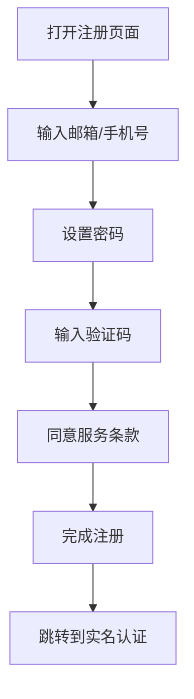
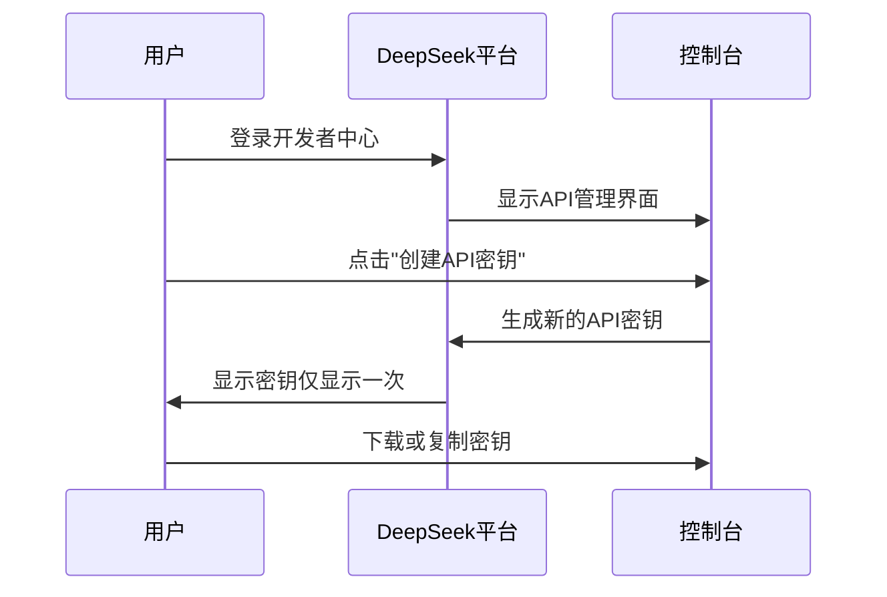
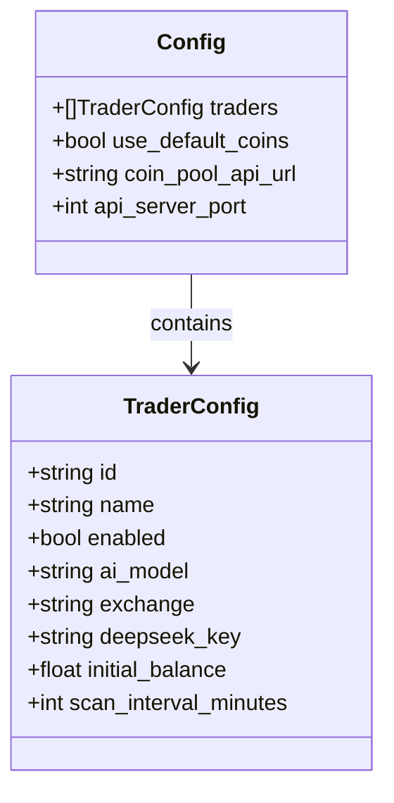
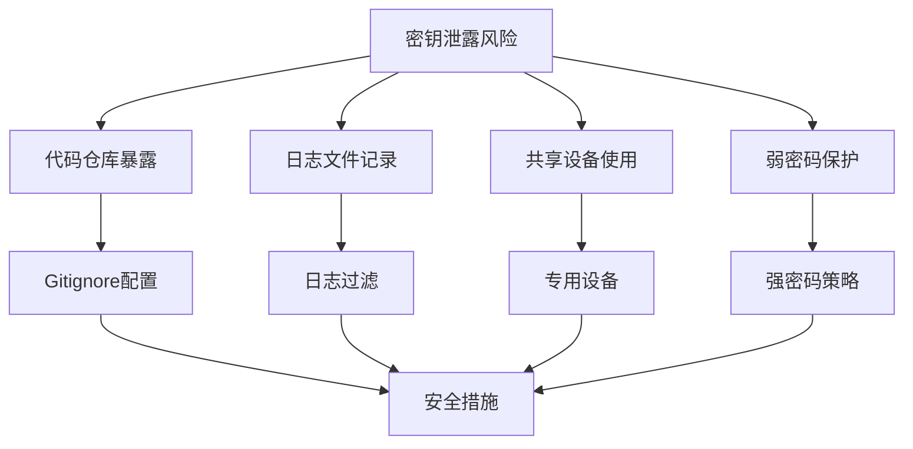
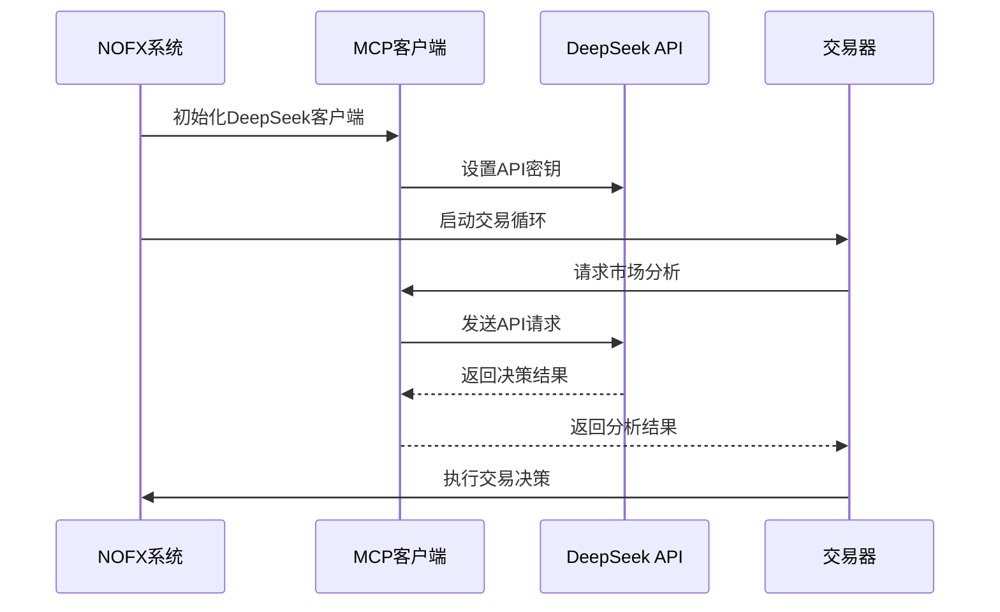
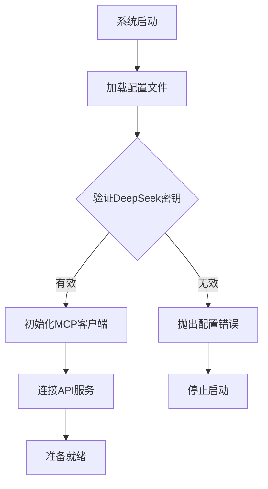

# DeepSeek API密钥获取指南

<cite>
**本文档引用的文件**
- [config.json.example](file://config.json.example)
- [config/config.go](file://config/config.go)
- [CUSTOM_API.md](file://CUSTOM_API.md)
- [README.md](file://README.md)
- [mcp/client.go](file://mcp/client.go)
- [trader/auto_trader.go](file://trader/auto_trader.go)
- [manager/trader_manager.go](file://manager/trader_manager.go)
</cite>

## 目录
1. [简介](#简介)
2. [DeepSeek官网注册流程](#deepseek官网注册流程)
3. [实名认证与充值](#实名认证与充值)
4. [API密钥创建步骤](#api密钥创建步骤)
5. [配置文件详解](#配置文件详解)
6. [密钥安全与管理](#密钥安全与管理)
7. [系统集成说明](#系统集成说明)
8. [最佳实践建议](#最佳实践建议)
9. [故障排除指南](#故障排除指南)

## 简介

DeepSeek是阿里巴巴旗下的人工智能公司开发的大规模语言模型，提供强大的AI交易决策能力。本指南将详细介绍如何获取DeepSeek API密钥，并将其正确配置到NOFX交易系统中。

### DeepSeek的核心功能
- **智能交易决策**：基于深度学习的市场分析
- **实时数据分析**：处理大量市场数据进行预测
- **风险管理**：内置风险控制机制
- **多资产支持**：支持多种加密货币交易

## DeepSeek官网注册流程

### 第一步：访问官方网站
1. 打开浏览器，访问 [platform.deepseek.com](https://platform.deepseek.com)
2. 点击页面右上角的"注册"按钮
3. 选择注册方式：
   - 邮箱注册
   - 手机号码注册
   - 社交媒体账号登录

### 第二步：填写注册信息


**图表来源**
- [README.md](file://README.md#L457-L465)

### 第三步：完善个人信息
- 填写真实姓名
- 输入身份证号码
- 上传身份证照片
- 设置支付方式

**重要提示**：确保提供的信息真实有效，这是后续充值和API使用的基础。

## 实名认证与充值

### 实名认证流程
1. 登录DeepSeek平台
2. 进入"个人中心" > "实名认证"
3. 上传身份证正反面照片
4. 视频认证（部分地区需要）
5. 等待审核（通常1-2个工作日）

### 充值方式
- **银行卡支付**：支持国内各大银行
- **支付宝**：便捷的移动支付方式
- **微信支付**：快速充值选项
- **数字货币**：支持USDT等稳定币

### 充值金额建议
- **测试环境**：建议充值$10-$50
- **正式交易**：根据交易策略确定资金量
- **预留余额**：建议保持账户有一定余额以防意外

## API密钥创建步骤

### 第一步：登录开发者平台
1. 访问 [platform.deepseek.com](https://platform.deepseek.com)
2. 使用已注册的账号登录
3. 进入"开发者中心"或"API管理"

### 第二步：创建API密钥


**图表来源**
- [mcp/client.go](file://mcp/client.go#L35-L45)

### 第三步：密钥格式说明
- **格式**：以`sk-`开头的字符串
- **长度**：通常为51字符
- **示例**：`sk-xxxxxxxxxxxxxxxxxxxxxxxxxxxxxxxxxxxxxxxxxxx`

### 第四步：权限设置
- **访问范围**：选择API的使用范围
- **调用频率**：设置每分钟最大调用次数
- **有效期**：设置密钥的有效期限

**安全提示**：不要在公共场合或代码仓库中暴露API密钥。

## 配置文件详解

### `config.json.example`中的DeepSeek配置

在配置文件中，DeepSeek密钥位于`traders`数组内的相应交易者配置中：



**图表来源**
- [config/config.go](file://config/config.go#L10-L42)

### 具体配置位置

在`config.json.example`文件中，DeepSeek密钥出现在以下位置：

1. **Hyperliquid交易者配置**：
   ```json
   {
     "id": "hyperliquid_deepseek",
     "name": "Hyperliquid DeepSeek Trader",
     "enabled": true,
     "ai_model": "deepseek",
     "exchange": "hyperliquid",
     "hyperliquid_private_key": "your_ethereum_private_key_without_0x_prefix",
     "hyperliquid_wallet_addr": "your_ethereum_address",
     "hyperliquid_testnet": false,
     "deepseek_key": "your_deepseek_api_key",
     "initial_balance": 1000,
     "scan_interval_minutes": 3
   }
   ```

2. **Aster交易者配置**：
   ```json
   {
     "id": "aster_deepseek",
     "name": "Aster DeepSeek Trader",
     "enabled": true,
     "ai_model": "deepseek",
     "exchange": "aster",
     "aster_user": "0x63DD5aCC6b1aa0f563956C0e534DD30B6dcF7C4e",
     "aster_signer": "0x21cF8Ae13Bb72632562c6Fff438652Ba1a151bb0",
     "aster_private_key": "your_aster_api_wallet_private_key_without_0x_prefix",
     "deepseek_key": "your_deepseek_api_key",
     "initial_balance": 1000.0,
     "scan_interval_minutes": 3
   }
   ```

### 配置字段说明

| 字段 | 类型 | 必需 | 说明 |
|------|------|------|------|
| `id` | string | ✅ | 交易者的唯一标识符 |
| `name` | string | ✅ | 交易者的显示名称 |
| `enabled` | boolean | ✅ | 是否启用该交易者 |
| `ai_model` | string | ✅ | AI提供商类型，此处为"deepseek" |
| `exchange` | string | ✅ | 交易平台，如"binance"、"hyperliquid"、"aster" |
| `deepseek_key` | string | ✅ | DeepSeek API密钥，以"sk-"开头 |
| `initial_balance` | float | ✅ | 初始资金余额 |
| `scan_interval_minutes` | integer | ✅ | 扫描间隔时间（分钟） |

**节来源**
- [config.json.example](file://config.json.example#L1-L40)
- [config/config.go](file://config/config.go#L35)

## 密钥安全与管理

### 安全存储原则
1. **本地存储**：将配置文件保存在本地服务器
2. **权限控制**：设置适当的文件权限（600或400）
3. **环境变量**：考虑使用环境变量存储敏感信息
4. **定期轮换**：定期更换API密钥

### 密钥泄露防范


### 最佳安全实践
- **最小权限原则**：只授予必要的API权限
- **监控使用情况**：定期检查API调用记录
- **紧急应对**：准备密钥替换流程
- **备份策略**：安全备份配置文件

**节来源**
- [mcp/client.go](file://mcp/client.go#L70-L85)

## 系统集成说明

### DeepSeek在NOFX中的作用

DeepSeek API密钥主要用于调用AI模型进行交易决策：



**图表来源**
- [mcp/client.go](file://mcp/client.go#L156-L205)
- [trader/auto_trader.go](file://trader/auto_trader.go#L87-L133)

### 集成验证流程

系统启动时会验证DeepSeek密钥的有效性：



**图表来源**
- [config/config.go](file://config/config.go#L155-L157)

**节来源**
- [config/config.go](file://config/config.go#L155-L157)
- [manager/trader_manager.go](file://manager/trader_manager.go#L29-L61)

## 最佳实践建议

### 扫描间隔优化

合理设置`scan_interval_minutes`参数对控制API调用频率至关重要：

| 间隔时间 | 适用场景 | 成本估算 |
|----------|----------|----------|
| 1-2分钟 | 高频交易策略 | 较高成本 |
| 3-5分钟 | 标准交易策略 | 中等成本 |
| 5-10分钟 | 长线投资策略 | 较低成本 |

### 费用控制策略
1. **监控API使用量**：定期检查调用次数
2. **优化请求内容**：减少不必要的数据传输
3. **批量处理**：合并相似请求
4. **缓存机制**：利用系统缓存减少重复调用

### 性能调优
- **超时设置**：默认120秒，可根据网络状况调整
- **重试机制**：系统自动处理临时失败
- **并发控制**：避免过多并发请求

**节来源**
- [config/config.go](file://config/config.go#L195-L201)
- [CUSTOM_API.md](file://CUSTOM_API.md#L126-L159)

## 故障排除指南

### 常见问题及解决方案

#### 1. API密钥验证失败
**错误信息**：`使用DeepSeek时必须配置deepseek_key`

**解决方法**：
- 检查密钥格式是否正确（以"sk-"开头）
- 确认密钥未被复制错误
- 验证密钥是否已过期

#### 2. API调用超时
**错误信息**：`发送请求失败: timeout`

**解决方法**：
- 增加超时时间设置
- 检查网络连接稳定性
- 考虑地理位置因素

#### 3. 频率限制错误
**错误信息**：`API请求过于频繁`

**解决方法**：
- 增加扫描间隔时间
- 优化请求逻辑
- 考虑升级API套餐

### 调试技巧
1. **启用详细日志**：查看完整的错误信息
2. **测试API连通性**：使用curl命令测试
3. **检查网络代理**：确保无网络限制
4. **验证配置格式**：确认JSON语法正确

### 支持资源
- **官方文档**：[DeepSeek开发者文档](https://platform.deepseek.com/docs)
- **技术支持**：联系DeepSeek客服团队
- **社区论坛**：参与用户交流讨论

**节来源**
- [mcp/client.go](file://mcp/client.go#L203-L245)
- [CUSTOM_API.md](file://CUSTOM_API.md#L159-L205)

## 总结

通过本指南，您应该能够：
1. 成功注册并激活DeepSeek账号
2. 完成实名认证和账户充值
3. 正确获取和配置API密钥
4. 理解密钥的安全管理和最佳实践
5. 掌握系统集成和故障排除技巧

记住，API密钥是访问DeepSeek服务的关键凭证，请务必妥善保管，避免泄露给第三方。定期检查使用情况，合理控制调用频率，以获得最佳的交易效果和成本效益。