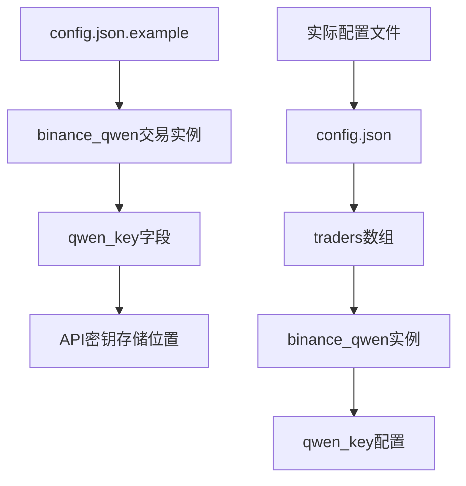
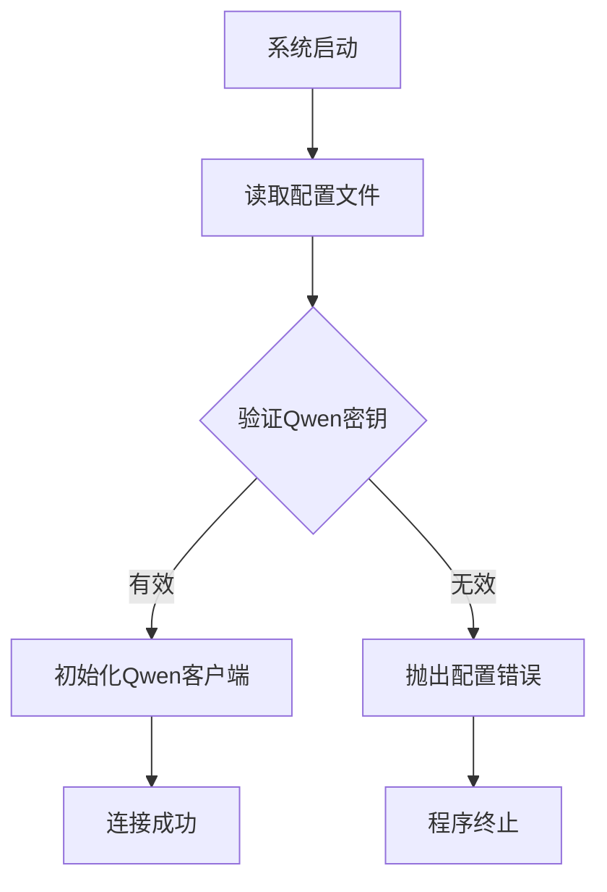
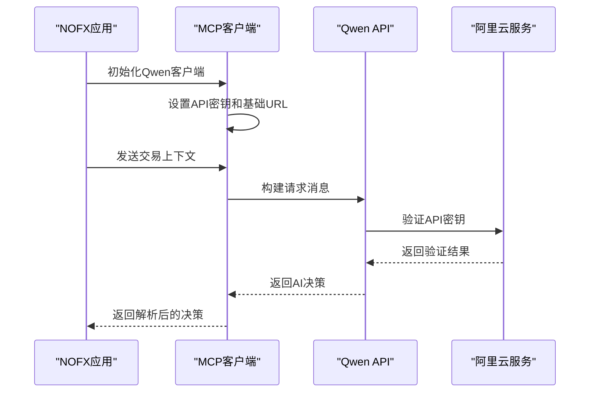
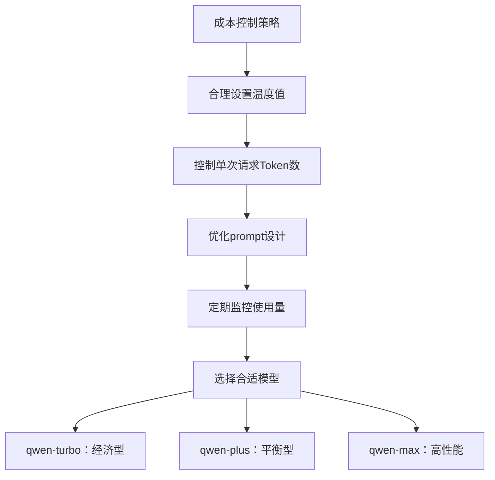
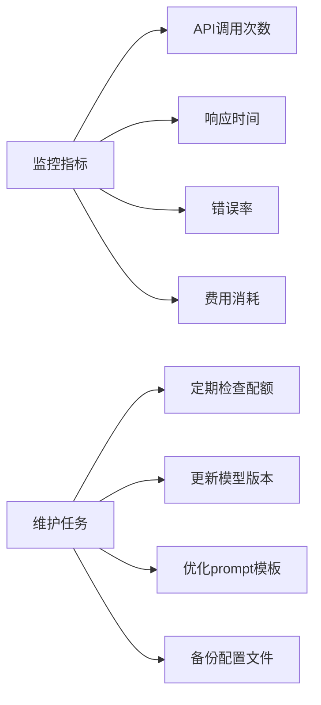

# Qwen（通义千问）API密钥获取指南

<cite>
**本文档引用的文件**
- [config.json.example](file://config.json.example)
- [config/config.go](file://config/config.go)
- [mcp/client.go](file://mcp/client.go)
- [auto_trader.go](file://trader/auto_trader.go)
- [CUSTOM_API.md](file://CUSTOM_API.md)
- [README.md](file://README.md)
</cite>

## 目录
1. [简介](#简介)
2. [阿里云平台注册与开通](#阿里云平台注册与开通)
3. [Qwen API密钥创建流程](#qwen-api密钥创建流程)
4. [配置文件设置](#配置文件设置)
5. [系统集成原理](#系统集成原理)
6. [服务计费与配额管理](#服务计费与配额管理)
7. [最佳实践与安全建议](#最佳实践与安全建议)
8. [故障排除指南](#故障排除指南)

## 简介

Qwen（通义千问）是阿里巴巴集团旗下的超大规模语言模型，为NOFX交易系统提供了强大的AI决策能力。本指南将详细说明如何在阿里云平台上获取Qwen API密钥，并将其正确配置到NOFX系统中。

### Qwen在NOFX中的作用

Qwen作为NOFX的核心AI引擎之一，负责：
- **市场分析**：实时分析加密货币市场趋势和技术指标
- **交易决策**：基于历史数据和当前市场状况生成交易策略
- **风险管理**：评估潜在风险并制定相应的止损止盈策略
- **仓位管理**：确定最优的仓位大小和杠杆倍数

## 阿里云平台注册与开通

### 注册阿里云账号

1. **访问阿里云官网**
   - 打开浏览器访问 [https://www.aliyun.com](https://www.aliyun.com)
   - 点击右上角"登录"按钮

2. **完成注册流程**
   - 选择手机号注册（可能需要中国手机号验证）
   - 完成短信验证码验证
   - 填写个人信息并完成实名认证

3. **账户激活**
   - 登录阿里云控制台
   - 完成邮箱验证
   - 设置安全问题

### 开通DashScope服务

1. **访问DashScope控制台**
   - 在阿里云控制台搜索"DashScope"
   - 进入DashScope服务页面

2. **服务开通**
   - 点击"立即开通"
   - 选择合适的套餐（免费版即可开始使用）
   - 阅读并同意服务协议

3. **服务激活**
   - 等待服务激活完成
   - 确认服务状态为"已激活"

## Qwen API密钥创建流程

### 进入API管理界面

1. **导航到API Key管理**
   - 在DashScope控制台左侧菜单选择"API Key管理"
   - 点击"创建API Key"按钮

2. **配置API密钥**
   - 输入密钥名称（如：NOFX_Trading_Key）
   - 选择密钥类型（推荐选择"API Key"）
   - 设置过期时间（建议设置为"永久有效"）

3. **复制并保存密钥**
   ```json
   {
     "qwen_key": "sk-xxxxxxxxxxxxxxxxxxxxxxxxxxxxxxxx"
   }
   ```

### 密钥格式说明

- **格式**：以`sk-`开头的字符串
- **长度**：通常为32位字符
- **安全性**：请妥善保管，不要泄露给他人

## 配置文件设置

### 定位配置文件

在NOFX项目中，Qwen API密钥的配置位于`config.json.example`文件中：



**图表来源**
- [config.json.example](file://config.json.example#L23-L25)

### 修改配置文件

#### 1. 复制配置模板

```bash
cp config.json.example config.json
```

#### 2. 编辑配置文件

打开`config.json`文件，找到Qwen交易实例的配置部分：

```json
{
  "id": "binance_qwen",
  "name": "Binance Qwen Trader",
  "enabled": true,
  "ai_model": "qwen",
  "exchange": "binance",
  "binance_api_key": "your_binance_api_key",
  "binance_secret_key": "your_binance_secret_key",
  "qwen_key": "your_qwen_api_key",
  "initial_balance": 1000,
  "scan_interval_minutes": 3
}
```

#### 3. 填写Qwen API密钥

将您的Qwen API密钥替换到相应位置：

```json
{
  "id": "binance_qwen",
  "name": "Binance Qwen Trader",
  "enabled": true,
  "ai_model": "qwen",
  "exchange": "binance",
  "binance_api_key": "你的币安API密钥",
  "binance_secret_key": "你的币安Secret密钥",
  "qwen_key": "sk-xxxxxxxxxxxxxxxxxxxxxxxxxxxxxxxx",
  "initial_balance": 1000,
  "scan_interval_minutes": 3
}
```

### 配置验证

系统会在启动时验证配置的有效性：



**图表来源**
- [config/config.go](file://config/config.go#L150-L155)

**章节来源**
- [config.json.example](file://config.json.example#L23-L25)
- [config/config.go](file://config/config.go#L34-L35)

## 系统集成原理

### MCP客户端架构

NOFX使用Model Context Protocol (MCP)客户端与Qwen进行通信：



**图表来源**
- [mcp/client.go](file://mcp/client.go#L40-L50)
- [auto_trader.go](file://trader/auto_trader.go#L95-L100)

### API调用流程

1. **客户端初始化**
   - 设置Provider为"qwen"
   - 配置BaseURL为`https://dashscope.aliyuncs.com/compatible-mode/v1`
   - 设置模型为"qwen-plus"（可选）

2. **请求构建**
   - 包含system prompt和user prompt
   - 设置temperature=0.5确保输出稳定性
   - 限制max_tokens=2000

3. **认证机制**
   - 使用Bearer Token认证
   - Authorization头格式：`Bearer sk-xxxxxxxxxxxxxx`

### 交易决策生成

Qwen通过分析以下信息生成交易决策：

| 数据类型 | 描述 | 用途 |
|---------|------|------|
| 市场数据 | K线图、技术指标 | 分析市场趋势 |
| 账户信息 | 资产净值、可用余额 | 控制仓位大小 |
| 持仓情况 | 当前持仓、盈亏情况 | 决定平仓时机 |
| 历史表现 | 过去100个交易周期 | 学习交易模式 |

**章节来源**
- [mcp/client.go](file://mcp/client.go#L40-L50)
- [auto_trader.go](file://trader/auto_trader.go#L95-L100)

## 服务计费与配额管理

### 计费模式

阿里云Qwen API采用按调用次数计费的方式：

| 计费项 | 单价 | 说明 |
|--------|------|------|
| 输入Token | $0.000014 | 每百万个Token |
| 输出Token | $0.000028 | 每百万个Token |
| 日调用上限 | 无限制 | 根据账户额度 |
| 并发限制 | 10次/秒 | 默认限制 |

### 配额管理

1. **免费额度**
   - 新用户享有一定的免费额度
   - 适合学习和小规模测试

2. **付费升级**
   - 根据使用量选择合适套餐
   - 支持按需扩容

3. **监控使用**
   - 定期检查API调用统计
   - 设置使用预警

### 成本控制建议



## 最佳实践与安全建议

### 密钥安全管理

1. **密钥存储**
   - 不要将密钥硬编码在源代码中
   - 使用环境变量或配置文件
   - 设置适当的文件权限

2. **密钥轮换**
   - 定期更换API密钥
   - 建立密钥更新流程
   - 保留旧密钥一段时间用于过渡

3. **访问控制**
   - 限制密钥使用范围
   - 监控异常使用行为
   - 设置使用频率限制

### 性能优化

1. **请求优化**
   - 合并相似请求
   - 使用缓存减少重复调用
   - 优化prompt内容

2. **错误处理**
   - 实现重试机制
   - 设置合理的超时时间
   - 记录详细的错误日志

### 监控与维护



**章节来源**
- [mcp/client.go](file://mcp/client.go#L80-L110)

## 故障排除指南

### 常见问题及解决方案

#### 1. API密钥验证失败

**错误信息**：`invalid API key`

**解决步骤**：
1. 检查密钥格式是否正确（以sk-开头）
2. 确认密钥未过期
3. 验证DashScope服务是否已开通
4. 检查网络连接

#### 2. 配置文件格式错误

**错误信息**：`parse config failed`

**解决步骤**：
1. 检查JSON语法是否正确
2. 确保所有必需字段都已填写
3. 验证引号使用是否正确

#### 3. 网络连接问题

**错误信息**：`connection timeout`

**解决步骤**：
1. 检查网络连接状态
2. 验证防火墙设置
3. 尝试使用代理服务器

### 调试技巧

1. **启用详细日志**
   ```bash
   export DEBUG=true
   ./nofx
   ```

2. **测试API连通性**
   ```bash
   curl -H "Authorization: Bearer YOUR_QWEN_KEY" \
        https://dashscope.aliyuncs.com/compatible-mode/v1/chat/completions
   ```

3. **检查配置加载**
   - 查看系统启动日志
   - 验证密钥是否正确加载
   - 确认AI模型初始化成功

### 技术支持资源

- **阿里云技术支持**：[阿里云帮助中心](https://help.aliyun.com)
- **NOFX社区**：[Telegram开发者社区](https://t.me/nofx_dev_community)
- **官方文档**：[NOFX GitHub仓库](https://github.com/tinkle-community/nofx)

**章节来源**
- [mcp/client.go](file://mcp/client.go#L80-L110)
- [config/config.go](file://config/config.go#L150-L155)

## 总结

通过本指南，您已经掌握了在阿里云平台上获取和配置Qwen API密钥的完整流程。正确配置Qwen API密钥是使用NOFX进行智能交易的基础，它将为您的交易系统提供强大的AI决策支持。

记住要定期监控API使用情况，合理控制成本，并遵循最佳安全实践来保护您的API密钥。随着您对系统的深入了解，您可以进一步优化配置，获得更好的交易效果。

如果您在配置过程中遇到任何问题，欢迎参考故障排除指南或寻求社区支持。祝您在使用Qwen进行智能交易的过程中取得优异的成果！