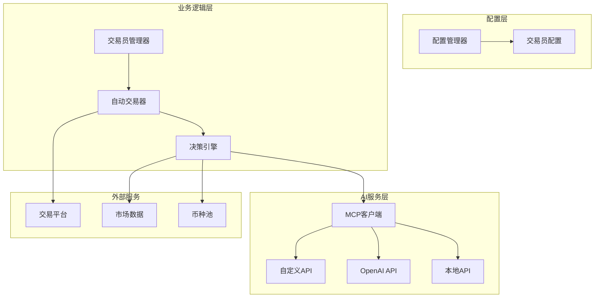
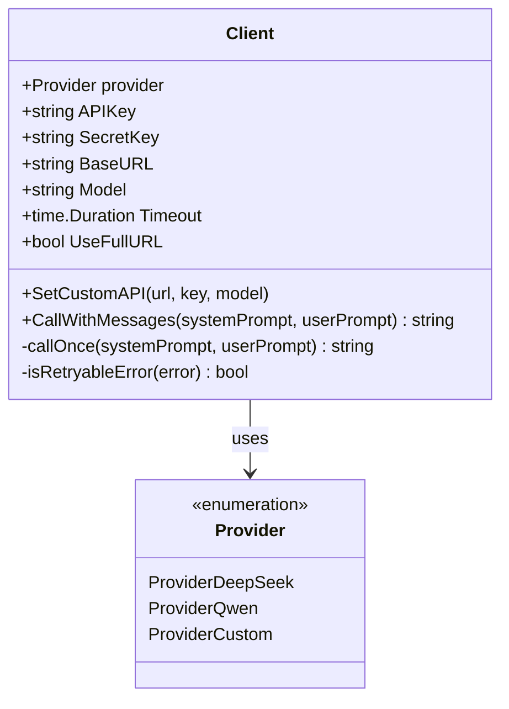
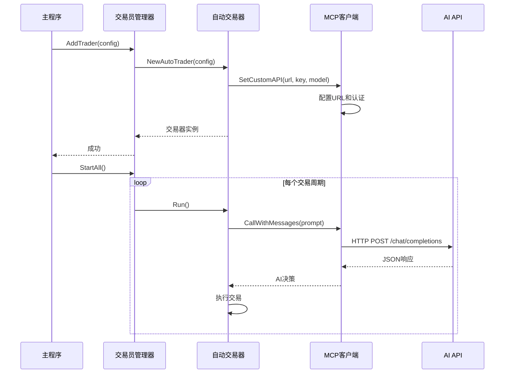
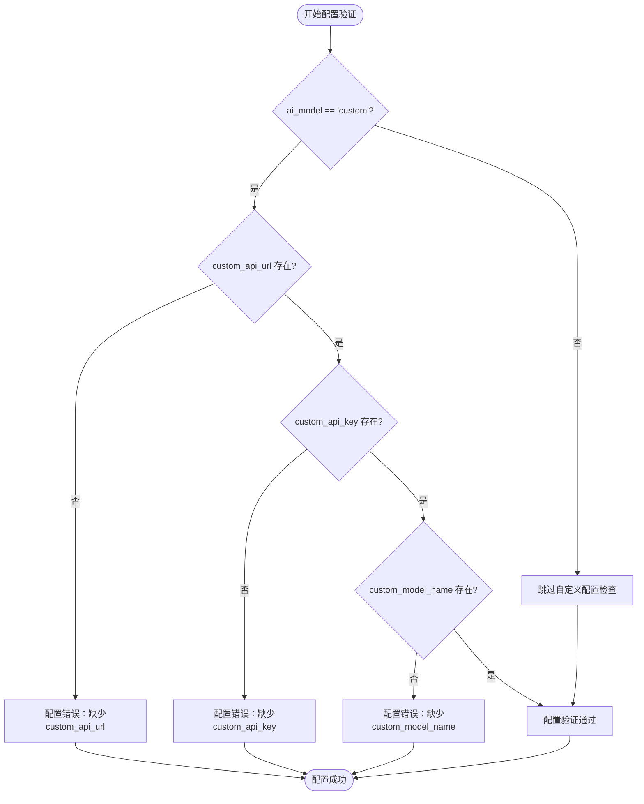
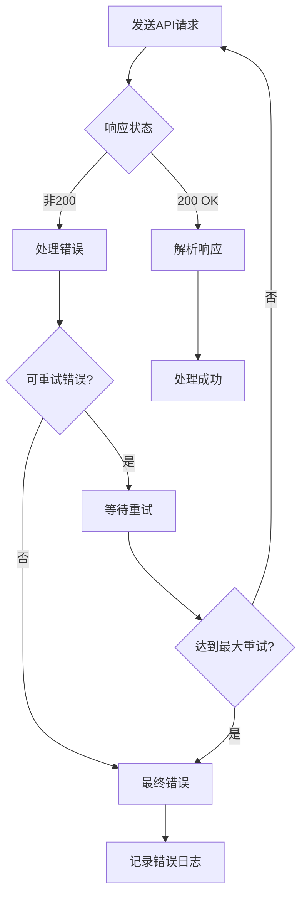
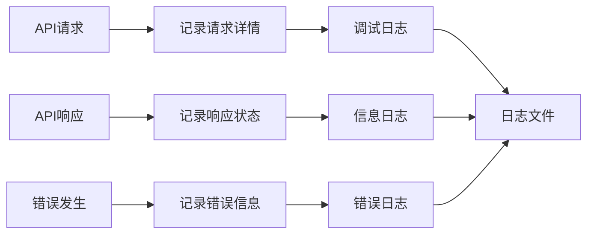

# 自定义AI API集成配置

<cite>
**本文档引用的文件**
- [CUSTOM_API.md](file://CUSTOM_API.md)
- [config/config.go](file://config/config.go)
- [mcp/client.go](file://mcp/client.go)
- [manager/trader_manager.go](file://manager/trader_manager.go)
- [trader/auto_trader.go](file://trader/auto_trader.go)
- [decision/engine.go](file://decision/engine.go)
- [main.go](file://main.go)
</cite>

## 目录
1. [简介](#简介)
2. [项目架构概览](#项目架构概览)
3. [核心组件分析](#核心组件分析)
4. [配置详解](#配置详解)
5. [使用场景与示例](#使用场景与示例)
6. [兼容性要求](#兼容性要求)
7. [故障排除指南](#故障排除指南)
8. [最佳实践](#最佳实践)
9. [总结](#总结)

## 简介

NOFX系统现在支持使用任何OpenAI格式兼容的API，为用户提供灵活的AI模型选择能力。通过配置`ai_model`为`custom`，用户可以接入各种第三方AI服务，包括OpenAI官方API、OpenRouter、本地部署的模型（如Ollama）、Azure OpenAI等。

这种设计使得系统能够适应不同的使用场景和需求，无论是追求高性能的云端服务还是注重隐私的本地部署，都能找到合适的解决方案。

## 项目架构概览

NOFX采用模块化架构设计，主要包含以下核心模块：



**图表来源**
- [config/config.go](file://config/config.go#L1-L50)
- [manager/trader_manager.go](file://manager/trader_manager.go#L1-L30)
- [trader/auto_trader.go](file://trader/auto_trader.go#L1-L50)

**章节来源**
- [main.go](file://main.go#L1-L140)
- [config/config.go](file://config/config.go#L1-L202)

## 核心组件分析

### MCP客户端 - AI通信桥梁

MCP（Model Communication Protocol）客户端是系统与各种AI服务之间的通信桥梁，负责处理API请求和响应。



**图表来源**
- [mcp/client.go](file://mcp/client.go#L15-L35)

### 交易员管理器 - 统一管理

交易员管理器负责创建、管理和协调多个交易员实例，支持不同类型的AI模型。



**图表来源**
- [manager/trader_manager.go](file://manager/trader_manager.go#L20-L60)
- [trader/auto_trader.go](file://trader/auto_trader.go#L100-L150)

**章节来源**
- [mcp/client.go](file://mcp/client.go#L1-L247)
- [manager/trader_manager.go](file://manager/trader_manager.go#L1-L173)

## 配置详解

### 基本配置结构

自定义AI API的配置需要在`config.json`文件中进行设置，主要涉及四个关键字段：

| 字段名 | 类型 | 必需 | 说明 |
|--------|------|------|------|
| `ai_model` | string | ✅ | 设置为 `"custom"` 启用自定义API |
| `custom_api_url` | string | ✅ | API的基础URL（不含`/chat/completions`） |
| `custom_api_key` | string | ✅ | API密钥 |
| `custom_model_name` | string | ✅ | 模型名称（如`gpt-4o`、`claude-3.5-sonnet`等） |

### URL特殊用法

系统提供了两种URL配置模式：

1. **标准模式**：系统自动添加`/chat/completions`路径
   ```json
   {
     "custom_api_url": "https://api.openai.com/v1"
   }
   ```
   实际请求路径：`https://api.openai.com/v1/chat/completions`

2. **完整路径模式**：在URL末尾添加`#`，使用完整自定义路径
   ```json
   {
     "custom_api_url": "https://api.example.com/v2/ai/chat/completions#"
   }
   ```
   实际请求路径：`https://api.example.com/v2/ai/chat/completions`

### 配置验证机制

系统在启动时会对配置进行严格验证：



**图表来源**
- [config/config.go](file://config/config.go#L150-L180)

**章节来源**
- [config/config.go](file://config/config.go#L150-L202)
- [CUSTOM_API.md](file://CUSTOM_API.md#L15-L30)

## 使用场景与示例

### 1. OpenAI官方API

适用于需要使用最新OpenAI模型的用户：

```json
{
  "id": "openai_trader",
  "name": "OpenAI Trader",
  "ai_model": "custom",
  "exchange": "binance",
  "custom_api_url": "https://api.openai.com/v1",
  "custom_api_key": "sk-your-openai-api-key",
  "custom_model_name": "gpt-4o",
  "initial_balance": 1000,
  "scan_interval_minutes": 3
}
```

### 2. OpenRouter多模型访问

OpenRouter提供了访问多种AI模型的统一接口：

```json
{
  "id": "openrouter_trader",
  "name": "OpenRouter Trader",
  "ai_model": "custom",
  "exchange": "binance",
  "custom_api_url": "https://openrouter.ai/api/v1",
  "custom_api_key": "sk-or-xxxxx",
  "custom_model_name": "anthropic/claude-3.5-sonnet",
  "initial_balance": 1000,
  "scan_interval_minutes": 3
}
```

### 3. 本地Ollama部署

适合注重隐私和成本控制的用户：

```json
{
  "id": "ollama_trader",
  "name": "Local Ollama Trader",
  "ai_model": "custom",
  "exchange": "binance",
  "custom_api_url": "http://localhost:11434/v1",
  "custom_api_key": "ollama",
  "custom_model_name": "llama3.1:70b",
  "initial_balance": 1000,
  "scan_interval_minutes": 3
}
```

### 4. Azure OpenAI

企业级部署选项，支持私有化部署：

```json
{
  "id": "azure_trader",
  "name": "Azure OpenAI Trader",
  "ai_model": "custom",
  "exchange": "binance",
  "custom_api_url": "https://your-resource.openai.azure.com/openai/deployments/your-deployment",
  "custom_api_key": "your-azure-api-key",
  "custom_model_name": "gpt-4",
  "initial_balance": 1000,
  "scan_interval_minutes": 3
}
```

### 5. 多AI对比交易

系统支持同时配置多个不同AI的交易员进行对比：

```json
{
  "traders": [
    {
      "id": "deepseek_trader",
      "ai_model": "deepseek",
      "deepseek_key": "sk-xxxxx"
    },
    {
      "id": "gpt4_trader",
      "ai_model": "custom",
      "custom_api_url": "https://api.openai.com/v1",
      "custom_api_key": "sk-xxxxx",
      "custom_model_name": "gpt-4o"
    },
    {
      "id": "claude_trader",
      "ai_model": "custom",
      "custom_api_url": "https://openrouter.ai/api/v1",
      "custom_api_key": "sk-or-xxxxx",
      "custom_model_name": "anthropic/claude-3.5-sonnet"
    }
  ]
}
```

**章节来源**
- [CUSTOM_API.md](file://CUSTOM_API.md#L35-L120)

## 兼容性要求

### API格式要求

自定义API必须满足以下兼容性要求：

1. **Chat Completions接口**：支持`POST`请求到`/chat/completions`端点
2. **认证方式**：支持`Authorization: Bearer {api_key}`头部认证
3. **请求格式**：接受标准的OpenAI格式请求体
4. **响应格式**：返回标准的OpenAI格式JSON响应

### 请求格式规范

系统发送的标准请求格式如下：

```json
{
  "model": "gpt-4o",
  "messages": [
    {
      "role": "system",
      "content": "系统提示词..."
    },
    {
      "role": "user", 
      "content": "用户提示词..."
    }
  ],
  "temperature": 0.5,
  "max_tokens": 2000
}
```

### 响应格式规范

系统期望的标准响应格式：

```json
{
  "choices": [
    {
      "message": {
        "content": "AI返回的决策内容"
      }
    }
  ]
}
```

### 错误处理机制

系统实现了完善的错误处理和重试机制：



**图表来源**
- [mcp/client.go](file://mcp/client.go#L80-L120)

**章节来源**
- [CUSTOM_API.md](file://CUSTOM_API.md#L109-L126)
- [mcp/client.go](file://mcp/client.go#L220-L247)

## 故障排除指南

### 常见问题及解决方案

#### 1. 配置验证失败

**错误信息**：`使用自定义API时必须配置custom_api_url`

**解决方案**：
- 确保`ai_model`设置为`"custom"`
- 检查`custom_api_url`、`custom_api_key`和`custom_model_name`都已正确配置
- 验证配置文件格式正确，无语法错误

#### 2. API调用失败

**可能原因**：
- **URL格式错误**：不要在URL中包含`/chat/completions`，系统会自动添加
- **API密钥无效**：检查密钥是否正确，是否有权限访问
- **模型名称错误**：确保模型名称与API提供商支持的名称完全一致
- **网络连接问题**：检查网络连接和防火墙设置

**调试方法**：
1. 查看详细的错误日志，通常包含HTTP状态码和错误详情
2. 使用curl命令手动测试API调用
3. 检查API提供商的状态页面

#### 3. 超时问题

**默认超时时间**：120秒

**解决方案**：
- 对于响应较慢的本地模型，考虑增加超时时间
- 检查网络延迟和带宽
- 优化模型性能或选择更快的API服务

#### 4. 认证失败

**常见原因**：
- API密钥格式错误
- 密钥权限不足
- 认证头部格式不正确

**解决步骤**：
1. 验证API密钥的有效性
2. 检查密钥是否具有必要的权限
3. 确认认证头部格式正确

### 日志分析

系统提供了详细的日志记录功能，帮助诊断问题：



**图表来源**
- [mcp/client.go](file://mcp/client.go#L85-L100)

**章节来源**
- [CUSTOM_API.md](file://CUSTOM_API.md#L160-L205)
- [mcp/client.go](file://mcp/client.go#L220-L247)

## 最佳实践

### 1. 配置管理

- **环境变量**：敏感信息如API密钥建议使用环境变量而非硬编码
- **配置备份**：定期备份配置文件
- **版本控制**：对配置文件进行版本控制，便于追踪变更

### 2. 性能优化

- **合理设置扫描间隔**：根据市场波动情况调整扫描频率
- **超时设置**：根据API响应时间调整超时参数
- **并发控制**：避免过多并发请求导致API限流

### 3. 安全考虑

- **密钥管理**：使用专用的密钥管理服务
- **网络隔离**：在安全的网络环境中运行系统
- **访问控制**：限制对配置文件的访问权限

### 4. 监控和维护

- **健康检查**：定期检查API可用性和响应时间
- **错误监控**：建立错误报警机制
- **性能监控**：跟踪交易成功率和响应时间

### 5. 多环境部署

- **开发环境**：使用测试API密钥
- **生产环境**：使用正式API密钥
- **配置分离**：不同环境使用不同的配置文件

## 总结

NOFX系统的自定义AI API集成功能提供了强大而灵活的AI模型接入能力。通过标准化的配置接口，用户可以轻松地在各种AI服务之间切换，满足不同的业务需求和技术要求。

### 关键特性

1. **广泛的兼容性**：支持OpenAI格式的所有兼容API
2. **灵活的配置**：支持标准和自定义路径两种URL配置模式
3. **强大的错误处理**：内置重试机制和完善的错误恢复
4. **多AI对比**：支持同时运行多个不同AI的交易员
5. **易于扩展**：模块化设计便于添加新的AI服务支持

### 适用场景

- **研究和实验**：快速尝试不同的AI模型
- **成本控制**：使用本地部署降低成本
- **隐私保护**：使用私有化部署保护数据安全
- **性能优化**：选择最适合特定任务的模型
- **多策略对比**：同时测试不同的交易策略

通过合理的配置和使用，自定义AI API功能能够显著提升NOFX系统的应用价值和灵活性，为用户提供更加个性化和高效的交易体验。