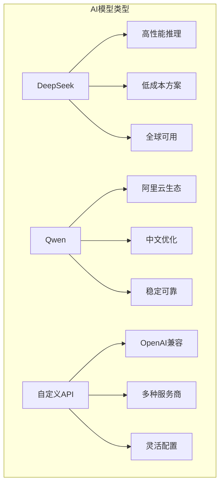
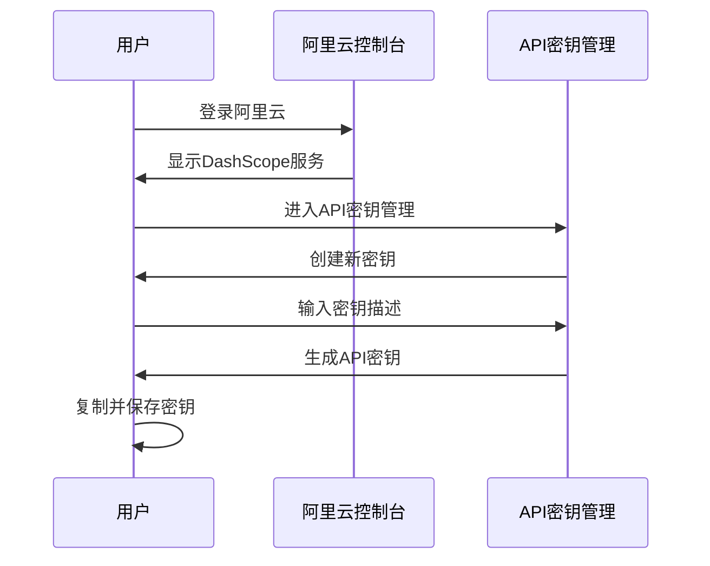
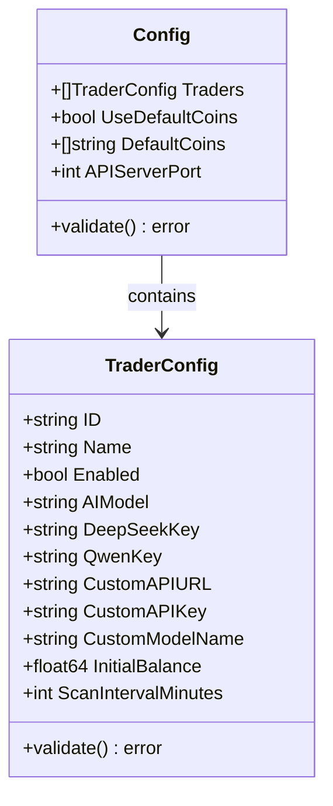
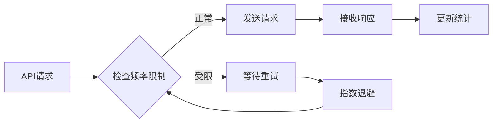
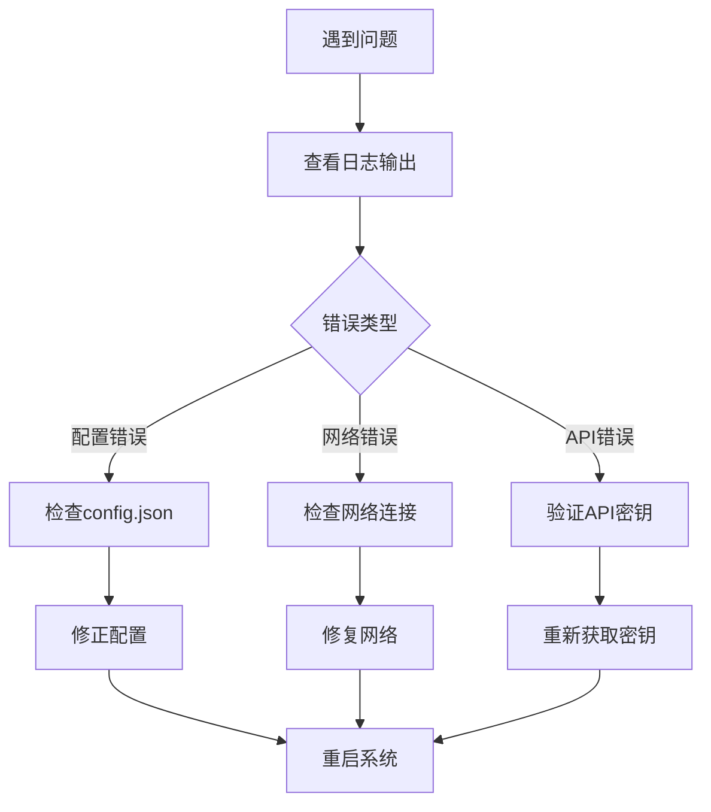

# 获取AI API密钥

<cite>
**本文档引用的文件**
- [CUSTOM_API.md](file://CUSTOM_API.md)
- [config/config.go](file://config/config.go)
- [config.json.example](file://config.json.example)
- [mcp/client.go](file://mcp/client.go)
- [README.md](file://README.md)
- [常见问题.md](file://常见问题.md)
</cite>

## 目录
1. [简介](#简介)
2. [支持的AI模型](#支持的ai模型)
3. [DeepSeek API密钥获取指南](#deepseek-api密钥获取指南)
4. [Qwen（通义千问）API密钥获取指南](#qwen通义千问-api密钥获取指南)
5. [自定义API集成配置](#自定义api集成配置)
6. [配置文件详解](#配置文件详解)
7. [API调用频率限制与费用](#api调用频率限制与费用)
8. [故障排除](#故障排除)
9. [最佳实践](#最佳实践)

## 简介

NOFX系统支持多种AI模型进行自动化交易决策，主要包括DeepSeek和Qwen两大核心模型。本指南将详细说明如何获取这些AI模型的API密钥，以及如何正确配置系统以实现最佳性能。

## 支持的AI模型

NOFX目前支持三种类型的AI模型：



**图表来源**
- [config/config.go](file://config/config.go#L15-L16)
- [mcp/client.go](file://mcp/client.go#L15-L17)

### 模型特点对比

| 特性 | DeepSeek | Qwen | 自定义API |
|------|----------|------|-----------|
| **价格** | 约$0.14/百万tokens | 按量计费 | 按服务商定价 |
| **响应速度** | 极快 | 较快 | 取决于服务商 |
| **语言支持** | 全球通用 | 中文优化 | 全球通用 |
| **部署位置** | 全球节点 | 阿里云 | 服务商节点 |
| **适用场景** | 实时交易 | 稳定策略 | 特殊需求 |

## DeepSeek API密钥获取指南

### 注册流程

DeepSeek是推荐的入门级AI模型，具有成本效益高、响应速度快的特点。

#### 1. 访问官网
- 打开浏览器访问：[https://platform.deepseek.com](https://platform.deepseek.com)
- 点击"注册"按钮

#### 2. 用户注册
- **邮箱注册**：输入有效邮箱地址
- **手机号注册**：输入国际手机号码
- 完成邮箱或手机验证

#### 3. 实名认证
- 填写真实姓名
- 上传身份证正反面照片
- 完成人脸识别验证

#### 4. 账户充值
- **最低充值**：约$5 USD（推荐）
- **推荐额度**：$20-50 USD用于测试
- 支持多种支付方式（信用卡、PayPal等）

#### 5. 创建API密钥
```mermaid
flowchart TD
A[登录DeepSeek平台] --> B[导航到API Keys页面]
B --> C[点击"创建新密钥"]
C --> D[设置密钥描述]
D --> E[复制并保存密钥]
E --> F[确认保存位置]
style E fill:#ffcccc
style F fill:#ccffcc
```

**重要提示**：
- API密钥以`sk-`开头
- 密钥创建后无法再次查看
- 请妥善保存在安全位置
- 建议使用密码管理器存储

### DeepSeek配置示例

```json
{
  "traders": [
    {
      "id": "deepseek_trader",
      "name": "DeepSeek AI Trader",
      "ai_model": "deepseek",
      "deepseek_key": "sk-xxxxxxxxxxxxxxxxxxxxxxxxxxxxxxxx",
      "initial_balance": 1000,
      "scan_interval_minutes": 3
    }
  ]
}
```

**节来源**
- [README.md](file://README.md#L457-L465)
- [config.json.example](file://config.json.example#L1-L15)

## Qwen（通义千问）API密钥获取指南

### 注册与开通流程

Qwen是阿里云旗下的通义千问模型，适合需要中文优化和稳定性的用户。

#### 1. 访问阿里云控制台
- 打开浏览器访问：[https://dashscope.aliyuncs.com](https://dashscope.aliyuncs.com)
- 使用阿里云账号登录

#### 2. 账号注册（首次使用）
- **邮箱注册**：使用有效邮箱地址
- **手机号验证**：可能需要中国手机号
- 完成实名认证

#### 3. 开通DashScope服务
- 在阿里云控制台中找到DashScope服务
- 点击"开通服务"
- 阅读并同意服务协议

#### 4. 创建API密钥


**图表来源**
- [mcp/client.go](file://mcp/client.go#L48-L52)

### Qwen配置示例

```json
{
  "traders": [
    {
      "id": "qwen_trader",
      "name": "Qwen AI Trader",
      "ai_model": "qwen",
      "qwen_key": "sk-xxxxxxxxxxxxxxxxxxxxxxxxxxxxxxxx",
      "initial_balance": 1000,
      "scan_interval_minutes": 3
    }
  ]
}
```

**注意事项**：
- Qwen API密钥同样以`sk-`开头
- 需要在中国大陆地区才能正常访问
- 可能需要配置代理才能从海外访问

**节来源**
- [README.zh-CN.md](file://README.zh-CN.md#L373-L411)

## 自定义API集成配置

NOFX支持通过自定义API接入任何OpenAI格式兼容的服务，提供了极大的灵活性。

### 配置方式

#### 1. 基础配置结构

```json
{
  "traders": [
    {
      "id": "custom_trader",
      "name": "Custom AI Trader",
      "ai_model": "custom",
      "custom_api_url": "https://api.openai.com/v1",
      "custom_api_key": "sk-xxxxxxxxxxxxxxxxxxxxxxxxxxxxxxxx",
      "custom_model_name": "gpt-4o",
      "initial_balance": 1000,
      "scan_interval_minutes": 3
    }
  ]
}
```

#### 2. 支持的服务提供商

| 服务商 | URL格式 | 认证方式 | 示例模型 |
|--------|---------|----------|----------|
| **OpenAI** | `https://api.openai.com/v1` | Bearer Token | `gpt-4o`, `gpt-4-turbo` |
| **OpenRouter** | `https://openrouter.ai/api/v1` | Bearer Token | `anthropic/claude-3.5-sonnet` |
| **Azure OpenAI** | `https://your-resource.openai.azure.com/openai/deployments/your-deployment` | Bearer Token | `gpt-4` |
| **本地Ollama** | `http://localhost:11434/v1` | Bearer Token | `llama3.1:70b` |
| **自定义服务** | `https://your-custom-api.com/v1` | Bearer Token | `custom-model` |

### 高级配置选项

#### 特殊URL用法

```json
{
  "custom_api_url": "https://api.example.com/v2/ai/chat/completions#"
}
```

**特殊标记**：在URL末尾添加`#`表示使用完整自定义路径，系统不会自动添加`/chat/completions`。

#### 多模型对比配置

```json
{
  "traders": [
    {
      "id": "deepseek_trader",
      "ai_model": "deepseek",
      "deepseek_key": "sk-xxxxx"
    },
    {
      "id": "gpt4_trader",
      "ai_model": "custom",
      "custom_api_url": "https://api.openai.com/v1",
      "custom_api_key": "sk-xxxxx",
      "custom_model_name": "gpt-4o"
    },
    {
      "id": "claude_trader",
      "ai_model": "custom",
      "custom_api_url": "https://openrouter.ai/api/v1",
      "custom_api_key": "sk-or-xxxxx",
      "custom_model_name": "anthropic/claude-3.5-sonnet"
    }
  ]
}
```

**节来源**
- [CUSTOM_API.md](file://CUSTOM_API.md#L1-L206)
- [config/config.go](file://config/config.go#L35-L40)

## 配置文件详解

### 核心配置字段



**图表来源**
- [config/config.go](file://config/config.go#L10-L40)

### 配置验证规则

系统会对配置文件进行严格验证：

| 字段 | 验证规则 | 错误处理 |
|------|----------|----------|
| `id` | 必填，不能重复 | 返回具体错误信息 |
| `name` | 必填 | 返回具体错误信息 |
| `ai_model` | 必须为"qwen"、"deepseek"或"custom" | 返回具体错误信息 |
| `exchange` | 必须为"binance"、"hyperliquid"或"aster" | 返回具体错误信息 |
| `initial_balance` | 必须大于0 | 返回具体错误信息 |
| `scan_interval_minutes` | 必须大于0 | 自动设置为3分钟 |

### 默认配置值

```json
{
  "leverage": {
    "btc_eth_leverage": 5,
    "altcoin_leverage": 5
  },
  "use_default_coins": true,
  "default_coins": [
    "BTCUSDT", "ETHUSDT", "SOLUSDT", "BNBUSDT", 
    "XRPUSDT", "DOGEUSDT", "ADAUSDT", "HYPEUSDT"
  ],
  "api_server_port": 8080
}
```

**节来源**
- [config/config.go](file://config/config.go#L120-L180)
- [config.json.example](file://config.json.example#L40-L85)

## API调用频率限制与费用

### 成本估算

#### DeepSeek定价
- **单价**：约$0.14/百万tokens
- **典型用量**：每次交易约100-500 tokens
- **每日成本**：约$0.000014-$0.00007（按50次交易计算）

#### Qwen定价
- **按量计费**：根据实际使用量收费
- **免费额度**：新用户有一定免费额度
- **企业定价**：批量购买有折扣

### 频率限制



**系统特性**：
- **自动重试机制**：最多重试3次
- **指数退避算法**：避免频繁请求
- **超时设置**：默认120秒
- **错误分类**：区分网络错误和服务错误

### 优化建议

1. **合理设置扫描间隔**：建议3-5分钟
2. **控制并发数量**：避免超过API限制
3. **监控使用量**：定期检查API消耗
4. **缓存策略**：减少重复请求

**节来源**
- [mcp/client.go](file://mcp/client.go#L75-L110)

## 故障排除

### 常见问题及解决方案

#### 1. API密钥验证失败

**错误信息**：`AI API密钥未设置`

**解决方案**：
- 检查配置文件中的密钥字段
- 确保密钥格式正确（以`sk-`开头）
- 验证密钥是否已过期

#### 2. 网络连接问题

**错误信息**：`发送请求失败`

**解决方案**：
- 检查网络连接状态
- 验证防火墙设置
- 尝试更换网络环境

#### 3. 配置验证错误

**错误信息**：`配置验证失败`

**解决方案**：
- 检查必需字段是否填写
- 验证字段类型和格式
- 参考配置示例进行修正

### 调试技巧



**调试命令**：
```bash
# 查看系统日志
./start.sh logs

# 验证配置文件
cat config.json | jq .

# 测试API连接
curl -H "Authorization: Bearer sk-test" \
     -H "Content-Type: application/json" \
     -d '{"model":"deepseek-chat","messages":[{"role":"user","content":"Hello"}]}' \
     https://api.deepseek.com/v1/chat/completions
```

**节来源**
- [mcp/client.go](file://mcp/client.go#L75-L110)
- [常见问题.md](file://常见问题.md#L1-L26)

## 最佳实践

### 安全存储

1. **密钥管理**
   - 使用专用密码管理器
   - 定期轮换API密钥
   - 避免在代码仓库中暴露密钥

2. **访问控制**
   - 为不同用途创建独立密钥
   - 设置IP白名单限制
   - 监控异常访问行为

### 性能优化

1. **资源配置**
   - 根据交易频率调整扫描间隔
   - 合理设置杠杆参数
   - 监控系统资源使用

2. **错误处理**
   - 实施优雅降级策略
   - 设置合理的超时时间
   - 建立监控告警机制

### 成本控制

1. **使用策略**
   - 优先使用成本较低的模型
   - 避免不必要的API调用
   - 定期评估模型效果

2. **预算管理**
   - 设置月度使用上限
   - 监控实时费用消耗
   - 建立成本预警机制

### 多模型对比

```json
{
  "traders": [
    {
      "id": "benchmark_trader",
      "name": "Benchmark Trader",
      "ai_model": "deepseek",
      "deepseek_key": "sk-production-key"
    },
    {
      "id": "experimental_trader", 
      "name": "Experimental Trader",
      "ai_model": "custom",
      "custom_api_url": "https://api.openai.com/v1",
      "custom_api_key": "sk-test-key",
      "custom_model_name": "gpt-4o"
    }
  ]
}
```

通过多模型对比，可以更好地评估不同AI模型的表现，为生产环境选择最优方案。

**节来源**
- [CUSTOM_API.md](file://CUSTOM_API.md#L159-L180)

## 结论

获取和配置AI API密钥是使用NOFX系统进行自动化交易的关键步骤。通过本指南，您应该能够：

1. **成功获取**DeepSeek和Qwen的API密钥
2. **正确配置**自定义API集成
3. **理解**各种配置选项的作用
4. **解决**常见的配置和使用问题
5. **优化**系统性能和成本控制

记住，正确的API密钥配置不仅关系到系统的正常运行，还直接影响交易决策的质量和系统的整体表现。建议在正式使用前充分测试配置，并建立完善的监控和备份机制。