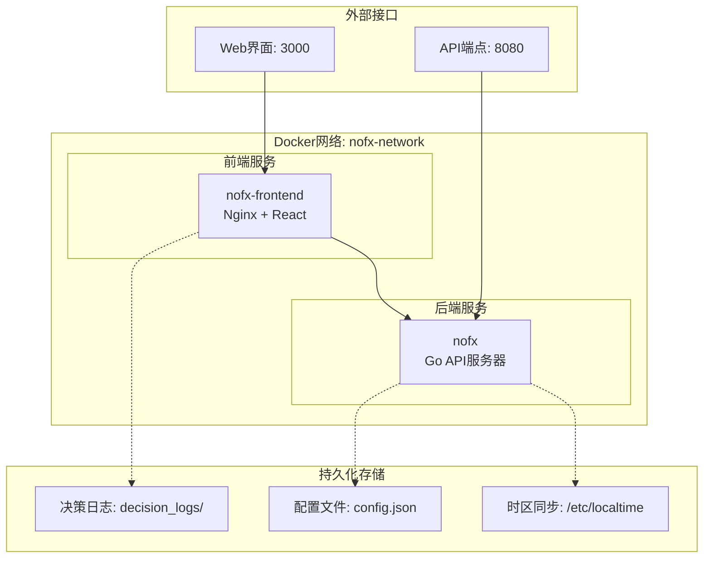
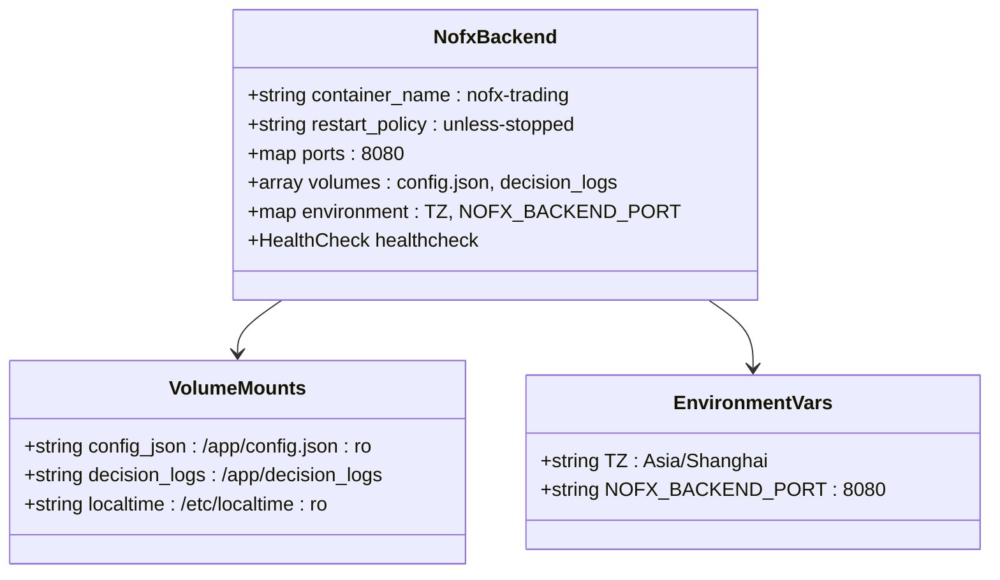
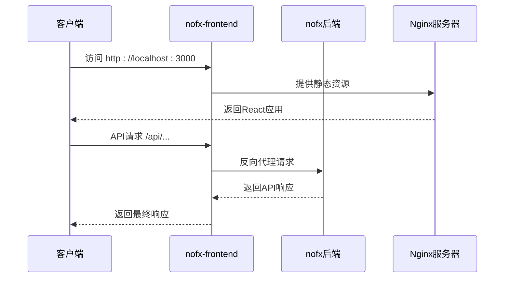
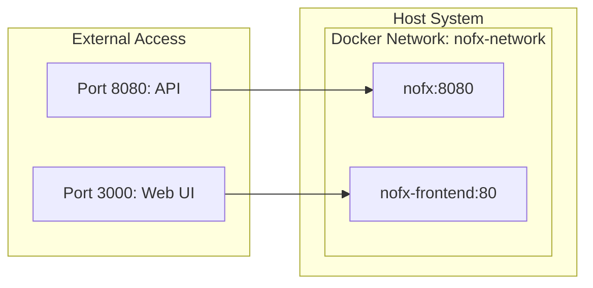
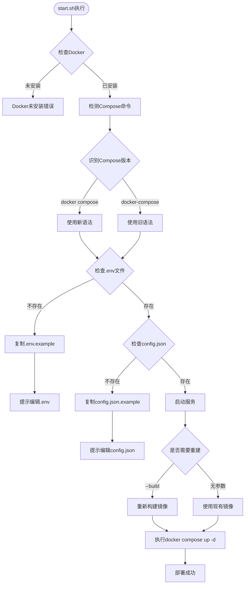
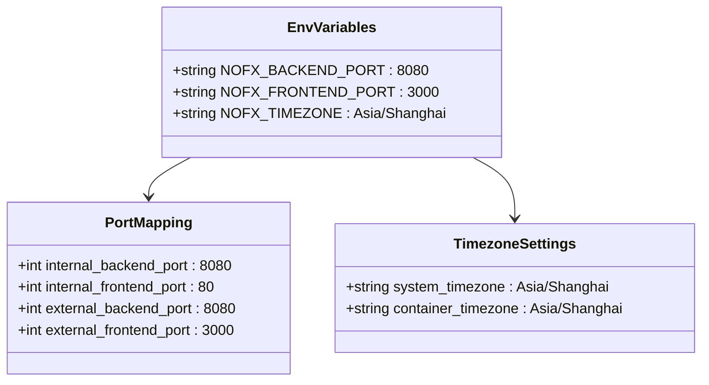
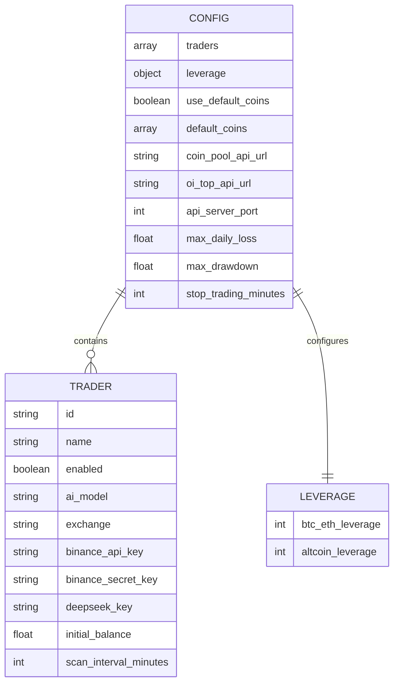
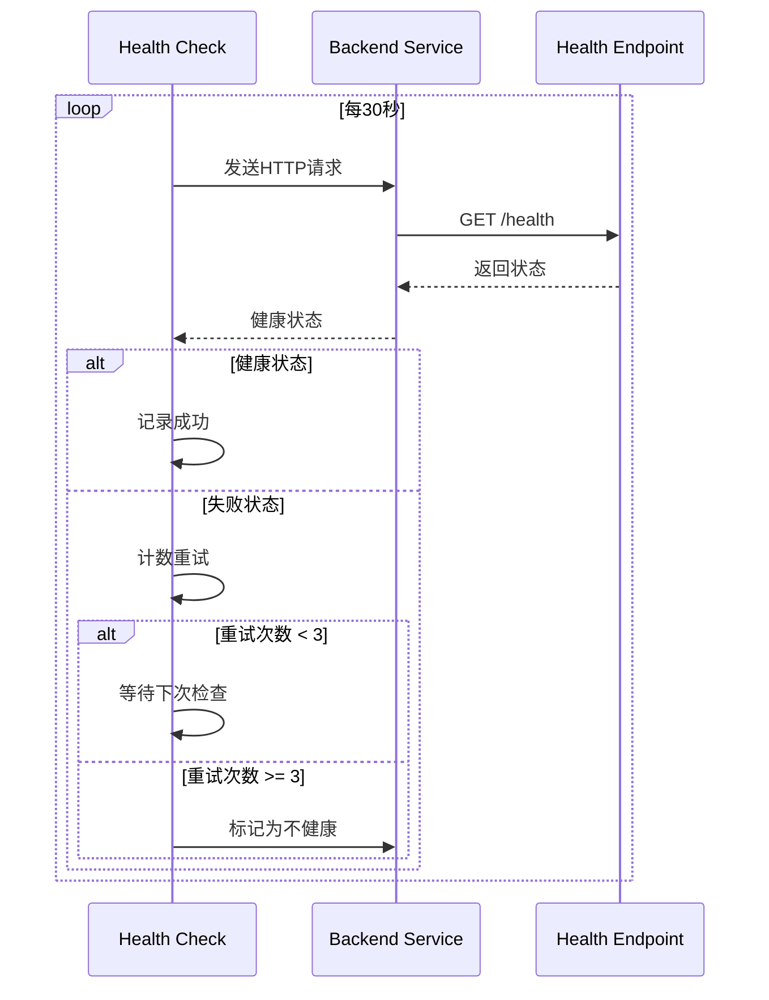

# Docker部署

<cite>
**本文档引用的文件**
- [docker-compose.yml](file://docker-compose.yml)
- [start.sh](file://start.sh)
- [DOCKER_DEPLOY.md](file://DOCKER_DEPLOY.md)
- [.env.example](file://.env.example)
- [config.json.example](file://config.json.example)
- [nginx/nginx.conf](file://nginx/nginx.conf)
- [docker/Dockerfile.backend](file://docker/Dockerfile.backend)
- [docker/Dockerfile.frontend](file://docker/Dockerfile.frontend)
</cite>

## 目录
1. [简介](#简介)
2. [前置要求](#前置要求)
3. [项目架构概览](#项目架构概览)
4. [Docker Compose服务编排](#docker-compose服务编排)
5. [自动部署脚本详解](#自动部署脚本详解)
6. [配置文件管理](#配置文件管理)
7. [部署步骤详解](#部署步骤详解)
8. [服务管理命令](#服务管理命令)
9. [健康检查机制](#健康检查机制)
10. [故障排查指南](#故障排查指南)
11. [最佳实践建议](#最佳实践建议)

## 简介

NOFX AI交易竞赛系统采用现代化的Docker容器化部署方案，通过docker-compose实现前后端服务的统一编排。该部署方案具有以下优势：

- **一键部署**：无需手动安装Go、Node.js等依赖环境
- **服务隔离**：前后端服务完全分离，互不影响
- **数据持久化**：重要数据自动持久化到本地目录
- **健康监控**：内置健康检查机制，确保服务稳定性
- **环境友好**：支持多种操作系统和Docker版本

## 前置要求

### Docker环境要求

- **Docker Engine**: 版本 20.10 或更高
- **Docker Compose**: 版本 2.0 或更高

### 系统兼容性

- **macOS**: Docker Desktop 推荐
- **Windows**: Docker Desktop 推荐  
- **Linux**: Ubuntu/Debian 系统推荐

### 验证安装

```bash
# 检查Docker版本
docker --version

# 检查Docker Compose版本
docker compose --version
```

**重要提示**：新用户建议使用Docker Desktop，它自动包含最新的Docker Compose，无需单独安装。

## 项目架构概览

NOFX系统采用微服务架构，通过Docker Compose实现服务编排：



**图表来源**
- [docker-compose.yml](file://docker-compose.yml#L1-L50)

### 核心组件说明

1. **nofx服务**：后端API服务器，负责核心交易逻辑
2. **nofx-frontend服务**：前端静态服务器，提供Web界面
3. **共享网络**：服务间通信的基础网络层
4. **数据卷**：持久化关键业务数据

## Docker Compose服务编排

### nofx后端服务配置

后端服务是系统的核心，负责AI交易算法执行和API管理：



**图表来源**
- [docker-compose.yml](file://docker-compose.yml#L5-L25)

#### 关键配置解析

**构建上下文**：
- `context: .`：使用当前目录作为构建上下文
- `dockerfile: ./docker/Dockerfile.backend`：指定后端Dockerfile路径

**端口映射**：
- `${NOFX_BACKEND_PORT:-8080}:8080`：支持环境变量覆盖，默认8080端口

**卷挂载**：
- `./config.json:/app/config.json:ro`：只读挂载配置文件
- `./decision_logs:/app/decision_logs`：持久化决策日志
- `/etc/localtime:/etc/localtime:ro`：主机时间同步

**环境变量**：
- `TZ=${NOFX_TIMEZONE:-Asia/Shanghai}`：时区设置，默认上海时区

**健康检查**：
- 检查间隔：30秒
- 超时时间：10秒
- 重试次数：3次
- 启动等待：60秒

**节来源**
- [docker-compose.yml](file://docker-compose.yml#L5-L25)

### nofx-frontend服务配置

前端服务基于Nginx提供静态文件服务和反向代理功能：



**图表来源**
- [docker-compose.yml](file://docker-compose.yml#L27-L42)
- [nginx/nginx.conf](file://nginx/nginx.conf#L1-L53)

#### 前端服务特性

**构建流程**：
1. **Node.js构建阶段**：编译React前端应用
2. **Nginx运行阶段**：提供静态文件服务

**端口配置**：
- `${NOFX_FRONTEND_PORT:-3000}:80`：前端服务监听80端口

**依赖关系**：
- `depends_on: - nofx`：确保后端服务先启动

**健康检查**：
- 更快的启动周期：5秒
- 更频繁的检查：30秒间隔

**节来源**
- [docker-compose.yml](file://docker-compose.yml#L27-L42)

### 网络配置

系统使用自定义桥接网络实现服务间通信：



**图表来源**
- [docker-compose.yml](file://docker-compose.yml#L44-L47)

**节来源**
- [docker-compose.yml](file://docker-compose.yml#L44-L47)

## 自动部署脚本详解

### start.sh脚本架构

`start.sh`是一个功能完整的Docker管理脚本，提供自动化的部署和管理功能：



**图表来源**
- [start.sh](file://start.sh#L1-L282)

### Docker Compose命令检测逻辑

脚本具备智能兼容性，能够自动检测并使用正确的Docker Compose命令：

**检测优先级**：
1. **新语法**：`docker compose`（推荐）
2. **旧语法**：`docker-compose`（兼容）

**兼容性处理**：
- 自动识别系统中安装的Compose版本
- 提供清晰的错误提示
- 支持两种语法的无缝切换

**节来源**
- [start.sh](file://start.sh#L50-L65)

### 命令分发机制

脚本采用命令模式设计，支持多种管理操作：

| 命令 | 功能 | 参数 |
|------|------|------|
| `start` | 启动服务 | `--build`（可选） |
| `stop` | 停止服务 | 无 |
| `restart` | 重启服务 | 无 |
| `logs` | 查看日志 | `[service]`（可选） |
| `status` | 查看状态 | 无 |
| `clean` | 清理数据 | 无 |
| `update` | 更新代码 | 无 |

**节来源**
- [start.sh](file://start.sh#L240-L282)

## 配置文件管理

### .env环境变量配置

`.env`文件用于管理Docker容器的环境变量：



**图表来源**
- [.env.example](file://.env.example#L1-L14)

#### 关键配置项

**端口配置**：
- `NOFX_BACKEND_PORT=8080`：后端API服务器端口
- `NOFX_FRONTEND_PORT=3000`：前端Web界面端口

**时区设置**：
- `NOFX_TIMEZONE=Asia/Shanghai`：系统时区同步

**默认值说明**：
- 所有端口都提供了默认值，支持环境变量覆盖
- 便于不同环境下的灵活配置

**节来源**
- [.env.example](file://.env.example#L1-L14)

### config.json配置文件

`config.json`是系统的核心配置文件，包含交易策略和API密钥：



**图表来源**
- [config.json.example](file://config.json.example#L1-L85)

#### 必需配置项

**交易者配置**：
- `id`：交易者唯一标识符
- `name`：交易者显示名称
- `ai_model`：AI模型类型（deepseek/qwen/custom）
- `exchange`：交易平台（binance/hyperliquid/aster）

**API密钥配置**：
- **币安交易所**：`binance_api_key` 和 `binance_secret_key`
- **DeepSeek API**：`deepseek_key`
- **自定义API**：`custom_api_url` 和 `custom_api_key`

**风险控制参数**：
- `max_daily_loss`：每日最大亏损百分比
- `max_drawdown`：最大回撤百分比
- `stop_trading_minutes`：暂停交易分钟数

**节来源**
- [config.json.example](file://config.json.example#L1-L85)

## 部署步骤详解

### 第一步：运行自动检测脚本

```bash
# 执行自动检测脚本
./start.sh
```

**脚本执行流程**：

1. **Docker环境检测**：
   - 检查Docker是否安装
   - 检测Docker Compose版本
   - 输出兼容性信息

2. **配置文件检查**：
   - 检查`.env`文件是否存在
   - 检查`config.json`文件是否存在

3. **自动配置**：
   - 如文件缺失，自动复制模板
   - 提供编辑指导

**预期输出**：
```
[INFO] 使用 Docker Compose 命令: docker compose
[SUCCESS] Docker 和 Docker Compose 已安装
[WARNING] .env 不存在，从模板复制...
[INFO] 请编辑 .env 填入你的环境变量配置
[INFO] 运行: nano .env 或使用其他编辑器
```

**节来源**
- [start.sh](file://start.sh#L67-L100)

### 第二步：配置环境变量文件

```bash
# 复制并编辑环境变量文件
cp .env.example .env
nano .env
```

**编辑内容**：

```bash
# 端口配置（根据需要修改）
NOFX_BACKEND_PORT=8080
NOFX_FRONTEND_PORT=3000

# 时区设置（根据所在地修改）
NOFX_TIMEZONE=Asia/Shanghai
```

### 第三步：配置主配置文件

```bash
# 复制并编辑主配置文件
cp config.json.example config.json
nano config.json
```

**关键配置项**：

```json
{
  "traders": [
    {
      "id": "my_trader",
      "name": "My AI Trader",
      "ai_model": "deepseek",
      "binance_api_key": "YOUR_BINANCE_API_KEY",
      "binance_secret_key": "YOUR_BINANCE_SECRET_KEY",
      "deepseek_key": "YOUR_DEEPSEEK_API_KEY",
      "initial_balance": 1000.0,
      "scan_interval_minutes": 3
    }
  ]
}
```

### 第四步：启动服务

```bash
# 方式1：首次启动或需要重建
./start.sh start --build

# 方式2：常规启动（不重新构建）
./start.sh start
```

**启动过程说明**：

1. **镜像构建**（仅第一次或使用`--build`时）：
   - 下载基础镜像
   - 编译Go应用程序
   - 构建Node.js前端应用

2. **容器启动**：
   - 后端服务启动（约30秒）
   - 前端服务启动（约10秒）

3. **健康检查**：
   - 等待服务就绪
   - 验证API可用性

**节来源**
- [start.sh](file://start.sh#L120-L150)

## 服务管理命令

### 基础管理命令

#### 启动服务

```bash
# 常规启动
./start.sh start

# 强制重建并启动
./start.sh start --build
```

**实际效果**：
```bash
# 不带--build参数
docker compose up -d

# 带--build参数
docker compose up -d --build
```

#### 停止服务

```bash
# 停止但保留容器
./start.sh stop

# 删除容器但保留数据
./start.sh stop --remove-orphans
```

#### 重启服务

```bash
# 重启所有服务
./start.sh restart

# 仅重启后端
./start.sh restart backend
```

**节来源**
- [start.sh](file://start.sh#L152-L170)

### 日志管理

#### 查看实时日志

```bash
# 查看所有服务日志
./start.sh logs

# 查看后端服务日志
./start.sh logs backend

# 查看前端服务日志
./start.sh logs frontend
```

**实际效果**：
```bash
# 实时跟踪日志
docker compose logs -f

# 指定服务日志
docker compose logs -f backend
```

#### 查看历史日志

```bash
# 查看最近100行
./start.sh logs --tail=100

# 查看特定时间段日志
docker compose logs --since="2024-01-01T00:00:00"
```

**节来源**
- [start.sh](file://start.sh#L172-L185)

### 状态监控

#### 查看服务状态

```bash
# 查看所有容器状态
./start.sh status

# 查看JSON格式状态
docker compose ps --format json
```

**输出示例**：
```
[INFO] 服务状态:
NAME                COMMAND                  SERVICE             STATUS              PORTS
nofx-trading        "./nofx"                 nofx                running             0.0.0.0:8080->8080/tcp
nofx-frontend       "nginx -g 'daemon of…"   nofx-frontend       running             0.0.0.0:3000->80/tcp
```

#### 健康检查

```bash
# 手动检查健康状态
./start.sh status

# 直接测试API健康端点
curl -s http://localhost:8080/health | jq '.'
```

**节来源**
- [start.sh](file://start.sh#L187-L195)

### 高级管理命令

#### 更新服务

```bash
# 更新代码并重启
./start.sh update

# 等效于：
git pull && docker compose up -d --build
```

#### 清理资源

```bash
# 清理所有容器和数据
./start.sh clean

# 等效于：
docker compose down -v
```

**警告**：`clean`命令会删除所有容器和持久化数据，请谨慎使用。

**节来源**
- [start.sh](file://start.sh#L200-L220)

## 健康检查机制

### 后端健康检查

后端服务实现了完善的健康检查机制：



**图表来源**
- [docker-compose.yml](file://docker-compose.yml#L18-L25)

#### 健康检查配置

**检查间隔**：30秒
**超时时间**：10秒
**重试次数**：3次
**启动等待**：60秒

**检查方法**：
```bash
# 手动测试后端健康
curl -f http://localhost:8080/health
```

**节来源**
- [docker-compose.yml](file://docker-compose.yml#L18-L25)

### 前端健康检查

前端服务同样具备健康检查能力：

**检查间隔**：30秒
**超时时间**：10秒
**重试次数**：3次
**启动等待**：5秒

**检查方法**：
```bash
# 手动测试前端健康
curl -f http://localhost:3000/health
```

**节来源**
- [docker-compose.yml](file://docker-compose.yml#L38-L42)

### 健康检查最佳实践

1. **监控健康状态**：
   ```bash
   # 实时监控健康状态
   watch -n 30 './start.sh status'
   ```

2. **异常处理**：
   ```bash
   # 检测到健康检查失败时自动重启
   docker compose restart nofx
   ```

3. **日志关联**：
   ```bash
   # 查看健康检查失败的日志
   ./start.sh logs backend | grep -i health
   ```

## 故障排查指南

### 常见问题及解决方案

#### 1. Docker环境问题

**问题**：Docker未安装或版本过低

**诊断命令**：
```bash
docker --version
docker compose --version
```

**解决方案**：
- 下载并安装Docker Desktop
- 确保版本符合要求（Docker 20.10+, Compose 2.0+）

#### 2. 端口冲突问题

**问题**：端口已被占用

**诊断命令**：
```bash
# 检查端口占用
lsof -i :8080  # 后端端口
lsof -i :3000  # 前端端口
```

**解决方案**：
```bash
# 修改端口配置
nano .env
# 修改 NOFX_BACKEND_PORT 或 NOFX_FRONTEND_PORT
```

#### 3. 配置文件问题

**问题**：配置文件缺失或格式错误

**诊断命令**：
```bash
# 检查文件存在性
ls -la .env config.json

# 验证JSON格式
jq . config.json
```

**解决方案**：
```bash
# 重新复制模板
cp .env.example .env
cp config.json.example config.json
```

#### 4. 容器启动失败

**诊断命令**：
```bash
# 查看详细错误信息
./start.sh logs backend
./start.sh logs frontend

# 检查容器状态
docker compose ps -a
```

**解决方案**：
```bash
# 重新构建镜像
./start.sh start --build

# 清理并重新启动
./start.sh clean
./start.sh start
```

**节来源**
- [DOCKER_DEPLOY.md](file://DOCKER_DEPLOY.md#L200-L300)

### 性能优化建议

#### 资源限制配置

```yaml
# docker-compose.yml 添加资源限制
services:
  nofx:
    deploy:
      resources:
        limits:
          cpus: '2'
          memory: 2G
        reservations:
          cpus: '1'
          memory: 1G
```

#### 日志轮转配置

```yaml
# docker-compose.yml 添加日志配置
services:
  nofx:
    logging:
      driver: "json-file"
      options:
        max-size: "10m"
        max-file: "3"
```

#### 网络优化

```yaml
# 使用自定义网络提高性能
networks:
  nofx-network:
    driver: bridge
    driver_opts:
      com.docker.network.bridge.enable_icc: "true"
```

## 最佳实践建议

### 开发环境配置

#### 1. 环境隔离

```bash
# 使用不同的环境变量文件
cp .env.example .env.development
cp .env.example .env.production
```

#### 2. 数据备份

```bash
# 定期备份重要数据
backup_data() {
    tar -czf "backup_$(date +%Y%m%d_%H%M%S).tar.gz" \
        decision_logs/ \
        config.json
}

# 设置定时任务
echo "0 2 * * * $HOME/nofx/backup_data" | crontab -
```

#### 3. 监控告警

```bash
# 健康检查监控脚本
monitor_health() {
    local backend_status=$(curl -s -o /dev/null -w "%{http_code}" http://localhost:8080/health)
    local frontend_status=$(curl -s -o /dev/null -w "%{http_code}" http://localhost:3000/health)
    
    if [ "$backend_status" != "200" ] || [ "$frontend_status" != "200" ]; then
        echo "ERROR: 服务健康检查失败"
        # 发送告警通知
    fi
}
```

### 生产环境部署

#### 1. 反向代理配置

```nginx
# nginx.conf 生产环境配置
server {
    listen 80;
    server_name your-domain.com;
    
    # SSL配置
    listen 443 ssl;
    ssl_certificate /path/to/cert.pem;
    ssl_certificate_key /path/to/key.pem;
    
    # 静态资源缓存
    location / {
        root /var/www/nofx;
        index index.html;
        try_files $uri $uri/ /index.html;
    }
    
    # API代理
    location /api/ {
        proxy_pass http://localhost:8080/api/;
        proxy_set_header Host $host;
        proxy_set_header X-Real-IP $remote_addr;
    }
}
```

#### 2. 安全加固

```yaml
# docker-compose.yml 安全配置
services:
  nofx:
    # 限制权限
    user: "1000:1000"
    # 只读文件系统
    read_only: true
    # 移除不必要的包
    cap_drop:
      - ALL
    cap_add:
      - CHOWN
      - SETGID
      - SETUID
```

#### 3. 监控集成

```yaml
# docker-compose.yml 监控配置
services:
  prometheus:
    image: prom/prometheus
    ports:
      - "9090:9090"
    volumes:
      - ./prometheus.yml:/etc/prometheus/prometheus.yml
  
  grafana:
    image: grafana/grafana
    ports:
      - "3001:3000"
    environment:
      - GF_SECURITY_ADMIN_PASSWORD=admin
```

### 团队协作规范

#### 1. 配置文件管理

```bash
# .gitignore 配置
echo "config.json" >> .gitignore
echo ".env.local" >> .gitignore
echo "*.log" >> .gitignore
```

#### 2. 部署流程标准化

```bash
# 部署检查清单
deploy_checklist() {
    echo "1. 检查配置文件"
    echo "2. 验证端口可用性"
    echo "3. 测试数据库连接"
    echo "4. 运行健康检查"
    echo "5. 验证API功能"
}
```

#### 3. 文档维护

```bash
# 自动化文档生成
generate_docs() {
    cat > DEPLOYMENT_GUIDE.md << EOF
# NOFX部署文档

## 环境要求
- Docker 20.10+
- Docker Compose 2.0+

## 部署步骤
1. 配置环境变量
2. 配置API密钥
3. 启动服务
EOF
}
```

通过遵循这些最佳实践，可以确保NOFX系统的稳定运行和团队协作效率。Docker部署方案不仅简化了部署流程，还为系统的可维护性和扩展性奠定了坚实基础。