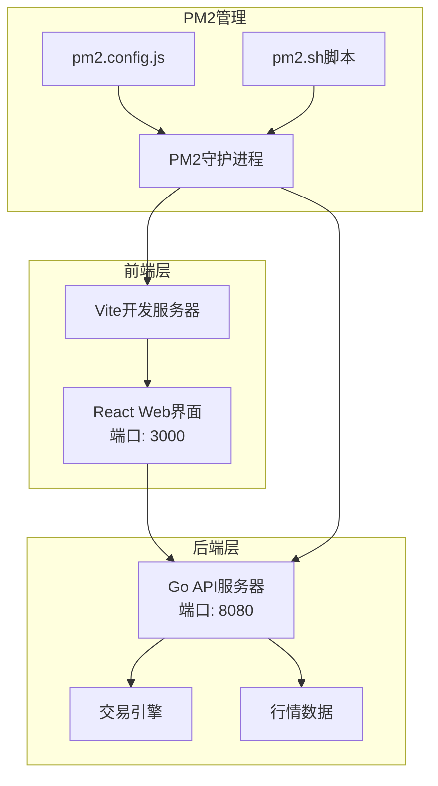
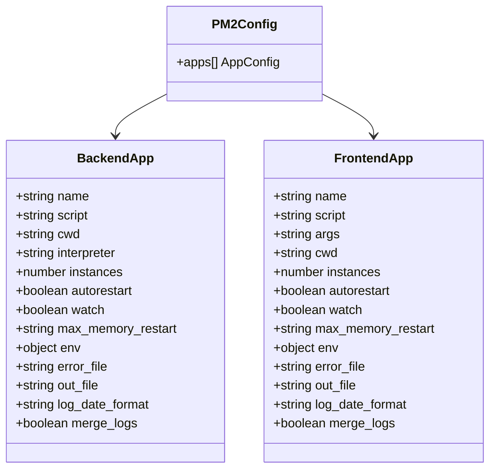
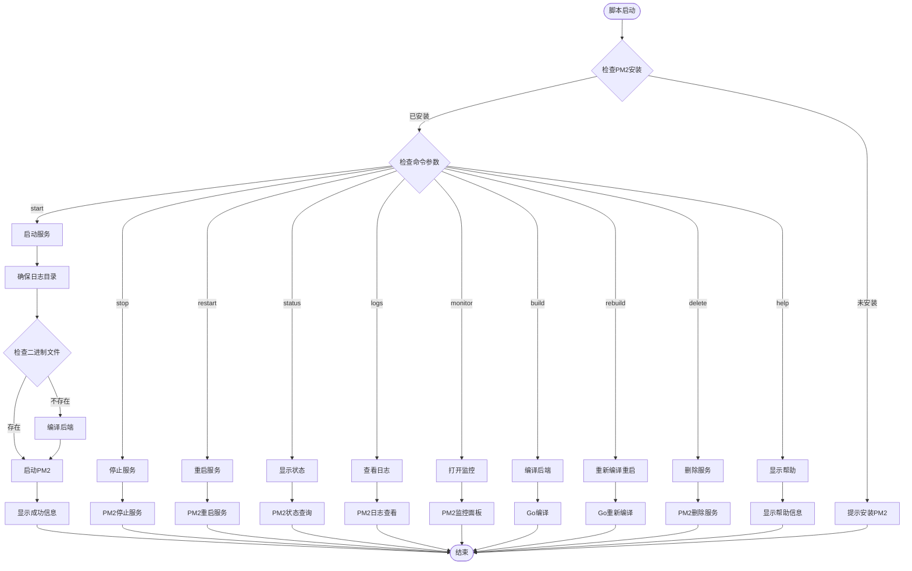
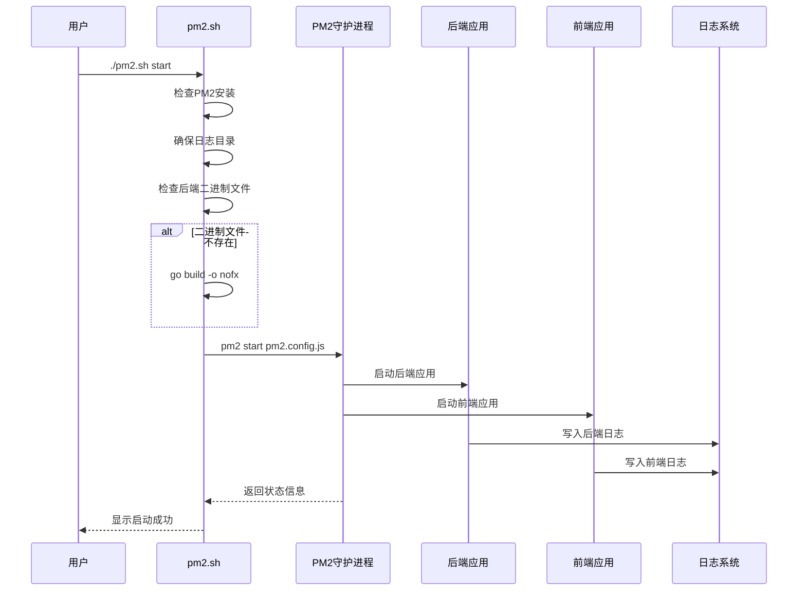
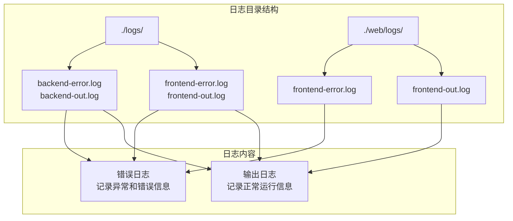
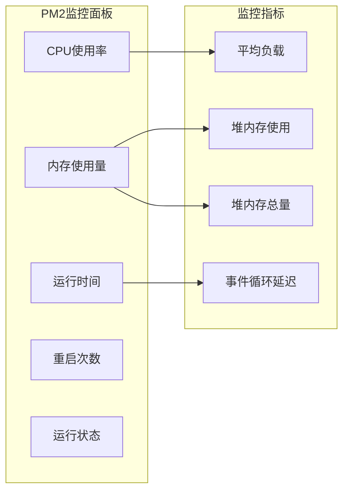

# PM2部署指南

<cite>
**本文档引用的文件**
- [pm2.config.js](file://pm2.config.js)
- [pm2.sh](file://pm2.sh)
- [main.go](file://main.go)
- [web/package.json](file://web/package.json)
- [PM2_DEPLOYMENT.md](file://PM2_DEPLOYMENT.md)
- [start.sh](file://start.sh)
- [go.mod](file://go.mod)
</cite>

## 目录
1. [简介](#简介)
2. [项目架构概览](#项目架构概览)
3. [PM2配置文件详解](#pm2配置文件详解)
4. [PM2管理脚本分析](#pm2管理脚本分析)
5. [部署前置条件](#部署前置条件)
6. [部署步骤](#部署步骤)
7. [常用命令详解](#常用命令详解)
8. [日志管理](#日志管理)
9. [监控与维护](#监控与维护)
10. [优势对比](#优势对比)
11. [故障排查](#故障排查)
12. [总结](#总结)

## 简介

PM2（Process Manager 2）是一个强大的Node.js进程管理工具，特别适合用于管理Go语言编写的后端服务和React前端应用。本指南详细介绍了NoFX Trading Bot项目的PM2部署方案，包括配置文件结构、管理脚本功能、部署流程和运维技巧。

PM2部署方式具有以下特点：
- **开发友好**：适合开发者进行本地调试和快速迭代
- **热重载支持**：前端开发时支持热重载功能
- **进程守护**：确保应用长期稳定运行
- **进程监控**：提供实时的资源使用情况监控
- **日志管理**：统一的日志输出和管理

## 项目架构概览

NoFX Trading Bot采用前后端分离的微服务架构：



**图表来源**
- [pm2.config.js](file://pm2.config.js#L1-L42)
- [pm2.sh](file://pm2.sh#L1-L259)

**章节来源**
- [pm2.config.js](file://pm2.config.js#L1-L42)
- [main.go](file://main.go#L1-L140)

## PM2配置文件详解

### 配置文件结构

`pm2.config.js`是PM2的核心配置文件，定义了两个主要应用的服务配置：



**图表来源**
- [pm2.config.js](file://pm2.config.js#L4-L22)
- [pm2.config.js](file://pm2.config.js#L24-L41)

### 后端应用配置（nofx-backend）

后端应用负责AI交易算法、API服务和数据处理：

| 配置项 | 值 | 说明 |
|--------|-----|------|
| `name` | 'nofx-backend' | 应用名称标识 |
| `script` | './nofx' | Go二进制文件路径 |
| `cwd` | __dirname | 工作目录设置为配置文件所在目录 |
| `interpreter` | 'none' | 不使用解释器，直接执行二进制文件 |
| `instances` | 1 | 单实例运行 |
| `autorestart` | true | 自动重启机制 |
| `watch` | false | 不监听文件变化 |
| `max_memory_restart` | '500M' | 内存超过500MB时重启 |
| `env.NODE_ENV` | 'production' | 生产环境标识 |
| `error_file` | './logs/backend-error.log' | 错误日志文件 |
| `out_file` | './logs/backend-out.log' | 输出日志文件 |
| `log_date_format` | 'YYYY-MM-DD HH:mm:ss Z' | 日志时间格式 |
| `merge_logs` | true | 合并错误和输出日志 |

### 前端应用配置（nofx-frontend）

前端应用提供Web界面和用户交互：

| 配置项 | 值 | 说明 |
|--------|-----|------|
| `name` | 'nofx-frontend' | 应用名称标识 |
| `script` | 'npm' | 使用npm作为脚本执行器 |
| `args` | 'run dev' | 执行npm run dev命令启动开发服务器 |
| `cwd` | path.join(__dirname, 'web') | 工作目录设置为web子目录 |
| `instances` | 1 | 单实例运行 |
| `autorestart` | true | 自动重启机制 |
| `watch` | false | 不监听文件变化 |
| `max_memory_restart` | '300M' | 内存超过300MB时重启 |
| `env.NODE_ENV` | 'development' | 开发环境标识 |
| `env.PORT` | 3000 | 前端服务端口 |
| `error_file` | './logs/frontend-error.log' | 错误日志文件 |
| `out_file` | './logs/frontend-out.log' | 输出日志文件 |
| `log_date_format` | 'YYYY-MM-DD HH:mm:ss Z' | 日志时间格式 |
| `merge_logs` | true | 合并错误和输出日志 |

**章节来源**
- [pm2.config.js](file://pm2.config.js#L1-L42)

## PM2管理脚本分析

### 脚本架构设计

`pm2.sh`是一个功能完整的PM2管理脚本，提供了完整的生命周期管理功能：



**图表来源**
- [pm2.sh](file://pm2.sh#L220-L259)

### 核心功能模块

#### 1. 环境检查模块

脚本首先检查PM2是否已安装，这是运行所有PM2命令的前提条件。

#### 2. 服务管理模块

- **启动服务**：自动检查并编译Go程序，构建前端应用，然后启动PM2进程
- **停止服务**：优雅地停止所有PM2管理的应用
- **重启服务**：重新启动所有PM2管理的应用
- **删除服务**：完全移除PM2中的服务配置

#### 3. 日志管理模块

提供灵活的日志查看功能：
- `./pm2.sh logs`：实时查看所有应用日志
- `./pm2.sh logs backend`：只查看后端应用日志  
- `./pm2.sh logs frontend`：只查看前端应用日志

#### 4. 构建编译模块

- **编译后端**：使用`go build -o nofx`编译Go程序
- **重新编译重启**：先编译后端，然后重启对应的PM2进程

#### 5. 监控模块

- **实时监控**：打开PM2内置的监控面板，查看CPU和内存使用情况
- **状态查询**：显示所有应用的运行状态和详细信息

**章节来源**
- [pm2.sh](file://pm2.sh#L1-L259)

## 部署前置条件

### 系统要求

PM2部署需要以下软件环境：

| 组件 | 最低版本 | 推荐版本 | 说明 |
|------|----------|----------|------|
| Node.js | 16.x | 18.x+ | PM2运行环境 |
| npm | 8.x | 9.x+ | 包管理工具 |
| Go | 1.25.0 | 1.25.x+ | 后端编译环境 |
| PM2 | 5.x | 5.4.x+ | 进程管理工具 |

### 安装步骤

#### 1. 安装Node.js和npm

```bash
# 检查Node.js版本
node --version

# 检查npm版本  
npm --version

# 如果未安装，可以从官网下载：
# https://nodejs.org/
```

#### 2. 全局安装PM2

```bash
# 使用npm安装PM2
npm install -g pm2

# 验证安装
pm2 --version
```

#### 3. 安装Go语言环境

```bash
# 检查Go版本
go version

# 如果未安装，可以从官网下载：
# https://golang.org/dl/
```

### 权限要求

- 当前用户需要有执行权限
- 需要写入权限访问项目目录
- 需要写入权限访问日志目录

**章节来源**
- [PM2_DEPLOYMENT.md](file://PM2_DEPLOYMENT.md#L1-L20)
- [go.mod](file://go.mod#L1-L38)

## 部署步骤

### 第一步：初始化项目

```bash
# 克隆项目（如果尚未克隆）
git clone <repository-url>
cd nofx

# 检查项目结构
ls -la
```

### 第二步：安装依赖

```bash
# 安装前端依赖
cd web
npm install
cd ..

# 返回项目根目录
cd ..
```

### 第三步：编译后端

```bash
# 手动编译后端（可选，pm2.sh start会自动处理）
go build -o nofx

# 验证编译结果
ls -la nofx
```

### 第四步：启动服务

```bash
# 使用PM2管理脚本启动服务
chmod +x pm2.sh
./pm2.sh start

# 或者手动执行
./pm2.sh build    # 编译后端
./pm2.sh start   # 启动服务
```

### 第五步：验证部署

```bash
# 查看服务状态
./pm2.sh status

# 查看实时日志
./pm2.sh logs

# 访问Web界面
echo "访问 http://localhost:3000 查看前端"
echo "访问 http://localhost:8080 查看后端API"
```

### 部署流程图



**图表来源**
- [pm2.sh](file://pm2.sh#L80-L114)
- [pm2.config.js](file://pm2.config.js#L1-L42)

**章节来源**
- [pm2.sh](file://pm2.sh#L80-L114)
- [PM2_DEPLOYMENT.md](file://PM2_DEPLOYMENT.md#L1-L50)

## 常用命令详解

### 服务管理命令

#### 启动服务
```bash
# 完整启动（包含编译和启动）
./pm2.sh start

# 只启动现有服务（不重新编译）
pm2 start pm2.config.js
```

#### 停止服务
```bash
# 停止所有服务
./pm2.sh stop

# 停止特定应用
pm2 stop nofx-backend
pm2 stop nofx-frontend
```

#### 重启服务
```bash
# 重启所有服务
./pm2.sh restart

# 重启特定应用
pm2 restart nofx-backend
pm2 restart nofx-frontend

# 重新编译后端并重启
./pm2.sh rebuild
```

#### 删除服务
```bash
# 删除PM2中的服务配置
./pm2.sh delete
```

### 日志查看命令

#### 实时日志监控
```bash
# 查看所有应用的实时日志
./pm2.sh logs

# 查看后端应用日志
./pm2.sh logs backend

# 查看前端应用日志
./pm2.sh logs frontend
```

#### 日志文件管理
```bash
# 查看PM2管理的所有日志
pm2 logs

# 查看特定应用的日志
pm2 logs nofx-backend
pm2 logs nofx-frontend

# 清空所有日志
pm2 flush
```

### 监控命令

#### 实时监控面板
```bash
# 打开PM2监控面板
./pm2.sh monitor

# 或者使用简写
./pm2.sh mon
```

#### 状态查询
```bash
# 查看服务状态
./pm2.sh status

# 查看应用详细信息
pm2 info nofx-backend
pm2 info nofx-frontend

# 查看所有应用列表
pm2 list
```

### 构建命令

#### 后端编译
```bash
# 编译后端Go程序
./pm2.sh build

# 手动编译（不推荐）
go build -o nofx
```

#### 前端构建
```bash
# 前端开发时使用Vite自动热重载
# 不需要手动构建，修改代码后自动生效
```

### 命令使用示例

#### 开发环境常用组合

```bash
# 开发调试
./pm2.sh start                    # 启动服务
./pm2.sh logs                     # 查看实时日志
./pm2.sh status                   # 查看状态

# 代码修改后
./pm2.sh restart                  # 重启服务
./pm2.sh logs backend             # 查看后端日志

# 性能监控
./pm2.sh monitor                  # 打开监控面板
```

#### 生产环境管理

```bash
# 部署新版本
./pm2.sh rebuild                  # 重新编译并重启后端
./pm2.sh restart                  # 重启所有服务

# 日常维护
./pm2.sh status                   # 检查服务状态
./pm2.sh logs                     # 查看日志
./pm2.sh monitor                  # 监控性能

# 服务恢复
pm2 reload all                    # 平滑重启所有应用
pm2 reset nofx-backend            # 重置错误计数
```

**章节来源**
- [pm2.sh](file://pm2.sh#L182-L218)
- [PM2_DEPLOYMENT.md](file://PM2_DEPLOYMENT.md#L25-L100)

## 日志管理

### 日志文件结构

PM2部署的日志管理采用分层结构，确保日志的可读性和可维护性：



**图表来源**
- [pm2.config.js](file://pm2.config.js#L15-L16)
- [pm2.config.js](file://pm2.config.js#L32-L33)

### 日志配置详解

#### 后端日志配置
- **错误日志文件**：`./logs/backend-error.log`
- **输出日志文件**：`./logs/backend-out.log`
- **合并日志**：`merge_logs: true`
- **时间格式**：`YYYY-MM-DD HH:mm:ss Z`
- **最大内存重启**：`500M`

#### 前端日志配置
- **错误日志文件**：`./logs/frontend-error.log`
- **输出日志文件**：`./logs/frontend-out.log`
- **合并日志**：`merge_logs: true`
- **时间格式**：`YYYY-MM-DD HH:mm:ss Z`
- **最大内存重启**：`300M`

### 日志查看技巧

#### 实时监控
```bash
# 实时查看所有日志
./pm2.sh logs

# 实时查看特定应用日志
./pm2.sh logs backend    # 只看后端日志
./pm2.sh logs frontend   # 只看前端日志
```

#### 日志过滤和搜索
```bash
# 查看最近的错误
pm2 logs --err

# 查看包含特定关键词的日志
pm2 logs | grep "ERROR"

# 查看特定时间段的日志
pm2 logs --lines 100
```

#### 日志轮转
```bash
# 清空所有日志
pm2 flush

# 备份日志文件
tar -czf logs-backup.tar.gz logs/
```

### 日志分析最佳实践

#### 开发阶段
- 关注实时日志输出，及时发现错误
- 使用`./pm2.sh logs backend`专门查看后端日志
- 监控内存使用情况，避免内存泄漏

#### 生产阶段
- 定期检查错误日志，及时处理异常
- 监控应用重启频率，分析稳定性
- 设置日志轮转策略，避免磁盘空间不足

**章节来源**
- [pm2.config.js](file://pm2.config.js#L15-L16)
- [pm2.config.js](file://pm2.config.js#L32-L33)

## 监控与维护

### PM2监控功能

PM2提供了强大的内置监控功能，可以实时查看应用的资源使用情况：



### 监控命令使用

#### 实时监控面板
```bash
# 打开PM2监控面板
./pm2.sh monitor

# 监控特定应用
pm2 monit nofx-backend
pm2 monit nofx-frontend
```

#### 状态查询
```bash
# 查看详细状态
./pm2.sh status

# 查看应用详细信息
pm2 describe nofx-backend
pm2 describe nofx-frontend

# 查看所有进程列表
pm2 list
```

### 性能优化建议

#### 内存管理
- **后端应用**：设置合理的内存限制（当前配置为500MB）
- **前端应用**：设置内存限制（当前配置为300MB）
- **监控内存使用**：定期检查内存使用情况，避免内存泄漏

#### 自动重启策略
```javascript
// 在pm2.config.js中调整重启策略
{
  autorestart: true,
  max_restarts: 10,
  min_uptime: '10s',
  max_memory_restart: '500M'
}
```

#### 负载均衡
```javascript
// 对于高并发场景，可以增加实例数量
{
  name: 'nofx-backend',
  script: './nofx',
  instances: 2,  // 启动多个实例
  exec_mode: 'cluster'  // 集群模式
}
```

### 维护任务清单

#### 日常维护
- [ ] 检查服务状态：`./pm2.sh status`
- [ ] 查看错误日志：`./pm2.sh logs`
- [ ] 监控资源使用：`./pm2.sh monitor`
- [ ] 备份重要配置：`cp pm2.config.js pm2.config.js.bak`

#### 周期性维护
- [ ] 清理旧日志：`pm2 flush`
- [ ] 重新编译代码：`./pm2.sh rebuild`
- [ ] 检查依赖更新：`npm outdated`
- [ ] 性能分析：分析日志中的性能瓶颈

#### 应急处理
- [ ] 服务异常：`pm2 restart all`
- [ ] 内存溢出：`pm2 restart nofx-backend`
- [ ] 端口冲突：检查端口占用，修改配置
- [ ] 磁盘空间：清理日志文件

**章节来源**
- [pm2.sh](file://pm2.sh#L160-L180)
- [pm2.config.js](file://pm2.config.js#L10-L12)

## 优势对比

### PM2部署 vs Docker部署

| 特性 | PM2部署 | Docker部署 |
|------|---------|------------|
| **启动速度** | ⚡ 快速启动（秒级） | 🐌 较慢（分钟级） |
| **资源占用** | 💚 低资源消耗 | 🟡 中等资源消耗 |
| **隔离性** | 🟡 基础隔离 | 💚 完全隔离 |
| **配置复杂度** | 💚 简单配置 | 🟡 中等配置 |
| **适用场景** | 开发/单机部署 | 生产/集群部署 |
| **学习成本** | 🟡 适中 | 💚 较高 |
| **调试便利性** | 💚 高 | 🟡 中等 |
| **热重载支持** | 💚 支持 | 🟡 有限支持 |
| **依赖管理** | 🟡 手动管理 | 💚 自动管理 |

### PM2部署的优势

#### 开发环境优势
1. **快速启动**：无需等待容器启动，秒级启动应用
2. **热重载支持**：前端开发时支持热重载，提高开发效率
3. **调试便利**：可以直接在终端查看日志，便于调试
4. **资源节省**：不需要容器虚拟化开销，节省系统资源
5. **配置简单**：无需复杂的Dockerfile和docker-compose配置

#### 生产环境优势
1. **进程守护**：确保应用崩溃时自动重启
2. **资源监控**：内置CPU和内存监控功能
3. **日志管理**：统一的日志输出和管理
4. **开机自启**：支持系统开机自启动
5. **负载均衡**：支持多实例部署和负载均衡

### 选择建议

#### 推荐使用PM2部署的场景
- **开发环境**：本地开发、功能测试、快速迭代
- **单机部署**：个人服务器、小型团队、演示环境
- **调试场景**：问题排查、性能分析、开发调试
- **资源受限**：内存和CPU资源有限的环境

#### 推荐使用Docker部署的场景
- **生产环境**：大规模部署、高可用要求
- **集群部署**：多节点、负载均衡、高并发
- **CI/CD流水线**：自动化部署、版本控制
- **多环境管理**：开发、测试、生产环境一致性

### 迁移建议

#### 从PM2迁移到Docker
```bash
# 1. 创建Dockerfile
# 2. 创建docker-compose.yml
# 3. 测试Docker部署
# 4. 停止PM2服务
# 5. 启动Docker服务
# 6. 验证功能正常
```

#### 从Docker迁移到PM2
```bash
# 1. 停止Docker服务
# 2. 安装Node.js和PM2
# 3. 编译Go程序
# 4. 安装前端依赖
# 5. 启动PM2服务
# 6. 验证功能正常
```

**章节来源**
- [PM2_DEPLOYMENT.md](file://PM2_DEPLOYMENT.md#L250-L280)
- [start.sh](file://start.sh#L1-L50)

## 故障排查

### 常见问题及解决方案

#### 1. PM2未安装

**症状**：
```bash
./pm2.sh: command not found
```

**解决方案**：
```bash
# 安装PM2
npm install -g pm2

# 验证安装
pm2 --version
```

#### 2. 后端编译失败

**症状**：
```bash
后端编译失败
```

**排查步骤**：
```bash
# 检查Go版本
go version

# 检查Go环境
go env

# 手动编译测试
go build -o nofx

# 检查错误信息
go build -o nofx 2>&1 | tee compile.log
```

#### 3. 端口占用

**症状**：
```bash
listen tcp :8080: bind: address already in use
```

**解决方案**：
```bash
# 查找占用端口的进程
lsof -i :8080
lsof -i :3000

# 杀死占用进程
kill -9 <PID>

# 或者修改配置文件中的端口
```

#### 4. 前端依赖问题

**症状**：
```bash
npm ERR! Cannot find module 'react'
```

**解决方案**：
```bash
# 进入前端目录
cd web

# 安装依赖
npm install

# 清理缓存
npm cache clean --force

# 重新安装
rm -rf node_modules package-lock.json
npm install
```

#### 5. 权限问题

**症状**：
```bash
Permission denied: ./nofx
```

**解决方案**：
```bash
# 给予执行权限
chmod +x nofx

# 或者给整个项目权限
chmod +x pm2.sh
chmod +x start.sh
```

### 调试技巧

#### 1. 分步调试
```bash
# 1. 检查环境
./pm2.sh start 2>&1 | tee debug.log

# 2. 单独启动后端
cd ..
./nofx 2>&1 | tee backend.log

# 3. 单独启动前端
cd web
npm run dev 2>&1 | tee frontend.log
```

#### 2. 日志分析
```bash
# 查看详细错误
./pm2.sh logs

# 过滤错误日志
./pm2.sh logs | grep ERROR

# 查看最近的错误
pm2 logs --err --lines 100
```

#### 3. 状态检查
```bash
# 查看详细状态
./pm2.sh status

# 查看应用信息
pm2 info nofx-backend
pm2 info nofx-frontend

# 查看进程树
pm2 prettylist
```

### 性能问题诊断

#### 内存泄漏检测
```bash
# 监控内存使用
./pm2.sh monitor

# 查看内存使用趋势
pm2 monit nofx-backend | grep memory

# 强制垃圾回收（如果支持）
# 在Go代码中添加 runtime.GC() 调用
```

#### CPU性能分析
```bash
# 查看CPU使用情况
./pm2.sh monitor

# 分析CPU热点
go tool pprof http://localhost:8080/debug/pprof/profile
```

### 紧急恢复

#### 1. 服务恢复
```bash
# 重启所有服务
./pm2.sh restart

# 重新编译并重启
./pm2.sh rebuild

# 重新加载配置
pm2 reload all
```

#### 2. 数据恢复
```bash
# 备份当前配置
cp pm2.config.js pm2.config.js.backup

# 恢复备份配置
cp pm2.config.js.backup pm2.config.js

# 重启服务
./pm2.sh restart
```

#### 3. 清理重置
```bash
# 停止所有服务
./pm2.sh stop

# 删除PM2服务
./pm2.sh delete

# 清理日志
rm -rf logs/*

# 重新启动
./pm2.sh start
```

**章节来源**
- [pm2.sh](file://pm2.sh#L50-L80)
- [PM2_DEPLOYMENT.md](file://PM2_DEPLOYMENT.md#L150-L200)

## 总结

PM2部署方案为NoFX Trading Bot提供了强大而灵活的进程管理能力，特别适合开发环境和单机部署场景。通过本指南的学习，您应该能够：

### 核心技能掌握

1. **配置管理**：理解`pm2.config.js`的配置结构和各项参数的作用
2. **脚本使用**：熟练使用`pm2.sh`脚本的各种命令和功能
3. **服务管理**：掌握PM2进程的启动、停止、重启和监控
4. **日志管理**：有效管理和分析应用日志
5. **故障排查**：快速定位和解决常见问题

### 最佳实践建议

#### 开发阶段
- 使用`./pm2.sh start`快速启动开发环境
- 利用热重载功能提高开发效率
- 定期检查日志，及时发现问题
- 使用监控功能跟踪应用性能

#### 生产阶段
- 设置合理的内存限制和重启策略
- 配置开机自启动功能
- 建立完善的日志轮转机制
- 定期进行性能优化和维护

### 未来发展方向

随着项目的发展，您可以考虑：
- 将PM2部署迁移到Docker容器化部署
- 集成更高级的监控和告警系统
- 实现自动化部署和CI/CD流水线
- 优化资源配置和性能调优

PM2部署不仅提供了可靠的应用管理能力，更重要的是为您的开发和运维工作提供了便利的工具链。通过合理使用这些功能，您可以大大提高开发效率，确保应用的稳定运行。