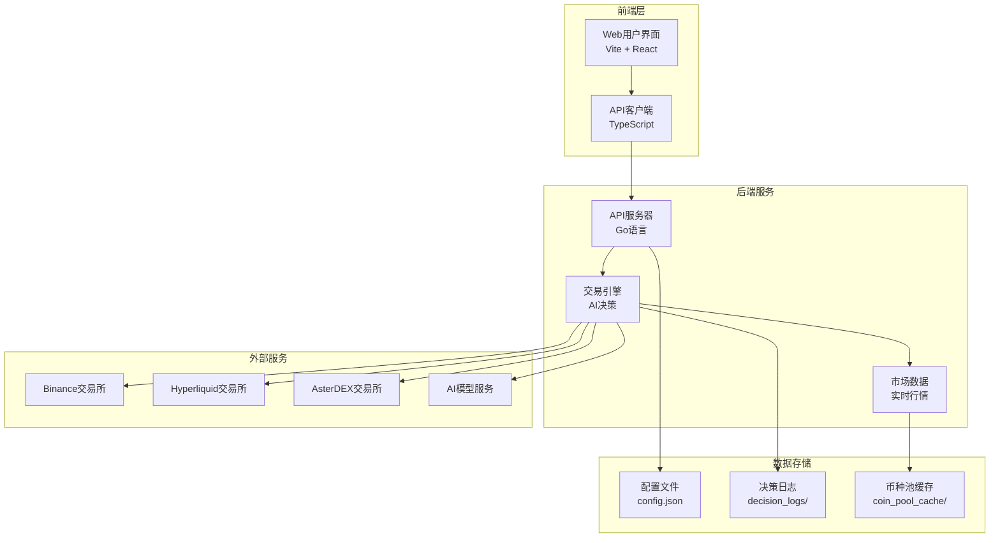
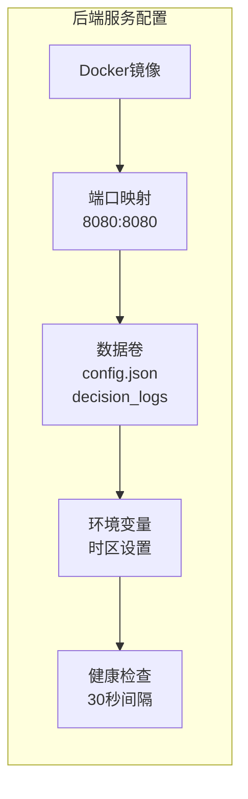
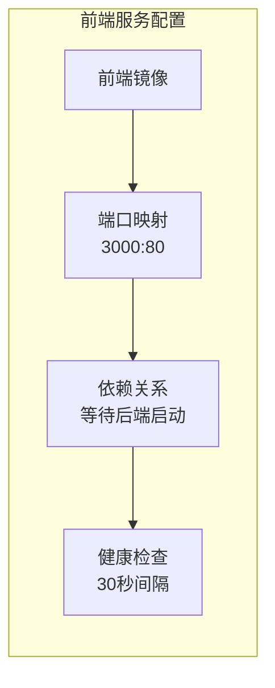
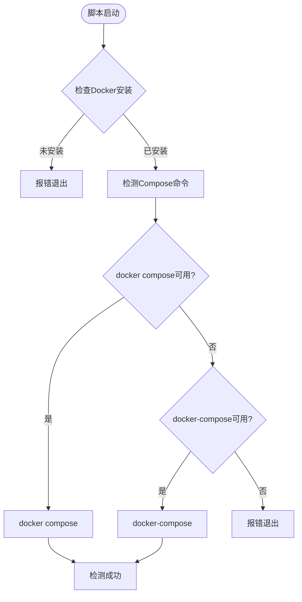
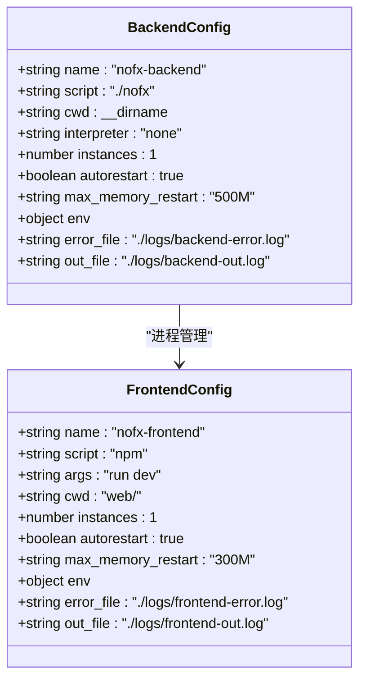
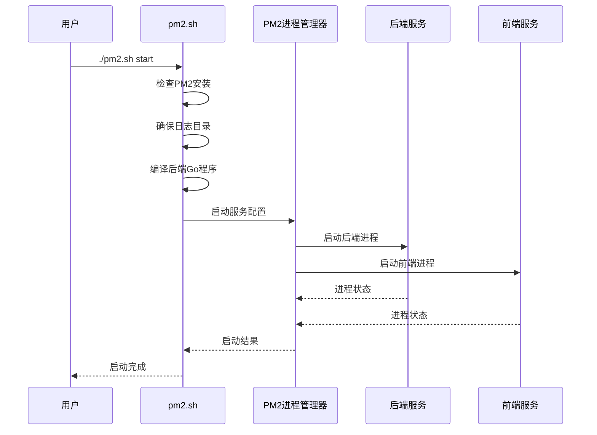
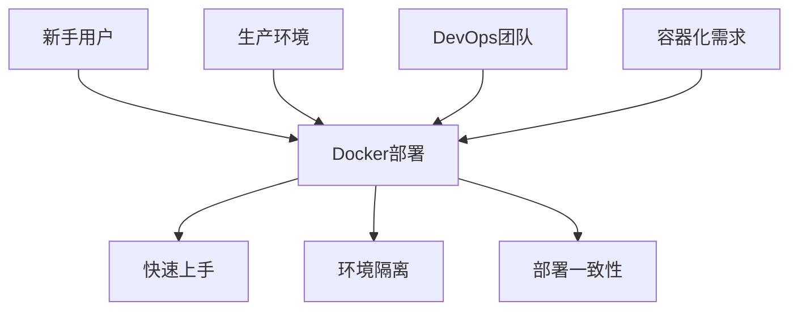
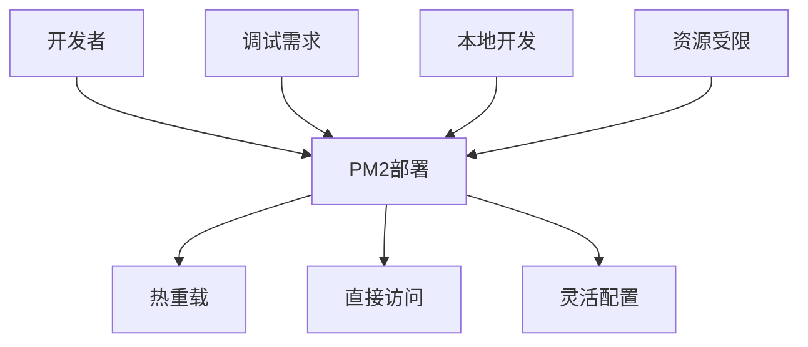
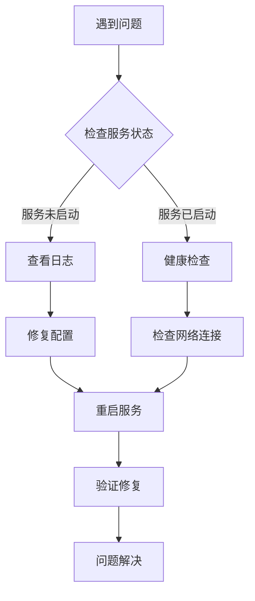

# 部署方式

<cite>
**本文档引用的文件**
- [docker-compose.yml](file://docker-compose.yml)
- [pm2.config.js](file://pm2.config.js)
- [start.sh](file://start.sh)
- [pm2.sh](file://pm2.sh)
- [main.go](file://main.go)
- [config.json.example](file://config.json.example)
- [DOCKER_DEPLOY.md](file://DOCKER_DEPLOY.md)
- [PM2_DEPLOYMENT.md](file://PM2_DEPLOYMENT.md)
</cite>

## 目录
1. [简介](#简介)
2. [项目架构概览](#项目架构概览)
3. [Docker一键部署](#docker一键部署)
4. [PM2手动部署](#pm2手动部署)
5. [部署方式对比](#部署方式对比)
6. [故障排查指南](#故障排查指南)
7. [最佳实践建议](#最佳实践建议)

## 简介

NOFX AI交易竞赛系统提供了两种主要的部署方式：Docker一键部署和PM2手动部署。这两种部署方式各有优势，适用于不同的使用场景：

- **Docker部署**：适合新手快速上手，提供完整的容器化环境，开箱即用
- **PM2部署**：适合开发者进行调试和生产环境长期运行，提供灵活的进程管理

## 项目架构概览

NOFX系统采用前后端分离架构，包含以下核心组件：



**图表来源**
- [main.go](file://main.go#L1-L140)
- [docker-compose.yml](file://docker-compose.yml#L1-L50)

**章节来源**
- [main.go](file://main.go#L1-L140)

## Docker一键部署

### Docker Compose配置详解

Docker部署通过`docker-compose.yml`文件实现服务编排，该文件定义了两个主要服务：

#### 后端服务 (nofx)



**图表来源**
- [docker-compose.yml](file://docker-compose.yml#L4-L25)

#### 前端服务 (nofx-frontend)



**图表来源**
- [docker-compose.yml](file://docker-compose.yml#L27-L42)

### start.sh脚本功能分析

`start.sh`脚本提供了完整的Docker部署自动化流程：

#### 自动检测机制

脚本实现了兼容`docker compose`和`docker-compose`的自动检测：



**图表来源**
- [start.sh](file://start.sh#L45-L55)

#### 三步启动流程

1. **环境检查阶段**
   - 验证Docker和Docker Compose安装
   - 检查`.env`环境变量文件
   - 验证`config.json`配置文件

2. **配置验证阶段**
   - 检查必需的配置文件
   - 提供文件模板复制功能
   - 确保配置文件格式正确

3. **服务启动阶段**
   - 根据参数决定是否重建镜像
   - 启动所有容器服务
   - 提供健康检查状态

### 实际部署示例

#### 基础部署

```bash
# 1. 准备配置文件
cp config.json.example config.json
nano config.json  # 编辑API密钥

# 2. 启动服务
./start.sh start

# 3. 访问系统
# Web界面: http://localhost:3000
# API端点: http://localhost:8080
```

#### 高级操作

```bash
# 重新构建并启动
./start.sh start --build

# 查看日志
./start.sh logs

# 查看特定服务日志
./start.sh logs backend

# 停止服务
./start.sh stop

# 更新代码
./start.sh update
```

**章节来源**
- [start.sh](file://start.sh#L1-L282)
- [docker-compose.yml](file://docker-compose.yml#L1-L50)
- [DOCKER_DEPLOY.md](file://DOCKER_DEPLOY.md#L1-L473)

## PM2手动部署

### PM2配置文件分析

`pm2.config.js`定义了前后端服务的进程管理配置：

#### 后端服务配置



**图表来源**
- [pm2.config.js](file://pm2.config.js#L4-L25)
- [pm2.config.js](file://pm2.config.js#L27-L41)

### pm2.sh脚本功能详解

`pm2.sh`脚本提供了完整的PM2部署管理功能：

#### 服务生命周期管理



**图表来源**
- [pm2.sh](file://pm2.sh#L70-L100)

#### 核心功能模块

1. **编译管理**
   - 自动检测并编译Go后端
   - 前端构建和优化
   - 错误处理和回滚

2. **进程守护**
   - 自动重启机制
   - 内存监控和限制
   - 日志轮转管理

3. **监控工具**
   - 实时状态查看
   - 性能监控面板
   - 日志实时追踪

### 实际部署示例

#### 开发环境部署

```bash
# 1. 安装PM2
npm install -g pm2

# 2. 启动服务
./pm2.sh start

# 3. 查看状态
./pm2.sh status

# 4. 查看日志
./pm2.sh logs
```

#### 生产环境配置

```bash
# 1. 设置开机自启动
./pm2.sh start
pm2 save
pm2 startup

# 2. 生产模式部署
# 修改pm2.config.js中的前端配置
{
  name: 'nofx-frontend',
  script: 'npm',
  args: 'run preview',
  env: {
    NODE_ENV: 'production'
  }
}

# 3. 重启服务
./pm2.sh restart
```

**章节来源**
- [pm2.config.js](file://pm2.config.js#L1-L42)
- [pm2.sh](file://pm2.sh#L1-L259)
- [PM2_DEPLOYMENT.md](file://PM2_DEPLOYMENT.md#L1-L301)

## 部署方式对比

### 技术特性对比

| 特性 | Docker部署 | PM2部署 |
|------|-----------|---------|
| **启动速度** | 🐌 较慢（镜像构建） | ⚡ 快（直接启动） |
| **资源占用** | 🟡 中等（容器开销） | 💚 低（原生进程） |
| **隔离性** | 💚 高（完全隔离） | 🟡 中等（共享主机） |
| **配置复杂度** | 🟡 中等（需要理解Docker） | 💚 简单（脚本化） |
| **跨平台兼容性** | 💚 优秀 | 🟡 依赖Node.js环境 |
| **调试便利性** | 🟡 需要容器命令 | 💚 直接访问源码 |

### 适用场景分析

#### Docker部署适用场景



#### PM2部署适用场景



### 部署决策矩阵

| 使用场景 | 推荐部署方式 | 理由 |
|----------|-------------|------|
| **快速体验** | Docker | 一键部署，无需配置环境 |
| **开发调试** | PM2 | 热重载，直接访问源码 |
| **生产环境** | Docker | 更好的隔离性和稳定性 |
| **CI/CD流水线** | Docker | 容器化部署更可靠 |
| **资源受限** | PM2 | 更低的资源消耗 |
| **多环境部署** | Docker | 环境一致性更好 |

## 故障排查指南

### Docker部署常见问题

#### 容器启动失败

```bash
# 查看详细错误信息
./start.sh logs backend
./start.sh logs frontend

# 检查容器状态
docker compose ps -a

# 重新构建（清除缓存）
docker compose build --no-cache
```

#### 端口冲突

```bash
# 查找占用端口的进程
lsof -i :8080  # 后端端口
lsof -i :3000  # 前端端口

# 杀死占用端口的进程
kill -9 <PID>
```

#### 配置文件问题

```bash
# 确保config.json存在
ls -la config.json

# 复制模板文件
cp config.json.example config.json
```

### PM2部署常见问题

#### 后端编译失败

```bash
# 检查Go环境
go version

# 手动编译测试
go build -o nofx
./nofx

# 查看编译错误
./pm2.sh logs backend
```

#### 前端启动失败

```bash
# 检查Node.js环境
node --version
npm --version

# 重新安装依赖
cd web && npm install

# 手动启动测试
npm run dev
```

#### PM2进程异常

```bash
# 查看详细信息
pm2 info nofx-backend
pm2 info nofx-frontend

# 重启服务
./pm2.sh restart

# 清空日志
pm2 flush
```

### 通用诊断步骤



## 最佳实践建议

### Docker部署最佳实践

1. **环境变量管理**
   ```bash
   # 创建.env文件
   cat > .env << EOF
   NOFX_BACKEND_PORT=8080
   NOFX_FRONTEND_PORT=3000
   NOFX_TIMEZONE=Asia/Shanghai
   EOF
   ```

2. **数据持久化**
   ```bash
   # 创建数据目录
   mkdir -p decision_logs coin_pool_cache
   
   # 设置适当的权限
   chmod 755 decision_logs coin_pool_cache
   ```

3. **安全配置**
   ```bash
   # 限制容器权限
   docker run --security-opt=no-new-privileges ...
   
   # 使用非root用户
   docker run --user $(id -u):$(id -g) ...
   ```

### PM2部署最佳实践

1. **生产环境配置**
   ```javascript
   // pm2.config.js 生产环境配置
   {
     name: 'nofx-backend',
     script: './nofx',
     instances: 2,
     exec_mode: 'cluster',
     env: {
       NODE_ENV: 'production'
     }
   }
   ```

2. **开机自启动**
   ```bash
   # 生成启动脚本
   pm2 startup
   # 按照提示执行生成的命令
   ```

3. **监控和告警**
   ```bash
   # 设置内存监控
   pm2 set pm2-logrotate:max_size 10M
   pm2 set pm2-logrotate:compress true
   ```

### 通用运维建议

1. **定期备份**
   ```bash
   # 备份配置和数据
   tar -czf backup_$(date +%Y%m%d).tar.gz config.json decision_logs/
   ```

2. **性能监控**
   ```bash
   # 监控资源使用
   ./pm2.sh monitor
   # 或使用系统监控工具
   htop
   top
   ```

3. **版本管理**
   ```bash
   # 记录部署版本
   git describe --tags --always > VERSION.txt
   ```

通过以上详细的部署指南，用户可以根据自己的需求和环境选择合适的部署方式，并能够有效地管理和维护NOFX AI交易竞赛系统。