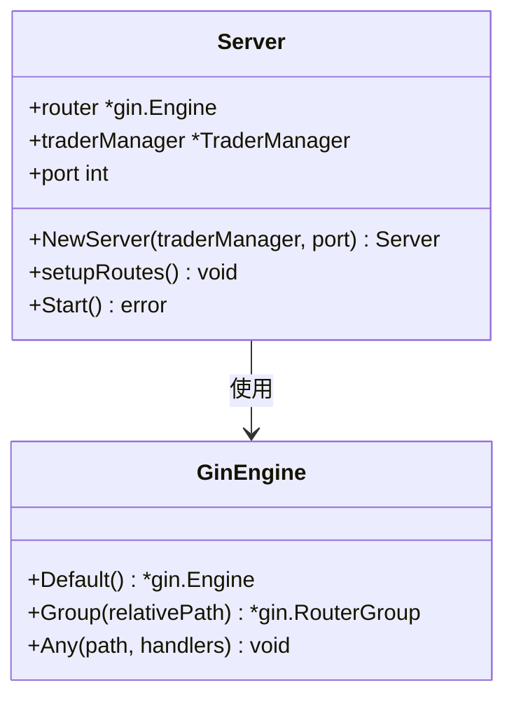
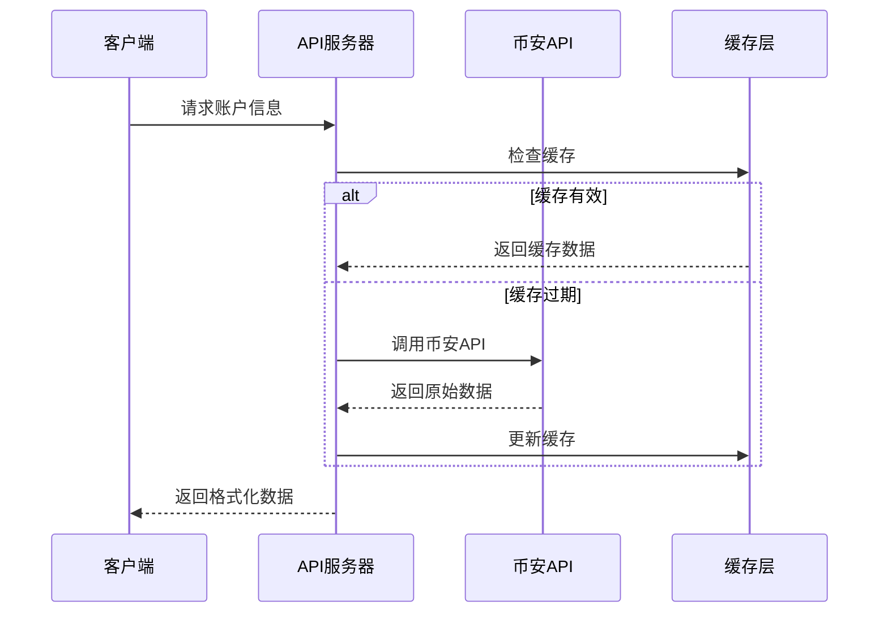
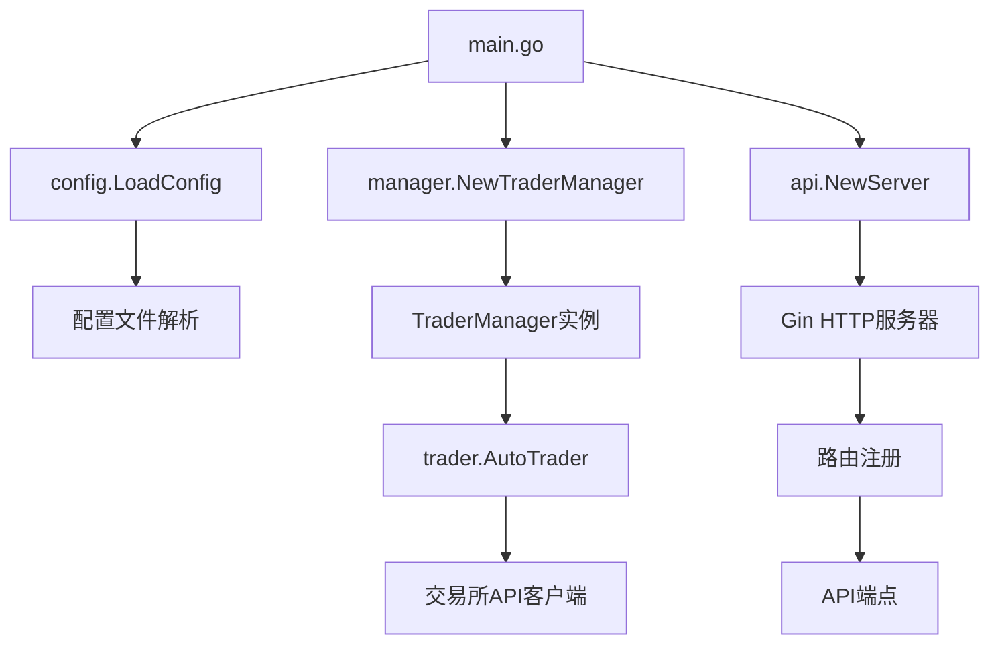
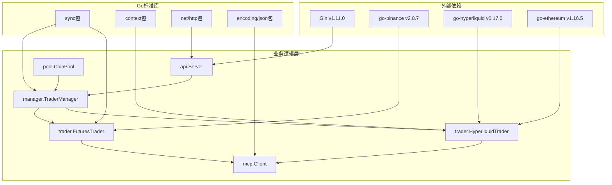
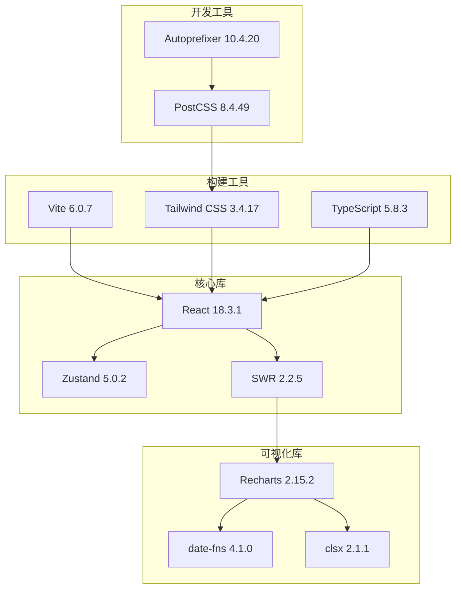
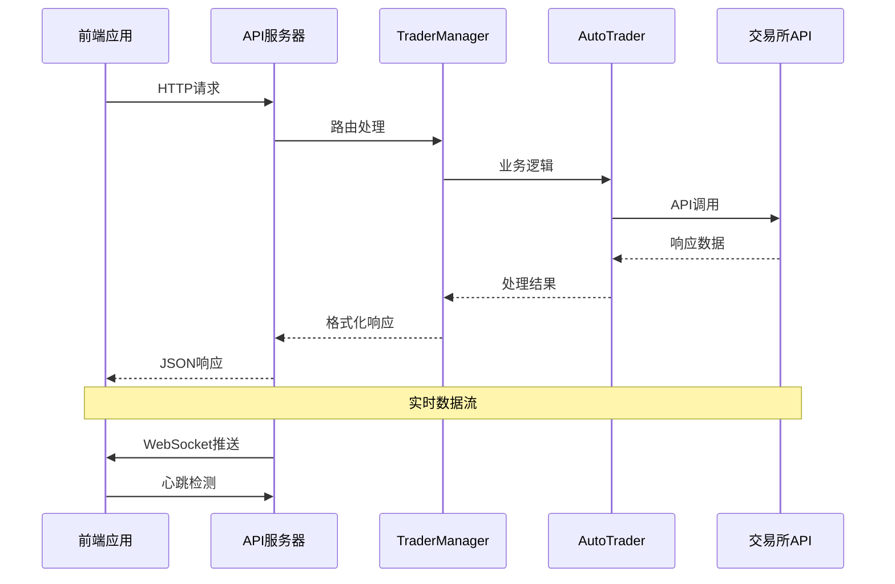

# nofx项目依赖关系详细文档

<cite>
**本文档引用的文件**
- [go.mod](file://go.mod)
- [web/package.json](file://web/package.json)
- [main.go](file://main.go)
- [api/server.go](file://api/server.go)
- [manager/trader_manager.go](file://manager/trader_manager.go)
- [trader/binance_futures.go](file://trader/binance_futures.go)
- [trader/hyperliquid_trader.go](file://trader/hyperliquid_trader.go)
- [mcp/client.go](file://mcp/client.go)
- [web/src/lib/api.ts](file://web/src/lib/api.ts)
- [web/src/App.tsx](file://web/src/App.tsx)
- [web/src/components/EquityChart.tsx](file://web/src/components/EquityChart.tsx)
- [web/src/components/CompetitionPage.tsx](file://web/src/components/CompetitionPage.tsx)
- [web/src/types/index.ts](file://web/src/types/index.ts)
- [pool/coin_pool.go](file://pool/coin_pool.go)
</cite>

## 目录
1. [项目概述](#项目概述)
2. [后端依赖关系](#后端依赖关系)
3. [前端依赖关系](#前端依赖关系)
4. [内部组件依赖关系](#内部组件依赖关系)
5. [依赖图谱](#依赖图谱)
6. [总结](#总结)

## 项目概述

nofx是一个基于AI的加密货币交易竞赛系统，采用前后端分离架构。后端使用Go语言开发，提供RESTful API服务；前端使用React + TypeScript构建现代化的Web界面。该项目集成了多个交易所API，支持多种AI模型，并提供了完整的交易监控和数据分析功能。

## 后端依赖关系

### Gin框架 - HTTP API服务核心

**依赖定义**: `github.com/gin-gonic/gin v1.11.0`

**使用位置**: [api/server.go](file://api/server.go#L1-L50)

**具体用途**:
- 创建高性能的HTTP API服务器
- 处理RESTful API请求路由
- 实现CORS中间件支持跨域访问
- 提供统一的请求处理和响应格式

**关键特性**:
- Release模式优化，减少日志输出
- 内置中间件支持（CORS、日志等）
- 高性能路由匹配
- 支持JSON、XML等格式的自动序列化

**图表来源**
- [api/server.go](file://api/server.go#L15-L35)

### go-binance库 - 币安交易所集成

**依赖定义**: `github.com/adshao/go-binance/v2 v2.8.7`

**使用位置**: [trader/binance_futures.go](file://trader/binance_futures.go#L1-L30)

**具体用途**:
- 币安期货交易所API集成
- 账户余额查询和缓存
- 持仓信息获取和管理
- 订单创建和取消操作
- 市场价格获取和精度处理

**关键功能模块**:
- 账户管理：余额查询、保证金模式设置
- 交易执行：开仓、平仓、止损止盈
- 风险控制：杠杆设置、仓位计算
- 数据缓存：15秒缓存机制优化API调用

**图表来源**
- [trader/binance_futures.go](file://trader/binance_futures.go#L35-L80)

### go-hyperliquid库 - Hyperliquid交易所集成

**依赖定义**: `github.com/sonirico/go-hyperliquid v0.17.0`

**使用位置**: [trader/hyperliquid_trader.go](file://trader/hyperliquid_trader.go#L1-L30)

**具体用途**:
- Hyperliquid永续合约交易所API集成
- 账户状态查询和管理
- 市场深度和价格获取
- 订单执行和仓位管理
- 精度处理和价格格式化

**特殊处理**:
- 5位有效数字的价格精度要求
- 币种符号格式转换（BTCUSDT ↔ BTC）
- 触发订单（止损止盈）支持
- 逐仓模式保证金管理

### sync包 - 并发控制

**内置包**: `golang.org/x/sync v0.17.0`

**使用位置**: [manager/trader_manager.go](file://manager/trader_manager.go#L1-L20), [trader/binance_futures.go](file://trader/binance_futures.go#L1-L25)

**具体用途**:
- TraderManager的线程安全保护
- 币安交易器的缓存并发控制
- 多trader实例的并发管理
- 读写锁优化高并发场景

**关键实现**:
- `sync.RWMutex`用于TraderManager的读写保护
- `sync.RWMutex`用于币安交易器的缓存读写
- Goroutine安全的trader启动和停止

**节来源**
- [manager/trader_manager.go](file://manager/trader_manager.go#L10-L25)
- [trader/binance_futures.go](file://trader/binance_futures.go#L15-L30)

## 前端依赖关系

### React和TypeScript - 用户界面基础

**依赖定义**: 
- `react`: "^18.3.1"
- `react-dom`: "^18.3.1"
- `@types/react`: "^18.3.17"
- `@types/react-dom`: "^18.3.5"

**使用位置**: [web/src/App.tsx](file://web/src/App.tsx#L1-L10), [web/src/types/index.ts](file://web/src/types/index.ts#L1-L20)

**具体用途**:
- React 18新特性支持（并发渲染、流式SSR等）
- 类型安全的组件开发
- 组件生命周期管理和状态管理
- JSX语法糖简化UI开发

**架构特点**:
- 函数式组件和Hooks模式
- 类型安全的props和状态
- 组件间通信和状态共享
- 性能优化的memoization

### Zustand - 状态管理

**依赖定义**: `zustand`: "^5.0.2"

**使用位置**: [web/src/App.tsx](file://web/src/App.tsx#L1-L10)

**具体用途**:
- 全局状态管理（语言切换、页面状态）
- 简洁的状态更新模式
- 无Provider包装的轻量级状态
- 时间旅行调试支持

**优势特点**:
- 类型安全的状态定义
- 函数式的状态更新
- 高性能的订阅机制
- 开发工具友好的API

### Recharts - 图表可视化

**依赖定义**: `recharts`: "^2.15.2"

**使用位置**: [web/src/components/EquityChart.tsx](file://web/src/components/EquityChart.tsx#L1-L15), [web/src/components/CompetitionPage.tsx](file://web/src/components/CompetitionPage.tsx#L1-L15)

**具体用途**:
- 账户权益曲线图表绘制
- 实时交易数据可视化
- 多维度数据对比展示
- 响应式图表布局

**图表类型**:
- 折线图：权益走势、收益曲线
- 柱状图：交易统计、持仓分布
- 饼图：资产配置比例
- 散点图：性能对比分析

### Tailwind CSS - 样式设计

**依赖定义**: `tailwindcss`: "^3.4.17"

**使用位置**: [web/tailwind.config.js](file://web/tailwind.config.js#L1-L20), [web/src/App.tsx](file://web/src/App.tsx#L1-L10)

**具体用途**:
- 原子化CSS类名系统
- 响应式设计支持
- 暗色主题适配
- 自定义颜色和间距系统

**设计系统**:
- 主色调：#F0B90B（金色）
- 辅助色：#0ECB81（绿色）、#F6465D（红色）
- 字体系统：现代无衬线字体
- 间距规范：8px基础单位

### SWR - 数据获取

**依赖定义**: `swr`: "^2.2.5"

**使用位置**: [web/src/App.tsx](file://web/src/App.tsx#L1-L10), [web/src/lib/api.ts](file://web/src/lib/api.ts#L1-L20)

**具体用途**:
- React应用的数据获取和缓存
- 自动重试和错误恢复
- 离线支持和增量更新
- 数据预取和后台刷新

**核心功能**:
- HTTP请求的自动缓存
- 网络状态感知的重试
- 浏览器标签页焦点时的数据同步
- 自动去重和批量请求优化

**节来源**
- [web/src/App.tsx](file://web/src/App.tsx#L1-L20)
- [web/src/lib/api.ts](file://web/src/lib/api.ts#L1-L30)

## 内部组件依赖关系

### 主程序入口依赖

**图表来源**
- [main.go](file://main.go#L20-L50)
- [manager/trader_manager.go](file://manager/trader_manager.go#L15-L25)

### TraderManager依赖结构

**核心组件**:
- `TraderManager`: 中央控制器
- `AutoTrader`: 自动交易引擎
- `ExchangeClient`: 交易所抽象接口
- `DecisionLogger`: 决策日志记录

**依赖链**:
1. `main.go` → `manager.NewTraderManager()` → `trader.NewAutoTrader()`
2. `AutoTrader` → `ExchangeClient` → 具体交易所实现
3. `AutoTrader` → `DecisionLogger` → 日志文件系统

### MCP（Model Control Protocol）依赖

**AI模型集成**:
- `mcp.Client`: AI API客户端
- 支持：DeepSeek、Qwen、自定义API
- 认证：API Key、签名验证
- 错误处理：重试机制、超时控制

**节来源**
- [main.go](file://main.go#L40-L80)
- [manager/trader_manager.go](file://manager/trader_manager.go#L25-L60)
- [mcp/client.go](file://mcp/client.go#L1-L50)

## 依赖图谱

### 后端完整依赖图

**图表来源**
- [go.mod](file://go.mod#L5-L15)
- [api/server.go](file://api/server.go#L1-L20)
- [manager/trader_manager.go](file://manager/trader_manager.go#L1-L20)

### 前端完整依赖图

**图表来源**
- [web/package.json](file://web/package.json#L1-L30)

### 组件间通信依赖

**图表来源**
- [web/src/lib/api.ts](file://web/src/lib/api.ts#L1-L50)
- [api/server.go](file://api/server.go#L50-L100)

## 总结

nofx项目的依赖关系体现了现代软件开发的最佳实践：

### 后端架构优势
- **模块化设计**: 清晰的分层架构，职责分离明确
- **异步处理**: Gin框架提供高性能HTTP服务
- **并发安全**: sync包确保多线程环境下的数据一致性
- **扩展性**: 插件化的交易所和AI模型支持

### 前端架构优势
- **现代化技术栈**: React + TypeScript + Vite组合
- **状态管理**: Zustand提供简洁的全局状态解决方案
- **数据获取**: SWR优化用户体验和性能
- **可视化**: Recharts提供丰富的图表功能

### 内部组件协作
- **松耦合设计**: 通过接口抽象实现组件解耦
- **依赖注入**: 易于测试和维护的架构
- **错误处理**: 统一的错误传播和恢复机制

这种依赖关系设计使得nofx项目具有良好的可维护性、可扩展性和可测试性，为AI驱动的交易竞赛系统提供了坚实的技术基础。