# 内部组件依赖

<cite>
**本文档引用的文件**
- [main.go](file://main.go)
- [config/config.go](file://config/config.go)
- [manager/trader_manager.go](file://manager/trader_manager.go)
- [trader/auto_trader.go](file://trader/auto_trader.go)
- [trader/binance_futures.go](file://trader/binance_futures.go)
- [trader/hyperliquid_trader.go](file://trader/hyperliquid_trader.go)
- [trader/interface.go](file://trader/interface.go)
- [mcp/client.go](file://mcp/client.go)
- [market/data.go](file://market/data.go)
- [pool/coin_pool.go](file://pool/coin_pool.go)
</cite>

## 目录
1. [项目概述](#项目概述)
2. [核心组件架构](#核心组件架构)
3. [依赖关系分析](#依赖关系分析)
4. [程序入口分析](#程序入口分析)
5. [配置管理系统](#配置管理系统)
6. [交易管理器](#交易管理器)
7. [自动交易器](#自动交易器)
8. [交易所适配器](#交易所适配器)
9. [AI通信模块](#ai通信模块)
10. [市场数据模块](#市场数据模块)
11. [币种池管理](#币种池管理)
12. [分层设计优势](#分层设计优势)
13. [扩展性分析](#扩展性分析)
14. [总结](#总结)

## 项目概述

nofx是一个基于人工智能的加密货币交易竞赛系统，支持多个AI模型（Qwen、DeepSeek）与多个交易所（币安、Hyperliquid、Aster）的自动交易。系统采用分层架构设计，通过清晰的依赖关系实现高度的模块化和可扩展性。

## 核心组件架构

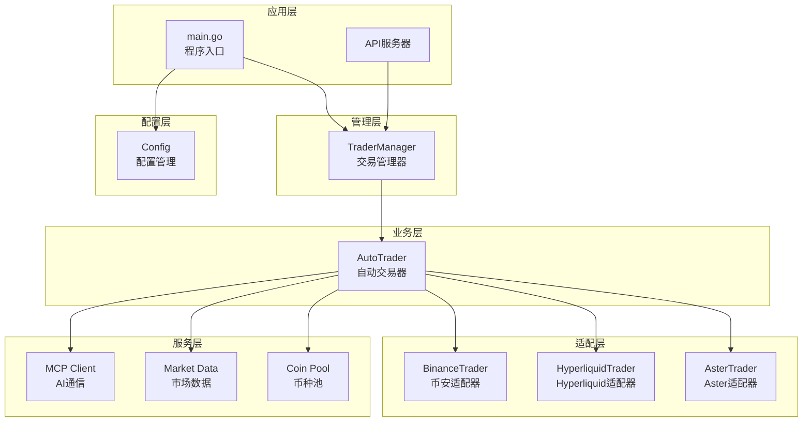

**图表来源**
- [main.go](file://main.go#L1-L140)
- [manager/trader_manager.go](file://manager/trader_manager.go#L1-L173)
- [trader/auto_trader.go](file://trader/auto_trader.go#L1-L936)

## 依赖关系分析

系统遵循严格的单向依赖原则，形成了清晰的层次结构：

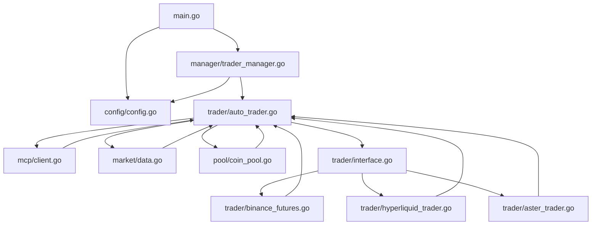

**图表来源**
- [main.go](file://main.go#L1-L20)
- [manager/trader_manager.go](file://manager/trader_manager.go#L1-L30)
- [trader/auto_trader.go](file://trader/auto_trader.go#L1-L50)

**章节来源**
- [main.go](file://main.go#L1-L140)
- [config/config.go](file://config/config.go#L1-L202)
- [manager/trader_manager.go](file://manager/trader_manager.go#L1-L173)

## 程序入口分析

main.go作为程序的唯一入口点，负责系统的初始化和协调：

### 初始化流程

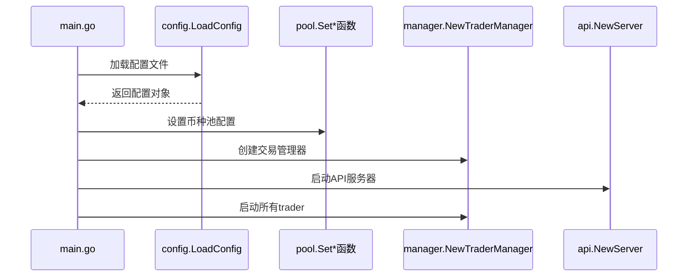

**图表来源**
- [main.go](file://main.go#L15-L120)

### 核心初始化步骤

1. **配置加载**：从命令行参数或默认路径加载配置文件
2. **币种池配置**：设置默认币种列表和API URL
3. **交易管理器创建**：初始化TraderManager实例
4. **API服务器启动**：提供RESTful API接口
5. **交易员注册**：根据配置添加启用的交易员
6. **系统启动**：开始所有交易员的运行循环

**章节来源**
- [main.go](file://main.go#L15-L140)

## 配置管理系统

config模块负责系统配置的加载、验证和管理：

### 配置结构设计

| 配置项 | 类型 | 描述 | 默认值 |
|--------|------|------|--------|
| Traders | []TraderConfig | 交易员配置列表 | 必填 |
| UseDefaultCoins | bool | 是否使用默认币种池 | false |
| DefaultCoins | []string | 默认主流币种列表 | BTCUSDT,ETHUSDT等 |
| CoinPoolAPIURL | string | 币种池API地址 | "" |
| APIServerPort | int | API服务器端口 | 8080 |
| MaxDailyLoss | float64 | 最大日亏损限制 | 0 |
| MaxDrawdown | float64 | 最大回撤限制 | 0 |
| Leverage | LeverageConfig | 杠杆配置 | BTC/ETH:5x, 山寨币:5x |

### 验证机制

配置系统实现了多层次的验证：

1. **必需字段验证**：检查必填字段是否为空
2. **格式验证**：验证API密钥、交易所配置等格式
3. **业务逻辑验证**：检查杠杆倍数、初始余额等业务约束
4. **互斥验证**：确保配置间的逻辑一致性

**章节来源**
- [config/config.go](file://config/config.go#L1-L202)

## 交易管理器

TraderManager作为核心协调者，管理多个AutoTrader实例：

### 核心功能

```mermaid
classDiagram
class TraderManager {
+map[string]*AutoTrader traders
+sync.RWMutex mu
+AddTrader(cfg, coinPoolURL, ...) error
+GetTrader(id string) *AutoTrader
+GetAllTraders() map[string]*AutoTrader
+StartAll() void
+StopAll() void
+GetComparisonData() map[string]interface{}
}
class AutoTrader {
+string id
+string name
+string aiModel
+Trader trader
+mcp.Client mcpClient
+Run() error
+Stop() void
}
TraderManager --> AutoTrader : manages
```

**图表来源**
- [manager/trader_manager.go](file://manager/trader_manager.go#L10-L50)
- [trader/auto_trader.go](file://trader/auto_trader.go#L60-L120)

### 管理策略

1. **并发安全**：使用读写锁保护并发访问
2. **生命周期管理**：统一管理交易员的启动和停止
3. **状态监控**：提供实时的状态查询和性能统计
4. **资源隔离**：确保不同交易员之间的资源隔离

**章节来源**
- [manager/trader_manager.go](file://manager/trader_manager.go#L1-L173)

## 自动交易器

AutoTrader是系统的核心业务逻辑单元，负责AI驱动的交易决策：

### 组件依赖关系

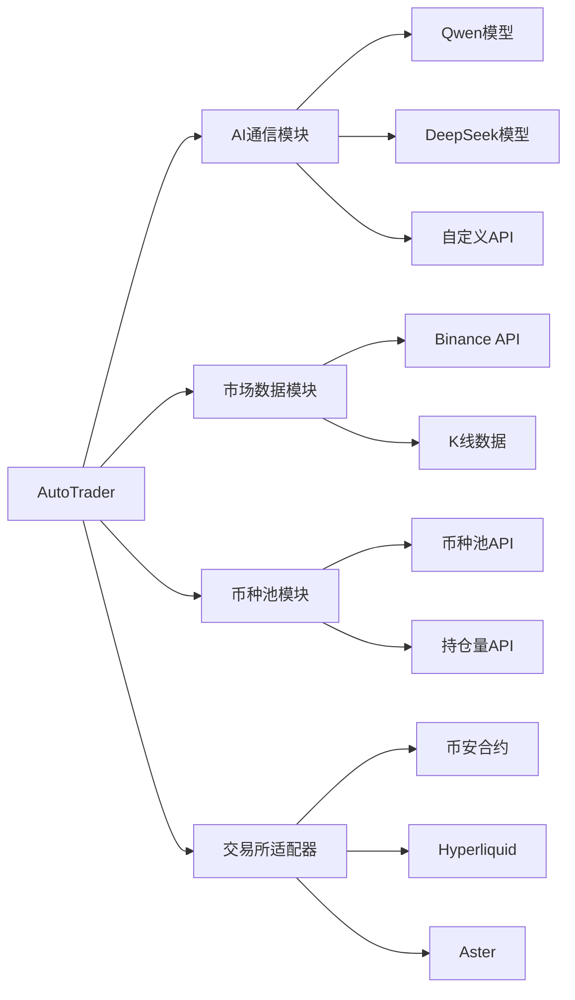

**图表来源**
- [trader/auto_trader.go](file://trader/auto_trader.go#L100-L200)
- [mcp/client.go](file://mcp/client.go#L1-L50)
- [market/data.go](file://market/data.go#L1-L50)
- [pool/coin_pool.go](file://pool/coin_pool.go#L1-L50)

### 交易决策流程

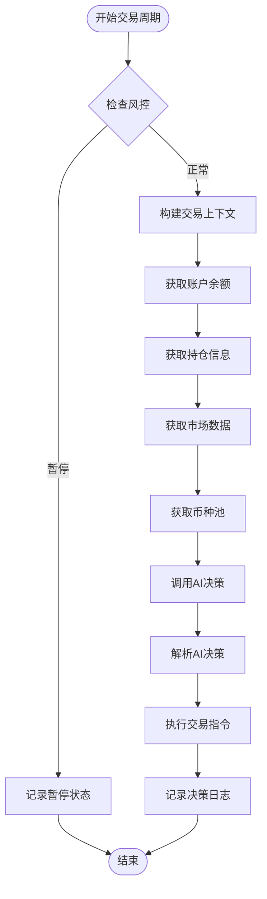

**图表来源**
- [trader/auto_trader.go](file://trader/auto_trader.go#L300-L500)

**章节来源**
- [trader/auto_trader.go](file://trader/auto_trader.go#L1-L936)

## 交易所适配器

系统通过统一的Trader接口支持多个交易所：

### 接口设计

```mermaid
classDiagram
class Trader {
<<interface>>
+GetBalance() map[string]interface{}
+GetPositions() []map[string]interface{}
+OpenLong(symbol, quantity, leverage) map[string]interface{}
+OpenShort(symbol, quantity, leverage) map[string]interface{}
+CloseLong(symbol, quantity) map[string]interface{}
+CloseShort(symbol, quantity) map[string]interface{}
+SetLeverage(symbol, leverage) error
+GetMarketPrice(symbol) float64
+SetStopLoss(symbol, side, quantity, price) error
+SetTakeProfit(symbol, side, quantity, price) error
+CancelAllOrders(symbol) error
+FormatQuantity(symbol, quantity) string
}
class FuturesTrader {
+client *futures.Client
+cachedBalance map[string]interface{}
+balanceCacheTime time.Time
+GetBalance() map[string]interface{}
+OpenLong() map[string]interface{}
+SetLeverage() error
}
class HyperliquidTrader {
+exchange *hyperliquid.Exchange
+ctx context.Context
+walletAddr string
+GetBalance() map[string]interface{}
+OpenLong() map[string]interface{}
+SetLeverage() error
}
Trader <|.. FuturesTrader
Trader <|.. HyperliquidTrader
```

**图表来源**
- [trader/interface.go](file://trader/interface.go#L1-L42)
- [trader/binance_futures.go](file://trader/binance_futures.go#L15-L50)
- [trader/hyperliquid_trader.go](file://trader/hyperliquid_trader.go#L15-L50)

### 适配器特性

1. **统一接口**：所有交易所适配器实现相同的Trader接口
2. **缓存机制**：减少API调用频率，提高响应速度
3. **错误处理**：统一的错误处理和重试机制
4. **精度控制**：自动处理不同交易所的数量和价格精度

**章节来源**
- [trader/interface.go](file://trader/interface.go#L1-L42)
- [trader/binance_futures.go](file://trader/binance_futures.go#L1-L615)
- [trader/hyperliquid_trader.go](file://trader/hyperliquid_trader.go#L1-L682)

## AI通信模块

MCP（Model Communication Protocol）客户端负责与AI模型的通信：

### 支持的AI提供商

| 提供商 | API类型 | 特点 | 配置要求 |
|--------|---------|------|----------|
| DeepSeek | OpenAI兼容 | 高性价比 | API密钥 |
| Qwen | 阿里云 | 中文优化 | API密钥 + Secret |
| Custom | 自定义 | 灵活定制 | 完整URL + 密钥 |

### 通信流程

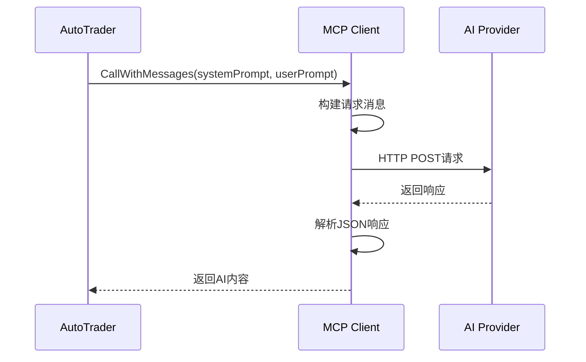

**图表来源**
- [mcp/client.go](file://mcp/client.go#L80-L150)

### 错误处理机制

1. **重试机制**：网络错误自动重试3次
2. **超时控制**：默认120秒超时，支持自定义
3. **格式验证**：确保AI返回的是有效的JSON格式
4. **降级策略**：AI通信失败时的备用方案

**章节来源**
- [mcp/client.go](file://mcp/client.go#L1-L247)

## 市场数据模块

Market模块提供实时和历史市场数据：

### 数据源整合

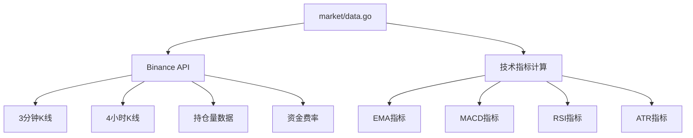

**图表来源**
- [market/data.go](file://market/data.go#L50-L150)

### 技术指标计算

| 指标类型 | 时间框架 | 计算周期 | 用途 |
|----------|----------|----------|------|
| EMA | 3分钟/4小时 | 20周期 | 趋势判断 |
| MACD | 3分钟 | 12/26周期 | 动量分析 |
| RSI | 3分钟 | 7/14周期 | 超买超卖 |
| ATR | 3分钟/4小时 | 3/14周期 | 波动率衡量 |
| Open Interest | 实时 | 实时 | 流动性指标 |

**章节来源**
- [market/data.go](file://market/data.go#L1-L553)

## 币种池管理

Pool模块管理可交易的币种池，支持多种数据源：

### 数据源组合

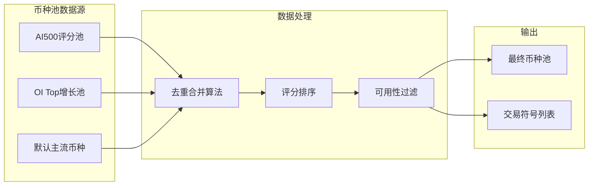

**图表来源**
- [pool/coin_pool.go](file://pool/coin_pool.go#L600-L646)

### 缓存策略

1. **本地缓存**：避免频繁API调用
2. **失效检测**：24小时缓存有效期
3. **降级机制**：API失败时使用历史缓存
4. **容错处理**：默认主流币种作为最后保障

**章节来源**
- [pool/coin_pool.go](file://pool/coin_pool.go#L1-L646)

## 分层设计优势

### 解耦合效果

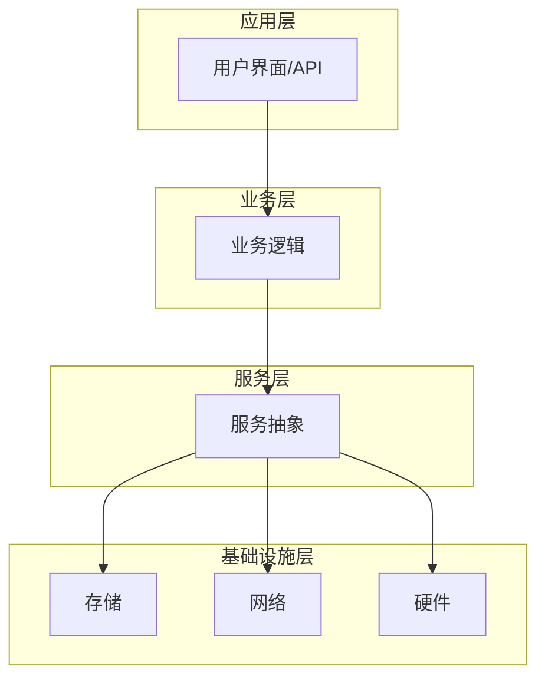

### 主要优势

1. **模块化开发**：每个层级专注于特定职责
2. **易于测试**：依赖注入便于单元测试
3. **可维护性**：清晰的边界减少代码耦合
4. **可扩展性**：新增功能不影响现有代码

## 扩展性分析

### 新增交易所示例

假设要添加一个新的交易所支持：

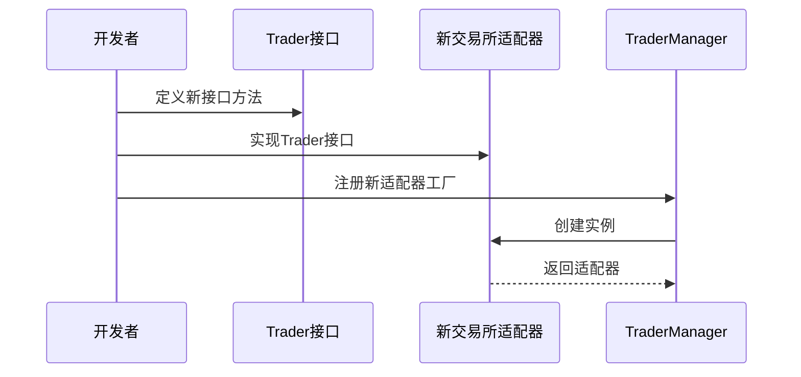

### 扩展步骤

1. **接口实现**：在trader/interface.go基础上实现新方法
2. **适配器开发**：创建新的交易器结构体
3. **配置支持**：更新config模块支持新交易所
4. **测试验证**：编写单元测试和集成测试
5. **部署集成**：更新main.go中的工厂函数

### 新增AI模型示例

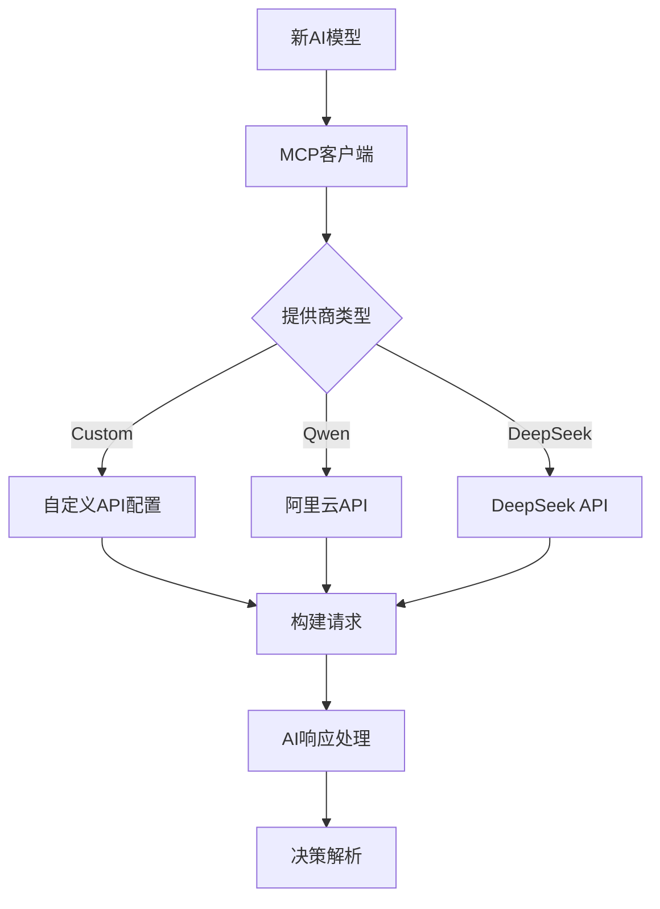

**图表来源**
- [mcp/client.go](file://mcp/client.go#L20-L80)

## 总结

nofx项目通过精心设计的分层架构和清晰的依赖关系，实现了高度模块化和可扩展的AI交易系统。主要特点包括：

### 架构优势

1. **清晰的依赖流向**：严格遵循单向依赖原则
2. **高度解耦**：各模块间松耦合，便于独立开发和测试
3. **强大扩展性**：新功能可通过标准化接口轻松集成
4. **健壮性设计**：完善的错误处理和降级机制

### 设计模式应用

1. **工厂模式**：TraderManager统一管理交易器创建
2. **策略模式**：不同交易所使用不同的交易策略
3. **观察者模式**：API服务器监听系统状态变化
4. **适配器模式**：统一不同交易所的API接口

### 最佳实践

1. **单一职责**：每个模块专注单一功能领域
2. **依赖倒置**：高层模块不依赖低层模块的具体实现
3. **开闭原则**：对扩展开放，对修改关闭
4. **接口隔离**：使用细粒度的接口定义

这种设计使得nofx系统能够在保持稳定性和可维护性的同时，快速适应新的交易所和AI模型需求，为未来的功能扩展奠定了坚实的基础。