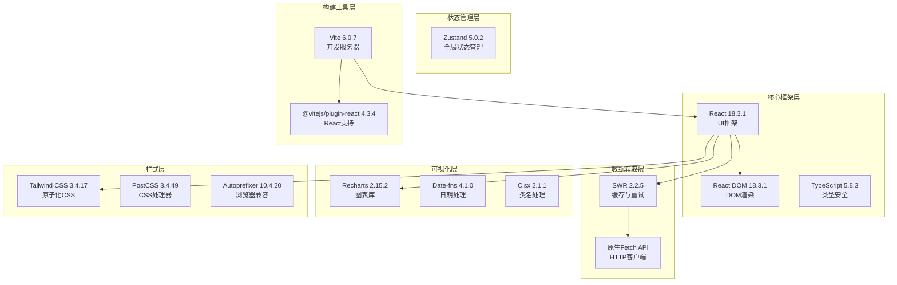
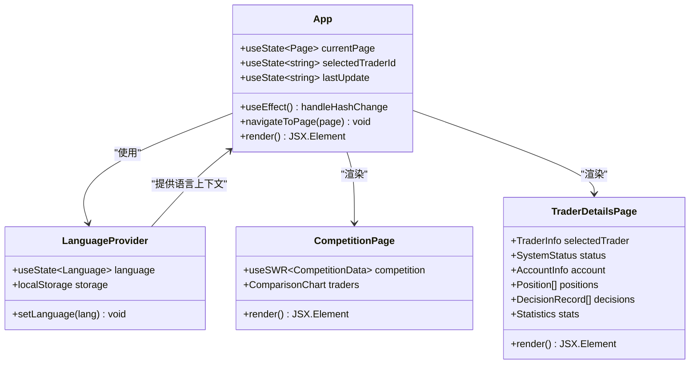
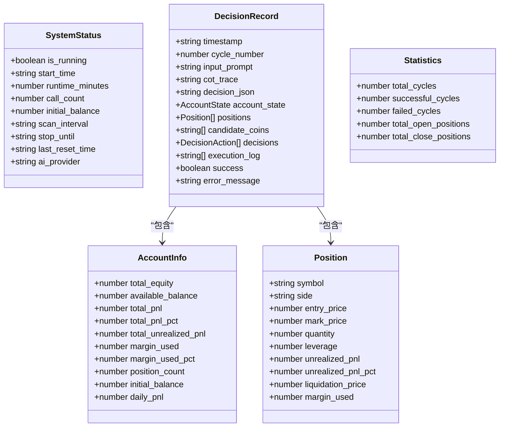
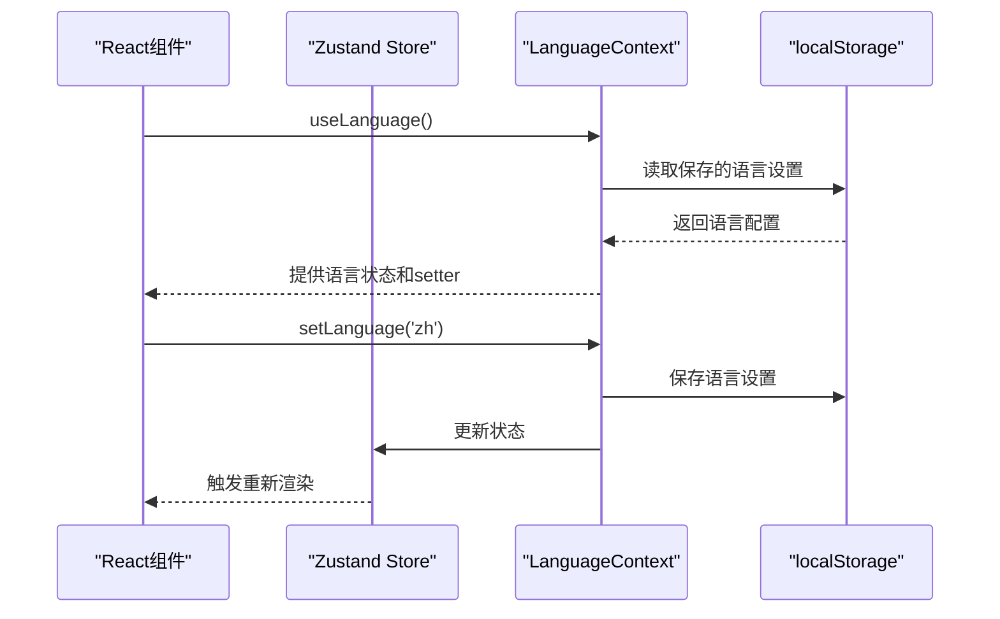
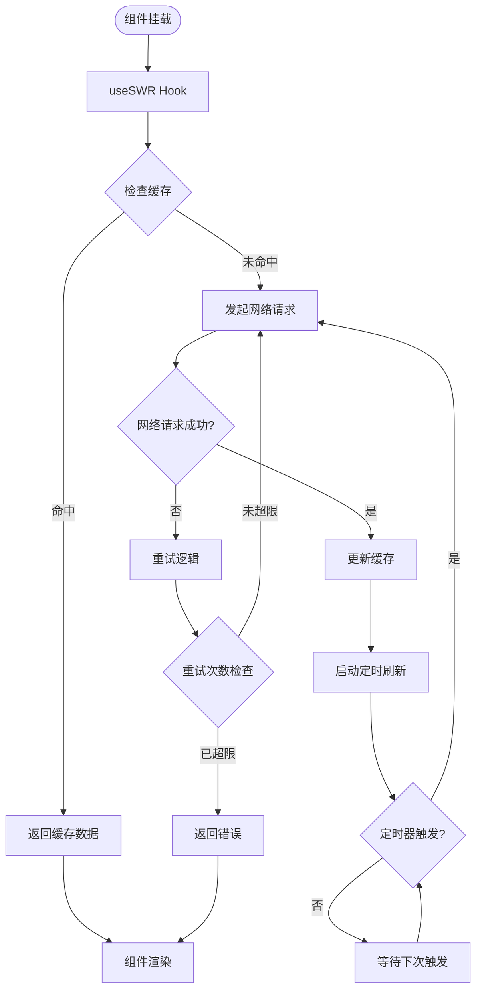
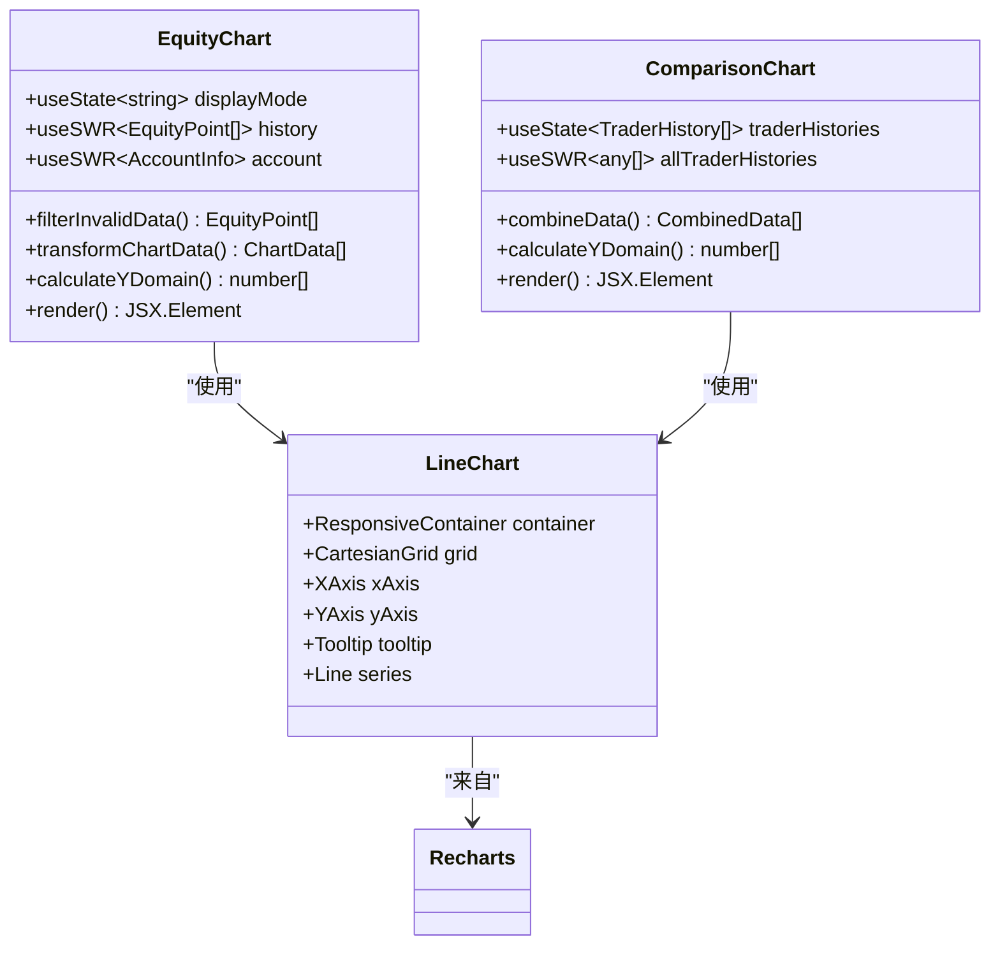
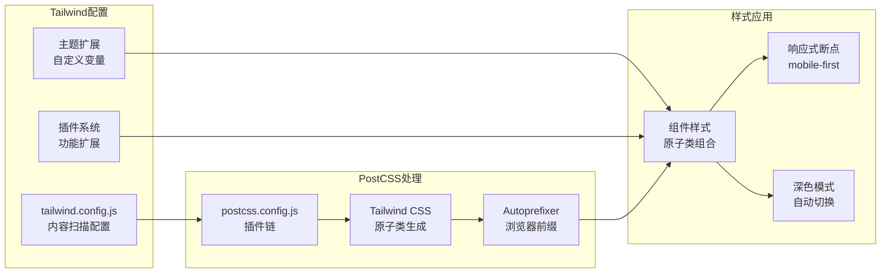
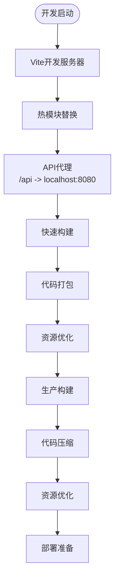
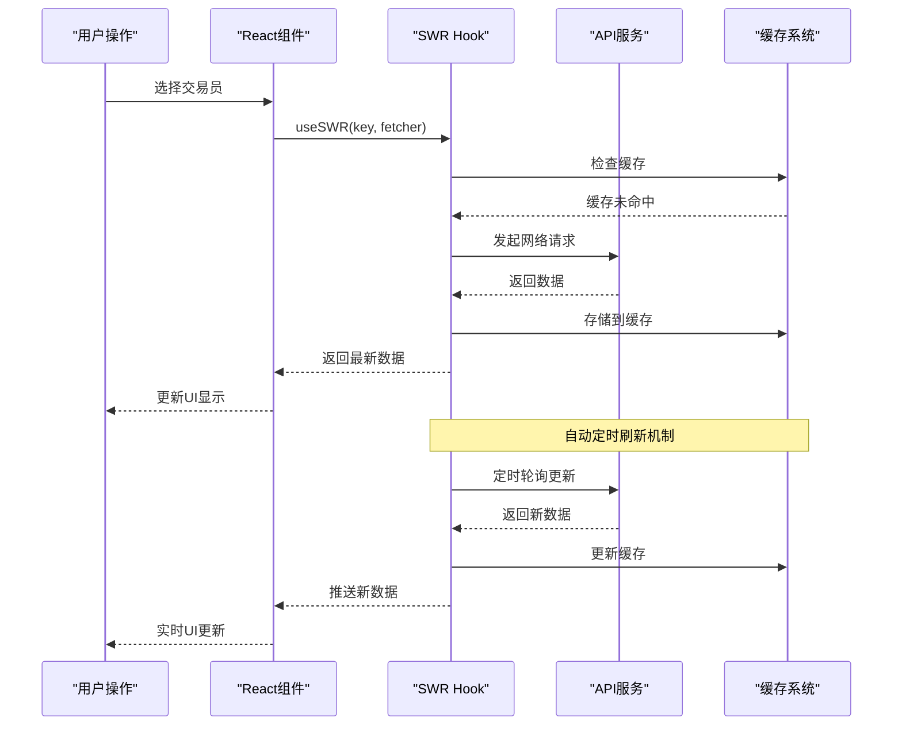

# nofx项目前端依赖详细文档

<cite>
**本文档中引用的文件**
- [package.json](file://web/package.json)
- [App.tsx](file://web/src/App.tsx)
- [api.ts](file://web/src/lib/api.ts)
- [EquityChart.tsx](file://web/src/components/EquityChart.tsx)
- [ComparisonChart.tsx](file://web/src/components/ComparisonChart.tsx)
- [CompetitionPage.tsx](file://web/src/components/CompetitionPage.tsx)
- [LanguageContext.tsx](file://web/src/contexts/LanguageContext.tsx)
- [vite.config.ts](file://web/vite.config.ts)
- [tailwind.config.js](file://web/tailwind.config.js)
- [postcss.config.js](file://web/postcss.config.js)
- [tsconfig.json](file://web/tsconfig.json)
- [types/index.ts](file://web/src/types/index.ts)
- [traderColors.ts](file://web/src/utils/traderColors.ts)
</cite>

## 目录
1. [项目概述](#项目概述)
2. [核心依赖分析](#核心依赖分析)
3. [React 18架构](#react-18架构)
4. [TypeScript类型系统](#typescript类型系统)
5. [状态管理 - Zustand](#状态管理---zustand)
6. [API数据管理 - SWR](#api数据管理---swr)
7. [数据可视化 - Recharts](#数据可视化---recharts)
8. [样式系统 - Tailwind CSS](#样式系统---tailwind-css)
9. [开发工具链](#开发工具链)
10. [集成模式与最佳实践](#集成模式与最佳实践)
11. [性能优化策略](#性能优化策略)
12. [总结](#总结)

## 项目概述

nofx项目是一个基于React 18的加密货币交易竞赛平台，采用现代化的前端技术栈构建。项目通过精心设计的依赖组合，实现了高性能、可维护的用户体验界面，专注于实时交易数据展示和AI交易模型对比分析。

## 核心依赖分析

### 依赖关系概览

**图表来源**
- [package.json](file://web/package.json#L10-L20)
- [vite.config.ts](file://web/vite.config.ts#L1-L17)

### 版本约束与安装方式

项目采用严格的版本控制策略，确保依赖的稳定性和兼容性：

| 依赖包 | 版本约束 | 安装方式 | 用途描述 |
|--------|----------|----------|----------|
| react | ^18.3.1 | npm install react@^18.3.1 | 核心UI框架，提供组件化开发能力 |
| react-dom | ^18.3.1 | npm install react-dom@^18.3.1 | React DOM绑定，处理虚拟DOM渲染 |
| zustand | ^5.0.2 | npm install zustand@^5.0.2 | 全局状态管理，替代Redux的轻量级解决方案 |
| swr | ^2.2.5 | npm install swr@^2.2.5 | 数据获取与缓存，提供智能重试机制 |
| recharts | ^2.15.2 | npm install recharts@^2.15.2 | 图表可视化，支持复杂的金融数据展示 |
| date-fns | ^4.1.0 | npm install date-fns@^4.1.0 | 日期处理工具，提供函数式日期操作 |
| clsx | ^2.1.1 | npm install clsx@^2.1.1 | 条件类名组合，简化动态样式处理 |

**章节来源**
- [package.json](file://web/package.json#L10-L20)

## React 18架构

### 应用根组件设计

React 18作为核心UI框架，在App.tsx中构建了完整的应用架构。应用采用函数式组件和Hooks模式，实现了声明式的UI开发。

**图表来源**
- [App.tsx](file://web/src/App.tsx#L15-L50)
- [LanguageContext.tsx](file://web/src/contexts/LanguageContext.tsx#L10-L25)

### 页面路由与状态管理

应用实现了基于URL hash的页面导航机制，支持竞赛页面和交易员详情页面之间的无缝切换：

- **竞赛页面** (`#` 或 `#competition`)：展示AI交易模型对比和排行榜
- **交易员详情页面** (`#trader`)：展示单个交易员的详细交易数据

页面状态通过`window.location.hash`进行同步，确保页面刷新后仍能保持正确的视图状态。

**章节来源**
- [App.tsx](file://web/src/App.tsx#L25-L45)

## TypeScript类型系统

### 类型定义架构

项目采用强类型的TypeScript设计，通过完善的类型系统确保代码质量和开发体验。

**图表来源**
- [types/index.ts](file://web/src/types/index.ts#L1-L94)

### 类型安全的数据流

TypeScript在数据获取、状态管理和组件通信中发挥重要作用：

1. **API响应类型验证**：每个API端点都有对应的TypeScript接口
2. **组件属性类型检查**：确保父子组件间的数据传递正确
3. **状态管理类型约束**：Zustand状态存储的类型安全保证
4. **图表数据类型化**：Recharts图表组件的严格类型要求

**章节来源**
- [types/index.ts](file://web/src/types/index.ts#L1-L94)

## 状态管理 - Zustand

### 全局状态架构

虽然项目主要依赖SWR进行数据获取，但在语言本地化等场景中使用Zustand实现全局状态管理。

**图表来源**
- [LanguageContext.tsx](file://web/src/contexts/LanguageContext.tsx#L10-L30)

### 状态管理模式

Zustand在项目中的应用场景：
- **语言本地化**：管理用户选择的语言偏好
- **主题切换**：控制深色/浅色主题切换
- **用户设置**：存储个性化配置选项

状态更新通过`localStorage`持久化，确保用户偏好在页面刷新后仍然保持。

**章节来源**
- [LanguageContext.tsx](file://web/src/contexts/LanguageContext.tsx#L1-L38)

## API数据管理 - SWR

### 数据获取架构

SWR是项目的核心数据管理解决方案，提供了智能的缓存、重试和实时更新机制。

**图表来源**
- [App.tsx](file://web/src/App.tsx#L60-L120)
- [api.ts](file://web/src/lib/api.ts#L1-L114)

### API调用模式

项目中的API调用遵循统一的模式，通过SWR实现高效的数据管理：

#### 实时数据获取
- **交易员列表** (`/api/traders`)：10秒轮询刷新
- **系统状态** (`/api/status`)：15秒轮询刷新
- **账户信息** (`/api/account`)：15秒轮询刷新

#### 历史数据获取
- **持仓列表** (`/api/positions`)：15秒轮询刷新
- **决策日志** (`/api/decisions`)：30秒轮询刷新
- **统计信息** (`/api/statistics`)：30秒轮询刷新

#### 性能优化策略
- **数据去重**：10秒内相同请求不重复发送
- **焦点重验证**：禁用标签页切换时的自动刷新
- **缓存策略**：智能缓存机制减少不必要的网络请求

**章节来源**
- [App.tsx](file://web/src/App.tsx#L60-L120)
- [api.ts](file://web/src/lib/api.ts#L1-L114)

## 数据可视化 - Recharts

### 图表组件架构

Recharts提供了强大的数据可视化能力，项目中主要用于收益率曲线和对比图表的展示。

**图表来源**
- [EquityChart.tsx](file://web/src/components/EquityChart.tsx#L20-L80)
- [ComparisonChart.tsx](file://web/src/components/ComparisonChart.tsx#L15-L50)

### 可视化特性

#### EquityChart（收益曲线图）
- **双模式显示**：美元金额和百分比两种显示模式
- **性能优化**：限制最多显示2000个数据点
- **交互功能**：自定义Tooltip提供详细数据信息
- **动态配色**：根据盈利情况调整线条颜色

#### ComparisonChart（对比图表）
- **多线对比**：支持多个AI模型的收益曲线对比
- **时间轴对齐**：基于时间戳而非周期号进行数据合并
- **智能配色**：统一的颜色分配算法确保视觉一致性
- **实时更新**：30秒自动刷新机制

**章节来源**
- [EquityChart.tsx](file://web/src/components/EquityChart.tsx#L1-L303)
- [ComparisonChart.tsx](file://web/src/components/ComparisonChart.tsx#L1-L345)

## 样式系统 - Tailwind CSS

### 响应式设计架构

Tailwind CSS结合PostCSS提供了强大的原子化CSS解决方案，支持从移动端到桌面端的完整响应式设计。

**图表来源**
- [tailwind.config.js](file://web/tailwind.config.js#L1-L12)
- [postcss.config.js](file://web/postcss.config.js#L1-L7)

### 设计系统特性

#### 原子化CSS优势
- **开发效率**：无需编写CSS，直接在HTML中组合类名
- **维护成本**：集中化的样式配置，便于统一修改
- **性能优化**：仅生成实际使用的CSS类
- **响应式设计**：内置移动优先的响应式断点

#### 自定义样式规范
- **颜色系统**：基于项目主题的色彩体系
- **间距规范**：统一的间距单位和布局标准
- **字体排版**：分级的字体大小和字重系统
- **组件样式**：预定义的组件样式模板

**章节来源**
- [tailwind.config.js](file://web/tailwind.config.js#L1-L12)
- [postcss.config.js](file://web/postcss.config.js#L1-L7)

## 开发工具链

### Vite 6构建系统

Vite作为现代前端构建工具，在项目中提供了快速的开发体验和高效的生产构建。

**图表来源**
- [vite.config.ts](file://web/vite.config.ts#L1-L17)

### TypeScript配置

项目采用严格的TypeScript配置，确保代码质量和开发体验：

#### 编译器选项
- **目标版本**：ES2020，支持现代JavaScript特性
- **模块系统**：ESNext，配合Vite的模块解析
- **JSX处理**：react-jsx，支持React 18的新JSX转换
- **严格模式**：启用所有严格类型检查选项

#### 开发配置
- **模块解析**：bundler模式，避免模块冲突
- **类型检查**：跳过库文件类型检查
- **增量编译**：提高开发时的编译速度
- **孤立模块**：防止未使用的代码被意外引入

**章节来源**
- [vite.config.ts](file://web/vite.config.ts#L1-L17)
- [tsconfig.json](file://web/tsconfig.json#L1-L26)

## 集成模式与最佳实践

### 状态管理与API请求联动

项目展示了状态管理与API请求的完美结合，体现了现代前端架构的最佳实践。

**图表来源**
- [App.tsx](file://web/src/App.tsx#L60-L120)
- [api.ts](file://web/src/lib/api.ts#L1-L114)

### 错误处理与用户体验

项目实现了完善的错误处理机制，确保在各种异常情况下都能提供良好的用户体验：

#### API错误处理
- **网络错误**：自动重试机制，最多3次重试
- **数据验证**：类型检查确保数据完整性
- **降级策略**：部分数据失败不影响整体功能

#### 用户体验优化
- **加载状态**：骨架屏和动画效果提升感知性能
- **错误提示**：友好的错误信息和恢复建议
- **状态反馈**：实时的状态指示和进度条

**章节来源**
- [App.tsx](file://web/src/App.tsx#L60-L120)
- [EquityChart.tsx](file://web/src/components/EquityChart.tsx#L40-L60)

## 性能优化策略

### 数据获取优化

项目采用了多层次的性能优化策略，确保应用在大数据量场景下的流畅运行：

#### 缓存策略
- **智能缓存**：SWR提供自动缓存管理
- **缓存失效**：基于时间的缓存策略
- **内存管理**：及时清理过期缓存数据

#### 请求优化
- **并发控制**：合理控制同时进行的请求数量
- **数据去重**：避免重复请求相同数据
- **懒加载**：按需加载非关键数据

#### 渲染优化
- **组件拆分**：细粒度组件拆分减少重渲染
- **memo优化**：使用React.memo优化组件渲染
- **虚拟滚动**：大量数据时使用虚拟滚动技术

### 图表性能优化

Recharts图表组件针对大数据量进行了专门优化：

#### 数据处理优化
- **数据采样**：大数据量时自动采样减少渲染点数
- **计算缓存**：复杂计算结果缓存避免重复计算
- **增量更新**：只更新变化的数据部分

#### 渲染优化
- **Canvas渲染**：大量数据时使用Canvas渲染
- **LOD技术**：根据缩放级别调整细节程度
- **异步渲染**：复杂图表使用Web Worker异步处理

**章节来源**
- [EquityChart.tsx](file://web/src/components/EquityChart.tsx#L80-L120)
- [ComparisonChart.tsx](file://web/src/components/ComparisonChart.tsx#L80-L120)

## 总结

nofx项目的前端依赖架构展现了现代React应用的最佳实践。通过精心选择的技术栈和合理的架构设计，项目实现了：

### 技术亮点
- **React 18**：充分利用并发特性和新的Hooks API
- **TypeScript**：提供完整的类型安全保障
- **SWR**：智能的数据获取和缓存解决方案
- **Recharts**：专业的金融数据可视化能力
- **Tailwind CSS**：高效的原子化CSS开发体验

### 架构优势
- **模块化设计**：清晰的组件分离和职责划分
- **性能优化**：多层次的性能优化策略
- **可维护性**：良好的代码组织和类型系统
- **用户体验**：流畅的交互和完善的错误处理

### 扩展性考虑
- **插件化架构**：易于添加新的图表类型和功能模块
- **配置驱动**：通过配置文件控制行为和外观
- **国际化支持**：完整的多语言支持框架
- **主题系统**：灵活的主题定制能力

这个前端架构不仅满足了当前的功能需求，还为未来的功能扩展和技术演进奠定了坚实的基础。通过持续的优化和改进，项目将继续为用户提供优秀的交易竞赛体验。