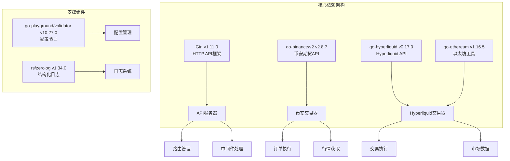
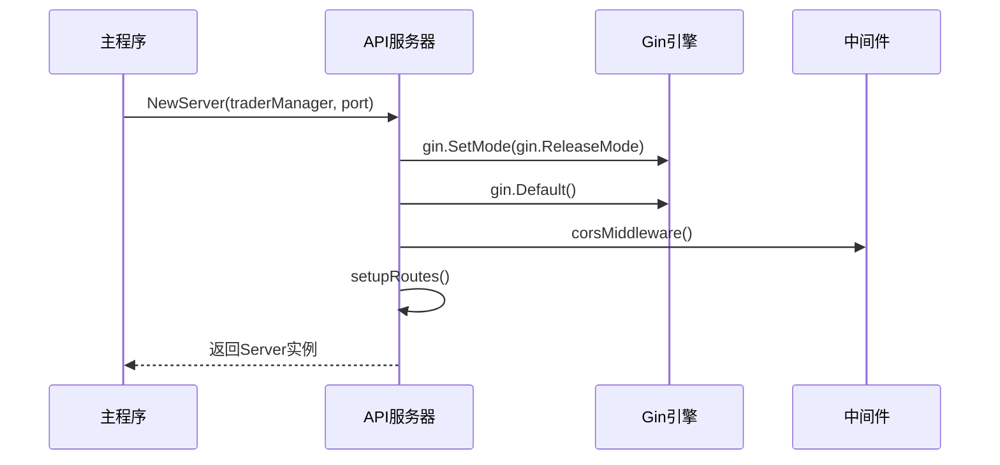
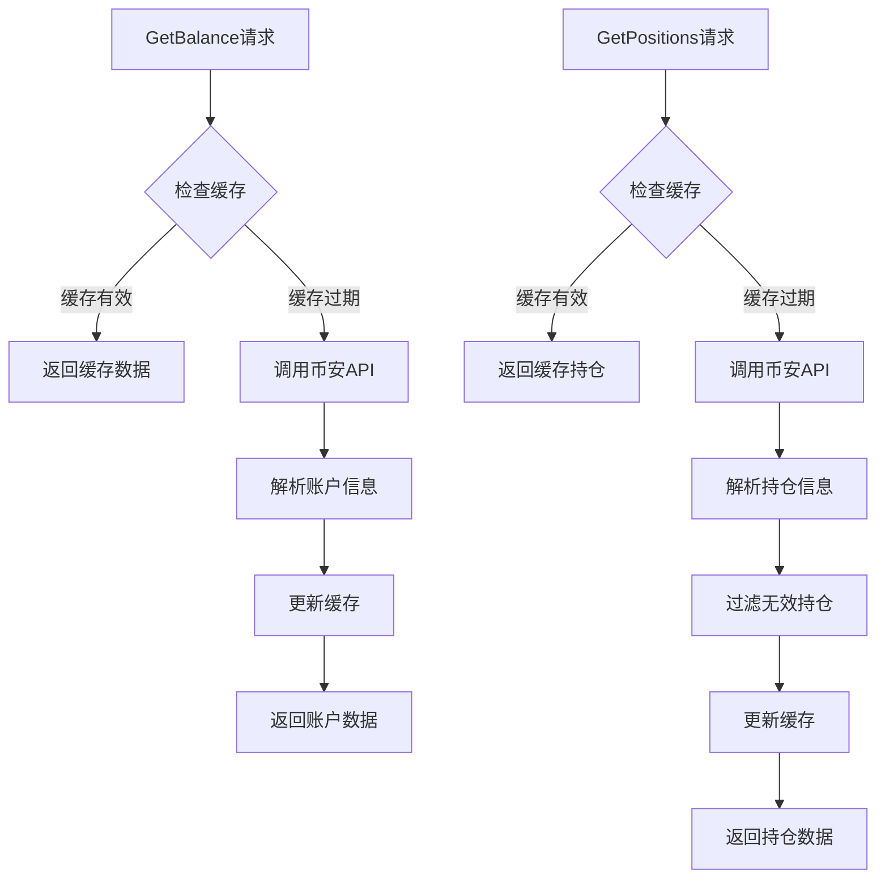
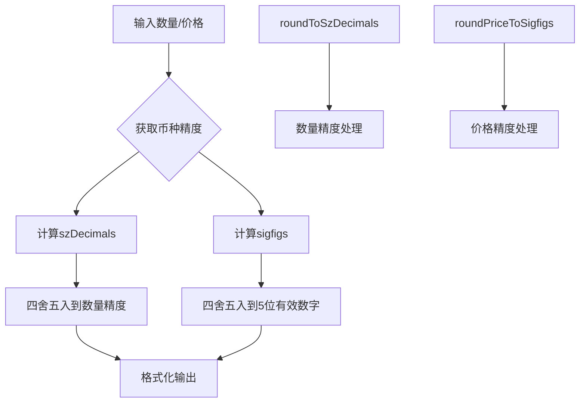
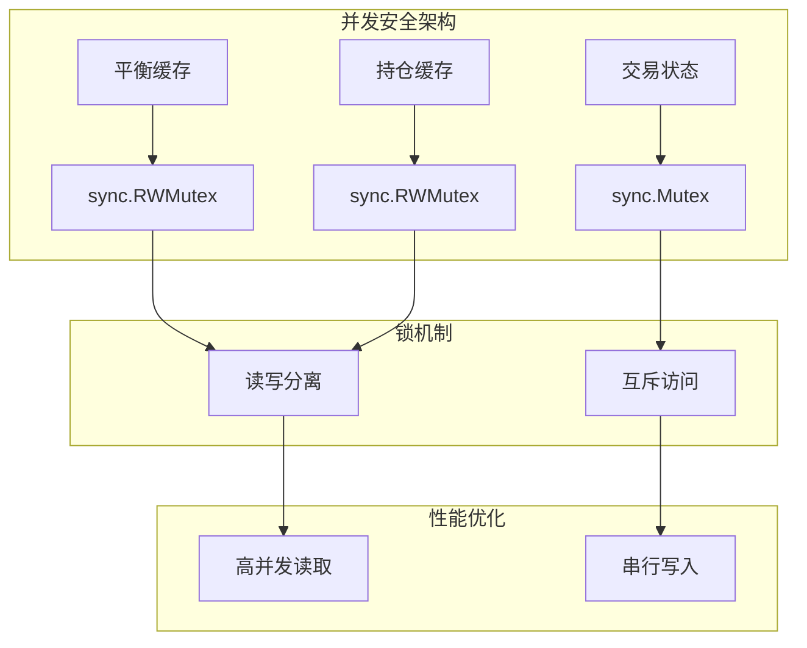
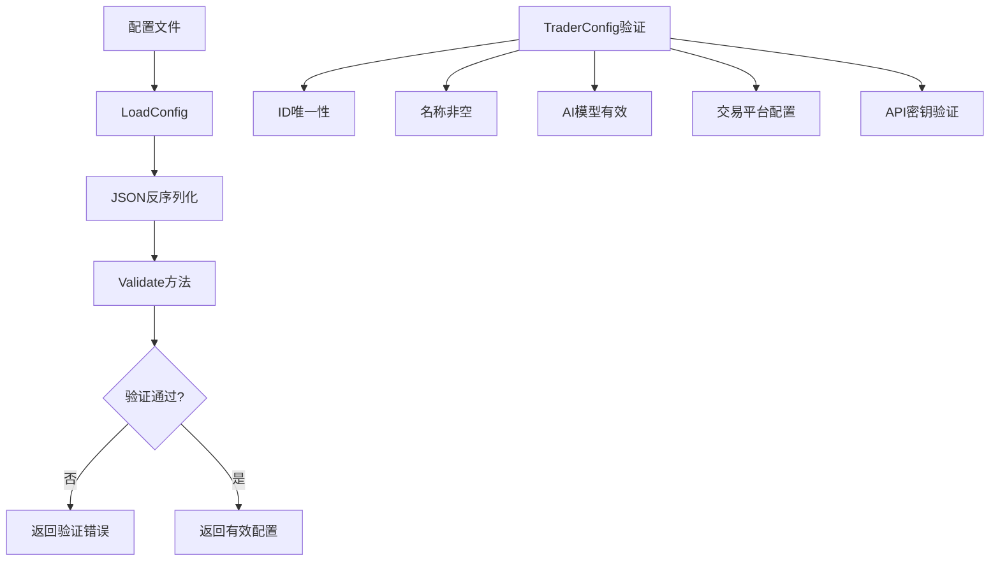
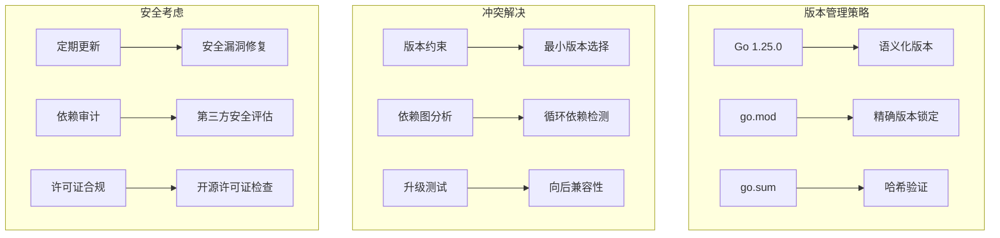
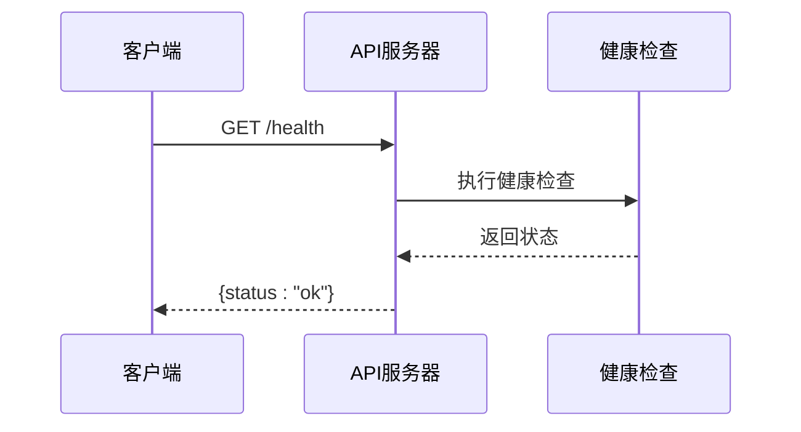

# 后端依赖

<cite>
**本文档引用的文件**
- [go.mod](file://go.mod)
- [main.go](file://main.go)
- [api/server.go](file://api/server.go)
- [trader/binance_futures.go](file://trader/binance_futures.go)
- [trader/hyperliquid_trader.go](file://trader/hyperliquid_trader.go)
- [config/config.go](file://config/config.go)
- [logger/decision_logger.go](file://logger/decision_logger.go)
</cite>

## 目录
1. [项目概述](#项目概述)
2. [核心依赖分析](#核心依赖分析)
3. [Gin框架详解](#gin框架详解)
4. [币安期货API集成](#币安期货api集成)
5. [Hyperliquid交易所集成](#hyperliquid交易所集成)
6. [并发安全机制](#并发安全机制)
7. [间接依赖分析](#间接依赖分析)
8. [依赖冲突与升级策略](#依赖冲突与升级策略)
9. [最佳实践建议](#最佳实践建议)

## 项目概述

nofx是一个基于Go语言开发的AI驱动交易竞赛系统，支持多个加密货币交易平台的自动交易。该项目通过精心设计的依赖架构，实现了高性能的HTTP API服务、可靠的交易所API集成和安全的并发交易管理。

## 核心依赖分析

项目的核心依赖包括四个主要模块，每个都承担着特定的功能职责：



**图表来源**
- [go.mod](file://go.mod#L3-L8)
- [api/server.go](file://api/server.go#L1-L20)
- [trader/binance_futures.go](file://trader/binance_futures.go#L1-L15)
- [trader/hyperliquid_trader.go](file://trader/hyperliquid_trader.go#L1-L15)

**章节来源**
- [go.mod](file://go.mod#L1-L78)

## Gin框架详解

### 版本与特性
Gin框架版本：v1.11.0，这是一个高性能的HTTP Web框架，专为构建RESTful API而设计。

### 核心功能实现
在API服务器的初始化过程中，Gin框架发挥着关键作用：



**图表来源**
- [api/server.go](file://api/server.go#L18-L35)

### 路由与中间件架构

Gin框架提供了完整的路由管理和中间件支持：

| 功能模块 | 实现方式 | 描述 |
|---------|---------|------|
| 路由注册 | `router.Any()` 和 `router.Group()` | 支持多种HTTP方法和路由分组 |
| CORS中间件 | 自定义CORS处理器 | 处理跨域请求，支持所有常用头部 |
| 错误处理 | 内置错误恢复机制 | 自动处理panic和返回适当的HTTP状态码 |
| 性能优化 | Release模式 | 生产环境下的性能优化配置 |

### API端点设计

系统提供了丰富的RESTful API接口：

| 端点路径 | 方法 | 功能描述 |
|---------|------|----------|
| `/health` | GET | 健康检查接口 |
| `/api/competition` | GET | 竞赛总览数据 |
| `/api/traders` | GET | 获取所有trader列表 |
| `/api/status` | GET | 获取指定trader的状态 |
| `/api/account` | GET | 获取账户信息 |
| `/api/positions` | GET | 获取持仓列表 |
| `/api/decisions` | GET | 获取决策日志 |

**章节来源**
- [api/server.go](file://api/server.go#L36-L68)
- [api/server.go](file://api/server.go#L400-L422)

## 币安期货API集成

### 客户端初始化
币安期货交易器使用go-binance/v2库进行API集成，版本v2.8.7提供了完整的期货交易功能支持。

```mermaid
classDiagram
class FuturesTrader {
+client *futures.Client
+cachedBalance map[string]interface{}
+balanceCacheTime time.Time
+cachedPositions []map[string]interface{}
+cacheDuration time.Duration
+NewFuturesTrader(apiKey, secretKey) *FuturesTrader
+GetBalance() map[string]interface{}
+GetPositions() []map[string]interface{}
+SetLeverage(symbol string, leverage int) error
+OpenLong(symbol string, quantity float64, leverage int) map[string]interface{}
+OpenShort(symbol string, quantity float64, leverage int) map[string]interface{}
+CloseLong(symbol string, quantity float64) map[string]interface{}
+CloseShort(symbol string, quantity float64) map[string]interface{}
+SetStopLoss(symbol string, positionSide string, quantity, stopPrice float64) error
+SetTakeProfit(symbol string, positionSide string, quantity, takeProfitPrice float64) error
}
class futures.Client {
+NewGetAccountService() *GetAccountService
+NewGetPositionRiskService() *GetPositionRiskService
+NewChangeLeverageService() *ChangeLeverageService
+NewCreateOrderService() *CreateOrderService
+NewCancelAllOpenOrdersService() *CancelAllOpenOrdersService
+NewListPricesService() *ListPricesService
}
FuturesTrader --> futures.Client : 使用
```

**图表来源**
- [trader/binance_futures.go](file://trader/binance_futures.go#L11-L30)

### 核心交易功能

#### 账户管理
币安交易器实现了完整的账户管理功能，包括余额查询和持仓管理：



**图表来源**
- [trader/binance_futures.go](file://trader/binance_futures.go#L32-L89)
- [trader/binance_futures.go](file://trader/binance_futures.go#L91-L149)

#### 订单执行流程
系统支持完整的订单生命周期管理：

| 交易类型 | 方法 | 功能描述 |
|---------|------|----------|
| 开多仓 | `OpenLong()` | 创建市价买入订单，设置杠杆和保证金模式 |
| 开空仓 | `OpenShort()` | 创建市价卖出订单，设置杠杆和保证金模式 |
| 平多仓 | `CloseLong()` | 创建市价卖出订单平仓，取消止损止盈单 |
| 平空仓 | `CloseShort()` | 创建市价买入订单平仓，取消止损止盈单 |
| 设置止损 | `SetStopLoss()` | 创建触发止损订单 |
| 设置止盈 | `SetTakeProfit()` | 创建触发止盈订单 |

#### 风险管理机制
币安交易器内置了多重风险管理功能：

- **杠杆控制**：智能判断当前杠杆，避免不必要的切换
- **保证金模式**：支持逐仓和全仓模式切换
- **订单清理**：交易前自动取消同币种的所有挂单
- **精度控制**：自动处理数量和价格的精度要求

**章节来源**
- [trader/binance_futures.go](file://trader/binance_futures.go#L151-L614)

## Hyperliquid交易所集成

### SDK架构设计
Hyperliquid交易器使用专门的go-hyperliquid库，版本v0.17.0，提供了与Hyperliquid去中心化衍生品交易所的完整集成。

```mermaid
classDiagram
class HyperliquidTrader {
+exchange *hyperliquid.Exchange
+ctx context.Context
+walletAddr string
+meta *hyperliquid.Meta
+NewHyperliquidTrader(privateKeyHex, walletAddr string, testnet bool) *HyperliquidTrader
+GetBalance() map[string]interface{}
+GetPositions() []map[string]interface{}
+SetLeverage(symbol string, leverage int) error
+OpenLong(symbol string, quantity float64, leverage int) map[string]interface{}
+OpenShort(symbol string, quantity float64, leverage int) map[string]interface{}
+CloseLong(symbol string, quantity float64) map[string]interface{}
+CloseShort(symbol string, quantity float64) map[string]interface{}
+SetStopLoss(symbol string, positionSide string, quantity, stopPrice float64) error
+SetTakeProfit(symbol string, positionSide string, quantity, takeProfitPrice float64) error
}
class hyperliquid.Exchange {
+Info() *hyperliquid.Info
+Order(ctx context.Context, req CreateOrderRequest, opts ...OrderOption) (*Order, error)
+Cancel(ctx context.Context, coin string, oid int64) (*Order, error)
+UpdateLeverage(ctx context.Context, leverage int, name string, isCross bool) (*LeverageUpdateResponse, error)
}
HyperliquidTrader --> hyperliquid.Exchange : 使用
```

**图表来源**
- [trader/hyperliquid_trader.go](file://trader/hyperliquid_trader.go#L13-L20)

### API集成特点

#### 网络配置
Hyperliquid交易器支持主网和测试网两种网络环境：

| 配置项 | 主网值 | 测试网值 | 用途 |
|-------|--------|----------|------|
| API URL | `MainnetAPIURL` | `TestnetAPIURL` | 区分生产环境和测试环境 |
| 私钥格式 | ECDSA私钥 | ECDSA私钥 | 数字签名验证 |
| 钱包地址 | ETH地址 | ETH地址 | 资金管理 |

#### 数据精度处理
Hyperliquid对交易数据有严格的精度要求：



**图表来源**
- [trader/hyperliquid_trader.go](file://trader/hyperliquid_trader.go#L601-L662)

#### 交易执行流程
Hyperliquid交易器实现了复杂的订单执行逻辑：

| 功能模块 | 实现细节 | 技术要点 |
|---------|----------|----------|
| 市价单执行 | 使用IOC限价单 | `LimitOrderType{Tif: TifIoc}` |
| 触发订单 | 止损止盈支持 | `TriggerOrderType{IsMarket: true}` |
| 杠杆设置 | 逐仓模式 | `UpdateLeverage(isCross: false)` |
| 精度控制 | 多层次精度处理 | 数量精度 + 价格精度 |

**章节来源**
- [trader/hyperliquid_trader.go](file://trader/hyperliquid_trader.go#L56-L681)

## 并发安全机制

### sync包的应用
项目广泛使用Go标准库的sync包来确保并发安全，特别是在交易状态管理方面。



**图表来源**
- [trader/binance_futures.go](file://trader/binance_futures.go#L17-L25)

### 缓存管理策略
系统实现了智能缓存机制来提高API调用效率：

| 缓存类型 | 锁类型 | 有效期 | 用途 |
|---------|--------|--------|------|
| 账户余额缓存 | RWMutex | 15秒 | 减少账户查询频率 |
| 持仓信息缓存 | RWMutex | 15秒 | 降低持仓获取成本 |
| 杠杆设置缓存 | Mutex | 实时 | 避免重复设置杠杆 |

### 并发控制原则
1. **读写分离**：使用RWMutex实现高效的并发读取
2. **互斥保护**：关键状态变更使用Mutex确保原子性
3. **超时控制**：所有并发操作都有合理的超时设置
4. **资源释放**：及时释放锁资源避免死锁

**章节来源**
- [trader/binance_futures.go](file://trader/binance_futures.go#L17-L25)

## 间接依赖分析

### 验证框架：go-playground/validator
版本：v10.27.0，用于配置验证和输入数据校验。

#### 核心功能
- **结构体标签验证**：支持JSON标签和自定义验证规则
- **国际化支持**：提供多语言错误消息
- **自定义验证器**：允许扩展验证逻辑
- **批量验证**：高效处理复杂验证场景

#### 在项目中的应用
配置验证是系统安全的重要保障：



**图表来源**
- [config/config.go](file://config/config.go#L108-L201)

### 日志系统：rs/zerolog
版本：v1.34.0，提供高性能的结构化日志记录。

#### 技术优势
- **零分配日志**：在常见情况下避免内存分配
- **结构化输出**：支持JSON格式的日志记录
- **级别控制**：灵活的日志级别管理
- **上下文支持**：自动包含请求上下文信息

#### 在系统中的应用
日志系统贯穿整个应用程序：

| 日志级别 | 使用场景 | 示例内容 |
|---------|----------|----------|
| DEBUG | 详细调试信息 | API请求详情、内部状态 |
| INFO | 一般信息记录 | 交易执行、系统启动 |
| WARN | 警告信息 | 配置警告、性能问题 |
| ERROR | 错误信息 | API调用失败、异常处理 |

**章节来源**
- [logger/decision_logger.go](file://logger/decision_logger.go#L1-L35)
- [config/config.go](file://config/config.go#L108-L201)

## 依赖冲突与升级策略

### 版本兼容性分析
项目采用Go Modules管理依赖，确保版本兼容性和可重现性。



### 升级注意事项

#### Gin框架升级
- **兼容性检查**：确保现有路由和中间件兼容
- **性能测试**：验证升级后的性能表现
- **功能迁移**：适配新的API特性和改进

#### 交易所SDK升级
- **API变更**：检查币安和Hyperliquid API的变更
- **认证方式**：确认新的认证机制
- **错误处理**：适应新的错误响应格式

#### 验证框架升级
- **验证规则**：检查自定义验证器的兼容性
- **错误消息**：适配新的错误消息格式
- **性能影响**：评估验证性能变化

### 依赖维护策略
1. **定期审查**：每月检查依赖更新
2. **安全监控**：关注安全公告
3. **性能评估**：测试新版本性能
4. **渐进式升级**：小步快跑，逐步升级

## 最佳实践建议

### 依赖管理最佳实践

#### 1. 版本锁定策略
- 使用精确版本而非通配符
- 定期更新到次要版本
- 保持关键依赖的稳定性

#### 2. 性能优化
- 合理设置缓存策略
- 使用连接池管理API连接
- 实现优雅的重试机制

#### 3. 错误处理
- 实现完整的错误传播链
- 提供有意义的错误消息
- 区分可恢复和不可恢复错误

#### 4. 安全考虑
- 定期更新依赖修复安全漏洞
- 使用环境变量管理敏感信息
- 实现API密钥的安全轮换

### 监控与运维

#### 关键指标监控
- API响应时间
- 错误率统计
- 并发连接数
- 缓存命中率

#### 健康检查
系统提供了完整的健康检查机制：



**图表来源**
- [api/server.go](file://api/server.go#L69-L77)

### 扩展性考虑
1. **插件架构**：支持新的交易所接入
2. **配置热更新**：动态调整系统参数
3. **负载均衡**：支持多实例部署
4. **故障转移**：实现高可用架构

通过合理的设计和实施这些最佳实践，nofx项目能够保持良好的可维护性、可扩展性和安全性，为AI交易竞赛提供稳定可靠的技术基础。