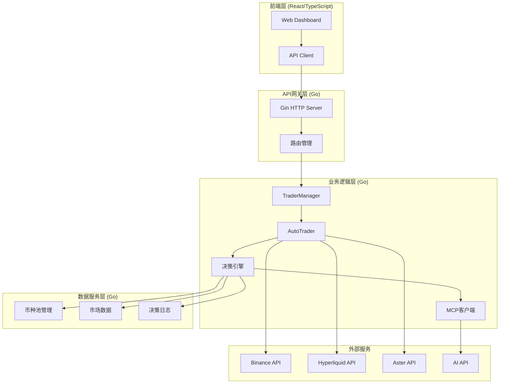
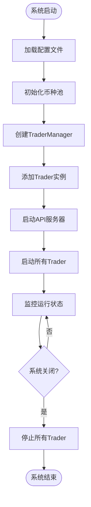
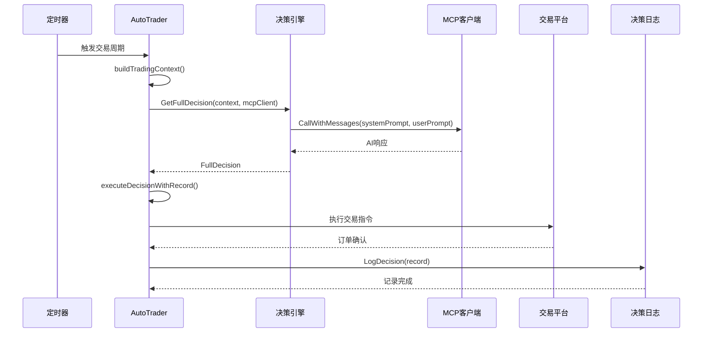
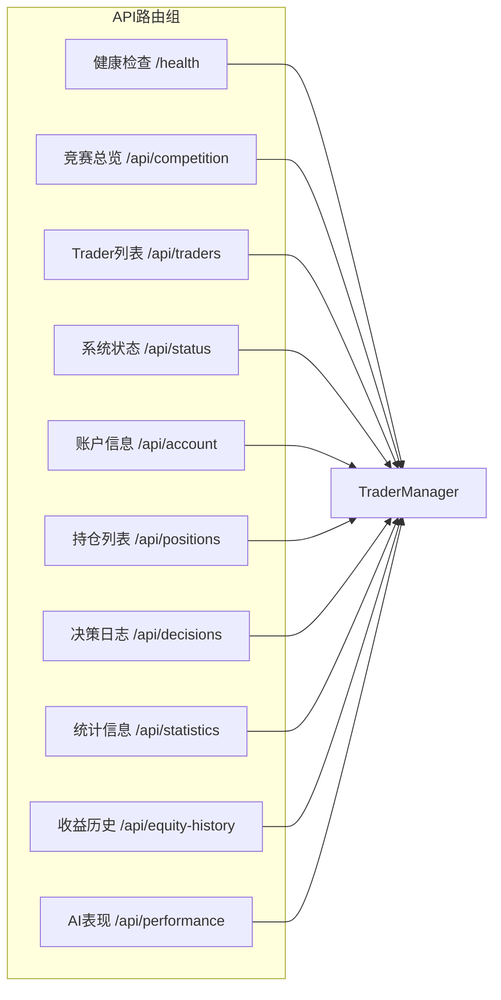
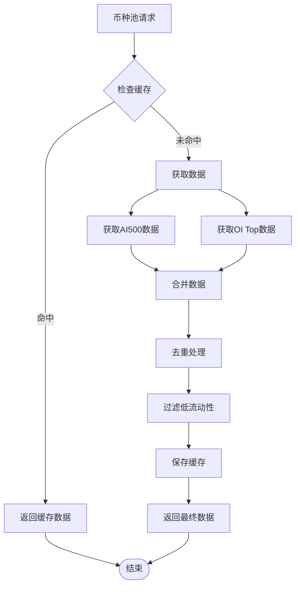
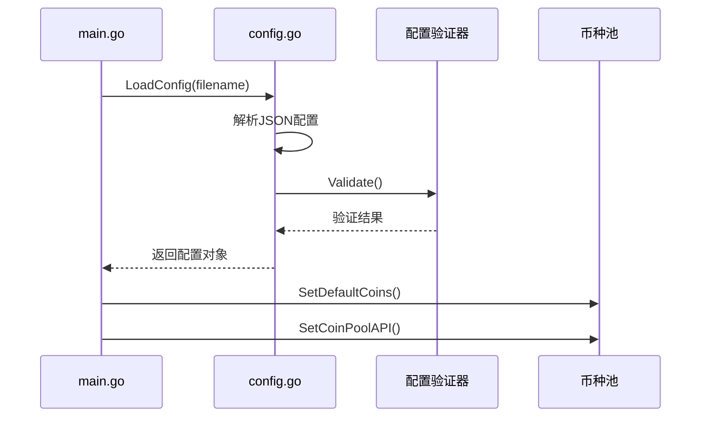
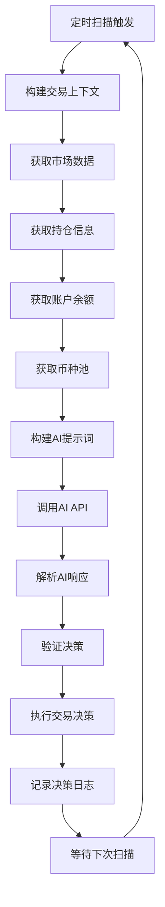
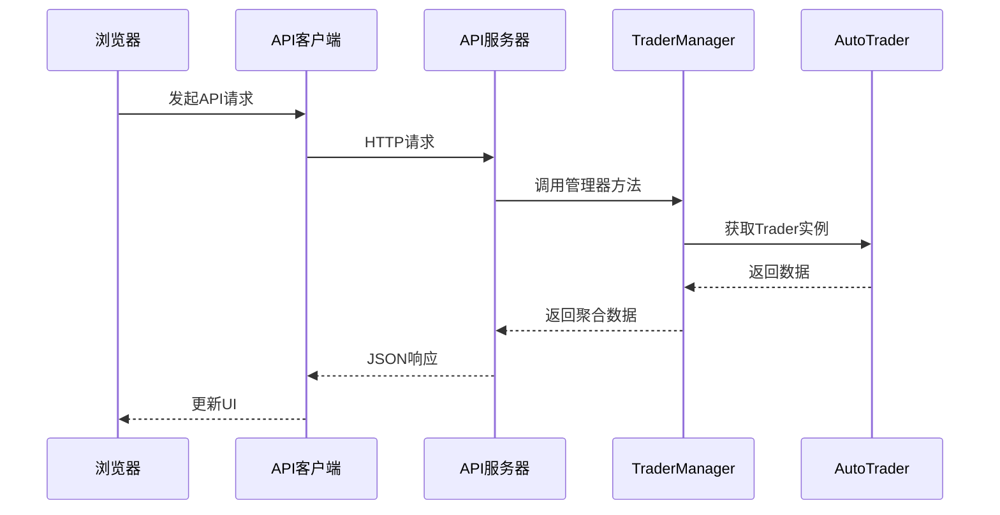
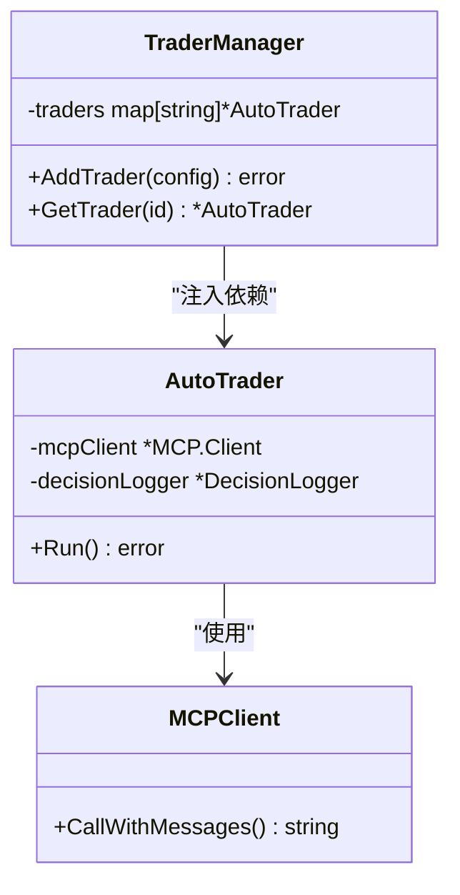
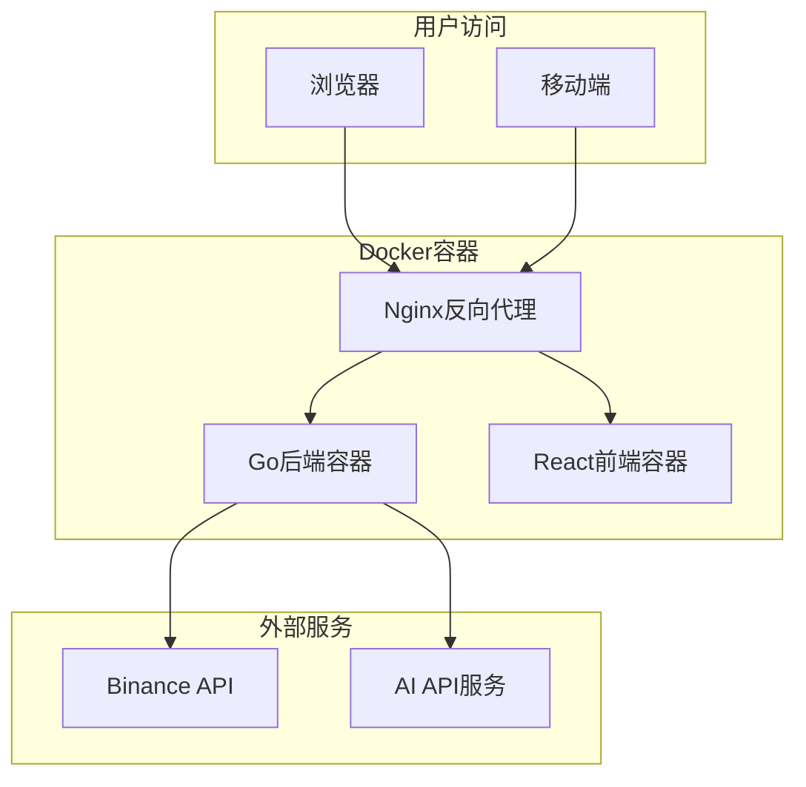

# 技术架构

<cite>
**本文档引用的文件**
- [main.go](file://main.go)
- [manager/trader_manager.go](file://manager/trader_manager.go)
- [trader/auto_trader.go](file://trader/auto_trader.go)
- [api/server.go](file://api/server.go)
- [pool/coin_pool.go](file://pool/coin_pool.go)
- [config/config.go](file://config/config.go)
- [mcp/client.go](file://mcp/client.go)
- [decision/engine.go](file://decision/engine.go)
- [web/package.json](file://web/package.json)
- [go.mod](file://go.mod)
- [web/src/lib/api.ts](file://web/src/lib/api.ts)
- [web/src/App.tsx](file://web/src/App.tsx)
</cite>

## 目录
1. [项目概述](#项目概述)
2. [系统架构概览](#系统架构概览)
3. [核心组件分析](#核心组件分析)
4. [技术栈详解](#技术栈详解)
5. [数据流架构](#数据流架构)
6. [设计模式应用](#设计模式应用)
7. [部署架构](#部署架构)
8. [性能考虑](#性能考虑)
9. [总结](#总结)

## 项目概述

nofx是一个基于人工智能的全栈交易操作系统，采用Go后端和React/TypeScript前端架构。该项目实现了完整的AI驱动交易闭环，包含多代理竞争、统一风险控制、低延迟执行和实时监控功能。

### 核心特性
- **多代理竞争框架**：支持多个AI模型同时进行实盘交易
- **统一风险控制系统**：基于账户级别的风险管理和仓位控制
- **低延迟执行引擎**：支持多个主流交易所的实时交易
- **专业监控界面**：基于Binance风格的实时交易仪表板

## 系统架构概览



**架构图来源**
- [main.go](file://main.go#L1-L140)
- [api/server.go](file://api/server.go#L1-L424)
- [manager/trader_manager.go](file://manager/trader_manager.go#L1-L173)

## 核心组件分析

### 1. 主程序入口 (main.go)

主程序负责系统的初始化和组件协调，采用模块化设计原则。



**流程图来源**
- [main.go](file://main.go#L15-L140)

**节来源**
- [main.go](file://main.go#L1-L140)

### 2. TraderManager - 多Trader管理器

TraderManager采用单例模式管理多个AutoTrader实例，提供统一的生命周期管理和并发控制。

```mermaid
classDiagram
class TraderManager {
-traders map[string]*AutoTrader
-mu sync.RWMutex
+NewTraderManager() *TraderManager
+AddTrader(cfg, ...) error
+GetTrader(id string) *AutoTrader
+GetAllTraders() map[string]*AutoTrader
+StartAll() void
+StopAll() void
+GetComparisonData() map[string]interface{}
}
class AutoTrader {
-id string
-name string
-aiModel string
-config AutoTraderConfig
-trader Trader
-mcpClient *MCP.Client
-decisionLogger *DecisionLogger
+Run() error
+Stop() void
+GetStatus() map[string]interface{}
+GetAccountInfo() map[string]interface{}
}
class AutoTraderConfig {
+ID string
+Name string
+AIModel string
+Exchange string
+InitialBalance float64
+ScanInterval time.Duration
}
TraderManager --> AutoTrader : "管理"
AutoTrader --> AutoTraderConfig : "使用"
```

**类图来源**
- [manager/trader_manager.go](file://manager/trader_manager.go#L10-L173)
- [trader/auto_trader.go](file://trader/auto_trader.go#L20-L100)

**节来源**
- [manager/trader_manager.go](file://manager/trader_manager.go#L1-L173)

### 3. AutoTrader - 自动交易控制器

AutoTrader是系统的核心组件，负责AI决策、风险管理、交易执行和状态监控。



**序列图来源**
- [trader/auto_trader.go](file://trader/auto_trader.go#L200-L400)
- [decision/engine.go](file://decision/engine.go#L80-L120)

**节来源**
- [trader/auto_trader.go](file://trader/auto_trader.go#L1-L936)

### 4. API服务器 - HTTP接口层

API服务器基于Gin框架构建，提供RESTful接口供前端调用和外部集成。



**图表来源**
- [api/server.go](file://api/server.go#L40-L80)

**节来源**
- [api/server.go](file://api/server.go#L1-L424)

### 5. 币种池管理 (CoinPool)

币种池管理组件负责维护候选交易币种列表，支持多种数据源和缓存机制。



**流程图来源**
- [pool/coin_pool.go](file://pool/coin_pool.go#L100-L200)

**节来源**
- [pool/coin_pool.go](file://pool/coin_pool.go#L1-L646)

### 6. 决策引擎 (Decision Engine)

决策引擎是AI交易的核心，负责构建交易上下文、调用AI API并解析决策结果。

**节来源**
- [decision/engine.go](file://decision/engine.go#L1-L624)

## 技术栈详解

### 后端技术栈 (Go)

| 组件 | 版本 | 用途 | 依赖关系 |
|------|------|------|----------|
| Go | 1.25.0+ | 主语言 | - |
| Gin | v1.11.0 | HTTP框架 | API服务器 |
| go-binance | v2.8.7 | Binance API | 交易所连接 |
| go-hyperliquid | v0.17.0 | Hyperliquid API | 交易所连接 |
| ethereum/go-ethereum | v1.16.5 | Ethereum客户端 | Aster交易 |

**技术栈详情**
- **并发处理**：使用Go的goroutine和channel实现高并发交易处理
- **配置管理**：支持JSON配置文件和环境变量
- **错误处理**：统一的错误处理和重试机制
- **日志系统**：结构化日志记录和性能监控

**节来源**
- [go.mod](file://go.mod#L1-L78)

### 前端技术栈 (React/TypeScript)

| 组件 | 版本 | 用途 | 依赖关系 |
|------|------|------|----------|
| React | ^18.3.1 | UI框架 | - |
| TypeScript | ^5.8.3 | 类型系统 | - |
| Zustand | ^5.0.2 | 状态管理 | React状态 |
| SWR | ^2.2.5 | 数据获取 | API调用 |
| Recharts | ^2.15.2 | 图表库 | 数据可视化 |
| Tailwind CSS | ^3.4.17 | CSS框架 | 样式设计 |

**前端架构特点**
- **响应式设计**：基于Tailwind CSS的现代化UI
- **状态管理**：使用Zustand进行轻量级状态管理
- **数据获取**：SWR提供智能缓存和自动刷新
- **类型安全**：完整的TypeScript类型定义

**节来源**
- [web/package.json](file://web/package.json#L1-L30)

## 数据流架构

### 1. 配置加载流程



**序列图来源**
- [config/config.go](file://config/config.go#L50-L100)

### 2. 交易决策流程



**流程图来源**
- [trader/auto_trader.go](file://trader/auto_trader.go#L200-L400)
- [decision/engine.go](file://decision/engine.go#L80-L150)

### 3. 前端数据流



**序列图来源**
- [web/src/lib/api.ts](file://web/src/lib/api.ts#L1-L114)
- [web/src/App.tsx](file://web/src/App.tsx#L50-L150)

**节来源**
- [web/src/lib/api.ts](file://web/src/lib/api.ts#L1-L114)

## 设计模式应用

### 1. 依赖注入模式 (TraderManager)

TraderManager采用依赖注入模式管理AutoTrader实例，实现了松耦合的设计。



**类图来源**
- [manager/trader_manager.go](file://manager/trader_manager.go#L10-L50)

### 2. 单例模式 (CoinPool全局状态)

币种池采用单例模式管理全局状态，确保数据一致性和缓存效率。

### 3. 策略模式 (Multiple Exchanges)

系统支持多种交易所，通过统一的Trader接口实现策略模式。

### 4. 观察者模式 (API监控)

前端使用SWR库实现观察者模式，自动监听数据变化并更新UI。

**节来源**
- [manager/trader_manager.go](file://manager/trader_manager.go#L1-L173)
- [pool/coin_pool.go](file://pool/coin_pool.go#L1-L646)

## 部署架构

### Docker部署方案



### 配置管理

系统支持多种配置方式：
- **JSON配置文件**：主要配置选项
- **环境变量**：敏感信息和运行时配置
- **命令行参数**：启动时的临时配置

**节来源**
- [config/config.go](file://config/config.go#L1-L202)

## 性能考虑

### 1. 并发处理

- **Goroutine池**：合理控制并发数量避免资源耗尽
- **通道通信**：使用channel实现高效的消息传递
- **互斥锁**：在必要时使用sync.Mutex保护共享资源

### 2. 缓存策略

- **币种池缓存**：本地缓存减少API调用
- **市场数据缓存**：短期缓存避免重复获取
- **决策日志缓存**：提升数据查询性能

### 3. 网络优化

- **连接池**：复用HTTP连接减少握手开销
- **超时控制**：合理的超时设置避免长时间阻塞
- **重试机制**：智能重试处理临时故障

### 4. 内存管理

- **对象池**：复用频繁创建的对象
- **垃圾回收**：定期清理无用数据
- **内存监控**：实时监控内存使用情况

## 总结

nofx项目展现了现代全栈交易系统的技术架构精髓：

### 技术亮点
1. **模块化设计**：清晰的职责分离和组件边界
2. **异步处理**：充分利用Go的并发特性
3. **可扩展性**：支持多种交易所和AI提供商
4. **可观测性**：完善的日志和监控体系

### 架构优势
- **高可靠性**：多重错误处理和恢复机制
- **高性能**：优化的数据流和缓存策略
- **易维护**：清晰的代码结构和文档
- **国际化**：支持多语言和跨平台部署

### 应用场景
- **量化交易**：AI驱动的自动化交易策略
- **算法研究**：多Agent竞争和演化实验
- **教育培训**：区块链和AI结合的实战案例
- **产品原型**：金融科技创新的快速验证

这个架构不仅适用于加密货币交易，也为其他金融市场的AI交易系统提供了宝贵的参考价值。