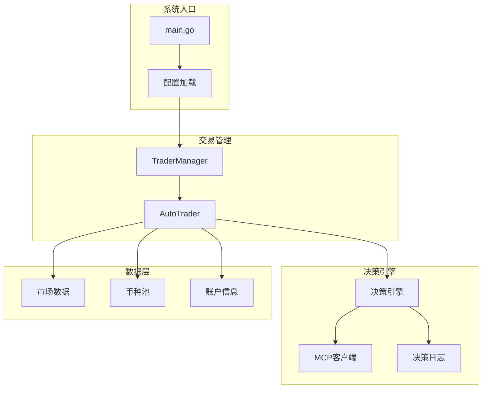
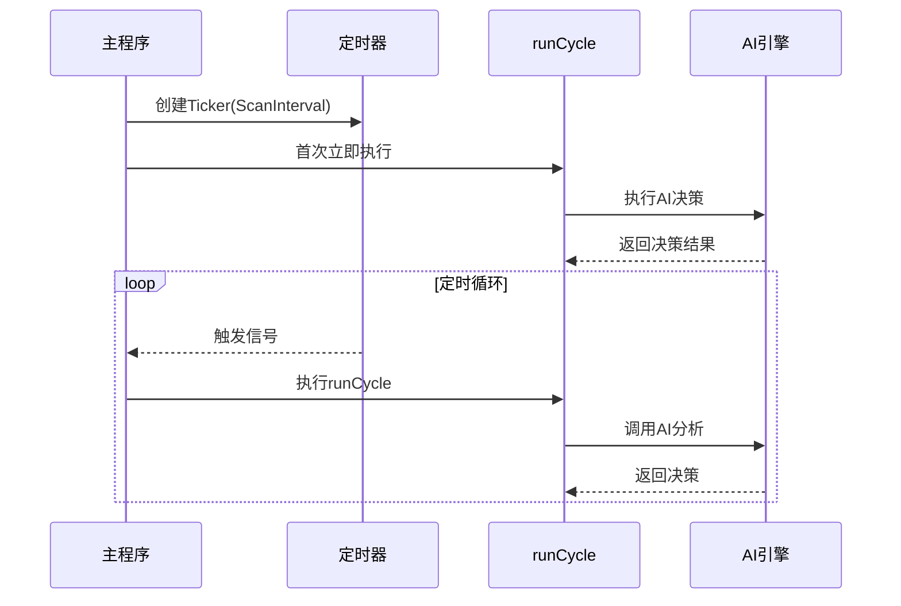
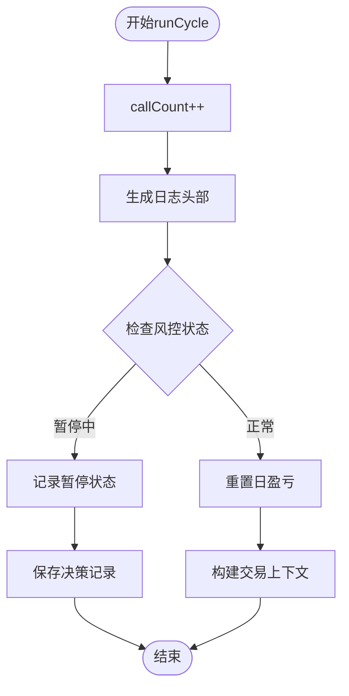
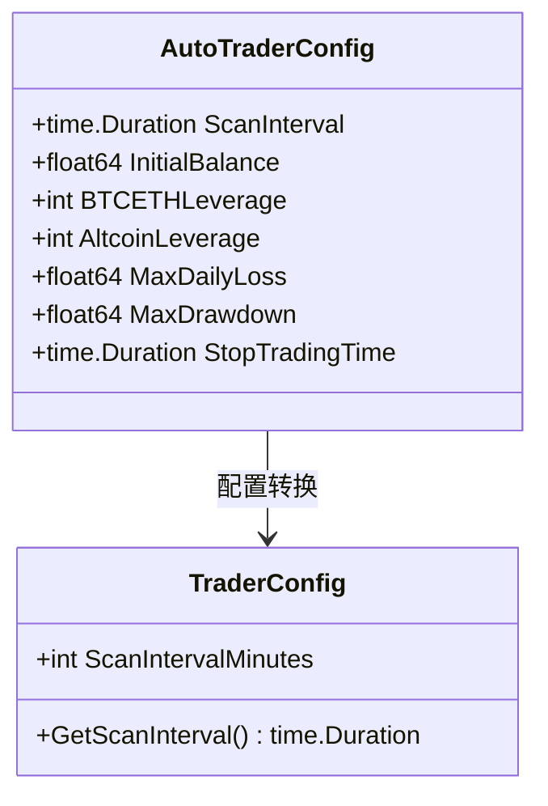
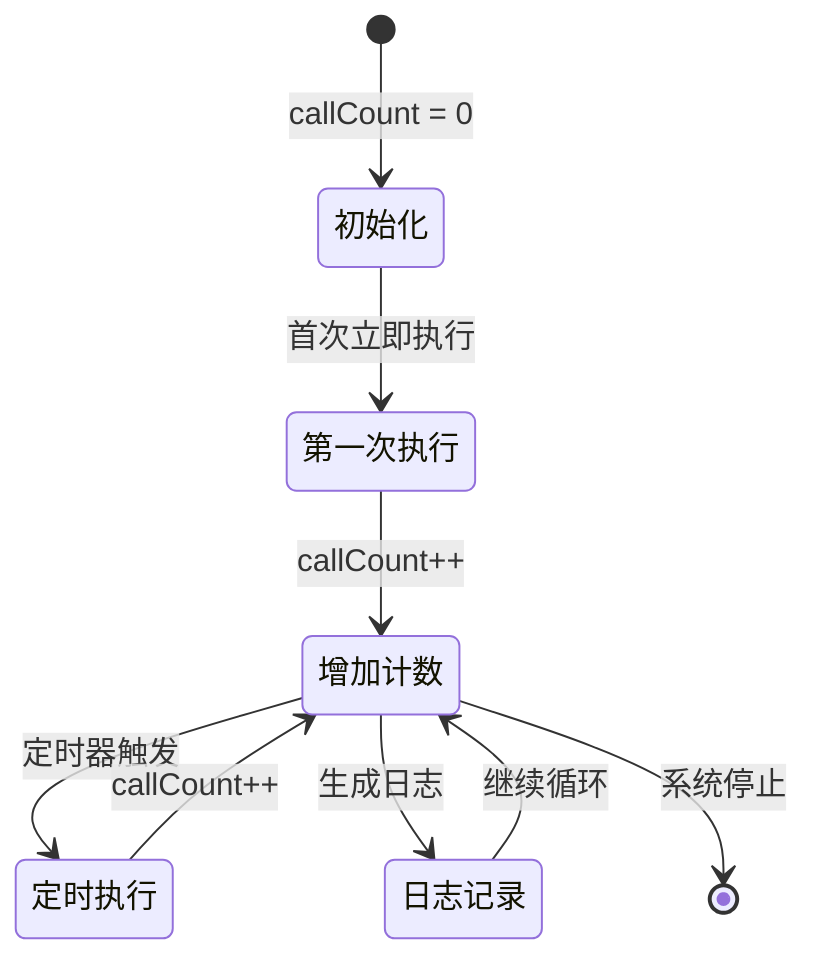
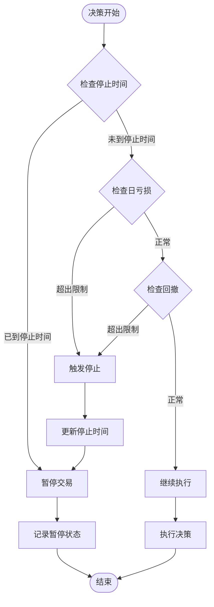
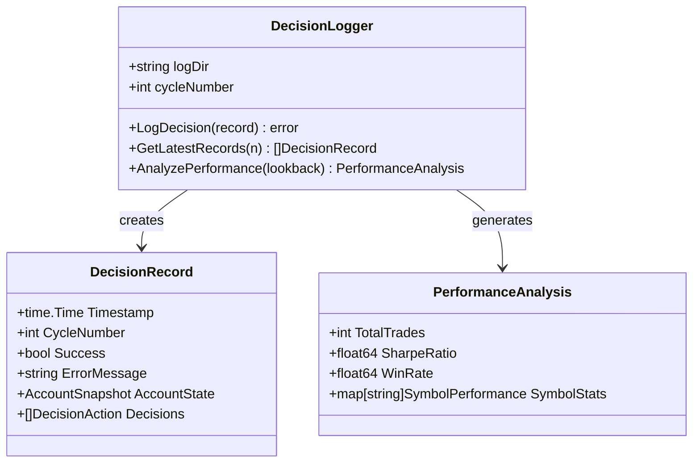

# AI决策循环执行

<cite>
**本文档引用的文件**
- [auto_trader.go](file://trader/auto_trader.go)
- [engine.go](file://decision/engine.go)
- [manager.go](file://manager/trader_manager.go)
- [decision_logger.go](file://logger/decision_logger.go)
- [config.go](file://config/config.go)
- [data.go](file://market/data.go)
- [coin_pool.go](file://pool/coin_pool.go)
- [main.go](file://main.go)
</cite>

## 目录
1. [简介](#简介)
2. [系统架构概览](#系统架构概览)
3. [AutoTrader.Run方法详解](#autotrader-run方法详解)
4. [runCycle方法深度分析](#runcycle方法深度分析)
5. [决策循环时间间隔配置](#决策循环时间间隔配置)
6. [callCount计数器机制](#callcount计数器机制)
7. [风险控制系统](#风险控制系统)
8. [性能监控与优化](#性能监控与优化)
9. [故障排除指南](#故障排除指南)
10. [总结](#总结)

## 简介

nofx项目是一个基于AI的自动化交易系统，采用AI全权决策模式，通过定时器驱动的决策循环实现周期性的交易决策。该系统的核心在于AutoTrader.Run方法，它通过定时器触发runCycle方法执行周期性决策，形成完整的AI决策循环。

## 系统架构概览

**图表来源**
- [main.go](file://main.go#L1-L140)
- [manager.go](file://manager/trader_manager.go#L1-L173)
- [auto_trader.go](file://trader/auto_trader.go#L1-L936)

**章节来源**
- [main.go](file://main.go#L1-L140)
- [manager.go](file://manager/trader_manager.go#L1-L173)

## AutoTrader.Run方法详解

AutoTrader.Run方法是整个AI决策循环的入口点，负责启动定时器并管理决策周期的执行。

### 方法签名与初始化

Run方法的核心功能包括：
- 设置运行状态标志
- 初始化定时器
- 首次立即执行决策周期
- 启动主循环监听定时器事件

### 定时器机制

系统使用Go语言的time.Ticker来实现精确的定时调度：

**图表来源**
- [auto_trader.go](file://trader/auto_trader.go#L180-L205)

### 循环控制逻辑

Run方法采用select语句实现非阻塞的定时器监听：

- **isRunning标志控制**：通过布尔值控制循环的生命周期
- **错误处理机制**：捕获并记录runCycle执行过程中的异常
- **资源清理**：使用defer确保定时器正确关闭

**章节来源**
- [auto_trader.go](file://trader/auto_trader.go#L180-L205)

## runCycle方法深度分析

runCycle方法是AI决策循环的核心，执行完整的决策流程，包含8个主要步骤。

### 步骤1：计数器递增与日志格式化

**图表来源**
- [auto_trader.go](file://trader/auto_trader.go#L210-L254)

### 步骤2：风控状态检查

风控检查是决策循环的第一道防线：

- **暂停时间检查**：验证当前是否处于风控暂停期内
- **剩余时间计算**：计算剩余暂停时间并记录
- **状态记录**：将风控状态保存到决策记录中

### 步骤3：日盈亏重置机制

系统每天凌晨重置日盈亏统计：

- **时间间隔检查**：使用24小时阈值判断是否需要重置
- **重置时机**：确保在新的一天开始时重置
- **状态同步**：更新lastResetTime时间戳

### 步骤4：交易上下文构建

buildTradingContext方法收集完整的交易环境信息：

#### 账户信息获取
- **总权益计算**：钱包余额 + 未实现盈亏
- **可用余额**：可交易资金
- **保证金使用率**：总保证金 / 总权益 × 100%

#### 持仓信息处理
- **持仓详情**：币种、方向、数量、盈亏
- **保证金计算**：基于杠杆的保证金估算
- **持仓时长跟踪**：记录持仓开始时间

#### 候选币种池
- **AI500评分**：基于AI算法的币种评分
- **OI Top数据**：持仓量增长最快的币种
- **去重合并**：整合多个数据源的币种池

**章节来源**
- [auto_trader.go](file://trader/auto_trader.go#L210-L254)
- [auto_trader.go](file://trader/auto_trader.go#L400-L600)

## 决策循环时间间隔配置

### ScanInterval配置机制

系统通过AutoTraderConfig.ScanInterval控制决策周期间隔：

**图表来源**
- [config.go](file://config/config.go#L180-L202)
- [auto_trader.go](file://trader/auto_trader.go#L50-L75)

### 时间间隔的影响因素

#### 性能考虑
- **高频扫描**：3分钟间隔适合快速市场反应
- **资源消耗**：更短间隔增加API调用频率
- **网络延迟**：需要考虑交易所响应时间

#### 市场适应性
- **波动性匹配**：不同市场需要不同的扫描频率
- **信号质量**：高频扫描提高信号捕捉能力
- **决策稳定性**：适当间隔平衡决策质量和稳定性

### 默认值与最佳实践

- **推荐间隔**：3-5分钟（平衡效率与稳定性）
- **最小间隔**：1分钟（避免过于频繁）
- **最大间隔**：15分钟（保持市场敏感性）

**章节来源**
- [config.go](file://config/config.go#L180-L202)
- [auto_trader.go](file://trader/auto_trader.go#L50-L75)

## callCount计数器机制

### 计数器设计原理

callCount计数器是决策循环的重要监控指标：

**图表来源**
- [auto_trader.go](file://trader/auto_trader.go#L210-L215)

### 日志输出格式

每次决策周期都会生成标准化的日志格式：

- **时间戳**：精确到秒的时间信息
- **周期编号**：唯一的执行序号
- **执行状态**：成功或失败标记
- **性能指标**：账户状态和持仓信息

### 监控与分析用途

#### 性能监控
- **执行频率**：监控决策执行的规律性
- **响应时间**：分析决策处理耗时
- **成功率**：计算决策执行的成功率

#### 故障诊断
- **异常检测**：识别执行失败的周期
- **趋势分析**：发现性能退化迹象
- **容量规划**：评估系统负载能力

**章节来源**
- [auto_trader.go](file://trader/auto_trader.go#L210-L215)
- [decision_logger.go](file://logger/decision_logger.go#L74-L118)

## 风险控制系统

### 风控机制架构

**图表来源**
- [auto_trader.go](file://trader/auto_trader.go#L220-L240)

### 风控参数配置

#### 最大日亏损控制
- **阈值设定**：基于初始余额的百分比
- **计算方式**：当日累计盈亏达到阈值
- **恢复机制**：暂停一定时间后自动恢复

#### 最大回撤控制
- **定义**：从峰值到谷底的最大跌幅
- **监控频率**：每次决策周期检查
- **触发条件**：回撤超过设定阈值

#### 停止交易时间
- **暂停时长**：配置的分钟数
- **累积效应**：多次违规的累积惩罚
- **自动恢复**：暂停期满后自动重启

### AI风险反馈机制

AI引擎内置风险反馈学习机制：

- **夏普比率反馈**：基于风险调整后收益的绩效评估
- **行为修正**：根据绩效结果调整交易策略
- **自我进化**：持续优化决策算法

**章节来源**
- [auto_trader.go](file://trader/auto_trader.go#L57-L65)
- [engine.go](file://decision/engine.go#L265-L283)

## 性能监控与优化

### 决策记录系统

系统通过DecisionLogger实现完整的决策追踪：

**图表来源**
- [decision_logger.go](file://logger/decision_logger.go#L10-L35)
- [decision_logger.go](file://logger/decision_logger.go#L400-L500)

### 性能指标监控

#### 关键性能指标(KPI)
- **夏普比率**：风险调整后收益指标
- **胜率**：盈利交易占比
- **盈亏比**：平均盈利与平均亏损比例
- **交易频率**：每小时交易次数

#### 监控策略
- **实时监控**：每个周期更新性能指标
- **历史分析**：基于最近N个周期的统计
- **趋势预测**：识别性能变化趋势

### 优化建议

#### 系统级优化
- **并发控制**：合理设置并发任务数量
- **内存管理**：定期清理历史数据
- **网络优化**：使用连接池减少延迟

#### 算法级优化
- **数据缓存**：缓存常用市场数据
- **智能调度**：根据系统负载调整扫描频率
- **异常处理**：完善错误恢复机制

**章节来源**
- [decision_logger.go](file://logger/decision_logger.go#L400-L500)

## 故障排除指南

### 常见问题诊断

#### 决策循环停滞
- **症状**：callCount不再递增
- **原因**：定时器失效或runCycle异常
- **解决方案**：检查系统资源和错误日志

#### 风控误触发
- **症状**：频繁进入暂停状态
- **原因**：风控阈值设置过严
- **解决方案**：调整MaxDailyLoss和MaxDrawdown参数

#### AI决策失败
- **症状**：AI响应超时或解析错误
- **原因**：API服务异常或网络问题
- **解决方案**：检查API连接和重试机制

### 监控指标

#### 健康系统特征
- **决策周期**：每3-5分钟正常执行
- **错误消息**：无连续错误
- **账户更新**：余额和持仓正常更新
- **Web界面**：仪表板自动刷新

#### 警告信号
- **API错误**：重复的API调用失败
- **决策缺失**：10分钟以上无新决策
- **性能下降**：夏普比率持续恶化

**章节来源**
- [README.md](file://README.md#L855-L868)

## 总结

nofx项目的AI决策循环是一个精心设计的自动化交易系统，通过AutoTrader.Run方法和runCycle方法的协同工作，实现了高效、稳定的AI驱动交易决策。系统的核心优势包括：

### 技术特点
- **定时器驱动**：基于Go语言的Ticker实现精确调度
- **模块化设计**：清晰的职责分离和接口定义
- **风险控制**：多层次的风险管理和自我调节机制
- **性能监控**：完整的决策追踪和性能分析

### 运行机制
- **周期性执行**：3-5分钟的扫描间隔平衡效率与稳定性
- **AI全权决策**：AI自主决定仓位、杠杆、止损等关键参数
- **实时监控**：callCount计数器提供详细的执行追踪
- **智能风控**：基于夏普比率的自我进化风险管理

### 应用价值
该系统为AI驱动的量化交易提供了完整的解决方案，适用于各种加密货币交易平台，具有良好的扩展性和稳定性。通过合理的配置和监控，可以实现稳定、高效的自动化交易策略。