# AI模型通信机制

<cite>
**本文档引用的文件**
- [mcp/client.go](file://mcp/client.go)
- [decision/engine.go](file://decision/engine.go)
- [config/config.go](file://config/config.go)
- [CUSTOM_API.md](file://CUSTOM_API.md)
- [trader/auto_trader.go](file://trader/auto_trader.go)
- [trader/aster_trader.go](file://trader/aster_trader.go)
</cite>

## 目录
1. [简介](#简介)
2. [项目结构概览](#项目结构概览)
3. [核心组件分析](#核心组件分析)
4. [架构概览](#架构概览)
5. [详细组件分析](#详细组件分析)
6. [API密钥管理](#api密钥管理)
7. [请求构建与响应处理](#请求构建与响应处理)
8. [GetFullDecision函数详解](#getfulldecision函数详解)
9. [自定义API集成](#自定义api集成)
10. [错误处理策略](#错误处理策略)
11. [性能优化与最佳实践](#性能优化与最佳实践)
12. [故障排除指南](#故障排除指南)
13. [总结](#总结)

## 简介

nofx项目实现了一套完整的AI通信机制，通过mcp.Client模块与多种AI模型进行交互，包括DeepSeek、Qwen和自定义OpenAI兼容API。该系统采用思维链（Chain of Thought）推理方式，将复杂的交易决策过程转化为结构化的AI对话，确保决策的透明性和可追溯性。

## 项目结构概览

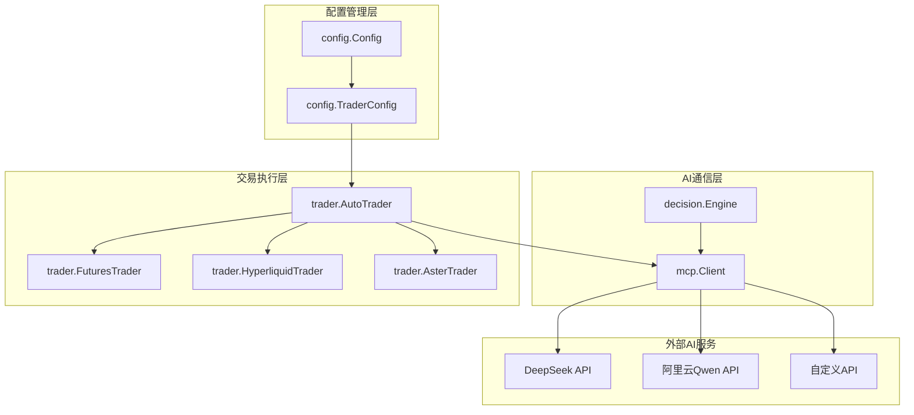

**图表来源**
- [mcp/client.go](file://mcp/client.go#L1-L50)
- [decision/engine.go](file://decision/engine.go#L1-L50)
- [config/config.go](file://config/config.go#L1-L50)
- [trader/auto_trader.go](file://trader/auto_trader.go#L1-L50)

## 核心组件分析

### mcp.Client - AI通信客户端

mcp.Client是系统的核心通信组件，负责与各种AI模型建立连接并处理请求响应。

**主要特性：**
- 支持三种AI提供商：DeepSeek、Qwen和自定义API
- 内置重试机制和错误恢复
- 支持自定义超时配置
- 提供统一的API接口

**提供商类型定义：**
- `ProviderDeepSeek`: DeepSeek AI服务
- `ProviderQwen`: 阿里云Qwen服务  
- `ProviderCustom`: 自定义OpenAI兼容API

**节来源**
- [mcp/client.go](file://mcp/client.go#L15-L25)

### decision.Engine - 决策引擎

决策引擎负责将交易上下文转换为AI可理解的prompt，并处理AI返回的决策结果。

**核心功能：**
- 构建系统级和用户级prompt
- 解析AI响应并提取思维链分析
- 验证决策的有效性和合规性
- 提供完整的决策生命周期管理

**节来源**
- [decision/engine.go](file://decision/engine.go#L1-L50)

## 架构概览

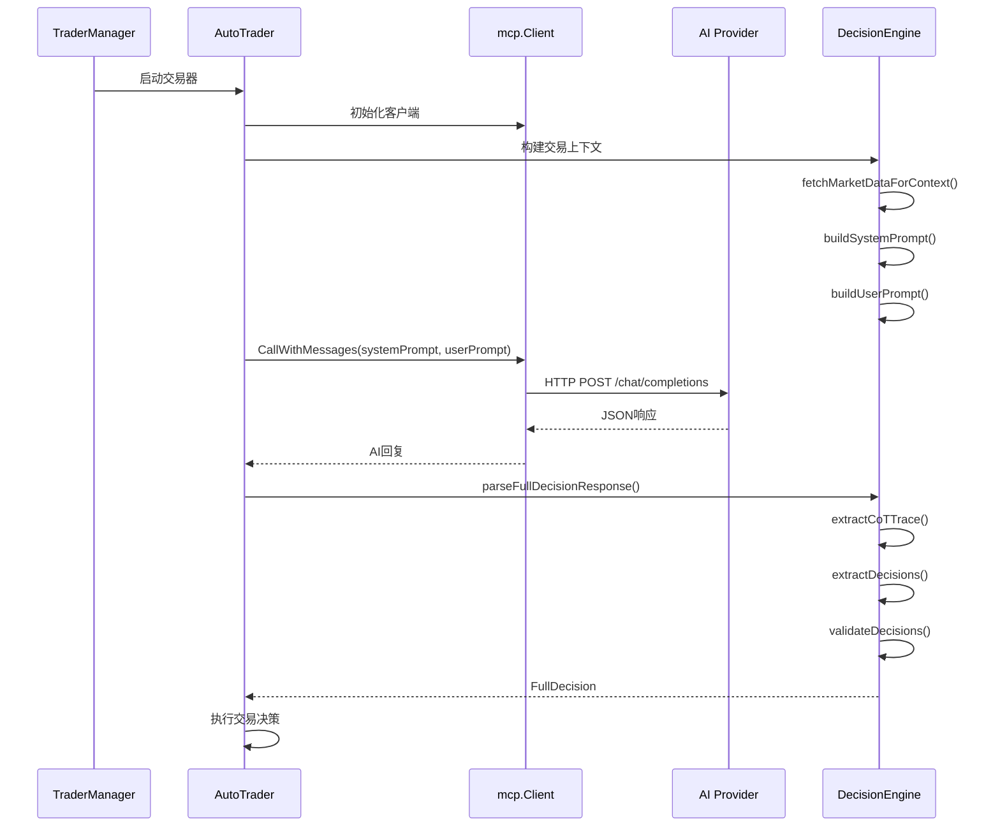

**图表来源**
- [mcp/client.go](file://mcp/client.go#L75-L120)
- [decision/engine.go](file://decision/engine.go#L100-L150)
- [trader/auto_trader.go](file://trader/auto_trader.go#L87-L133)

## 详细组件分析

### mcp.Client类图

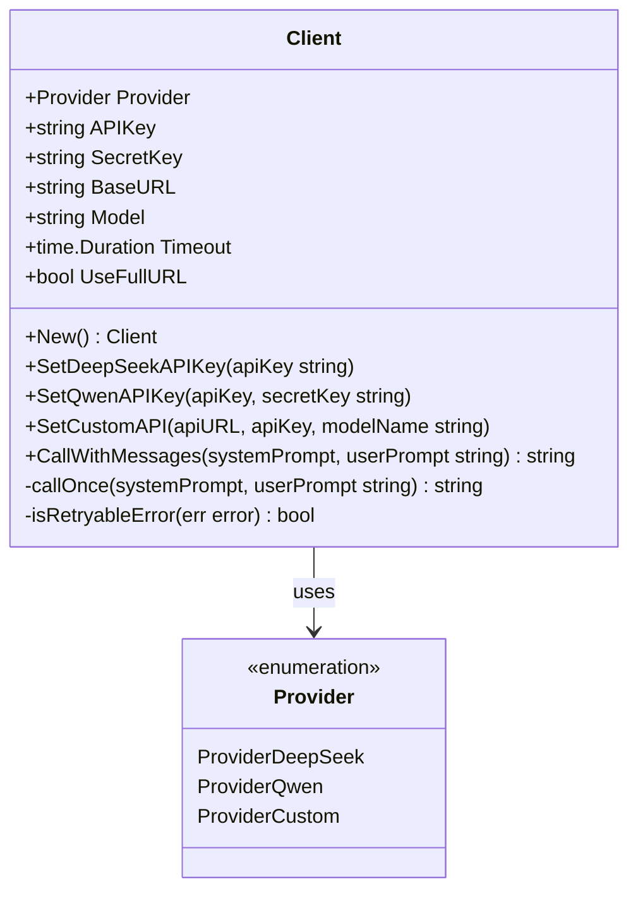

**图表来源**
- [mcp/client.go](file://mcp/client.go#L25-L45)

### 决策数据结构

```mermaid
classDiagram
class Context {
+string CurrentTime
+int RuntimeMinutes
+int CallCount
+AccountInfo Account
+[]PositionInfo Positions
+[]CandidateCoin CandidateCoins
+map[string]*market.Data MarketDataMap
+map[string]*OITopData OITopDataMap
+interface{} Performance
+int BTCETHLeverage
+int AltcoinLeverage
}
class Decision {
+string Symbol
+string Action
+int Leverage
+float64 PositionSizeUSD
+float64 StopLoss
+float64 TakeProfit
+int Confidence
+float64 RiskUSD
+string Reasoning
}
class FullDecision {
+string UserPrompt
+string CoTTrace
+[]Decision Decisions
+time.Time Timestamp
}
Context --> Decision : generates
Decision --> FullDecision : aggregates
```

**图表来源**
- [decision/engine.go](file://decision/engine.go#L40-L120)

**节来源**
- [decision/engine.go](file://decision/engine.go#L40-L120)

## API密钥管理

### DeepSeek API密钥配置

DeepSeek API采用标准的Bearer Token认证方式：

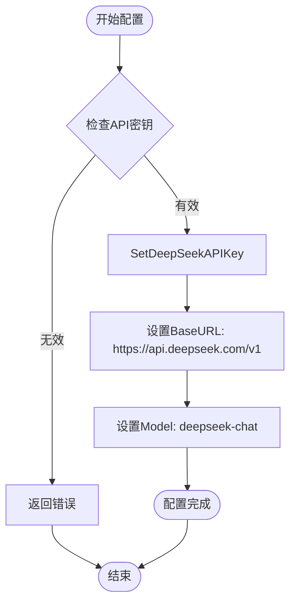

**图表来源**
- [mcp/client.go](file://mcp/client.go#L47-L52)

### Qwen API密钥配置

阿里云Qwen使用API-Key认证，需要同时配置API密钥和SecretKey：

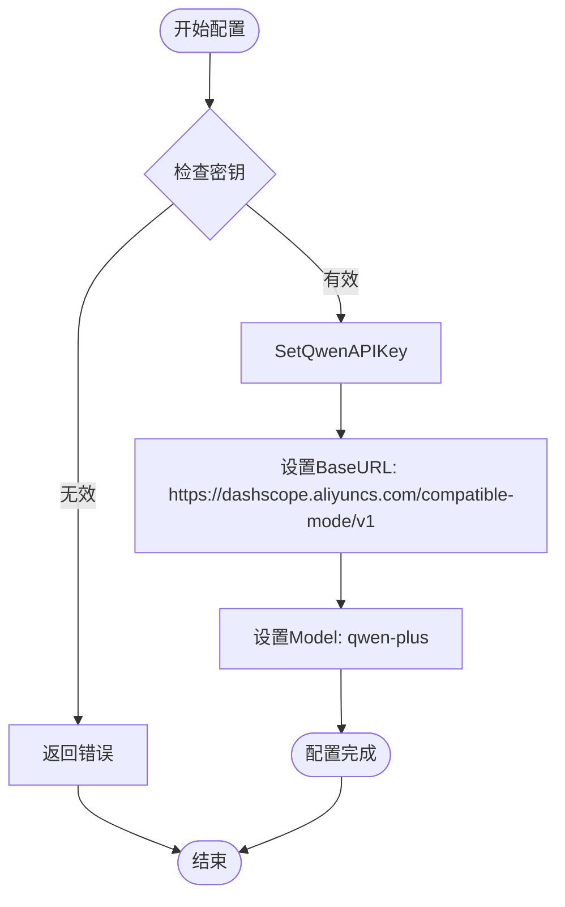

**图表来源**
- [mcp/client.go](file://mcp/client.go#L54-L62)

### 自定义API密钥配置

自定义API支持灵活的URL格式和认证方式：

| 配置项 | 描述 | 示例 |
|--------|------|------|
| `custom_api_url` | API基础URL | `https://api.openai.com/v1` |
| `custom_api_key` | API认证密钥 | `sk-xxxxx` |
| `custom_model_name` | 模型名称 | `gpt-4o` |
| `UseFullURL` | 是否使用完整URL | 自动检测 |

**节来源**
- [mcp/client.go](file://mcp/client.go#L60-L75)
- [CUSTOM_API.md](file://CUSTOM_API.md#L10-L50)

## 请求构建与响应处理

### 请求构建流程

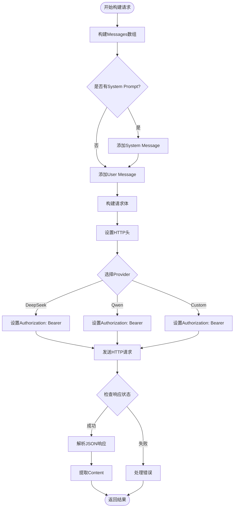

**图表来源**
- [mcp/client.go](file://mcp/client.go#L120-L200)

### 响应处理机制

系统采用严格的响应解析和验证机制：

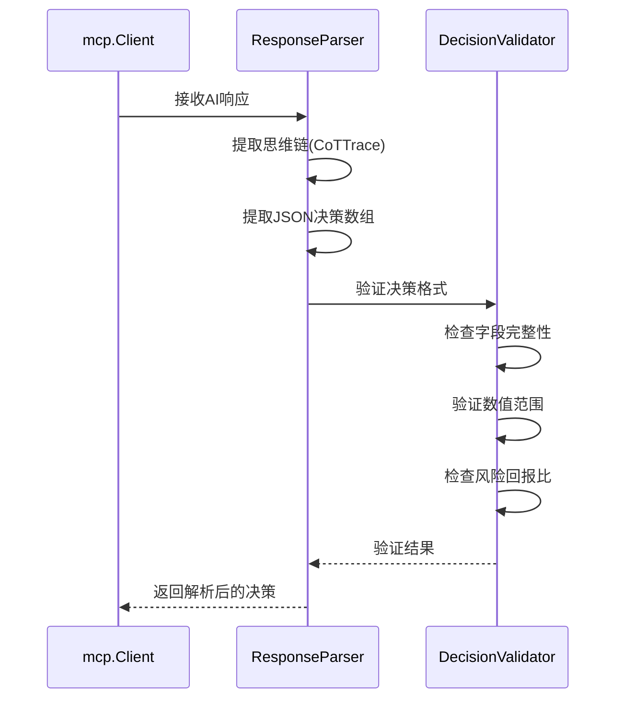

**图表来源**
- [decision/engine.go](file://decision/engine.go#L500-L600)

**节来源**
- [mcp/client.go](file://mcp/client.go#L120-L200)
- [decision/engine.go](file://decision/engine.go#L500-L600)

## GetFullDecision函数详解

GetFullDecision是系统的核心决策函数，负责将完整的交易上下文转换为AI可理解的prompt并处理返回的决策。

### 函数执行流程

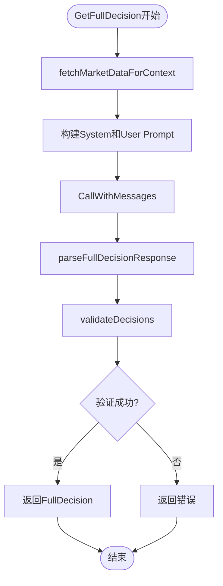

**图表来源**
- [decision/engine.go](file://decision/engine.go#L100-L130)

### 市场数据获取策略

系统采用智能的市场数据获取策略，根据账户状态动态调整分析的币种数量：

| 账户状态 | 候选币种数量 | 计算公式 |
|----------|--------------|----------|
| 小额账户 | 5-10个 | min(10, total_candidates/2) |
| 中等账户 | 10-20个 | min(20, total_candidates) |
| 大额账户 | 15-30个 | min(30, total_candidates) |

### Prompt构建策略

#### System Prompt设计原则

System Prompt采用分层结构，包含以下核心要素：

1. **核心目标**：最大化夏普比率
2. **硬约束**：风险回报比、仓位数量、保证金使用率
3. **交易频率认知**：量化标准和最佳节奏
4. **开仓信号强度**：严格的质量标准
5. **决策流程**：清晰的步骤指导
6. **输出格式**：标准化的JSON结构

#### User Prompt动态构建

User Prompt包含实时的交易上下文信息：

- **系统状态**：时间、周期编号、运行时长
- **BTC市场**：价格、涨跌幅、技术指标
- **账户信息**：净值、余额、盈亏、保证金使用率
- **持仓详情**：完整的技术分析数据
- **候选币种**：基于AI500和OI_Top的筛选结果
- **夏普比率反馈**：历史绩效指标

**节来源**
- [decision/engine.go](file://decision/engine.go#L100-L624)

## 自定义API集成

### 配置方式

自定义API支持多种部署方式和提供商：

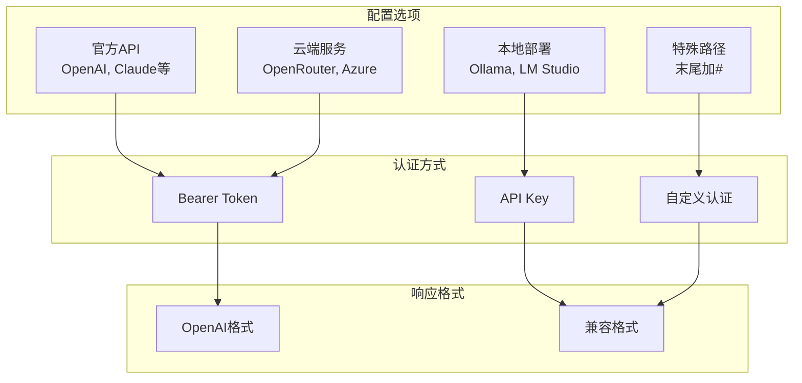

**图表来源**
- [CUSTOM_API.md](file://CUSTOM_API.md#L20-L100)

### URL格式规范

| URL类型 | 格式示例 | 说明 |
|---------|----------|------|
| 标准格式 | `https://api.openai.com/v1` | 自动添加 `/chat/completions` |
| 特殊格式 | `https://api.example.com/custom/path/chat/completions#` | 使用完整URL，末尾加# |
| 本地部署 | `http://localhost:11434/v1` | 本地Ollama实例 |

### 兼容性要求

自定义API必须满足以下OpenAI兼容性要求：

1. **HTTP方法**：支持 `POST` 请求
2. **端点路径**：`/chat/completions`（或使用特殊格式）
3. **认证方式**：`Authorization: Bearer {api_key}`
4. **请求格式**：标准OpenAI Chat Completions格式
5. **响应格式**：标准OpenAI响应格式

**节来源**
- [CUSTOM_API.md](file://CUSTOM_API.md#L1-L206)
- [mcp/client.go](file://mcp/client.go#L60-L75)

## 错误处理策略

### 重试机制设计

系统实现了智能的重试机制，区分可重试和不可重试错误：

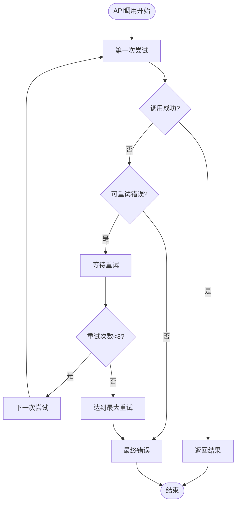

**图表来源**
- [mcp/client.go](file://mcp/client.go#L75-L120)

### 可重试错误类型

系统识别以下类型的可重试错误：

| 错误类别 | 具体错误 | 处理策略 |
|----------|----------|----------|
| 网络错误 | EOF, timeout | 自动重试 |
| 连接错误 | connection reset, refused | 自动重试 |
| 临时错误 | temporary failure | 自动重试 |
| 主机错误 | no such host | 自动重试 |

### JSON解析错误处理

AI响应可能存在格式错误，系统采用智能修复机制：

1. **引号修复**：替换中文引号为英文引号
2. **括号匹配**：自动查找匹配的JSON括号
3. **格式验证**：严格的JSON格式验证
4. **错误恢复**：提供详细的错误信息和上下文

**节来源**
- [mcp/client.go](file://mcp/client.go#L75-L120)
- [decision/engine.go](file://decision/engine.go#L550-L624)

## 性能优化与最佳实践

### 超时配置优化

系统提供了灵活的超时配置机制：

| 场景 | 默认超时 | 建议值 | 说明 |
|------|----------|--------|------|
| 标准调用 | 30秒 | 120秒 | AI分析需要更多时间 |
| 重试调用 | 30秒 | 120秒 | 确保重试有足够的时间窗口 |
| 自定义API | 120秒 | 可调整 | 根据API响应速度调整 |

### 通信延迟优化技巧

1. **并发数据获取**：同时获取多个币种的市场数据
2. **智能缓存**：缓存常用的市场数据和OI Top信息
3. **连接复用**：使用HTTP客户端连接池
4. **压缩传输**：启用gzip压缩减少传输时间

### 速率限制注意事项

虽然系统本身没有内置速率限制，但在使用外部API时需要注意：

1. **API配额监控**：定期检查API使用情况
2. **请求频率控制**：避免过于频繁的请求
3. **备用API准备**：配置多个API提供商作为备份
4. **错误处理**：妥善处理429 Too Many Requests错误

**节来源**
- [mcp/client.go](file://mcp/client.go#L35-L45)
- [decision/engine.go](file://decision/engine.go#L150-L200)

## 故障排除指南

### 常见问题诊断

#### API密钥相关问题

| 问题症状 | 可能原因 | 解决方案 |
|----------|----------|----------|
| "API密钥未设置" | 密钥配置缺失 | 检查config.json中的密钥配置 |
| "认证失败" | 密钥格式错误 | 验证API密钥格式和权限 |
| "访问被拒绝" | 权限不足 | 检查API密钥权限设置 |

#### 网络连接问题

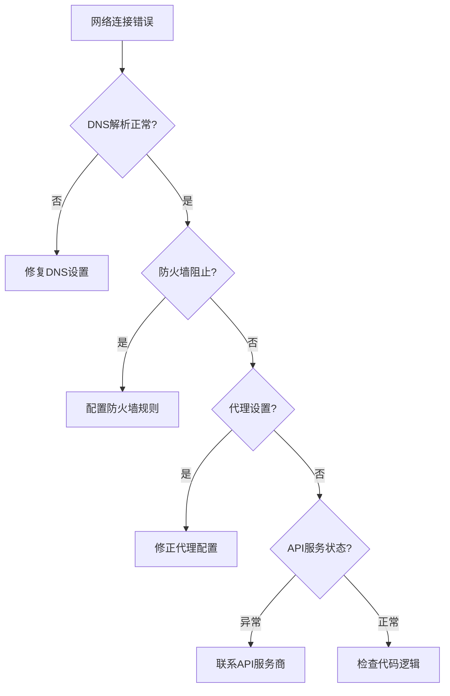

#### JSON解析问题

当AI返回格式错误的JSON时：

1. **检查思维链格式**：确保思维链和JSON分离清晰
2. **验证字段完整性**：确认所有必需字段存在
3. **数值范围检查**：验证价格、杠杆等数值的合理性
4. **风险回报比验证**：确保风险回报比≥3.0:1

### 日志分析指南

系统提供了详细的日志记录：

- **AI调用日志**：记录每次API调用的详细信息
- **重试日志**：显示重试次数和等待时间
- **错误日志**：记录具体的错误信息和堆栈跟踪
- **决策日志**：保存完整的决策过程和结果

**节来源**
- [mcp/client.go](file://mcp/client.go#L220-L247)
- [decision/engine.go](file://decision/engine.go#L500-L624)

## 总结

nofx项目的AI通信机制展现了现代量化交易系统的先进设计理念：

### 核心优势

1. **多模型支持**：统一接口支持DeepSeek、Qwen和自定义API
2. **智能错误处理**：完善的重试机制和错误恢复策略
3. **灵活配置**：支持多种部署场景和认证方式
4. **透明决策**：思维链分析确保决策过程可追溯
5. **性能优化**：并发处理和智能缓存提升效率

### 技术创新点

- **思维链推理**：将复杂的交易决策分解为可解释的推理过程
- **动态Prompt构建**：根据实时市场数据生成个性化的AI提示
- **严格验证机制**：确保AI决策的安全性和合规性
- **多平台集成**：支持币安、Hyperliquid和Aster等多个交易平台

### 应用价值

该AI通信机制不仅为nofx项目提供了强大的决策能力，也为其他量化交易系统的设计提供了宝贵的参考。通过标准化的API接口、灵活的配置选项和健壮的错误处理，系统能够在各种环境下稳定运行，为用户提供可靠的投资决策支持。