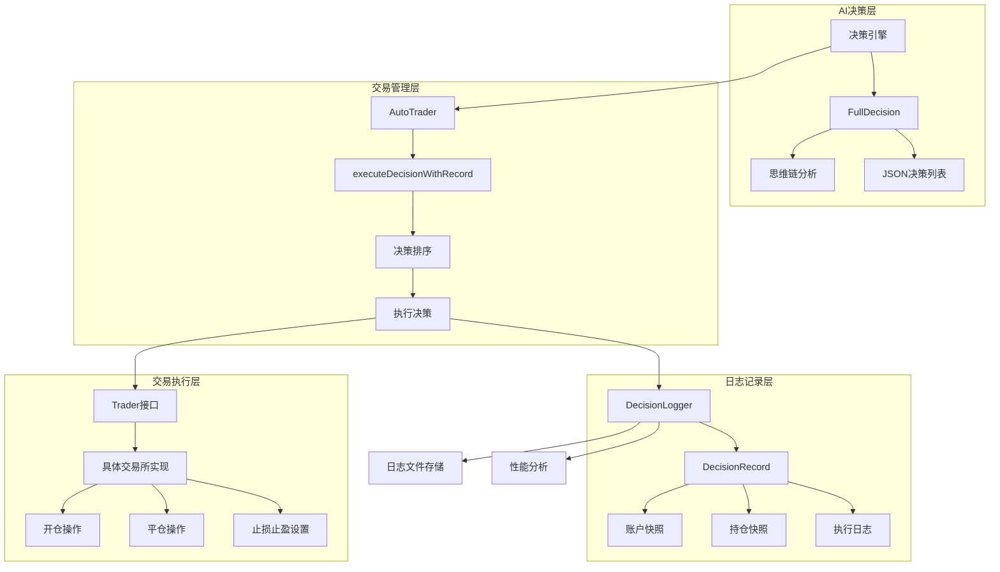
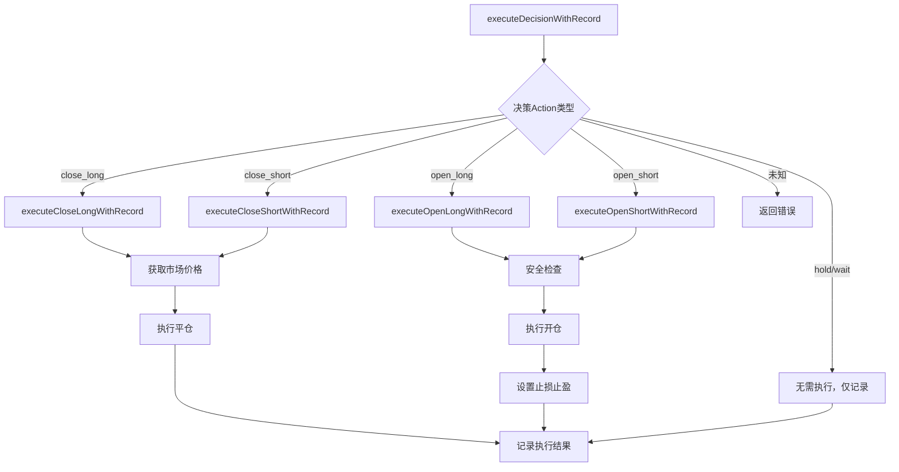
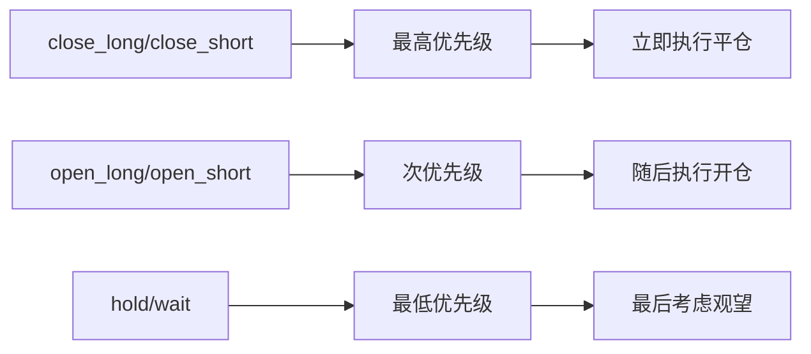
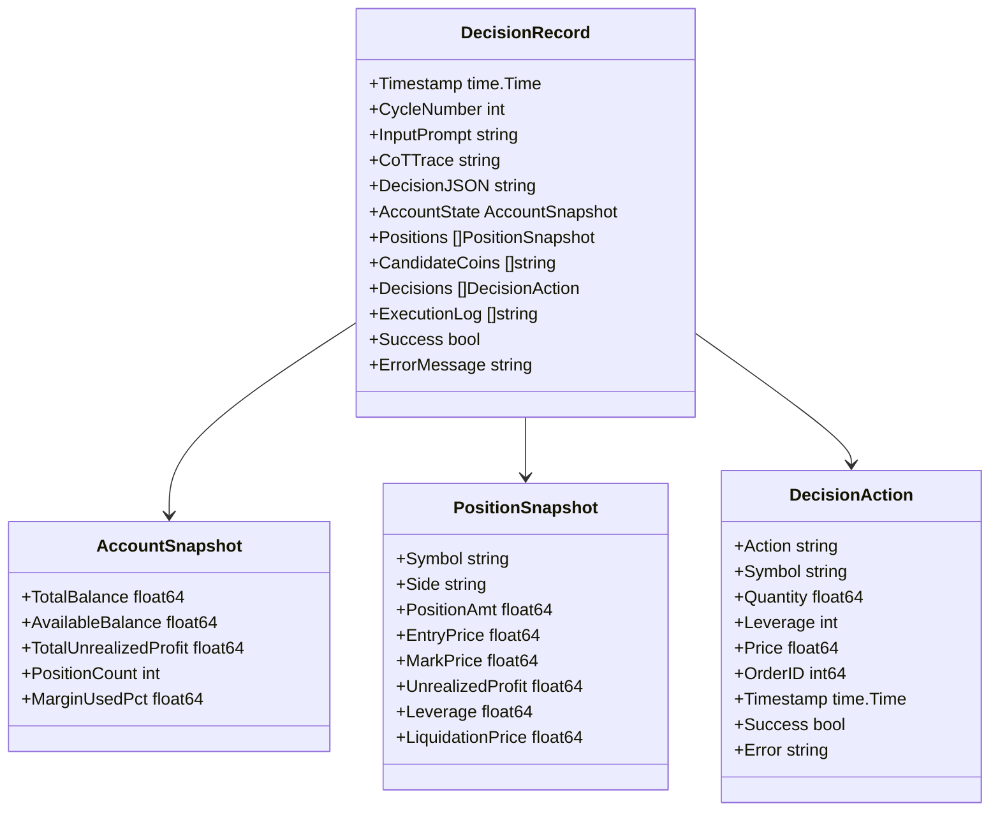
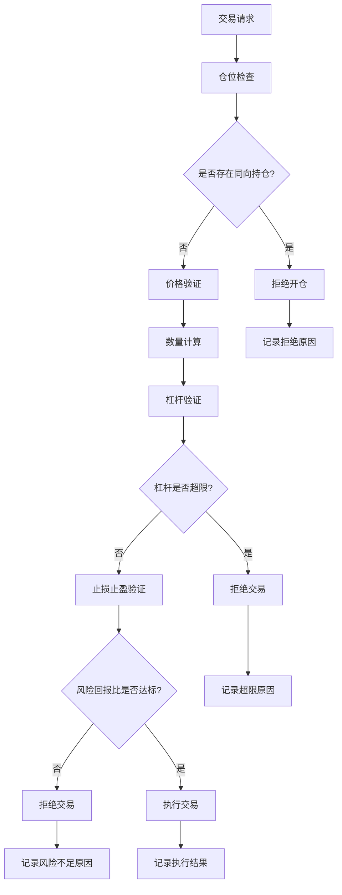
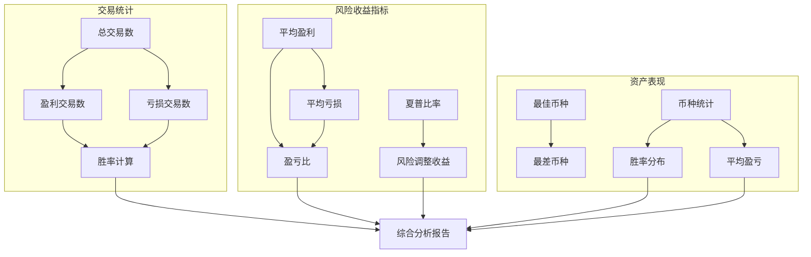
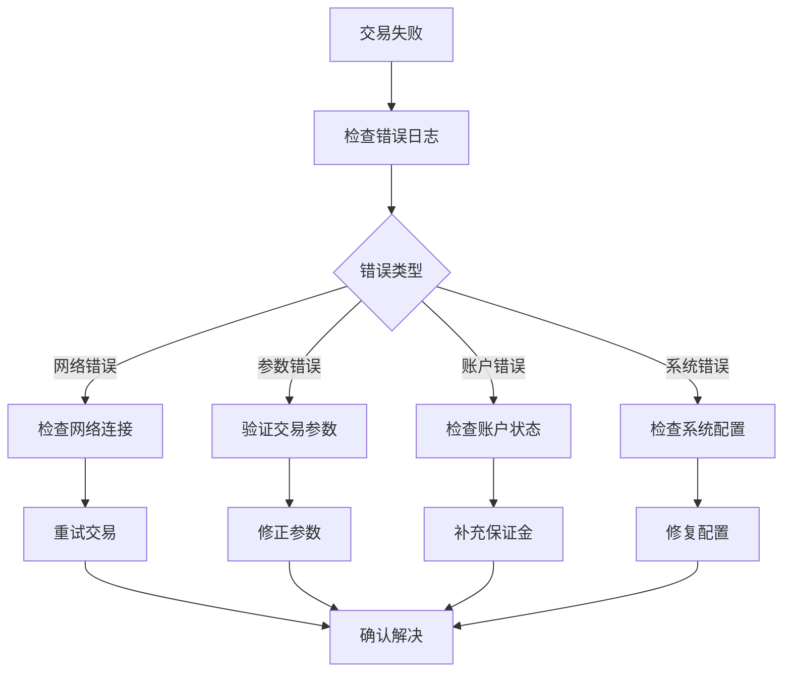

# 交易执行与日志记录

<cite>
**本文档引用的文件**
- [manager/trader_manager.go](file://manager/trader_manager.go)
- [logger/decision_logger.go](file://logger/decision_logger.go)
- [decision/engine.go](file://decision/engine.go)
- [trader/interface.go](file://trader/interface.go)
- [trader/auto_trader.go](file://trader/auto_trader.go)
- [README.md](file://README.md)
</cite>

## 目录
1. [简介](#简介)
2. [系统架构概览](#系统架构概览)
3. [executeDecisionWithRecord方法详解](#executedecisionwithrecord方法详解)
4. [决策排序机制](#决策排序机制)
5. [DecisionLogger日志记录系统](#decisionlogger日志记录系统)
6. [交易执行安全检查](#交易执行安全检查)
7. [日志文件存储结构](#日志文件存储结构)
8. [性能分析工具](#性能分析工具)
9. [交易执行失败排查](#交易执行失败排查)
10. [最佳实践建议](#最佳实践建议)

## 简介

nofx项目是一个基于AI驱动的自动化交易操作系统，采用统一的架构设计实现了从AI决策到交易执行的完整闭环。本文档详细阐述了交易执行的核心机制——`executeDecisionWithRecord`方法的工作原理，以及完整的日志记录系统如何确保交易的可追溯性和可分析性。

系统的核心设计理念是通过严格的决策排序机制和多重安全检查，确保交易执行的安全性和有效性，同时提供全面的日志记录功能以便于后续分析和优化。

## 系统架构概览



**图表来源**
- [decision/engine.go](file://decision/engine.go#L1-L50)
- [trader/auto_trader.go](file://trader/auto_trader.go#L68-L85)
- [logger/decision_logger.go](file://logger/decision_logger.go#L1-L50)

## executeDecisionWithRecord方法详解

`executeDecisionWithRecord`方法是交易执行的核心入口，负责根据AI决策执行具体的交易操作，并记录完整的执行过程。

### 方法签名与基本流程

该方法接收两个参数：
- `decision *decision.Decision`：AI生成的具体交易决策
- `actionRecord *logger.DecisionAction`：用于记录执行结果的决策动作对象

### 决策类型处理逻辑



**图表来源**
- [trader/auto_trader.go](file://trader/auto_trader.go#L546-L562)

### 开仓操作的安全检查

系统在执行开仓操作前实施严格的安全检查机制，防止仓位叠加导致的风险：

#### 多仓保护机制
- **同币种检查**：检测是否存在同方向的现有持仓
- **仓位叠加防护**：拒绝可能导致仓位叠加的操作
- **智能提示**：提供明确的错误信息指导用户

#### 开仓执行流程
1. **仓位检查**：验证当前持仓状态
2. **价格获取**：获取实时市场价格
3. **数量计算**：基于仓位大小和杠杆计算交易数量
4. **订单执行**：发送开仓指令
5. **止损止盈设置**：配置风险管理参数

**章节来源**
- [trader/auto_trader.go](file://trader/auto_trader.go#L564-L620)

## 决策排序机制

为了确保交易执行的安全性和效率，系统实现了智能的决策排序机制，采用"先平仓后开仓"的原则。

### 排序优先级定义



**图表来源**
- [trader/auto_trader.go](file://trader/auto_trader.go#L901-L934)

### 排序算法实现

排序算法采用简单而有效的比较排序方式：

1. **优先级映射**：将不同类型的决策映射到数值优先级
2. **稳定性保证**：保持相同优先级决策的相对顺序
3. **边界处理**：处理空决策列表和单一决策的情况

### 为什么需要排序？

- **风险控制**：先平仓可以释放保证金，降低整体风险
- **仓位管理**：避免同时进行换仓操作导致的仓位叠加
- **执行效率**：优化交易执行顺序，提高系统响应速度

**章节来源**
- [trader/auto_trader.go](file://trader/auto_trader.go#L901-L934)

## DecisionLogger日志记录系统

DecisionLogger是系统的核心日志记录组件，负责记录完整的交易决策和执行过程，为后续分析提供详尽的数据基础。

### 数据结构设计



**图表来源**
- [logger/decision_logger.go](file://logger/decision_logger.go#L10-L60)

### 记录完整性保障

系统确保每个决策周期都包含以下关键信息：

#### 思维链记录
- **AI推理过程**：完整的Chain of Thought分析
- **决策依据**：AI做出每个决策的具体理由
- **市场分析**：对当前市场状况的评估

#### 账户状态快照
- **实时余额**：账户的总资产和可用余额
- **持仓情况**：所有持仓的详细信息
- **保证金使用**：当前的保证金占用比例

#### 执行结果追踪
- **操作详情**：每个交易操作的具体参数
- **执行状态**：操作的成功与否
- **错误信息**：失败操作的详细错误原因

**章节来源**
- [logger/decision_logger.go](file://logger/decision_logger.go#L10-L60)

## 交易执行安全检查

系统在每个交易执行阶段都实施多层次的安全检查，确保交易的安全性和合规性。

### 多层次安全防护



**图表来源**
- [trader/auto_trader.go](file://trader/auto_trader.go#L564-L620)

### 具体安全检查项目

#### 仓位叠加防护
- **同方向检查**：防止同一币种同时存在多头和空头仓位
- **数量限制**：基于账户余额和杠杆计算最大可交易数量
- **风险控制**：确保单笔交易的风险在可控范围内

#### 价格和数量验证
- **精度检查**：确保价格和数量符合交易所要求
- **最小值验证**：防止发送过小的交易订单
- **合理性校验**：验证交易参数的合理性

#### 杠杆和风险控制
- **杠杆上限**：根据账户类型设置合理的杠杆上限
- **风险回报比**：强制要求至少1:3的风险回报比
- **保证金充足性**：确保有足够的保证金执行交易

**章节来源**
- [decision/engine.go](file://decision/engine.go#L500-L623)

## 日志文件存储结构

系统采用结构化的文件存储方式，确保日志数据的有序性和可访问性。

### 文件命名规范

日志文件采用标准化的命名格式：
```
decision_YYYYMMDD_HHMMSS_cycleN.json
```

其中：
- `YYYYMMDD`：决策日期
- `HHMMSS`：决策时间（24小时制）
- `cycleN`：周期编号（递增数字）

### 存储目录结构

```
decision_logs/
├── trader_id_1/
│   ├── decision_20241201_103000_cycle1.json
│   ├── decision_20241201_103300_cycle2.json
│   └── ...
├── trader_id_2/
│   ├── decision_20241201_103000_cycle1.json
│   └── ...
└── ...
```

### 数据持久化特性

- **原子性写入**：确保日志文件的完整性
- **目录隔离**：不同交易者使用独立的存储目录
- **自动清理**：支持按时间清理过期日志文件
- **备份友好**：JSON格式便于后续处理和分析

**章节来源**
- [logger/decision_logger.go](file://logger/decision_logger.go#L100-L150)

## 性能分析工具

系统内置了强大的性能分析功能，帮助用户深入了解交易表现和优化策略。

### 分析指标体系



**图表来源**
- [logger/decision_logger.go](file://logger/decision_logger.go#L400-L500)

### 关键性能指标

#### 交易表现指标
- **总交易数**：分析窗口内的总交易次数
- **胜率**：盈利交易占比，计算公式：盈利交易数 ÷ 总交易数 × 100%
- **盈亏比**：总盈利 ÷ 绝对值总亏损
- **平均盈亏**：单笔交易的平均收益

#### 风险调整指标
- **夏普比率**：风险调整后的收益指标
- **最大回撤**：账户净值的最大跌幅
- **波动率**：收益的标准差

#### 资产表现分析
- **最佳表现币种**：表现最好的交易标的
- **最差表现币种**：表现最差的交易标的
- **币种胜率分布**：各币种的交易胜率统计

**章节来源**
- [logger/decision_logger.go](file://logger/decision_logger.go#L400-L611)

## 交易执行失败排查

当交易执行失败时，系统提供了详细的错误信息和排查指南。

### 常见失败原因分类

#### 网络连接问题
- **API超时**：AI API请求超时或网络不稳定
- **连接中断**：交易所API连接异常
- **认证失败**：API密钥无效或权限不足

#### 参数验证错误
- **价格精度**：价格参数超出交易所精度要求
- **数量限制**：交易数量不符合最小/最大限制
- **杠杆超限**：请求的杠杆倍数超过账户限制

#### 账户状态问题
- **保证金不足**：账户可用保证金不足以执行交易
- **仓位冲突**：存在同方向的现有仓位
- **账户冻结**：账户被交易所暂时冻结

#### 系统配置问题
- **API密钥错误**：配置的API密钥不正确
- **交易所不可用**：目标交易所服务中断
- **时间同步**：系统时间与交易所时间不同步

### 排查步骤指南



### 故障恢复策略

#### 自动重试机制
- **指数退避**：失败后等待递增的时间间隔重试
- **最大重试次数**：防止无限重试导致资源浪费
- **条件判断**：仅对可恢复的错误进行重试

#### 人工干预提示
- **明确错误信息**：提供具体的错误原因和解决方案
- **操作建议**：指导用户如何解决问题
- **联系支持**：提供技术支持联系方式

**章节来源**
- [README.md](file://README.md#L1118-L1193)

## 最佳实践建议

基于系统的特性和实际应用经验，以下是推荐的最佳实践。

### 配置优化建议

#### 杠杆配置
- **保守策略**：对于新手用户，建议使用较低的杠杆倍数（3-5倍）
- **风险承受能力**：根据个人风险承受能力调整杠杆设置
- **账户类型适配**：子账户应使用更低的杠杆限制

#### AI模型选择
- **DeepSeek**：适合成本敏感的用户，性价比高
- **Qwen**：适合对决策质量要求较高的用户
- **自定义模型**：适合有特定需求的专业用户

### 监控和维护

#### 日志管理
- **定期备份**：重要交易周期的日志应定期备份
- **存储空间**：监控日志文件存储空间，及时清理过期文件
- **分析频率**：建议每日分析交易日志，及时发现问题

#### 性能监控
- **关键指标**：关注夏普比率、胜率、盈亏比等核心指标
- **趋势分析**：观察各项指标的变化趋势
- **异常检测**：及时发现性能异常的交易周期

### 风险控制

#### 仓位管理
- **分散投资**：避免过度集中在少数币种上
- **动态调整**：根据市场情况动态调整仓位
- **止损设置**：严格执行止损纪律

#### 系统维护
- **定期更新**：及时更新系统版本和依赖库
- **配置审查**：定期审查和优化系统配置
- **安全检查**：定期检查API密钥和账户安全

通过遵循这些最佳实践，用户可以更好地利用nofx系统的强大功能，实现稳定和高效的自动化交易。