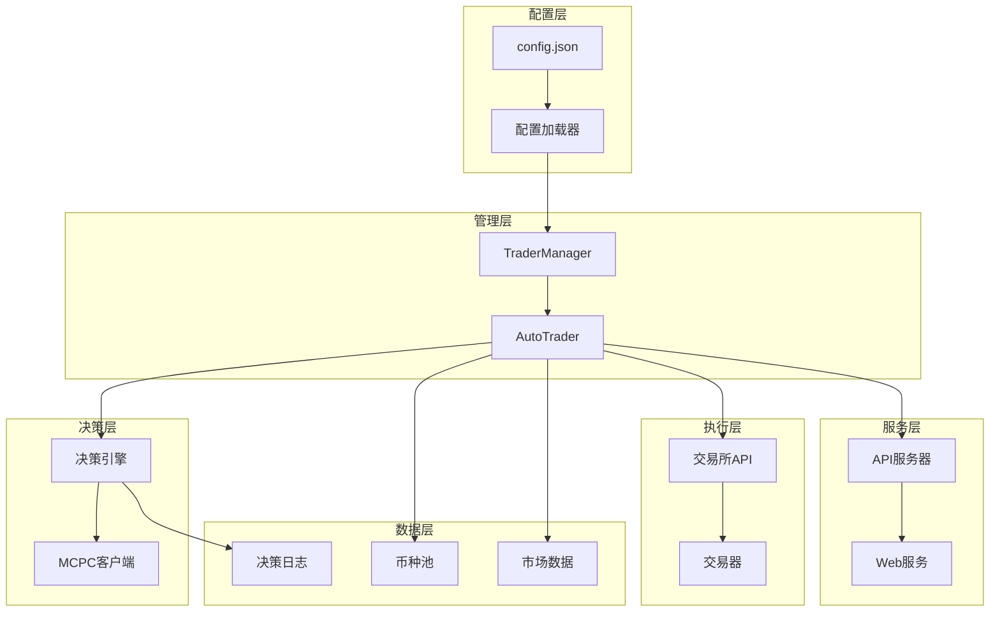
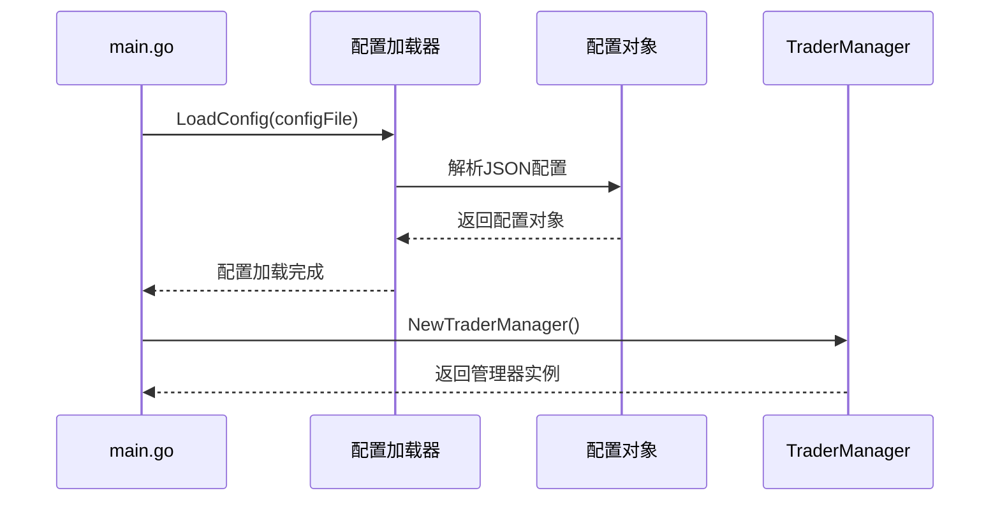
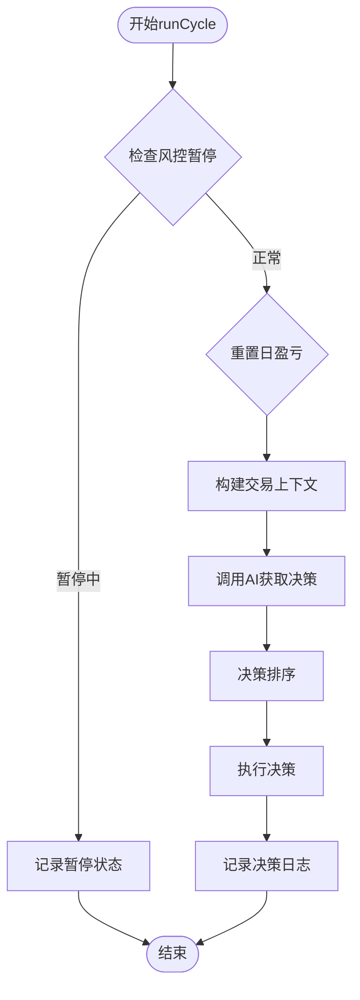
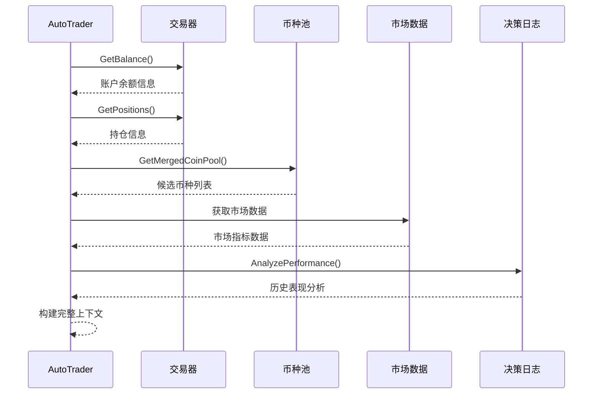
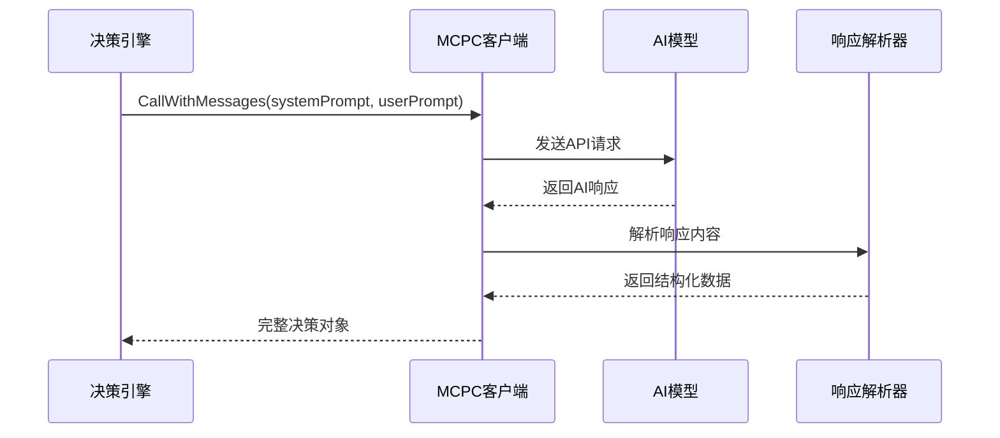
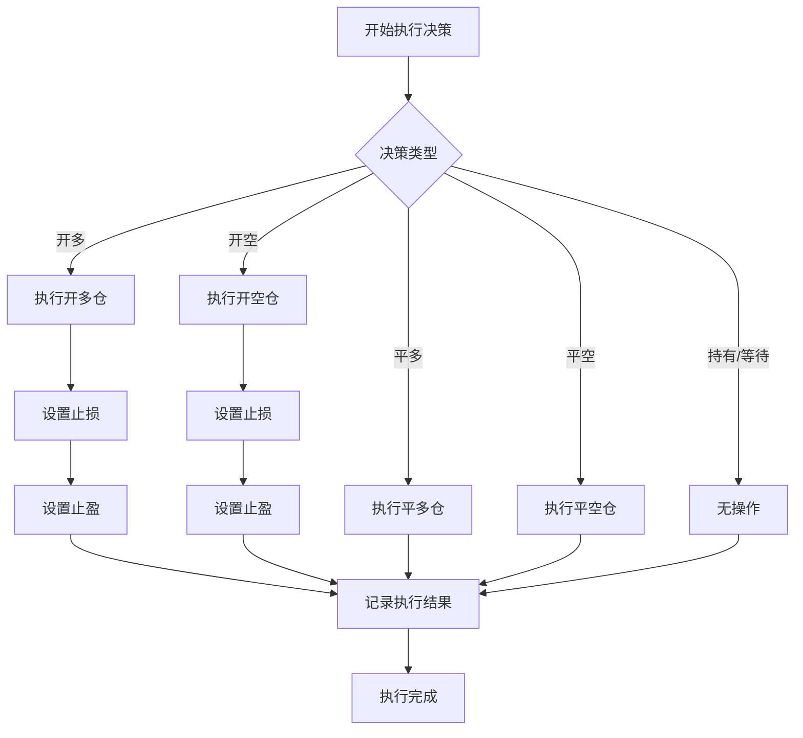
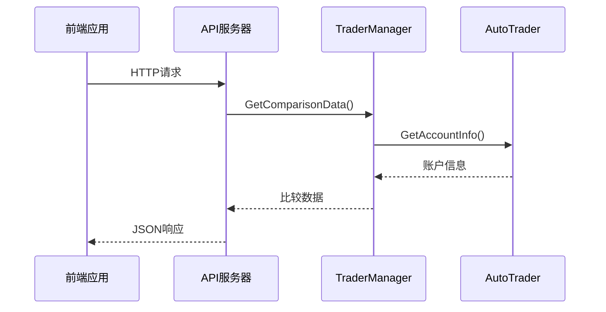
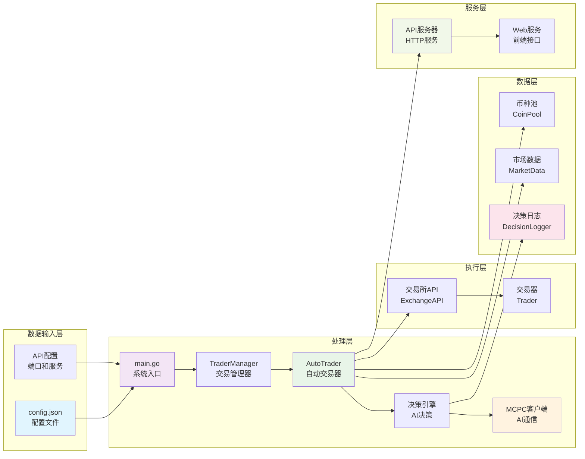

# 数据流

<cite>
**本文档引用的文件**
- [main.go](file://main.go)
- [manager/trader_manager.go](file://manager/trader_manager.go)
- [trader/auto_trader.go](file://trader/auto_trader.go)
- [mcp/client.go](file://mcp/client.go)
- [api/server.go](file://api/server.go)
- [decision/engine.go](file://decision/engine.go)
- [logger/decision_logger.go](file://logger/decision_logger.go)
- [pool/coin_pool.go](file://pool/coin_pool.go)
- [market/data.go](file://market/data.go)
- [config/config.go](file://config/config.go)
</cite>

## 目录
1. [简介](#简介)
2. [系统架构概览](#系统架构概览)
3. [数据流详细分析](#数据流详细分析)
4. [核心组件交互](#核心组件交互)
5. [数据流向图](#数据流向图)
6. [性能考虑](#性能考虑)
7. [故障排除指南](#故障排除指南)
8. [总结](#总结)

## 简介

nofx是一个基于AI驱动的加密货币交易竞赛系统，采用端到端的数据流架构，从配置文件加载开始，经过多个核心组件的处理，最终实现自动化交易决策和执行。本文档详细描述了从系统启动到交易执行的完整数据流过程。

## 系统架构概览

nofx系统采用模块化架构设计，主要包含以下核心组件：

**图表来源**
- [main.go](file://main.go#L1-L140)
- [manager/trader_manager.go](file://manager/trader_manager.go#L1-L173)
- [trader/auto_trader.go](file://trader/auto_trader.go#L1-L936)

## 数据流详细分析

### 1. 系统启动阶段

#### 配置文件加载
数据流从`config.json`配置文件开始，通过`main.go`中的`LoadConfig`函数加载系统配置。

**图表来源**
- [main.go](file://main.go#L20-L35)
- [config/config.go](file://config/config.go#L60-L85)

#### TraderManager初始化
`TraderManager`负责管理多个`AutoTrader`实例，每个实例代表一个独立的交易策略。

**章节来源**
- [main.go](file://main.go#L50-L85)
- [manager/trader_manager.go](file://manager/trader_manager.go#L15-L45)

### 2. AutoTrader运行周期

#### runCycle方法执行
每个`AutoTrader`实例通过`runCycle`方法定期执行交易决策循环。

**图表来源**
- [trader/auto_trader.go](file://trader/auto_trader.go#L250-L350)

#### buildTradingContext过程
`buildTradingContext`方法构建完整的交易上下文，包含账户信息、持仓数据和候选币种池。

**图表来源**
- [trader/auto_trader.go](file://trader/auto_trader.go#L400-L600)

### 3. AI决策处理

#### MCPC客户端通信
`mcp.Client`负责与AI模型进行通信，支持多种AI提供商。

**图表来源**
- [mcp/client.go](file://mcp/client.go#L80-L150)
- [decision/engine.go](file://decision/engine.go#L80-L120)

#### 决策验证和排序
AI返回的决策需要经过验证和排序处理。

**章节来源**
- [decision/engine.go](file://decision/engine.go#L500-L624)

### 4. 交易执行

#### executeDecisionWithRecord方法
执行具体的交易决策并记录详细信息。

**图表来源**
- [trader/auto_trader.go](file://trader/auto_trader.go#L700-L850)

### 5. 决策日志记录

#### 决策日志系统
所有交易决策都被记录到`DecisionLogger`中，支持历史数据分析和性能评估。

**章节来源**
- [logger/decision_logger.go](file://logger/decision_logger.go#L100-L200)

### 6. API服务器暴露

#### Web API接口
通过`api.Server`将交易数据暴露给前端应用。

**图表来源**
- [api/server.go](file://api/server.go#L100-L200)

**章节来源**
- [api/server.go](file://api/server.go#L300-L424)

## 核心组件交互

### 组件间数据传递

| 组件 | 输入数据 | 输出数据 | 处理逻辑 |
|------|----------|----------|----------|
| config.json | 配置参数 | 配置对象 | JSON解析和验证 |
| TraderManager | 配置列表 | AutoTrader实例 | 实例化和管理 |
| AutoTrader | 上下文数据 | 决策结果 | AI决策和执行 |
| MCPC客户端 | 系统提示+用户数据 | AI响应 | API调用和解析 |
| 决策日志 | 决策记录 | 日志文件 | 结构化存储 |
| API服务器 | 请求参数 | JSON响应 | 数据查询和格式化 |

**章节来源**
- [manager/trader_manager.go](file://manager/trader_manager.go#L25-L80)
- [trader/auto_trader.go](file://trader/auto_trader.go#L100-L200)

## 数据流向图

以下是nofx系统完整的数据流向图：

**图表来源**
- [main.go](file://main.go#L1-L140)
- [manager/trader_manager.go](file://manager/trader_manager.go#L1-L173)
- [trader/auto_trader.go](file://trader/auto_trader.go#L1-L936)

## 性能考虑

### 并发处理
- `TraderManager`使用互斥锁保护并发访问
- `AutoTrader`每个实例独立运行在单独的goroutine中
- AI API调用支持重试机制和超时控制

### 缓存策略
- 币种池数据缓存24小时
- 市场数据实时获取但有合理的缓存机制
- 决策日志采用异步写入模式

### 资源管理
- 定期清理旧的决策日志文件
- 控制同时连接数和请求频率
- 实现优雅关闭机制

## 故障排除指南

### 常见问题及解决方案

| 问题类型 | 症状 | 可能原因 | 解决方案 |
|----------|------|----------|----------|
| 配置加载失败 | 系统启动失败 | config.json格式错误 | 检查JSON语法和必需字段 |
| AI API调用失败 | 决策获取超时 | 网络连接或API密钥问题 | 验证网络连接和API密钥 |
| 交易执行失败 | 订单提交失败 | 账户余额不足或风控限制 | 检查账户状态和风控配置 |
| 数据同步问题 | 前端数据显示异常 | 缓存过期或数据不一致 | 清理缓存并重新同步 |

**章节来源**
- [mcp/client.go](file://mcp/client.go#L150-L200)
- [trader/auto_trader.go](file://trader/auto_trader.go#L800-L936)

### 监控和调试

系统提供了丰富的日志记录功能，可以通过以下方式监控系统状态：
- 查看`decision_logs`目录下的决策记录
- 使用API接口获取实时交易数据
- 监控系统日志输出的关键信息

## 总结

nofx项目展现了现代AI驱动交易系统的设计精髓，通过清晰的数据流架构实现了从配置管理到交易执行的完整自动化流程。系统的主要特点包括：

1. **模块化设计**：各组件职责明确，便于维护和扩展
2. **数据驱动**：基于实时市场数据和历史表现做出决策
3. **容错机制**：完善的错误处理和重试策略
4. **可观测性**：全面的日志记录和API监控接口
5. **高性能**：并发处理和智能缓存策略

这种设计不仅保证了系统的稳定性和可靠性，也为未来的功能扩展奠定了坚实的基础。通过深入理解这些数据流，开发者可以更好地维护系统、优化性能，并根据业务需求进行定制化开发。