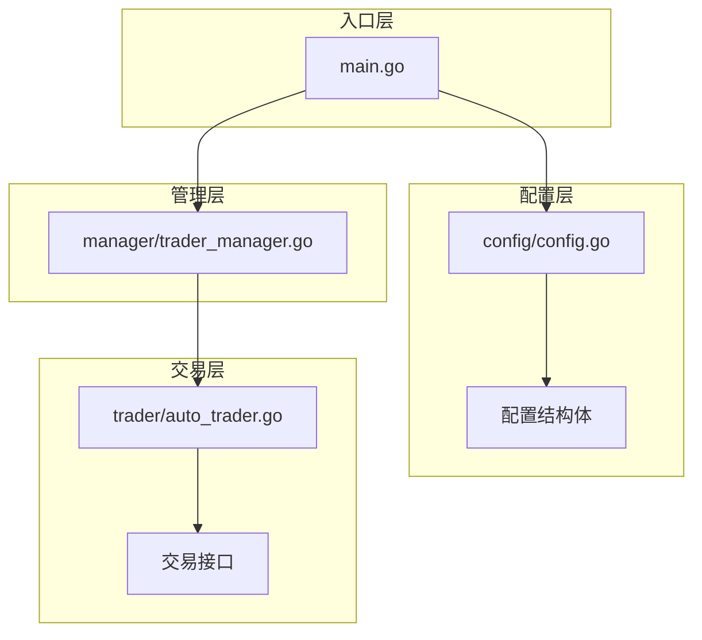
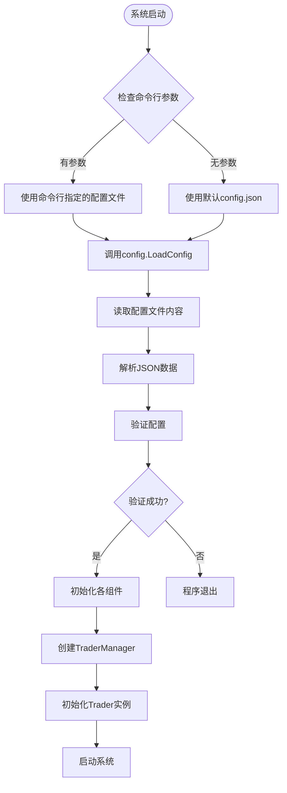
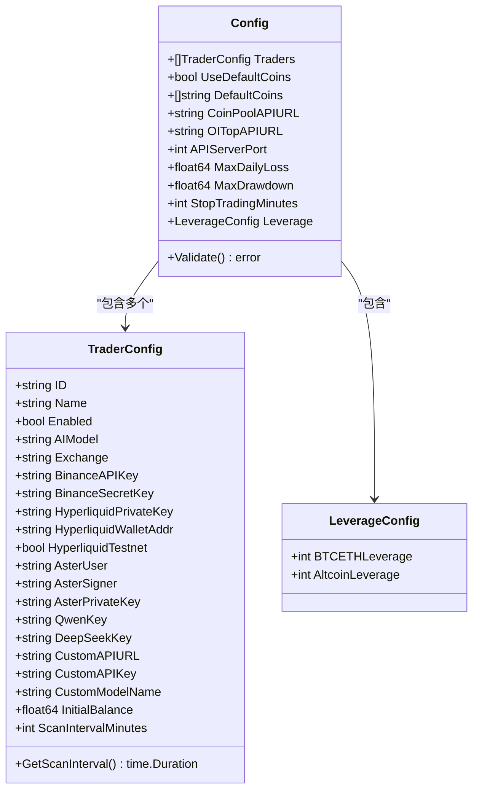
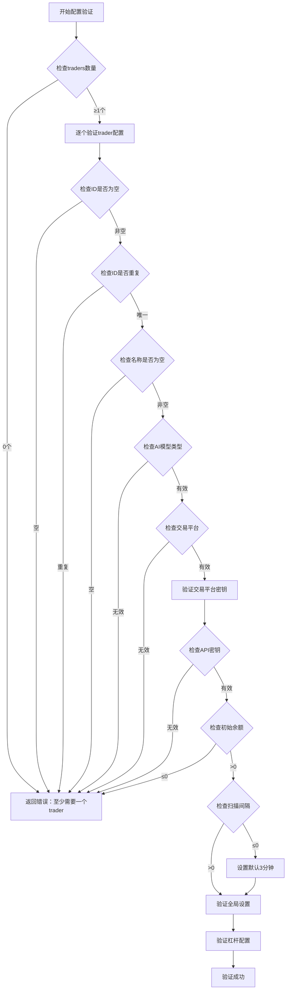
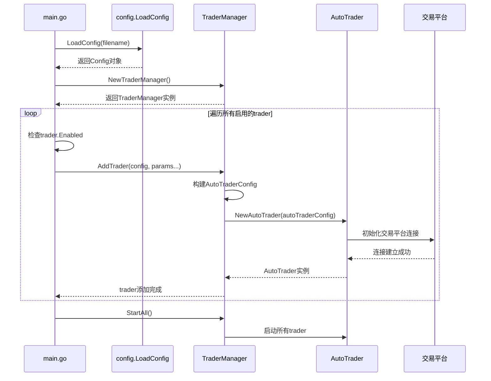
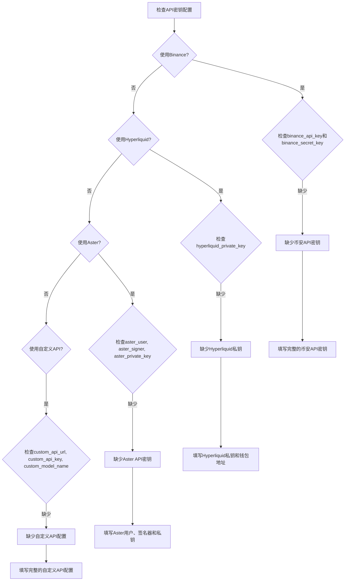

# 配置加载流程

<cite>
**本文档引用的文件**
- [main.go](file://main.go)
- [config/config.go](file://config/config.go)
- [manager/trader_manager.go](file://manager/trader_manager.go)
- [config.json.example](file://config.json.example)
- [README.md](file://README.md)
- [README.zh-CN.md](file://README.zh-CN.md)
</cite>

## 目录
1. [简介](#简介)
2. [项目结构概览](#项目结构概览)
3. [配置文件加载流程](#配置文件加载流程)
4. [配置结构体定义](#配置结构体定义)
5. [配置验证机制](#配置验证机制)
6. [TraderManager配置初始化](#tradermanager配置初始化)
7. [配置文件示例](#配置文件示例)
8. [常见配置错误及解决方案](#常见配置错误及解决方案)
9. [总结](#总结)

## 简介

nofx项目是一个基于Go语言开发的AI驱动交易操作系统，支持多种加密货币交易所和AI模型。系统的核心功能依赖于灵活的配置系统，该系统负责从JSON文件加载配置、验证配置的有效性，并将配置传递给各个组件进行初始化。

本文档详细描述了nofx项目中配置加载的完整流程，包括从文件读取到最终系统初始化的每个步骤。

## 项目结构概览

nofx项目采用模块化架构设计，主要包含以下核心模块：



**图表来源**
- [main.go](file://main.go#L1-L140)
- [config/config.go](file://config/config.go#L1-L202)
- [manager/trader_manager.go](file://manager/trader_manager.go#L1-L173)

## 配置文件加载流程

### 系统启动时的配置加载

系统启动时，main函数首先确定配置文件的位置：



**图表来源**
- [main.go](file://main.go#L18-L35)
- [config/config.go](file://config/config.go#L68-L85)

### 配置加载函数实现

配置加载的核心逻辑位于`config.LoadConfig`函数中：

**节来源**
- [config/config.go](file://config/config.go#L68-L85)

该函数执行以下关键步骤：
1. **文件读取**：使用`os.ReadFile`读取配置文件
2. **JSON解析**：通过`json.Unmarshal`将文件内容解析为Config结构体
3. **默认值设置**：自动设置缺失的配置项的默认值
4. **配置验证**：调用`Validate()`方法验证配置的有效性

### 默认值设置机制

系统实现了智能的默认值设置机制：

**节来源**
- [config/config.go](file://config/config.go#L87-L100)

默认值设置规则：
- 当`use_default_coins`为false且未配置`coin_pool_api_url`时，自动启用默认币种列表
- 如果`DefaultCoins`为空，使用内置的8个主流币种列表
- API服务器端口默认为8080
- 杠杆配置使用安全值（BTC/ETH: 5倍，山寨币: 5倍）

## 配置结构体定义

### 核心配置结构



**图表来源**
- [config/config.go](file://config/config.go#L15-L76)

### TraderConfig详细字段说明

| 字段名 | 类型 | 必需性 | 描述 |
|--------|------|--------|------|
| `id` | string | ✅ 必需 | trader的唯一标识符 |
| `name` | string | ✅ 必需 | 显示名称 |
| `enabled` | bool | ✅ 必需 | 是否启用该trader |
| `ai_model` | string | ✅ 必需 | AI提供商："qwen"、"deepseek"或"custom" |
| `exchange` | string | ✅ 必需 | 交易平台："binance"、"hyperliquid"或"aster" |
| `initial_balance` | float64 | ✅ 必需 | 初始资金余额 |
| `scan_interval_minutes` | int | ✅ 必需 | 决策扫描间隔（分钟） |

**节来源**
- [config/config.go](file://config/config.go#L15-L42)

## 配置验证机制

### 验证流程



**图表来源**
- [config/config.go](file://config/config.go#L102-L190)

### 关键验证规则

**节来源**
- [config/config.go](file://config/config.go#L102-L190)

系统执行以下验证规则：
1. **trader数量验证**：至少需要配置一个trader
2. **唯一性验证**：每个trader的ID必须唯一
3. **必填字段验证**：ID、名称、AI模型等字段不能为空
4. **类型验证**：AI模型必须是"qwen"、"deepseek"或"custom"
5. **交易平台验证**：必须选择有效的交易平台
6. **密钥验证**：根据交易平台要求验证相应的API密钥
7. **数值范围验证**：初始余额必须大于0，扫描间隔必须大于0
8. **杠杆验证**：设置合理的杠杆上限值

## TraderManager配置初始化

### 配置传递路径



**图表来源**
- [main.go](file://main.go#L45-L85)
- [manager/trader_manager.go](file://manager/trader_manager.go#L25-L55)

### 配置转换过程

**节来源**
- [manager/trader_manager.go](file://manager/trader_manager.go#L25-L55)

TraderManager在添加trader时，将配置结构转换为AutoTrader所需的配置格式：

1. **基础配置映射**：将TraderConfig中的字段直接映射到AutoTraderConfig
2. **条件配置**：根据AI模型类型设置相应的API密钥
3. **时间配置**：将扫描间隔转换为time.Duration类型
4. **杠杆配置**：传递杠杆设置给每个trader实例
5. **风险控制配置**：传递最大日亏损、最大回撤等风险参数

## 配置文件示例

### 完整配置示例

以下是基于config.json.example的完整配置示例：

**节来源**
- [config.json.example](file://config.json.example#L1-L85)

该示例展示了：
- **多交易平台支持**：同时配置Hyperliquid、Binance和Aster三个交易平台
- **不同AI模型**：包含DeepSeek、Qwen和自定义API三种AI模型
- **完整的风险控制设置**：包括每日最大亏损、最大回撤和交易停止时间
- **智能默认值**：使用默认币种列表，无需额外配置币种池API

### 不同场景的配置模板

#### 单交易平台配置（新手推荐）

```json
{
  "traders": [
    {
      "id": "my_trader",
      "name": "我的AI交易员",
      "enabled": true,
      "ai_model": "deepseek",
      "exchange": "binance",
      "binance_api_key": "YOUR_BINANCE_API_KEY",
      "binance_secret_key": "YOUR_BINANCE_SECRET_KEY",
      "deepseek_key": "sk-your_deepseek_key",
      "initial_balance": 1000.0,
      "scan_interval_minutes": 3
    }
  ],
  "leverage": {
    "btc_eth_leverage": 5,
    "altcoin_leverage": 5
  },
  "use_default_coins": true,
  "api_server_port": 8080
}
```

#### 多交易平台竞争配置

```json
{
  "traders": [
    {
      "id": "qwen_trader",
      "name": "Qwen AI交易员",
      "enabled": true,
      "ai_model": "qwen",
      "exchange": "binance",
      "binance_api_key": "QWEN_API_KEY_1",
      "binance_secret_key": "QWEN_SECRET_KEY_1",
      "qwen_key": "sk-qwen_key",
      "initial_balance": 1000.0,
      "scan_interval_minutes": 3
    },
    {
      "id": "deepseek_trader",
      "name": "DeepSeek AI交易员",
      "enabled": true,
      "ai_model": "deepseek",
      "exchange": "binance",
      "binance_api_key": "DEEPSEEK_API_KEY_2",
      "binance_secret_key": "DEEPSEEK_SECRET_KEY_2",
      "deepseek_key": "sk-deepseek_key",
      "initial_balance": 1000.0,
      "scan_interval_minutes": 3
    }
  ],
  "leverage": {
    "btc_eth_leverage": 5,
    "altcoin_leverage": 5
  },
  "use_default_coins": true,
  "api_server_port": 8080
}
```

## 常见配置错误及解决方案

### 配置文件相关错误

#### 1. 配置文件不存在或路径错误

**错误表现**：
```
❌ 加载配置失败: 读取配置文件失败: open config.json: no such file or directory
```

**解决方案**：
- 确保配置文件存在于当前工作目录
- 使用命令行参数指定配置文件路径：`./nofx custom_config.json`
- 复制示例配置文件：`cp config.json.example config.json`

#### 2. JSON格式错误

**错误表现**：
```
❌ 加载配置失败: 解析配置文件失败: invalid character '}' looking for beginning of value
```

**解决方案**：
- 检查JSON语法，确保括号匹配
- 验证逗号使用正确
- 确保字符串使用双引号
- 使用JSON验证工具检查格式

### 配置验证相关错误

#### 1. trader配置错误

**常见错误类型**：

| 错误类型 | 错误信息 | 解决方案 |
|----------|----------|----------|
| ID重复 | `trader[1]: ID 'trader1' 重复` | 确保每个trader的ID唯一 |
| 必填字段为空 | `trader[0]: ID不能为空` | 填写所有必需字段 |
| AI模型无效 | `trader[0]: ai_model必须是 'qwen', 'deepseek' 或 'custom'` | 使用正确的AI模型名称 |
| 交易平台无效 | `trader[0]: exchange必须是 'binance', 'hyperliquid' 或 'aster'` | 选择有效的交易平台 |

#### 2. API密钥配置错误

**常见错误**：



**图表来源**
- [config/config.go](file://config/config.go#L120-L150)

#### 3. 数值配置错误

**常见错误**：
- `initial_balance必须大于0`：设置正数的初始余额
- `scan_interval_minutes必须大于0`：设置合理的扫描间隔（3-5分钟推荐）
- 杠杆配置过高：根据账户类型设置合适的杠杆倍数

### 运行时配置问题

#### 1. 权限配置问题

**Binance API权限不足**：
- 确保API密钥具有Futures权限
- 检查IP白名单设置
- 验证API密钥有效性

**Hyperliquid私钥问题**：
- 确保私钥不包含`0x`前缀
- 验证钱包地址与私钥匹配
- 确保钱包有足够的资金

#### 2. 网络连接问题

**常见症状**：
- 连接超时错误
- API访问被拒绝
- 数据获取失败

**解决方案**：
- 检查网络连接
- 验证API端点可用性
- 检查防火墙设置

## 总结

nofx项目的配置加载系统设计精良，具有以下特点：

### 核心优势

1. **模块化设计**：配置加载、验证和应用分离，职责清晰
2. **智能默认值**：自动设置合理的默认配置，降低使用门槛
3. **严格验证**：多层次的配置验证机制，确保系统稳定性
4. **灵活扩展**：支持多种交易平台和AI模型，适应不同需求
5. **错误友好**：提供详细的错误信息和解决方案指导

### 最佳实践建议

1. **配置文件管理**：
   - 使用版本控制系统管理配置文件
   - 为不同环境准备不同的配置文件
   - 定期备份重要配置

2. **安全性考虑**：
   - 不要将配置文件提交到公共仓库
   - 使用环境变量存储敏感信息
   - 定期轮换API密钥

3. **性能优化**：
   - 合理设置扫描间隔，平衡响应速度和资源消耗
   - 根据账户类型设置适当的杠杆配置
   - 监控系统资源使用情况

4. **故障排除**：
   - 建立完善的日志记录机制
   - 准备常见问题的快速解决方案
   - 定期测试配置的有效性

通过遵循本文档的指导，用户可以有效地配置和使用nofx项目，充分发挥其AI驱动交易系统的优势。