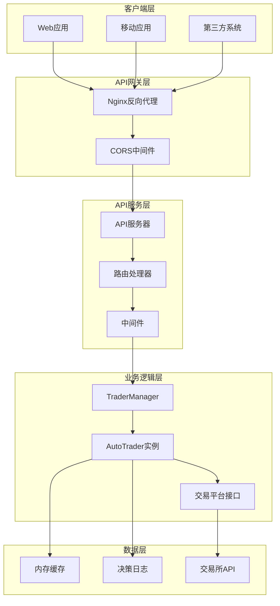
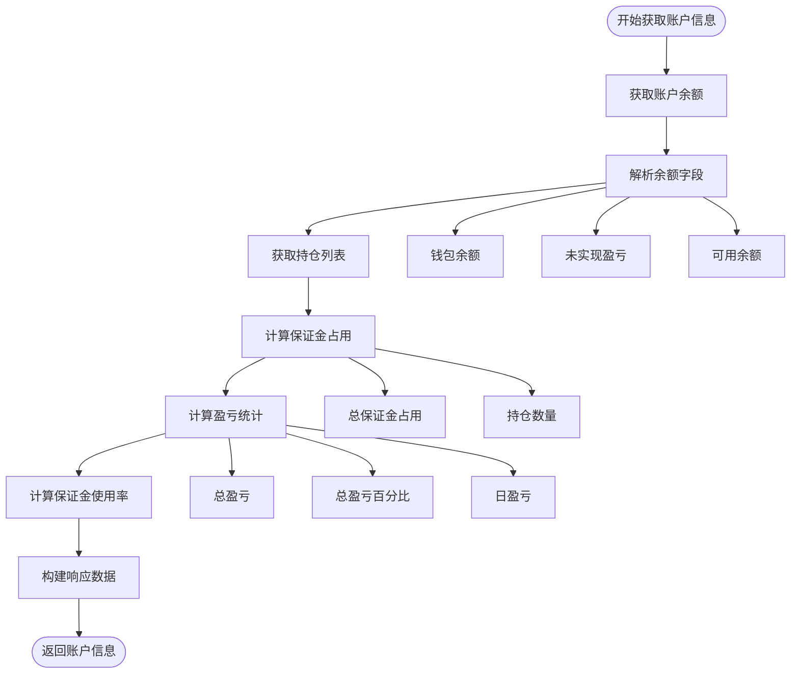
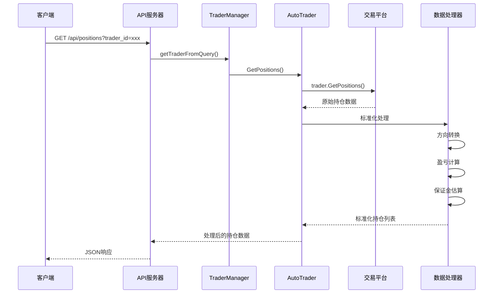
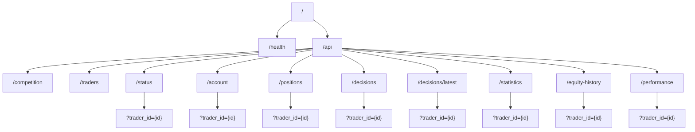
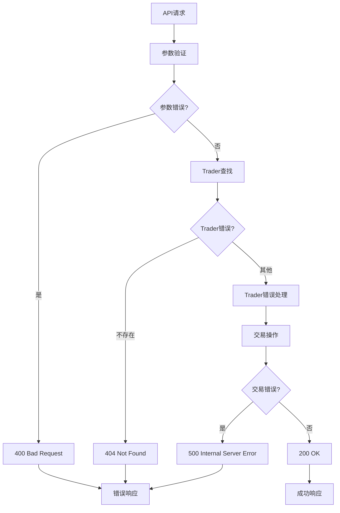
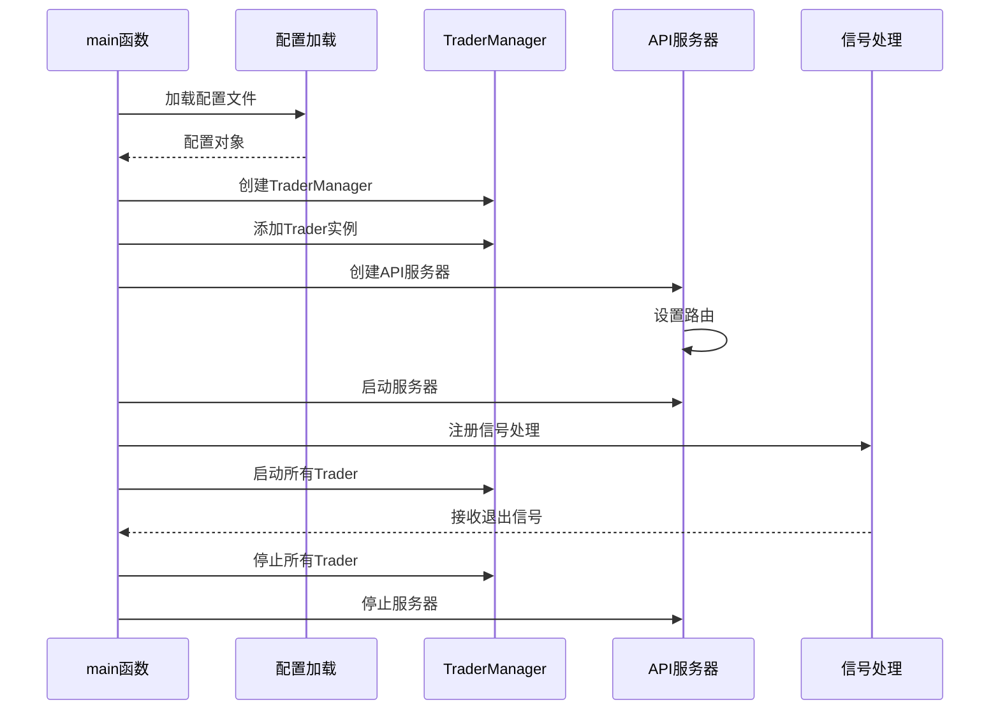

# AutoTrader对外API接口详细文档

<cite>
**本文档引用的文件**
- [api/server.go](file://api/server.go)
- [manager/trader_manager.go](file://manager/trader_manager.go)
- [trader/auto_trader.go](file://trader/auto_trader.go)
- [trader/interface.go](file://trader/interface.go)
- [main.go](file://main.go)
- [config/config.go](file://config/config.go)
</cite>

## 目录
1. [简介](#简介)
2. [API架构概览](#api架构概览)
3. [核心API方法详解](#核心api方法详解)
4. [API路由设计](#api路由设计)
5. [访问控制机制](#访问控制机制)
6. [数据标准化处理](#数据标准化处理)
7. [错误处理机制](#错误处理机制)
8. [性能监控与日志](#性能监控与日志)
9. [部署配置](#部署配置)
10. [最佳实践指南](#最佳实践指南)

## 简介

AutoTrader系统提供了完整的RESTful API接口，为外部系统提供实时的交易数据访问能力。该API系统采用Go语言开发，基于Gin框架构建，支持多交易平台（币安、Hyperliquid、Aster）的统一数据接口。

### 主要功能特性
- **实时状态监控**：提供系统运行状态、AI模型信息、运行时间等关键指标
- **账户数据聚合**：整合账户余额、持仓信息、盈亏统计等核心财务数据
- **标准化持仓处理**：统一不同交易平台的持仓数据格式，提供方向转换和风险计算
- **访问控制**：基于TraderManager的权限管理机制
- **高性能响应**：内置缓存机制和优化的数据处理流程

## API架构概览



**架构图来源**
- [api/server.go](file://api/server.go#L10-L30)
- [manager/trader_manager.go](file://manager/trader_manager.go#L10-L20)

## 核心API方法详解

### GetStatus 方法 - 系统状态查询

GetStatus方法提供AutoTrader系统的实时运行状态信息，是外部系统监控系统健康状况的主要接口。

#### 方法签名
```go
func (at *AutoTrader) GetStatus() map[string]interface{}
```

#### 返回数据结构

| 字段名 | 类型 | 描述 | 示例值 |
|--------|------|------|--------|
| trader_id | string | Trader唯一标识符 | "qwen_trader" |
| trader_name | string | Trader显示名称 | "Qwen交易员" |
| ai_model | string | AI模型名称 | "qwen" |
| exchange | string | 交易平台 | "binance" |
| is_running | bool | 系统运行状态 | true |
| start_time | string | 系统启动时间 | "2024-01-01T10:00:00Z" |
| runtime_minutes | int | 运行时长（分钟） | 1200 |
| call_count | int | AI调用次数 | 156 |
| initial_balance | float64 | 初始资金余额 | 10000.0 |
| scan_interval | string | 扫描间隔 | "3m0s" |
| stop_until | string | 停止交易时间 | "2024-01-01T12:00:00Z" |
| last_reset_time | string | 最后重置时间 | "2024-01-01T00:00:00Z" |
| ai_provider | string | AI提供商 | "Qwen" |

#### 关键指标说明

**交易ID管理**：
- 每个Trader实例都有唯一的`trader_id`，用于区分不同的交易策略
- ID格式通常为`"{model}_{platform}"`，如"qwen_binance"

**AI模型追踪**：
- `ai_model`字段标识使用的AI模型类型（"qwen"、"deepseek"、"custom"）
- `ai_provider`字段提供更详细的提供商信息

**运行时间计算**：
- `runtime_minutes`基于`startTime`和当前时间计算
- 精确到分钟级别，便于监控系统运行时长

**调用次数统计**：
- `call_count`记录AI模型被调用的总次数
- 用于评估AI模型的使用频率和负载情况

**节来源**
- [trader/auto_trader.go](file://trader/auto_trader.go#L780-L800)
- [api/server.go](file://api/server.go#L140-L155)

### GetAccountInfo 方法 - 账户信息聚合

GetAccountInfo方法整合多个数据源，提供完整的账户财务信息，包括实时余额、持仓盈亏、保证金使用情况等关键指标。

#### 数据聚合流程



**流程图来源**
- [trader/auto_trader.go](file://trader/auto_trader.go#L780-L848)

#### 返回数据结构

| 核心字段 | 类型 | 描述 | 计算方式 |
|----------|------|------|----------|
| total_equity | float64 | 账户净值 | wallet_balance + unrealized_profit |
| wallet_balance | float64 | 钱包余额 | 从交易API获取的总钱包余额 |
| unrealized_profit | float64 | 未实现盈亏 | 从交易API获取的未实现盈亏 |
| available_balance | float64 | 可用余额 | 从交易API获取的可用余额 |
| total_pnl | float64 | 总盈亏 | total_equity - initial_balance |
| total_pnl_pct | float64 | 总盈亏百分比 | (total_pnl / initial_balance) × 100 |
| total_unrealized_pnl | float64 | 未实现盈亏总额 | 基于持仓计算的未实现盈亏 |
| initial_balance | float64 | 初始资金余额 | 配置文件中设置的初始余额 |
| daily_pnl | float64 | 日盈亏 | 当天累计盈亏 |
| position_count | int | 持仓数量 | 当前持有的合约数量 |
| margin_used | float64 | 保证金占用 | 基于持仓计算的保证金总额 |
| margin_used_pct | float64 | 保证金使用率 | (margin_used / total_equity) × 100 |

#### 保证金使用率计算

保证金使用率是衡量资金利用效率的重要指标：

```go
// 保证金使用率计算公式
marginUsedPct := (totalMarginUsed / totalEquity) * 100
```

该指标帮助用户了解资金的使用效率，过高可能意味着风险增加，过低可能意味着资金利用不足。

**节来源**
- [trader/auto_trader.go](file://trader/auto_trader.go#L780-L848)
- [api/server.go](file://api/server.go#L158-L206)

### GetPositions 方法 - 持仓数据标准化

GetPositions方法提供标准化的持仓数据接口，统一不同交易平台的持仓格式，并进行必要的数据转换和风险计算。

#### 持仓数据标准化流程



**序列图来源**
- [api/server.go](file://api/server.go#L208-L225)
- [trader/auto_trader.go](file://trader/auto_trader.go#L849-L897)

#### 标准化字段说明

| 字段名 | 类型 | 描述 | 处理方式 |
|--------|------|------|----------|
| symbol | string | 交易对符号 | 保持原始格式，如"BTCUSDT" |
| side | string | 持仓方向 | "long"或"short" |
| entry_price | float64 | 开仓价格 | 保持原始数值 |
| mark_price | float64 | 标记价格 | 保持原始数值 |
| quantity | float64 | 持仓数量 | 转换为正数显示 |
| leverage | int | 杠杆倍数 | 保持原始整数值 |
| unrealized_pnl | float64 | 未实现盈亏 | 保持原始数值 |
| unrealized_pnl_pct | float64 | 未实现盈亏百分比 | 基于标记价格计算 |
| liquidation_price | float64 | 强平价格 | 保持原始数值 |
| margin_used | float64 | 保证金占用 | 基于数量和杠杆估算 |

#### 方向转换机制

持仓方向的标准化处理：

```go
// 方向转换逻辑
if quantity < 0 {
    quantity = -quantity  // 转换为正数
    side = "short"        // 空头持仓
} else {
    side = "long"         // 多头持仓
}
```

这种标准化确保了所有持仓数据都以统一的方向表示，便于后续的风险管理和数据分析。

#### 盈亏百分比计算

未实现盈亏百分比的计算公式：

```go
// 多头持仓盈亏百分比
pnlPct = ((markPrice - entryPrice) / entryPrice) * leverage * 100

// 空头持仓盈亏百分比  
pnlPct = ((entryPrice - markPrice) / entryPrice) * leverage * 100
```

该计算考虑了杠杆因素，提供了更准确的风险评估指标。

#### 保证金占用估算

保证金占用的估算方法：

```go
// 保证金计算公式
marginUsed = (quantity * markPrice) / leverage
```

这个估算基于当前市场价格和杠杆倍数，为用户提供了一个快速的风险评估工具。

**节来源**
- [trader/auto_trader.go](file://trader/auto_trader.go#L849-L897)
- [api/server.go](file://api/server.go#L208-L225)

## API路由设计

### 路由层次结构

AutoTrader API采用清晰的RESTful路由设计，所有API请求都通过`/api`前缀访问。



**架构图来源**
- [api/server.go](file://api/server.go#L48-L68)

### 路由参数规范

#### 查询参数
所有需要指定Trader的路由都支持`trader_id`查询参数：

```bash
# 指定特定Trader
GET /api/status?trader_id=qwen_trader

# 如果不指定，使用第一个可用的Trader
GET /api/account
```

#### 响应格式
所有API响应都采用标准的JSON格式：

```json
{
    "success": true,
    "data": {},
    "error": null
}
```

### 健康检查端点

```bash
GET /health
```

健康检查端点提供系统状态的基本信息，常用于负载均衡器和服务发现机制。

**节来源**
- [api/server.go](file://api/server.go#L48-L68)
- [api/server.go](file://api/server.go#L70-L85)

## 访问控制机制

### TraderManager访问控制

AutoTrader系统采用基于TraderManager的集中式访问控制机制，确保API请求的安全性和数据隔离。

```mermaid
classDiagram
class TraderManager {
+map[string]*AutoTrader traders
+sync.RWMutex mu
+GetTrader(id string) AutoTrader
+GetTraderIDs() []string
+GetAllTraders() map[string]AutoTrader
+GetComparisonData() map[string]interface{}
}
class AutoTrader {
+string id
+string name
+string aiModel
+bool isRunning
+int callCount
+GetStatus() map[string]interface{}
+GetAccountInfo() map[string]interface{}
+GetPositions() []map[string]interface{}
}
class Server {
+*gin.Engine router
+*TraderManager traderManager
+int port
+handleStatus(c *gin.Context)
+handleAccount(c *gin.Context)
+handlePositions(c *gin.Context)
}
TraderManager --> AutoTrader : manages
Server --> TraderManager : uses
Server --> AutoTrader : accesses
```

**类图来源**
- [manager/trader_manager.go](file://manager/trader_manager.go#L10-L20)
- [api/server.go](file://api/server.go#L10-L30)

### 访问控制流程

#### 1. 请求验证
```go
// 从查询参数获取Trader ID
traderID := c.Query("trader_id")
if traderID == "" {
    // 如果没有指定，返回第一个可用的Trader
    ids := s.traderManager.GetTraderIDs()
    if len(ids) == 0 {
        return nil, "", fmt.Errorf("没有可用的trader")
    }
    traderID = ids[0]
}
```

#### 2. Trader查找
```go
// 通过TraderManager查找指定的Trader
trader, err := s.traderManager.GetTrader(traderID)
if err != nil {
    return nil, "", fmt.Errorf("trader ID '%s' 不存在", traderID)
}
```

#### 3. 权限检查
每个API方法都会进行以下权限检查：
- Trader是否存在
- Trader是否已启动
- 用户是否有访问权限

### 并发安全机制

TraderManager使用读写锁确保并发安全性：

```go
// 读操作使用读锁
func (tm *TraderManager) GetTrader(id string) (*trader.AutoTrader, error) {
    tm.mu.RLock()
    defer tm.mu.RUnlock()
    // ...
}

// 写操作使用写锁
func (tm *TraderManager) AddTrader(...) error {
    tm.mu.Lock()
    defer tm.mu.Unlock()
    // ...
}
```

**节来源**
- [api/server.go](file://api/server.go#L95-L110)
- [manager/trader_manager.go](file://manager/trader_manager.go#L60-L75)

## 数据标准化处理

### 统一数据格式

AutoTrader API通过标准化处理确保不同交易平台的数据格式一致性。

#### 交易平台差异处理

| 平台 | 符号格式 | 方向表示 | 数值类型 | 特殊处理 |
|------|----------|----------|----------|----------|
| 币安 | BTCUSDT | side字段 | float64 | 自动方向转换 |
| Hyperliquid | BTC | Coin字段 | string | 符号标准化 |
| Aster | BTC | positionAmt | string | 类型转换 |

#### 数据转换规则

```go
// 币安平台处理
if posAmt > 0 {
    posMap["side"] = "long"
} else {
    posMap["side"] = "short"
}

// Hyperliquid平台处理
symbol := position.Coin + "USDT"  // 标准化符号格式
if posAmt > 0 {
    posMap["side"] = "long"
    posMap["positionAmt"] = posAmt
} else {
    posMap["side"] = "short"
    posMap["positionAmt"] = -posAmt
}
```

### 错误处理标准化

所有API方法都遵循统一的错误处理模式：

```go
// 成功响应
c.JSON(http.StatusOK, data)

// 参数错误
c.JSON(http.StatusBadRequest, gin.H{"error": err.Error()})

// 资源不存在
c.JSON(http.StatusNotFound, gin.H{"error": err.Error()})

// 服务器内部错误
c.JSON(http.StatusInternalServerError, gin.H{"error": fmt.Sprintf("获取数据失败: %v", err)})
```

**节来源**
- [trader/binance_futures.go](file://trader/binance_futures.go#L80-L131)
- [trader/hyperliquid_trader.go](file://trader/hyperliquid_trader.go#L124-L187)
- [trader/aster_trader.go](file://trader/aster_trader.go#L469-L520)

## 错误处理机制

### 分层错误处理

AutoTrader API采用分层的错误处理机制，确保错误信息的准确传递和适当的响应。

#### 错误分类



**流程图来源**
- [api/server.go](file://api/server.go#L140-L155)
- [api/server.go](file://api/server.go#L158-L206)

#### 错误响应格式

```json
{
    "error": "具体的错误描述",
    "timestamp": "2024-01-01T10:00:00Z",
    "request_id": "unique-request-id"
}
```

#### 常见错误类型

| 错误类型 | HTTP状态码 | 描述 | 示例 |
|----------|------------|------|------|
| 参数错误 | 400 | 查询参数无效 | "没有可用的trader" |
| 资源不存在 | 404 | 指定的Trader不存在 | "trader ID 'xxx' 不存在" |
| 服务器错误 | 500 | 内部处理错误 | "获取持仓失败: API连接超时" |

### 日志记录机制

API服务器实现了详细的日志记录机制：

```go
// 成功操作日志
log.Printf("✓ 返回账户信息 [%s]: 净值=%.2f, 可用=%.2f, 盈亏=%.2f (%.2f%%)",
    trader.GetName(),
    account["total_equity"],
    account["available_balance"],
    account["total_pnl"],
    account["total_pnl_pct"])

// 失败操作日志
log.Printf("❌ 获取账户信息失败 [%s]: %v", trader.GetName(), err)
```

**节来源**
- [api/server.go](file://api/server.go#L158-L206)
- [api/server.go](file://api/server.go#L208-L225)

## 性能监控与日志

### 性能指标监控

AutoTrader API内置了多种性能监控指标，帮助开发者了解系统运行状态。

#### 关键性能指标

| 指标名称 | 监控方式 | 阈值建议 | 说明 |
|----------|----------|----------|------|
| 响应时间 | 日志记录 | < 2秒 | API响应时间 |
| 错误率 | 错误计数 | < 1% | 5xx错误占比 |
| 并发请求数 | 实时统计 | < 100 | 同时处理的请求数 |
| Trader状态 | 状态检查 | 运行中 | Trader运行状态 |

#### 日志级别管理

```go
// 设置为Release模式（减少日志输出）
gin.SetMode(gin.ReleaseMode)

// 详细日志记录
log.Printf("📊 收到账户信息请求 [%s]", trader.GetName())
log.Printf("🔄 缓存过期，正在调用币安API获取持仓信息...")
```

### 缓存机制

为了提高性能，AutoTrader实现了多层缓存机制：

```go
// 位置缓存机制（币安平台）
func (t *FuturesTrader) GetPositions() ([]map[string]interface{}, error) {
    // 检查缓存有效性
    t.positionsCacheMutex.RLock()
    if t.cachedPositions != nil && time.Since(t.positionsCacheTime) < t.cacheDuration {
        cacheAge := time.Since(t.positionsCacheTime)
        t.positionsCacheMutex.RUnlock()
        log.Printf("✓ 使用缓存的持仓信息（缓存时间: %.1f秒前）", cacheAge.Seconds())
        return t.cachedPositions, nil
    }
    t.positionsCacheMutex.RUnlock()
    
    // 缓存过期，调用API
    // ...
}
```

**节来源**
- [api/server.go](file://api/server.go#L15-L20)
- [trader/binance_futures.go](file://trader/binance_futures.go#L80-L131)

## 部署配置

### 端口配置

API服务器默认监听8080端口，可通过配置文件修改：

```go
// 默认端口配置
if c.APIServerPort <= 0 {
    c.APIServerPort = 8080 // 默认8080端口
}
```

### CORS配置

API服务器启用了跨域资源共享（CORS）支持：

```go
func corsMiddleware() gin.HandlerFunc {
    return func(c *gin.Context) {
        c.Writer.Header().Set("Access-Control-Allow-Origin", "*")
        c.Writer.Header().Set("Access-Control-Allow-Methods", "GET, POST, PUT, DELETE, OPTIONS")
        c.Writer.Header().Set("Access-Control-Allow-Headers", "Content-Type, Authorization")
        // ...
    }
}
```

### 启动流程



**序列图来源**
- [main.go](file://main.go#L100-L140)
- [api/server.go](file://api/server.go#L400-L422)

**节来源**
- [config/config.go](file://config/config.go#L176-L178)
- [api/server.go](file://api/server.go#L15-L25)
- [main.go](file://main.go#L100-L140)

## 最佳实践指南

### API使用建议

#### 1. 请求频率控制
- 建议至少3分钟间隔调用一次API
- 避免频繁查询同一接口
- 使用缓存机制减少不必要的请求

#### 2. 错误处理
```javascript
// 推荐的错误处理模式
try {
    const response = await fetch('/api/status?trader_id=qwen_trader');
    if (!response.ok) {
        throw new Error(`HTTP error! status: ${response.status}`);
    }
    const data = await response.json();
    return data;
} catch (error) {
    console.error('API请求失败:', error);
    // 实现重试机制或降级策略
}
```

#### 3. 数据验证
```javascript
// 响应数据验证
function validateAccountData(data) {
    return data &&
           typeof data.total_equity === 'number' &&
           typeof data.available_balance === 'number' &&
           typeof data.position_count === 'number';
}
```

#### 4. 安全考虑
- 避免在前端暴露敏感的API密钥
- 使用HTTPS协议保护数据传输
- 实现适当的访问频率限制

### 监控和维护

#### 关键监控指标
- API响应时间 < 2秒
- 错误率 < 1%
- Trader运行状态
- 系统资源使用率

#### 维护建议
- 定期检查API健康状态
- 监控系统日志中的错误信息
- 及时更新配置文件
- 测试新的API版本

### 扩展开发

#### 添加新API端点
```go
// 1. 在server.go中添加路由
api.GET("/new-endpoint", s.handleNewEndpoint)

// 2. 实现处理函数
func (s *Server) handleNewEndpoint(c *gin.Context) {
    // 实现业务逻辑
}

// 3. 在AutoTrader中添加相应方法
func (at *AutoTrader) GetNewData() (interface{}, error) {
    // 实现数据获取逻辑
}
```

#### 集成第三方服务
- 遵循现有的错误处理模式
- 使用统一的日志记录格式
- 确保数据格式的一致性
- 实现适当的缓存机制

通过遵循这些最佳实践，开发者可以充分利用AutoTrader API的强大功能，同时确保系统的稳定性和安全性。