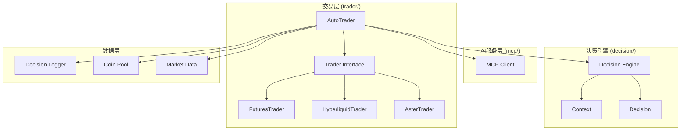
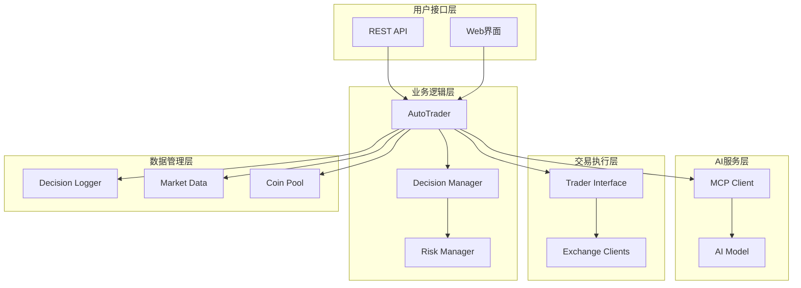
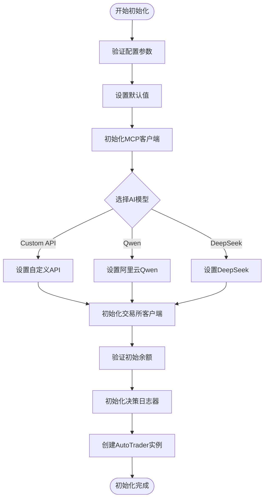
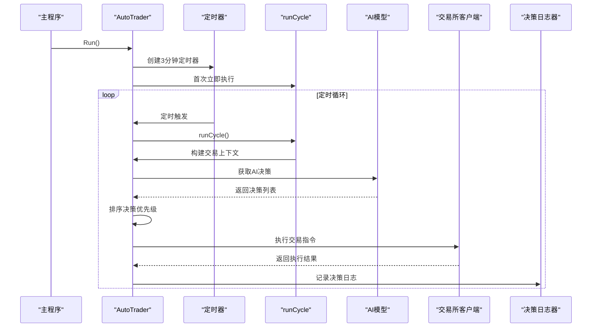
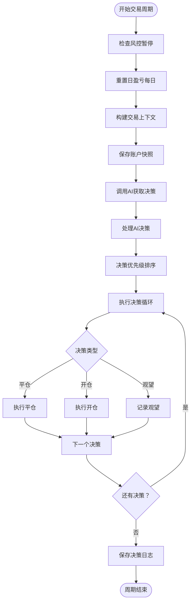
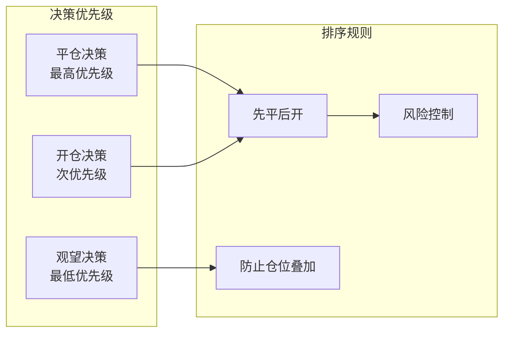
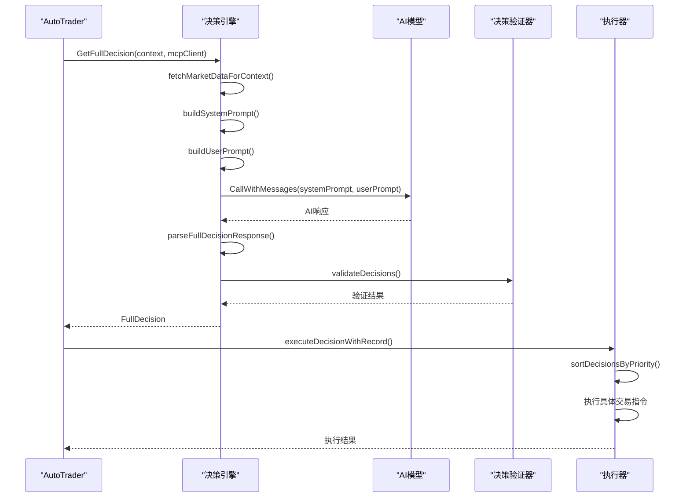
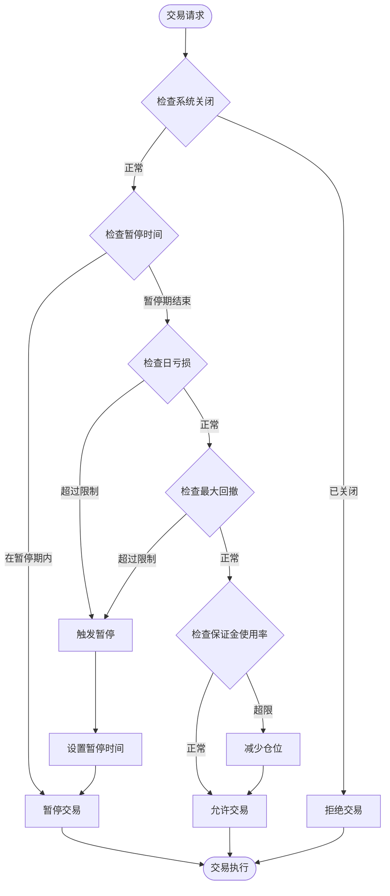
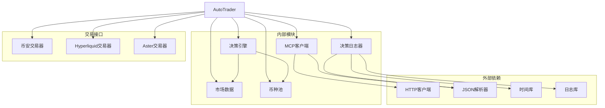
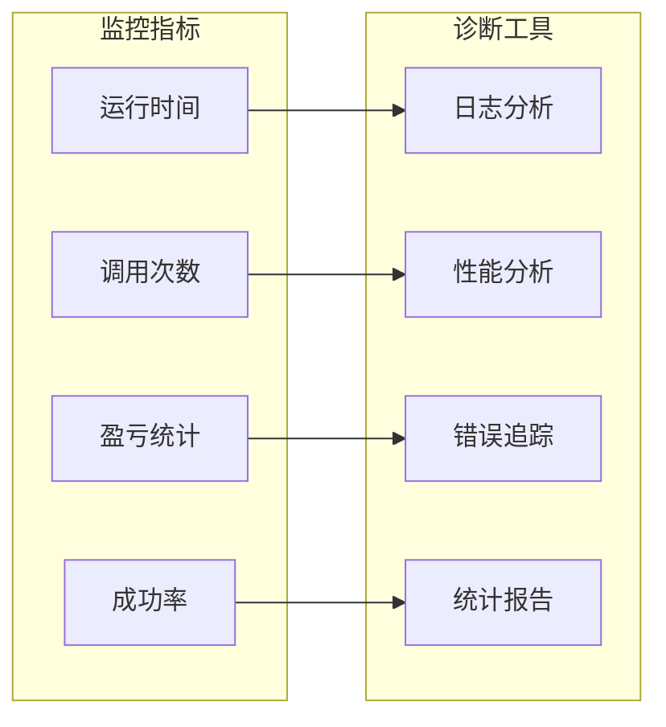

# AutoTrader组件详细文档

<cite>
**本文档引用的文件**
- [auto_trader.go](file://trader/auto_trader.go)
- [interface.go](file://trader/interface.go)
- [client.go](file://mcp/client.go)
- [decision_logger.go](file://logger/decision_logger.go)
- [engine.go](file://decision/engine.go)
- [coin_pool.go](file://pool/coin_pool.go)
- [data.go](file://market/data.go)
</cite>

## 目录
1. [简介](#简介)
2. [项目结构](#项目结构)
3. [核心组件](#核心组件)
4. [架构概览](#架构概览)
5. [详细组件分析](#详细组件分析)
6. [依赖关系分析](#依赖关系分析)
7. [性能考虑](#性能考虑)
8. [故障排除指南](#故障排除指南)
9. [结论](#结论)

## 简介

AutoTrader是nofx项目中的AI驱动交易核心引擎，负责实现完全自动化的加密货币交易决策和执行。该组件作为整个交易系统的神经中枢，集成了先进的AI模型、多交易所适配、实时市场分析和智能风险管理功能。

AutoTrader的核心设计理念是"AI全权决策"，即AI模型负责决定所有交易参数，包括杠杆倍数、仓位大小、止损止盈点位等，而人类交易者只需监控系统运行状态。这种设计最大限度地减少了人为情绪干扰，同时保持了系统的灵活性和适应性。

## 项目结构

AutoTrader组件位于`trader/`目录下，与其他核心模块协同工作：



**图表来源**
- [auto_trader.go](file://trader/auto_trader.go#L1-L50)
- [interface.go](file://trader/interface.go#L1-L42)

**章节来源**
- [auto_trader.go](file://trader/auto_trader.go#L1-L100)

## 核心组件

### AutoTrader结构体详解

AutoTrader结构体包含了系统运行所需的所有核心状态和配置信息：

```mermaid
classDiagram
class AutoTrader {
+string id
+string name
+string aiModel
+string exchange
+AutoTraderConfig config
+Trader trader
+*mcp.Client mcpClient
+*logger.DecisionLogger decisionLogger
+float64 initialBalance
+float64 dailyPnL
+time.Time lastResetTime
+time.Time stopUntil
+bool isRunning
+time.Time startTime
+int callCount
+map[string]int64 positionFirstSeenTime
+NewAutoTrader(config) AutoTrader
+Run() error
+Stop() void
+GetID() string
+GetName() string
+GetAIModel() string
+GetStatus() map[string]interface{}
+GetAccountInfo() map[string]interface{}
-runCycle() error
-buildTradingContext() Context
-executeDecisionWithRecord() error
}
class AutoTraderConfig {
+string ID
+string Name
+string AIModel
+string Exchange
+string BinanceAPIKey
+string BinanceSecretKey
+string HyperliquidPrivateKey
+string HyperliquidWalletAddr
+string AsterUser
+string AsterSigner
+string AsterPrivateKey
+float64 InitialBalance
+int BTCETHLeverage
+int AltcoinLeverage
+time.Duration ScanInterval
+float64 MaxDailyLoss
+float64 MaxDrawdown
+time.Duration StopTradingTime
}
AutoTrader --> AutoTraderConfig : "配置"
AutoTrader --> Trader : "交易接口"
AutoTrader --> mcp.Client : "AI通信"
AutoTrader --> logger.DecisionLogger : "日志记录"
```

**图表来源**
- [auto_trader.go](file://trader/auto_trader.go#L45-L85)
- [auto_trader.go](file://trader/auto_trader.go#L25-L70)

### 关键字段说明

| 字段名 | 类型 | 描述 | 用途 |
|--------|------|------|------|
| `id` | string | 唯一标识符 | 日志目录命名、系统识别 |
| `name` | string | 显示名称 | 用户界面显示、日志记录 |
| `aiModel` | string | AI模型类型 | DeepSeek/Qwen/自定义API |
| `exchange` | string | 交易平台 | 币安/Hyperliquid/Aster |
| `config` | AutoTraderConfig | 完整配置 | 存储所有系统配置参数 |
| `trader` | Trader | 交易所接口 | 多平台交易抽象 |
| `mcpClient` | *mcp.Client | AI通信客户端 | 与AI模型交互 |
| `decisionLogger` | *logger.DecisionLogger | 决策日志器 | 记录所有交易决策 |
| `initialBalance` | float64 | 初始资金余额 | 盈亏计算基准 |
| `dailyPnL` | float64 | 当日盈亏 | 风险控制指标 |
| `callCount` | int | AI调用次数 | 系统运行统计 |

**章节来源**
- [auto_trader.go](file://trader/auto_trader.go#L45-L85)

## 架构概览

AutoTrader采用分层架构设计，确保了高度的模块化和可扩展性：



**图表来源**
- [auto_trader.go](file://trader/auto_trader.go#L85-L150)
- [client.go](file://mcp/client.go#L1-L50)

## 详细组件分析

### NewAutoTrader工厂函数

NewAutoTrader是AutoTrader的主要构造函数，负责根据配置初始化整个交易系统：



**图表来源**
- [auto_trader.go](file://trader/auto_trader.go#L85-L150)

#### AI模型初始化策略

AutoTrader支持三种AI模型配置：

1. **DeepSeek模型**：默认选择，适合大多数交易场景
2. **Qwen模型**：阿里云通义千问，具有强大的中文理解和分析能力
3. **自定义API**：支持OpenAI兼容的第三方AI服务

**章节来源**
- [auto_trader.go](file://trader/auto_trader.go#L85-L150)

### Run方法 - 主循环执行

Run方法实现了AutoTrader的核心定时决策循环：



**图表来源**
- [auto_trader.go](file://trader/auto_trader.go#L152-L180)

#### 运行时状态管理

AutoTrader维护以下关键运行时状态：

| 状态项 | 类型 | 更新频率 | 用途 |
|--------|------|----------|------|
| `isRunning` | bool | 立即 | 控制主循环运行状态 |
| `callCount` | int | 每次AI调用 | 统计系统活跃度 |
| `startTime` | time.Time | 初始化时 | 计算运行时长 |
| `lastResetTime` | time.Time | 每日重置 | 日盈亏统计 |
| `stopUntil` | time.Time | 风控触发 | 暂停交易时间 |

**章节来源**
- [auto_trader.go](file://trader/auto_trader.go#L152-L180)

### runCycle方法 - 交易周期处理

runCycle方法是AutoTrader的核心业务逻辑，实现了完整的交易决策流程：



**图表来源**
- [auto_trader.go](file://trader/auto_trader.go#L182-L350)

#### 决策优先级排序算法

AutoTrader实现了智能的决策排序算法，确保交易执行的安全性和效率：



**图表来源**
- [auto_trader.go](file://trader/auto_trader.go#L901-L934)

**章节来源**
- [auto_trader.go](file://trader/auto_trader.go#L182-L350)

### 交易上下文构建

buildTradingContext方法负责收集和整理所有必要的交易信息：

```mermaid
classDiagram
class Context {
+string CurrentTime
+int RuntimeMinutes
+int CallCount
+AccountInfo Account
+[]PositionInfo Positions
+[]CandidateCoin CandidateCoins
+map[string]*market.Data MarketDataMap
+map[string]*OITopData OITopDataMap
+interface{} Performance
+int BTCETHLeverage
+int AltcoinLeverage
}
class AccountInfo {
+float64 TotalEquity
+float64 AvailableBalance
+float64 TotalPnL
+float64 TotalPnLPct
+float64 MarginUsed
+float64 MarginUsedPct
+int PositionCount
}
class PositionInfo {
+string Symbol
+string Side
+float64 EntryPrice
+float64 MarkPrice
+float64 Quantity
+int Leverage
+float64 UnrealizedPnL
+float64 UnrealizedPnLPct
+float64 LiquidationPrice
+float64 MarginUsed
+int64 UpdateTime
}
Context --> AccountInfo
Context --> PositionInfo
```

**图表来源**
- [engine.go](file://decision/engine.go#L40-L80)

#### 市场数据获取策略

AutoTrader采用智能的市场数据获取策略：

1. **持仓币种优先**：必须获取持仓币种的完整市场数据
2. **候选币种补充**：根据账户状态动态调整分析的候选币种数量
3. **流动性过滤**：跳过持仓价值低于15M USD的低流动性币种
4. **并发优化**：并行获取多个币种的市场数据

**章节来源**
- [auto_trader.go](file://trader/auto_trader.go#L352-L500)

### AI决策执行引擎

AutoTrader集成了强大的AI决策执行引擎，支持复杂的交易策略：



**图表来源**
- [engine.go](file://decision/engine.go#L80-L150)

#### 决策验证规则

AI决策必须通过严格的验证规则才能被执行：

| 验证项 | 规则 | 目的 |
|--------|------|------|
| 动作类型 | 必须是有效动作 | 防止非法操作 |
| 杠杆倍数 | 在配置范围内 | 风险控制 |
| 仓位大小 | 符合账户净值比例 | 防止过度杠杆 |
| 止损止盈 | 合理的风险回报比 | 保护本金 |
| 仓位叠加 | 防止同向仓位叠加 | 避免超额风险 |

**章节来源**
- [engine.go](file://decision/engine.go#L550-L624)

### 风险控制系统

AutoTrader内置了多层次的风险控制系统：



**图表来源**
- [auto_trader.go](file://trader/auto_trader.go#L182-L220)

**章节来源**
- [auto_trader.go](file://trader/auto_trader.go#L182-L220)

## 依赖关系分析

AutoTrader的依赖关系体现了良好的软件工程实践：



**图表来源**
- [auto_trader.go](file://trader/auto_trader.go#L1-L20)
- [client.go](file://mcp/client.go#L1-L20)

### 循环依赖处理

AutoTrader通过接口抽象避免了循环依赖问题：

- **Trader接口**：抽象不同交易所的交易功能
- **MCP客户端**：统一AI服务访问接口  
- **决策引擎**：封装AI决策逻辑
- **日志系统**：独立的决策记录模块

**章节来源**
- [interface.go](file://trader/interface.go#L1-L42)

## 性能考虑

### 并发优化策略

AutoTrader采用了多种并发优化策略来提升性能：

1. **市场数据并行获取**：同时获取多个币种的市场数据
2. **AI API异步调用**：避免阻塞主线程
3. **决策并行执行**：多个决策可以并行处理
4. **缓存机制**：减少重复的API调用

### 内存管理

AutoTrader实现了智能的内存管理策略：

- **对象池**：复用频繁创建的对象
- **及时清理**：定期清理过期的持仓记录
- **缓存控制**：限制缓存大小防止内存泄漏

### 网络优化

为了应对高频交易的需求，AutoTrader在网络层面进行了优化：

- **连接池**：复用HTTP连接
- **超时控制**：合理的超时设置
- **重试机制**：自动重试失败的请求
- **熔断保护**：防止雪崩效应

## 故障排除指南

### 常见问题及解决方案

#### AI模型连接问题

**症状**：AI API调用失败
**原因**：网络问题、API密钥错误、配额超限
**解决方案**：
1. 检查网络连接
2. 验证API密钥配置
3. 查看API配额使用情况
4. 启用重试机制

#### 交易所连接问题

**症状**：交易执行失败
**原因**：API密钥错误、网络中断、交易所维护
**解决方案**：
1. 验证API密钥有效性
2. 检查网络连接状态
3. 查看交易所公告
4. 实施备用交易所切换

#### 决策验证失败

**症状**：AI决策被拒绝
**原因**：仓位过大、杠杆过高、风险回报比不足
**解决方案**：
1. 调整风险控制参数
2. 优化AI模型配置
3. 检查市场条件
4. 修改决策阈值

**章节来源**
- [auto_trader.go](file://trader/auto_trader.go#L182-L350)

### 监控和诊断

AutoTrader提供了完善的监控和诊断功能：



**章节来源**
- [auto_trader.go](file://trader/auto_trader.go#L750-L850)

## 结论

AutoTrader作为nofx项目的核心AI驱动交易引擎，展现了现代量化交易系统的先进设计理念。其主要优势包括：

1. **高度模块化**：清晰的分层架构便于维护和扩展
2. **多平台支持**：统一接口支持多个交易所
3. **智能决策**：基于先进AI模型的自动化决策
4. **风险控制**：多层次的风险管理系统
5. **可观察性**：完善的日志和监控体系

AutoTrader的设计充分体现了"AI赋能量化交易"的理念，为用户提供了一个可靠、高效、智能的交易解决方案。随着AI技术的不断发展，AutoTrader将继续演进，为用户创造更大的价值。