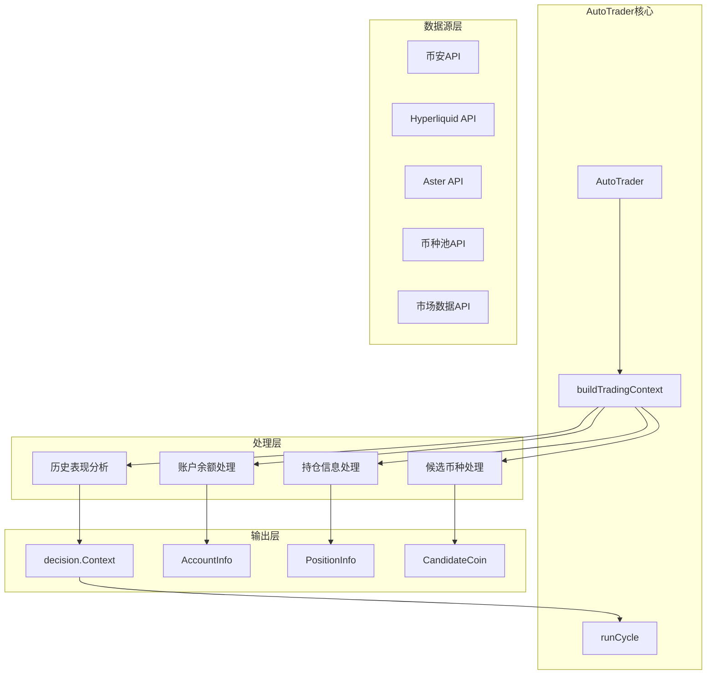
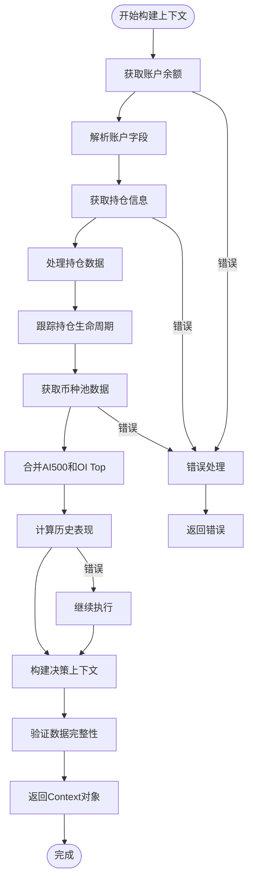
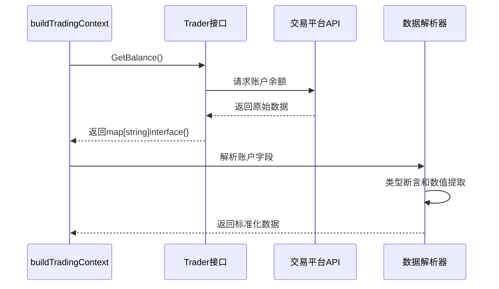
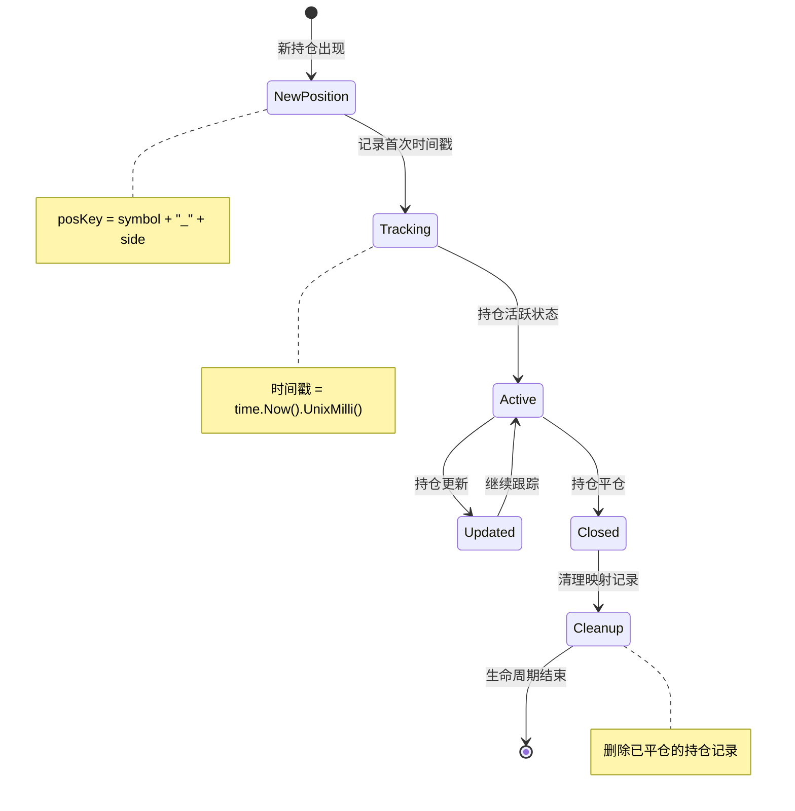
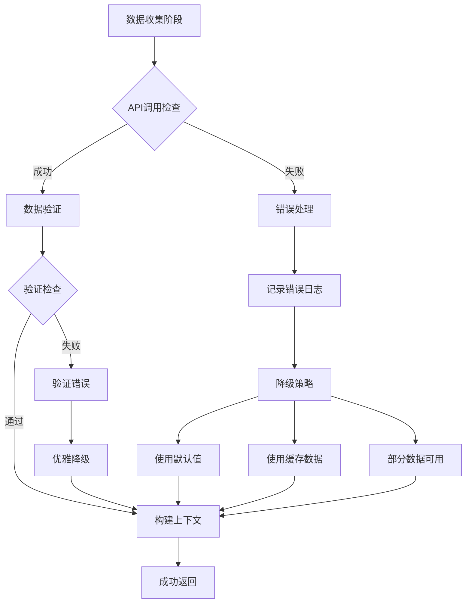
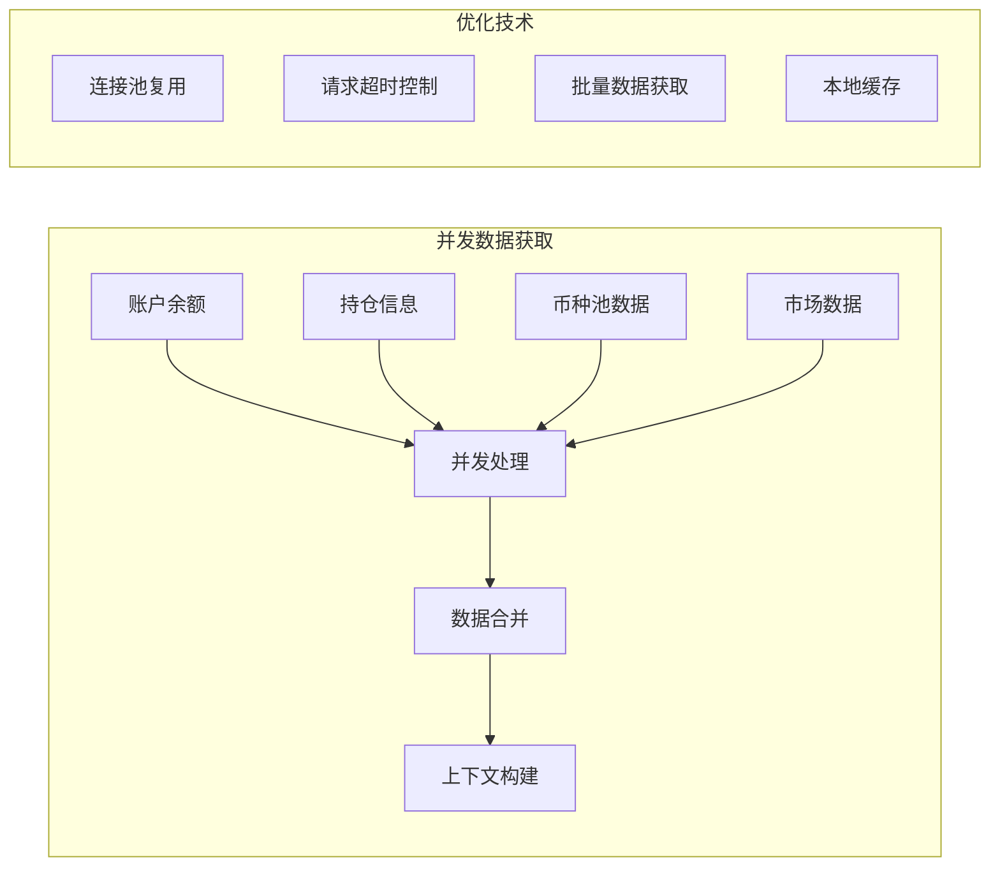

# AutoTrader交易上下文构建机制详细文档

<cite>
**本文档引用的文件**
- [auto_trader.go](file://trader/auto_trader.go)
- [engine.go](file://decision/engine.go)
- [coin_pool.go](file://pool/coin_pool.go)
- [data.go](file://market/data.go)
- [decision_logger.go](file://logger/decision_logger.go)
</cite>

## 目录
1. [概述](#概述)
2. [系统架构](#系统架构)
3. [buildTradingContext方法详解](#buildtradingcontext方法详解)
4. [数据收集流程](#数据收集流程)
5. [上下文数据结构](#上下文数据结构)
6. [持仓生命周期管理](#持仓生命周期管理)
7. [错误处理机制](#错误处理机制)
8. [性能优化策略](#性能优化策略)
9. [最佳实践指南](#最佳实践指南)
10. [故障排除](#故障排除)

## 概述

AutoTrader的交易上下文构建机制是AI决策系统的核心组件，负责整合多源数据为AI提供完整的决策环境。`buildTradingContext`方法作为这一机制的主要入口，通过系统化的数据收集、处理和标准化流程，将原始API数据转换为`decision.Context`数据结构，为AI智能交易提供全面的市场洞察和账户信息。

该机制的核心价值在于：
- **数据完整性**：整合账户余额、持仓信息、候选币种和历史表现等多维度数据
- **实时性**：每3分钟周期实时更新上下文信息
- **标准化**：统一的数据格式便于AI理解和处理
- **风险管理**：内置保证金使用率和仓位控制机制

## 系统架构



**架构图来源**
- [auto_trader.go](file://trader/auto_trader.go#L380-L543)
- [engine.go](file://decision/engine.go#L56-L68)

## buildTradingContext方法详解

`buildTradingContext`方法是交易上下文构建的核心函数，采用模块化设计，按照严格的执行顺序收集和处理各类数据。

### 方法执行流程



**流程图来源**
- [auto_trader.go](file://trader/auto_trader.go#L380-L543)

### 核心处理步骤

#### 1. 账户信息获取与解析
方法首先调用`at.trader.GetBalance()`获取账户余额信息，然后从返回的map中提取关键字段：

- `totalWalletBalance`：钱包总余额
- `totalUnrealizedProfit`：未实现盈亏
- `availableBalance`：可用余额

这些数据经过类型断言确保数据类型正确，并计算总权益（钱包余额 + 未实现盈亏）。

#### 2. 持仓信息处理
持仓数据的处理包含多个关键步骤：

- **数据标准化**：将负持仓数量转换为正数
- **保证金计算**：基于持仓量、标记价格和杠杆倍数估算占用保证金
- **盈亏百分比计算**：根据持仓方向计算相对于入场价的盈亏百分比
- **持仓生命周期跟踪**：维护`positionFirstSeenTime`映射记录持仓首次出现时间

#### 3. 候选币种池构建
通过`pool.GetMergedCoinPool(ai500Limit)`获取合并的候选币种池：

- **AI500数据**：获取评分最高的20个币种
- **OI Top数据**：获取持仓量增长最快的20个币种  
- **去重处理**：合并两个池子并去除重复币种
- **来源标记**：为每个币种标记数据来源（AI500、OI Top或双重信号）

**节来源**
- [auto_trader.go](file://trader/auto_trader.go#L380-L543)
- [coin_pool.go](file://pool/coin_pool.go#L590-L644)

## 数据收集流程

### 账户余额数据收集

账户余额数据通过`at.trader.GetBalance()`接口获取，支持多种交易平台：



**序列图来源**
- [auto_trader.go](file://trader/auto_trader.go#L382-L395)

### 持仓信息收集与处理

持仓数据的收集和处理遵循严格的标准化流程：

1. **原始数据获取**：调用`at.trader.GetPositions()`获取持仓列表
2. **数据清洗**：处理负持仓数量，确保数量为正值
3. **保证金估算**：基于公式`(quantity * markPrice) / leverage`计算占用保证金
4. **盈亏计算**：根据持仓方向计算相对于入场价的盈亏百分比
5. **时间戳管理**：维护持仓首次出现时间映射

### 币种池数据收集

币种池数据通过两个独立的数据源获取：

#### AI500评分数据
- **数据源**：外部币种池API
- **处理方式**：获取评分最高的20个币种
- **质量控制**：基于算法评分筛选优质币种

#### OI Top持仓量数据  
- **数据源**：持仓量增长分析API
- **处理方式**：获取持仓量增长最快的20个币种
- **优势**：反映市场活跃度和资金流向

**节来源**
- [auto_trader.go](file://trader/auto_trader.go#L400-L450)
- [coin_pool.go](file://pool/coin_pool.go#L590-L644)

## 上下文数据结构

### decision.Context结构

`decision.Context`是AI决策系统的核心数据结构，包含了AI做出交易决策所需的所有信息：

```mermaid
classDiagram
class Context {
+string CurrentTime
+int RuntimeMinutes
+int CallCount
+AccountInfo Account
+[]PositionInfo Positions
+[]CandidateCoin CandidateCoins
+map[string]*market.Data MarketDataMap
+map[string]*OITopData OITopDataMap
+interface{} Performance
+int BTCETHLeverage
+int AltcoinLeverage
}
class AccountInfo {
+float64 TotalEquity
+float64 AvailableBalance
+float64 TotalPnL
+float64 TotalPnLPct
+float64 MarginUsed
+float64 MarginUsedPct
+int PositionCount
}
class PositionInfo {
+string Symbol
+string Side
+float64 EntryPrice
+float64 MarkPrice
+float64 Quantity
+int Leverage
+float64 UnrealizedPnL
+float64 UnrealizedPnLPct
+float64 LiquidationPrice
+float64 MarginUsed
+int64 UpdateTime
}
class CandidateCoin {
+string Symbol
+[]string Sources
}
Context --> AccountInfo
Context --> PositionInfo
Context --> CandidateCoin
```

**类图来源**
- [engine.go](file://decision/engine.go#L56-L68)
- [engine.go](file://decision/engine.go#L14-L26)
- [engine.go](file://decision/engine.go#L40-L43)

### 数据标准化处理

#### 账户信息标准化
- **总权益计算**：`totalEquity = totalWalletBalance + totalUnrealizedProfit`
- **保证金使用率**：`marginUsedPct = (totalMarginUsed / totalEquity) * 100`
- **盈亏百分比**：`totalPnLPct = (totalPnL / initialBalance) * 100`

#### 持仓信息标准化
- **数量标准化**：空仓数量自动转换为正数
- **时间戳处理**：使用Unix毫秒时间戳记录持仓更新时间
- **保证金计算**：基于当前市场价格和杠杆倍数估算

#### 候选币种标准化
- **来源标记**：明确标识每个币种的数据来源
- **去重处理**：确保每个币种在候选池中唯一

**节来源**
- [auto_trader.go](file://trader/auto_trader.go#L500-L543)
- [engine.go](file://decision/engine.go#L56-L68)

## 持仓生命周期管理

### positionFirstSeenTime映射机制

`positionFirstSeenTime`映射是AutoTrader特有的持仓生命周期管理系统，用于跟踪每个持仓的完整生命周期：



**状态图来源**
- [auto_trader.go](file://trader/auto_trader.go#L430-L445)

### 生命周期跟踪功能

#### 1. 新持仓检测
当新的持仓出现在当前周期时，系统会：
- 生成唯一的`posKey`（`symbol_side`组合）
- 检查是否为新持仓（映射中不存在该key）
- 记录当前时间为首次出现时间

#### 2. 持仓更新监控
对于已存在的持仓：
- 使用现有的首次出现时间
- 更新持仓的其他属性（数量、价格等）
- 维护时间戳不变

#### 3. 清理机制
在每个周期结束时，系统会：
- 遍历`positionFirstSeenTime`映射
- 检查当前持仓集合
- 删除已平仓的持仓记录（映射中有但当前持仓中不存在）

### 生命周期数据分析

通过持仓生命周期数据，AI可以获得以下洞察：
- **持仓时长**：计算持仓的持有时间
- **换手率分析**：识别频繁换仓的模式
- **持仓稳定性**：评估持仓的持续性特征

**节来源**
- [auto_trader.go](file://trader/auto_trader.go#L430-L445)

## 错误处理机制

### 多层次错误处理策略

AutoTrader的上下文构建采用了多层次的错误处理机制，确保系统的稳定性和可靠性：



**流程图来源**
- [auto_trader.go](file://trader/auto_trader.go#L230-L240)
- [auto_trader.go](file://trader/auto_trader.go#L520-L530)

### 具体错误处理场景

#### 1. API调用失败处理
- **账户余额获取失败**：返回具体错误信息，终止上下文构建
- **持仓信息获取失败**：记录错误，继续处理其他数据
- **币种池数据获取失败**：使用默认币种池，记录警告日志

#### 2. 数据解析错误处理
- **类型断言失败**：使用零值，记录数据异常
- **数值计算错误**：跳过计算，使用前一周期值
- **网络超时处理**：重试机制，最多3次重试

#### 3. 数据验证失败处理
- **保证金计算异常**：使用估算值，记录警告
- **持仓数量异常**：过滤异常数据，继续处理正常持仓
- **币种符号错误**：标准化处理，保持数据一致性

### 降级策略

当某些数据源不可用时，系统采用以下降级策略：

1. **使用默认配置**：如果币种池API不可用，使用默认主流币种
2. **缓存数据恢复**：如果API请求失败，使用最近的缓存数据
3. **部分数据可用**：即使某些数据缺失，仍构建可用的上下文
4. **历史数据补充**：使用历史记录补充缺失的实时数据

**节来源**
- [auto_trader.go](file://trader/auto_trader.go#L382-L395)
- [auto_trader.go](file://trader/auto_trader.go#L520-L530)

## 性能优化策略

### 并发数据获取

为了提高数据收集效率，系统采用了并发处理策略：



**优化图来源**
- [auto_trader.go](file://trader/auto_trader.go#L380-L543)

### 缓存机制

#### 1. 币种池缓存
- **本地文件缓存**：将币种池数据保存到本地文件
- **缓存有效期**：24小时自动失效
- **缓存更新策略**：API失败时自动回退到缓存

#### 2. 市场数据缓存
- **短期缓存**：3分钟K线数据缓存
- **长期缓存**：基础市场信息缓存
- **智能刷新**：根据数据新鲜度动态决定是否刷新

#### 3. 历史表现缓存
- **性能分析缓存**：历史交易表现分析结果缓存
- **滚动窗口**：维护最近100个周期的数据
- **增量更新**：只重新计算变化的部分

### 数据过滤和优化

#### 1. 流动性过滤
系统实现了智能的流动性过滤机制：
- **最低持仓价值要求**：跳过持仓价值低于15M USD的币种
- **动态阈值调整**：根据账户规模动态调整过滤阈值
- **持仓优先级**：现有持仓不受流动性过滤限制

#### 2. 数据采样优化
- **候选币种限制**：AI500取前20个，OI Top取前20个
- **市场数据采样**：根据持仓状态动态调整分析的币种数量
- **历史数据截取**：只分析最近100个周期的数据

#### 3. 内存管理
- **及时清理**：定期清理已平仓的持仓记录
- **对象池复用**：重用临时对象减少GC压力
- **数据压缩**：对大型数据结构进行压缩存储

**节来源**
- [auto_trader.go](file://trader/auto_trader.go#L430-L445)
- [coin_pool.go](file://pool/coin_pool.go#L200-L250)

## 最佳实践指南

### 配置优化建议

#### 1. 杠杆配置
- **BTC/ETH**：建议配置5-10倍杠杆
- **山寨币**：建议配置10-20倍杠杆  
- **风险控制**：保证金使用率不超过90%

#### 2. 扫描间隔优化
- **推荐间隔**：3分钟（系统默认）
- **高频交易**：可考虑2分钟间隔
- **保守策略**：可延长至5分钟

#### 3. 币种池配置
- **AI500限制**：建议20个币种（系统默认）
- **OI Top限制**：建议20个币种
- **自定义API**：确保API响应时间<30秒

### 监控和调试

#### 1. 关键指标监控
- **上下文构建时间**：<2秒
- **API响应时间**：<5秒
- **错误率**：<5%
- **保证金使用率**：<90%

#### 2. 日志分析
- **错误日志**：关注API调用失败和数据解析错误
- **性能日志**：监控上下文构建耗时
- **业务日志**：跟踪持仓生命周期变化

#### 3. 调试技巧
- **启用详细日志**：设置DEBUG级别日志
- **数据快照**：定期保存上下文数据快照
- **性能分析**：使用pprof分析性能瓶颈

### 故障预防措施

#### 1. 网络稳定性
- **超时设置**：合理设置API超时时间
- **重试机制**：实现指数退避重试
- **熔断保护**：API连续失败时自动熔断

#### 2. 数据质量保证
- **数据验证**：严格验证API返回数据
- **异常处理**：妥善处理异常数据
- **降级策略**：确保系统在部分数据缺失时仍能运行

#### 3. 系统资源管理
- **内存监控**：监控上下文数据内存占用
- **CPU优化**：优化数据处理算法
- **磁盘空间**：定期清理日志文件

**节来源**
- [auto_trader.go](file://trader/auto_trader.go#L87-L133)
- [engine.go](file://decision/engine.go#L200-L300)

## 故障排除

### 常见问题诊断

#### 1. 上下文构建失败

**症状**：`构建交易上下文失败`错误
**可能原因**：
- API密钥配置错误
- 网络连接不稳定
- 账户余额查询失败

**解决方案**：
1. 检查API密钥配置
2. 验证网络连接
3. 查看详细错误日志
4. 检查账户状态

#### 2. 数据不一致

**症状**：持仓数量与实际不符
**可能原因**：
- 持仓生命周期跟踪错误
- 数据同步延迟
- 并发访问冲突

**解决方案**：
1. 检查`positionFirstSeenTime`映射
2. 验证API数据同步
3. 检查并发访问控制
4. 重启系统重建映射

#### 3. 性能问题

**症状**：上下文构建时间过长
**可能原因**：
- API响应慢
- 数据量过大
- 内存泄漏

**解决方案**：
1. 优化API调用频率
2. 减少不必要的数据收集
3. 检查内存使用情况
4. 实施数据采样策略

### 调试工具和技巧

#### 1. 日志分析
```bash
# 查看最近的错误日志
tail -f decision_logs/error.log

# 分析上下文构建时间
grep "上下文构建" decision_logs/*.log | awk '{print $1, $2, $3}'
```

#### 2. 数据验证
```bash
# 验证上下文数据完整性
python validate_context.py --log-dir decision_logs/

# 检查持仓生命周期
python analyze_positions.py --log-dir decision_logs/
```

#### 3. 性能监控
```bash
# 监控API响应时间
watch -n 1 'curl -s https://api.binance.com/api/v3/time'

# 检查系统资源使用
top -p $(pgrep autotrader)
```

### 紧急恢复程序

#### 1. 系统重启
1. 停止AutoTrader进程
2. 清理临时文件
3. 重启系统
4. 验证API连接

#### 2. 数据恢复
1. 备份当前日志
2. 清理损坏的日志文件
3. 从最近的备份恢复
4. 验证数据完整性

#### 3. 服务切换
1. 启用备用API
2. 切换到默认币种池
3. 降低数据收集频率
4. 监控系统状态

**节来源**
- [auto_trader.go](file://trader/auto_trader.go#L230-L240)
- [decision_logger.go](file://logger/decision_logger.go#L100-L150)

## 结论

AutoTrader的交易上下文构建机制是一个高度集成和优化的数据处理系统，通过`buildTradingContext`方法实现了从多源API数据到AI决策上下文的完整转换。该机制具有以下核心优势：

1. **完整性**：整合账户信息、持仓数据、候选币种和历史表现
2. **实时性**：3分钟周期的高频更新确保数据时效性
3. **可靠性**：多层次错误处理和降级策略保证系统稳定
4. **可扩展性**：模块化设计支持新数据源的快速集成
5. **性能优化**：并发处理和缓存机制确保高效运行

通过深入理解这个机制的工作原理，开发者可以更好地优化系统性能，解决潜在问题，并根据具体需求定制扩展功能。随着AI交易策略的不断发展，这个上下文构建机制将继续发挥重要作用，为智能交易提供坚实的数据基础。