# 决策执行

<cite>
**本文档引用的文件**
- [auto_trader.go](file://trader/auto_trader.go)
- [engine.go](file://decision/engine.go)
- [decision_logger.go](file://logger/decision_logger.go)
- [binance_futures.go](file://trader/binance_futures.go)
- [hyperliquid_trader.go](file://trader/hyperliquid_trader.go)
- [aster_trader.go](file://trader/aster_trader.go)
</cite>

## 目录
1. [简介](#简介)
2. [决策执行架构概览](#决策执行架构概览)
3. [executeDecisionWithRecord方法详解](#executedecisionwithrecord方法详解)
4. [交易动作执行逻辑](#交易动作执行逻辑)
5. [风险控制机制](#风险控制机制)
6. [决策记录系统](#决策记录系统)
7. [止损止盈自动设置](#止损止盈自动设置)
8. [执行延迟设计](#执行延迟设计)
9. [总结](#总结)

## 简介

AutoTrader的决策执行机制是一个高度自动化且安全的交易控制系统，负责将AI生成的交易决策转换为实际的市场操作。该系统通过`executeDecisionWithRecord`方法作为核心入口，根据不同的交易动作类型（开多仓、开空仓、平多仓、平空仓）执行相应的交易逻辑，并实施严格的风险控制措施。

## 决策执行架构概览

决策执行系统采用分层架构设计，确保交易的安全性和可靠性：

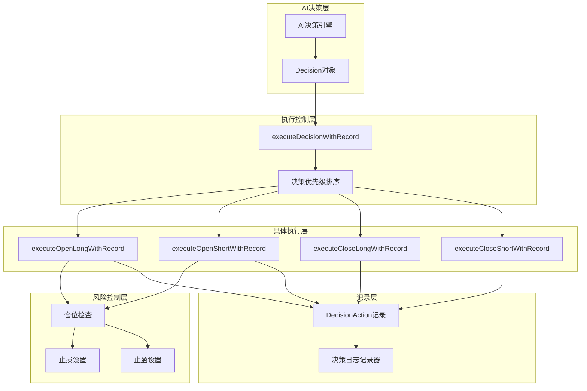

**图表来源**
- [auto_trader.go](file://trader/auto_trader.go#L546-L562)
- [auto_trader.go](file://trader/auto_trader.go#L880-L934)

## executeDecisionWithRecord方法详解

`executeDecisionWithRecord`方法是决策执行的核心入口点，它根据决策的动作类型将执行请求分发到相应的具体执行函数：

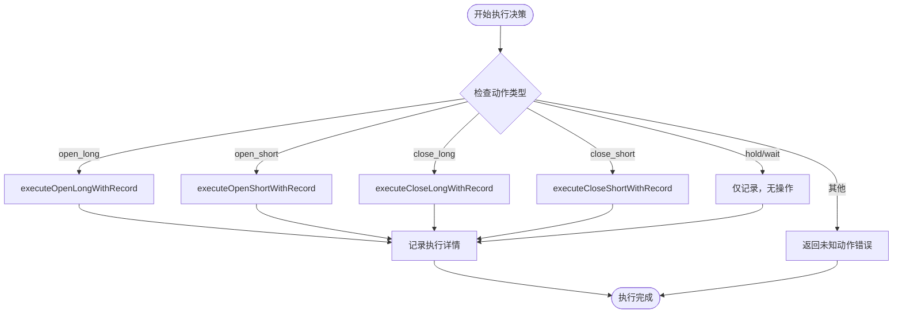

**图表来源**
- [auto_trader.go](file://trader/auto_trader.go#L546-L562)

该方法实现了以下关键功能：

1. **动作类型识别**：通过`switch-case`语句识别不同的交易动作
2. **执行函数调用**：将决策委托给相应的具体执行函数
3. **错误处理**：对未知动作类型返回明确的错误信息
4. **记录准备**：为后续的决策记录做好准备

**章节来源**
- [auto_trader.go](file://trader/auto_trader.go#L546-L562)

## 交易动作执行逻辑

### 开多仓执行逻辑 (executeOpenLongWithRecord)

开多仓操作是最复杂的交易动作，包含多个关键步骤：

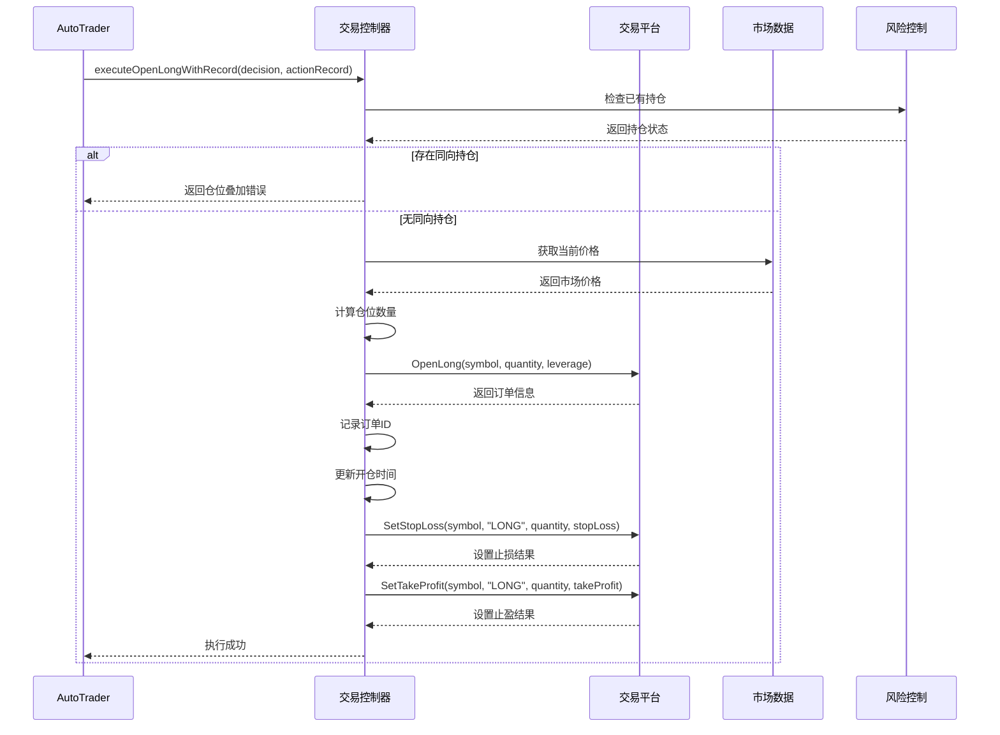

**图表来源**
- [auto_trader.go](file://trader/auto_trader.go#L565-L615)

### 开空仓执行逻辑 (executeOpenShortWithRecord)

开空仓的执行逻辑与开多仓类似，但针对空头仓位进行特殊处理：

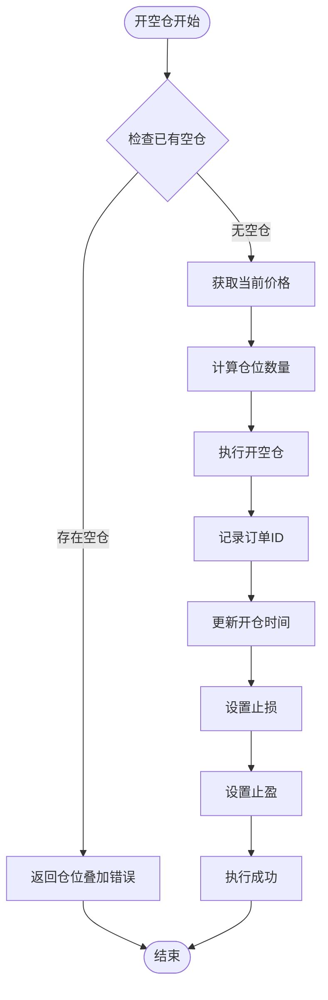

**图表来源**
- [auto_trader.go](file://trader/auto_trader.go#L618-L668)

### 平多仓执行逻辑 (executeCloseLongWithRecord)

平多仓操作相对简单，主要涉及平仓和订单记录：

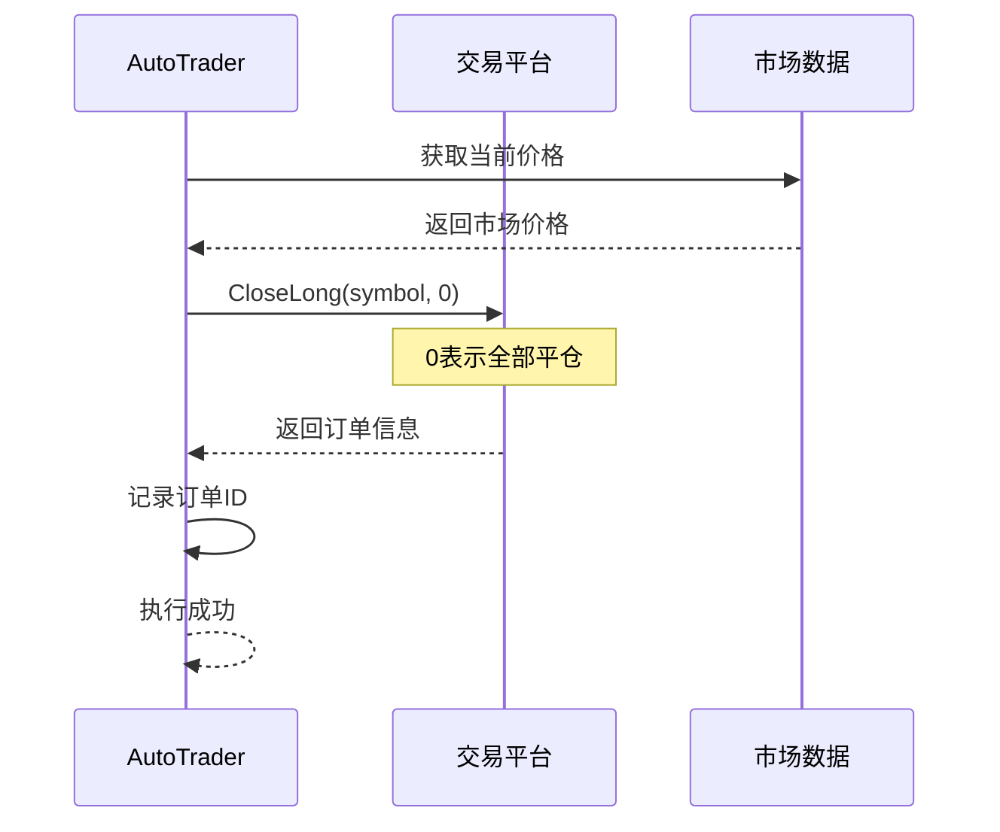

**图表来源**
- [auto_trader.go](file://trader/auto_trader.go#L671-L694)

### 平空仓执行逻辑 (executeCloseShortWithRecord)

平空仓的执行逻辑与平多仓基本相同，只是针对空头仓位：

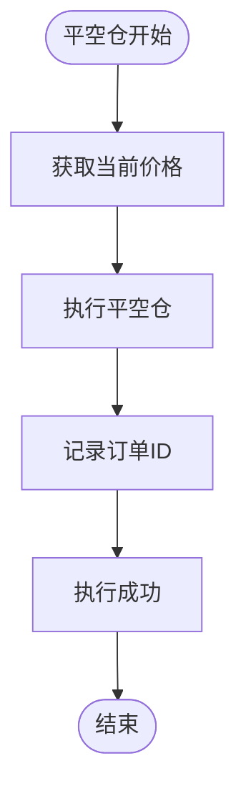

**图表来源**
- [auto_trader.go](file://trader/auto_trader.go#L697-L720)

**章节来源**
- [auto_trader.go](file://trader/auto_trader.go#L565-L720)

## 风险控制机制

### 仓位叠加保护逻辑

系统实施了严格的仓位叠加保护机制，防止同一币种同时持有同方向的多个仓位：

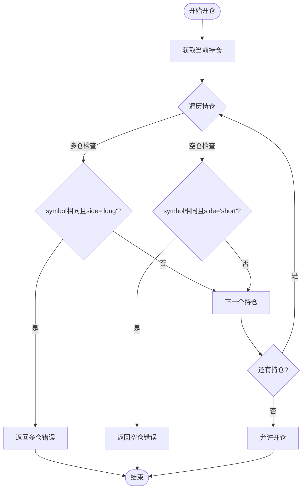

**图表来源**
- [auto_trader.go](file://trader/auto_trader.go#L570-L580)
- [auto_trader.go](file://trader/auto_trader.go#L623-L633)

### 决策优先级排序

为了确保交易的安全性，系统实现了智能的决策优先级排序：

| 优先级 | 动作类型 | 描述 | 作用 |
|--------|----------|------|------|
| 1 | close_long, close_short | 平仓操作 | 首先平仓，释放保证金 |
| 2 | open_long, open_short | 开仓操作 | 在平仓后开新仓 |
| 3 | hold, wait | 观望操作 | 最低优先级，仅记录 |

这种排序策略有效防止了仓位叠加超限的风险。

**章节来源**
- [auto_trader.go](file://trader/auto_trader.go#L880-L934)

## 决策记录系统

### DecisionAction结构体设计

每个执行的决策都会被记录到`DecisionAction`结构体中，包含完整的执行信息：

| 字段名 | 类型 | 描述 | 示例值 |
|--------|------|------|--------|
| Action | string | 交易动作类型 | "open_long", "close_short" |
| Symbol | string | 交易币种 | "BTCUSDT" |
| Quantity | float64 | 交易数量 | 0.5 |
| Leverage | int | 使用杠杆倍数 | 10 |
| Price | float64 | 执行价格 | 25000.50 |
| OrderID | int64 | 订单唯一标识 | 123456789 |
| Timestamp | time.Time | 执行时间 | 2024-01-15 10:30:00 |
| Success | bool | 执行是否成功 | true/false |
| Error | string | 错误信息（失败时） | "仓位叠加超限" |

### 决策记录流程

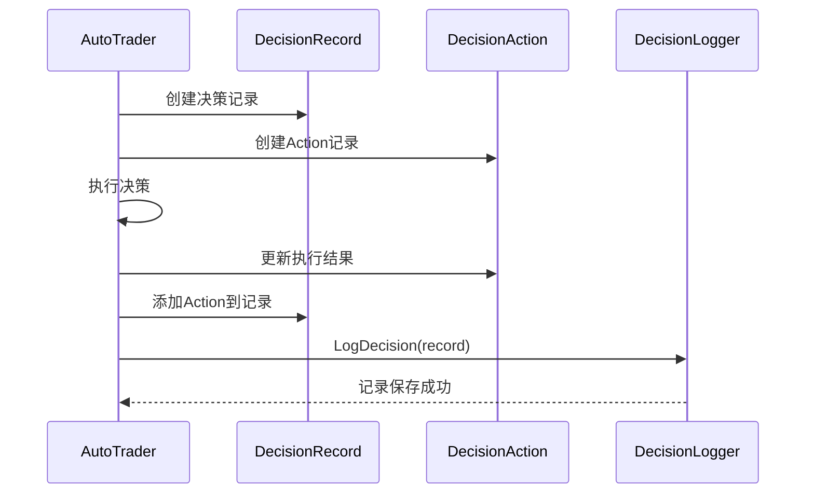

**图表来源**
- [auto_trader.go](file://trader/auto_trader.go#L340-L370)
- [decision_logger.go](file://logger/decision_logger.go#L13-L60)

**章节来源**
- [auto_trader.go](file://trader/auto_trader.go#L340-L370)
- [decision_logger.go](file://logger/decision_logger.go#L13-L60)

## 止损止盈自动设置

### 止损设置流程

系统在开仓成功后自动设置止损单，确保风险可控：

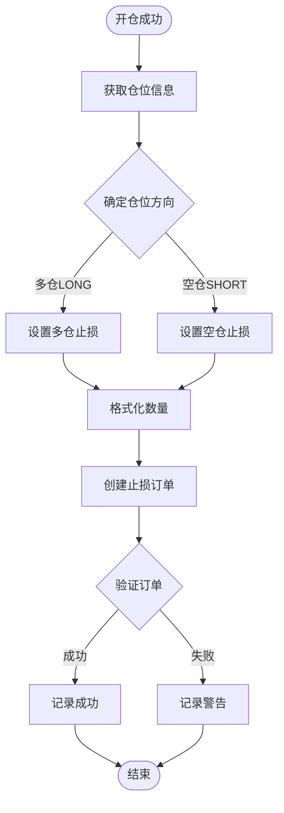

**图表来源**
- [auto_trader.go](file://trader/auto_trader.go#L602-L615)
- [auto_trader.go](file://trader/auto_trader.go#L668-L680)

### 止盈设置流程

止盈设置遵循类似的模式，但针对不同的仓位方向：

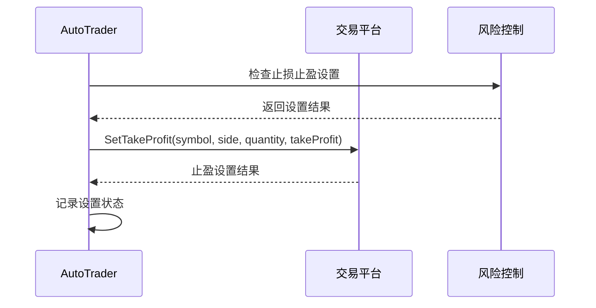

**图表来源**
- [auto_trader.go](file://trader/auto_trader.go#L602-L615)
- [auto_trader.go](file://trader/auto_trader.go#L668-L680)

### 平台特定实现

不同交易平台对止损止盈的实现略有差异：

| 平台 | 止损实现方式 | 止盈实现方式 | 特殊考虑 |
|------|-------------|-------------|----------|
| 币安期货 | 市价止损单 | 市价止盈单 | 支持全仓/逐仓 |
| Hyperliquid | 触发订单 | 触发订单 | 价格精度处理 |
| Aster | 市价止损单 | 市价止盈单 | 精度格式化 |

**章节来源**
- [auto_trader.go](file://trader/auto_trader.go#L602-L615)
- [auto_trader.go](file://trader/auto_trader.go#L668-L680)
- [binance_futures.go](file://trader/binance_futures.go#L458-L515)
- [hyperliquid_trader.go](file://trader/hyperliquid_trader.go#L519-L557)

## 执行延迟设计

### 1秒延迟机制

每次成功的决策执行后，系统会执行1秒的延迟：

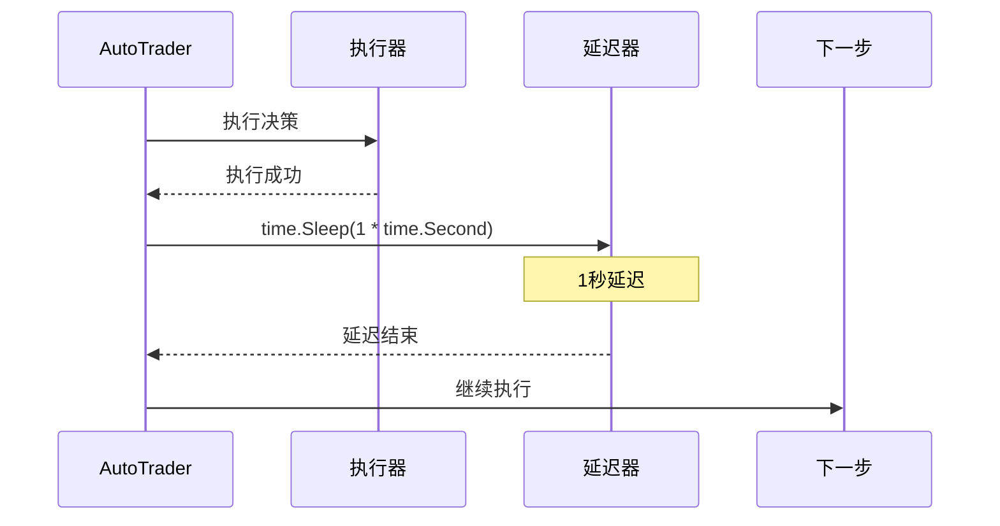

**图表来源**
- [auto_trader.go](file://trader/auto_trader.go#L360-L365)

### 延迟设计目的

1. **系统稳定性**：避免过于频繁的交易请求
2. **API限制**：遵守交易所的API调用频率限制
3. **风险控制**：给系统时间处理订单确认
4. **资源管理**：减少系统资源的瞬时消耗

**章节来源**
- [auto_trader.go](file://trader/auto_trader.go#L360-L365)

## 总结

AutoTrader的决策执行机制体现了现代量化交易系统的高度自动化和安全性设计。通过`executeDecisionWithRecord`方法为核心，系统实现了：

1. **模块化执行**：清晰的职责分离，便于维护和扩展
2. **严格风险控制**：仓位叠加保护和智能优先级排序
3. **完整记录体系**：详细的决策执行记录，支持回溯分析
4. **自动化风险管理**：自动设置止损止盈，降低人为失误
5. **平台适配能力**：支持多种交易平台的差异化需求

这套执行机制不仅保证了交易的准确性和安全性，还为后续的性能分析和系统优化提供了坚实的基础。通过持续的监控和改进，该系统能够适应不断变化的市场环境和交易需求。