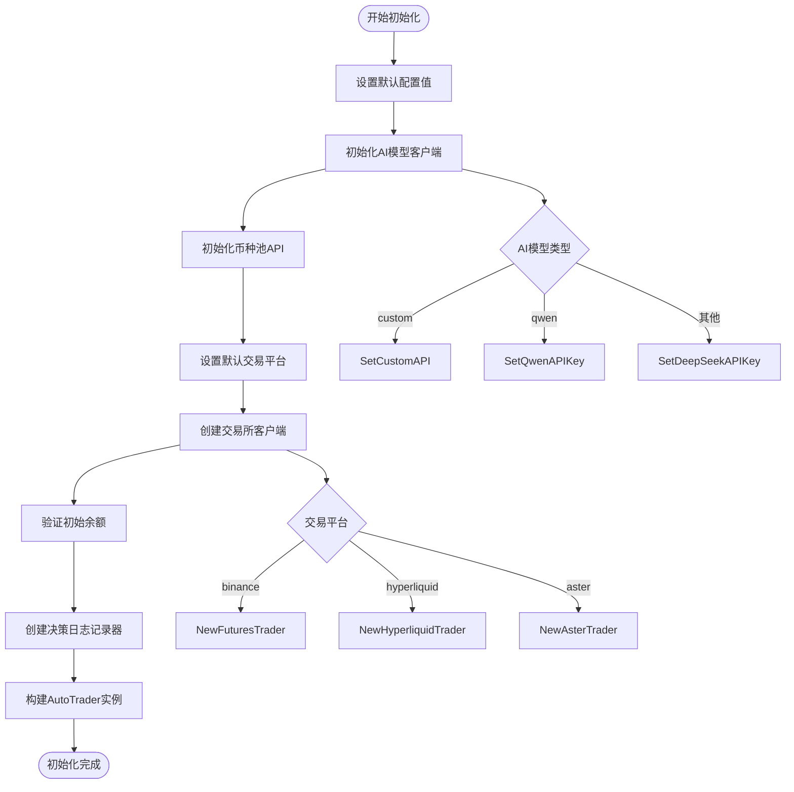
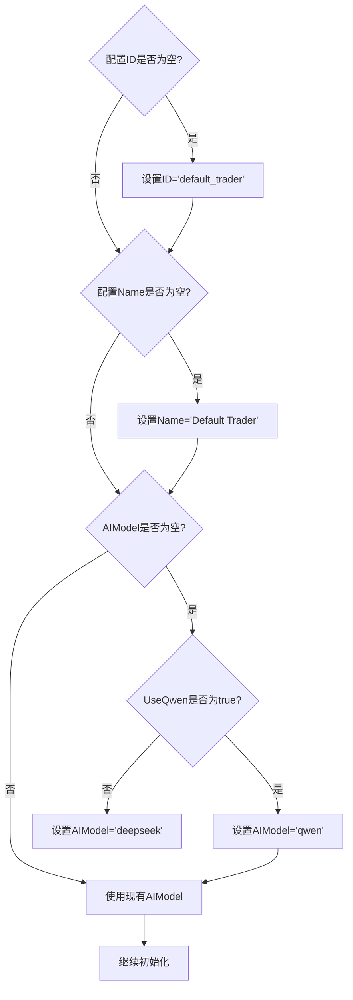
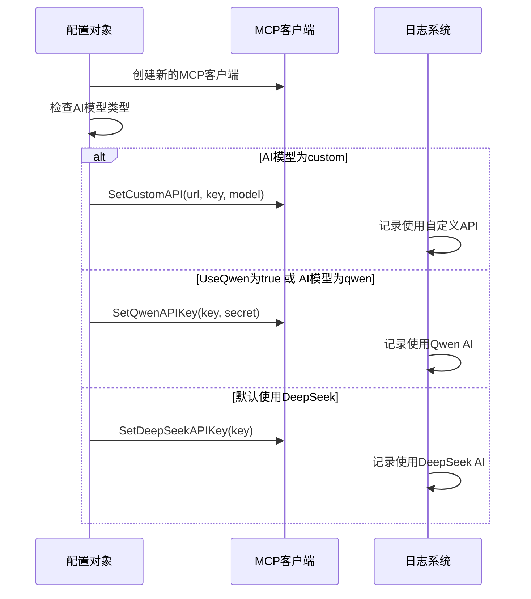
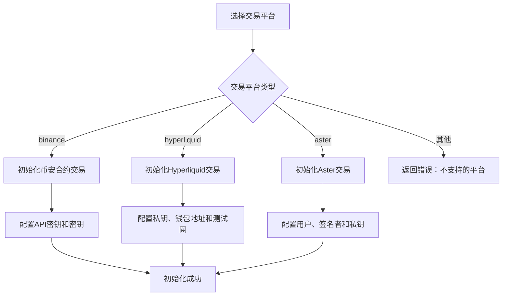
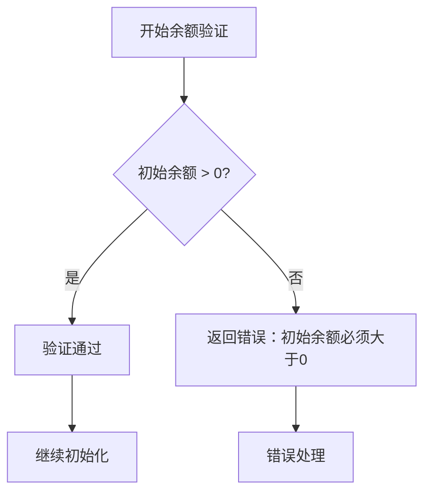
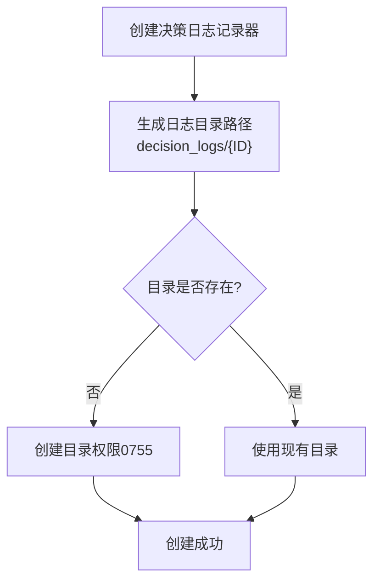
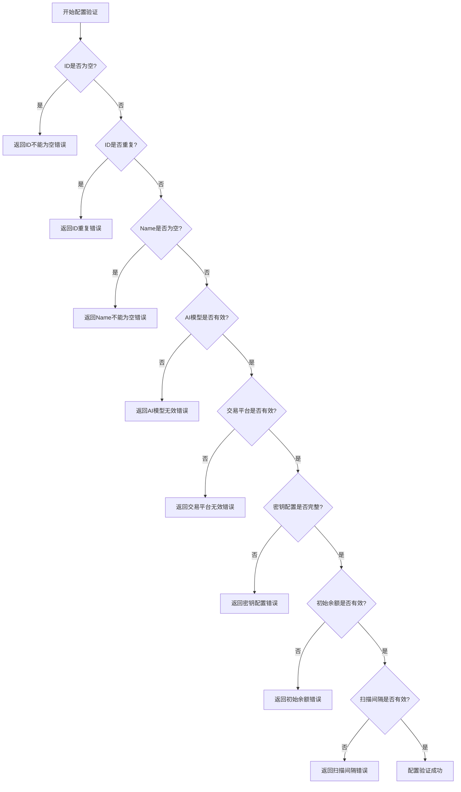

# AutoTrader初始化机制详细文档

<cite>
**本文档引用的文件**
- [auto_trader.go](file://trader/auto_trader.go)
- [config.go](file://config/config.go)
- [client.go](file://mcp/client.go)
- [decision_logger.go](file://logger/decision_logger.go)
- [coin_pool.go](file://pool/coin_pool.go)
- [binance_futures.go](file://trader/binance_futures.go)
- [hyperliquid_trader.go](file://trader/hyperliquid_trader.go)
- [aster_trader.go](file://trader/aster_trader.go)
</cite>

## 目录
1. [简介](#简介)
2. [NewAutoTrader工厂函数](#newautotrader工厂函数)
3. [配置默认值设置](#配置默认值设置)
4. [AI模型客户端初始化](#ai模型客户端初始化)
5. [交易所客户端初始化](#交易所客户端初始化)
6. [初始余额验证](#初始余额验证)
7. [决策日志目录创建](#决策日志目录创建)
8. [系统组件架构](#系统组件架构)
9. [配置验证与错误处理](#配置验证与错误处理)
10. [总结](#总结)

## 简介

AutoTrader初始化机制是整个交易系统的核心入口点，负责根据配置文件创建和初始化所有必要的系统组件。该机制通过`NewAutoTrader`工厂函数实现了复杂的依赖注入和组件初始化逻辑，确保系统在启动时能够正确配置AI模型、交易所连接、日志记录等关键组件。

## NewAutoTrader工厂函数

`NewAutoTrader`函数是AutoTrader系统的工厂函数，负责创建和初始化AutoTrader实例。该函数采用防御性编程原则，对输入配置进行严格验证和默认值设置。



**图表来源**
- [auto_trader.go](file://trader/auto_trader.go#L88-L180)

**章节来源**
- [auto_trader.go](file://trader/auto_trader.go#L88-L180)

## 配置默认值设置

AutoTrader初始化过程中的第一个重要步骤是设置配置的默认值。这个过程确保即使用户没有提供某些配置项，系统也能正常运行。

### ID和Name的默认值处理



**图表来源**
- [auto_trader.go](file://trader/auto_trader.go#L90-L100)

### Exchange的默认值处理

对于交易平台配置，系统提供了灵活的默认值设置逻辑。如果用户未指定交易平台，默认使用币安（Binance）作为交易平台。

**章节来源**
- [auto_trader.go](file://trader/auto_trader.go#L101-L105)

## AI模型客户端初始化

AI模型客户端的初始化是AutoTrader系统的核心功能之一。根据配置的不同，系统会初始化不同类型的AI客户端，支持多种AI服务提供商。

### AI模型选择逻辑



**图表来源**
- [auto_trader.go](file://trader/auto_trader.go#L107-L125)
- [client.go](file://mcp/client.go#L44-L76)

### 自定义API配置

当配置为自定义API时，系统会调用`SetCustomAPI`方法。该方法支持两种URL格式：

1. **标准格式**：`https://api.example.com` - 自动添加`/chat/completions`路径
2. **完整URL格式**：`https://api.example.com#` - 使用完整URL，不添加路径后缀

**章节来源**
- [auto_trader.go](file://trader/auto_trader.go#L107-L125)
- [client.go](file://mcp/client.go#L61-L76)

### Qwen API配置

使用阿里云Qwen时，系统会调用`SetQwenAPIKey`方法。该方法不仅设置API密钥，还配置了默认的基础URL和模型名称。

**章节来源**
- [client.go](file://mcp/client.go#L52-L58)

### DeepSeek API配置

默认情况下，系统使用DeepSeek作为AI提供商。`SetDeepSeekAPIKey`方法配置了相应的基础URL和模型名称。

**章节来源**
- [client.go](file://mcp/client.go#L44-L49)

## 交易所客户端初始化

AutoTrader支持多个主流加密货币交易平台，包括币安（Binance）、Hyperliquid和Aster。每个平台都有其特定的初始化要求和配置参数。

### 平台选择流程



**图表来源**
- [auto_trader.go](file://trader/auto_trader.go#L127-L150)

### 币安合约交易初始化

币安合约交易器的初始化相对简单，只需要提供API密钥和密钥即可。

**章节来源**
- [auto_trader.go](file://trader/auto_trader.go#L127-L129)
- [binance_futures.go](file://trader/binance_futures.go#L30-L35)

### Hyperliquid交易初始化

Hyperliquid交易器的初始化较为复杂，需要提供私钥、钱包地址和测试网配置。系统还会自动获取元数据信息。

**章节来源**
- [auto_trader.go](file://trader/auto_trader.go#L130-L135)
- [hyperliquid_trader.go](file://trader/hyperliquid_trader.go#L25-L50)

### Aster交易初始化

Aster交易器的初始化是最复杂的，需要提供主钱包地址、API钱包地址和私钥。系统还需要配置HTTP客户端和精度信息缓存。

**章节来源**
- [auto_trader.go](file://trader/auto_trader.go#L136-L141)
- [aster_trader.go](file://trader/aster_trader.go#L50-L75)

## 初始余额验证

初始余额验证是确保交易系统能够正确计算盈亏的关键步骤。系统会对配置的初始余额进行严格验证。



**图表来源**
- [auto_trader.go](file://trader/auto_trader.go#L143-L145)

**章节来源**
- [auto_trader.go](file://trader/auto_trader.go#L143-L145)

## 决策日志目录创建

每个AutoTrader实例都会为其创建独立的决策日志目录，确保不同交易者的决策记录相互隔离。目录路径基于交易者ID生成。



**图表来源**
- [auto_trader.go](file://trader/auto_trader.go#L147-L149)
- [decision_logger.go](file://logger/decision_logger.go#L80-L95)

**章节来源**
- [auto_trader.go](file://trader/auto_trader.go#L147-L149)
- [decision_logger.go](file://logger/decision_logger.go#L80-L95)

## 系统组件架构

AutoTrader初始化完成后，会构建一个包含所有必要组件的完整系统架构。

```mermaid
classDiagram
class AutoTrader {
+string id
+string name
+string aiModel
+string exchange
+AutoTraderConfig config
+Trader trader
+mcp.Client mcpClient
+logger.DecisionLogger decisionLogger
+float64 initialBalance
+time.Time startTime
+int callCount
+bool isRunning
+Run() error
+Stop() void
+GetStatus() map[string]interface{}
}
class AutoTraderConfig {
+string ID
+string Name
+string AIModel
+string Exchange
+string BinanceAPIKey
+string BinanceSecretKey
+string HyperliquidPrivateKey
+string HyperliquidWalletAddr
+string AsterUser
+string AsterSigner
+string AsterPrivateKey
+float64 InitialBalance
+time.Duration ScanInterval
}
class MCPClient {
+Provider provider
+string apiKey
+string baseURL
+string model
+SetCustomAPI(url, key, model) void
+SetQwenAPIKey(key, secret) void
+SetDeepSeekAPIKey(key) void
+CallWithMessages(system, user) string
}
class DecisionLogger {
+string logDir
+int cycleNumber
+LogDecision(record) error
+GetLatestRecords(n) []*DecisionRecord
+AnalyzePerformance(cycles) *PerformanceAnalysis
}
class Trader {
<<interface>>
+GetBalance() map[string]interface{}
+GetPositions() []map[string]interface{}
+OpenLong(symbol, quantity, leverage) map[string]interface{}
+OpenShort(symbol, quantity, leverage) map[string]interface{}
+CloseLong(symbol, quantity) map[string]interface{}
+CloseShort(symbol, quantity) map[string]interface{}
}
AutoTrader --> AutoTraderConfig
AutoTrader --> MCPClient
AutoTrader --> DecisionLogger
AutoTrader --> Trader
```

**图表来源**
- [auto_trader.go](file://trader/auto_trader.go#L50-L85)
- [client.go](file://mcp/client.go#L25-L40)
- [decision_logger.go](file://logger/decision_logger.go#L80-L95)

**章节来源**
- [auto_trader.go](file://trader/auto_trader.go#L50-L85)

## 配置验证与错误处理

AutoTrader初始化过程中包含了多层次的配置验证和错误处理机制，确保系统的稳定性和可靠性。

### 配置验证流程



**图表来源**
- [config.go](file://config/config.go#L120-L200)

### 错误处理策略

系统采用了分层的错误处理策略：

1. **配置级错误**：在配置阶段捕获和报告配置错误
2. **初始化级错误**：在组件初始化阶段处理特定的初始化错误
3. **运行时错误**：在系统运行过程中处理各种异常情况

**章节来源**
- [config.go](file://config/config.go#L120-L200)

## 总结

AutoTrader初始化机制是一个精心设计的系统，它通过以下关键特性确保了系统的可靠性和灵活性：

### 核心优势

1. **灵活的配置管理**：支持多种AI模型提供商和交易平台
2. **严格的验证机制**：确保配置的有效性和完整性
3. **模块化的组件设计**：便于扩展和维护
4. **完善的错误处理**：提供清晰的错误信息和恢复机制

### 设计特点

- **工厂模式**：使用`NewAutoTrader`工厂函数统一管理初始化过程
- **依赖注入**：通过配置对象传递所有必要的依赖
- **默认值策略**：提供合理的默认配置，减少用户配置负担
- **平台抽象**：通过Trader接口抽象不同交易平台的差异

### 扩展性考虑

该初始化机制为未来的功能扩展预留了良好的架构基础，支持：
- 新的AI模型提供商集成
- 新的交易平台接入
- 更复杂的配置验证规则
- 增强的日志和监控功能

通过这种设计，AutoTrader系统能够在保持稳定性的前提下，持续演进和扩展其功能能力。