# AutoTrader执行周期详细文档

<cite>
**本文档引用的文件**
- [auto_trader.go](file://trader/auto_trader.go)
- [interface.go](file://trader/interface.go)
- [engine.go](file://decision/engine.go)
- [decision_logger.go](file://logger/decision_logger.go)
</cite>

## 目录
1. [概述](#概述)
2. [核心架构](#核心架构)
3. [Run方法实现](#run方法实现)
4. [执行周期详解](#执行周期详解)
5. [定时器机制](#定时器机制)
6. [错误处理策略](#错误处理策略)
7. [设计模式分析](#设计模式分析)
8. [性能考虑](#性能考虑)
9. [总结](#总结)

## 概述

AutoTrader执行周期是整个自动交易系统的核心调度机制，它通过`Run()`方法实现了一个基于时间轮询的AI驱动决策循环。该系统采用非阻塞的select监听机制，结合time.Ticker定时器，实现了稳定可靠的周期性交易决策执行。

## 核心架构

AutoTrader执行周期的整体架构体现了清晰的分层设计：

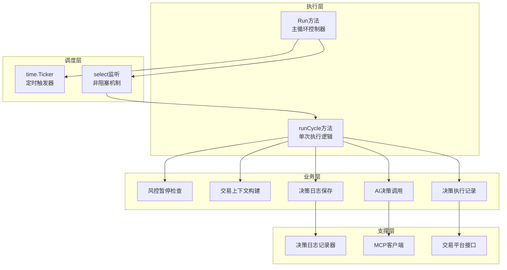

**图表来源**
- [auto_trader.go](file://trader/auto_trader.go#L180-L200)
- [auto_trader.go](file://trader/auto_trader.go#L202-L400)

**章节来源**
- [auto_trader.go](file://trader/auto_trader.go#L1-L100)

## Run方法实现

`Run()`方法是AutoTrader的主入口，负责启动和管理整个执行周期：

### 首次立即执行设计

系统采用了独特的首次立即执行设计模式，确保在定时器启动前就执行一次完整的决策流程：

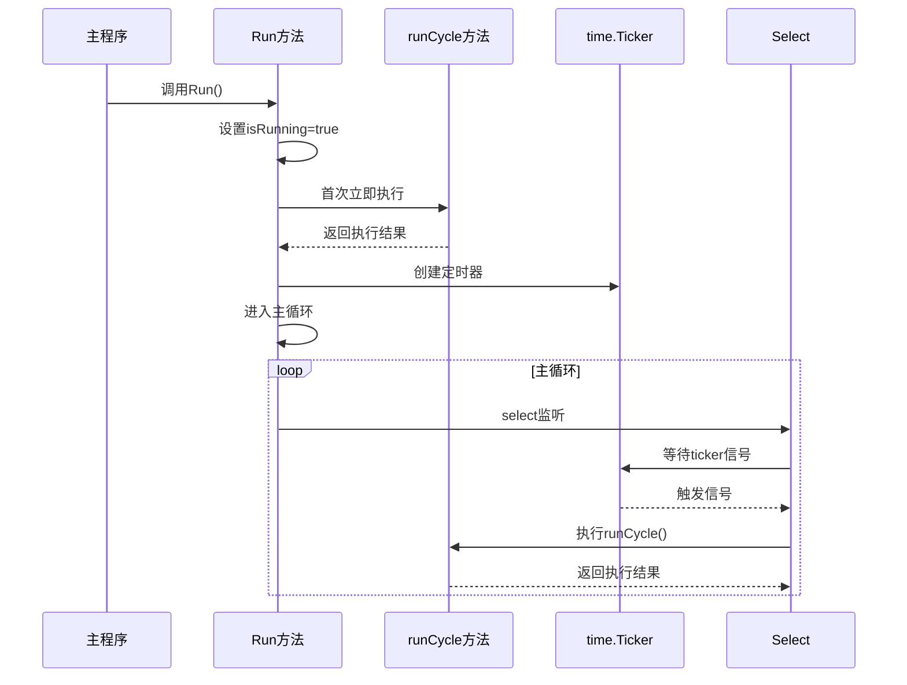

**图表来源**
- [auto_trader.go](file://trader/auto_trader.go#L180-L200)

### 循环终止机制

系统通过`isRunning`标志位实现优雅的循环终止：

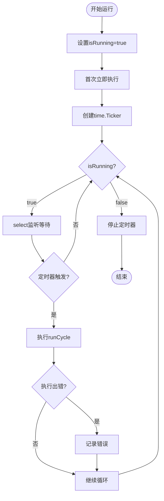

**图表来源**
- [auto_trader.go](file://trader/auto_trader.go#L180-L200)

**章节来源**
- [auto_trader.go](file://trader/auto_trader.go#L180-L200)

## 执行周期详解

`runCycle()`方法实现了完整的八阶段执行流程，每个阶段都有明确的职责和错误处理机制：

### 第一阶段：风控暂停检查

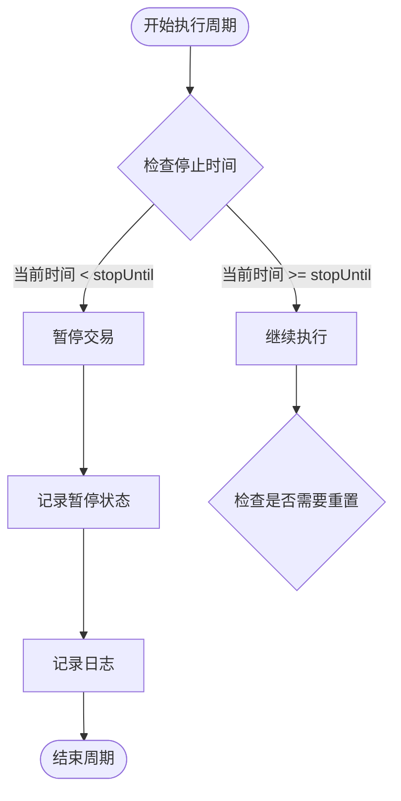

**图表来源**
- [auto_trader.go](file://trader/auto_trader.go#L202-L215)

### 第二阶段：日盈亏重置

系统每天凌晨自动重置日盈亏统计：

```mermaid
flowchart TD
ResetCheck --> TimeDiff{time.Since(lastResetTime) > 24h?}
TimeDiff --> |是| ResetPnL[重置dailyPnL = 0]
TimeDiff --> |否| Continue[继续执行]
ResetPnL --> UpdateTime[更新lastResetTime]
UpdateTime --> LogReset[记录重置日志]
LogReset --> Continue
```

**图表来源**
- [auto_trader.go](file://trader/auto_trader.go#L216-L220)

### 第三阶段：交易上下文构建

构建完整的交易上下文信息，包括账户状态、持仓信息和候选币种：

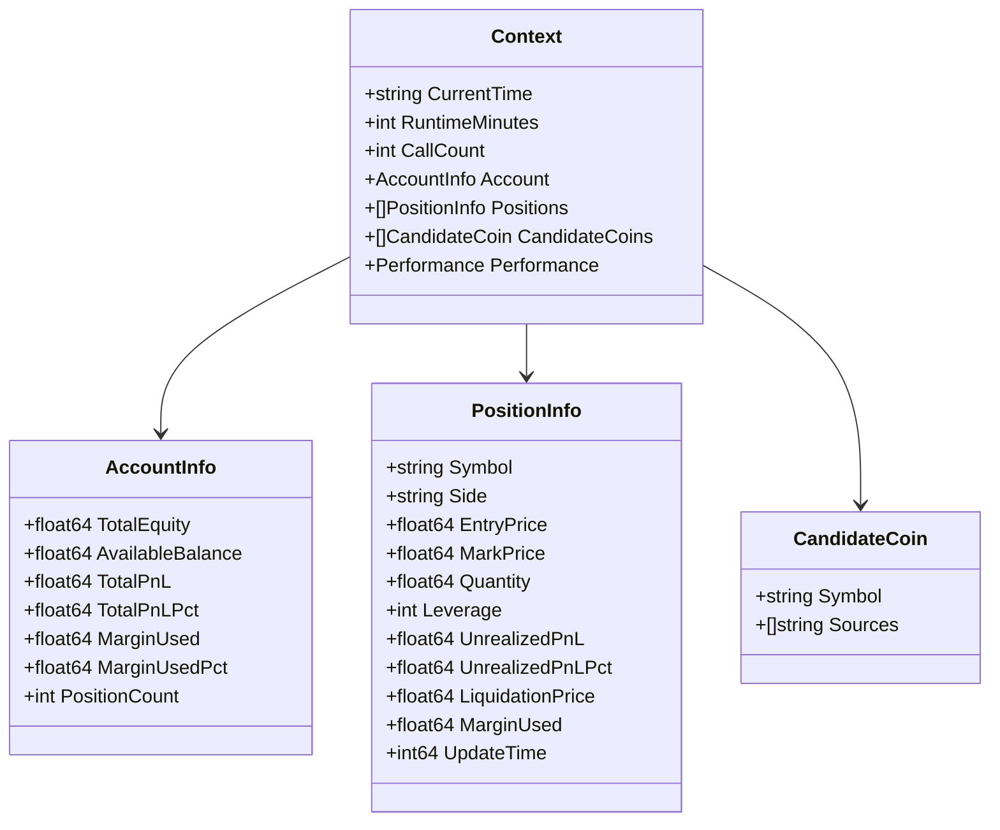

**图表来源**
- [engine.go](file://decision/engine.go#L40-L100)
- [auto_trader.go](file://trader/auto_trader.go#L400-L600)

### 第四阶段：AI决策调用

调用AI模型获取完整决策，包含思维链分析：

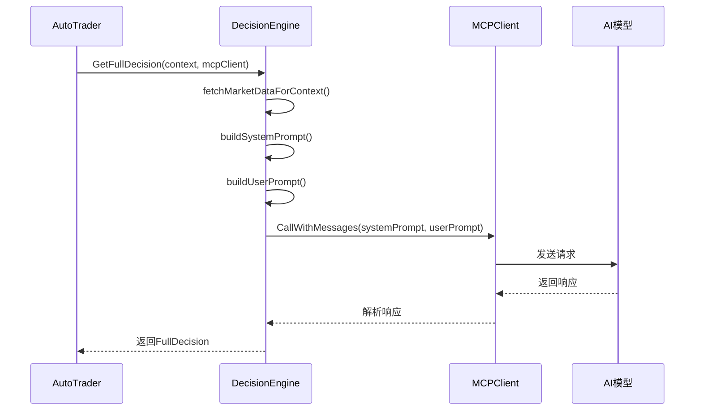

**图表来源**
- [engine.go](file://decision/engine.go#L100-L150)

### 第五阶段：AI思维链输出

系统会打印详细的AI思维链分析过程：

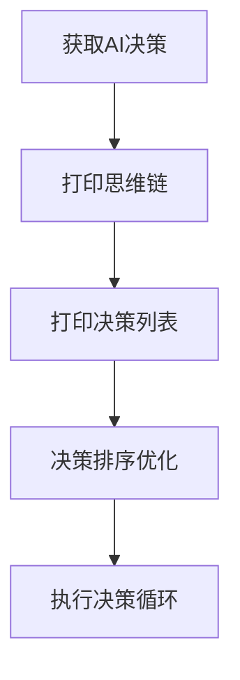

**图表来源**
- [auto_trader.go](file://trader/auto_trader.go#L300-L350)

### 第六阶段：决策排序优化

系统实现了智能的决策排序算法，确保交易安全性：

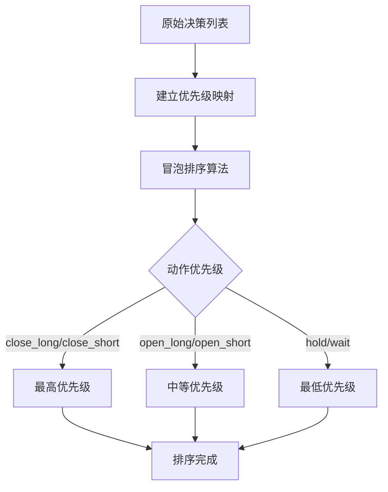

**图表来源**
- [auto_trader.go](file://trader/auto_trader.go#L901-L934)

### 第七阶段：决策执行记录

系统逐个执行排序后的决策，并记录详细的操作日志：

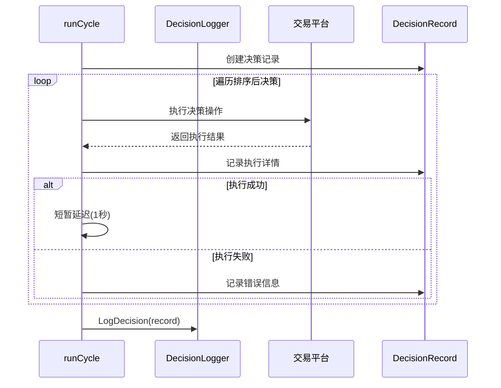

**图表来源**
- [auto_trader.go](file://trader/auto_trader.go#L350-L400)

### 第八阶段：决策日志保存

系统将完整的决策过程保存到文件系统：

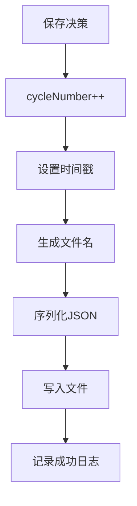

**图表来源**
- [decision_logger.go](file://logger/decision_logger.go#L74-L118)

**章节来源**
- [auto_trader.go](file://trader/auto_trader.go#L202-L400)

## 定时器机制

### time.Ticker的使用

系统使用`time.NewTicker()`创建定时器，确保周期性执行：

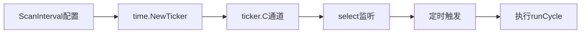

**图表来源**
- [auto_trader.go](file://trader/auto_trader.go#L180-L200)

### 非阻塞循环设计

系统采用select监听机制实现非阻塞循环：

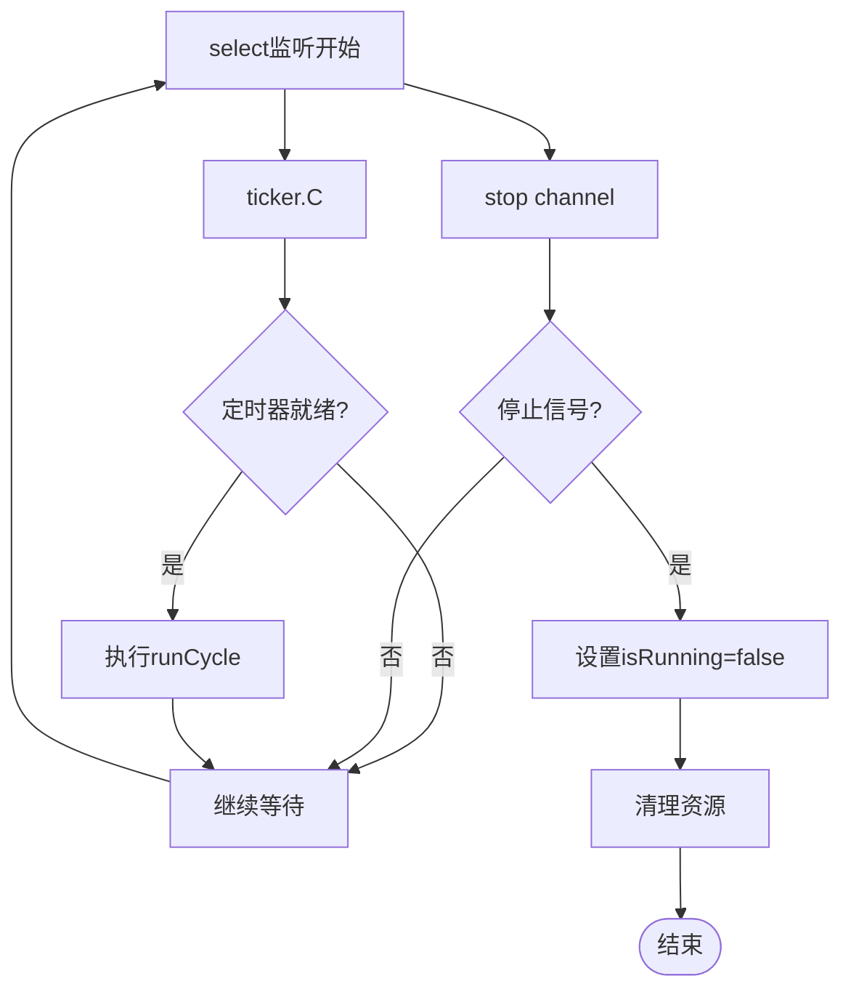

**图表来源**
- [auto_trader.go](file://trader/auto_trader.go#L180-L200)

**章节来源**
- [auto_trader.go](file://trader/auto_trader.go#L180-L200)

## 错误处理策略

### 分层错误处理

系统在每个执行阶段都实现了完善的错误处理：

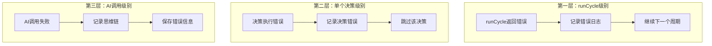

**图表来源**
- [auto_trader.go](file://trader/auto_trader.go#L202-L400)

### 错误恢复机制

系统实现了多层次的错误恢复策略：

1. **周期级恢复**：单次执行失败不影响后续周期
2. **决策级恢复**：单个决策失败不影响其他决策
3. **AI级恢复**：即使AI调用失败，也保存思维链信息

**章节来源**
- [auto_trader.go](file://trader/auto_trader.go#L202-L400)

## 设计模式分析

### 定时任务模式

AutoTrader采用了经典的定时任务模式：

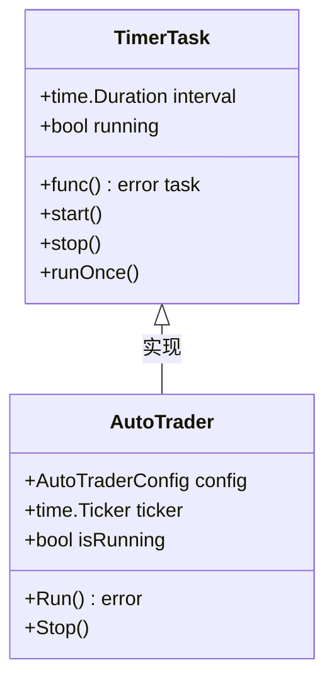

**图表来源**
- [auto_trader.go](file://trader/auto_trader.go#L180-L200)

### 策略模式

系统通过接口抽象支持多种交易平台：

```mermaid
classDiagram
class Trader {
<<interface>>
+GetBalance() map[string]interface{}
+GetPositions() []map[string]interface{}
+OpenLong(string, float64, int) map[string]interface{}
+CloseLong(string, float64) map[string]interface{}
+SetStopLoss(string, string, float64, float64) error
+SetTakeProfit(string, string, float64, float64) error
}
class FuturesTrader {
+OpenLong() map[string]interface{}
+CloseLong() map[string]interface{}
}
class HyperliquidTrader {
+OpenLong() map[string]interface{}
+CloseLong() map[string]interface{}
}
class AsterTrader {
+OpenLong() map[string]interface{}
+CloseLong() map[string]interface{}
}
Trader <|.. FuturesTrader
Trader <|.. HyperliquidTrader
Trader <|.. AsterTrader
```

**图表来源**
- [interface.go](file://trader/interface.go#L3-L41)

### 记录者模式

决策日志系统采用了记录者模式：

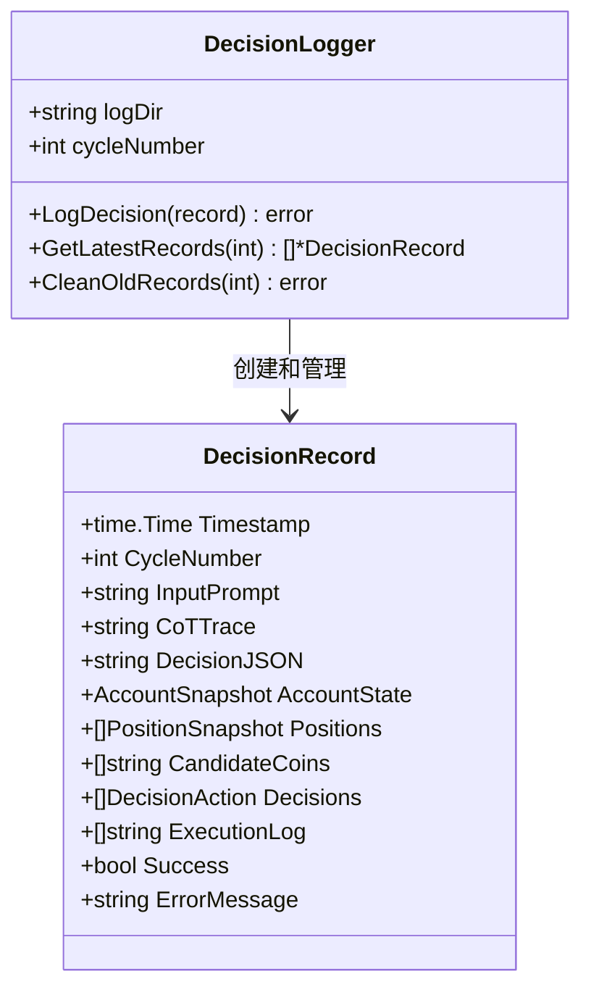

**图表来源**
- [decision_logger.go](file://logger/decision_logger.go#L10-L50)

**章节来源**
- [auto_trader.go](file://trader/auto_trader.go#L1-L100)
- [interface.go](file://trader/interface.go#L1-L41)
- [decision_logger.go](file://logger/decision_logger.go#L1-L100)

## 性能考虑

### 并发优化

系统在多个层面实现了并发优化：

1. **市场数据获取**：并行获取多个币种的市场数据
2. **决策排序**：使用高效的冒泡排序算法
3. **文件I/O**：异步写入决策日志

### 内存管理

系统采用了多项内存优化策略：

1. **对象复用**：重用决策记录对象
2. **及时清理**：定期清理过期的持仓记录
3. **缓冲区管理**：合理控制日志文件大小

### 资源释放

系统确保所有资源得到正确释放：

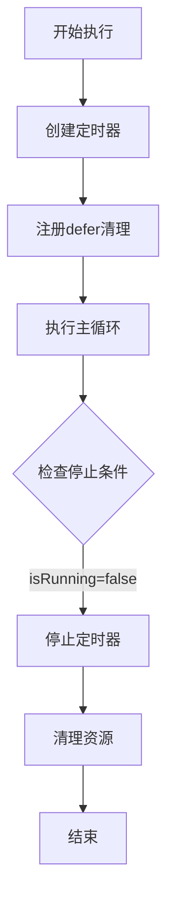

**图表来源**
- [auto_trader.go](file://trader/auto_trader.go#L180-L200)

## 总结

AutoTrader执行周期是一个设计精良的自动化交易系统核心组件。它通过以下关键特性实现了稳定可靠的AI驱动交易：

### 核心优势

1. **稳定性**：采用非阻塞select监听机制，确保系统不会因某个环节卡住而崩溃
2. **可靠性**：完善的错误处理和恢复机制，单点故障不影响整体运行
3. **可扩展性**：模块化设计支持多种交易平台和AI模型
4. **可观测性**：完整的决策日志记录，便于调试和分析

### 技术亮点

1. **首次立即执行**：确保系统启动后立即开始工作
2. **智能决策排序**：防止仓位叠加超限的安全机制
3. **分层错误处理**：多层次的异常处理和恢复策略
4. **灵活的配置**：支持多种交易策略和风险管理参数

### 应用价值

该执行周期机制为量化交易提供了坚实的基础，特别适用于：
- 高频交易场景
- 算法交易策略
- 风险管理系统
- 交易监控平台

通过深入理解这个执行周期的设计原理和实现细节，开发者可以更好地维护和扩展这个自动化交易系统，同时为类似项目的开发提供宝贵的参考经验。