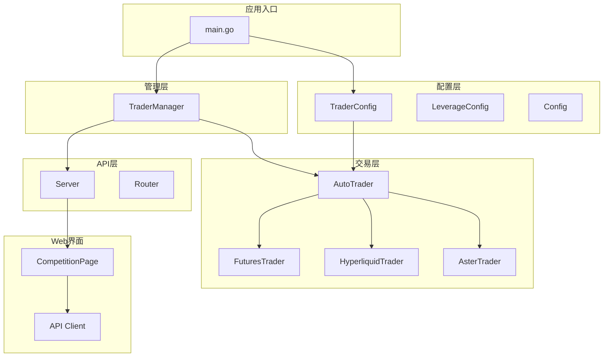
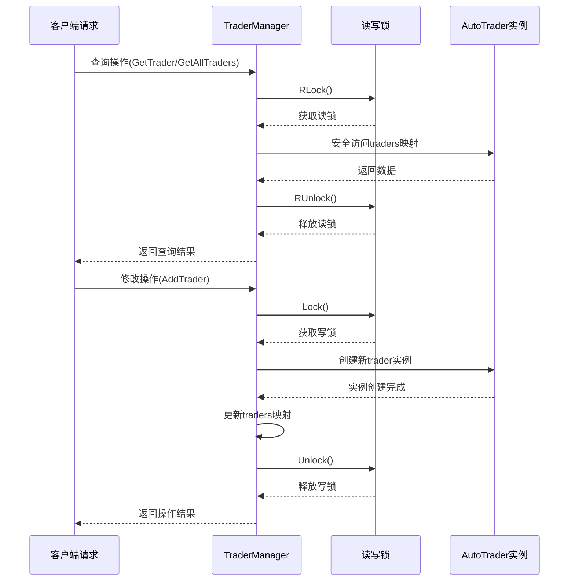
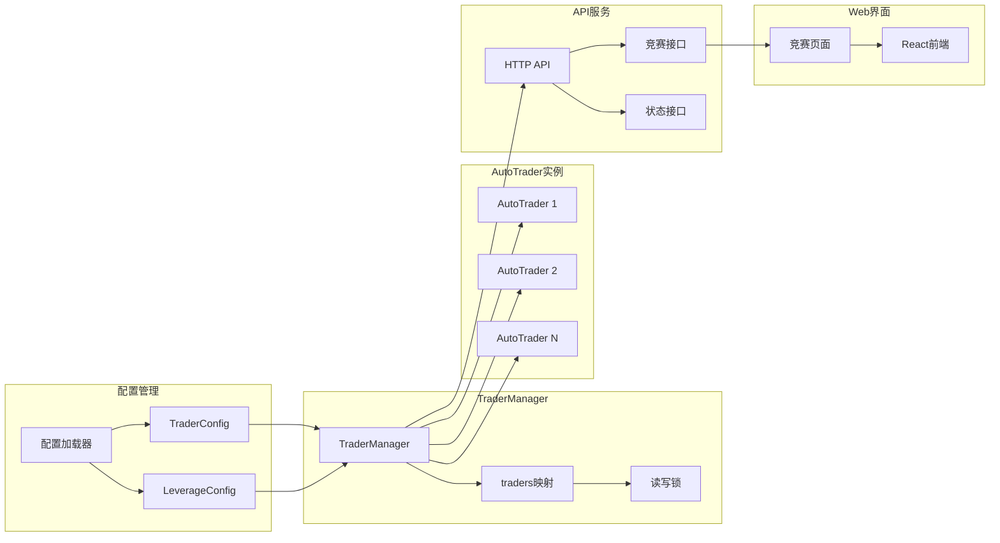
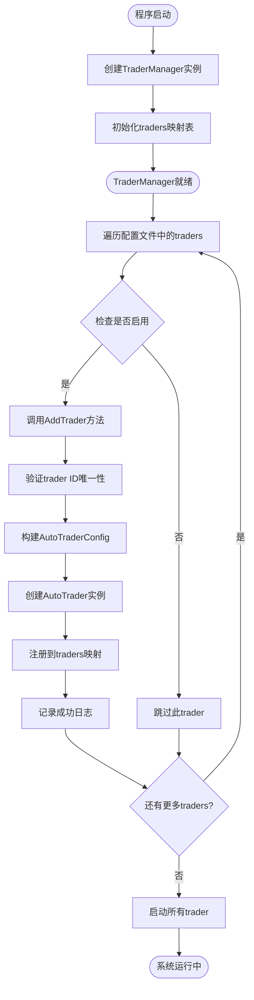
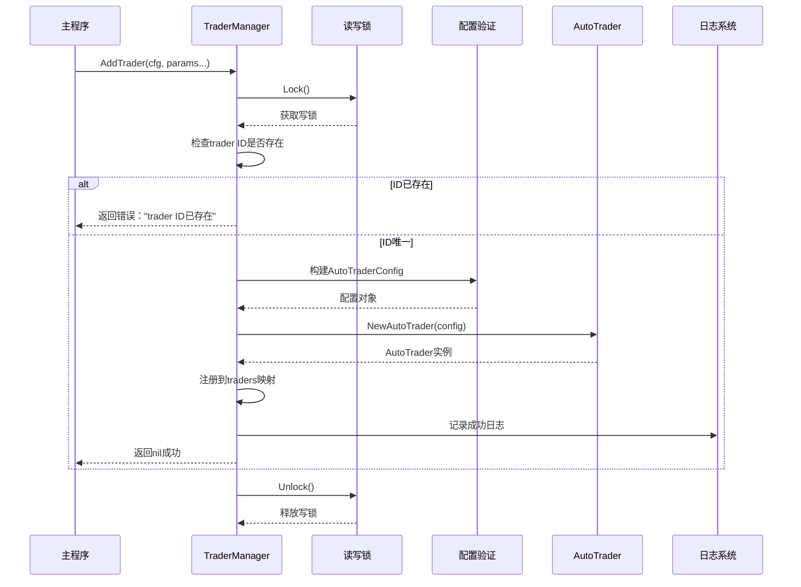
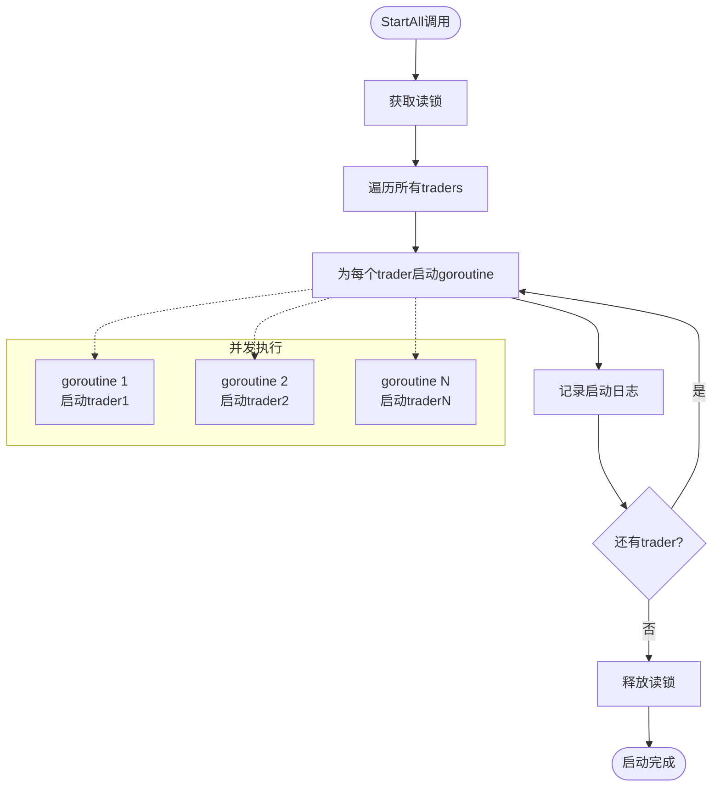
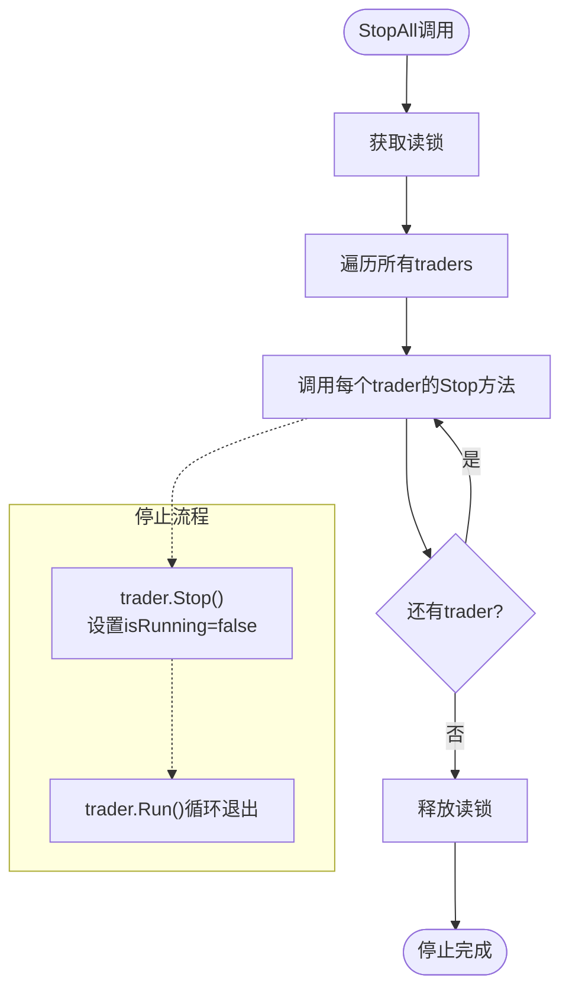
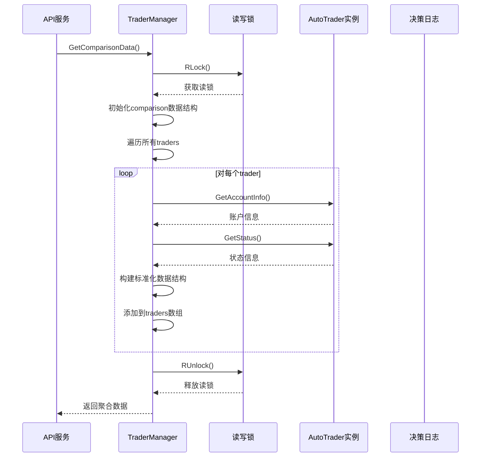
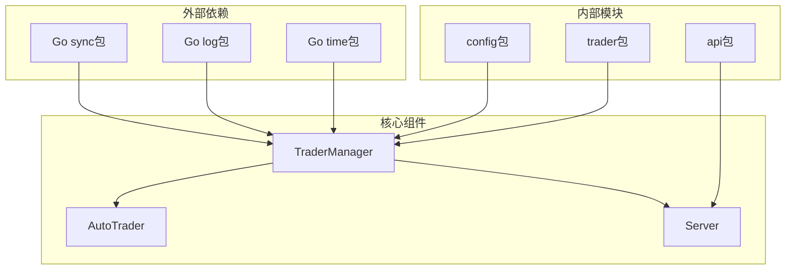

# TraderManager 组件详细文档

<cite>
**本文档引用的文件**
- [manager/trader_manager.go](file://manager/trader_manager.go)
- [main.go](file://main.go)
- [trader/auto_trader.go](file://trader/auto_trader.go)
- [config/config.go](file://config/config.go)
- [api/server.go](file://api/server.go)
- [web/src/components/CompetitionPage.tsx](file://web/src/components/CompetitionPage.tsx)
- [web/src/lib/api.ts](file://web/src/lib/api.ts)
</cite>

## 目录
1. [简介](#简介)
2. [项目结构概述](#项目结构概述)
3. [TraderManager核心设计](#tradermanager核心设计)
4. [架构概览](#架构概览)
5. [详细组件分析](#详细组件分析)
6. [依赖关系分析](#依赖关系分析)
7. [性能考虑](#性能考虑)
8. [故障排除指南](#故障排除指南)
9. [结论](#结论)

## 简介

TraderManager是nofx项目中的核心交易机器人管理中枢，负责统一管理和协调多个AutoTrader实例的生命周期。作为一个高并发的交易管理系统，它采用了读写锁机制确保多goroutine环境下的线程安全，提供了完整的交易机器人注册、查询、启动和监控功能。

该组件在AI交易竞赛系统中扮演着关键角色，不仅管理着多个AI交易机器人的运行状态，还为前端排行榜功能提供了实时的数据聚合能力，支持Qwen vs DeepSeek等AI模型之间的竞争展示。

## 项目结构概述

nofx项目采用模块化架构设计，TraderManager位于管理层（manager）核心位置，与配置层（config）、交易层（trader）、API层（api）和Web界面层紧密协作。



**图表来源**
- [main.go](file://main.go#L45-L98)
- [manager/trader_manager.go](file://manager/trader_manager.go#L10-L15)
- [api/server.go](file://api/server.go#L15-L25)

**章节来源**
- [main.go](file://main.go#L1-L140)
- [manager/trader_manager.go](file://manager/trader_manager.go#L1-L173)

## TraderManager核心设计

### 核心数据结构

TraderManager采用简洁而高效的设计模式，包含两个核心字段：

| 字段名 | 类型 | 描述 | 设计目的 |
|--------|------|------|----------|
| traders | map[string]*AutoTrader | 存储所有AutoTrader实例的映射表，键为trader ID | 提供快速的trader查找和管理能力 |
| mu | sync.RWMutex | 读写互斥锁 | 确保多goroutine环境下的线程安全 |

### 线程安全机制

TraderManager通过读写锁（sync.RWMutex）实现了高效的并发控制：



**图表来源**
- [manager/trader_manager.go](file://manager/trader_manager.go#L25-L35)
- [manager/trader_manager.go](file://manager/trader_manager.go#L68-L78)

**章节来源**
- [manager/trader_manager.go](file://manager/trader_manager.go#L10-L15)

## 架构概览

TraderManager在整个系统架构中处于核心协调地位，连接着配置管理、交易执行和用户界面三个主要模块。



**图表来源**
- [main.go](file://main.go#L45-L98)
- [manager/trader_manager.go](file://manager/trader_manager.go#L17-L25)
- [api/server.go](file://api/server.go#L67-L114)

## 详细组件分析

### TraderManager初始化

TraderManager的创建过程体现了简洁的设计理念：



**图表来源**
- [main.go](file://main.go#L45-L98)
- [manager/trader_manager.go](file://manager/trader_manager.go#L17-L25)

### AddTrader方法详解

AddTrader方法是TraderManager的核心功能之一，负责创建和注册新的AutoTrader实例：



**图表来源**
- [manager/trader_manager.go](file://manager/trader_manager.go#L25-L78)

### 查询方法实现

TraderManager提供了多种查询方法，每种方法都采用了适当的锁策略：

| 方法名 | 锁类型 | 返回类型 | 用途描述 |
|--------|--------|----------|----------|
| GetTrader | RLock | *AutoTrader | 根据ID获取单个trader实例 |
| GetAllTraders | RLock | map[string]*AutoTrader | 获取所有trader实例的副本 |
| GetTraderIDs | RLock | []string | 获取所有trader ID列表 |
| GetComparisonData | RLock | map[string]interface{} | 获取竞赛对比数据 |

```mermaid
classDiagram
class TraderManager {
-traders map[string]*AutoTrader
-mu sync.RWMutex
+GetTrader(id string) (*AutoTrader, error)
+GetAllTraders() map[string]*AutoTrader
+GetTraderIDs() []string
+GetComparisonData() (map[string]interface{}, error)
+StartAll()
+StopAll()
}
class AutoTrader {
+GetID() string
+GetName() string
+GetAIModel() string
+GetAccountInfo() (map[string]interface{}, error)
+GetStatus() map[string]interface{}
+Run() error
+Stop()
}
TraderManager --> AutoTrader : "管理多个实例"
```

**图表来源**
- [manager/trader_manager.go](file://manager/trader_manager.go#L70-L124)
- [manager/trader_manager.go](file://manager/trader_manager.go#L126-L171)

### 批量操作方法

#### StartAll方法

StartAll方法实现了并发启动所有交易机器人的功能：



**图表来源**
- [manager/trader_manager.go](file://manager/trader_manager.go#L95-L114)

#### StopAll方法

StopAll方法提供了优雅的关闭机制：



**图表来源**
- [manager/trader_manager.go](file://manager/trader_manager.go#L116-L124)

### GetComparisonData方法详解

GetComparisonData方法是支持前端排行榜功能的核心功能，实现了数据聚合和格式化：



**图表来源**
- [manager/trader_manager.go](file://manager/trader_manager.go#L126-L171)

**章节来源**
- [manager/trader_manager.go](file://manager/trader_manager.go#L25-L171)

## 依赖关系分析

TraderManager与系统的其他组件形成了清晰的依赖关系网络：



**图表来源**
- [manager/trader_manager.go](file://manager/trader_manager.go#L3-L9)
- [main.go](file://main.go#L3-L12)

### 关键依赖说明

| 依赖模块 | 用途 | 版本要求 | 设计考量 |
|----------|------|----------|----------|
| Go sync包 | 提供读写锁机制 | Go 1.16+ | 确保线程安全的并发控制 |
| config包 | 配置管理 | 内部包 | 解耦配置逻辑，便于维护 |
| trader包 | AutoTrader实现 | 内部包 | 封装交易逻辑，提供统一接口 |
| gin-gonic/gin | HTTP框架 | v1.8.0+ | 提供高性能RESTful API服务 |

**章节来源**
- [manager/trader_manager.go](file://manager/trader_manager.go#L3-L9)
- [main.go](file://main.go#L3-L12)

## 性能考虑

### 并发性能优化

TraderManager在设计时充分考虑了并发性能：

1. **读写分离**：读操作使用RLock，允许多个goroutine同时读取
2. **最小锁范围**：只在必要时获取写锁，减少锁竞争
3. **并发启动**：StartAll方法利用goroutine实现并行启动

### 内存使用优化

1. **引用传递**：traders映射存储AutoTrader指针而非实例
2. **懒加载**：只有在需要时才创建和启动trader实例
3. **及时释放**：StopAll方法确保资源正确释放

### 网络性能优化

1. **批量查询**：GetComparisonData一次性获取所有trader数据
2. **缓存友好**：traders映射提供O(1)的查找复杂度
3. **异步处理**：API请求采用异步处理模式

## 故障排除指南

### 常见问题及解决方案

| 问题类型 | 症状描述 | 可能原因 | 解决方案 |
|----------|----------|----------|----------|
| Trader创建失败 | AddTrader返回错误 | 配置验证失败或ID冲突 | 检查配置文件和trader ID唯一性 |
| 查询超时 | GetTrader/getAllTraders响应慢 | 锁竞争或trader实例异常 | 检查trader运行状态和系统负载 |
| 启动失败 | StartAll后部分trader无法运行 | API密钥无效或网络问题 | 验证交易所API配置和网络连接 |
| 数据不一致 | GetComparisonData返回错误数据 | trader实例状态不同步 | 重启受影响的trader实例 |

### 调试技巧

1. **日志分析**：查看系统日志中的详细错误信息
2. **状态监控**：使用API接口检查trader运行状态
3. **配置验证**：确保配置文件格式正确且参数有效
4. **网络诊断**：检查与交易所的网络连接状态

**章节来源**
- [manager/trader_manager.go](file://manager/trader_manager.go#L25-L35)
- [main.go](file://main.go#L80-L98)

## 结论

TraderManager作为nofx项目的核心组件，成功实现了以下设计目标：

1. **高并发支持**：通过读写锁机制确保多goroutine环境下的线程安全
2. **灵活扩展**：支持动态添加和移除AutoTrader实例
3. **性能优化**：采用读写分离和并发处理提升系统吞吐量
4. **易于维护**：清晰的模块划分和接口设计便于代码维护

该组件在AI交易竞赛系统中发挥了关键作用，不仅管理着多个AI交易机器人的运行，还为前端排行榜功能提供了稳定可靠的数据支撑。其设计模式和实现方式为类似的分布式交易管理系统提供了有价值的参考。

通过合理的架构设计和性能优化，TraderManager展现了优秀的可扩展性和稳定性，为nofx项目的成功运行奠定了坚实基础。