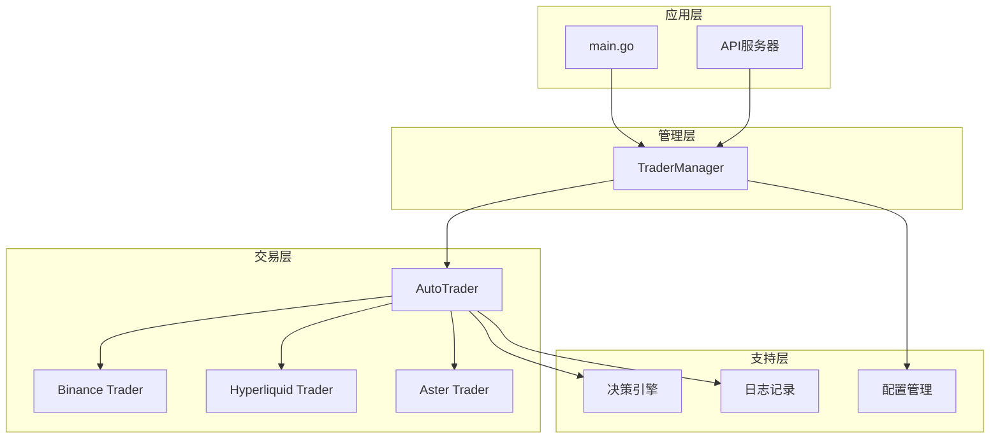
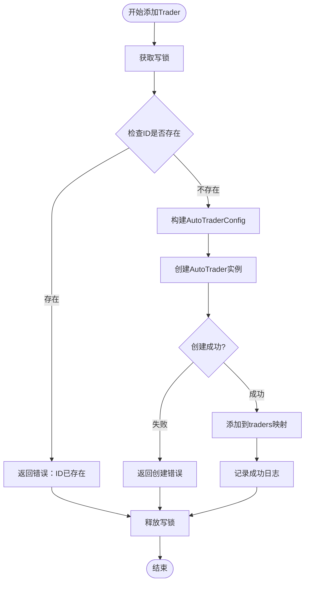
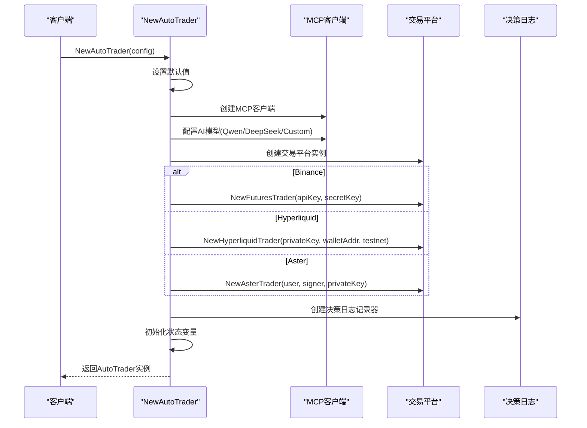
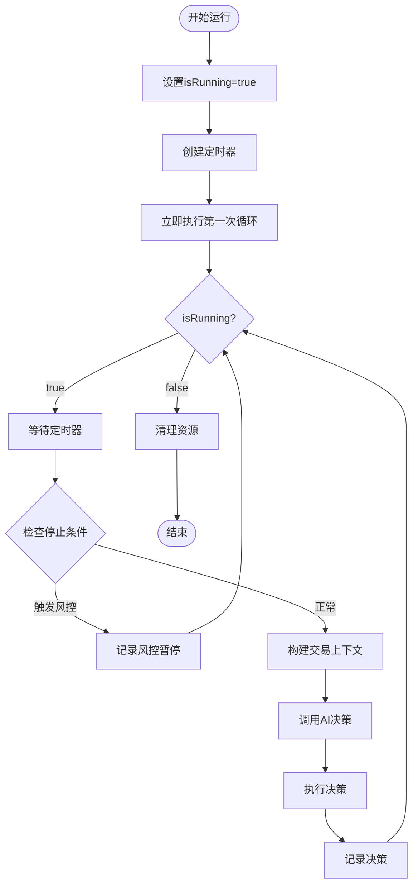
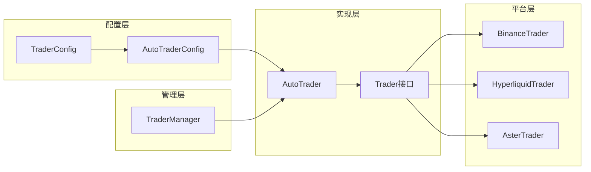
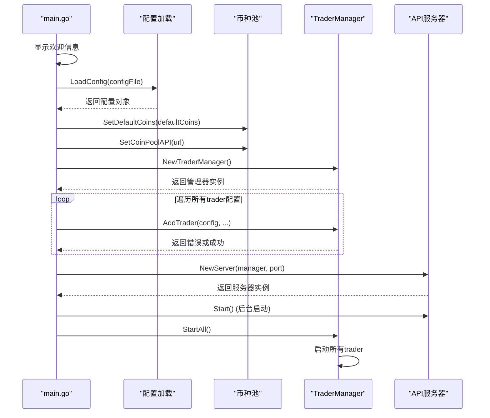
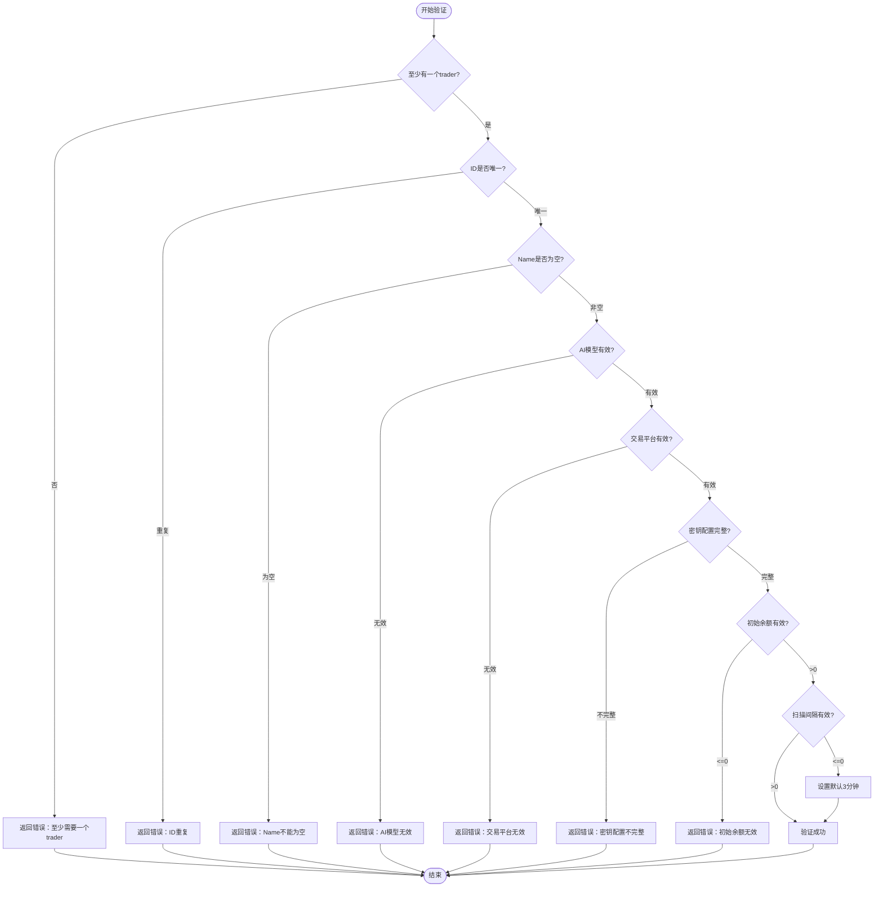
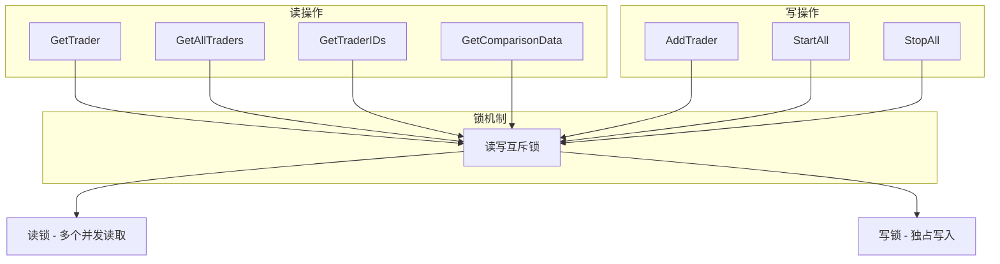
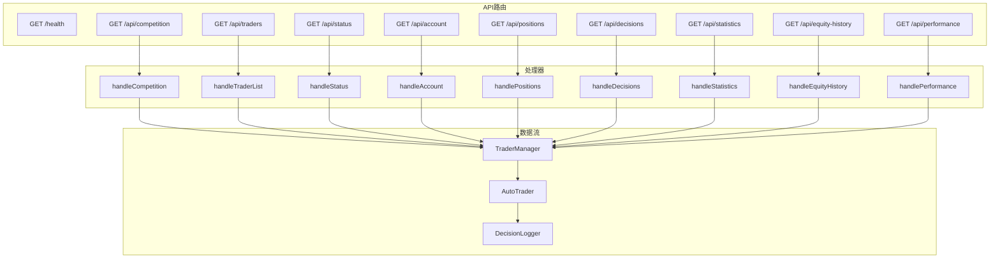

# 核心组件

<cite>
**本文档引用的文件**
- [manager/trader_manager.go](file://manager/trader_manager.go)
- [trader/auto_trader.go](file://trader/auto_trader.go)
- [main.go](file://main.go)
- [trader/interface.go](file://trader/interface.go)
- [config/config.go](file://config/config.go)
- [trader/binance_futures.go](file://trader/binance_futures.go)
- [trader/hyperliquid_trader.go](file://trader/hyperliquid_trader.go)
- [trader/aster_trader.go](file://trader/aster_trader.go)
- [api/server.go](file://api/server.go)
- [decision/engine.go](file://decision/engine.go)
</cite>

## 目录
1. [简介](#简介)
2. [项目架构概览](#项目架构概览)
3. [TraderManager核心组件](#tradermanager核心组件)
4. [AutoTrader核心组件](#autotrader核心组件)
5. [组件间依赖关系](#组件间依赖关系)
6. [初始化流程](#初始化流程)
7. [线程安全机制](#线程安全机制)
8. [API集成](#api集成)
9. [性能考虑](#性能考虑)
10. [故障排除指南](#故障排除指南)
11. [总结](#总结)

## 简介

nofx项目是一个基于AI驱动的加密货币交易竞赛系统，核心围绕两个主要组件：TraderManager和AutoTrader。TraderManager负责管理多个交易机器人的生命周期，而AutoTrader则是每个参赛交易者的具体实现。这两个组件通过精心设计的架构实现了高并发、线程安全的交易机器人管理系统。

## 项目架构概览

项目采用分层架构设计，核心组件位于管理层和交易层之间，形成了清晰的职责分离：



**图表来源**
- [main.go](file://main.go#L1-L140)
- [manager/trader_manager.go](file://manager/trader_manager.go#L1-L173)
- [trader/auto_trader.go](file://trader/auto_trader.go#L1-L936)

## TraderManager核心组件

### 设计理念

TraderManager是整个系统的核心控制器，采用单例模式设计，负责统一管理所有交易机器人的生命周期。其设计遵循以下原则：

- **单一职责**：专注于交易机器人的管理
- **线程安全**：使用读写互斥锁确保并发安全
- **松耦合**：通过接口抽象与具体交易器解耦

### 数据结构设计

```mermaid
classDiagram
class TraderManager {
+map[string]*AutoTrader traders
+sync.RWMutex mu
+NewTraderManager() *TraderManager
+AddTrader(cfg, coinPoolURL, maxDailyLoss, maxDrawdown, stopTradingMinutes, leverage) error
+GetTrader(id) *AutoTrader
+GetAllTraders() map[string]*AutoTrader
+GetTraderIDs() []string
+StartAll()
+StopAll()
+GetComparisonData() map[string]interface{}
}
class AutoTrader {
+string id
+string name
+string aiModel
+string exchange
+AutoTraderConfig config
+Trader trader
+Run() error
+Stop()
+GetID() string
+GetName() string
+GetAIModel() string
}
TraderManager --> AutoTrader : "管理"
```

**图表来源**
- [manager/trader_manager.go](file://manager/trader_manager.go#L11-L16)
- [trader/auto_trader.go](file://trader/auto_trader.go#L57-L75)

### 核心方法实现

#### AddTrader方法

AddTrader方法是TraderManager的核心入口，负责创建和注册新的交易机器人：



**图表来源**
- [manager/trader_manager.go](file://manager/trader_manager.go#L33-L72)

#### 线程安全的访问方法

TraderManager提供了多个线程安全的访问方法：

- **GetTrader**: 安全获取指定ID的交易机器人
- **GetAllTraders**: 获取所有交易机器人的副本
- **GetTraderIDs**: 获取所有交易机器人的ID列表

这些方法都使用读锁，允许多个并发读取操作。

**章节来源**
- [manager/trader_manager.go](file://manager/trader_manager.go#L74-L124)

## AutoTrader核心组件

### 结构体设计

AutoTrader是每个交易机器人的具体实现，包含了完整的交易逻辑和状态管理：

```mermaid
classDiagram
class AutoTrader {
-string id
-string name
-string aiModel
-string exchange
-AutoTraderConfig config
-Trader trader
-mcp.Client mcpClient
-logger.DecisionLogger decisionLogger
-float64 initialBalance
-float64 dailyPnL
-time.Time lastResetTime
-time.Time stopUntil
-bool isRunning
-time.Time startTime
-int callCount
-map[string]int64 positionFirstSeenTime
+NewAutoTrader(config) *AutoTrader
+Run() error
+Stop()
+GetID() string
+GetName() string
+GetAIModel() string
+GetStatus() map[string]interface{}
+GetAccountInfo() map[string]interface{}
+GetDecisionLogger() *DecisionLogger
}
class AutoTraderConfig {
+string ID
+string Name
+string AIModel
+string Exchange
+string BinanceAPIKey
+string BinanceSecretKey
+string HyperliquidPrivateKey
+string HyperliquidWalletAddr
+bool HyperliquidTestnet
+string AsterUser
+string AsterSigner
+string AsterPrivateKey
+string CoinPoolAPIURL
+bool UseQwen
+string DeepSeekKey
+string QwenKey
+string CustomAPIURL
+string CustomAPIKey
+string CustomModelName
+time.Duration ScanInterval
+float64 InitialBalance
+int BTCETHLeverage
+int AltcoinLeverage
+float64 MaxDailyLoss
+float64 MaxDrawdown
+time.Duration StopTradingTime
}
AutoTrader --> AutoTraderConfig : "使用"
AutoTrader --> Trader : "委托"
```

**图表来源**
- [trader/auto_trader.go](file://trader/auto_trader.go#L57-L75)
- [trader/auto_trader.go](file://trader/auto_trader.go#L17-L56)

### NewAutoTrader工厂函数

NewAutoTrader是AutoTrader的主要工厂函数，负责根据配置初始化交易机器人：



**图表来源**
- [trader/auto_trader.go](file://trader/auto_trader.go#L87-L164)

### 运行循环机制

AutoTrader的Run方法实现了核心的交易循环：



**图表来源**
- [trader/auto_trader.go](file://trader/auto_trader.go#L166-L185)

**章节来源**
- [trader/auto_trader.go](file://trader/auto_trader.go#L87-L164)
- [trader/auto_trader.go](file://trader/auto_trader.go#L166-L185)

## 组件间依赖关系

### 依赖注入模式

TraderManager与AutoTrader之间采用了依赖注入的设计模式：



**图表来源**
- [manager/trader_manager.go](file://manager/trader_manager.go#L33-L63)
- [trader/auto_trader.go](file://trader/auto_trader.go#L87-L133)

### 接口抽象

Trader接口定义了所有交易平台的统一行为：

| 方法名 | 功能描述 | 参数 | 返回值 |
|--------|----------|------|--------|
| GetBalance | 获取账户余额 | 无 | map[string]interface{}, error |
| GetPositions | 获取持仓信息 | 无 | []map[string]interface{}, error |
| OpenLong | 开多仓 | symbol, quantity, leverage | map[string]interface{}, error |
| OpenShort | 开空仓 | symbol, quantity, leverage | map[string]interface{}, error |
| CloseLong | 平多仓 | symbol, quantity | map[string]interface{}, error |
| CloseShort | 平空仓 | symbol, quantity | map[string]interface{}, error |
| SetLeverage | 设置杠杆 | symbol, leverage | error |
| GetMarketPrice | 获取市场价格 | symbol | float64, error |
| SetStopLoss | 设置止损单 | symbol, positionSide, quantity, stopPrice | error |
| SetTakeProfit | 设置止盈单 | symbol, positionSide, quantity, takeProfitPrice | error |
| CancelAllOrders | 取消所有订单 | symbol | error |
| FormatQuantity | 格式化数量 | symbol, quantity | string, error |

**章节来源**
- [trader/interface.go](file://trader/interface.go#L3-L41)

## 初始化流程

### 主程序初始化

main.go展示了完整的初始化流程：



**图表来源**
- [main.go](file://main.go#L15-L139)

### 配置验证

配置系统提供了严格的验证机制：



**图表来源**
- [config/config.go](file://config/config.go#L103-L185)

**章节来源**
- [main.go](file://main.go#L15-L139)
- [config/config.go](file://config/config.go#L103-L185)

## 线程安全机制

### sync.RWMutex实现

TraderManager使用读写互斥锁确保线程安全：



**图表来源**
- [manager/trader_manager.go](file://manager/trader_manager.go#L11-L16)

### 锁策略详解

| 操作类型 | 使用的锁 | 并发能力 | 适用场景 |
|----------|----------|----------|----------|
| AddTrader | 写锁 | 独占 | 添加新交易机器人 |
| GetTrader | 读锁 | 多个并发 | 查询特定交易机器人 |
| GetAllTraders | 读锁 | 多个并发 | 获取所有交易机器人 |
| GetTraderIDs | 读锁 | 多个并发 | 获取交易机器人ID列表 |
| StartAll | 读锁 | 多个并发 | 启动所有交易机器人 |
| StopAll | 读锁 | 多个并发 | 停止所有交易机器人 |
| GetComparisonData | 读锁 | 多个并发 | 获取对比数据 |

**章节来源**
- [manager/trader_manager.go](file://manager/trader_manager.go#L11-L16)
- [manager/trader_manager.go](file://manager/trader_manager.go#L74-L124)

## API集成

### RESTful API设计

API服务器提供了完整的RESTful接口：



**图表来源**
- [api/server.go](file://api/server.go#L47-L67)
- [api/server.go](file://api/server.go#L15-L45)

### 实时数据获取

API提供了多种实时数据获取方式：

| 端点 | 功能 | 参数 | 返回数据 |
|------|------|------|----------|
| GET /api/competition | 获取所有trader对比数据 | 无 | 包含净值、盈亏、持仓等统计信息 |
| GET /api/traders | 获取trader列表 | 无 | trader_id, trader_name, ai_model |
| GET /api/status | 获取trader状态 | trader_id | 运行状态、调用次数、启动时间等 |
| GET /api/account | 获取账户信息 | trader_id | 总净值、可用余额、总盈亏等 |
| GET /api/positions | 获取持仓列表 | trader_id | 持仓详情、盈亏、杠杆等 |
| GET /api/decisions | 获取决策历史 | trader_id, limit | AI决策记录、执行结果 |
| GET /api/statistics | 获取统计信息 | trader_id | 表现统计、风险指标 |
| GET /api/equity-history | 获取净值历史 | trader_id, limit | 时间序列净值数据 |
| GET /api/performance | 获取性能分析 | trader_id, cycles | 历史表现分析 |

**章节来源**
- [api/server.go](file://api/server.go#L47-L67)
- [api/server.go](file://api/server.go#L85-L199)

## 性能考虑

### 缓存机制

AutoTrader实现了多层次的缓存机制：

1. **账户余额缓存**: 15秒有效期
2. **持仓信息缓存**: 15秒有效期  
3. **精度信息缓存**: Aster交易平台的交易对精度信息

### 并发处理

- **异步启动**: StartAll方法使用goroutine并行启动所有交易机器人
- **读写分离**: TraderManager的读操作支持多个并发访问
- **非阻塞设计**: API请求不会阻塞交易机器人的正常运行

### 资源管理

- **连接池**: 各交易平台使用连接池管理API连接
- **内存管理**: 定期清理不再使用的持仓记录
- **网络超时**: 设置合理的网络请求超时时间

## 故障排除指南

### 常见问题及解决方案

#### 1. Trader ID冲突
**问题**: 添加trader时提示ID已存在
**原因**: 配置中存在重复的trader ID
**解决方案**: 检查配置文件，确保每个trader的ID唯一

#### 2. API密钥验证失败
**问题**: 交易机器人启动时认证失败
**原因**: Binance/Hyperliquid/Aster API密钥配置错误
**解决方案**: 验证API密钥的有效性和权限设置

#### 3. AI模型连接失败
**问题**: AI决策调用失败
**原因**: API密钥无效或网络连接问题
**解决方案**: 检查API密钥配置和网络连接

#### 4. 杠杆设置失败
**问题**: 设置杠杆时出现错误
**原因**: 杠杆倍数超出平台限制或账户余额不足
**解决方案**: 调整杠杆配置或增加账户余额

### 监控和调试

#### 日志级别配置
- **INFO**: 系统正常运行日志
- **WARN**: 警告信息（如杠杆设置失败）
- **ERROR**: 错误信息（如API调用失败）
- **DEBUG**: 详细调试信息

#### 性能监控指标
- **调用次数**: AI API调用统计
- **执行时间**: 每个交易周期的执行时间
- **错误率**: API调用失败比例
- **持仓数量**: 当前持仓总数
- **账户净值**: 账户资产净值变化

**章节来源**
- [manager/trader_manager.go](file://manager/trader_manager.go#L33-L42)
- [trader/auto_trader.go](file://trader/auto_trader.go#L87-L133)

## 总结

nofx项目的核心组件设计体现了现代软件工程的最佳实践：

### 设计优势

1. **模块化架构**: 清晰的职责分离，便于维护和扩展
2. **线程安全**: 完善的并发控制机制，支持高并发场景
3. **可扩展性**: 基于接口的设计，易于添加新的交易平台
4. **容错性**: 完善的错误处理和恢复机制
5. **可观测性**: 丰富的日志记录和监控指标

### 技术亮点

- **依赖注入**: 实现了松耦合的组件设计
- **工厂模式**: NewAutoTrader提供了灵活的实例化机制
- **策略模式**: 支持多种AI模型和交易平台
- **观察者模式**: 通过API提供实时数据访问

### 应用价值

TraderManager和AutoTrader的组合为AI驱动的交易竞赛系统提供了强大的基础设施，不仅支持多个交易机器人的并发运行，还提供了完整的监控、管理和数据分析功能。这种设计模式可以轻松扩展到更多的交易策略和平台，为金融科技创新提供了坚实的技术基础。