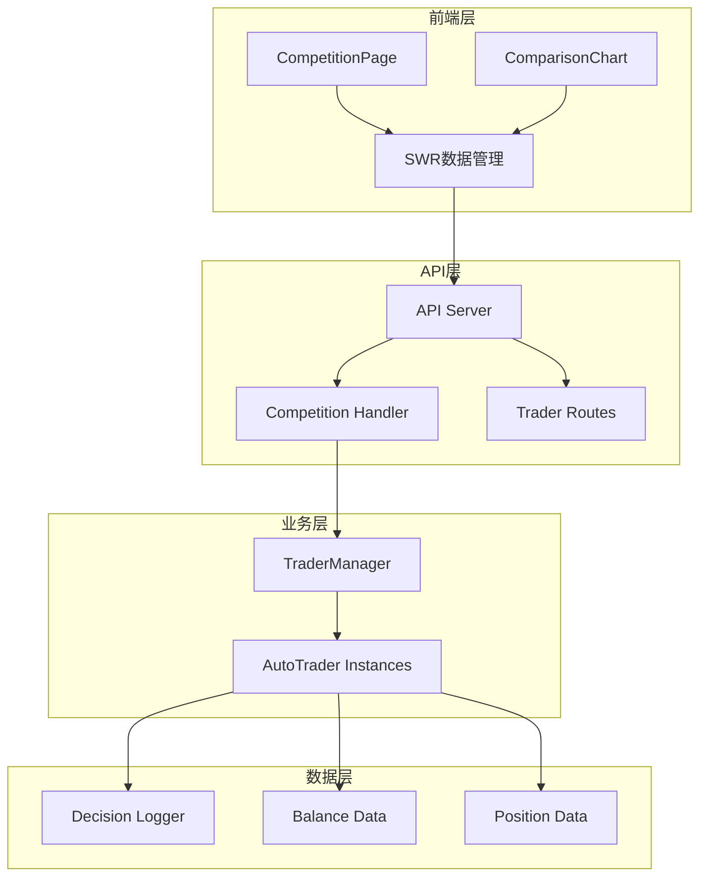
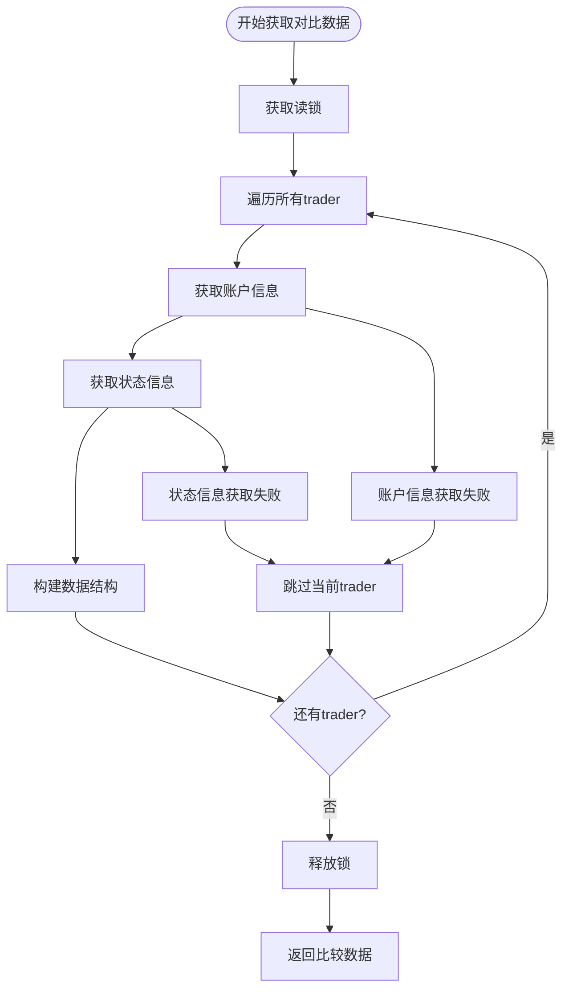
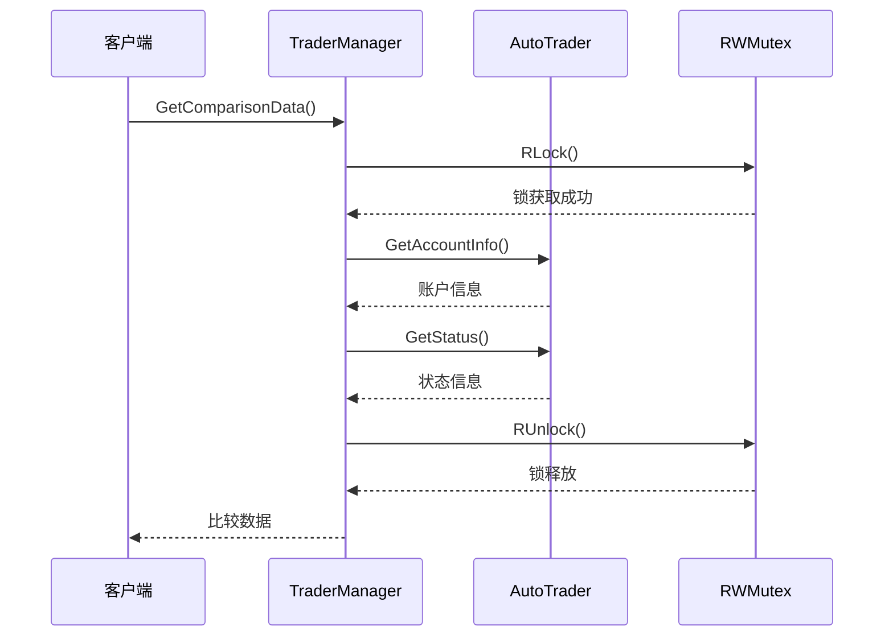
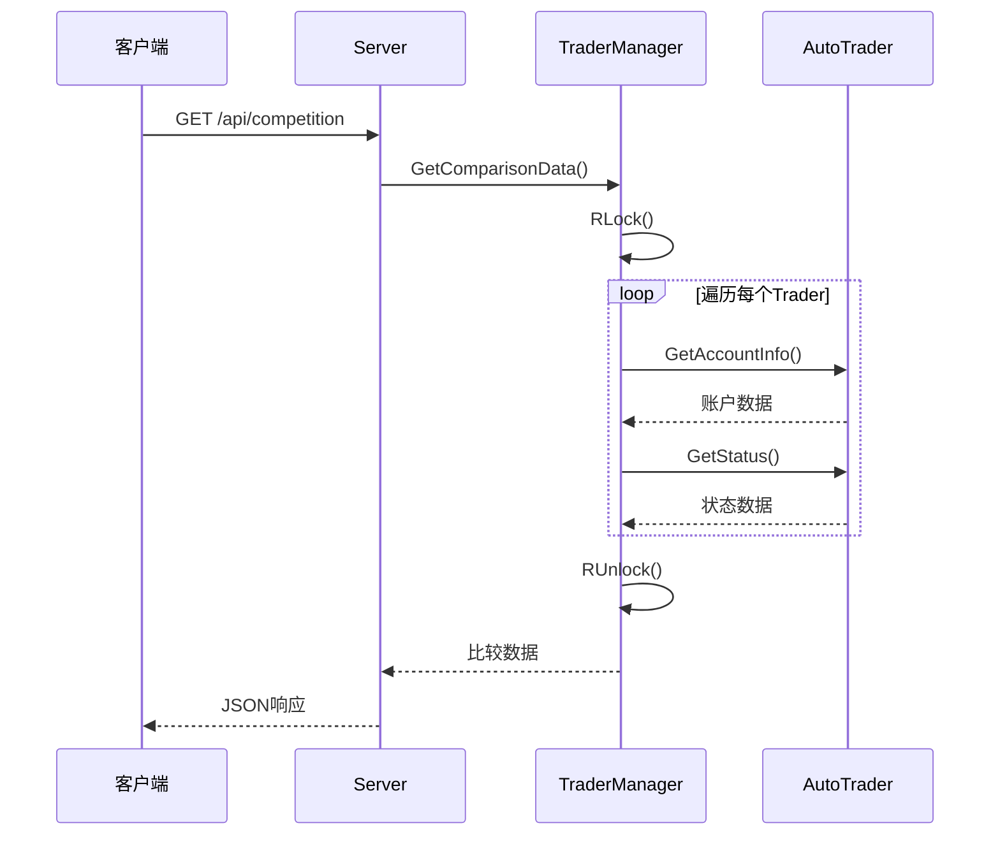
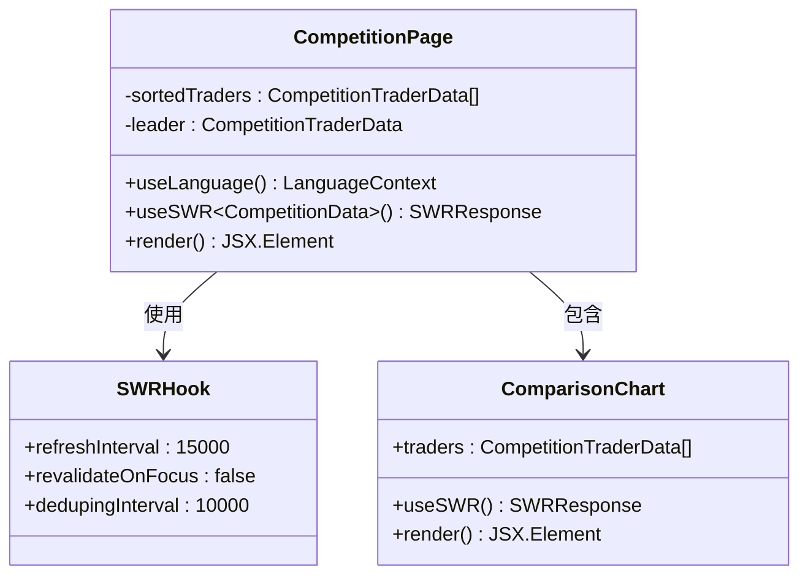
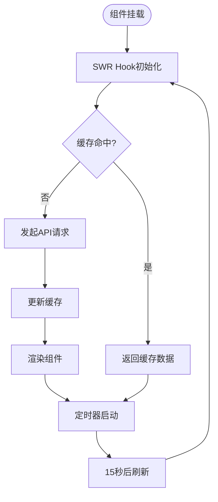
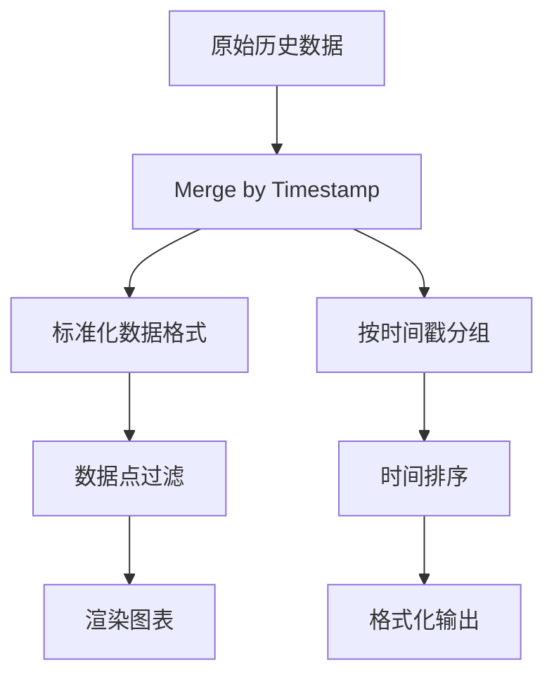
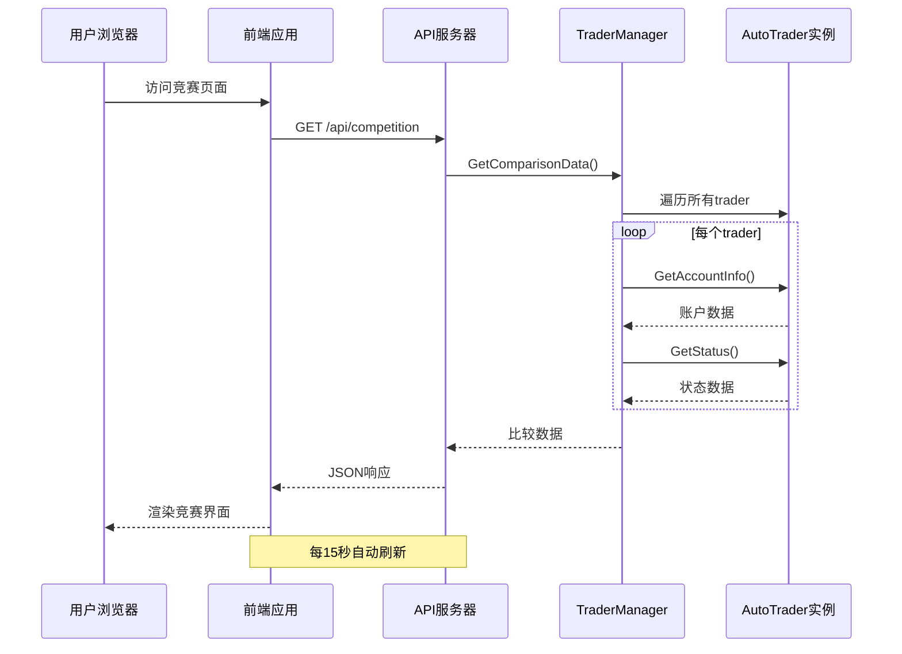
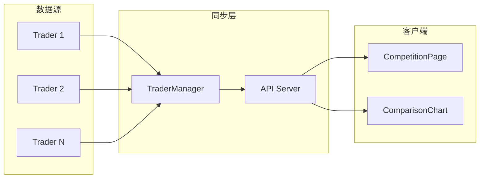

# AI交易性能实时对比

<cite>
**本文档引用的文件**
- [manager/trader_manager.go](file://manager/trader_manager.go)
- [api/server.go](file://api/server.go)
- [web/src/components/CompetitionPage.tsx](file://web/src/components/CompetitionPage.tsx)
- [web/src/components/ComparisonChart.tsx](file://web/src/components/ComparisonChart.tsx)
- [web/src/lib/api.ts](file://web/src/lib/api.ts)
- [web/src/types/index.ts](file://web/src/types/index.ts)
- [web/src/types.ts](file://web/src/types.ts)
- [trader/auto_trader.go](file://trader/auto_trader.go)
- [main.go](file://main.go)
</cite>

## 目录
1. [项目概述](#项目概述)
2. [系统架构](#系统架构)
3. [TraderManager核心功能](#tradermanager核心功能)
4. [API端点设计](#api端点设计)
5. [前端竞赛页面](#前端竞赛页面)
6. [数据流分析](#数据流分析)
7. [性能优化策略](#性能优化策略)
8. [实时更新机制](#实时更新机制)
9. [API响应示例](#api响应示例)
10. [故障排除指南](#故障排除指南)

## 项目概述

nofx项目是一个基于AI的多模型交易竞赛系统，支持同时运行多个AI交易模型进行实时性能对比。系统通过TraderManager聚合所有AutoTrader实例的状态信息，提供实时的竞赛排行榜和性能可视化功能。

### 核心特性
- **多AI模型并行运行**：支持DeepSeek、Qwen等不同AI模型的实时对比
- **实时性能监控**：提供账户净值、总盈亏、持仓数量等关键指标
- **可视化竞赛界面**：通过图表和排行榜展示AI交易表现
- **高频率数据更新**：每15秒刷新一次竞赛数据，每30秒刷新图表数据

## 系统架构



**图表来源**
- [api/server.go](file://api/server.go#L15-L60)
- [manager/trader_manager.go](file://manager/trader_manager.go#L15-L30)
- [web/src/components/CompetitionPage.tsx](file://web/src/components/CompetitionPage.tsx#L1-L20)

## TraderManager核心功能

### GetComparisonData方法详解

TraderManager的GetComparisonData方法是整个竞赛系统的核心，负责聚合所有AutoTrader实例的关键性能指标。



**图表来源**
- [manager/trader_manager.go](file://manager/trader_manager.go#L120-L150)

#### 关键指标收集

GetComparisonData方法收集以下核心指标：

| 指标名称 | 数据类型 | 描述 | 来源 |
|---------|---------|------|------|
| trader_id | string | Trader唯一标识符 | AutoTrader.GetID() |
| trader_name | string | Trader显示名称 | AutoTrader.GetName() |
| ai_model | string | AI模型名称 | AutoTrader.GetAIModel() |
| total_equity | float64 | 账户总净值 | GetAccountInfo()["total_equity"] |
| total_pnl | float64 | 总盈亏金额 | GetAccountInfo()["total_pnl"] |
| total_pnl_pct | float64 | 总盈亏百分比 | GetAccountInfo()["total_pnl_pct"] |
| position_count | int | 当前持仓数量 | GetAccountInfo()["position_count"] |
| margin_used_pct | float64 | 保证金使用率 | GetAccountInfo()["margin_used_pct"] |
| call_count | int | AI调用次数 | GetStatus()["call_count"] |
| is_running | bool | 是否正在运行 | GetStatus()["is_running"] |

**章节来源**
- [manager/trader_manager.go](file://manager/trader_manager.go#L120-L150)

### 线程安全机制

TraderManager采用读写锁确保多线程环境下的数据一致性：



**图表来源**
- [manager/trader_manager.go](file://manager/trader_manager.go#L120-L150)

## API端点设计

### /api/competition 竞赛总览

竞赛总览端点是系统的核心入口，提供所有Trader的实时性能数据。

#### 请求处理流程



**图表来源**
- [api/server.go](file://api/server.go#L100-L115)

#### 响应数据结构

API响应包含以下结构：

```typescript
interface CompetitionResponse {
  traders: CompetitionTraderData[];
  count: number;
}

interface CompetitionTraderData {
  trader_id: string;
  trader_name: string;
  ai_model: string;
  total_equity: number;
  total_pnl: number;
  total_pnl_pct: number;
  position_count: number;
  margin_used_pct: number;
  call_count: number;
  is_running: boolean;
}
```

**章节来源**
- [api/server.go](file://api/server.go#L100-L115)
- [web/src/types.ts](file://web/src/types.ts#L75-L95)

### 其他相关API端点

| 端点路径 | 方法 | 功能描述 | 更新频率 |
|---------|------|----------|----------|
| /api/competition | GET | 竞赛总览（所有trader对比） | 15秒 |
| /api/traders | GET | Trader列表 | 实时 |
| /api/status | GET | 指定trader状态 | 实时 |
| /api/account | GET | 指定trader账户信息 | 实时 |
| /api/equity-history | GET | 收益率历史数据 | 30秒 |

**章节来源**
- [api/server.go](file://api/server.go#L40-L65)

## 前端竞赛页面

### CompetitionPage组件架构

CompetitionPage是竞赛数据的主要展示组件，采用React Hooks和SWR库实现高效的数据管理和实时更新。



**图表来源**
- [web/src/components/CompetitionPage.tsx](file://web/src/components/CompetitionPage.tsx#L10-L20)
- [web/src/components/ComparisonChart.tsx](file://web/src/components/ComparisonChart.tsx#L15-L25)

### 数据获取和缓存策略

前端使用SWR库实现智能数据缓存和自动刷新：



**图表来源**
- [web/src/components/CompetitionPage.tsx](file://web/src/components/CompetitionPage.tsx#L10-L20)

### 排行榜排序逻辑

竞赛页面按照收益率百分比对所有Trader进行降序排序：

```typescript
// 排序算法实现
const sortedTraders = [...competition.traders].sort(
  (a, b) => b.total_pnl_pct - a.total_pnl_pct
);
```

**章节来源**
- [web/src/components/CompetitionPage.tsx](file://web/src/components/CompetitionPage.tsx#L40-L45)

### ComparisonChart组件

ComparisonChart组件负责绘制多AI模型的性能对比图表，支持实时数据更新和交互式查看。

#### 图表数据处理



**图表来源**
- [web/src/components/ComparisonChart.tsx](file://web/src/components/ComparisonChart.tsx#L50-L120)

#### 图表更新机制

ComparisonChart使用独立的SWR配置，每30秒刷新一次历史数据：

```typescript
const { data: allTraderHistories, isLoading } = useSWR(
  traders.length > 0 ? `all-equity-histories-${tradersKey}` : null,
  async () => {
    const promises = traders.map(trader =>
      api.getEquityHistory(trader.trader_id)
    );
    return Promise.all(promises);
  },
  {
    refreshInterval: 30000, // 30秒刷新
    revalidateOnFocus: false,
    dedupingInterval: 20000,
  }
);
```

**章节来源**
- [web/src/components/ComparisonChart.tsx](file://web/src/components/ComparisonChart.tsx#L25-L45)

## 数据流分析

### 完整的数据流向



**图表来源**
- [api/server.go](file://api/server.go#L100-L115)
- [manager/trader_manager.go](file://manager/trader_manager.go#L120-L150)

### 数据聚合过程

TraderManager的GetComparisonData方法实现了完整的数据聚合逻辑：

1. **并发数据收集**：同时从所有活跃的AutoTrader实例获取数据
2. **错误处理**：单个trader数据获取失败不影响整体结果
3. **数据标准化**：统一输出格式，便于前端处理
4. **性能优化**：使用读写锁确保线程安全的同时最小化锁持有时间

**章节来源**
- [manager/trader_manager.go](file://manager/trader_manager.go#L120-L150)

## 性能优化策略

### 前端优化

#### SWR缓存策略
- **智能刷新**：15秒竞速数据刷新，30秒图表数据刷新
- **焦点重验证**：禁用标签页切换时的自动刷新
- **去重间隔**：10秒内重复请求只发送一次

#### 数据处理优化
- **记忆化计算**：使用useMemo避免不必要的重新计算
- **数据点限制**：最多显示2000个数据点，防止内存溢出
- **增量更新**：只更新发生变化的数据部分

### 后端优化

#### 线程安全优化
- **读写分离**：使用RWMutex实现读操作并发，写操作互斥
- **锁粒度最小化**：只在必要时获取锁，尽快释放
- **非阻塞设计**：API请求不会阻塞trader的正常运行

#### 数据访问优化
- **批量操作**：一次性获取所有trader的数据
- **连接池复用**：数据库和外部API连接复用
- **缓存策略**：适当缓存静态配置和计算结果

**章节来源**
- [web/src/components/CompetitionPage.tsx](file://web/src/components/CompetitionPage.tsx#L10-L20)
- [manager/trader_manager.go](file://manager/trader_manager.go#L120-L150)

## 实时更新机制

### 更新频率配置

| 组件 | 刷新间隔 | 类型 | 说明 |
|------|----------|------|------|
| 竞赛页面 | 15秒 | 竞速数据 | 主要性能指标更新 |
| 对比图表 | 30秒 | 历史数据 | 收益率曲线更新 |
| 单个trader | 实时 | 状态数据 | 个别trader详情 |
| 系统健康 | 30秒 | 系统状态 | 整体系统状态 |

### 数据同步机制



**图表来源**
- [web/src/components/CompetitionPage.tsx](file://web/src/components/CompetitionPage.tsx#L10-L20)
- [web/src/components/ComparisonChart.tsx](file://web/src/components/ComparisonChart.tsx#L25-L45)

### 错误恢复机制

系统具备完善的错误处理和恢复能力：

1. **单点故障隔离**：某个trader数据获取失败不影响其他trader
2. **渐进式降级**：部分数据缺失时仍提供基本功能
3. **重试机制**：网络异常时自动重试
4. **状态指示**：明确显示trader的运行状态

**章节来源**
- [manager/trader_manager.go](file://manager/trader_manager.go#L120-L150)

## API响应示例

### 竞赛数据响应格式

```json
{
  "traders": [
    {
      "trader_id": "deepseek_trader",
      "trader_name": "DeepSeek交易员",
      "ai_model": "deepseek",
      "total_equity": 10500.25,
      "total_pnl": 500.25,
      "total_pnl_pct": 5.02,
      "position_count": 3,
      "margin_used_pct": 15.5,
      "call_count": 1250,
      "is_running": true
    },
    {
      "trader_id": "qwen_trader",
      "trader_name": "Qwen交易员", 
      "ai_model": "qwen",
      "total_equity": 10300.75,
      "total_pnl": 300.75,
      "total_pnl_pct": 3.01,
      "position_count": 2,
      "margin_used_pct": 12.8,
      "call_count": 1180,
      "is_running": true
    }
  ],
  "count": 2
}
```

### 账户信息响应格式

```json
{
  "total_equity": 10500.25,
  "available_balance": 8500.00,
  "total_pnl": 500.25,
  "total_pnl_pct": 5.02,
  "total_unrealized_pnl": 200.00,
  "margin_used": 2000.00,
  "margin_used_pct": 15.5,
  "position_count": 3,
  "initial_balance": 10000.00,
  "daily_pnl": 50.00
}
```

### 系统状态响应格式

```json
{
  "is_running": true,
  "start_time": "2024-01-15T09:00:00Z",
  "runtime_minutes": 1200,
  "call_count": 1250,
  "initial_balance": 10000.00,
  "scan_interval": "3m0s",
  "stop_until": "2024-01-15T12:00:00Z",
  "last_reset_time": "2024-01-15T10:00:00Z",
  "ai_provider": "deepseek"
}
```

**章节来源**
- [web/src/types.ts](file://web/src/types.ts#L75-L95)
- [web/src/types/index.ts](file://web/src/types/index.ts#L1-L30)

## 故障排除指南

### 常见问题及解决方案

#### 1. 竞赛数据为空或不完整

**症状**：竞赛页面显示空白或只有部分trader数据

**可能原因**：
- TraderManager中没有注册任何trader
- AutoTrader实例运行异常
- 数据获取超时

**解决步骤**：
1. 检查后端日志确认trader是否正确注册
2. 验证各个AutoTrader实例的运行状态
3. 检查网络连接和API可达性

#### 2. 前端数据更新延迟

**症状**：竞赛数据显示滞后，超过15秒未更新

**可能原因**：
- SWR缓存配置问题
- 浏览器标签页失去焦点
- 网络连接不稳定

**解决步骤**：
1. 检查浏览器开发者工具中的网络请求
2. 验证API响应时间和状态码
3. 检查浏览器的JavaScript控制台错误

#### 3. 图表数据加载失败

**症状**：对比图表显示"暂无历史数据"或加载动画

**可能原因**：
- 历史数据记录不足
- 数据格式转换错误
- 时间戳处理异常

**解决步骤**：
1. 检查AutoTrader的决策日志记录
2. 验证EquityPoint数据结构转换
3. 检查时间戳格式和时区处理

### 性能监控指标

| 指标名称 | 正常范围 | 异常阈值 | 监控方法 |
|---------|----------|----------|----------|
| API响应时间 | < 100ms | > 500ms | 浏览器Network面板 |
| 数据更新延迟 | < 15秒 | > 30秒 | 控制台日志 |
| 内存使用量 | < 500MB | > 1GB | 浏览器Task Manager |
| CPU使用率 | < 30% | > 70% | 浏览器Performance面板 |

### 调试工具和技巧

#### 前端调试
- 使用React Developer Tools检查组件状态
- 在浏览器控制台中直接调用api函数
- 使用Redux DevTools监控状态变化

#### 后端调试
- 查看Gin框架的日志输出
- 使用pprof分析性能瓶颈
- 监控goroutine数量和内存分配

**章节来源**
- [api/server.go](file://api/server.go#L100-L115)
- [web/src/components/CompetitionPage.tsx](file://web/src/components/CompetitionPage.tsx#L10-L20)

## 总结

nofx项目的AI交易性能实时对比系统展现了现代Web应用的最佳实践，通过精心设计的架构实现了高性能、高可用的多AI模型竞赛功能。系统的核心优势包括：

1. **高效的并发处理**：TraderManager采用读写锁确保线程安全，同时支持高并发数据访问
2. **智能的前端缓存**：使用SWR实现最优的数据缓存和自动刷新策略
3. **灵活的扩展性**：模块化设计支持新增AI模型和交易策略
4. **优秀的用户体验**：实时数据更新和直观的可视化展示

该系统为AI交易领域的研究和应用提供了强大的基础设施，展示了如何将复杂的分布式系统概念应用于实际的金融交易场景。