# 多AI模型交易竞赛机制深度解析

<cite>
**本文档引用的文件**
- [manager/trader_manager.go](file://manager/trader_manager.go)
- [trader/auto_trader.go](file://trader/auto_trader.go)
- [logger/decision_logger.go](file://logger/decision_logger.go)
- [decision/engine.go](file://decision/engine.go)
- [config/config.go](file://config/config.go)
- [api/server.go](file://api/server.go)
- [web/src/components/CompetitionPage.tsx](file://web/src/components/CompetitionPage.tsx)
- [web/src/types/index.ts](file://web/src/types/index.ts)
- [main.go](file://main.go)
- [mcp/client.go](file://mcp/client.go)
- [CUSTOM_API.md](file://CUSTOM_API.md)
</cite>

## 目录
1. [系统概述](#系统概述)
2. [核心架构设计](#核心架构设计)
3. [TraderManager多智能体管理](#tradermanager多智能体管理)
4. [AI模型配置与集成](#ai模型配置与集成)
5. [决策日志记录机制](#决策日志记录机制)
6. [实时竞赛监控系统](#实时竞赛监控系统)
7. [配置示例与最佳实践](#配置示例与最佳实践)
8. [性能分析与优化](#性能分析与优化)
9. [故障排除指南](#故障排除指南)
10. [总结](#总结)

## 系统概述

nofx项目是一个创新的多AI模型交易竞赛平台，支持多个AI智能体在同一市场环境中进行竞争性交易。系统采用模块化架构，通过TraderManager统一管理多个AutoTrader实例，每个实例可配置不同的AI模型（如Qwen、DeepSeek或自定义API），实现真正的多智能体并行竞赛。

### 核心特性

- **多AI模型并行竞赛**：支持Qwen、DeepSeek、Custom等多种AI模型同时参与
- **独立决策隔离**：每个AI拥有独立的日志目录和决策记录器
- **实时性能监控**：提供完整的竞赛数据对比和实时状态追踪
- **灵活配置管理**：支持多种交易平台和AI API的无缝集成
- **可视化竞赛界面**：基于React的Web界面提供直观的竞赛展示

## 核心架构设计

系统采用分层架构设计，确保各组件职责清晰、耦合度低。

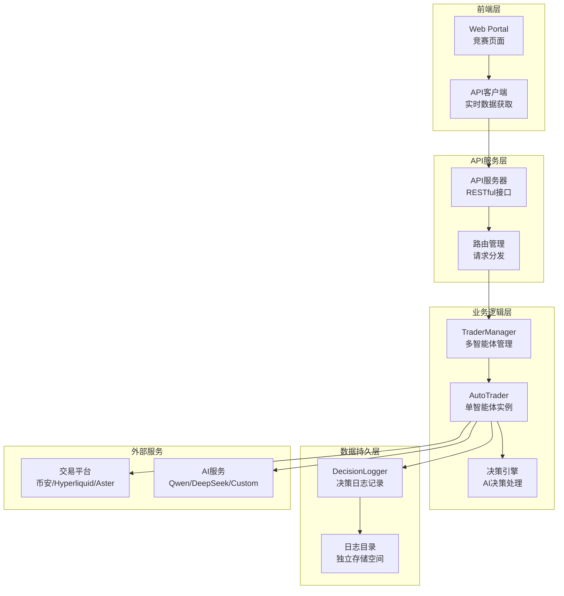

**架构图来源**
- [manager/trader_manager.go](file://manager/trader_manager.go#L1-L173)
- [api/server.go](file://api/server.go#L1-L424)
- [trader/auto_trader.go](file://trader/auto_trader.go#L1-L936)

**章节来源**
- [manager/trader_manager.go](file://manager/trader_manager.go#L1-L50)
- [api/server.go](file://api/server.go#L15-L40)

## TraderManager多智能体管理

TraderManager是系统的核心控制器，负责统一管理多个AutoTrader实例，实现多智能体的协调运行。

### 管理器设计原理

```mermaid
classDiagram
class TraderManager {
+map[string]*AutoTrader traders
+sync.RWMutex mu
+NewTraderManager() *TraderManager
+AddTrader(cfg, coinPoolURL, ...) error
+GetTrader(id string) *AutoTrader
+GetAllTraders() map[string]*AutoTrader
+GetTraderIDs() []string
+StartAll() void
+StopAll() void
+GetComparisonData() map[string]interface{}
}
class AutoTrader {
+string id
+string name
+string aiModel
+AutoTraderConfig config
+DecisionLogger decisionLogger
+bool isRunning
+Run() error
+Stop() void
+GetStatus() map[string]interface{}
+GetAccountInfo() map[string]interface{}
}
class AutoTraderConfig {
+string ID
+string Name
+string AIModel
+string Exchange
+float64 InitialBalance
+time.Duration ScanInterval
}
TraderManager --> AutoTrader : "管理多个实例"
AutoTrader --> AutoTraderConfig : "使用配置"
AutoTrader --> DecisionLogger : "记录决策"
```

**类图来源**
- [manager/trader_manager.go](file://manager/trader_manager.go#L10-L25)
- [trader/auto_trader.go](file://trader/auto_trader.go#L25-L85)
- [config/config.go](file://config/config.go#L10-L50)

### 多智能体生命周期管理

系统通过TraderManager实现了完整的多智能体生命周期管理：

1. **智能体注册**：通过`AddTrader`方法添加新的AI实例
2. **并发运行**：使用goroutine实现智能体的并行执行
3. **状态监控**：提供实时的状态查询和性能分析
4. **优雅关闭**：支持所有智能体的同步停止

### 实时竞赛数据聚合

TraderManager提供了`GetComparisonData`方法，用于获取所有智能体的竞赛数据：

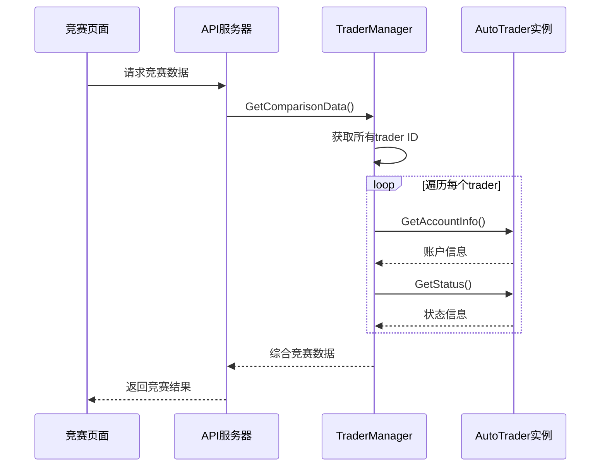

**序列图来源**
- [manager/trader_manager.go](file://manager/trader_manager.go#L120-L170)
- [api/server.go](file://api/server.go#L85-L100)

**章节来源**
- [manager/trader_manager.go](file://manager/trader_manager.go#L25-L173)
- [api/server.go](file://api/server.go#L85-L110)

## AI模型配置与集成

系统支持三种主要的AI模型配置方式，每种都有其独特的特点和适用场景。

### 支持的AI模型类型

| AI模型 | 提供商 | 特点 | 适用场景 |
|--------|--------|------|----------|
| Qwen | 阿里云 | 中文优化、稳定可靠 | 中文市场分析、稳健交易 |
| DeepSeek | 深度求索 | 高性价比、快速响应 | 快速决策、高频交易 |
| Custom | 自定义 | 灵活扩展、支持本地部署 | 特殊需求、隐私保护 |

### AI模型初始化流程

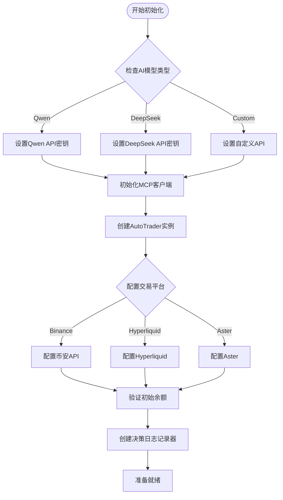

**流程图来源**
- [trader/auto_trader.go](file://trader/auto_trader.go#L100-L200)
- [mcp/client.go](file://mcp/client.go#L40-L120)

### 自定义API集成

系统提供了强大的自定义API支持，允许集成任何符合OpenAI格式的AI服务：

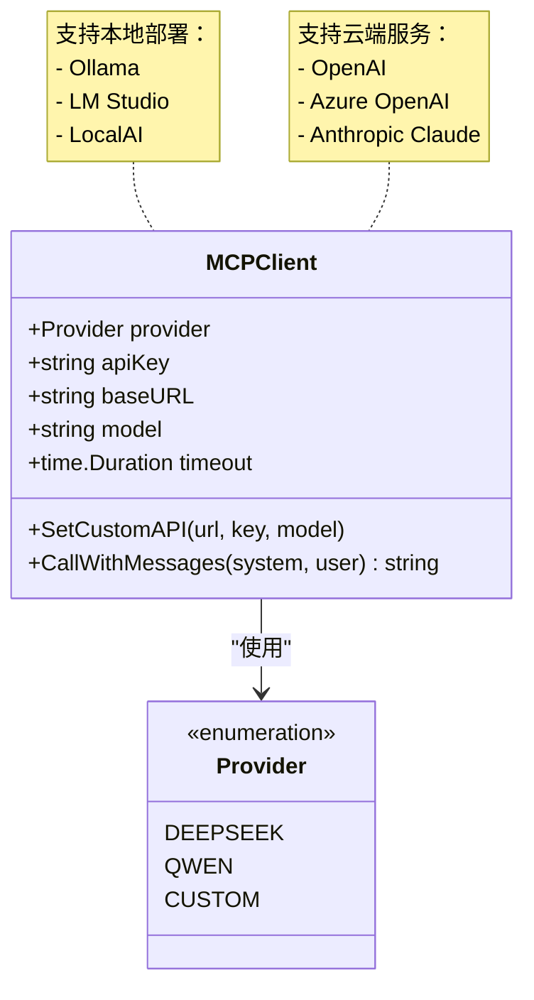

**类图来源**
- [mcp/client.go](file://mcp/client.go#L10-L30)

**章节来源**
- [trader/auto_trader.go](file://trader/auto_trader.go#L100-L250)
- [mcp/client.go](file://mcp/client.go#L1-L205)

## 决策日志记录机制

每个AI智能体都配备了独立的决策日志记录器，确保决策过程的完整性和可追溯性。

### 日志目录映射关系

系统通过Trader ID与日志目录建立一一对应的关系：

```mermaid
graph LR
subgraph "日志目录结构"
ROOT[decision_logs/]
ROOT --> TRADER1[qwen_trader/]
ROOT --> TRADER2[deepseek_trader/]
ROOT --> TRADER3[custom_ai/]
TRADER1 --> LOG1[decision_20241201_143022_cycle1.json]
TRADER1 --> LOG2[decision_20241201_143322_cycle2.json]
TRADER2 --> LOG3[decision_20241201_143022_cycle1.json]
TRADER2 --> LOG4[decision_20241201_143322_cycle2.json]
end
subgraph "决策记录内容"
RECORD[DecisionRecord]
RECORD --> ACCOUNT[AccountSnapshot]
RECORD --> POSITIONS[PositionSnapshot[]]
RECORD --> ACTIONS[DecisionAction[]]
RECORD --> PROMPT[InputPrompt]
RECORD --> COT[CoTTrace]
end
```

**架构图来源**
- [logger/decision_logger.go](file://logger/decision_logger.go#L70-L120)
- [trader/auto_trader.go](file://trader/auto_trader.go#L150-L170)

### 决策记录数据结构

每个决策记录包含了完整的交易决策信息：

| 字段类别 | 主要字段 | 数据类型 | 描述 |
|----------|----------|----------|------|
| 时间信息 | Timestamp, CycleNumber | 时间戳, 整数 | 决策时间和周期编号 |
| 输入信息 | InputPrompt, CoTTrace | 字符串 | AI输入提示和思维链分析 |
| 账户快照 | TotalBalance, AvailableBalance, PositionCount | 浮点数, 整数 | 决策时刻的账户状态 |
| 持仓快照 | Symbol, Side, Quantity, EntryPrice | 字符串, 字符串, 浮点数, 浮点数 | 当前持仓详情 |
| 决策动作 | Action, Symbol, Leverage, Price | 字符串, 字符串, 整数, 浮点数 | 具体的交易决策 |
| 执行结果 | Success, ErrorMessage, ExecutionLog | 布尔值, 字符串, 字符串切片 | 决策执行状态和日志 |

### 决策日志分析功能

决策日志记录器提供了丰富的分析功能：

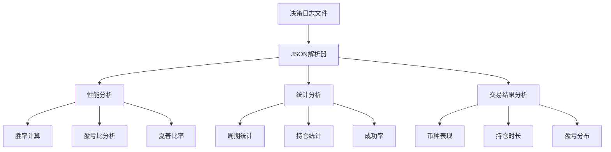

**流程图来源**
- [logger/decision_logger.go](file://logger/decision_logger.go#L330-L450)

**章节来源**
- [logger/decision_logger.go](file://logger/decision_logger.go#L70-L200)
- [trader/auto_trader.go](file://trader/auto_trader.go#L150-L200)

## 实时竞赛监控系统

系统提供了完整的实时竞赛监控能力，支持前端界面的实时数据展示。

### API接口设计

系统通过RESTful API提供竞赛相关的数据访问：

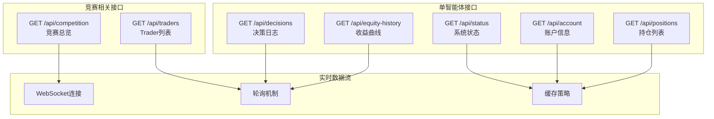

**架构图来源**
- [api/server.go](file://api/server.go#L40-L80)

### 竞赛数据结构

竞赛系统返回的综合数据结构包含了所有必要的竞赛信息：

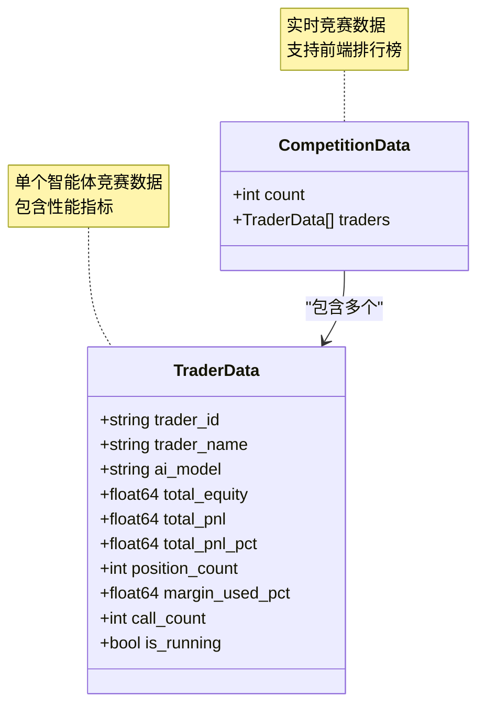

**类图来源**
- [web/src/types/index.ts](file://web/src/types/index.ts#L1-L50)

### 前端竞赛界面

竞赛页面提供了直观的实时竞赛展示：

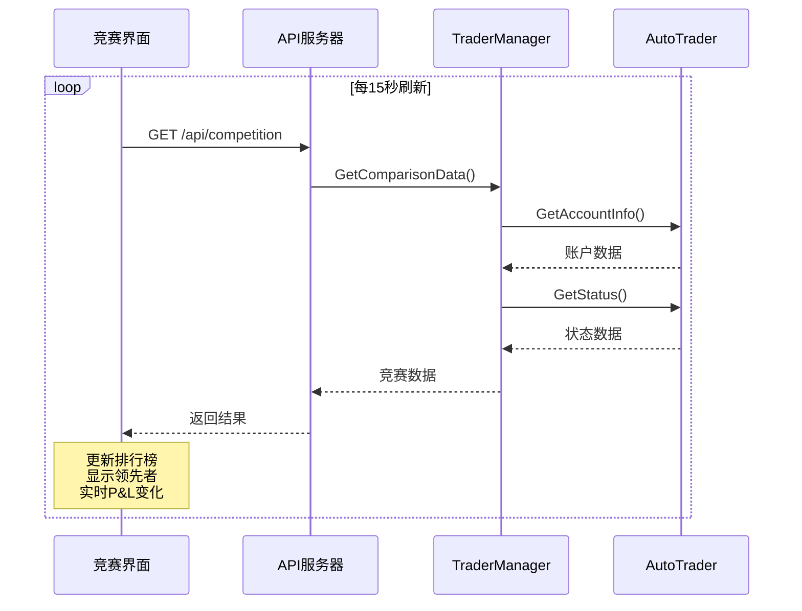

**序列图来源**
- [web/src/components/CompetitionPage.tsx](file://web/src/components/CompetitionPage.tsx#L10-L30)

**章节来源**
- [api/server.go](file://api/server.go#L85-L110)
- [web/src/components/CompetitionPage.tsx](file://web/src/components/CompetitionPage.tsx#L1-L254)

## 配置示例与最佳实践

以下是配置多AI竞赛的完整示例，展示了如何设置不同AI模型的Trader实例。

### 基础配置模板

```json
{
  "traders": [
    {
      "id": "qwen_trader",
      "name": "Qwen智能交易员",
      "enabled": true,
      "ai_model": "qwen",
      "exchange": "binance",
      "binance_api_key": "YOUR_BINANCE_API_KEY",
      "binance_secret_key": "YOUR_BINANCE_SECRET_KEY",
      "qwen_key": "sk-your-qwen-key",
      "initial_balance": 10000,
      "scan_interval_minutes": 3
    },
    {
      "id": "deepseek_trader",
      "name": "DeepSeek交易员",
      "enabled": true,
      "ai_model": "deepseek",
      "exchange": "binance",
      "binance_api_key": "YOUR_BINANCE_API_KEY",
      "binance_secret_key": "YOUR_BINANCE_SECRET_KEY",
      "deepseek_key": "sk-your-deepseek-key",
      "initial_balance": 10000,
      "scan_interval_minutes": 3
    },
    {
      "id": "custom_trader",
      "name": "自定义AI交易员",
      "enabled": true,
      "ai_model": "custom",
      "exchange": "hyperliquid",
      "hyperliquid_private_key": "YOUR_PRIVATE_KEY",
      "hyperliquid_wallet_addr": "YOUR_WALLET_ADDRESS",
      "hyperliquid_testnet": false,
      "custom_api_url": "https://api.openai.com/v1",
      "custom_api_key": "sk-your-custom-key",
      "custom_model_name": "gpt-4o",
      "initial_balance": 10000,
      "scan_interval_minutes": 3
    }
  ],
  "leverage": {
    "btc_eth_leverage": 10,
    "altcoin_leverage": 5
  },
  "max_daily_loss": 0.05,
  "max_drawdown": 0.1,
  "stop_trading_minutes": 30,
  "api_server_port": 8080
}
```

### 高级配置选项

#### 杠杆配置优化

```json
{
  "leverage": {
    "btc_eth_leverage": 20,  // BTC/ETH使用较高杠杆
    "altcoin_leverage": 10   // 山寨币使用中等杠杆
  }
}
```

#### 风险控制参数

```json
{
  "max_daily_loss": 0.03,      // 每日最大亏损3%
  "max_drawdown": 0.08,        // 最大回撤8%
  "stop_trading_minutes": 60   // 触发风控后暂停60分钟
}
```

### 自定义API配置示例

#### 本地Ollama部署

```json
{
  "ai_model": "custom",
  "custom_api_url": "http://localhost:11434/v1",
  "custom_api_key": "ollama",
  "custom_model_name": "llama3.1:70b"
}
```

#### Azure OpenAI配置

```json
{
  "ai_model": "custom",
  "custom_api_url": "https://your-resource.openai.azure.com/openai/deployments/your-deployment",
  "custom_api_key": "your-azure-api-key",
  "custom_model_name": "gpt-4"
}
```

### 配置验证与最佳实践

1. **API密钥验证**：确保所有必需的API密钥都正确配置
2. **初始余额设置**：为每个Trader设置合理的初始资金
3. **扫描间隔优化**：根据市场波动性调整扫描频率
4. **杠杆倍数控制**：根据风险承受能力设置合适的杠杆
5. **交易平台选择**：根据AI模型特点选择最适合的交易平台

**章节来源**
- [config/config.go](file://config/config.go#L1-L202)
- [main.go](file://main.go#L50-L100)
- [CUSTOM_API.md](file://CUSTOM_API.md#L70-L160)

## 性能分析与优化

系统内置了完善的性能分析机制，帮助用户深入了解各个AI模型的表现。

### 性能指标体系

```mermaid
graph TB
subgraph "核心性能指标"
SHARPE[夏普比率<br/>风险调整收益]
WIN_RATE[胜率<br/>盈利交易比例]
PROFIT_FACTOR[盈亏比<br/>平均盈利/平均亏损]
MAX_DRAWDOWN[最大回撤<br/>账户最大跌幅]
end
subgraph "交易效率指标"
TRADE_FREQ[交易频率<br/>每小时交易次数]
AVG_HOLD_TIME[平均持仓时长<br/>持仓时间分布]
POSITION_SIZE[仓位规模<br/>单笔交易金额]
LEVERAGE_USAGE[杠杆使用率<br/>杠杆效率]
end
subgraph "风险控制指标"
DAILY_LOSS[日亏损<br/>每日最大亏损]
STOP_LOSS_RATE[止损率<br/>触发止损的比例]
CONSISTENCY[一致性<br/>收益稳定性]
VOLATILITY[波动率<br/>收益波动程度]
end
SHARPE --> WIN_RATE
WIN_RATE --> PROFIT_FACTOR
PROFIT_FACTOR --> MAX_DRAWDOWN
TRADE_FREQ --> AVG_HOLD_TIME
AVG_HOLD_TIME --> POSITION_SIZE
POSITION_SIZE --> LEVERAGE_USAGE
DAILY_LOSS --> STOP_LOSS_RATE
STOP_LOSS_RATE --> CONSISTENCY
CONSISTENCY --> VOLATILITY
```

**架构图来源**
- [logger/decision_logger.go](file://logger/decision_logger.go#L330-L400)

### 性能分析算法

系统使用复杂的算法来计算各项性能指标：

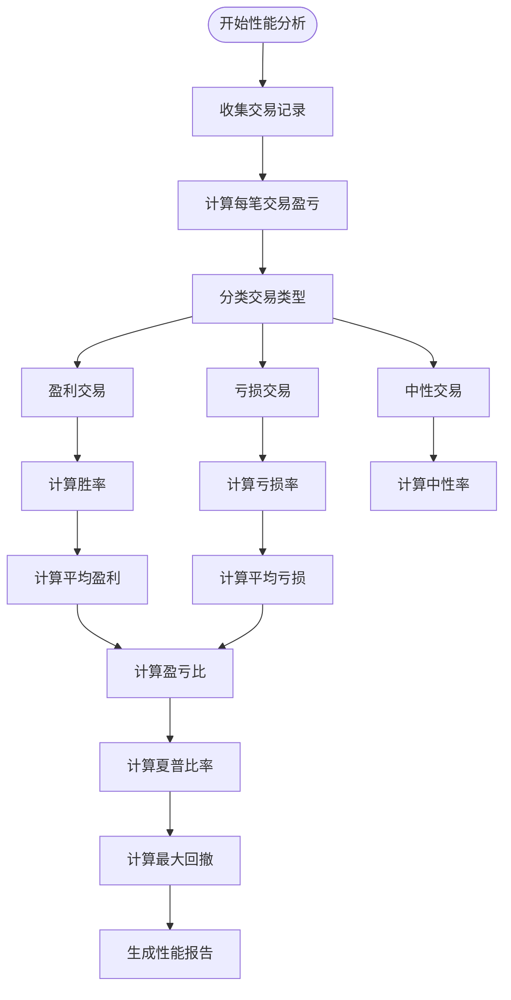

**流程图来源**
- [logger/decision_logger.go](file://logger/decision_logger.go#L330-L500)

### 优化建议与策略

基于性能分析结果，系统可以提供针对性的优化建议：

1. **夏普比率优化**：
   - 降低交易频率以减少手续费成本
   - 提高信号质量以获得更好的风险回报比
   - 优化仓位管理以提高资金使用效率

2. **胜率提升策略**：
   - 提高信号确认标准
   - 增加技术指标验证
   - 优化入场时机选择

3. **风险控制改进**：
   - 调整止损止盈水平
   - 优化仓位大小计算
   - 加强市场环境判断

**章节来源**
- [logger/decision_logger.go](file://logger/decision_logger.go#L330-L612)

## 故障排除指南

在使用多AI模型交易竞赛系统时，可能遇到的各种问题及解决方案。

### 常见问题诊断

#### 1. AI模型连接问题

**症状**：AI API调用失败，返回网络错误
**排查步骤**：
- 检查API密钥是否正确配置
- 验证网络连接和防火墙设置
- 确认AI服务的可用性状态
- 检查请求超时设置

**解决方案**：
```json
{
  "timeout": 120,
  "retry_attempts": 3
}
```

#### 2. 日志记录异常

**症状**：决策日志无法保存或格式错误
**排查步骤**：
- 检查日志目录权限
- 验证磁盘空间是否充足
- 确认JSON序列化是否正确
- 检查文件命名冲突

#### 3. 多智能体冲突

**症状**：多个Trader实例相互干扰
**排查步骤**：
- 确认Trader ID的唯一性
- 检查共享资源的竞争条件
- 验证并发访问的安全性
- 监控内存和CPU使用情况

### 性能优化建议

#### 1. 系统资源优化

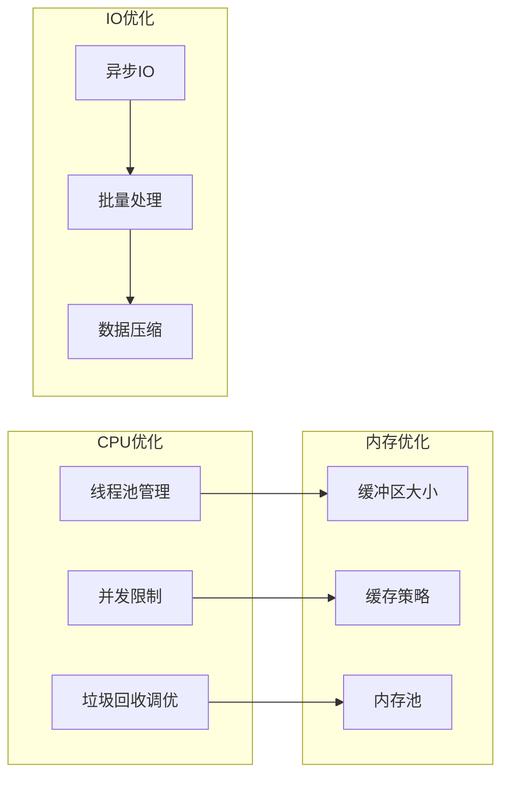

#### 2. 网络性能优化

- **连接池管理**：复用HTTP连接减少握手开销
- **请求批处理**：合并多个小请求为批量请求
- **压缩传输**：启用gzip压缩减少网络传输
- **超时配置**：合理设置请求超时时间

#### 3. 存储性能优化

- **日志轮转**：定期清理旧日志文件
- **索引优化**：为频繁查询的字段建立索引
- **分区策略**：按时间或Trader ID分区存储
- **备份策略**：制定合理的数据备份计划

### 监控与告警

建立完善的监控体系：

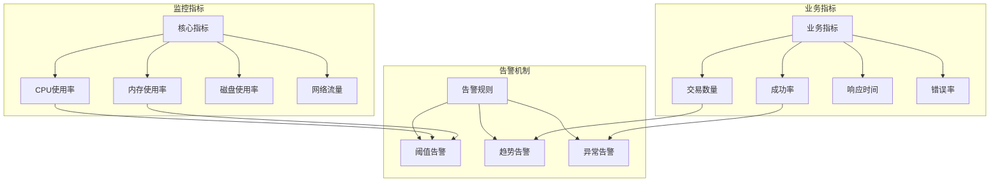

**章节来源**
- [mcp/client.go](file://mcp/client.go#L60-L120)
- [logger/decision_logger.go](file://logger/decision_logger.go#L150-L200)

## 总结

nofx项目的多AI模型交易竞赛机制代表了人工智能在金融交易领域的创新应用。通过TraderManager的统一管理、AutoTrader的独立运行、DecisionLogger的完整记录，以及实时竞赛监控系统的支持，系统实现了真正意义上的多智能体并行竞赛。

### 系统优势

1. **高度模块化**：各组件职责明确，易于维护和扩展
2. **灵活配置**：支持多种AI模型和交易平台的无缝集成
3. **完整记录**：提供详细的决策过程和性能分析
4. **实时监控**：支持竞赛数据的实时展示和分析
5. **易于使用**：提供直观的Web界面和RESTful API

### 技术特色

- **并发设计**：利用Go语言的goroutine实现高效的并行处理
- **数据隔离**：通过独立的日志目录确保各AI的决策过程相互独立
- **标准化接口**：统一的API设计便于第三方集成和扩展
- **智能分析**：内置的性能分析算法帮助用户优化交易策略

### 应用前景

该系统不仅适用于学术研究和教育场景，也可以应用于实际的量化交易策略开发和测试。通过多AI模型的对比竞争，投资者可以更好地了解不同AI策略的特点和适用场景，从而做出更明智的投资决策。

随着人工智能技术的不断发展，这种多智能体竞赛模式有望成为未来量化交易领域的重要发展方向，为金融市场带来更多创新和活力。