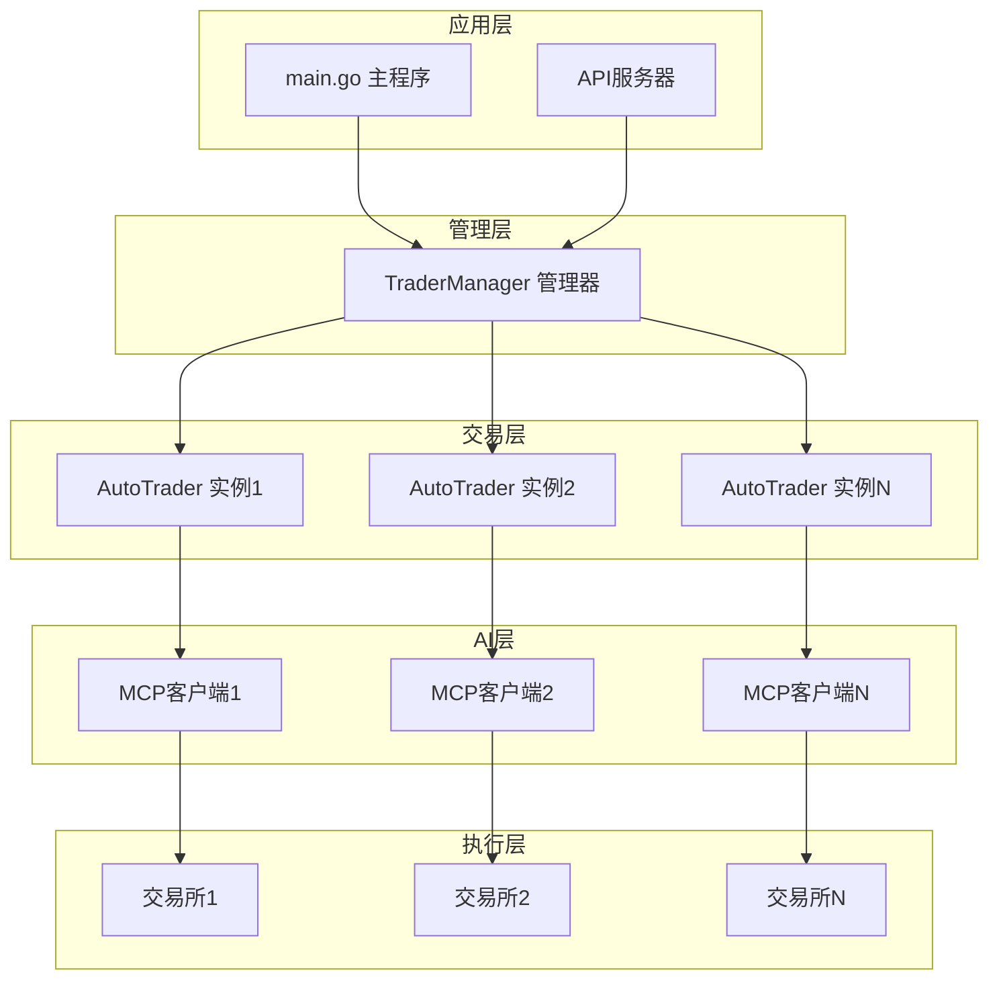
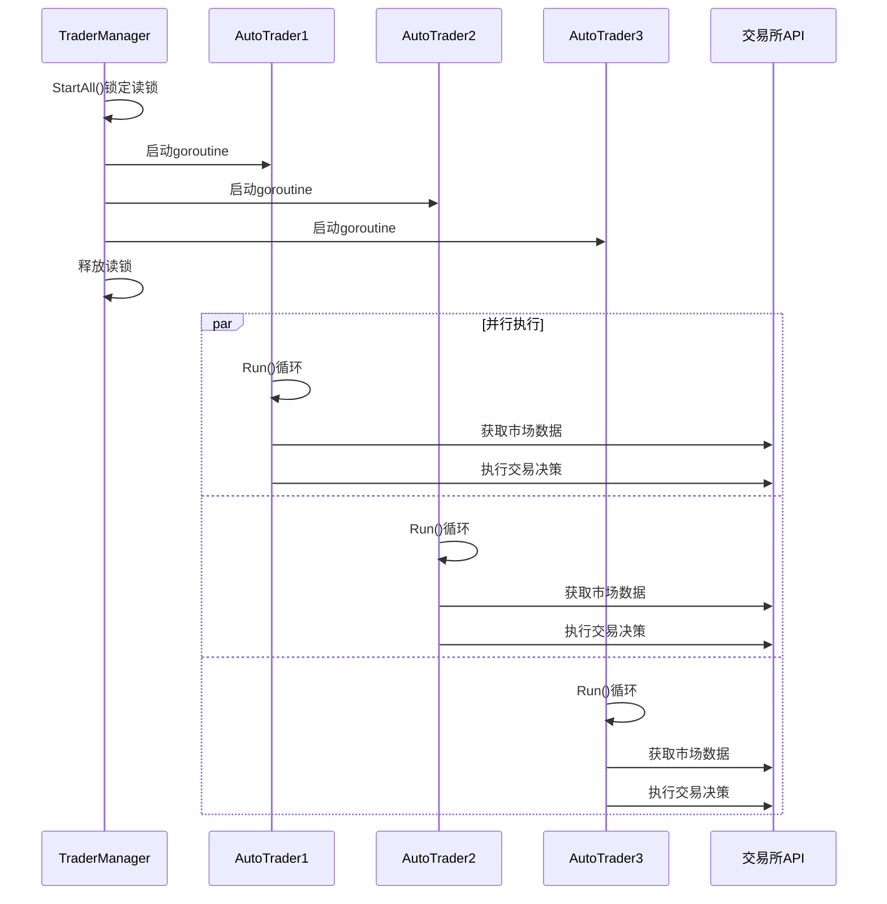
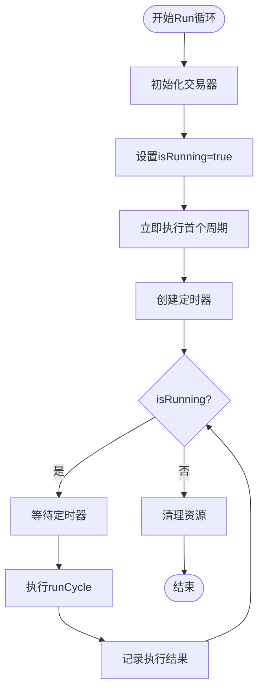
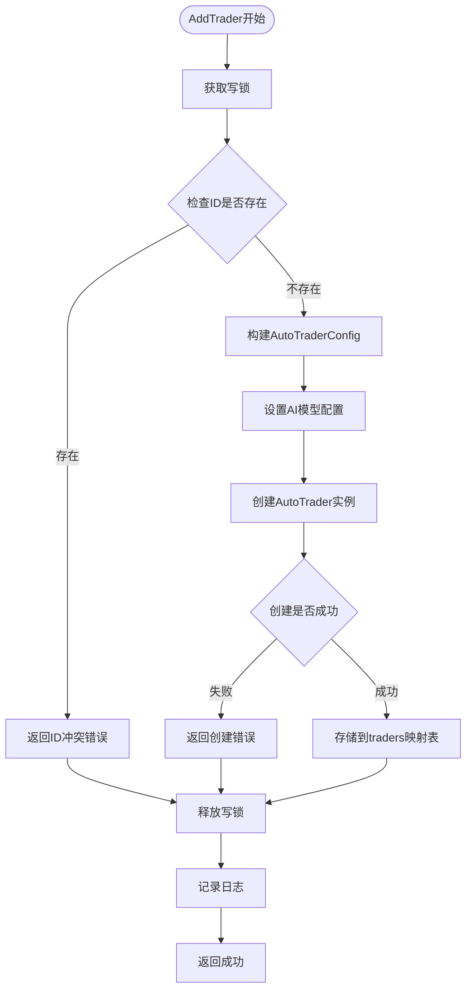
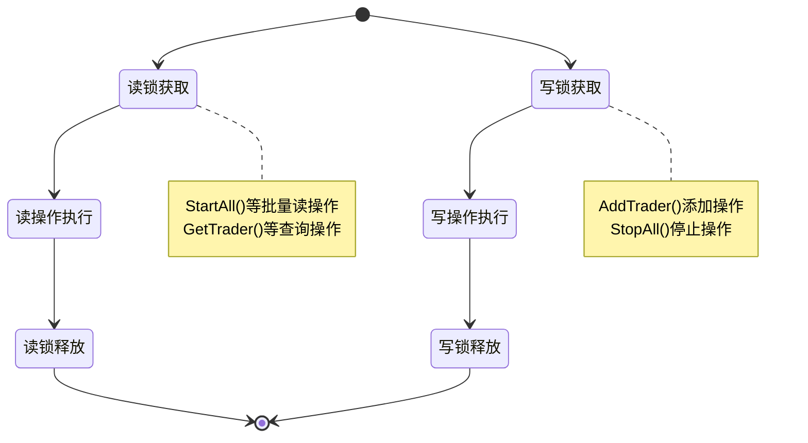
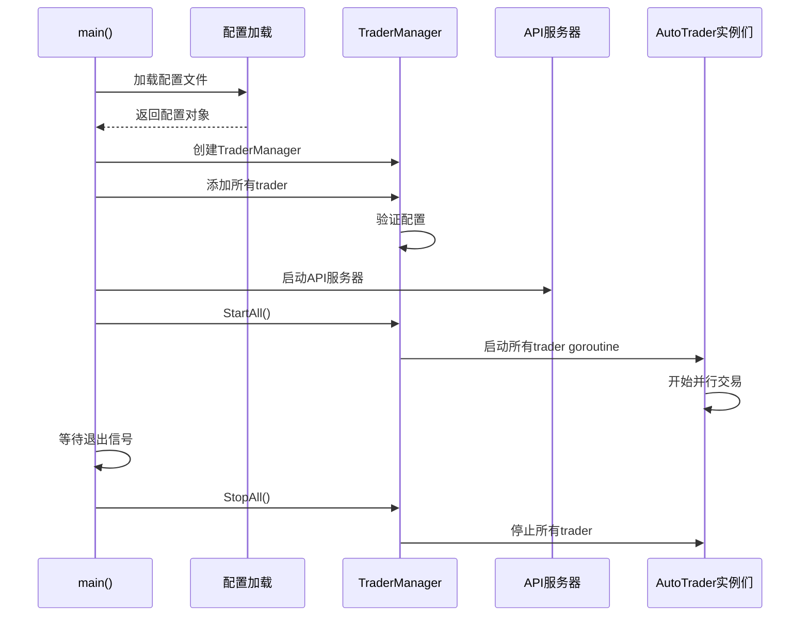

# 多AI模型并行运行机制

<cite>
**本文档引用的文件**
- [manager/trader_manager.go](file://manager/trader_manager.go)
- [trader/auto_trader.go](file://trader/auto_trader.go)
- [trader/interface.go](file://trader/interface.go)
- [main.go](file://main.go)
- [config/config.go](file://config/config.go)
- [api/server.go](file://api/server.go)
</cite>

## 目录
1. [引言](#引言)
2. [系统架构概览](#系统架构概览)
3. [TraderManager核心组件](#tradermanager核心组件)
4. [AutoTrader并行运行机制](#autotrader并行运行机制)
5. [多AI模型配置与管理](#多ai模型配置与管理)
6. [并发安全机制](#并发安全机制)
7. [启动与运行流程](#启动与运行流程)
8. [性能优化与监控](#性能优化与监控)
9. [故障排除指南](#故障排除指南)
10. [总结](#总结)

## 引言

nofx项目是一个创新的AI驱动交易操作系统，实现了多个AI模型在同一平台上并行运行的复杂架构。该系统通过TraderManager管理器协调多个AutoTrader实例，每个实例独立运行在自己的goroutine中，实现真正的并行决策与交易执行。这种设计不仅提高了系统的并发处理能力，还为不同AI模型提供了公平的竞争环境。

## 系统架构概览

nofx采用分层架构设计，核心组件包括：



**图表来源**
- [main.go](file://main.go#L1-L140)
- [manager/trader_manager.go](file://manager/trader_manager.go#L12-L173)

## TraderManager核心组件

### 数据结构设计

TraderManager是整个系统的核心管理器，负责协调多个AutoTrader实例的生命周期：

```mermaid
classDiagram
class TraderManager {
+map[string]*AutoTrader traders
+sync.RWMutex mu
+NewTraderManager() *TraderManager
+AddTrader(cfg, coinPoolURL, ...) error
+GetTrader(id string) *AutoTrader
+GetAllTraders() map[string]*AutoTrader
+GetTraderIDs() []string
+StartAll()
+StopAll()
+GetComparisonData() map[string]interface{}
}
class AutoTrader {
+string id
+string name
+string aiModel
+string exchange
+AutoTraderConfig config
+Trader trader
+Run() error
+Stop()
+GetStatus() map[string]interface{}
}
TraderManager --> AutoTrader : "管理多个实例"
```

**图表来源**
- [manager/trader_manager.go](file://manager/trader_manager.go#L12-L173)
- [trader/auto_trader.go](file://trader/auto_trader.go#L68-L85)

### 核心功能特性

TraderManager提供了以下关键功能：

1. **traders映射表**：使用字符串ID作为键，AutoTrader实例作为值的map结构
2. **并发安全访问**：通过sync.RWMutex保护对traders映射表的并发访问
3. **动态实例管理**：支持运行时添加、删除和查询AutoTrader实例
4. **批量操作支持**：提供StartAll和StopAll等批量控制方法

**章节来源**
- [manager/trader_manager.go](file://manager/trader_manager.go#L12-L173)

## AutoTrader并行运行机制

### Goroutine并行执行

每个AutoTrader实例都在独立的goroutine中运行，实现真正的并行决策：



**图表来源**
- [manager/trader_manager.go](file://manager/trader_manager.go#L95-L108)
- [trader/auto_trader.go](file://trader/auto_trader.go#L200-L220)

### Run方法执行流程

AutoTrader的Run方法实现了完整的交易循环：



**图表来源**
- [trader/auto_trader.go](file://trader/auto_trader.go#L200-L220)

**章节来源**
- [trader/auto_trader.go](file://trader/auto_trader.go#L200-L220)

## 多AI模型配置与管理

### AI模型类型支持

系统支持三种AI模型类型，通过配置灵活切换：

| AI模型 | 配置方式 | API提供商 | 特点 |
|--------|----------|-----------|------|
| Qwen | `UseQwen: true` 或 `AIModel: "qwen"` | 阿里云通义千问 | 中文优化，本地化优势 |
| DeepSeek | 默认配置 | DeepSeek | 英文优化，响应快速 |
| Custom | `AIModel: "custom"` | 自定义API | 支持任意OpenAI格式API |

### AddTrader方法实现

AddTrader方法负责根据配置创建不同类型的AI交易机器人：



**图表来源**
- [manager/trader_manager.go](file://manager/trader_manager.go#L25-L75)

### 配置参数详解

AutoTraderConfig包含了丰富的配置选项：

| 参数类别 | 关键参数 | 描述 | 示例值 |
|----------|----------|------|--------|
| 基础配置 | ID, Name | 交易器唯一标识和显示名称 | `"qwen_trader"`, `"Qwen AI"` |
| AI配置 | AIModel, UseQwen | AI模型类型选择 | `"qwen"`, `true` |
| 交易平台 | Exchange | 支持的交易所 | `"binance"`, `"hyperliquid"` |
| API密钥 | BinanceAPIKey等 | 各平台API认证信息 | `"your_api_key"` |
| 风险控制 | InitialBalance, MaxDailyLoss | 初始资金和风险限制 | `1000.0`, `0.05` |
| 杠杆配置 | BTCETHLeverage, AltcoinLeverage | 不同资产类别的杠杆倍数 | `5`, `10` |

**章节来源**
- [manager/trader_manager.go](file://manager/trader_manager.go#L25-L75)
- [config/config.go](file://config/config.go#L10-L50)

## 并发安全机制

### sync.RWMutex并发控制

系统使用sync.RWMutex确保对traders映射表的安全访问：



### 锁策略设计

1. **读操作使用读锁**：
   - StartAll()：遍历所有trader启动
   - GetTrader()：获取特定trader
   - GetAllTraders()：获取所有trader列表

2. **写操作使用写锁**：
   - AddTrader()：添加新的trader实例
   - StopAll()：停止所有trader

3. **并发安全性保证**：
   - 读操作可以同时进行
   - 写操作独占访问
   - 避免竞态条件

**章节来源**
- [manager/trader_manager.go](file://manager/trader_manager.go#L95-L108)

## 启动与运行流程

### 系统启动序列



**图表来源**
- [main.go](file://main.go#L25-L140)
- [manager/trader_manager.go](file://manager/trader_manager.go#L95-L108)

### StartAll方法实现

StartAll方法展示了多AI并行竞赛的运行时环境：

```mermaid
flowchart TD
Start([StartAll开始]) --> ReadLock[获取读锁]
ReadLock --> LogStart[记录启动日志]
LogStart --> IterateTraders[遍历traders映射表]
IterateTraders --> CreateGoroutine[为每个trader创建goroutine]
CreateGoroutine --> CallRun[调用at.Run()]
CallRun --> ReleaseLock[释放读锁]
ReleaseLock --> Continue[继续监听其他trader]
Continue --> IterateTraders
IterateTraders --> End([完成启动])
```

**图表来源**
- [manager/trader_manager.go](file://manager/trader_manager.go#L95-L108)

**章节来源**
- [main.go](file://main.go#L25-L140)

## 性能优化与监控

### 并发性能优化

1. **goroutine池化**：每个AutoTrader独立运行在goroutine中
2. **非阻塞设计**：Run方法使用select机制避免阻塞
3. **资源隔离**：每个trader拥有独立的资源和状态
4. **批量操作**：支持批量启动和停止操作

### 监控与日志系统

系统提供了完善的监控和日志功能：

| 监控维度 | 实现方式 | 数据内容 |
|----------|----------|----------|
| 实时状态 | GetStatus() | 运行状态、调用次数、运行时间 |
| 账户信息 | GetAccountInfo() | 净值、盈亏、持仓数量 |
| 决策日志 | DecisionLogger | 完整的交易决策过程 |
| 性能分析 | AnalyzePerformance() | 历史表现统计 |

**章节来源**
- [trader/auto_trader.go](file://trader/auto_trader.go#L750-L800)
- [manager/trader_manager.go](file://manager/trader_manager.go#L120-L173)

## 故障排除指南

### 常见问题与解决方案

1. **ID冲突错误**
   - 症状：`trader ID 'xxx' 已存在`
   - 解决：确保每个trader的ID唯一

2. **API认证失败**
   - 症状：`invalid API key`等认证错误
   - 解决：检查配置文件中的API密钥

3. **配置验证失败**
   - 症状：配置文件格式错误或必填项缺失
   - 解决：参考配置文件示例，确保所有必需字段正确填写

4. **并发访问冲突**
   - 症状：goroutine死锁或数据竞争
   - 解决：系统内置RWMutex保护，确保正确使用锁

### 调试技巧

1. **日志级别调整**：通过修改log包的输出级别查看详细信息
2. **健康检查**：使用`/health`端点检查系统状态
3. **实时监控**：通过Web界面实时查看各trader状态
4. **决策追踪**：查看决策日志了解AI的思考过程

## 总结

nofx项目的多AI模型并行运行机制体现了现代分布式系统的设计精髓：

1. **模块化架构**：通过TraderManager实现松耦合的组件管理
2. **并发安全**：使用RWMutex确保数据一致性
3. **弹性设计**：支持动态添加和移除trader实例
4. **可观测性**：提供完整的监控和日志系统
5. **扩展性**：易于添加新的AI模型和交易平台

这种设计不仅实现了多个AI模型在同一平台上的公平竞争，还为未来的功能扩展奠定了坚实的基础。通过合理的并发控制和资源管理，系统能够在保证稳定性的同时发挥最大的并发性能。