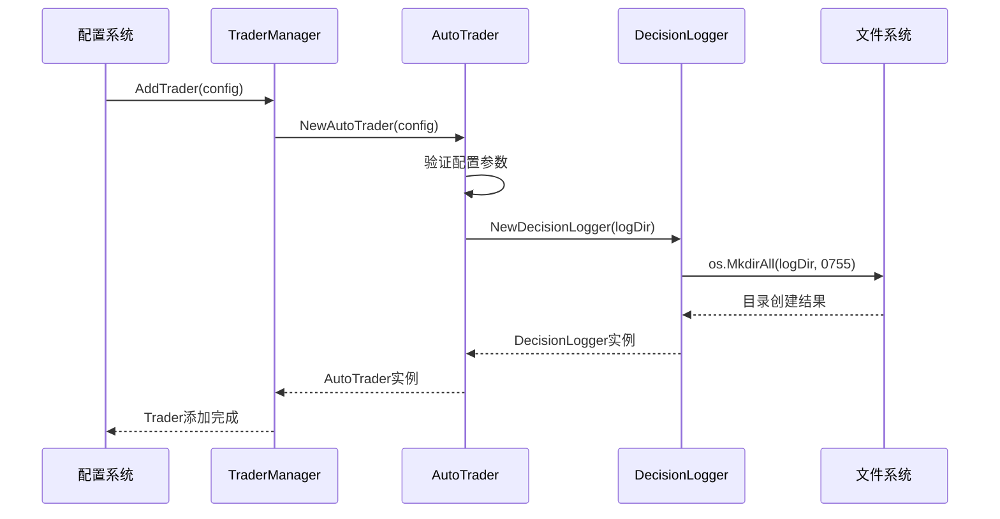
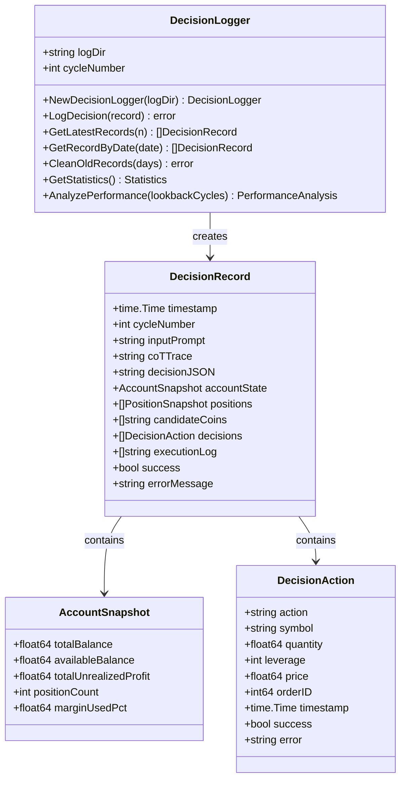
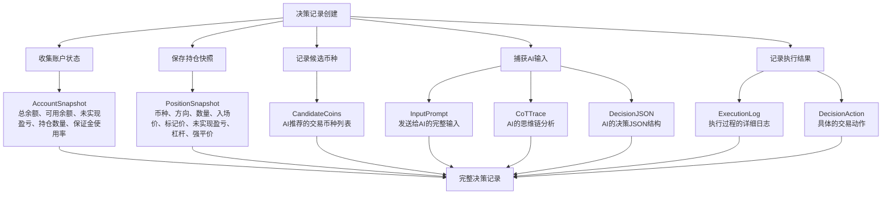
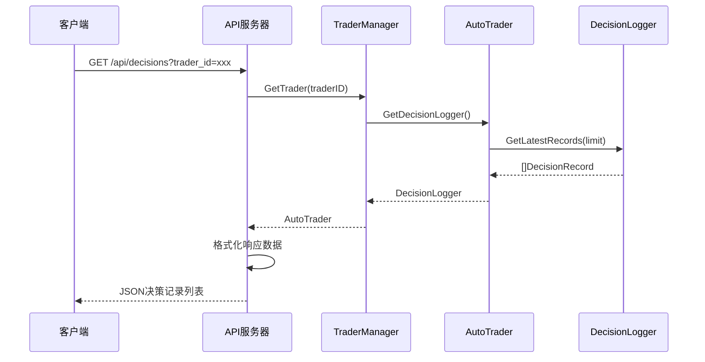
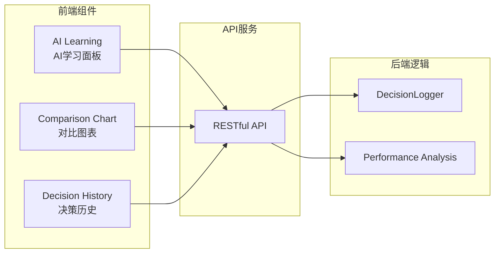
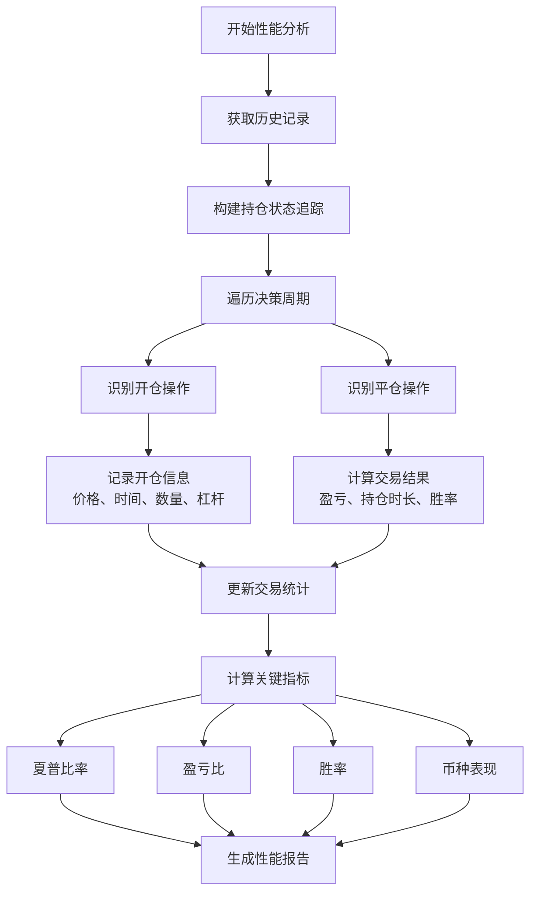
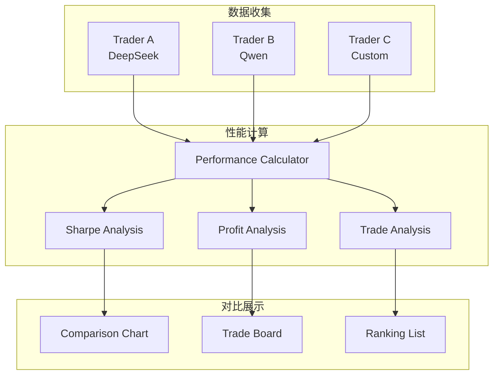

# 独立决策日志记录

<cite>
**本文档引用的文件**
- [logger/decision_logger.go](file://logger/decision_logger.go)
- [trader/auto_trader.go](file://trader/auto_trader.go)
- [manager/trader_manager.go](file://manager/trader/trader_manager.go)
- [decision/engine.go](file://decision/engine.go)
- [api/server.go](file://api/server.go)
- [web/src/components/AILearning.tsx](file://web/src/components/AILearning.tsx)
- [web/src/components/ComparisonChart.tsx](file://web/src/components/ComparisonChart.tsx)
</cite>

## 目录
1. [简介](#简介)
2. [系统架构概览](#系统架构概览)
3. [AutoTrader初始化与日志目录创建](#autotrader初始化与日志目录创建)
4. [DecisionLogger组件详解](#decisionlogger组件详解)
5. [决策记录结构与内容](#决策记录结构与内容)
6. [日志文件格式与命名规范](#日志文件格式与命名规范)
7. [日志配置与访问接口](#日志配置与访问接口)
8. [性能分析与对比功能](#性能分析与对比功能)
9. [最佳实践与故障排除](#最佳实践与故障排除)

## 简介

nofx项目中的AI交易机器人采用了一套完善的独立日志记录机制，为每个AI交易器提供完整的决策追踪和性能分析能力。该系统通过AutoTrader在初始化时根据唯一ID创建独立的日志目录，实现了不同AI模型之间的日志完全隔离，为后续的性能评估、策略优化和故障诊断提供了坚实的数据基础。

## 系统架构概览

```mermaid
graph TB
subgraph "AI交易系统"
AT[AutoTrader<br/>AI交易器]
TM[TraderManager<br/>交易器管理器]
DL[DecisionLogger<br/>决策日志记录器]
end
subgraph "日志存储层"
LD[决策日志目录<br/>decision_logs/]
TD[Trader ID子目录<br/>decision_logs/{trader_id}/]
LF[JSONL格式日志文件<br/>decision_YYYYMMDD_HHMMSS_cycleN.json]
end
subgraph "API服务层"
AS[API服务器]
DH[决策历史接口]
DS[统计数据接口]
PA[性能分析接口]
end
subgraph "前端展示层"
WC[Web控制台]
AL[AI学习面板]
CC[对比图表]
end
AT --> DL
TM --> AT
DL --> LD
LD --> TD
TD --> LF
AS --> DH
AS --> DS
AS --> PA
DH --> WC
DS --> AL
PA --> CC
```

**图表来源**
- [trader/auto_trader.go](file://trader/auto_trader.go#L131-L162)
- [manager/trader_manager.go](file://manager/trader_manager.go#L1-L50)
- [logger/decision_logger.go](file://logger/decision_logger.go#L60-L80)

## AutoTrader初始化与日志目录创建

### 初始化流程

AutoTrader在创建过程中会根据配置中的唯一ID自动建立独立的日志目录，实现完全的决策隔离：



**图表来源**
- [trader/auto_trader.go](file://trader/auto_trader.go#L131-L162)
- [manager/trader_manager.go](file://manager/trader_manager.go#L25-L60)

### 日志目录结构

系统为每个Trader创建独立的日志目录，路径格式为：
- 主目录：`decision_logs/`
- 子目录：`decision_logs/{trader_id}/`

这种设计确保了：
- **完全隔离**：不同Trader的决策记录不会相互干扰
- **易于管理**：按Trader ID组织便于查找和维护
- **扩展性强**：支持同时运行多个不同配置的Trader

**章节来源**
- [trader/auto_trader.go](file://trader/auto_trader.go#L131-L162)

## DecisionLogger组件详解

### 核心功能架构

DecisionLogger是整个日志系统的核心组件，负责记录、管理和分析AI交易决策的完整生命周期：



**图表来源**
- [logger/decision_logger.go](file://logger/decision_logger.go#L15-L80)

### 决策周期跟踪

DecisionLogger通过内置的周期计数器跟踪每个决策周期，确保记录的有序性和可追溯性：

| 功能特性 | 实现方式 | 用途 |
|---------|---------|------|
| 周期编号 | `cycleNumber++` | 标识决策顺序 |
| 时间戳记录 | `record.Timestamp = time.Now()` | 精确的时间定位 |
| 成功状态 | `record.Success` | 决策执行结果 |
| 错误信息 | `record.ErrorMessage` | 故障诊断依据 |

**章节来源**
- [logger/decision_logger.go](file://logger/decision_logger.go#L80-L120)

## 决策记录结构与内容

### 完整决策上下文

每个决策记录包含了丰富的上下文信息，确保能够完整重现和分析交易决策：



**图表来源**
- [logger/decision_logger.go](file://logger/decision_logger.go#L15-L50)
- [trader/auto_trader.go](file://trader/auto_trader.go#L200-L250)

### 关键数据字段说明

| 字段类别 | 字段名称 | 数据类型 | 描述 |
|---------|---------|---------|------|
| 基础信息 | `Timestamp` | `time.Time` | 决策执行的确切时间 |
| | `CycleNumber` | `int` | 当前决策周期的序号 |
| AI输入 | `InputPrompt` | `string` | 发送给AI的完整输入提示 |
| | `CoTTrace` | `string` | AI的思维链分析过程 |
| | `DecisionJSON` | `string` | AI生成的决策JSON结构 |
| 账户状态 | `AccountState` | `AccountSnapshot` | 决策时的账户快照 |
| 持仓信息 | `Positions` | `[]PositionSnapshot` | 当前持仓的完整快照 |
| 候选币种 | `CandidateCoins` | `[]string` | AI推荐的交易币种列表 |
| 执行结果 | `Decisions` | `[]DecisionAction` | 实际执行的交易动作 |
| | `ExecutionLog` | `[]string` | 执行过程的详细日志 |
| | `Success` | `bool` | 决策是否成功执行 |
| | `ErrorMessage` | `string` | 错误信息（如有） |

**章节来源**
- [logger/decision_logger.go](file://logger/decision_logger.go#L15-L50)

## 日志文件格式与命名规范

### 文件命名规范

系统采用标准化的文件命名格式，确保日志文件的可读性和可管理性：

```
decision_YYYYMMDD_HHMMSS_cycleN.json
```

**命名规则详解：**
- `decision_`：固定前缀，标识文件类型
- `YYYYMMDD`：决策日期（8位数字）
- `HHMMSS`：决策时间（6位数字，24小时制）
- `cycleN`：周期编号（N为递增数字）
- `.json`：文件扩展名，使用JSON格式存储

### JSONL格式结构

每个日志文件包含一个完整的决策记录，采用以下结构：

```json
{
  "timestamp": "2024-01-15T10:30:00Z",
  "cycle_number": 42,
  "input_prompt": "...",
  "cot_trace": "...",
  "decision_json": "...",
  "account_state": {...},
  "positions": [...],
  "candidate_coins": [...],
  "decisions": [...],
  "execution_log": [...],
  "success": true,
  "error_message": ""
}
```

### 文件组织结构

```
decision_logs/
├── trader_a/
│   ├── decision_20240115_103000_cycle1.json
│   ├── decision_20240115_103300_cycle2.json
│   └── ...
├── trader_b/
│   ├── decision_20240115_103000_cycle1.json
│   ├── decision_20240115_103300_cycle2.json
│   └── ...
└── trader_c/
    ├── decision_20240115_103000_cycle1.json
    ├── decision_20240115_103300_cycle2.json
    └── ...
```

**章节来源**
- [logger/decision_logger.go](file://logger/decision_logger.go#L80-L120)

## 日志配置与访问接口

### HTTP API接口设计

系统提供了完整的RESTful API接口，支持对决策日志的各种查询和分析需求：



**图表来源**
- [api/server.go](file://api/server.go#L205-L254)

### 核心API接口

| 接口路径 | 方法 | 功能描述 | 返回数据 |
|---------|------|---------|---------|
| `/api/decisions` | GET | 获取所有历史决策记录 | 完整决策记录列表 |
| `/api/latest-decisions` | GET | 获取最新5条决策记录 | 最新决策记录（倒序） |
| `/api/statistics` | GET | 获取统计信息 | 基本统计指标 |
| `/api/equity-history` | GET | 获取收益历史数据 | 账户净值历史 |
| `/api/performance` | GET | 获取性能分析报告 | AI学习和表现分析 |

### Web界面集成

前端组件通过API接口实时获取和展示决策日志数据：



**图表来源**
- [web/src/components/AILearning.tsx](file://web/src/components/AILearning.tsx#L1-L50)
- [web/src/components/ComparisonChart.tsx](file://web/src/components/ComparisonChart.tsx#L1-L50)

**章节来源**
- [api/server.go](file://api/server.go#L205-L300)

## 性能分析与对比功能

### 自动化性能分析

DecisionLogger提供了强大的自动化性能分析功能，支持对AI交易策略的全面评估：



**图表来源**
- [logger/decision_logger.go](file://logger/decision_logger.go#L334-L400)

### 关键性能指标

系统自动计算以下核心性能指标：

| 指标名称 | 计算公式 | 业务含义 | 优化目标 |
|---------|---------|---------|---------|
| 夏普比率 | `(平均收益 - 无风险利率) / 收益波动率` | 风险调整后收益 | > 0.7 优秀，> 1.0 良好 |
| 盈亏比 | `总盈利 / 总亏损` | 盈利效率 | ≥ 3.0 优秀 |
| 胜率 | `盈利交易数 / 总交易数` | 交易质量 | ≥ 50% 良好 |
| 平均盈利 | `总盈利 / 盈利交易数` | 盈利深度 | 越高越好 |
| 平均亏损 | `总亏损 / 亏损交易数` | 亏损程度 | 越低越好 |

### 多Trader对比分析

系统支持多个Trader之间的性能对比，帮助用户评估不同AI模型的效果：



**图表来源**
- [web/src/components/ComparisonChart.tsx](file://web/src/components/ComparisonChart.tsx#L100-L200)

**章节来源**
- [logger/decision_logger.go](file://logger/decision_logger.go#L334-L500)

## 最佳实践与故障排除

### 日志管理最佳实践

1. **定期清理旧日志**
   ```go
   // 清理30天前的旧记录
   decisionLogger.CleanOldRecords(30)
   ```

2. **监控磁盘空间**
   - 建议设置合理的日志保留期限
   - 定期检查日志目录大小
   - 实施自动清理策略

3. **备份重要决策记录**
   - 定期备份关键Trader的决策日志
   - 保存历史性能分析报告
   - 维护决策记录的长期归档

### 常见问题排除

| 问题类型 | 症状 | 可能原因 | 解决方案 |
|---------|------|---------|---------|
| 日志创建失败 | 目录权限错误 | 文件系统权限不足 | 检查并修正目录权限 |
| 决策记录丢失 | 查询不到历史记录 | 文件损坏或删除 | 检查文件完整性，恢复备份 |
| 性能分析异常 | 计算结果不准确 | 数据格式错误 | 验证JSON格式，重新分析 |
| API响应缓慢 | 接口响应时间长 | 数据量过大 | 限制查询范围，优化索引 |

### 性能优化建议

1. **日志写入优化**
   - 使用异步写入减少阻塞
   - 实施批量写入策略
   - 优化JSON序列化性能

2. **查询性能优化**
   - 实施索引策略
   - 限制查询数据量
   - 使用缓存机制

3. **存储空间优化**
   - 压缩历史数据
   - 实施数据归档策略
   - 定期清理无用数据

**章节来源**
- [logger/decision_logger.go](file://logger/decision_logger.go#L174-L237)