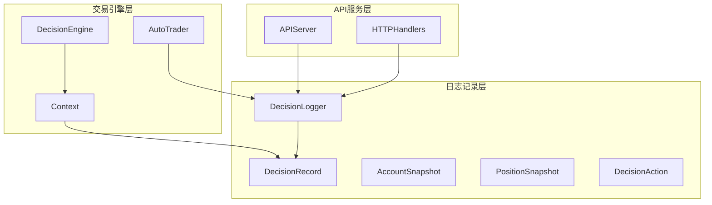
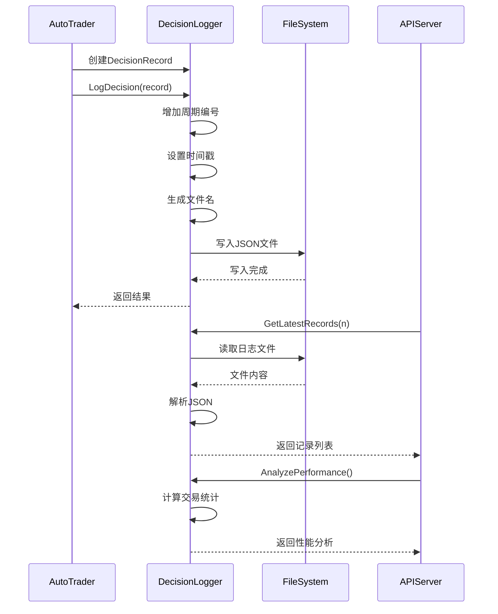
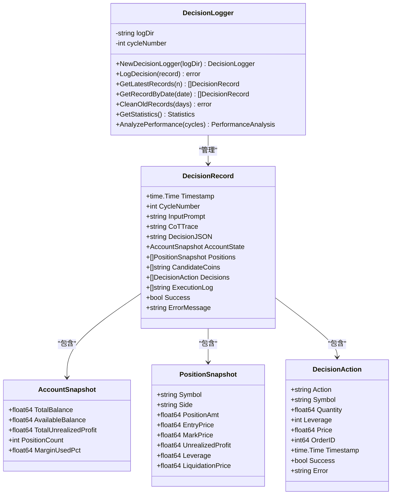
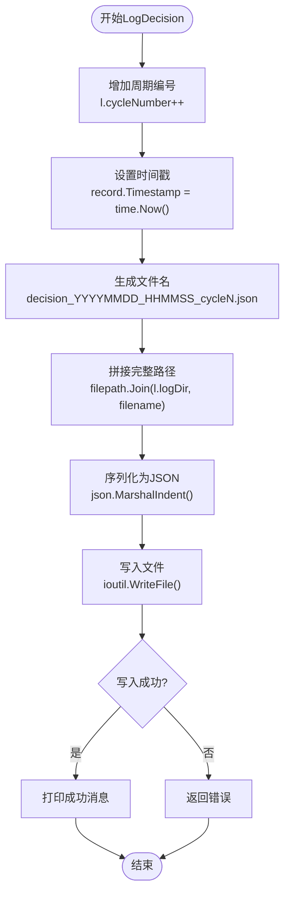
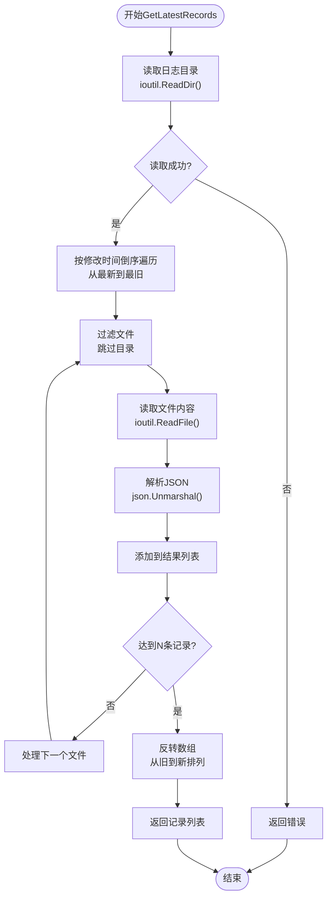
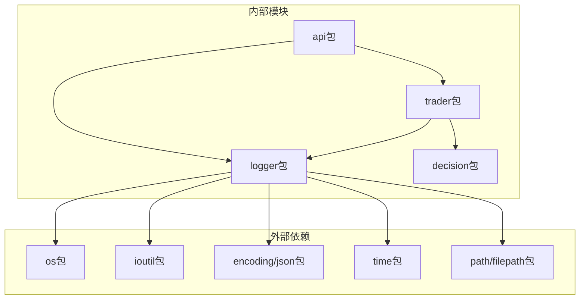

# 决策日志记录

<cite>
**本文档引用的文件**
- [logger/decision_logger.go](file://logger/decision_logger.go)
- [decision/engine.go](file://decision/engine.go)
- [trader/auto_trader.go](file://trader/auto_trader.go)
- [main.go](file://main.go)
- [api/server.go](file://api/server.go)
</cite>

## 目录
1. [简介](#简介)
2. [项目结构概览](#项目结构概览)
3. [核心组件分析](#核心组件分析)
4. [架构概览](#架构概览)
5. [详细组件分析](#详细组件分析)
6. [依赖关系分析](#依赖关系分析)
7. [性能考虑](#性能考虑)
8. [故障排除指南](#故障排除指南)
9. [结论](#结论)

## 简介

DecisionLogger结构体是nofx AI交易系统中的核心日志记录组件，负责记录完整的AI决策周期数据。该系统通过精确记录每个交易周期的输入提示、思维链分析、决策内容和执行日志，为交易行为的可追溯性和性能分析提供了完整的数据基础。

## 项目结构概览

决策日志系统在项目中的组织结构体现了清晰的职责分离：



**图表来源**
- [logger/decision_logger.go](file://logger/decision_logger.go#L62-L350)
- [trader/auto_trader.go](file://trader/auto_trader.go#L70-L170)
- [api/server.go](file://api/server.go#L200-L400)

**章节来源**
- [logger/decision_logger.go](file://logger/decision_logger.go#L1-L612)
- [trader/auto_trader.go](file://trader/auto_trader.go#L1-L936)

## 核心组件分析

### DecisionRecord结构体详解

DecisionRecord是决策日志的核心数据结构，包含了完整的决策周期信息：

| 字段名 | 类型 | 描述 | JSON标签 |
|--------|------|------|----------|
| Timestamp | time.Time | 决策时间戳 | timestamp |
| CycleNumber | int | 周期编号（自增） | cycle_number |
| InputPrompt | string | 发送给AI的输入prompt | input_prompt |
| CoTTrace | string | AI思维链（输出） | cot_trace |
| DecisionJSON | string | 决策JSON字符串 | decision_json |
| AccountState | AccountSnapshot | 账户状态快照 | account_state |
| Positions | []PositionSnapshot | 持仓快照列表 | positions |
| CandidateCoins | []string | 候选币种列表 | candidate_coins |
| Decisions | []DecisionAction | 执行的决策列表 | decisions |
| ExecutionLog | []string | 执行日志 | execution_log |
| Success | bool | 是否成功 | success |
| ErrorMessage | string | 错误信息（如果有） | error_message |

### 决策记录字段详细说明

#### InputPrompt（输入提示）
输入提示字段记录了发送给AI模型的完整上下文信息，包括：
- 当前时间、运行时长和周期编号
- 账户状态信息（净值、余额、盈亏、保证金使用率）
- 当前持仓详情（币种、方向、入场价、当前价、盈亏、杠杆）
- 候选币种列表及其市场数据
- 夏普比率等性能指标

#### CoTTrace（思维链）
思维链字段记录了AI模型的推理过程，包含：
- 对市场状况的分析
- 技术指标的解读
- 风险评估和仓位管理考量
- 决策依据和信心度评估

#### DecisionJSON（决策内容）
决策JSON字段存储了AI生成的具体交易决策，格式为：
```json
[
  {
    "symbol": "BTCUSDT",
    "action": "open_long",
    "leverage": 5,
    "position_size_usd": 1000,
    "stop_loss": 29000,
    "take_profit": 32000,
    "confidence": 85,
    "risk_usd": 100,
    "reasoning": "上涨趋势+MACD金叉"
  }
]
```

#### ExecutionLog（执行日志）
执行日志记录了每个决策的实际执行情况：
- 决策执行状态（成功/失败）
- 执行时间戳
- 实际成交价格和数量
- 订单ID
- 错误信息（如有）

**章节来源**
- [logger/decision_logger.go](file://logger/decision_logger.go#L15-L35)

## 架构概览

决策日志系统的整体架构采用分层设计，确保了数据的完整性和可访问性：



**图表来源**
- [logger/decision_logger.go](file://logger/decision_logger.go#L85-L120)
- [trader/auto_trader.go](file://trader/auto_trader.go#L230-L380)
- [api/server.go](file://api/server.go#L200-L400)

## 详细组件分析

### DecisionLogger结构体

DecisionLogger是决策日志的核心管理器，负责日志文件的创建、管理和查询：



**图表来源**
- [logger/decision_logger.go](file://logger/decision_logger.go#L62-L350)

### LogDecision方法实现机制

LogDecision方法是决策日志的核心功能，实现了完整的决策记录持久化：



**图表来源**
- [logger/decision_logger.go](file://logger/decision_logger.go#L85-L118)

#### 文件命名规则

决策日志文件采用标准化的命名格式：
- **格式**: `decision_YYYYMMDD_HHMMSS_cycleN.json`
- **示例**: `decision_20241201_143025_cycle1.json`
- **组成**:
  - `decision_`: 固定前缀
  - `YYYYMMDD`: 决策日期
  - `HHMMSS`: 决策时间
  - `cycleN`: 周期编号

#### JSON格式设计

决策记录采用结构化的JSON格式，便于解析和分析：
- **缩进格式**: 使用2个空格缩进，提高可读性
- **字段完整性**: 包含决策的完整生命周期信息
- **类型安全**: 明确的字段类型定义
- **扩展性**: 支持未来字段的添加

### GetLatestRecords方法实现

GetLatestRecords方法提供了高效的历史记录查询功能：



**图表来源**
- [logger/decision_logger.go](file://logger/decision_logger.go#L114-L178)

**章节来源**
- [logger/decision_logger.go](file://logger/decision_logger.go#L85-L178)

## 依赖关系分析

决策日志系统的依赖关系体现了良好的模块化设计：



**图表来源**
- [logger/decision_logger.go](file://logger/decision_logger.go#L1-L15)
- [trader/auto_trader.go](file://trader/auto_trader.go#L1-L20)

### 主要依赖说明

| 依赖包 | 用途 | 版本要求 |
|--------|------|----------|
| os | 文件系统操作 | Go 1.16+ |
| ioutil | 文件读写 | Go 1.16+ |
| encoding/json | JSON序列化 | Go 1.16+ |
| time | 时间处理 | Go 1.16+ |
| path/filepath | 路径操作 | Go 1.16+ |

**章节来源**
- [logger/decision_logger.go](file://logger/decision_logger.go#L1-L15)

## 性能考虑

### 文件I/O优化

决策日志系统采用了多种性能优化策略：

1. **异步写入**: 日志写入操作不会阻塞主交易流程
2. **批量读取**: GetLatestRecords支持批量历史记录查询
3. **内存管理**: 及时释放不再需要的文件内容
4. **缓存策略**: 避免重复解析相同的日志文件

### 存储空间管理

系统提供了自动清理机制：
- **定期清理**: CleanOldRecords方法可删除指定天数前的旧记录
- **磁盘空间保护**: 防止日志文件无限增长
- **智能保留**: 保留关键历史数据用于性能分析

### 查询性能优化

- **索引策略**: 基于时间戳的文件名设计支持快速排序
- **分页查询**: GetLatestRecords支持限制返回记录数量
- **条件过滤**: GetRecordByDate支持按日期范围查询

## 故障排除指南

### 常见问题及解决方案

#### 日志文件创建失败

**症状**: 决策记录保存失败，出现"创建日志目录失败"警告
**原因**: 
- 目标目录权限不足
- 磁盘空间不足
- 路径不存在且无法创建

**解决方案**:
1. 检查目标目录权限：`chmod 755 decision_logs`
2. 确认磁盘空间充足
3. 手动创建日志目录：`mkdir -p decision_logs`

#### JSON序列化错误

**症状**: 决策记录保存时出现"序列化决策记录失败"错误
**原因**:
- 决策数据包含不可序列化的类型
- 数据结构过大超出JSON限制

**解决方案**:
1. 检查DecisionRecord中的数据完整性
2. 缩减过大的字段内容
3. 使用更高效的序列化方式

#### 性能分析异常

**症状**: AnalyzePerformance方法返回空结果或错误
**原因**:
- 日志文件损坏或格式不正确
- 缺少必要的历史数据
- 计算过程中出现异常

**解决方案**:
1. 验证日志文件的JSON格式
2. 检查是否有足够的历史记录
3. 重新生成缺失的决策记录

**章节来源**
- [logger/decision_logger.go](file://logger/decision_logger.go#L85-L118)
- [logger/decision_logger.go](file://logger/decision_logger.go#L181-L210)

## 结论

DecisionLogger结构体为nofx AI交易系统提供了完整的决策记录解决方案。通过精心设计的数据结构、可靠的持久化机制和灵活的查询接口，该系统实现了：

1. **完整的决策追踪**: 记录每个交易周期的输入、分析和执行全过程
2. **高性能的日志管理**: 优化的文件I/O和存储策略确保系统稳定运行
3. **强大的分析能力**: 提供丰富的统计和性能分析功能
4. **良好的扩展性**: 模块化设计支持未来的功能扩展

该系统不仅为AI交易行为提供了可追溯的数据基础，还为交易策略的优化和风险管理提供了重要的数据支持。通过持续的监控和维护，决策日志系统将继续为AI交易系统的可靠运行提供坚实保障。