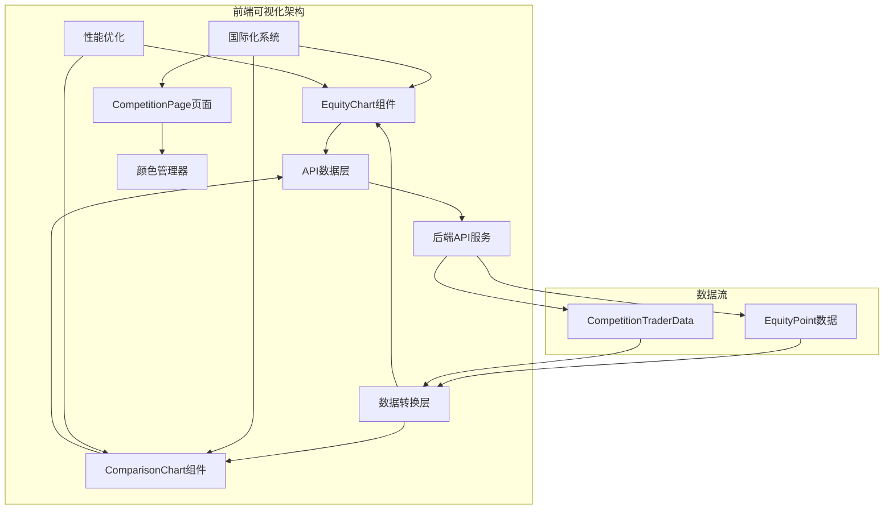
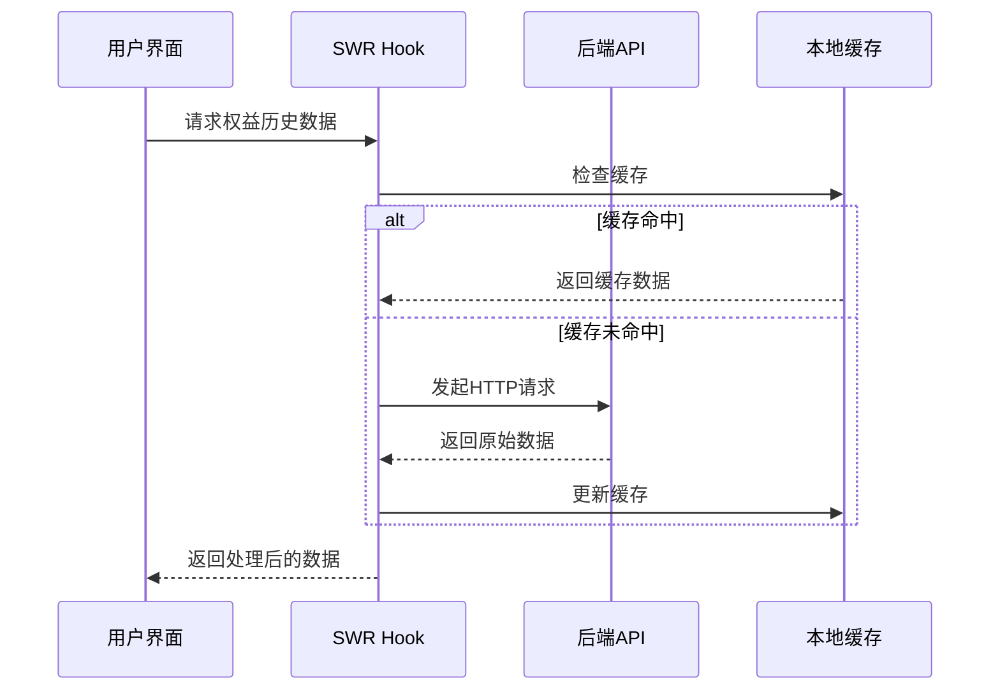
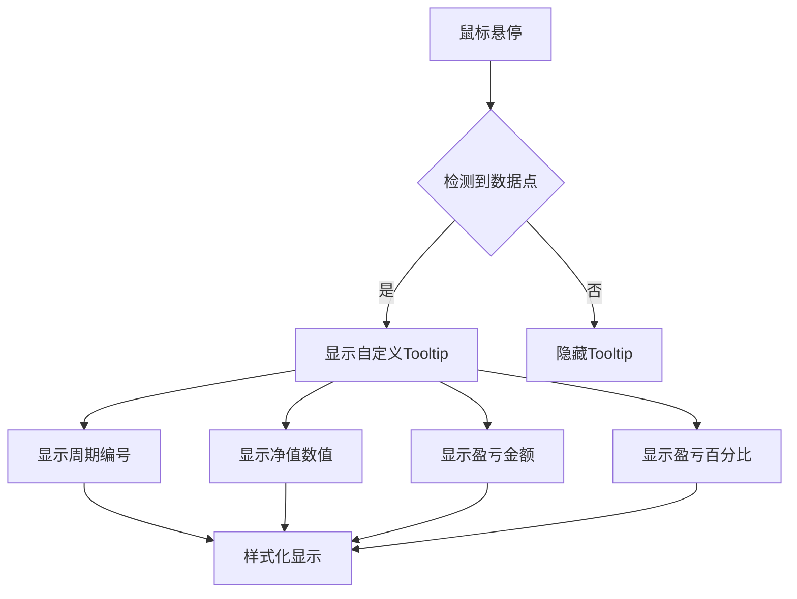
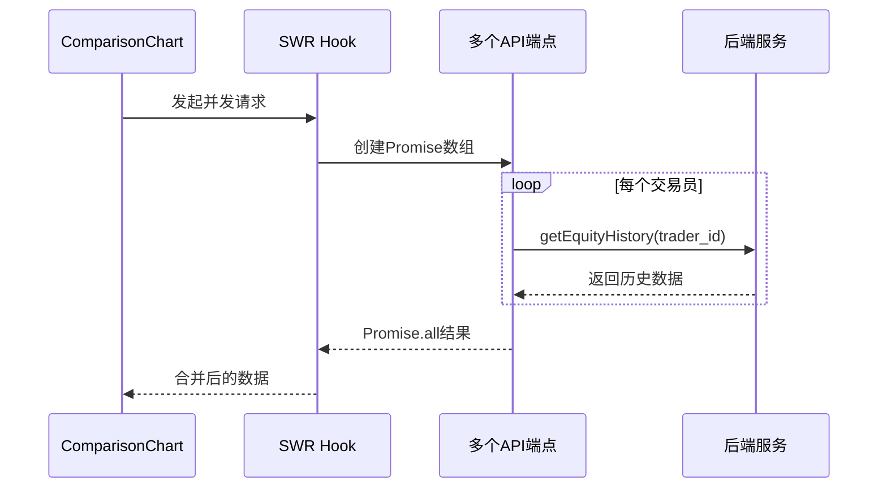
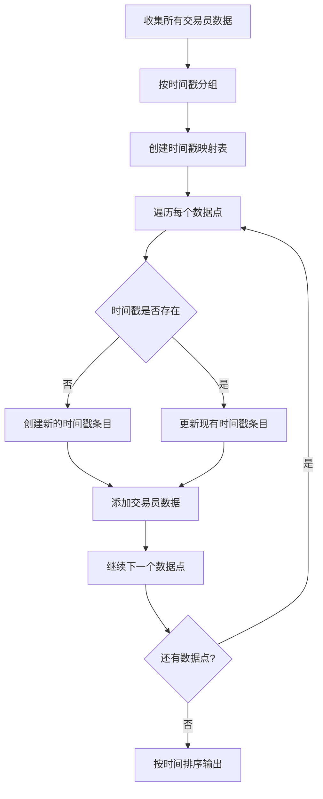
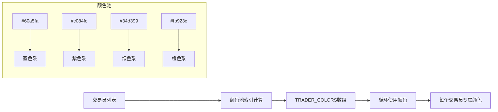
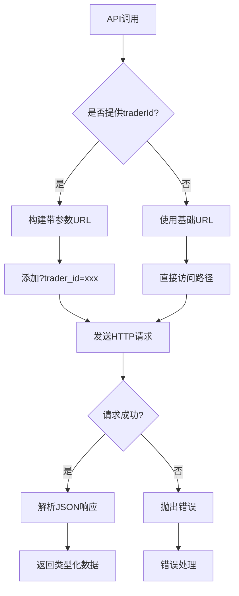
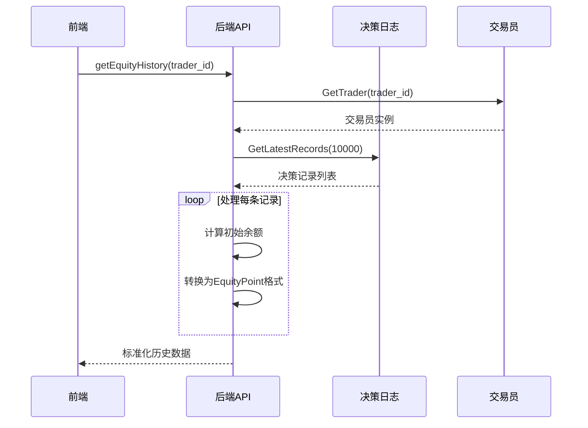
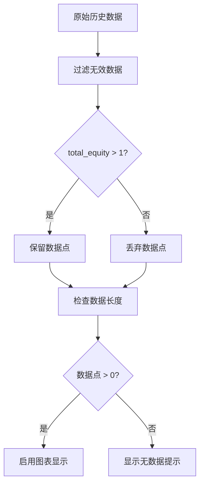
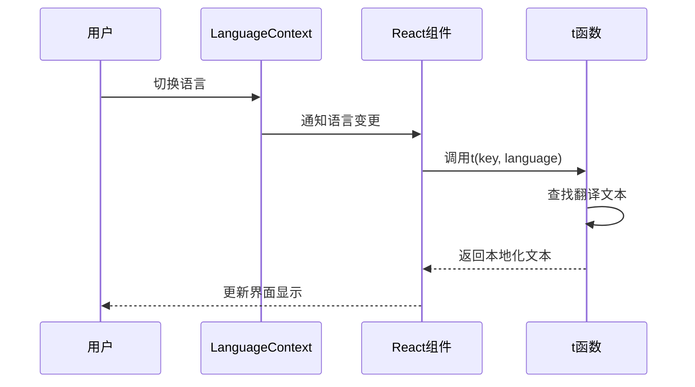

# 前端可视化

<cite>
**本文档中引用的文件**
- [EquityChart.tsx](file://web/src/components/EquityChart.tsx)
- [ComparisonChart.tsx](file://web/src/components/ComparisonChart.tsx)
- [api.ts](file://web/src/lib/api.ts)
- [types.ts](file://web/src/types.ts)
- [traderColors.ts](file://web/src/utils/traderColors.ts)
- [server.go](file://api/server.go)
- [CompetitionPage.tsx](file://web/src/components/CompetitionPage.tsx)
- [translations.ts](file://web/src/i18n/translations.ts)
</cite>

## 目录
1. [简介](#简介)
2. [项目架构概览](#项目架构概览)
3. [EquityChart组件详解](#equitychart组件详解)
4. [ComparisonChart组件详解](#comparisonchart组件详解)
5. [API数据获取机制](#api数据获取机制)
6. [数据转换与处理流程](#数据转换与处理流程)
7. [颜色管理系统](#颜色管理系统)
8. [国际化支持](#国际化支持)
9. [性能优化策略](#性能优化策略)
10. [故障排除指南](#故障排除指南)
11. [总结](#总结)

## 简介

本文档详细阐述了NOFX项目中前端可视化系统的实现原理，重点分析EquityChart和ComparisonChart两个核心组件如何将后端API数据转化为直观的可视化图表。系统采用React + TypeScript技术栈，结合Recharts库实现高性能的金融图表展示，支持实时数据更新和多种显示模式。

## 项目架构概览

前端可视化系统采用模块化架构设计，主要包含以下核心模块：



**图表来源**
- [EquityChart.tsx](file://web/src/components/EquityChart.tsx#L1-L303)
- [ComparisonChart.tsx](file://web/src/components/ComparisonChart.tsx#L1-L345)
- [api.ts](file://web/src/lib/api.ts#L1-L114)

**章节来源**
- [EquityChart.tsx](file://web/src/components/EquityChart.tsx#L1-L50)
- [ComparisonChart.tsx](file://web/src/components/ComparisonChart.tsx#L1-L50)

## EquityChart组件详解

### 核心功能特性

EquityChart组件是单个交易员权益曲线展示的核心组件，具备以下关键特性：

#### 数据获取与缓存机制
组件使用SWR库实现智能数据缓存和自动刷新：



**图表来源**
- [EquityChart.tsx](file://web/src/components/EquityChart.tsx#L20-L40)
- [api.ts](file://web/src/lib/api.ts#L93-L105)

#### 显示模式切换
组件支持美元和百分比两种显示模式，通过用户交互动态切换：

- **美元模式**：展示绝对净值数值，适合观察具体资金变化
- **百分比模式**：展示相对于初始余额的收益率百分比，便于比较不同规模账户的表现

#### 自定义Tooltip设计
采用Binance风格的自定义Tooltip，提供丰富的数据信息：



**图表来源**
- [EquityChart.tsx](file://web/src/components/EquityChart.tsx#L150-L170)

#### Y轴范围计算算法
组件实现了智能的Y轴范围计算算法，确保图表展示效果：

- **百分比模式**：基于最大最小值计算，预留20%余量
- **美元模式**：以初始余额为基准，上下预留15%余量

**章节来源**
- [EquityChart.tsx](file://web/src/components/EquityChart.tsx#L1-L303)

## ComparisonChart组件详解

### 并发数据获取架构

ComparisonChart组件是多交易员性能对比的核心组件，其并发数据获取机制体现了现代前端架构的最佳实践：



**图表来源**
- [ComparisonChart.tsx](file://web/src/components/ComparisonChart.tsx#L15-L35)

### 时间序列数据合并算法

组件的核心功能是将多个交易员的历史数据合并成统一的时间序列：

#### 数据分组策略
采用时间戳作为主键进行数据分组，解决了不同交易员数据点不对应的问题：



**图表来源**
- [ComparisonChart.tsx](file://web/src/components/ComparisonChart.tsx#L50-L120)

#### 数据格式标准化
将原始API数据转换为统一的图表数据格式：

| 字段名 | 类型 | 描述 | 示例值 |
|--------|------|------|--------|
| index | number | 序号（替代cycle_number） | 1, 2, 3... |
| time | string | 格式化时间字符串 | "14:30" |
| timestamp | string | 原始时间戳 | "2024-01-01 14:30:00" |
| {trader_id}_pnl_pct | number | 交易员盈亏百分比 | 2.45, -1.87 |
| {trader_id}_equity | number | 交易员净值 | 10500.23, 9800.56 |

### 多曲线对比展示

#### 颜色分配策略
使用统一的颜色管理器确保颜色一致性：



**图表来源**
- [traderColors.ts](file://web/src/utils/traderColors.ts#L1-L32)
- [ComparisonChart.tsx](file://web/src/components/ComparisonChart.tsx#L250-L270)

#### 自定义Tooltip设计
为多交易员对比场景专门设计的Tooltip：

- 显示每个交易员的名称和AI模型标识
- 提供详细的盈亏百分比和净值信息
- 使用对应的颜色标识不同交易员

**章节来源**
- [ComparisonChart.tsx](file://web/src/components/ComparisonChart.tsx#L1-L345)

## API数据获取机制

### 前端API封装层

前端通过api.ts文件封装了所有与后端通信的接口，提供了类型安全的数据获取方法：

#### 核心API接口定义

| 接口方法 | 功能描述 | 参数 | 返回类型 |
|----------|----------|------|----------|
| getCompetition() | 获取竞赛总览数据 | 无 | CompetitionData |
| getTraders() | 获取交易员列表 | 无 | TraderInfo[] |
| getStatus(traderId?) | 获取系统状态 | traderId?: string | SystemStatus |
| getAccount(traderId?) | 获取账户信息 | traderId?: string | AccountInfo |
| getEquityHistory(traderId?) | 获取权益历史数据 | traderId?: string | EquityPoint[] |
| getPerformance(traderId?) | 获取AI学习表现 | traderId?: string | any |

#### 请求参数处理机制



**图表来源**
- [api.ts](file://web/src/lib/api.ts#L15-L114)

### 后端API处理流程

后端服务通过Gin框架提供RESTful API接口，处理前端请求并返回格式化数据：

#### EquityHistory数据处理

后端将原始决策记录转换为标准化的EquityPoint格式：



**图表来源**
- [server.go](file://api/server.go#L280-L380)

**章节来源**
- [api.ts](file://web/src/lib/api.ts#L1-L114)
- [server.go](file://api/server.go#L280-L380)

## 数据转换与处理流程

### EquityPoint数据结构

EquityChart组件使用的EquityPoint接口定义了标准化的数据格式：

| 字段名 | 类型 | 描述 | 计算方式 |
|--------|------|------|----------|
| timestamp | string | 时间戳 | ISO格式字符串 |
| total_equity | number | 总净值 | 账户总余额 |
| pnl | number | 盈亏金额 | total_equity - 初始余额 |
| pnl_pct | number | 盈亏百分比 | (pnl / 初始余额) × 100 |
| cycle_number | number | 周期编号 | 决策周期序号 |

### 数据过滤与验证

组件实现了严格的数据质量控制：



**图表来源**
- [EquityChart.tsx](file://web/src/components/EquityChart.tsx#L60-L80)

### 性能优化措施

#### 数据点数量限制
为防止大数据量影响性能，组件实现了智能截断：

- **阈值设定**：最多显示2000个数据点
- **截断策略**：始终显示最近的数据点
- **用户体验**：提供显示范围指示

#### 图表渲染优化
- **条件渲染**：仅在数据充足时显示复杂图表元素
- **懒加载**：大量数据点时不显示数据点圆圈
- **内存管理**：及时清理不必要的DOM元素

**章节来源**
- [EquityChart.tsx](file://web/src/components/EquityChart.tsx#L80-L120)

## 颜色管理系统

### 统一颜色分配策略

traderColors.ts文件实现了跨组件的颜色一致性管理：

#### 颜色池定义
预定义了一组高质量的颜色值，确保视觉效果的一致性：

```typescript
const TRADER_COLORS = [
  '#60a5fa', // 蓝色系
  '#c084fc', // 紫色系  
  '#34d399', // 绿色系
  '#fb923c', // 橙色系
  '#f472b6', // 粉色系
  '#fbbf24', // 黄色系
  '#38bdf8', // 浅蓝系
  '#a78bfa', // 深紫系
  '#4ade80', // 浅绿系
  '#fb7185', // 玫红系
];
```

#### 动态颜色分配算法

```mermaid
flowchart TD
A[交易员列表] --> B[查找交易员索引]
B --> C{找到索引?}
C --> |是| D[计算颜色索引]
C --> |否| E[返回默认颜色]
D --> F[索引 % 颜色池长度]
F --> G[返回对应颜色]
E --> H[TRADER_COLORS[0]]
G --> I[最终颜色值]
H --> I
```

**图表来源**
- [traderColors.ts](file://web/src/utils/traderColors.ts#L20-L32)

### 在组件中的应用

#### ComparisonChart中的颜色使用
每个交易员曲线都使用专属颜色，确保区分度：

- **渐变效果**：为每条曲线创建线性渐变
- **Legend匹配**：图例标签使用相同颜色
- **Tooltip标识**：Tooltip中突出显示交易员颜色

#### CompetitionPage中的颜色应用
排行榜和头部统计使用颜色强化视觉层次：

- **领先者高亮**：使用金色渐变背景
- **状态指示**：运行状态使用绿色/红色圆点
- **对比增强**：不同交易员使用不同颜色边框

**章节来源**
- [traderColors.ts](file://web/src/utils/traderColors.ts#L1-L32)
- [ComparisonChart.tsx](file://web/src/components/ComparisonChart.tsx#L250-L270)

## 国际化支持

### 多语言翻译系统

系统支持中英文双语界面，通过translations.ts文件管理本地化内容：

#### 翻译键值结构

| 翻译键 | 中文 | 英文 |
|--------|------|------|
| accountEquityCurve | 账户净值曲线 | Account Equity Curve |
| initialBalance | 初始余额 | Initial Balance |
| currentEquity | 当前净值 | Current Equity |
| historicalCycles | 历史周期 | Historical Cycles |
| performanceComparison | 性能对比 | Performance Comparison |

#### 动态语言切换机制



**图表来源**
- [translations.ts](file://web/src/i18n/translations.ts#L1-L254)

### 文本参数化支持

系统支持动态参数替换，用于显示具体数值：

```typescript
// 示例：t('leadingBy', language, { gap: gap.toFixed(2) })
// 输出："领先 2.45%"
```

**章节来源**
- [translations.ts](file://web/src/i18n/translations.ts#L1-L254)

## 性能优化策略

### 数据获取优化

#### SWR缓存策略
组件使用SWR库实现智能缓存和自动刷新：

| 优化策略 | 配置值 | 效果 |
|----------|--------|------|
| 刷新间隔 | 30秒（历史数据）/ 15秒（实时数据） | 减少不必要的API调用 |
| 去重间隔 | 20秒/10秒 | 防止重复请求 |
| 焦点重验证 | false | 提升用户体验 |
| 缓存失效 | 自动 | 确保数据新鲜度 |

#### 数据预处理优化
- **即时过滤**：移除无效数据点
- **智能截断**：限制显示数据点数量
- **格式转换**：在组件内完成数据格式化

### 渲染性能优化

#### React优化技巧
- **useMemo缓存**：缓存计算密集型操作结果
- **条件渲染**：避免不必要的DOM更新
- **事件委托**：减少事件监听器数量

#### 图表渲染优化
- **响应式容器**：自动适配不同屏幕尺寸
- **渐进式加载**：优先渲染核心内容
- **内存泄漏防护**：及时清理定时器和订阅

**章节来源**
- [EquityChart.tsx](file://web/src/components/EquityChart.tsx#L20-L40)
- [ComparisonChart.tsx](file://web/src/components/ComparisonChart.tsx#L15-L35)

## 故障排除指南

### 常见问题诊断

#### 数据加载失败
**症状**：图表显示"加载失败"错误
**可能原因**：
- 后端API服务不可用
- 网络连接问题
- 认证令牌过期

**解决方案**：
1. 检查网络连接状态
2. 验证API服务健康状态
3. 刷新页面重新尝试

#### 图表显示异常
**症状**：图表空白或显示错误数据
**可能原因**：
- 数据格式不匹配
- 时间戳格式错误
- 初始余额计算失败

**解决方案**：
1. 检查API返回数据结构
2. 验证时间戳格式一致性
3. 确认初始余额获取逻辑

#### 性能问题
**症状**：页面卡顿或响应缓慢
**可能原因**：
- 数据量过大
- 渲染循环过多
- 内存泄漏

**解决方案**：
1. 启用数据截断功能
2. 优化渲染逻辑
3. 使用浏览器开发者工具检查内存使用

### 调试工具使用

#### 开发者工具集成
- **React DevTools**：检查组件状态和props
- **Network面板**：监控API请求和响应
- **Console日志**：查看组件内部调试信息

#### 日志记录机制
组件内置了详细的日志记录功能：

```typescript
console.log(`[${new Date().toISOString()}] Recalculating chart data...`);
console.log(`Trader ${trader.trader_id}: ${history.data.length} data points`);
```

**章节来源**
- [EquityChart.tsx](file://web/src/components/EquityChart.tsx#L80-L100)
- [ComparisonChart.tsx](file://web/src/components/ComparisonChart.tsx#L70-L90)

## 总结

NOFX项目的前端可视化系统展现了现代Web应用开发的最佳实践。通过EquityChart和ComparisonChart两个核心组件，系统成功地将复杂的金融数据转化为直观易懂的可视化图表。

### 技术亮点

1. **模块化架构**：清晰的组件分离和职责划分
2. **类型安全**：完整的TypeScript类型定义
3. **性能优化**：智能缓存和渲染优化策略
4. **用户体验**：响应式设计和交互反馈
5. **可维护性**：良好的代码组织和文档注释

### 应用价值

该可视化系统不仅为用户提供直观的投资决策支持，也为系统监控和性能分析提供了重要工具。通过实时数据展示和历史趋势分析，帮助用户更好地理解AI交易模型的表现和市场动态。

### 未来发展方向

- **移动端优化**：提升移动设备上的用户体验
- **交互增强**：添加更多交互功能如缩放、选择区域等
- **数据导出**：支持图表数据的导出功能
- **实时通知**：集成实时消息推送功能

这套可视化系统为金融数据分析领域提供了一个优秀的参考实现，展示了如何将复杂的技术概念转化为用户友好的界面体验。