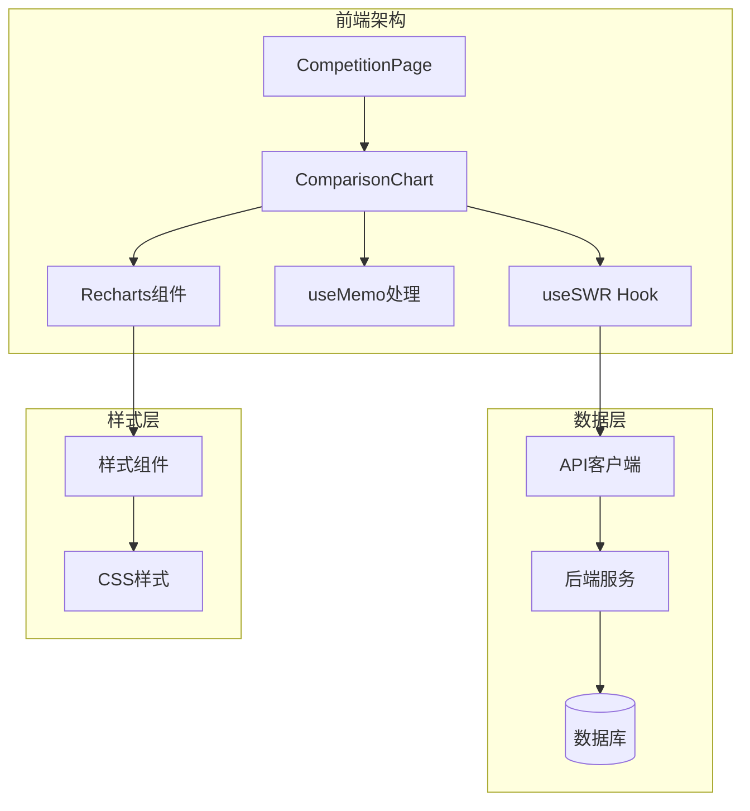
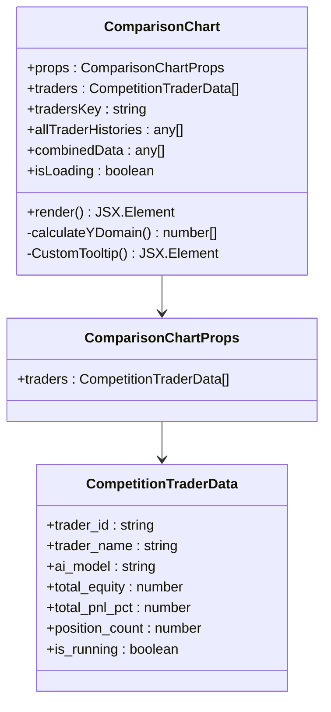
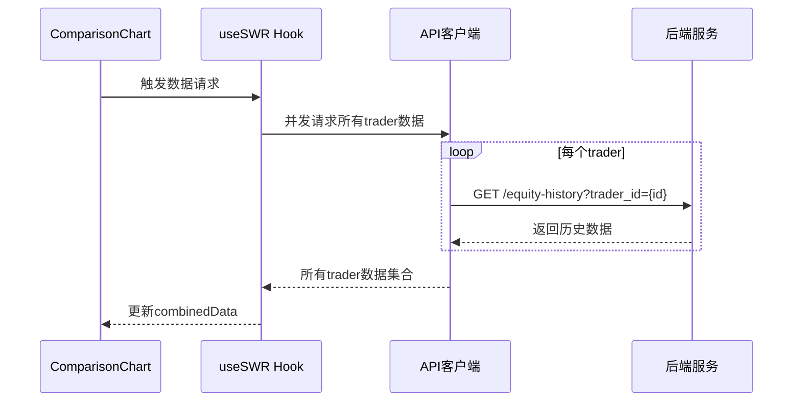
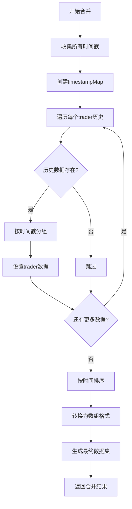
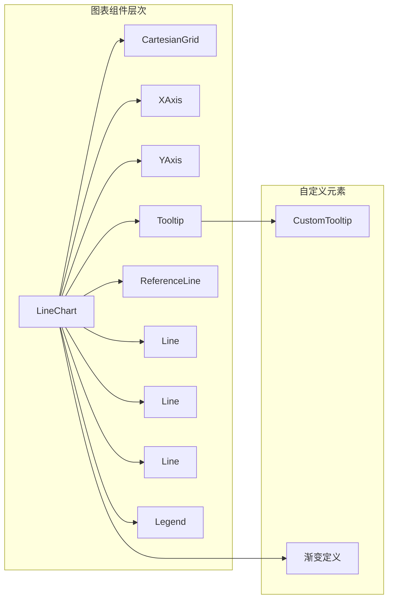
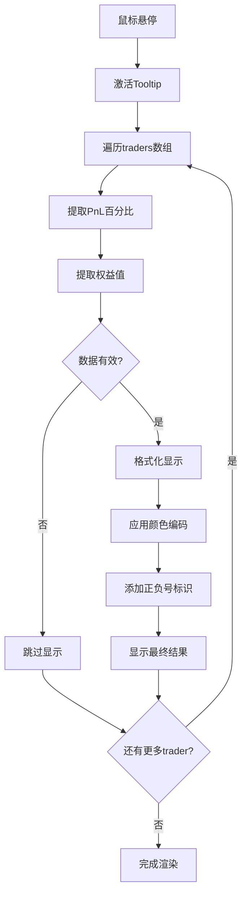
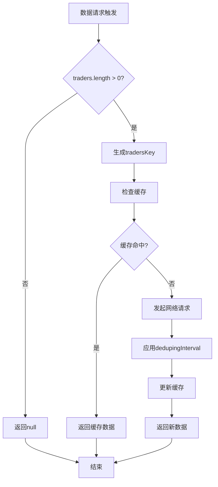

# 性能对比

<cite>
**本文档中引用的文件**
- [ComparisonChart.tsx](file://web/src/components/ComparisonChart.tsx)
- [traderColors.ts](file://web/src/utils/traderColors.ts)
- [api.ts](file://web/src/lib/api.ts)
- [CompetitionPage.tsx](file://web/src/components/CompetitionPage.tsx)
- [types.ts](file://web/src/types.ts)
- [EquityChart.tsx](file://web/src/components/EquityChart.tsx)
</cite>

## 目录
1. [简介](#简介)
2. [项目架构概览](#项目架构概览)
3. [核心组件分析](#核心组件分析)
4. [数据获取与处理](#数据获取与处理)
5. [数据合并逻辑](#数据合并逻辑)
6. [图表渲染与可视化](#图表渲染与可视化)
7. [性能优化策略](#性能优化策略)
8. [故障排除指南](#故障排除指南)
9. [总结](#总结)

## 简介

ComparisonChart组件是nofx交易平台的核心可视化组件之一，专门用于展示多个AI交易模型之间的性能对比。该组件通过useSWR并发请求多个交易员的历史数据，利用useMemo高效合并成统一的时间序列数据集，并使用不同颜色的曲线对比Qwen、DeepSeek等AI模型的PnL百分比表现。

## 项目架构概览

ComparisonChart组件位于nofx项目的前端Web应用中，采用React + TypeScript技术栈构建，使用Recharts库进行数据可视化。整个架构遵循模块化设计原则，各组件职责明确，数据流清晰。



**图表来源**
- [CompetitionPage.tsx](file://web/src/components/CompetitionPage.tsx#L70-L80)
- [ComparisonChart.tsx](file://web/src/components/ComparisonChart.tsx#L1-L50)

## 核心组件分析

### ComparisonChart组件结构

ComparisonChart组件是一个高度优化的React函数组件，具有以下核心特性：



**图表来源**
- [ComparisonChart.tsx](file://web/src/components/ComparisonChart.tsx#L15-L20)
- [types.ts](file://web/src/types.ts#L75-L85)

**章节来源**
- [ComparisonChart.tsx](file://web/src/components/ComparisonChart.tsx#L15-L345)
- [types.ts](file://web/src/types.ts#L75-L85)

### 颜色管理系统

组件使用统一的颜色分配逻辑确保视觉一致性：

```mermaid
flowchart TD
A[traderIndex] --> B{traderIndex >= 0?}
B --> |是| C[TRADER_COLORS[traderIndex % length]]
B --> |否| D[返回默认颜色]
C --> E[循环使用颜色池]
D --> F[TRADER_COLORS[0]]
E --> G[返回对应颜色]
F --> G
```

**图表来源**
- [traderColors.ts](file://web/src/utils/traderColors.ts#L15-L31)

**章节来源**
- [traderColors.ts](file://web/src/utils/traderColors.ts#L1-L32)

## 数据获取与处理

### useSWR并发数据获取

ComparisonChart组件采用高效的并发数据获取策略：



**图表来源**
- [ComparisonChart.tsx](file://web/src/components/ComparisonChart.tsx#L25-L40)
- [api.ts](file://web/src/lib/api.ts#L93-L102)

### 数据请求配置

组件使用精心调优的SWR配置：

| 配置项 | 值 | 说明 |
|--------|-----|------|
| refreshInterval | 30000ms | 30秒自动刷新间隔 |
| revalidateOnFocus | false | 离开页面时不重新验证 |
| dedupingInterval | 20000ms | 20秒去重间隔 |

**章节来源**
- [ComparisonChart.tsx](file://web/src/components/ComparisonChart.tsx#L25-L40)

## 数据合并逻辑

### 时间戳驱动的数据合并

ComparisonChart的核心创新在于基于时间戳而非周期号进行数据分组，解决了后端周期重置问题：



**图表来源**
- [ComparisonChart.tsx](file://web/src/components/ComparisonChart.tsx#L50-L120)

### 数据结构转换

合并后的数据结构包含以下关键字段：

| 字段名 | 类型 | 描述 |
|--------|------|------|
| index | number | 数据点序号（替代周期号） |
| time | string | 格式化时间字符串 |
| timestamp | string | 原始时间戳 |
| {trader_id}_pnl_pct | number | 特定交易员的PnL百分比 |
| {trader_id}_equity | number | 特定交易员的权益值 |

**章节来源**
- [ComparisonChart.tsx](file://web/src/components/ComparisonChart.tsx#L50-L120)

## 图表渲染与可视化

### Recharts图表配置

ComparisonChart使用Recharts库构建高性能图表：



**图表来源**
- [ComparisonChart.tsx](file://web/src/components/ComparisonChart.tsx#L250-L320)

### 自定义Tooltip设计

自定义Tooltip提供丰富的多维数据展示：



**图表来源**
- [ComparisonChart.tsx](file://web/src/components/ComparisonChart.tsx#L180-L220)

### Y轴范围动态计算

Y轴范围基于所有模型数据的最大最小值计算，并添加20%余量：

```mermaid
flowchart TD
A[收集所有PnL值] --> B[计算最小值]
B --> C[计算最大值]
C --> D[计算绝对范围]
D --> E[计算余量padding]
E --> F{余量 >= 1%?}
F --> |是| G[使用计算余量]
F --> |否| H[使用1%余量]
G --> I[返回[Ymin, Ymax]>
H --> I
```

**图表来源**
- [ComparisonChart.tsx](file://web/src/components/ComparisonChart.tsx#L140-L155)

**章节来源**
- [ComparisonChart.tsx](file://web/src/components/ComparisonChart.tsx#L140-L345)

## 性能优化策略

### 数据点数量限制

为避免大量数据导致的性能问题，组件实现了智能的数据点限制：

| 条件 | 限制策略 | 性能收益 |
|------|----------|----------|
| 数据点 > 2000 | 只显示最近2000个点 | 减少DOM节点数量 |
| 数据点 < 50 | 显示数据点标记 | 提高可读性 |
| 数据点 ≥ 50 | 隐藏数据点标记 | 减少视觉干扰 |

### SWR去重机制

组件使用多重去重策略防止不必要的请求：



**图表来源**
- [ComparisonChart.tsx](file://web/src/components/ComparisonChart.tsx#L20-L25)

### useMemo优化

组件使用useMemo进行关键计算的缓存：

| 缓存计算 | 依赖项 | 优化效果 |
|----------|--------|----------|
| combinedData | allTraderHistories, traders | 避免重复数据合并 |
| calculateYDomain | displayData | 减少Y轴计算开销 |
| CustomTooltip | payload, traders | 优化Tooltip渲染 |

**章节来源**
- [ComparisonChart.tsx](file://web/src/components/ComparisonChart.tsx#L40-L120)
- [ComparisonChart.tsx](file://web/src/components/ComparisonChart.tsx#L140-L180)

## 故障排除指南

### 常见问题及解决方案

#### 数据加载失败
- **症状**: 显示"暂无历史数据"或加载动画
- **原因**: API请求失败或数据为空
- **解决方案**: 检查网络连接和后端服务状态

#### 图表显示异常
- **症状**: 数据点缺失或Y轴范围不正确
- **原因**: 数据合并逻辑错误或数值计算异常
- **解决方案**: 检查时间戳格式和数值有效性

#### 性能问题
- **症状**: 图表渲染缓慢或卡顿
- **原因**: 数据点过多或计算复杂度高
- **解决方案**: 启用数据点限制和优化计算逻辑

**章节来源**
- [ComparisonChart.tsx](file://web/src/components/ComparisonChart.tsx#L120-L140)

## 总结

ComparisonChart组件展现了现代前端开发的最佳实践，通过以下关键技术实现了高性能的AI交易模型对比可视化：

1. **高效的数据获取**: 使用useSWR并发请求多个交易员的历史数据
2. **智能的数据合并**: 基于时间戳而非周期号解决后端重置问题
3. **优化的渲染策略**: useMemo缓存计算结果，数据点数量限制
4. **丰富的交互体验**: 自定义Tooltip提供多维数据展示
5. **动态的视觉反馈**: Y轴范围自动调整，颜色编码增强可读性

该组件不仅展示了React Hooks的强大功能，也为类似的性能对比场景提供了优秀的参考实现。通过合理的架构设计和性能优化，成功地在有限的资源下实现了复杂的可视化需求。