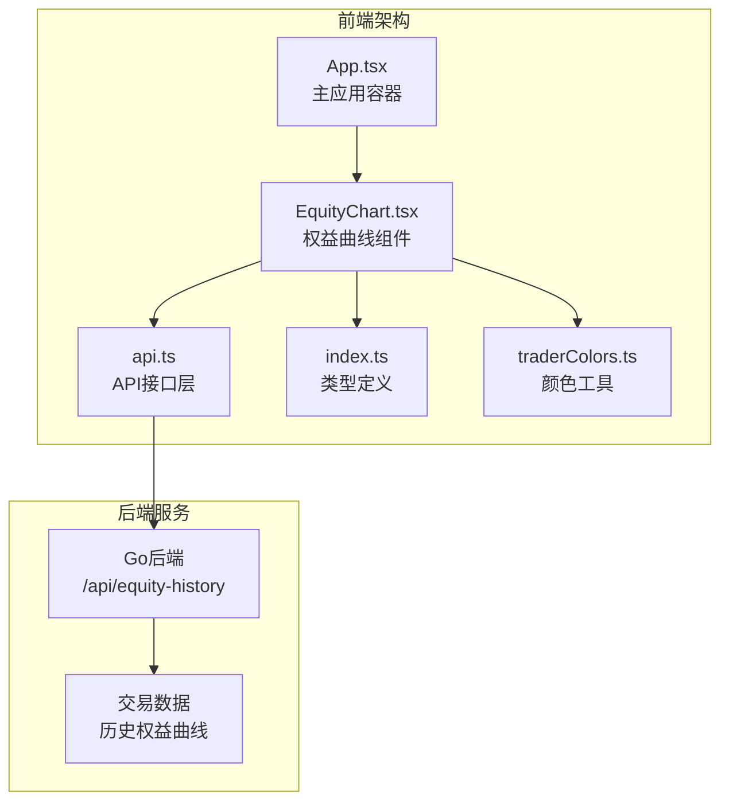
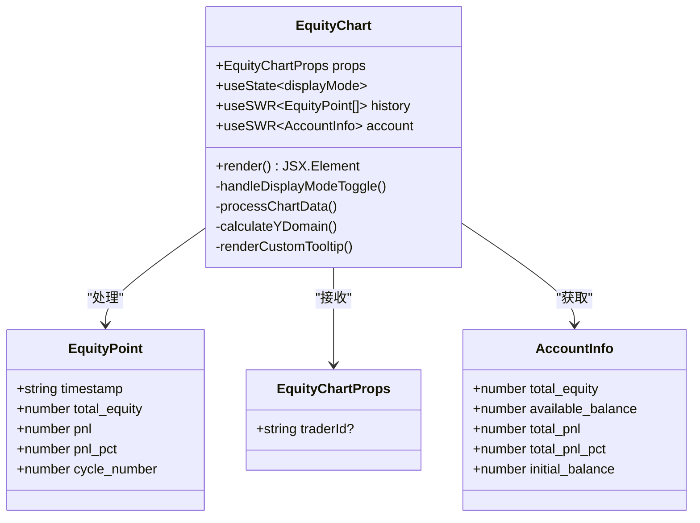
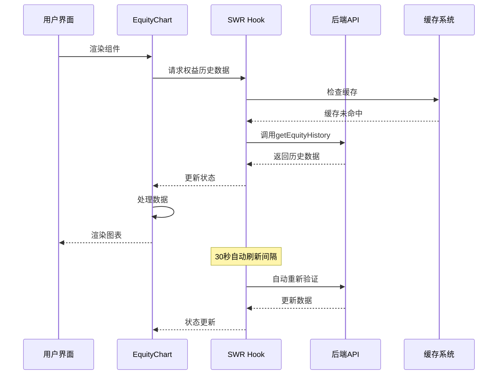
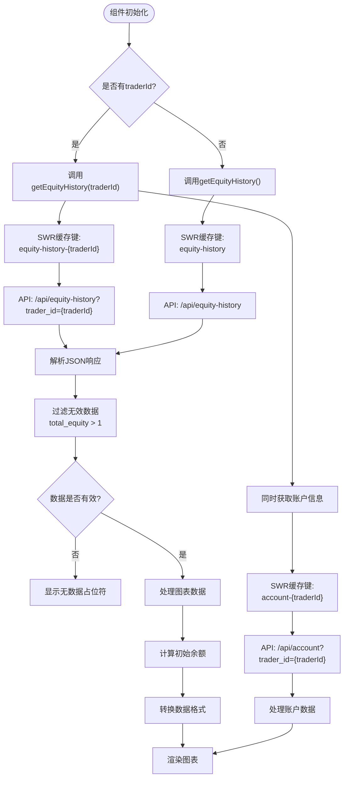
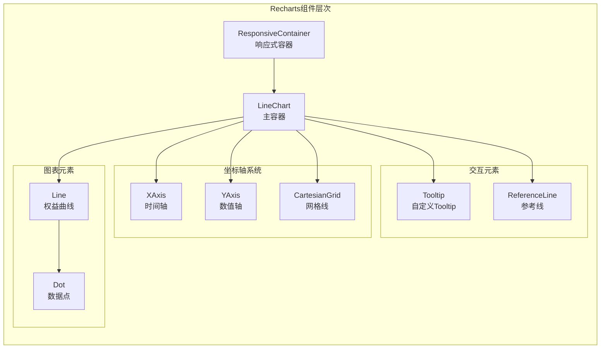
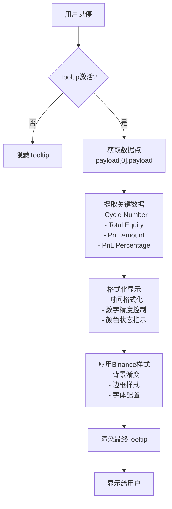
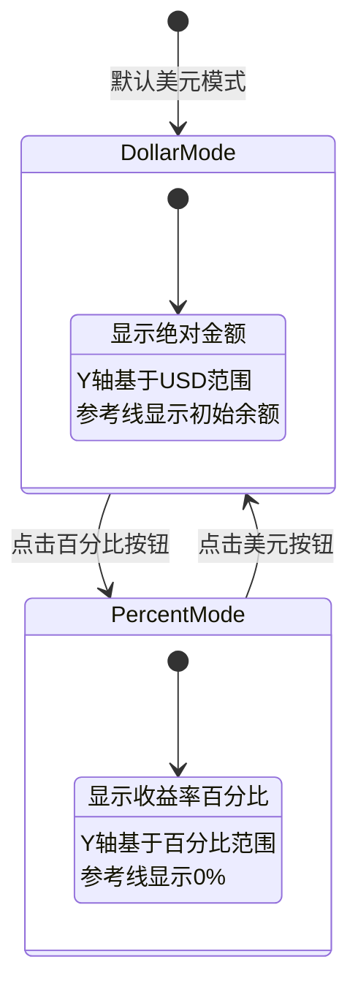
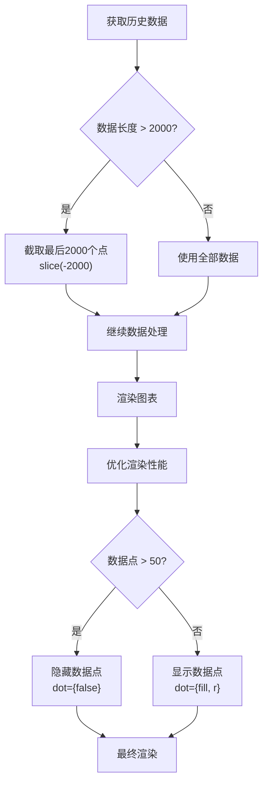
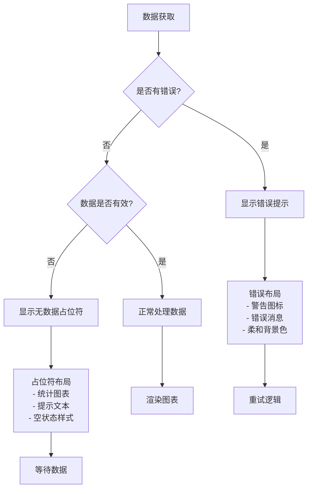
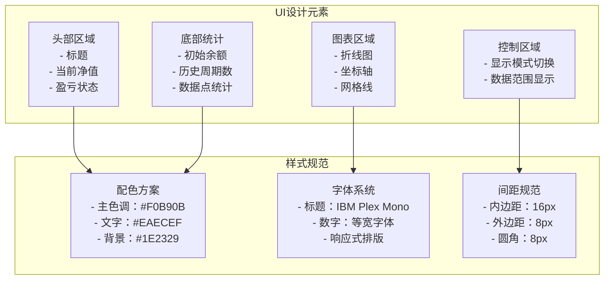

# 权益曲线组件详细文档

<cite>
**本文档引用的文件**
- [EquityChart.tsx](file://web/src/components/EquityChart.tsx)
- [api.ts](file://web/src/lib/api.ts)
- [index.ts](file://web/src/types/index.ts)
- [traderColors.ts](file://web/src/utils/traderColors.ts)
- [translations.ts](file://web/src/i18n/translations.ts)
- [App.tsx](file://web/src/App.tsx)
- [ComparisonChart.tsx](file://web/src/components/ComparisonChart.tsx)
</cite>

## 目录
1. [简介](#简介)
2. [项目架构概览](#项目架构概览)
3. [核心组件分析](#核心组件分析)
4. [数据获取与处理](#数据获取与处理)
5. [图表渲染与交互](#图表渲染与交互)
6. [显示模式与切换逻辑](#显示模式与切换逻辑)
7. [性能优化措施](#性能优化措施)
8. [错误处理机制](#错误处理机制)
9. [响应式设计与UI实现](#响应式设计与ui实现)
10. [最佳实践与总结](#最佳实践与总结)

## 简介

EquityChart组件是NOFX AI交易竞赛系统中的核心可视化组件，专门用于展示单个交易员的权益曲线。该组件通过集成Recharts库实现了高度可定制的动态折线图，支持美元和百分比两种显示模式，并提供了丰富的交互功能和响应式设计。

## 项目架构概览

EquityChart组件位于前端React应用的组件层，与后端API紧密协作，形成了完整的数据驱动可视化解决方案。

**图表来源**
- [App.tsx](file://web/src/App.tsx#L1-L50)
- [EquityChart.tsx](file://web/src/components/EquityChart.tsx#L1-L30)
- [api.ts](file://web/src/lib/api.ts#L1-L20)

**章节来源**
- [App.tsx](file://web/src/App.tsx#L1-L100)
- [EquityChart.tsx](file://web/src/components/EquityChart.tsx#L1-L50)

## 核心组件分析

### 组件结构与类型定义

EquityChart组件采用了现代化的React函数式组件设计，结合TypeScript提供了强类型安全保障。

**图表来源**
- [EquityChart.tsx](file://web/src/components/EquityChart.tsx#L13-L25)
- [index.ts](file://web/src/types/index.ts#L1-L30)

### 组件生命周期管理

组件使用SWR库进行数据获取和缓存管理，实现了智能的自动刷新和错误恢复机制。

**图表来源**
- [EquityChart.tsx](file://web/src/components/EquityChart.tsx#L26-L45)
- [api.ts](file://web/src/lib/api.ts#L90-L100)

**章节来源**
- [EquityChart.tsx](file://web/src/components/EquityChart.tsx#L20-L50)
- [api.ts](file://web/src/lib/api.ts#L85-L114)

## 数据获取与处理

### API接口调用机制

EquityChart通过api.ts中的getEquityHistory和getAccount方法获取所需数据，实现了高效的数据获取策略。

**图表来源**
- [EquityChart.tsx](file://web/src/components/EquityChart.tsx#L26-L50)
- [api.ts](file://web/src/lib/api.ts#L90-L105)

### 数据处理流程

组件实现了复杂的数据处理逻辑，包括初始余额计算、数据格式转换和Y轴范围动态计算。

**章节来源**
- [EquityChart.tsx](file://web/src/components/EquityChart.tsx#L50-L120)
- [api.ts](file://web/src/lib/api.ts#L90-L114)

## 图表渲染与交互

### Recharts集成与配置

EquityChart深度集成了Recharts库，实现了高度定制化的图表渲染效果。

**图表来源**
- [EquityChart.tsx](file://web/src/components/EquityChart.tsx#L217-L280)

### 自定义Tooltip实现

组件实现了Binance风格的自定义Tooltip，提供了丰富的数据展示功能。

**图表来源**
- [EquityChart.tsx](file://web/src/components/EquityChart.tsx#L140-L160)

**章节来源**
- [EquityChart.tsx](file://web/src/components/EquityChart.tsx#L217-L303)

## 显示模式与切换逻辑

### 双模式显示系统

EquityChart支持美元模式和百分比模式两种显示方式，用户可以实时切换查看不同视角的数据。

### Y轴范围动态计算

组件实现了智能的Y轴范围计算算法，确保图表在不同显示模式下都能提供最佳的视觉效果。

**章节来源**
- [EquityChart.tsx](file://web/src/components/EquityChart.tsx#L120-L140)
- [EquityChart.tsx](file://web/src/components/EquityChart.tsx#L160-L180)

## 性能优化措施

### 数据点限制策略

为了防止大量数据导致的性能问题，组件实施了严格的数据点限制策略。

**图表来源**
- [EquityChart.tsx](file://web/src/components/EquityChart.tsx#L75-L85)

### 缓存与刷新策略

组件采用了多层次的缓存和刷新策略，平衡了数据实时性和性能需求。

**章节来源**
- [EquityChart.tsx](file://web/src/components/EquityChart.tsx#L26-L50)
- [EquityChart.tsx](file://web/src/components/EquityChart.tsx#L75-L90)

## 错误处理机制

### 多层级错误处理

EquityChart实现了完善的错误处理机制，确保在各种异常情况下都能提供良好的用户体验。

**图表来源**
- [EquityChart.tsx](file://web/src/components/EquityChart.tsx#L50-L75)

### 错误提示设计

组件采用了符合Binance风格的错误提示设计，确保错误信息清晰易懂。

**章节来源**
- [EquityChart.tsx](file://web/src/components/EquityChart.tsx#L50-L75)
- [translations.ts](file://web/src/i18n/translations.ts#L240-L254)

## 响应式设计与UI实现

### Binance风格UI设计

EquityChart完全遵循Binance的设计语言，提供了专业的交易界面体验。

**图表来源**
- [EquityChart.tsx](file://web/src/components/EquityChart.tsx#L162-L216)
- [EquityChart.tsx](file://web/src/components/EquityChart.tsx#L280-L303)

### 响应式布局实现

组件实现了完整的响应式设计，能够在不同屏幕尺寸下提供最佳的用户体验。

**章节来源**
- [EquityChart.tsx](file://web/src/components/EquityChart.tsx#L162-L303)

## 最佳实践与总结

### 开发最佳实践

EquityChart组件体现了现代React开发的最佳实践，包括：

1. **类型安全**：使用TypeScript确保类型安全
2. **性能优化**：实施数据点限制和智能缓存
3. **错误处理**：提供完善的错误边界和用户反馈
4. **可访问性**：遵循Web可访问性标准
5. **测试友好**：模块化设计便于单元测试

### 架构优势

该组件的设计充分考虑了可扩展性和维护性：

- **单一职责**：专注于权益曲线可视化
- **松耦合**：与后端API和数据模型解耦
- **高内聚**：内部逻辑组织良好
- **可复用**：可在其他组件中复用

### 技术亮点

1. **智能数据处理**：自动过滤无效数据，智能计算初始余额
2. **动态样式**：根据数据状态动态调整颜色和样式
3. **交互丰富**：支持多种交互方式和自定义行为
4. **国际化支持**：完整的多语言支持
5. **性能监控**：内置性能指标和优化建议

**章节来源**
- [EquityChart.tsx](file://web/src/components/EquityChart.tsx#L1-L303)
- [api.ts](file://web/src/lib/api.ts#L1-L114)
- [App.tsx](file://web/src/App.tsx#L1-L100)